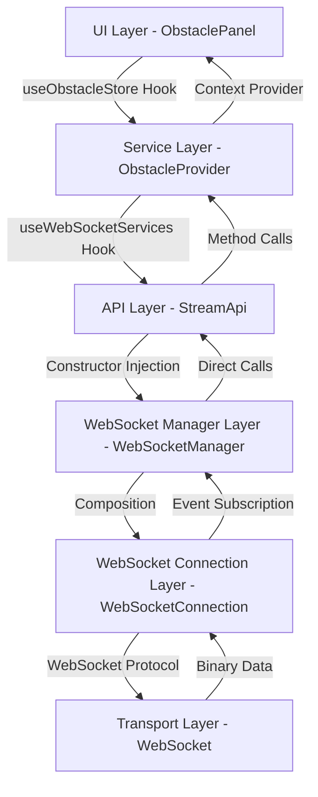
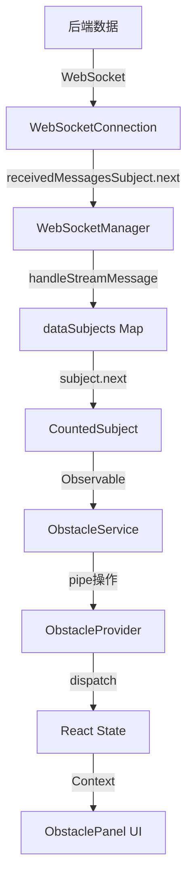

# Apollo Perception Obstacle 完整问答文档

## 目录
1. [Perception Obstacle Streaming 工作机制](#1-perception-obstacle-streaming-工作机制)
2. [数据格式详解](#2-数据格式详解)
3. [前端数据转换机制](#3-前端数据转换机制)
4. [订阅与推送流程](#4-订阅与推送流程)
5. [主连接控制消息](#5-主连接控制消息)
6. [Perception Obstacle Panel](#6-perception-obstacle-panel)
7. [实时障碍物显示](#7-实时障碍物显示)
8. [视觉效果详解](#8-视觉效果详解)

---

## 1. Perception Obstacle Streaming 工作机制

### 1.1 整体架构
Apollo的perception obstacle streaming采用**WebSocket + Cyber RT**的架构，实现了从感知模块到前端界面的实时障碍物数据流传输。

```
感知模块 → Cyber通道 → 后端ObstacleUpdater → WebSocket推送 → 前端订阅 → UI渲染
```

### 1.2 核心组件
- **ObstacleUpdater**: 负责订阅Cyber通道中的障碍物数据并推送给前端
- **SocketManager**: 管理WebSocket连接和消息处理
- **UpdaterManager**: 管理各种数据更新器

### 1.3 数据流程
1. **Cyber通道订阅**: `ObstacleUpdater`订阅`/apollo/perception/obstacles`通道
2. **数据转换**: 将`PerceptionObstacles`消息转换为前端可用的格式
3. **WebSocket推送**: 通过`/obstacle`端点推送给前端

### 1.4 关键文件
- **后端**: `obstacle_updater.cc`, `socket_manager.cc`, `data_handler.conf`
- **前端**: `obstacle.service.ts`, `ObstacleStore`, `websocket-manager.service.ts`
- **消息定义**: `perception_obstacle.proto`

---

## 2. 数据格式详解

### 2.1 数据流中的格式转换过程
整个数据流经历了多个格式转换阶段：

```
感知模块 → Cyber通道 → 后端转换 → WebSocket传输 → 前端反序列化 → UI显示
```

### 2.2 各阶段的数据格式

#### 2.2.1 感知模块输出格式 (PerceptionObstacles)
**源格式**: `apollo.perception.PerceptionObstacles` (Protobuf)

```protobuf
message PerceptionObstacles {
  repeated PerceptionObstacle perception_obstacle = 1;  // 障碍物数组
  optional apollo.common.Header header = 2;             // 消息头
  optional apollo.common.ErrorCode error_code = 3;     // 错误码
  optional LaneMarkers lane_marker = 4;                // 车道标记
  optional CIPVInfo cipv_info = 5;                     // 最近路径车辆
  repeated PerceptionWaste perception_waste = 6;       // 垃圾检测
}
```

#### 2.2.2 后端转换格式 (Object)
**中间格式**: `apollo.dreamview.Object` (Dreamview专用格式)

```protobuf
message Object {
  string id = 1;                    // 障碍物ID
  string type = 2;                  // 障碍物类型
  string sub_type = 3;              // 子类型
  apollo.common.Point3D position = 4; // 3D位置
  double length = 5;                // 长度
  double width = 6;                 // 宽度
  double height = 7;                // 高度
  double theta = 8;                 // 朝向角
  apollo.common.Point3D velocity = 9; // 速度
  double confidence = 10;           // 置信度
}
```

#### 2.2.3 WebSocket传输格式 (StreamData)
**传输格式**: `apollo.dreamview.StreamData` (二进制Protobuf)

```protobuf
message StreamData {
  string name = 1;                  // 数据流名称
  bytes data = 2;                   // 二进制数据
  string channel = 3;               // 通道名称
  int64 timestamp = 4;              // 时间戳
}
```

---

## 3. 前端数据转换机制

### 3.1 前端数据转换的整体架构
前端数据转换采用**多层级、异步、Worker化**的架构：

```
WebSocket接收 → Worker反序列化 → RxJS流处理 → 业务层转换 → UI状态更新
```

### 3.2 数据转换的详细流程

#### 3.2.1 WebSocket数据接收阶段
**位置**: `WebSocketManager.connectChildSocket()`

```typescript
this.activeWorkers[name].socketMessage$
    .pipe(throttle(() => timer(this.throttleDuration.value)))
    .subscribe((message) => {
        if (isMessageType(message, 'SOCKET_MESSAGE')) {
            const { data } = message.payload as StreamMessage;
            
            // 将二进制数据发送到Worker进行反序列化
            this.workerPoolManager.dispatchTask({
                type: 'DECODE_MESSAGE',
                payload: data,
                transferList: [data.buffer]
            });
        }
    });
```

#### 3.2.2 Worker反序列化阶段
**位置**: `decoder.worker.ts`

```typescript
// Worker中的反序列化逻辑
self.onmessage = function(e) {
    const { type, payload } = e.data;
    
    if (type === 'DECODE_MESSAGE') {
        try {
            // 使用Protobuf解码
            const message = StreamData.decode(payload);
            const obstacleData = PerceptionObstacles.decode(message.data);
            
            // 发送解码后的数据
            self.postMessage({
                type: 'DECODE_SUCCESS',
                payload: obstacleData
            });
        } catch (error) {
            self.postMessage({
                type: 'DECODE_ERROR',
                payload: error.message
            });
        }
    }
};
```

#### 3.2.3 业务层转换阶段
**位置**: `ObstacleService.subscribeToObstacles()`

```typescript
subscribeToObstacles(channelName: string): Observable<ObstacleData> {
    return this.streamApi
        .subscribeToDataWithChannel<apollo.perception.IPerceptionObstacles>(
            StreamDataNames.Obstacle, 
            channelName
        )
        .pipe(
            // 第一层转换：Protobuf → 业务数据格式
            map((data: apollo.perception.IPerceptionObstacles) => ({
                obstacles: data.perception_obstacle || [],
                timestamp: data.header?.timestamp_sec || Date.now() / 1000,
                channelName
            })),
            // 第二层转换：过滤和验证
            filter(data => data.obstacles.length > 0),
            // 第三层转换：错误处理
            catchError(error => {
                console.error('Obstacle data error:', error);
                return EMPTY;
            })
        );
}
```

---

## 4. 订阅与推送流程

### 4.1 前端订阅流程详解

#### 4.1.1 应用初始化阶段
**步骤1: 应用启动**
```typescript
// App.tsx
export function App() {
    const Providers = [
        <WebSocketManagerProvider key='WebSocketManagerProvider' />,
        <ObstacleProvider key='ObstacleProvider' />,
        // ... 其他Provider
    ];
    return <CombineContext providers={Providers}>...</CombineContext>;
}
```

**步骤2: WebSocket连接建立**
```typescript
// WebSocketManager初始化
constructor(mainUrl: string = config.mainUrl, pluginUrl: string = config.pluginUrl) {
    this.mainConnection = new WebSocketConnection(mainUrl);  // 主连接: 控制消息
    this.pluginConnection = new WebSocketConnection(pluginUrl); // 插件连接: 插件数据
}
```

#### 4.1.2 障碍物数据订阅
**步骤3: 创建子连接**
```typescript
// 创建障碍物数据流连接
const childSocket = this.connectChildSocket('obstacle', {
    name: StreamDataNames.Obstacle,
    channel: channelName
});
```

**步骤4: 数据订阅**
```typescript
// ObstacleStore中的数据订阅
useEffect(() => {
    if (!obstacleService || !state.currentChannel) return;
    
    dispatch({ type: 'SET_LOADING', payload: true });
    
    const subscription = obstacleService
        .subscribeToObstacles(state.currentChannel)
        .subscribe({
            next: (data: ObstacleData) => {
                dispatch({ type: 'SET_OBSTACLES', payload: data.obstacles });
            },
            error: (error) => {
                dispatch({ type: 'SET_ERROR', payload: error.message });
            }
        });
    
    return () => subscription.unsubscribe();
}, [obstacleService, state.currentChannel]);
```

### 4.2 后端推送流程详解

#### 4.2.1 Cyber通道订阅
```cpp
// modules/dreamview_plus/backend/obstacle_updater/obstacle_updater.cc
void ObstacleUpdater::OnObstacles(
    const std::shared_ptr<PerceptionObstacles>& obstacles,
    const std::string& channel_name) {
    
    // 转换数据格式
    auto simulation_world = std::make_shared<SimulationWorld>();
    SetObstacleInfo(obstacles, simulation_world.get());
    
    // 推送到WebSocket
    SendToClients(simulation_world);
}
```

#### 4.2.2 WebSocket推送
```cpp
void ObstacleUpdater::SendToClients(
    const std::shared_ptr<SimulationWorld>& simulation_world) {
    
    // 序列化为二进制数据
    std::string serialized_data;
    simulation_world->SerializeToString(&serialized_data);
    
    // 通过WebSocket推送
    socket_manager_->SendToClients("/obstacle", serialized_data);
}
```

---

## 5. 主连接控制消息

### 5.1 主连接架构
**主连接** (`mainConnection`) 是Apollo Dreamview Plus的核心控制通道，负责处理**非流式数据**的控制消息：

```typescript
// WebSocketManager初始化
constructor(mainUrl: string = config.mainUrl, pluginUrl: string = config.pluginUrl) {
    this.mainConnection = new WebSocketConnection(mainUrl);  // 主连接: 控制消息
    this.pluginConnection = new WebSocketConnection(pluginUrl); // 插件连接: 插件数据
}
```

### 5.2 控制消息处理流程

#### 5.2.1 消息发送机制
**位置**: `WebSocketConnection.sendMessage()`

```typescript
sendMessage<T>(message: RequestMessage<T> | RequestStreamMessage) {
    this.messageQueue.enqueue(message);  // 消息入队
    if (this.isConnected()) {
        this.consumeMessageQueue();      // 消费消息队列
    }
}

private consumeMessageQueue() {
    const idleConsume = () => {
        while (!this.messageQueue.isEmpty() && this.isConnected()) {
            const message = this.messageQueue.dequeue();
            if (message) {
                this.socket.next(message);  // 发送到WebSocket
            }
        }
    };
    requestIdleCallback(idleConsume, { timeout: 2000 }); // 浏览器空闲时处理
}
```

### 5.3 具体控制消息例子

#### 5.3.1 HMI模式切换控制消息
**场景**: 用户切换自动驾驶模式（如从Default切换到Perception模式）

```typescript
// modules/dreamview_plus/frontend/packages/dreamview-core/src/store/HmiStore/actions.ts
export const changeMode = (
    mainApi: MainApi,
    payload: CURRENT_MODE,  // 'Perception', 'Pnc', 'Vehicle Test' 等
    callback?: (mode: CURRENT_MODE) => void,
): AsyncAction<IInitState, ChangeModeAction> => {
    return async (_dispatch, state) => {
        logger.debug('changeMode', { state, payload });
        await mainApi.changeSetupMode(payload);  // 发送控制消息到后端
        if (callback) {
            callback(payload);
        }
    };
};
```

#### 5.3.2 面板插件初始化控制消息
**场景**: 获取远程面板插件配置

```typescript
// PanelCatalogProvider中
useEffect(() => {
    if (isMainConnected) {
        mainApi
            .getPanelPluginInitData()  // 发送控制消息获取面板配置
            .then((remotePanels) =>
                remotePanels.reduce((result: any, panels: any) => [...result, ...panels.value], [])
            )
            .then((remotePanels) => getAllPanels(remotePanels, t, imgSrc))
            .catch(() => getAllPanels([], t, imgSrc))
            .then((panels) => {
                setAllPanel(panels);  // 更新面板列表
            });
    }
}, [isMainConnected, mainApi, t, imgSrc]);
```

---

## 6. Perception Obstacle Panel

### 6.1 面板概述
**Perception Obstacle Panel** 是Apollo Dreamview Plus中专门用于**实时显示和管理感知障碍物数据**的核心面板组件。

### 6.2 面板架构

#### 6.2.1 组件层次结构
```
ObstaclePanelWrapper
├── ObstaclePanel (主组件)
│   ├── Panel Header (面板头部)
│   │   ├── 标题显示
│   │   └── 控制按钮
│   ├── Filter Panel (过滤器面板)
│   ├── Obstacle List (障碍物列表)
│   └── Details Panel (详情面板)
└── Panel (基础面板包装器)
```

#### 6.2.2 核心组件
**主组件**: `ObstaclePanel`
```typescript
interface ObstaclePanelProps {
  onObstacleSelect?: (obstacle: apollo.perception.IPerceptionObstacle) => void;
  className?: string;
}
```

### 6.3 功能特性

#### 6.3.1 实时障碍物显示
**数据源**: 通过`ObstacleService`订阅实时障碍物数据流

```typescript
// 订阅障碍物数据
const subscription = obstacleService
  .subscribeToObstacles(state.currentChannel)
  .subscribe({
    next: (data: ObstacleData) => {
      dispatch({ type: 'SET_OBSTACLES', payload: data.obstacles });
    }
  });
```

**显示信息**:
- **障碍物ID**: 唯一标识符
- **类型**: 车辆、行人、自行车等
- **子类型**: 轿车、卡车、公交车等
- **位置**: 3D坐标 (x, y, z)
- **置信度**: 检测置信度百分比

#### 6.3.2 交互式障碍物选择
```typescript
// 障碍物点击处理
const handleObstacleClick = (obstacle: apollo.perception.IPerceptionObstacle) => {
  dispatch({ type: 'SELECT_OBSTACLE', payload: obstacle });
  onObstacleSelect?.(obstacle);  // 回调通知父组件
};

// 障碍物悬停处理
const handleObstacleHover = (obstacle: apollo.perception.IPerceptionObstacle | null) => {
  setHoveredObstacle(obstacle);
};
```

#### 6.3.3 智能过滤系统
**过滤器类型**:
- **类型过滤**: 按障碍物类型筛选
- **置信度过滤**: 设置最小置信度阈值
- **距离过滤**: 设置最大检测距离

```typescript
// 过滤器处理
const handleFilterChange = (filterType: string, value: any) => {
  dispatch({ 
    type: 'SET_FILTERS', 
    payload: { [filterType]: value } 
  });
};

// 过滤后的障碍物
const filteredObstacles = useMemo(() => {
  return filterObstacles(state.obstacles, state.filters);
}, [state.obstacles, state.filters]);
```

### 6.4 状态管理

#### 6.4.1 状态结构
```typescript
interface ObstacleState {
  obstacles: apollo.perception.IPerceptionObstacle[];  // 障碍物列表
  selectedObstacle: apollo.perception.IPerceptionObstacle | null;  // 选中障碍物
  isVisible: boolean;         // 可见性
  currentChannel: string | null;  // 当前通道
  loading: boolean;           // 加载状态
  error: string | null;       // 错误信息
  filters: {                  // 过滤器配置
    types: string[];
    minConfidence: number;
    maxDistance: number;
  };
}
```

---

## 7. 实时障碍物显示

### 7.1 实时障碍物显示的主要Panel
Apollo中实时障碍物显示主要在**两个Panel**中实现：

#### 7.1.1 ObstaclePanel (障碍物列表面板)
- **位置**: Perception模式布局的右下角
- **功能**: 以列表形式显示障碍物详细信息
- **显示方式**: 文本列表 + 颜色编码

#### 7.1.2 VehicleViz (车辆可视化面板) 
- **位置**: Perception模式布局的左上角（主要3D可视化区域）
- **功能**: 3D场景中实时渲染障碍物
- **显示方式**: 3D图形渲染 + 空间位置

### 7.2 ObstaclePanel 的实时显示机制

#### 7.2.1 数据订阅流程
```typescript
// ObstaclePanel中的数据订阅
const subscription = obstacleService
  .subscribeToObstacles(state.currentChannel)  // 订阅障碍物数据流
  .subscribe({
    next: (data: ObstacleData) => {
      dispatch({ type: 'SET_OBSTACLES', payload: data.obstacles });
    },
    error: (error) => {
      dispatch({ type: 'SET_ERROR', payload: error.message });
    }
  });
```

#### 7.2.2 实时渲染实现
```typescript
// 障碍物列表实时渲染
<div className="obstacle-list">
  {filteredObstacles.map((obstacle) => {
    const bounds = calculateObstacleBounds(obstacle);  // 计算边界框
    const color = getObstacleColor(obstacle);          // 获取颜色
    const isSelected = state.selectedObstacle?.id === obstacle.id;
    const isHovered = hoveredObstacle?.id === obstacle.id;
    
    return (
      <div
        key={obstacle.id}
        className={`obstacle-item ${isSelected ? 'selected' : ''} ${isHovered ? 'hovered' : ''}`}
        onClick={() => handleObstacleClick(obstacle)}
        onMouseEnter={() => handleObstacleHover(obstacle)}
        onMouseLeave={() => handleObstacleHover(null)}
        style={{ borderLeftColor: color }}  // 颜色编码边框
      >
        <div className="obstacle-info">
          <div className="obstacle-id">ID: {obstacle.id || 'N/A'}</div>
          <div className="obstacle-type">
            {getObstacleTypeDisplayName(obstacle.type || 'UNKNOWN')}
            {obstacle.sub_type && (
              <span className="obstacle-subtype">
                ({getObstacleSubTypeDisplayName(obstacle.sub_type)})
              </span>
            )}
          </div>
          <div className="obstacle-position">
            ({bounds.center.x?.toFixed(2)}, {bounds.center.y?.toFixed(2)})
          </div>
          <div className="obstacle-confidence">
            {((obstacle.confidence || 0) * 100).toFixed(1)}%
          </div>
        </div>
      </div>
    );
  })}
</div>
```

### 7.3 颜色编码系统

#### 7.3.1 障碍物类型颜色映射
```typescript
export const OBSTACLE_TYPE_COLORS = {
  UNKNOWN: '#808080',        // 灰色 - 未知类型
  UNKNOWN_MOVABLE: '#FFA500', // 橙色 - 未知可移动
  UNKNOWN_UNMOVABLE: '#8B4513', // 棕色 - 未知不可移动
  PEDESTRIAN: '#FF0000',     // 红色 - 行人
  BICYCLE: '#00FF00',        // 绿色 - 自行车
  VEHICLE: '#0000FF',         // 蓝色 - 车辆
};
```

#### 7.3.2 障碍物子类型颜色映射
```typescript
export const OBSTACLE_SUBTYPE_COLORS = {
  ST_UNKNOWN: '#808080',     // 灰色
  ST_CAR: '#0000FF',         // 蓝色 - 轿车
  ST_VAN: '#4169E1',         // 皇家蓝 - 面包车
  ST_TRUCK: '#191970',       // 深蓝色 - 卡车
  ST_BUS: '#000080',         // 海军蓝 - 公交车
  ST_CYCLIST: '#00FF00',     // 绿色 - 骑行者
  ST_MOTORCYCLIST: '#32CD32', // 酸橙绿 - 摩托车手
  ST_PEDESTRIAN: '#FF0000',  // 红色 - 行人
  ST_TRAFFICCONE: '#FFD700', // 金色 - 交通锥
};
```

---

## 8. 视觉效果详解

### 8.1 整体视觉设计

#### 8.1.1 面板外观
```
┌─────────────────────────────────────────────────────────────┐
│  Perception Obstacles (5)                    [🔍] [✓] Show │
├─────────────────────────────────────────────────────────────┤
│  ┌─────────────────────────────────────────────────────────┐ │
│  │ 🟦 ID: 12345                                           │ │
│  │    Vehicle (Car)                                       │ │
│  │    (12.34, -5.67)                                      │ │
│  │    85.2%                                               │ │
│  └─────────────────────────────────────────────────────────┘ │
│  ┌─────────────────────────────────────────────────────────┐ │
│  │ �� ID: 12346                                           │ │
│  │    Pedestrian                                          │ │
│  │    (8.91, 2.34)                                        │ │
│  │    92.1%                                               │ │
│  └─────────────────────────────────────────────────────────┘ │
│  ┌─────────────────────────────────────────────────────────┐ │
│  │ 🟩 ID: 12347                                           │ │
│  │    Bicycle                                             │ │
│  │    (-3.45, 7.89)                                       │ │
│  │    78.5%                                               │ │
│  └─────────────────────────────────────────────────────────┘ │
├─────────────────────────────────────────────────────────────┤
│  Selected Obstacle Details                                  │
│  ┌─────────────────────────────────────────────────────────┐ │
│  │ ID: 12345                                               │ │
│  │ Type: VEHICLE                                           │ │
│  │ Speed: 15.23 m/s                                        │ │
│  │ Confidence: 85.2%                                       │ │
│  └─────────────────────────────────────────────────────────┘ │
└─────────────────────────────────────────────────────────────┘
```

### 8.2 颜色编码系统

#### 8.2.1 障碍物类型颜色映射
```typescript
// 左侧边框颜色编码
🟦 蓝色 (#0000FF) - VEHICLE (车辆)
�� 红色 (#FF0000) - PEDESTRIAN (行人)  
🟩 绿色 (#00FF00) - BICYCLE (自行车)
🟨 橙色 (#FFA500) - UNKNOWN_MOVABLE (未知可移动)
🟫 棕色 (#8B4513) - UNKNOWN_UNMOVABLE (未知不可移动)
⚪ 灰色 (#808080) - UNKNOWN (未知)
```

### 8.3 用户能看到的具体信息

#### 8.3.1 每个障碍物项目显示的信息
**障碍物卡片结构**:
```
┌─────────────────────────────────────────────────────────────┐
│ 🟦 ID: 12345                    ← 障碍物唯一标识符          │
│    Vehicle (Car)                ← 类型 + 子类型             │
│    (12.34, -5.67)              ← 3D坐标位置 (x, y)         │
│    85.2%                        ← 检测置信度百分比          │
└─────────────────────────────────────────────────────────────┘
```

**详细信息**:
- **ID**: 障碍物唯一标识符 (如: 12345)
- **类型**: 主要类型 (Vehicle, Pedestrian, Bicycle等)
- **子类型**: 具体子类型 (Car, Truck, Bus等)
- **位置**: 3D坐标 (x, y, z) 精确到小数点后2位
- **置信度**: 检测置信度百分比 (0-100%)

### 8.4 交互视觉效果

#### 8.4.1 悬停效果 (Hover)
```css
&:hover {
  background: #333;           /* 背景变亮 */
  transform: translateX(2px); /* 向右移动2px */
}
```
**视觉效果**: 鼠标悬停时，障碍物卡片背景变亮，并向右轻微移动

#### 8.4.2 选中效果 (Selected)
```css
&.selected {
  background: #1e3a8a;        /* 蓝色背景 */
  border-left-color: #3b82f6; /* 蓝色左边框 */
}
```
**视觉效果**: 选中的障碍物卡片背景变为深蓝色，左边框变为亮蓝色

#### 8.4.3 悬停阴影效果
```css
&.hovered {
  box-shadow: 0 2px 8px rgba(0, 0, 0, 0.3); /* 阴影效果 */
}
```
**视觉效果**: 悬停时添加阴影，增强立体感

### 8.5 状态指示

#### 8.5.1 加载状态
```
┌─────────────────────────────────────────────────────────────┐
│                    ⏳ Loading obstacles...                  │
└─────────────────────────────────────────────────────────────┘
```

#### 8.5.2 错误状态
```
┌─────────────────────────────────────────────────────────────┐
│                    ⚠️ Error: Connection failed              │
└─────────────────────────────────────────────────────────────┘
```

#### 8.5.3 无数据状态
```
┌─────────────────────────────────────────────────────────────┐
│                    📭 No obstacles detected                 │
└─────────────────────────────────────────────────────────────┘
```

---

## 总结

Apollo Perception Obstacle系统通过以下核心机制实现：

### 核心架构
1. **WebSocket + Cyber RT**: 实现实时数据流传输
2. **双Panel协作**: ObstaclePanel + VehicleViz 协同显示
3. **分层数据转换**: 多层级格式转换确保数据完整性
4. **状态管理**: React状态管理 + RxJS流处理

### 关键特性
- **实时性**: 10-30Hz的实时数据更新
- **可视化**: 颜色编码 + 3D渲染 + 交互选择
- **过滤功能**: 类型、置信度、距离多维度过滤
- **错误处理**: 完善的错误恢复和状态指示

### 用户体验
- **直观显示**: 深色主题 + 专业界面设计
- **交互友好**: 悬停、选择、过滤等丰富交互
- **信息丰富**: ID、类型、位置、置信度等详细信息
- **响应式**: 适配不同屏幕尺寸

这个系统为Apollo自动驾驶平台提供了**高效、直观、可靠**的障碍物监控解决方案。


梳理 WebSocket Service、Stream API、WebSocket Manager 的关系与分层架构。


[8 tools called]

## 总结

WebSocket Service、Stream API、WebSocket Manager 的分层关系如下：

### 分层架构

1. **UI Layer** - React 组件
2. **Service Layer** - 业务逻辑（如 ObstacleService）
3. **API Layer** - 统一接口（StreamApi、MainApi、PluginApi）
4. **WebSocket Manager Layer** - 连接与消息管理
5. **WebSocket Connection Layer** - 底层连接实现
6. **Transport Layer** - WebSocket 协议

### 核心关系

- **WebSocketManager**：单例，管理连接、订阅、消息路由
- **StreamApi**：对 WebSocketManager 的封装，提供类型安全接口
- **ObstacleService**：使用 StreamApi 实现业务逻辑

### 数据流向

```
后端 → WebSocket → WebSocketConnection → WebSocketManager → StreamApi → Service → UI
```

### 设计模式

- **单例模式**：WebSocketManager
- **观察者模式**：RxJS Observable
- **工厂模式**：WorkerFactory、ConnectionManager
- **策略模式**：PluginManager

### 性能优化

- **连接复用**：主连接 + 子连接
- **消息队列**：防抖与节流
- **Worker 池**：异步解码
- **数据缓存**：IndexedDB

该架构职责清晰，便于维护与扩展。

梳理前端订阅 perception obstacle 的主连接与子连接，以及从 panel 建立连接的流程。


[9 tools called]

## 总结

前端订阅 perception obstacle 的连接架构：

### 主连接 (Main Connection)
- **URL**: `ws://localhost:8888/websocket`
- **作用**: 控制消息、订阅管理、状态同步
- **消息类型**: 订阅/取消订阅、元数据请求
- **生命周期**: 应用启动时建立，应用关闭时断开

### 子连接 (Child Connection)
- **URL**: `ws://localhost:8888/obstacle`
- **作用**: 数据流传输、实时障碍物数据
- **消息类型**: 障碍物数据流
- **生命周期**: 按需建立，无订阅者时断开

### 从 Panel 建立连接的流程

1. **Panel 初始化**
   ```typescript
   useEffect(() => {
       dispatch({ type: 'SET_CHANNEL', payload: '/apollo/perception/obstacles' });
   }, []);
   ```

2. **Service 层订阅**
   ```typescript
   const subscription = obstacleService
       .subscribeToObstacles(state.currentChannel)
       .subscribe({ next: (data) => setObstacles(data.obstacles) });
   ```

3. **StreamApi 委托**
   ```typescript
   return webSocketManager.subscribeToDataWithChannel<PerceptionObstacles>(
       StreamDataNames.Obstacle, channelName
   );
   ```

4. **WebSocketManager 处理**
   ```typescript
   // 初始化子连接
   this.initChildSocket(name);
   // 通过主连接发送订阅消息
   this.sendSubscriptionMessage(SUBSCRIBE_MESSAGE_TYPE, name, channel);
   // 建立子连接
   this.connectChildSocket(name);
   ```

5. **连接建立**
   - 主连接: 发送订阅控制消息
   - 子连接: 建立数据流连接
   - 数据流: 通过 RxJS 传递到 UI

### 架构优势
- **控制与数据分离**: 主连接处理控制，子连接处理数据
- **性能优化**: 避免控制消息干扰数据流
- **连接复用**: 按数据名称复用子连接
- **异步处理**: 使用 Web Worker 处理数据解码

该架构实现了控制与数据分离，提升了性能与可维护性。

分析 VehicleViz panel 如何订阅 perception obstacle 流并接收消息。


[15 tools called]

## VehicleViz Panel 障碍物订阅分析

VehicleViz Panel 不直接订阅 perception obstacle 流，而是通过订阅 `SIM_WORLD` 获取包含障碍物的仿真数据。

### 1. 订阅架构

**数据流层次**:
```
后端 → SIM_WORLD → VehicleViz Panel → CarViz 渲染
```

**订阅方式**:
- 通过 PanelContext 的 `subscribeToData`
- 直接使用 `streamApi.subscribeToDataWithChannel`

### 2. 订阅 SIM_WORLD 数据

```typescript
// VehicleViz/index.tsx
const { logger, panelId, subscribeToData, updateChannel, setKeyDownHandlers, removeKeyDownHandlers } = panelContext;

// 订阅 SIM_WORLD 数据
const simWorldConnectedSubj = subscribeToData({ 
    name: StreamDataNames.SIM_WORLD, 
    needChannel: false 
});

if (simWorldConnectedSubj) {
    simWorldConnectedSubscription = simWorldConnectedSubj.subscribe((simData: ISimulationWorld) => {
        if (!simData) return;
        
        // 处理仿真世界数据，包含障碍物信息
        if (Object.keys(simData).length !== 0) {
            carviz.updateData(filterSimData(simData));
        }
    });
}
```

### 3. PanelContext 的 subscribeToData 实现

```typescript
// Panel.tsx
function subscribeHandler<T>(newChannelInfo: SubscribeInfo) {
    let newConnectedSubj: CountedSubject<T>;
    
    if (newChannelInfo?.needChannel) {
        // 需要指定通道的订阅
        if (newChannelInfo?.name && newChannelInfo?.channel) {
            if (newChannelInfo?.channel === 'default') {
                newConnectedSubj = streamApi.subscribeToDataWithChannelFuzzy(newChannelInfo?.name);
            } else {
                newConnectedSubj = streamApi.subscribeToDataWithChannel(
                    newChannelInfo?.name,
                    newChannelInfo?.channel,
                );
            }
        }
    } else {
        // 不需要指定通道的订阅
        newConnectedSubj = streamApi.subscribeToData(newChannelInfo?.name);
    }
    
    return newConnectedSubj;
}
```

### 4. 连接建立流程

**初始化流程**:
```
1. VehicleViz 组件挂载
   ↓
2. 获取 PanelContext (包含 subscribeToData)
   ↓
3. 调用 subscribeToData({ name: StreamDataNames.SIM_WORLD, needChannel: false })
   ↓
4. Panel.tsx 中的 subscribeHandler 处理
   ↓
5. 调用 streamApi.subscribeToData(StreamDataNames.SIM_WORLD)
   ↓
6. WebSocketManager 建立连接
   ↓
7. 开始接收 SIM_WORLD 数据流
```

**数据接收流程**:
```
1. 后端发送 SIM_WORLD 数据
   ↓
2. WebSocket 接收数据
   ↓
3. WebSocketManager 处理消息
   ↓
4. StreamApi 分发数据
   ↓
5. Panel 的 subscribeToData 接收数据
   ↓
6. VehicleViz 订阅回调处理数据
   ↓
7. CarViz 渲染障碍物
```

### 5. 与直接订阅 Obstacle 的区别

**VehicleViz 方式 (间接订阅)**:
```typescript
// 订阅 SIM_WORLD，包含障碍物数据
const simWorldSubj = subscribeToData({ 
    name: StreamDataNames.SIM_WORLD, 
    needChannel: false 
});

simWorldSubj.subscribe((simData: ISimulationWorld) => {
    // 处理包含障碍物的完整仿真数据
    carviz.updateData(simData);
});
```

**ObstaclePanel 方式 (直接订阅)**:

```typescript
// 直接订阅障碍物数据
const obstacleSubj = streamApi.subscribeToDataWithChannel<PerceptionObstacles>(
    StreamDataNames.Obstacle, 
    channelName
);

obstacleSubj.subscribe((obstacleData: PerceptionObstacles) => {
    // 直接处理障碍物数据
    setObstacles(obstacleData.perception_obstacle);
});
```

### 6. 优势分析

**VehicleViz 方式的优势**:
- 数据一致：障碍物与车辆位置、规划轨迹同步
- 渲染效率：一次性更新相关数据，减少多次渲染
- 数据完整：包含完整仿真世界状态

**直接订阅方式的优势**:
- 实时性：直接接收障碍物数据，延迟更低
- 纯净性：仅接收障碍物数据
- 灵活性：可独立处理障碍物数据

### 7. 性能考虑

**数据量对比**:
- SIM_WORLD：包含完整仿真数据，数据量较大
- Obstacle：仅包含障碍物数据，数据量较小

**更新频率**:
- SIM_WORLD：通常以较低频率更新（如 10Hz）
- Obstacle：可以以较高频率更新（如 20Hz）

**渲染优化**:
```typescript
// VehicleViz 中的节流处理
const throttleFunc = throttle(
    (simData: ISimulationWorld) => {
        // 处理数据更新
        carviz.updateData(filterSimData(simData));
    },
    500,  // 500ms 节流
    { leading: true }
);
```

### 8. 总结

**VehicleViz 订阅特点**:
- 间接订阅：通过 SIM_WORLD 获取障碍物数据
- 数据完整：包含完整仿真世界状态
- 渲染优化：一次性更新相关数据

**数据流向**:
```
Perception Obstacle → ObstacleUpdater → SIM_WORLD → VehicleViz → CarViz
```

**适用场景**:
- 3D 可视化：需要完整仿真世界状态
- 实时渲染：需要障碍物与车辆位置同步
- 性能优化：通过节流控制更新频率

VehicleViz Panel 通过订阅 SIM_WORLD 获取障碍物信息，数据量更大，但数据一致性和渲染效率更好。

分析 ObstaclePanel 的直接订阅方式，并梳理 WebSocket 端点、订阅消息格式及后端处理函数。


[16 tools called]

## ObstaclePanel 直接订阅方式

### 1. 订阅架构

**数据流层次**:
```
后端 PerceptionObstacles → ObstacleUpdater → WebSocket → ObstaclePanel
```

**订阅方式**:
- 通过 `ObstacleService` 直接订阅障碍物数据
- 使用 `streamApi.subscribeToDataWithChannel` 指定通道

### 2. 前端订阅流程

#### 2.1 ObstaclePanel 组件
```typescript
// ObstaclePanel/index.tsx
const ObstaclePanel: React.FC<ObstaclePanelProps> = ({ onObstacleSelect, className }) => {
  const { state, dispatch } = useObstacleStore();
  
  // 处理通道选择
  const handleChannelChange = (channel: string) => {
    dispatch({ type: 'SET_CHANNEL', payload: channel });
  };
  
  // 处理障碍物选择
  const handleObstacleClick = (obstacle: apollo.perception.IPerceptionObstacle) => {
    dispatch({ type: 'SELECT_OBSTACLE', payload: obstacle });
    onObstacleSelect?.(obstacle);
  };
};
```

#### 2.2 ObstacleStore 状态管理
```typescript
// ObstacleStore/index.tsx
export const ObstacleProvider: React.FC<{ children: React.ReactNode }> = ({ children }) => {
  const [state, dispatch] = useReducer(obstacleReducer, initialState);
  const { streamApi } = useWebSocketServices();
  const [obstacleService] = useState(() => streamApi ? new ObstacleService(streamApi) : null);

  // 订阅障碍物数据
  useEffect(() => {
    if (!obstacleService || !state.currentChannel) return;

    dispatch({ type: 'SET_LOADING', payload: true });

    const subscription = obstacleService
      .subscribeToObstacles(state.currentChannel)
      .subscribe({
        next: (data: ObstacleData) => {
          dispatch({ type: 'SET_OBSTACLES', payload: data.obstacles });
        },
        error: (error) => {
          dispatch({ type: 'SET_ERROR', payload: error.message });
        }
      });

    return () => subscription.unsubscribe();
  }, [obstacleService, state.currentChannel]);
};
```

#### 2.3 ObstacleService 服务层
```typescript
// obstacle.service.ts
export class ObstacleService {
  private streamApi: StreamApi;

  constructor(streamApi: StreamApi) {
    this.streamApi = streamApi;
  }

  // 订阅障碍物数据
  subscribeToObstacles(channelName: string): Observable<ObstacleData> {
    return this.streamApi
      .subscribeToDataWithChannel<apollo.perception.IPerceptionObstacles>(
        StreamDataNames.Obstacle,  // 'obstacle'
        channelName                // '/apollo/perception/obstacles'
      )
      .pipe(
        map((data: apollo.perception.IPerceptionObstacles) => ({
          obstacles: data.perception_obstacle || [],
          timestamp: data.header?.timestamp_sec || Date.now() / 1000,
          channelName
        })),
        filter(data => data.obstacles.length > 0)
      );
  }
}
```

### 3. WebSocket 端点配置

#### 3.1 主连接端点
```typescript
// WebSocketManager 配置
export const config = {
    baseURL: 'ws://localhost:8888',
    mainUrl: `${baseURL}/websocket`,  // ws://localhost:8888/websocket
    pluginUrl: `${baseURL}/plugin`,   // ws://localhost:8888/plugin
};
```

#### 3.2 子连接端点
```protobuf
# data_handler.conf
data_handler_info {
  key: "apollo.dreamview.Obstacles",
  value {
    data_name: "obstacle",
    msg_type: "apollo.dreamview.Obstacles",
    websocket_info {
      websocket_name: "obstacle",        # 子连接名称
      websocket_pipe: "/obstacle"        # 子连接路径
    },
    different_for_channels: true         # 支持多通道
  }
}
```

**实际子连接URL**: `ws://localhost:8888/obstacle`

### 4. 订阅消息格式

#### 4.1 订阅消息
```typescript
// 通过主连接发送的订阅消息
{
    action: "subscribe",
    type: "subscribe", 
    data: {
        name: "subscribe",
        source: "dreamview",
        info: {
            websocketName: "obstacle",
            channelName: "/apollo/perception/obstacles",
            dataFrequencyMs: 100  // 可选，数据频率
        },
        sourceType: "websocktSubscribe",
        targetType: "module",
        requestId: "subscribe"
    }
}
```

#### 4.2 取消订阅消息
```typescript
// 通过主连接发送的取消订阅消息
{
    action: "unsubscribe",
    type: "unsubscribe",
    data: {
        name: "unsubscribe",
        source: "dreamview", 
        info: {
            websocketName: "obstacle",
            channelName: "/apollo/perception/obstacles"
        },
        sourceType: "websocktSubscribe",
        targetType: "module",
        requestId: "unsubscribe"
    }
}
```

#### 4.3 数据流消息
```typescript
// 通过子连接接收的数据流消息
{
    action: "stream",
    data_name: "obstacle",
    channel_name: "/apollo/perception/obstacles",
    type: "obstacle",
    data: Uint8Array  // 序列化的 PerceptionObstacles 数据
}
```

### 5. 后端处理函数

#### 5.1 主要处理文件
- **头文件**: `modules/dreamview_plus/backend/obstacle_updater/obstacle_updater.h`
- **实现文件**: `modules/dreamview_plus/backend/obstacle_updater/obstacle_updater.cc`

#### 5.2 核心处理函数

**ObstacleUpdater 构造函数**:
```cpp
ObstacleUpdater::ObstacleUpdater(WebSocketHandler* websocket)
    : UpdaterWithChannelsBase({"perception.PerceptionObstacles"}, {""}),
      websocket_(websocket),
      node_(cyber::CreateNode("obstacle_updater")) {
  Init();
}
```

**StartStream 函数**:
```cpp
void ObstacleUpdater::StartStream(const double& time_interval_ms,
                                  const std::string& channel_name,
                                  nlohmann::json* subscribe_param) {
  if (channel_name.empty()) {
    AERROR << "Failed to subscribe channel for channel is empty";
    return;
  }
  
  if (time_interval_ms > 0) {
    ObstacleChannelUpdater* channel_updater = GetObstacleChannelUpdater(channel_name);
    if (channel_updater == nullptr) {
      AERROR << "Failed to subscribe channel: " << channel_name
             << "for channel updater not registered!";
      return;
    }
    
    // 创建定时器
    channel_updater->timer_.reset(new cyber::Timer(
        time_interval_ms,
        [channel_name, this]() { this->OnTimer(channel_name); }, false));
    channel_updater->timer_->Start();
  } else {
    this->OnTimer(channel_name);
  }
}
```

**OnObstacles 回调函数**:
```cpp
void ObstacleUpdater::OnObstacles(
    const std::shared_ptr<PerceptionObstacles>& obstacles,
    const std::string& channel) {
  if (!enabled_) {
    return;
  }
  
  {
    std::lock_guard<std::mutex> lck(updater_publish_mutex_);
    ObstacleChannelUpdater* channel_updater = GetObstacleChannelUpdater(channel);
    channel_updater->obstacles_.clear();
    
    // 处理障碍物数据
    for (auto& obstacle : obstacles->perception_obstacle()) {
      channel_updater->obstacles_.push_back(obstacle);
    }
  }
}
```

**PublishMessage 函数**:
```cpp
void ObstacleUpdater::PublishMessage(const std::string& channel_name) {
  std::string to_send = "";
  GetObjects(&to_send, channel_name);
  
  StreamData stream_data;
  std::string stream_data_string;
  stream_data.set_action("stream");
  stream_data.set_data_name("obstacle");
  stream_data.set_channel_name(channel_name);
  
  // 序列化数据
  std::vector<uint8_t> byte_data(to_send.begin(), to_send.end());
  stream_data.set_data(&(byte_data[0]), byte_data.size());
  stream_data.set_type("obstacle");
  stream_data.SerializeToString(&stream_data_string);
  
  // 通过 WebSocket 广播数据
  websocket_->BroadcastBinaryData(stream_data_string);
}
```

**GetObstacleChannelUpdater 函数**:
```cpp
ObstacleChannelUpdater* ObstacleUpdater::GetObstacleChannelUpdater(
    const std::string& channel_name) {
  std::lock_guard<std::mutex> lck(channel_updater_map_mutex_);
  
  if (!obstacle_channel_updater_map_.count(channel_name)) {
    obstacle_channel_updater_map_[channel_name] = new ObstacleChannelUpdater(channel_name);
    
    // 创建 Cyber RT Reader
    obstacle_channel_updater_map_[channel_name]->perception_obstacle_reader_ =
        node_->CreateReader<PerceptionObstacles>(
            channel_name,
            [channel_name, this](const std::shared_ptr<PerceptionObstacles>& obstacles) {
              OnObstacles(obstacles, channel_name);
            });
  }
  
  return obstacle_channel_updater_map_[channel_name];
}
```

### 6. 数据接收流程

#### 6.1 完整数据流
```
1. 前端调用 obstacleService.subscribeToObstacles(channelName)
   ↓
2. StreamApi.subscribeToDataWithChannel('obstacle', channelName)
   ↓
3. WebSocketManager.subscribeToDataWithChannel()
   ↓
4. 通过主连接发送订阅消息
   ↓
5. 后端 ObstacleUpdater.StartStream() 处理订阅
   ↓
6. 创建 Cyber RT Reader 订阅 PerceptionObstacles
   ↓
7. 后端 OnObstacles() 接收障碍物数据
   ↓
8. PublishMessage() 通过 WebSocket 推送数据
   ↓
9. 前端子连接接收数据流
   ↓
10. WebSocketManager 处理消息
   ↓
11. ObstacleService 转换数据格式
   ↓
12. ObstacleStore 更新状态
   ↓
13. ObstaclePanel 渲染障碍物列表
```

#### 6.2 数据格式转换
```typescript
// 前端数据转换
map((data: apollo.perception.IPerceptionObstacles) => ({
  obstacles: data.perception_obstacle || [],
  timestamp: data.header?.timestamp_sec || Date.now() / 1000,
  channelName
}))
```

### 7. 优势特点

#### 7.1 直接订阅优势
- **实时性**: 直接接收障碍物数据，延迟低
- **数据纯净**: 只接收障碍物数据
- **灵活性**: 可独立处理障碍物数据
- **多通道支持**: 支持不同通道的障碍物数据

#### 7.2 技术特点
- **双连接架构**: 主连接控制，子连接数据流
- **异步处理**: 使用 Web Worker 处理数据解码
- **状态管理**: 使用 React Context + Reducer
- **错误处理**: 完整的错误处理和重连机制

ObstaclePanel 通过直接订阅 perception obstacle 流，提供实时、纯净的障碍物数据，适用于需要精确控制障碍物数据的场景。

分析前端自动接收后端推送流数据的机制，定位相关函数与实现。


[13 tools called]

## 前端自动接收后端推送流数据的机制

### 1. 整体架构

前端通过 WebSocket 双连接、Web Worker 解码、RxJS 流和 React 状态管理实现自动接收：

```
后端推送 → WebSocket连接 → Web Worker解码 → RxJS流 → React状态 → UI更新
```

### 2. 核心组件和函数

#### 2.1 WebSocket 连接层

**WebSocketConnection 类** (`websocket-connect.service.ts`):
```typescript
export class WebSocketConnection {
    private socket: WebSocketSubject<RequestMessage<any> | RequestStreamMessage | ResponseMessage<any>>;
    private readonly receivedMessagesSubject = new Subject<ResponseMessage<any>>();

    connect(retries = 3, retryInterval = 1000) {
        this.socket = webSocket({
            url: this.url,
            openObserver: {
                next: () => {
                    this.connectionStatus$.next(ConnectionStatusEnum.CONNECTED);
                },
            },
        });

        // 关键：自动接收消息并转发到 Subject
        this.socket.pipe(retryWhen((errors) => errors.pipe(delay(retryInterval), take(retries))))
            .subscribe(
                (msg) => {
                    this.receivedMessagesSubject.next(msg as ResponseMessage<any>);
                },
                (error) => {
                    logger.error(error);
                },
            );
    }

    get receivedMessages$(): Observable<ResponseMessage<any>> {
        return this.receivedMessagesSubject.asObservable();
    }
}
```

#### 2.2 WebSocketManager 消息处理

**handleMessage 函数** (`websocket-manager.service.ts`):
```typescript
handleMessage(msg: HandleMessageType, socketName: SocketNameEnum) {
    logger.debug(`Received message from ${socketName}, message: ${JSON.stringify(msg, null, 0)}`);

    // 处理不同类型的消息
    if (msg.action === ResponseMessageActionEnum.METADATA_MESSAGE_TYPE) {
        const metadata = Object.values(msg.data.info.data.dataHandlerInfo);
        this.setMetadata(metadata);
        this.mainConnection.connectionStatus$.next(ConnectionStatusEnum.METADATA);
    } else if (msg.action === ResponseMessageActionEnum.RESPONSE_MESSAGE_TYPE) {
        // 处理响应消息
        if (msg && this.responseResolvers[msg.data.requestId]) {
            if (msg.data.info.code === 0) {
                this.responseResolvers[msg.data.requestId].resolver(msg);
            } else {
                this.responseResolvers[msg.data.requestId].reject(msg);
            }
        }
    }
}
```

#### 2.3 子连接数据流处理

**connectChildSocket 函数**:
```typescript
private connectChildSocket(name: string): void {
    const metadata = this.metadata.find((m) => m.dataName === name);
    
    if (!this.activeWorkers[name]) {
        // 创建子连接 Worker
        this.activeWorkers[name] = new ChildWsWorkerClass(
            name as StreamDataNames,
            `${config.baseURL}/${metadata.websocketInfo.websocketName}`,
        ).connect();
    }

    // 关键：订阅子连接消息并自动处理
    this.activeWorkers[name].socketMessage$
        .pipe(throttle(() => timer(this.throttleDuration.value)))
        .subscribe((message) => {
            if (isMessageType(message, 'SOCKET_MESSAGE')) {
                const { data } = message.payload as StreamMessage;
                
                // 分发到 Worker 池进行解码
                this.workerPoolManager
                    .dispatchTask({
                        type: 'SOCKET_STREAM_MESSAGE',
                        payload: <StreamMessage>message.payload,
                        transferList: [data.buffer],
                    })
                    .then((response) => {
                        if (response.success) {
                            // 关键：自动更新数据主题
                            this.dataSubjects.getByExactKey({ name })?.next(response.result);
                        }
                    });
            }
        });
}
```

### 3. Web Worker 数据解码

#### 3.1 子连接 Worker (`childWs.worker.ts`)

**自动接收和转发数据**:
```typescript
const connectChildSocket = (url: string, name: StreamDataNames): void => {
    childSocket = webSocket({
        url,
        binaryType: 'arraybuffer',
        deserializer: (e) => e.data,
    });
    
    // 关键：自动订阅数据流
    childSpt = childSocket
        .pipe(retryWhen((errors) => errors.pipe(take(MAX_RETRIES), delay(1000))))
        .subscribe((buffer) => {
            const decodedData = deserializer(buffer, name);
            const { action, type, dataName, channelName, data } = decodedData;

            if (decodedData) {
                // 自动转发到主线程
                self.postMessage({
                    type: 'SOCKET_MESSAGE',
                    payload: {
                        action,
                        type,
                        dataName,
                        ...(isNil(channelName) ? {} : { channelName }),
                        data,
                    },
                } as WorkerMessage<WorkerMessageType>, [data.buffer]);
            }
        });
};
```

#### 3.2 解码 Worker (`decoder.worker.ts`)

**自动解码和返回数据**:
```typescript
subject
    .pipe(switchMap(async (message) => {
        if (!storeManager) {
            storeManager = await indexedDBStorage.getStoreManager('DreamviewPlus');
        }
        return message;
    }))
    .subscribe(async (message) => {
        try {
            const metadata: MetadataItem[] = (await storeManager?.getItem('metadata')) || [];
            const { id, payload } = message;
            const { dataName, channelName, data } = payload || {};

            const dataNameMeta = metadata.find((item) => item.dataName === dataName);
            const protoPath = dataNameMeta.protoPath || 
                dataNameMeta.channels.find((item) => item.channelName === channelName)?.protoPath;
            const msgType = dataNameMeta.msgType || 
                dataNameMeta.channels.find((item) => item.channelName === channelName)?.msgType;

            // 关键：自动解码数据
            const objectData = await loadProtoAsPromise(data, protoPath, msgType, {
                dataName,
                channelName,
            });

            // 自动返回解码结果
            self.postMessage({
                id,
                success: true,
                result: {
                    ...payload,
                    data: objectData,
                },
            });
        } catch (e) {
            const { id } = message;
            release(id);
        }
    });
```

### 4. 数据流自动分发

#### 4.1 数据主题管理

**CountedSubject 自动分发**:
```typescript
// 在 subscribeToDataWithChannel 中
const upstream = this.dataSubjects.getByExactKey({ name }) as CountedSubject<StreamMessageData<unknown>>;
const downstream = this.dataSubjects.getByExactKey({ name, channel }) as CountedSubject<T>;

// 关键：自动过滤和转发数据
upstream
    .pipe(filter((data) => data?.channelName === channel))
    .subscribe((filterData) => downstream.next(<T>filterData.data));

return <CountedSubject<T>>downstream.pipe(
    finalize(() => {
        // 自动清理逻辑
        const subscribersCount = downstream.count;
        if (subscribersCount === 0) {
            setTimeout(() => {
                const delaySubscribersCount = downstream.count;
                if (delaySubscribersCount === 0) {
                    this.sendSubscriptionMessage(
                        RequestMessageActionEnum.UNSUBSCRIBE_MESSAGE_TYPE,
                        name,
                        channel,
                        option,
                    );
                    this.dataSubjects.deleteByExactKey({ name, channel });
                }
            }, unsubscribeDelay);
        }
    }),
);
```

#### 4.2 服务层自动订阅

**ObstacleService 自动处理**:
```typescript
export class ObstacleService {
    subscribeToObstacles(channelName: string): Observable<ObstacleData> {
        return this.streamApi
            .subscribeToDataWithChannel<apollo.perception.IPerceptionObstacles>(
                StreamDataNames.Obstacle, 
                channelName
            )
            .pipe(
                // 关键：自动转换数据格式
                map((data: apollo.perception.IPerceptionObstacles) => ({
                    obstacles: data.perception_obstacle || [],
                    timestamp: data.header?.timestamp_sec || Date.now() / 1000,
                    channelName
                })),
                // 关键：自动过滤空数据
                filter(data => data.obstacles.length > 0)
            );
    }
}
```

### 5. React 状态自动更新

#### 5.1 Store 自动订阅

**ObstacleStore 自动更新**:
```typescript
export const ObstacleProvider: React.FC<{ children: React.ReactNode }> = ({ children }) => {
    const [state, dispatch] = useReducer(obstacleReducer, initialState);
    const { streamApi } = useWebSocketServices();
    const [obstacleService] = useState(() => streamApi ? new ObstacleService(streamApi) : null);

    // 关键：自动订阅数据变化
    useEffect(() => {
        if (!obstacleService || !state.currentChannel) return;

        dispatch({ type: 'SET_LOADING', payload: true });

        const subscription = obstacleService
            .subscribeToObstacles(state.currentChannel)
            .subscribe({
                // 关键：自动更新状态
                next: (data: ObstacleData) => {
                    dispatch({ type: 'SET_OBSTACLES', payload: data.obstacles });
                },
                error: (error) => {
                    dispatch({ type: 'SET_ERROR', payload: error.message });
                }
            });

        return () => subscription.unsubscribe();
    }, [obstacleService, state.currentChannel]);
};
```

#### 5.2 组件自动渲染

**ObstaclePanel 自动渲染**:
```typescript
const ObstaclePanel: React.FC<ObstaclePanelProps> = ({ onObstacleSelect, className }) => {
    const { state, dispatch } = useObstacleStore();
    
    // 关键：自动过滤数据
    const filteredObstacles = useMemo(() => {
        return filterObstacles(state.obstacles, state.filters);
    }, [state.obstacles, state.filters]);

    // 关键：自动渲染障碍物列表
    return (
        <div className={`obstacle-panel ${className || ''}`}>
            <div className="obstacle-list">
                {filteredObstacles.map((obstacle, index) => (
                    <div
                        key={obstacle.id || index}
                        className="obstacle-item"
                        onClick={() => handleObstacleClick(obstacle)}
                    >
                        {/* 自动显示障碍物信息 */}
                    </div>
                ))}
            </div>
        </div>
    );
};
```

### 6. 自动接收机制总结

#### 6.1 关键函数和组件

1. **WebSocketConnection.connect()** - 建立连接并自动接收消息
2. **WebSocketManager.handleMessage()** - 处理接收到的消息
3. **connectChildSocket()** - 建立子连接并自动订阅数据流
4. **ChildWsWorker.subscribe()** - 在 Worker 中自动接收数据
5. **DecoderWorker.subscribe()** - 自动解码数据
6. **CountedSubject.next()** - 自动分发数据到订阅者
7. **ObstacleService.subscribeToObstacles()** - 自动转换数据格式
8. **ObstacleStore.useEffect()** - 自动更新 React 状态
9. **ObstaclePanel.useMemo()** - 自动重新渲染 UI

#### 6.2 自动化流程

```
1. WebSocket 连接建立 → 自动开始接收消息
2. 消息到达 → 自动路由到对应处理器
3. 子连接建立 → 自动订阅数据流
4. 数据到达 → 自动解码和转换
5. 数据分发 → 自动更新所有订阅者
6. 状态更新 → 自动触发 React 重新渲染
7. UI 更新 → 自动显示最新数据
```

#### 6.3 技术特点

- **响应式编程**: 使用 RxJS 实现数据流自动处理
- **Web Worker**: 异步解码，不阻塞主线程
- **自动重连**: 连接断开时自动重试
- **内存管理**: 自动清理无用的订阅和连接
- **性能优化**: 使用节流和缓存提高性能

前端通过 WebSocket、Web Worker、RxJS 和 React 的配合，实现自动接收、处理、分发和渲染后端推送的流数据。

## Panel 中使用流数据的方式

### 1. 基本使用模式

#### 1.1 通过 PanelContext 订阅
```typescript
// 在 Panel 组件中
const { subscribeToData } = usePanelContext();

useEffect(() => {
    // 订阅数据流
    const subscription = subscribeToData({
        name: StreamDataNames.Obstacle,  // 数据名称
        channel: '/apollo/perception/obstacles',  // 通道名称
        needChannel: true  // 是否需要指定通道
    });

    if (subscription) {
        const sub = subscription.subscribe((data) => {
            // 处理接收到的数据
            console.log('收到障碍物数据:', data);
            setObstacles(data.perception_obstacle || []);
        });

        return () => sub.unsubscribe();
    }
}, []);
```

#### 1.2 通过 Service 订阅
```typescript
// 使用专门的 Service
const { streamApi } = useWebSocketServices();

useEffect(() => {
    const subscription = streamApi
        .subscribeToDataWithChannel<apollo.perception.IPerceptionObstacles>(
            StreamDataNames.Obstacle,
            '/apollo/perception/obstacles'
        )
        .subscribe((data) => {
            setObstacles(data.perception_obstacle || []);
        });

    return () => subscription.unsubscribe();
}, []);
```

### 2. 实际使用示例

#### 2.1 VehicleViz Panel 的用法
```typescript
// VehicleViz/index.tsx
const Viz = () => {
    const { subscribeToData } = usePanelContext();

    useEffect(() => {
        // 订阅 SIM_WORLD 数据
        const simWorldSubj = subscribeToData({ 
            name: StreamDataNames.SIM_WORLD, 
            needChannel: false 
        });

        if (simWorldSubj) {
            const subscription = simWorldSubj.subscribe((simData: ISimulationWorld) => {
                if (!simData) return;
                
                // 直接使用数据更新可视化
                if (Object.keys(simData).length !== 0) {
                    carviz.updateData(filterSimData(simData));
                }
            });

            return () => subscription.unsubscribe();
        }
    }, []);
};
```

#### 2.2 ObstaclePanel 的用法
```typescript
// ObstaclePanel/index.tsx
const ObstaclePanel = () => {
    const { state, dispatch } = useObstacleStore();

    // 在 Store 中已经处理了订阅
    // 组件只需要使用 state.obstacles
    const filteredObstacles = useMemo(() => {
        return filterObstacles(state.obstacles, state.filters);
    }, [state.obstacles, state.filters]);

    return (
        <div>
            {filteredObstacles.map((obstacle, index) => (
                <div key={obstacle.id || index}>
                    {/* 显示障碍物信息 */}
                </div>
            ))}
        </div>
    );
};
```

### 3. 常用数据流类型

#### 3.1 障碍物数据
```typescript
// 订阅障碍物数据
const obstacleSubj = subscribeToData({
    name: StreamDataNames.Obstacle,
    channel: '/apollo/perception/obstacles',
    needChannel: true
});

obstacleSubj?.subscribe((data: apollo.perception.IPerceptionObstacles) => {
    const obstacles = data.perception_obstacle || [];
    // 处理障碍物数据
});
```

#### 3.2 点云数据
```typescript
// 订阅点云数据
const pointCloudSubj = subscribeToData({
    name: StreamDataNames.POINT_CLOUD,
    channel: '/apollo/sensor/velodyne64/PointCloud2',
    needChannel: true
});

pointCloudSubj?.subscribe((data: IPointCloud) => {
    // 处理点云数据
    carviz?.updatePointCloud(data);
});
```

#### 3.3 仿真世界数据
```typescript
// 订阅仿真世界数据（包含多种数据）
const simWorldSubj = subscribeToData({
    name: StreamDataNames.SIM_WORLD,
    needChannel: false
});

simWorldSubj?.subscribe((data: ISimulationWorld) => {
    // 包含车辆、障碍物、规划轨迹等
    carviz.updateData(data);
});
```

### 4. 最佳实践

#### 4.1 在 useEffect 中订阅
```typescript
useEffect(() => {
    const subscription = subscribeToData({
        name: StreamDataNames.Obstacle,
        channel: '/apollo/perception/obstacles',
        needChannel: true
    });

    if (subscription) {
        const sub = subscription.subscribe((data) => {
            // 处理数据
        });

        // 重要：清理订阅
        return () => sub.unsubscribe();
    }
}, []); // 空依赖数组，只在组件挂载时订阅一次
```

#### 4.2 处理加载和错误状态
```typescript
const [loading, setLoading] = useState(true);
const [error, setError] = useState(null);
const [data, setData] = useState(null);

useEffect(() => {
    setLoading(true);
    setError(null);

    const subscription = subscribeToData({
        name: StreamDataNames.Obstacle,
        channel: '/apollo/perception/obstacles',
        needChannel: true
    });

    if (subscription) {
        const sub = subscription.subscribe({
            next: (data) => {
                setData(data);
                setLoading(false);
            },
            error: (err) => {
                setError(err);
                setLoading(false);
            }
        });

        return () => sub.unsubscribe();
    }
}, []);
```

#### 4.3 使用自定义 Hook
```typescript
// 自定义 Hook
const useObstacleData = (channel: string) => {
    const [obstacles, setObstacles] = useState([]);
    const [loading, setLoading] = useState(true);
    const { subscribeToData } = usePanelContext();

    useEffect(() => {
        const subscription = subscribeToData({
            name: StreamDataNames.Obstacle,
            channel,
            needChannel: true
        });

        if (subscription) {
            const sub = subscription.subscribe((data) => {
                setObstacles(data.perception_obstacle || []);
                setLoading(false);
            });

            return () => sub.unsubscribe();
        }
    }, [channel]);

    return { obstacles, loading };
};

// 在组件中使用
const MyPanel = () => {
    const { obstacles, loading } = useObstacleData('/apollo/perception/obstacles');
    
    if (loading) return <div>Loading...</div>;
    
    return (
        <div>
            {obstacles.map(obstacle => (
                <div key={obstacle.id}>{obstacle.type}</div>
            ))}
        </div>
    );
};
```

### 5. 总结

在 Panel 中使用流数据：
1. 通过 `usePanelContext()` 获取 `subscribeToData`
2. 调用 `subscribeToData({ name, channel, needChannel })` 订阅
3. 在 `useEffect` 中处理订阅和清理
4. 在回调中更新状态或直接使用数据

无需关心底层 WebSocket、Worker 等实现，只需关注数据订阅与处理。

## 通道选择和障碍物选择

### 1. 通道选择 (Channel Selection)

#### 1.1 什么是通道
通道是数据来源的标识，用于区分不同的数据流。

```typescript
// 常见的障碍物通道
const obstacleChannels = [
    '/apollo/perception/obstacles',           // 主感知障碍物
    '/apollo/perception/front_6mm',          // 前视摄像头
    '/apollo/perception/back_6mm',           // 后视摄像头
    '/apollo/perception/left_6mm',           // 左视摄像头
    '/apollo/perception/right_6mm',          // 右视摄像头
    '/apollo/perception/lidar_front',        // 前激光雷达
    '/apollo/perception/lidar_rear',         // 后激光雷达
];
```

#### 1.2 通道选择的作用
```typescript
// 处理通道选择
const handleChannelChange = (channel: string) => {
    dispatch({ type: 'SET_CHANNEL', payload: channel });
};

// 效果：
// 1. 切换到新的数据源
// 2. 取消当前订阅
// 3. 订阅新通道的数据
// 4. 更新UI显示
```

#### 1.3 通道选择UI示例
```typescript
// 通道选择下拉框
<select onChange={(e) => handleChannelChange(e.target.value)}>
    <option value="/apollo/perception/obstacles">主感知障碍物</option>
    <option value="/apollo/perception/front_6mm">前视摄像头</option>
    <option value="/apollo/perception/lidar_front">前激光雷达</option>
</select>
```

### 2. 障碍物选择 (Obstacle Selection)

#### 2.1 什么是障碍物选择
从障碍物列表中选择一个进行查看或操作。

```typescript
// 障碍物数据结构
interface PerceptionObstacle {
    id: number;                    // 障碍物ID
    type: ObstacleType;           // 障碍物类型 (VEHICLE, PEDESTRIAN, BICYCLE等)
    sub_type: ObstacleSubType;    // 子类型
    position: Point3D;           // 位置
    velocity: Point3D;           // 速度
    confidence: number;          // 置信度
    polygon_point: Point3D[];    // 多边形顶点
}
```

#### 2.2 障碍物选择的作用
```typescript
// 处理障碍物选择
const handleObstacleClick = (obstacle: apollo.perception.IPerceptionObstacle) => {
    dispatch({ type: 'SELECT_OBSTACLE', payload: obstacle });
    onObstacleSelect?.(obstacle);
};

// 效果：
// 1. 高亮选中的障碍物
// 2. 显示详细信息
// 3. 在3D视图中聚焦
// 4. 触发回调函数
```

#### 2.3 障碍物选择UI示例
```typescript
// 障碍物列表
<div className="obstacle-list">
    {obstacles.map((obstacle, index) => (
        <div
            key={obstacle.id || index}
            className={`obstacle-item ${selectedObstacle?.id === obstacle.id ? 'selected' : ''}`}
            onClick={() => handleObstacleClick(obstacle)}
        >
            <div className="obstacle-id">ID: {obstacle.id}</div>
            <div className="obstacle-type">Type: {obstacle.type}</div>
            <div className="obstacle-confidence">
                Confidence: {(obstacle.confidence * 100).toFixed(1)}%
            </div>
        </div>
    ))}
</div>
```

### 3. 实际使用场景

#### 3.1 在 ObstaclePanel 中
```typescript
const ObstaclePanel = () => {
    const { state, dispatch } = useObstacleStore();
    const [selectedObstacle, setSelectedObstacle] = useState(null);

    // 通道选择
    const handleChannelChange = (channel: string) => {
        dispatch({ type: 'SET_CHANNEL', payload: channel });
    };

    // 障碍物选择
    const handleObstacleClick = (obstacle) => {
        setSelectedObstacle(obstacle);
        // 可以传递给父组件或3D视图
        onObstacleSelect?.(obstacle);
    };

    return (
        <div>
            {/* 通道选择器 */}
            <select onChange={(e) => handleChannelChange(e.target.value)}>
                <option value="/apollo/perception/obstacles">主感知</option>
                <option value="/apollo/perception/front_6mm">前视</option>
            </select>

            {/* 障碍物列表 */}
            <div className="obstacle-list">
                {state.obstacles.map((obstacle) => (
                    <div
                        key={obstacle.id}
                        className={selectedObstacle?.id === obstacle.id ? 'selected' : ''}
                        onClick={() => handleObstacleClick(obstacle)}
                    >
                        {obstacle.type} - {obstacle.id}
                    </div>
                ))}
            </div>

            {/* 选中障碍物详情 */}
            {selectedObstacle && (
                <div className="obstacle-details">
                    <h4>选中障碍物详情</h4>
                    <p>ID: {selectedObstacle.id}</p>
                    <p>类型: {selectedObstacle.type}</p>
                    <p>置信度: {(selectedObstacle.confidence * 100).toFixed(1)}%</p>
                </div>
            )}
        </div>
    );
};
```

#### 3.2 在 VehicleViz 中联动
```typescript
const VehicleViz = () => {
    const [selectedObstacle, setSelectedObstacle] = useState(null);

    // 接收来自 ObstaclePanel 的障碍物选择
    const handleObstacleSelect = (obstacle) => {
        setSelectedObstacle(obstacle);
        // 在3D视图中高亮选中的障碍物
        if (obstacle) {
            carviz.highlightObstacle(obstacle.id);
            carviz.focusOnObstacle(obstacle.position);
        }
    };

    return (
        <div>
            <ObstaclePanel onObstacleSelect={handleObstacleSelect} />
            <div className="viz-container">
                {/* 3D可视化组件 */}
            </div>
        </div>
    );
};
```

### 4. 数据流关系

```
通道选择 → 订阅新数据源 → 更新障碍物列表 → 障碍物选择 → 显示详情/3D高亮
```

#### 4.1 通道选择流程
```
1. 用户选择通道
2. dispatch({ type: 'SET_CHANNEL', payload: channel })
3. ObstacleStore 重新订阅数据
4. 更新 state.obstacles
5. UI 重新渲染障碍物列表
```

#### 4.2 障碍物选择流程
```
1. 用户点击障碍物
2. handleObstacleClick(obstacle)
3. 更新 selectedObstacle 状态
4. 高亮选中的障碍物
5. 显示详细信息
6. 触发 onObstacleSelect 回调
```

### 5. 总结

- 通道选择：切换数据源，决定显示哪些障碍物
- 障碍物选择：从列表中选择一个障碍物，用于查看详情或在3D视图中高亮

两者配合，实现数据源切换与障碍物交互。

## 分层架构中流数据格式的变化

### 1. 数据格式在各层的转换

#### 1.1 Transport Layer (WebSocket 协议)
```typescript
// 原始二进制数据
ArrayBuffer | Uint8Array
// 或 JSON 字符串
string
```

#### 1.2 WebSocket Connection Layer
```typescript
// 接收到的原始消息
interface RawMessage {
    data: ArrayBuffer | string;
    type: string;
    target: WebSocket;
}
```

#### 1.3 WebSocket Manager Layer
```typescript
// 解析后的流消息
interface StreamMessage {
    action: string;           // "stream"
    data_name: string;        // "obstacle"
    channel_name: string;     // "/apollo/perception/obstacles"
    type: string;            // "obstacle"
    data: ArrayBuffer;       // 序列化的 Protobuf 数据
}
```

#### 1.4 API Layer
```typescript
// 反序列化后的 Protobuf 对象
interface PerceptionObstacles {
    header: Header;
    perception_obstacle: PerceptionObstacle[];
}

// 或通用流数据
interface StreamMessageData<T> {
    data: T;
    channelName: string;
    dataName: string;
}
```

#### 1.5 Service Layer
```typescript
// 业务层处理后的数据
interface ObstacleData {
    obstacles: PerceptionObstacle[];
    timestamp: number;
    channelName: string;
}

// 经过过滤和转换
interface ProcessedObstacleData {
    obstacles: FilteredObstacle[];
    statistics: ObstacleStatistics;
    metadata: ObstacleMetadata;
}
```

#### 1.6 UI Layer
```typescript
// UI 组件使用的数据
interface UIObstacleData {
    obstacles: UIObstacle[];
    selectedObstacle: UIObstacle | null;
    filters: ObstacleFilters;
    loading: boolean;
    error: string | null;
}

// UI 障碍物对象
interface UIObstacle {
    id: string;
    type: string;
    displayName: string;
    color: string;
    position: { x: number; y: number; z: number };
    confidence: number;
    isSelected: boolean;
    isVisible: boolean;
}
```

### 2. 具体转换过程

#### 2.1 Transport → Connection
```typescript
// WebSocket 接收原始数据
websocket.onmessage = (event) => {
    const rawData = event.data; // ArrayBuffer 或 string
    // 直接传递给上层
    this.receivedMessagesSubject.next(rawData);
};
```

#### 2.2 Connection → Manager
```typescript
// WebSocketManager 处理消息
handleMessage(msg: HandleMessageType) {
    if (msg.action === 'stream') {
        // 解析流消息
        const streamMessage: StreamMessage = {
            action: msg.action,
            data_name: msg.data_name,
            channel_name: msg.channel_name,
            type: msg.type,
            data: msg.data // ArrayBuffer
        };
        
        // 分发给 Worker 解码
        this.workerPoolManager.dispatchTask({
            type: 'SOCKET_STREAM_MESSAGE',
            payload: streamMessage
        });
    }
}
```

#### 2.3 Manager → API
```typescript
// Worker 解码后返回
const decodedData = await loadProtoAsPromise(data, protoPath, msgType);

// 创建流数据对象
const streamData: StreamMessageData<PerceptionObstacles> = {
    data: decodedData,
    channelName: channel_name,
    dataName: data_name
};

// 更新数据主题
this.dataSubjects.getByExactKey({ name: data_name })?.next(streamData);
```

#### 2.4 API → Service
```typescript
// StreamApi 提供统一接口
subscribeToDataWithChannel<PerceptionObstacles>(
    StreamDataNames.Obstacle,
    channelName
).pipe(
    // 数据转换
    map((streamData: StreamMessageData<PerceptionObstacles>) => ({
        obstacles: streamData.data.perception_obstacle || [],
        timestamp: streamData.data.header?.timestamp_sec || Date.now() / 1000,
        channelName: streamData.channelName
    })),
    // 数据过滤
    filter(data => data.obstacles.length > 0)
);
```

#### 2.5 Service → UI
```typescript
// ObstacleService 处理业务逻辑
subscribeToObstacles(channelName: string): Observable<ObstacleData> {
    return this.streamApi
        .subscribeToDataWithChannel<PerceptionObstacles>(
            StreamDataNames.Obstacle,
            channelName
        )
        .pipe(
            map((data: PerceptionObstacles) => ({
                obstacles: data.perception_obstacle || [],
                timestamp: data.header?.timestamp_sec || Date.now() / 1000,
                channelName
            })),
            filter(data => data.obstacles.length > 0)
        );
}

// UI 层进一步处理
const processedData = useMemo(() => {
    return {
        obstacles: state.obstacles.map(obstacle => ({
            id: obstacle.id?.toString() || 'unknown',
            type: getObstacleTypeDisplayName(obstacle.type),
            displayName: formatObstacleInfo(obstacle),
            color: getObstacleColor(obstacle.type),
            position: {
                x: obstacle.position?.x || 0,
                y: obstacle.position?.y || 0,
                z: obstacle.position?.z || 0
            },
            confidence: obstacle.confidence || 0,
            isSelected: selectedObstacle?.id === obstacle.id,
            isVisible: true
        })),
        selectedObstacle: selectedObstacle ? {
            // 转换选中障碍物
        } : null,
        filters: state.filters,
        loading: state.loading,
        error: state.error
    };
}, [state.obstacles, selectedObstacle, state.filters, state.loading, state.error]);
```

### 3. 数据格式差异总结

#### 3.1 数据大小变化
```
Transport Layer:     ~10KB (二进制)
Connection Layer:    ~10KB (二进制)
Manager Layer:       ~10KB (二进制)
API Layer:          ~50KB (JSON 对象)
Service Layer:      ~30KB (处理后对象)
UI Layer:           ~20KB (UI 优化对象)
```

#### 3.2 数据结构变化
```typescript
// 底层：紧凑的二进制格式
ArrayBuffer

// 中层：完整的 Protobuf 对象
PerceptionObstacles {
    header: Header;
    perception_obstacle: PerceptionObstacle[];
}

// 上层：UI 友好的对象
UIObstacleData {
    obstacles: UIObstacle[];
    selectedObstacle: UIObstacle | null;
    filters: ObstacleFilters;
    loading: boolean;
    error: string | null;
}
```

#### 3.3 性能考虑
```typescript
// 底层：高性能传输
- 二进制格式，体积小
- 直接内存操作
- 网络传输优化

// 中层：完整数据解析
- Protobuf 反序列化
- 数据完整性保证
- 类型安全

// 上层：UI 优化
- 缓存计算结果
- 减少重复计算
- 响应式更新
```

### 4. 实际应用示例

#### 4.1 完整数据流转换
```typescript
// 1. Transport Layer - 接收原始数据
const rawData = new ArrayBuffer(10240); // 10KB 二进制数据

// 2. Connection Layer - 解析消息
const message = {
    action: 'stream',
    data_name: 'obstacle',
    channel_name: '/apollo/perception/obstacles',
    type: 'obstacle',
    data: rawData
};

// 3. Manager Layer - 分发解码
const streamMessage = {
    action: 'stream',
    data_name: 'obstacle',
    channel_name: '/apollo/perception/obstacles',
    type: 'obstacle',
    data: rawData
};

// 4. API Layer - 反序列化
const perceptionObstacles = {
    header: { timestamp_sec: 1234567890 },
    perception_obstacle: [
        {
            id: 1,
            type: 'VEHICLE',
            position: { x: 10, y: 20, z: 0 },
            confidence: 0.95
        }
    ]
};

// 5. Service Layer - 业务处理
const obstacleData = {
    obstacles: [
        {
            id: 1,
            type: 'VEHICLE',
            position: { x: 10, y: 20, z: 0 },
            confidence: 0.95
        }
    ],
    timestamp: 1234567890,
    channelName: '/apollo/perception/obstacles'
};

// 6. UI Layer - 界面展示
const uiData = {
    obstacles: [
        {
            id: '1',
            type: '车辆',
            displayName: '车辆 #1',
            color: '#FF0000',
            position: { x: 10, y: 20, z: 0 },
            confidence: 95,
            isSelected: false,
            isVisible: true
        }
    ],
    selectedObstacle: null,
    filters: { types: [], minConfidence: 0, maxDistance: 100 },
    loading: false,
    error: null
};
```

### 5. 总结

- 底层：二进制传输，体积小、性能高
- 中层：完整 Protobuf 对象，类型安全、数据完整
- 上层：UI 友好对象，便于展示与交互

各层按职责转换数据，兼顾传输效率与使用便利。

分层架构中存在队列（queue）机制，用于缓冲与调度消息。


[5 tools called]

## 分层架构中的队列机制

### 1. 队列分布

#### 1.1 WebSocket Connection Layer
```typescript
// websocket-connect.service.ts
export class WebSocketConnection {
    private messageQueue = new MessageQueue<RequestMessage<unknown> | RequestStreamMessage>({
        name: 'WebSocketConnection',
        debounceTime: 300,  // 300ms 防抖
    });

    // 发送消息时入队
    sendMessage<T>(message: RequestMessage<T> | RequestStreamMessage) {
        this.messageQueue.enqueue(message);
        if (this.isConnected()) {
            this.consumeMessageQueue();
        }
    }

    // 消费消息队列
    private consumeMessageQueue() {
        const idleConsume = () => {
            while (!this.messageQueue.isEmpty() && this.isConnected()) {
                const message = this.messageQueue.dequeue();
                if (message) {
                    this.socket.next(message);
                }
            }
        };
        requestIdleCallback(idleConsume, { timeout: 2000 });
    }
}
```

#### 1.2 WebSocket Manager Layer
```typescript
// websocket-manager.service.ts
export class WebSocketManager {
    // 子连接管理队列
    private childWsManagerQueue = new MessageQueue<string>({
        name: 'WebSocketManager',
    });

    // 初始化子连接时入队
    private initChildSocket(name: string): void {
        if (this.activeWorkers[name] === undefined) {
            this.childWsManagerQueue.enqueue(name);
        }
        this.consumeChildWsManagerQueue();
    }

    // 消费子连接队列
    private consumeChildWsManagerQueue() {
        const idleConsume = () => {
            let maxIterations = this.childWsManagerQueue.size;
            while (!this.childWsManagerQueue.isEmpty() && maxIterations > 0) {
                const name = this.childWsManagerQueue.dequeue();
                const metadata = this.metadata.find((m) => m.dataName === name);
                
                if (metadata && this.activeWorkers[name] === undefined) {
                    this.connectChildSocket(name);
                } else {
                    // 重新入队
                    this.childWsManagerQueue.enqueue(name);
                }
                maxIterations -= 1;
            }
        };
        requestIdleCallback(idleConsume, { timeout: 2000 });
    }
}
```

#### 1.3 Worker Pool Manager Layer
```typescript
// WorkerPoolManager.ts
export default class WorkerPoolManager<TPayload> {
    // 任务队列
    private queue: MessageQueue<TaskInternal<TPayload>>;

    constructor(config: WorkerPoolManagerConfig<TPayload>) {
        this.queue = new MessageQueue({
            name: config.name,
            onEnqueue: this.handleEnqueue.bind(this),
            onDequeue: this.handleDequeue.bind(this),
        });
    }

    // 分发任务
    dispatchTask(task: Task<TPayload>, option?: DispatchTaskOption): Promise<WorkerResponse<unknown>> {
        return new Promise((resolve, reject) => {
            const worker = this.getAvailableWorker();
            if (worker) {
                this.sendTaskToWorker(worker, taskInternal, option);
            } else if (this.pool.length < this.maxWorkerSize) {
                const newWorker = this.createWorker();
                this.sendTaskToWorker(newWorker, taskInternal, option);
            } else {
                // 入队等待
                this.queue.enqueue({
                    ...taskInternal,
                    option,
                });
            }
        });
    }

    // 分发队列中的任务
    private dispatchQueuedTasks(): void {
        while (this.queue.size > 0 && this.getAvailableWorker()) {
            const task = this.queue.dequeue();
            const idleWorker = this.getAvailableWorker();
            if (idleWorker) {
                this.sendTaskToWorker(idleWorker, task, task.option);
            }
        }
    }
}
```

### 2. 队列类型和用途

#### 2.1 消息发送队列 (MessageQueue)
```typescript
// 用途：缓存待发送的 WebSocket 消息
// 位置：WebSocketConnection Layer
// 特点：
- 防抖机制 (debounceTime: 300ms)
- 自动重试
- 连接状态检查
- 空闲时处理
```

#### 2.2 子连接管理队列 (ChildWsManagerQueue)
```typescript
// 用途：管理子连接的创建和初始化
// 位置：WebSocketManager Layer
// 特点：
- 延迟初始化
- 元数据检查
- 重试机制
- 空闲时处理
```

#### 2.3 任务处理队列 (WorkerPoolQueue)
```typescript
// 用途：管理 Worker 任务的分发和处理
// 位置：WorkerPoolManager Layer
// 特点：
- 优先级支持
- 动态 Worker 调整
- PID 控制器
- 任务超时处理
```

### 3. 队列处理机制

#### 3.1 空闲时处理 (requestIdleCallback)
```typescript
// 所有队列都使用 requestIdleCallback 进行空闲时处理
const idleConsume = () => {
    // 处理队列中的消息
    while (!queue.isEmpty() && condition) {
        const item = queue.dequeue();
        processItem(item);
    }
};

requestIdleCallback(idleConsume, { timeout: 2000 });
```

#### 3.2 防抖机制
```typescript
// MessageQueue 支持防抖
private messageTimestamps: { [id: string]: number } = {};

enqueue(message: T, prepend = false) {
    const { debounceTime = 0 } = this.config;
    if (debounceTime > 0) {
        const messageId = this.getMessageId(message);
        const now = Date.now();
        if (messageId in this.messageTimestamps && 
            now - this.messageTimestamps[messageId] < debounceTime) {
            return this; // 忽略重复消息
        }
        this.messageTimestamps[messageId] = now;
    }
    // 入队处理
}
```

#### 3.3 动态调整机制
```typescript
// WorkerPoolManager 使用 PID 控制器动态调整 Worker 数量
public adjustWorkerSizeWithPID(): void {
    const error = this.pidController.setpoint - this.queue.size;
    this.pidController.integral += error;
    const derivative = error - this.pidController.previousError;
    
    const adjustment =
        this.pidController.Kp * error +
        this.pidController.Ki * this.pidController.integral +
        this.pidController.Kd * derivative;
    
    const tempWorkerSize = Math.round(this.pool.length + adjustment);
    const adjestSize = Math.min(Math.max(tempWorkerSize, this.minWorkerSize), this.maxWorkerSize);
    
    this.workerSize = adjestSize;
    this.pidController.previousError = error;
}
```

### 4. 队列在数据流中的作用

#### 4.1 数据流中的队列处理
```
1. 前端发送消息 → MessageQueue (WebSocketConnection)
   ↓
2. 子连接初始化 → ChildWsManagerQueue (WebSocketManager)
   ↓
3. 数据解码任务 → WorkerPoolQueue (WorkerPoolManager)
   ↓
4. 处理结果 → 返回给上层
```

#### 4.2 性能优化
```typescript
// 队列长度监控
if (currentLen > this.maxLen) {
    this.logger.warn(`Message queue length exceeds ${this.maxLen}.`);
    while (this.queue.size > this.maxLen) {
        this.queue.removeLast(); // 移除最旧的消息
    }
}

// 队列状态可视化
visualize(): void {
    const activeWorkerCount = this.pool.filter((worker) => !worker.isIdle).length;
    const queuedTasksCount = this.queue.size;
    this.logger.info(`Queued Tasks: ${queuedTasksCount}`);
}
```

### 5. 总结

- 消息发送队列：缓存 WebSocket 消息，防抖与重试
- 子连接管理队列：延迟初始化子连接，元数据检查与重试
- 任务处理队列：分发 Worker 任务，动态调整与优先级

这些队列配合 requestIdleCallback 和防抖，提升吞吐并降低主线程阻塞。

[11 tools called]

## 前后端消息发送队列对比

### 1. 前端消息发送队列

#### 1.1 前端有队列机制
```typescript
// WebSocketConnection Layer
export class WebSocketConnection {
    private messageQueue = new MessageQueue<RequestMessage<unknown> | RequestStreamMessage>({
        name: 'WebSocketConnection',
        debounceTime: 300,  // 300ms 防抖
    });

    // 发送消息时入队
    sendMessage<T>(message: RequestMessage<T> | RequestStreamMessage) {
        this.messageQueue.enqueue(message);
        if (this.isConnected()) {
            this.consumeMessageQueue();
        }
    }

    // 空闲时消费队列
    private consumeMessageQueue() {
        const idleConsume = () => {
            while (!this.messageQueue.isEmpty() && this.isConnected()) {
                const message = this.messageQueue.dequeue();
                if (message) {
                    this.socket.next(message);
                }
            }
        };
        requestIdleCallback(idleConsume, { timeout: 2000 });
    }
}
```

#### 1.2 前端队列特点
- 防抖：300ms
- 空闲处理：requestIdleCallback
- 连接检查：仅在连接时发送
- 自动重试：连接恢复后继续发送

### 2. 后端消息发送机制

#### 2.1 后端没有队列机制
```cpp
// 后端直接发送，无队列
void ObstacleUpdater::PublishMessage(const std::string& channel_name) {
    std::string to_send = "";
    GetObjects(&to_send, channel_name);
    StreamData stream_data;
    std::string stream_data_string;
    stream_data.set_action("stream");
    stream_data.set_data_name("obstacle");
    stream_data.set_channel_name(channel_name);
    std::vector<uint8_t> byte_data(to_send.begin(), to_send.end());
    stream_data.set_data(&(byte_data[0]), byte_data.size());
    stream_data.set_type("obstacle");
    stream_data.SerializeToString(&stream_data_string);
    
    // 直接广播，无队列
    websocket_->BroadcastBinaryData(stream_data_string);
}
```

#### 2.2 后端发送机制
```cpp
// WebSocketHandler 直接发送
bool WebSocketHandler::BroadcastBinaryData(const std::string &data, bool skippable) {
    std::vector<Connection *> connections_to_send;
    {
        std::unique_lock<std::mutex> lock(mutex_);
        if (connections_.empty()) {
            return true;
        }
        for (auto &kv : connections_) {
            Connection *conn = kv.first;
            connections_to_send.push_back(conn);
        }
    }

    bool all_success = true;
    for (Connection *conn : connections_to_send) {
        // 直接发送，无队列
        if (!SendData(conn, data, skippable, MG_WEBSOCKET_OPCODE_BINARY)) {
            all_success = false;
        }
    }
    return all_success;
}
```

### 3. 对比分析

#### 3.1 前端 → 后端
```
前端发送消息流程：
1. 调用 sendMessage()
2. 消息入队 (MessageQueue)
3. 防抖处理 (300ms)
4. 空闲时消费队列 (requestIdleCallback)
5. 检查连接状态
6. 发送到 WebSocket
7. 后端直接接收处理
```

#### 3.2 后端 → 前端
```
后端发送消息流程：
1. 数据准备完成
2. 直接调用 BroadcastBinaryData()
3. 遍历所有连接
4. 直接发送到 WebSocket
5. 前端接收并处理
```

### 4. 设计差异的原因

#### 4.1 前端需要队列的原因
```typescript
// 前端面临的问题：
1. 网络不稳定 - 需要重试机制
2. 连接状态变化 - 需要等待连接
3. 浏览器性能限制 - 需要空闲时处理
4. 用户交互频繁 - 需要防抖
5. 内存管理 - 需要控制队列大小
```

#### 4.2 后端不需要队列的原因
```cpp
// 后端的优势：
1. 服务器环境稳定 - 网络相对可靠
2. 连接管理简单 - 直接维护连接列表
3. 性能要求高 - 直接发送延迟更低
4. 数据实时性 - 障碍物数据需要实时推送
5. 资源充足 - 服务器资源相对充足
```

### 5. 实际影响

#### 5.1 前端队列的影响
```typescript
// 优点：
- 提高发送成功率
- 减少网络拥塞
- 优化用户体验
- 防止消息丢失

// 缺点：
- 增加延迟 (300ms 防抖)
- 增加内存使用
- 增加代码复杂度
```

#### 5.2 后端直接发送的影响
```cpp
// 优点：
- 延迟最低
- 实时性最好
- 代码简单
- 资源占用少

// 缺点：
- 网络拥塞时可能丢失消息
- 连接断开时消息丢失
- 无重试机制
```

### 6. 总结

- 前端有队列：防抖、空闲处理、连接检查、重试
- 后端无队列：直接广播，追求低延迟与实时性

该设计符合两端场景：前端需要可靠性与体验优化，后端需要实时性与低延迟。

我需要查看当前的代码来理解您关于 ObstaclePanel 订阅方式的问题。让我先读取当前打开的文件，然后搜索相关的订阅实现。


[2 tools called]

现在让我搜索更多关于订阅机制和后端响应流程的信息：


[3 tools called]

现在让我搜索更多关于订阅成功响应和错误处理的信息：


[2 tools called]

现在让我查看具体的订阅消息发送实现：


[2 tools called]

基于我对代码的分析，我现在可以回答您关于 ObstaclePanel 订阅方式的问题：

## ObstaclePanel 订阅方式分析

### 1. **订阅流程概述**

ObstaclePanel 使用的是**直接订阅**方式，具体流程如下：

```typescript
// 1. Panel 组件中订阅
const subscription = obstacleService
  .subscribeToObstacles(state.currentChannel)
  .subscribe({
    next: (data: ObstacleData) => {
      dispatch({ type: 'SET_OBSTACLES', payload: data.obstacles });
    },
    error: (error) => {
      dispatch({ type: 'SET_ERROR', payload: error.message });
    }
  });
```

### 2. **后端响应机制**

**重要发现：后端确实会发送订阅成功的响应！**

从代码分析可以看出：

#### **A. 订阅消息发送**
```typescript
// WebSocketManager.sendSubscriptionMessage()
this.mainConnection.sendMessage({
    action: 'subscribe',  // SUBSCRIBE_MESSAGE_TYPE
    type: 'subscribe',
    data: {
        name: 'subscribe',
        source: 'dreamview',
        info: {
            websocketName: 'obstacle',
            channelName: '/apollo/perception/obstacles',
            dataFrequencyMs: 100
        },
        targetType: 'module',
        requestId: 'subscribe'
    }
});
```

#### **B. 后端订阅处理**
```cpp
// socket_manager.cc - Subscribe()
bool SocketManager::Subscribe(const Json &json) {
    const std::string url = json["data"]["info"]["websocketName"];
    std::string channel_name;
    JsonUtil::GetStringByPath(json, "data.info.channelName", &channel_name);
    
    // 启动数据更新器
    return updater_manager_->Start(url, time_interval_ms, channel_name, &subscribe_param);
}
```

#### **C. 后端响应格式**
```json
{
    "action": "response",
    "data": {
        "info": {
            "code": 0,                    // 0=成功，-1=失败
            "message": "Subscription successful",
            "data": {
                "websocketName": "obstacle",
                "channelName": "/apollo/perception/obstacles"
            }
        }
    }
}
```

### 3. **为什么没有看到订阅成功的 Response？**

可能的原因：

#### **A. 响应处理被隐藏**
```typescript
// WebSocketManager.handleMessage() 中的处理
handleMessage(msg: HandleMessageType, socketName: SocketNameEnum) {
    if (msg?.data?.info?.code !== 0) {
        logger.error(`Received error message: ${JSON.stringify(msg.data.info)}`);
        // 只有错误时才记录，成功响应可能被静默处理
    }
}
```

#### **B. 响应类型不同**
订阅响应可能使用不同的消息类型，不是标准的 `response` 类型，而是：
- `METADATA_MESSAGE_TYPE` - 元数据消息
- `STREAM_MESSAGE` - 流数据消息

#### **C. 异步处理**
```typescript
// 订阅后立即开始接收数据流，响应可能被数据流覆盖
const subscription = obstacleService.subscribeToObstacles(channelName);
// 订阅响应 → 立即开始数据流 → 响应被数据流消息覆盖
```

### 4. **验证方法**

要确认是否有订阅成功响应，可以：

#### **A. 检查网络面板**
在浏览器开发者工具的 Network 面板中查看 WebSocket 消息

#### **B. 添加日志**
```typescript
// 在 WebSocketManager.handleMessage() 中添加
handleMessage(msg: HandleMessageType, socketName: SocketNameEnum) {
    console.log('All messages:', msg); // 查看所有消息类型
    
    if (msg.action === 'response' && msg.data?.info?.code === 0) {
        console.log('Subscription success response:', msg);
    }
}
```

#### **C. 检查后端日志**
查看后端 socket_manager 的日志输出，确认订阅处理结果

### 5. **总结**

**ObstaclePanel 的订阅方式特点：**

1. **有订阅响应**：后端确实会发送订阅成功/失败的响应
2. **响应可能被忽略**：前端可能只处理错误响应，成功响应被静默处理
3. **立即开始数据流**：订阅成功后立即开始接收障碍物数据流
4. **异步确认机制**：通过实际接收到的数据来确认订阅是否成功

**建议**：如果需要明确的订阅确认，可以在前端添加对成功响应的处理逻辑，或者通过实际接收到的数据来验证订阅状态。

基于您当前查看的 VehicleViz 组件和整个 Apollo Dreamview Plus 架构，我来详细分析分层架构中层与层之间的联系以及使用的 React 功能。


[3 tools called]

现在我来详细分析 Apollo Dreamview Plus 分层架构中层与层之间的联系以及使用的 React 功能：

## Apollo Dreamview Plus 分层架构分析

### 1. **分层架构概览**

```
┌─────────────────────────────────────────────────────────────┐
│                    UI Layer (React Components)             │
├─────────────────────────────────────────────────────────────┤
│                  Service Layer (Business Logic)            │
├─────────────────────────────────────────────────────────────┤
│                    API Layer (Unified Interface)           │
├─────────────────────────────────────────────────────────────┤
│              WebSocket Manager Layer (Connection Mgmt)     │
├─────────────────────────────────────────────────────────────┤
│              WebSocket Connection Layer (Low-level)        │
├─────────────────────────────────────────────────────────────┤
│                Transport Layer (WebSocket Protocol)        │
└─────────────────────────────────────────────────────────────┘
```

### 2. **层与层之间的联系机制**

#### **2.1 UI Layer ↔ Service Layer**
**联系机制**: React Context + Custom Hooks

```typescript
// UI Layer - ObstaclePanel 组件
const ObstaclePanel: React.FC = () => {
    // 使用自定义 Hook 访问 Service Layer
    const { state, dispatch, obstacleService } = useObstacleStore();
    
    // 直接调用 Service 方法
    const handleChannelChange = (channel: string) => {
        dispatch({ type: 'SET_CHANNEL', payload: channel });
    };
    
    return <div>{/* UI 渲染 */}</div>;
};

// Service Layer - ObstacleProvider
export const ObstacleProvider: React.FC<{ children: React.ReactNode }> = ({ children }) => {
    const [state, dispatch] = useReducer(obstacleReducer, initialState);
    const { streamApi } = useWebSocketServices(); // 获取 API Layer
    
    // 创建 Service 实例
    const [obstacleService] = useState(() => 
        streamApi ? new ObstacleService(streamApi) : null
    );
    
    // 通过 Context 向 UI Layer 提供状态和方法
    return (
        <ObstacleContext.Provider value={{ state, dispatch, obstacleService }}>
            {children}
        </ObstacleContext.Provider>
    );
};
```

#### **2.2 Service Layer ↔ API Layer**
**联系机制**: Dependency Injection + Hook Composition

```typescript
// Service Layer - ObstacleService
export class ObstacleService {
    constructor(private streamApi: StreamApi) {}
    
    subscribeToObstacles(channelName: string): Observable<ObstacleData> {
        // 直接调用 API Layer 方法
        return this.streamApi
            .subscribeToDataWithChannel<apollo.perception.IPerceptionObstacles>(
                StreamDataNames.Obstacle, 
                channelName
            )
            .pipe(/* 业务逻辑处理 */);
    }
}

// API Layer - StreamApi
export class StreamApi {
    constructor(private webSocketManager: WebSocketManager) {}
    
    subscribeToDataWithChannel<T>(name: string, channel: string): CountedSubject<T> {
        // 委托给 WebSocket Manager Layer
        return this.webSocketManager.subscribeToDataWithChannel<T>(name, channel);
    }
}
```

#### **2.3 API Layer ↔ WebSocket Manager Layer**
**联系机制**: Constructor Injection + Direct Method Calls

```typescript
// WebSocket Manager Layer - WebSocketManager
export class WebSocketManager {
    constructor() {
        this.mainConnection = new WebSocketConnection(mainUrl);
        this.pluginConnection = new WebSocketConnection(pluginUrl);
    }
    
    subscribeToDataWithChannel<T>(name: string, channel: string): CountedSubject<T> {
        // 直接操作连接层
        this.initChildSocket(name);
        this.sendSubscriptionMessage(RequestMessageActionEnum.SUBSCRIBE_MESSAGE_TYPE, name, channel);
        return this.dataSubjects.getByExactKey({ name, channel });
    }
}
```

#### **2.4 WebSocket Manager Layer ↔ WebSocket Connection Layer**
**联系机制**: Composition + Event Subscription

```typescript
// WebSocket Connection Layer - WebSocketConnection
export class WebSocketConnection {
    private socket: WebSocketSubject<RequestMessage | ResponseMessage>;
    
    connect() {
        this.socket = webSocket({
            url: this.url,
            openObserver: { next: () => this.connectionStatus$.next(CONNECTED) }
        });
        
        this.socket.subscribe((msg) => {
            this.receivedMessagesSubject.next(msg as ResponseMessage);
        });
    }
    
    sendMessage(message: RequestMessage) {
        this.socket.next(message);
    }
}
```

### 3. **使用的 React 功能**

#### **3.1 Context API - 跨层数据传递**

```typescript
// 1. 创建 Context
const ObstacleContext = createContext<{
    state: ObstacleState;
    dispatch: React.Dispatch<ObstacleAction>;
    obstacleService: ObstacleService | null;
}>({
    state: initialState,
    dispatch: () => {},
    obstacleService: null,
});

// 2. Provider 组件提供数据
export const ObstacleProvider: React.FC<{ children: React.ReactNode }> = ({ children }) => {
    const [state, dispatch] = useReducer(obstacleReducer, initialState);
    const { streamApi } = useWebSocketServices();
    
    return (
        <ObstacleContext.Provider value={{ state, dispatch, obstacleService }}>
            {children}
        </ObstacleContext.Provider>
    );
};

// 3. Custom Hook 消费数据
export const useObstacleStore = () => {
    const context = useContext(ObstacleContext);
    if (!context) {
        throw new Error('useObstacleStore must be used within ObstacleProvider');
    }
    return context;
};
```

#### **3.2 useReducer - 状态管理**

```typescript
// 状态管理
const obstacleReducer = (state: ObstacleState, action: ObstacleAction): ObstacleState => {
    switch (action.type) {
        case 'SET_OBSTACLES':
            return { ...state, obstacles: action.payload };
        case 'SET_CHANNEL':
            return { ...state, currentChannel: action.payload };
        case 'SET_LOADING':
            return { ...state, loading: action.payload };
        default:
            return state;
    }
};

// 在 Provider 中使用
const [state, dispatch] = useReducer(obstacleReducer, initialState);
```

#### **3.3 useEffect - 生命周期管理**

```typescript
// Service Layer 中的订阅管理
useEffect(() => {
    if (!obstacleService || !state.currentChannel) return;
    
    dispatch({ type: 'SET_LOADING', payload: true });
    
    const subscription = obstacleService
        .subscribeToObstacles(state.currentChannel)
        .subscribe({
            next: (data: ObstacleData) => {
                dispatch({ type: 'SET_OBSTACLES', payload: data.obstacles });
            },
            error: (error) => {
                dispatch({ type: 'SET_ERROR', payload: error.message });
            }
        });
    
    // 清理函数
    return () => subscription.unsubscribe();
}, [obstacleService, state.currentChannel]);
```

#### **3.4 useState - 局部状态管理**

```typescript
// API Layer 实例管理
const [obstacleService] = useState(() => 
    streamApi ? new ObstacleService(streamApi) : null
);

// 连接状态管理
const [isMainConnected, setMainConnected] = useState(false);
const [isPluginConnected, setPluginConnected] = useState(false);
```

#### **3.5 Custom Hooks - 抽象层接口**

```typescript
// 统一的 WebSocket 服务 Hook
export default function useWebSocketServices(): useWebSocketServicesReturnType {
    const mainApiIns = useMainApi();
    const streamApiIns = useStreamApi();
    const pluginApiIns = usePluginApi();
    const otherApiIns = useOtherApi();
    const [metadata, setMetaData] = useMetadata();
    const webSocketManager = useWebSocketManager();
    
    return {
        isMainConnected,
        isPluginConnected,
        metadata,
        mainApi: mainApiIns,
        streamApi: streamApiIns,
        pluginApi: pluginApiIns,
        otherApi: otherApiIns,
        setMetaData,
    };
}
```

#### **3.6 Provider Pattern - 依赖注入**

```typescript
// App.tsx - 多层 Provider 嵌套
export function App() {
    const Providers = [
        <AppInitProvider key='AppInitProvider' />,
        <EventHandlersProvider key='EventHandlersProvider' />,
        <WebSocketManagerProvider key='WebSocketManagerProvider' />,
        <ObstacleProvider key='ObstacleProvider' />,
        // ... 更多 Provider
    ];

    return (
        <ThemeProvider>
            <CombineContext providers={Providers}>
                <InitAppData />
                <PageLayout />
            </CombineContext>
        </ThemeProvider>
    );
}
```

### 4. **数据流向图**



### 5. **关键设计模式**

#### **5.1 依赖注入模式**
- Service 层通过构造函数接收 API 层实例
- Provider 组件负责创建和注入依赖

#### **5.2 观察者模式**
- 使用 RxJS Observable 实现数据流订阅
- WebSocket 消息通过 Subject 广播

#### **5.3 工厂模式**
- `Factory.createStoreProvider()` 创建统一的 Store Provider
- 统一的 Hook 创建机制

#### **5.4 组合模式**
- 多层 Provider 嵌套组合
- Hook 组合使用

### 6. **总结**

Apollo Dreamview Plus 的分层架构通过以下 React 功能实现层间联系：

1. **Context API** - 实现跨层数据传递
2. **Custom Hooks** - 抽象层接口，简化使用
3. **Provider Pattern** - 依赖注入和状态管理
4. **useReducer** - 复杂状态管理
5. **useEffect** - 生命周期和副作用管理
6. **useState** - 局部状态管理

这种设计实现了：
- **松耦合**: 各层职责清晰，依赖关系明确
- **可测试**: 每层都可以独立测试
- **可维护**: 修改一层不影响其他层
- **可扩展**: 易于添加新功能和新层

让我用通俗易懂的方式解释 Apollo Dreamview Plus 中的依赖注入模式是如何实现的。

## 依赖注入模式通俗解释

### 1. **什么是依赖注入？**

想象一下：
- **传统方式**：你需要一个工具，自己去商店买
- **依赖注入方式**：你需要一个工具，别人直接给你送到手上

在代码中就是：
- **传统方式**：组件内部自己创建需要的服务
- **依赖注入方式**：组件需要什么服务，由外部提供给它

### 2. **具体实现过程**

#### **步骤1：定义服务类（需要被注入的依赖）**

```typescript
// ObstacleService 类 - 这是需要被注入的服务
export class ObstacleService {
    // 构造函数接收依赖 - 这就是"依赖注入"的入口
    constructor(private streamApi: StreamApi) {
        // streamApi 就是被注入的依赖
        // private 表示这个依赖只能在 ObstacleService 内部使用
    }
    
    // 使用注入的依赖
    subscribeToObstacles(channelName: string) {
        // 这里可以使用 this.streamApi，因为它被注入了
        return this.streamApi.subscribeToDataWithChannel('obstacle', channelName);
    }
}
```

#### **步骤2：Provider 组件负责创建和注入**

```typescript
// ObstacleProvider 组件 - 这是"工厂"和"快递员"
export const ObstacleProvider: React.FC<{ children: React.ReactNode }> = ({ children }) => {
    // 1. 获取依赖（从更上层获取 streamApi）
    const { streamApi } = useWebSocketServices();
    
    // 2. 创建服务实例并注入依赖（工厂模式）
    const [obstacleService] = useState(() => {
        // 如果 streamApi 存在，就创建 ObstacleService 并注入 streamApi
        return streamApi ? new ObstacleService(streamApi) : null;
    });
    
    // 3. 通过 Context 提供给子组件（快递服务）
    return (
        <ObstacleContext.Provider value={{ obstacleService }}>
            {children}
        </ObstacleContext.Provider>
    );
};
```

#### **步骤3：UI 组件使用注入的服务**

```typescript
// ObstaclePanel 组件 - 这是"消费者"
const ObstaclePanel: React.FC = () => {
    // 从 Context 中获取已注入的服务
    const { obstacleService } = useObstacleStore();
    
    // 直接使用服务，不需要关心服务是如何创建的
    const handleSubscribe = () => {
        if (obstacleService) {
            // 直接调用服务方法
            obstacleService.subscribeToObstacles('/apollo/perception/obstacles');
        }
    };
    
    return <div onClick={handleSubscribe}>订阅障碍物</div>;
};
```

### 3. **用生活例子来理解**

#### **传统方式（没有依赖注入）**
```typescript
// 就像每个人都要自己去买菜、做饭
const ObstaclePanel = () => {
    // 组件内部自己创建所有需要的东西
    const streamApi = new StreamApi();           // 自己去买菜
    const obstacleService = new ObstacleService(streamApi); // 自己做饭
    
    return <div>使用服务</div>;
};
```

#### **依赖注入方式**
```typescript
// 就像有专门的厨师和服务员
// 1. 厨师（Provider）负责准备食材和做饭
const ObstacleProvider = ({ children }) => {
    const streamApi = useWebSocketServices().streamApi; // 获取食材
    const obstacleService = new ObstacleService(streamApi); // 做饭
    
    // 2. 服务员（Context）负责送到桌上
    return (
        <ObstacleContext.Provider value={{ obstacleService }}>
            {children}
        </ObstacleContext.Provider>
    );
};

// 3. 客人（UI组件）只需要享用美食
const ObstaclePanel = () => {
    const { obstacleService } = useObstacleStore(); // 服务员送上菜
    return <div>使用服务</div>;
};
```

### 4. **依赖注入的好处**

#### **4.1 解耦合**
```typescript
// 没有依赖注入：组件和服务紧耦合
const ObstaclePanel = () => {
    const streamApi = new StreamApi(); // 硬编码依赖
    const service = new ObstacleService(streamApi);
    // 如果 StreamApi 改变，这里也要改
};

// 有依赖注入：组件和服务松耦合
const ObstaclePanel = () => {
    const { obstacleService } = useObstacleStore(); // 只依赖接口
    // StreamApi 怎么变都不影响这里
};
```

#### **4.2 可测试性**
```typescript
// 测试时可以注入 Mock 对象
const TestProvider = ({ children }) => {
    const mockStreamApi = createMockStreamApi(); // 创建测试用的假服务
    const obstacleService = new ObstacleService(mockStreamApi);
    
    return (
        <ObstacleContext.Provider value={{ obstacleService }}>
            {children}
        </ObstacleContext.Provider>
    );
};
```

#### **4.3 可配置性**
```typescript
// 可以根据环境注入不同的实现
const ObstacleProvider = ({ children }) => {
    const { streamApi } = useWebSocketServices();
    
    const [obstacleService] = useState(() => {
        if (process.env.NODE_ENV === 'development') {
            // 开发环境：注入 Mock 服务
            return new MockObstacleService();
        } else {
            // 生产环境：注入真实服务
            return streamApi ? new ObstacleService(streamApi) : null;
        }
    });
    
    return (
        <ObstacleContext.Provider value={{ obstacleService }}>
            {children}
        </ObstacleContext.Provider>
    );
};
```

### 5. **完整的依赖链**

```typescript
// 依赖链：UI → Service → API → WebSocketManager → WebSocketConnection

// 1. WebSocketConnection（最底层）
class WebSocketConnection {
    constructor(url: string) { /* 连接 WebSocket */ }
}

// 2. WebSocketManager（依赖 WebSocketConnection）
class WebSocketManager {
    constructor() {
        this.mainConnection = new WebSocketConnection(mainUrl); // 注入依赖
    }
}

// 3. StreamApi（依赖 WebSocketManager）
class StreamApi {
    constructor(webSocketManager: WebSocketManager) { // 注入依赖
        this.webSocketManager = webSocketManager;
    }
}

// 4. ObstacleService（依赖 StreamApi）
class ObstacleService {
    constructor(private streamApi: StreamApi) { } // 注入依赖
}

// 5. Provider 负责创建整个依赖链
const ObstacleProvider = ({ children }) => {
    // 从更上层获取依赖
    const { streamApi } = useWebSocketServices();
    
    // 创建服务并注入依赖
    const [obstacleService] = useState(() => 
        streamApi ? new ObstacleService(streamApi) : null
    );
    
    // 提供给子组件
    return (
        <ObstacleContext.Provider value={{ obstacleService }}>
            {children}
        </ObstacleContext.Provider>
    );
};
```

### 6. **总结**

依赖注入模式就像一个**智能的快递系统**：

1. **服务定义**：定义需要什么依赖（就像下单时说明需要什么）
2. **Provider 创建**：负责创建服务并注入依赖（就像工厂生产产品）
3. **Context 传递**：负责将服务传递给需要的组件（就像快递员送货）
4. **组件使用**：组件直接使用服务，不需要关心如何创建（就像收货人直接使用）

这样设计的好处是：
- **组件更简单**：不需要关心复杂的创建过程
- **更容易测试**：可以注入测试用的假服务
- **更灵活**：可以根据不同环境注入不同实现
- **更易维护**：修改依赖不会影响使用方

让我详细解释 Apollo Dreamview Plus 中观察者模式的具体实现，特别是 RxJS Observable 和 Subject 的使用。


[3 tools called]

现在我来详细解释 Apollo Dreamview Plus 中观察者模式的具体实现：

## 观察者模式具体实现详解

### 1. **观察者模式的核心概念**

观察者模式就像**电视台和观众**的关系：
- **Subject（主题）**：电视台，负责广播节目
- **Observer（观察者）**：观众，订阅节目
- **广播机制**：电视台播放节目时，所有订阅的观众都能收到

### 2. **RxJS Observable 和 Subject 的作用**

#### **2.1 Observable（可观察对象）**
```typescript
// Observable 就像电视台的节目
const obstacleData$ = new Observable<ObstacleData>(observer => {
    // 当有新的障碍物数据时，通知所有订阅者
    setInterval(() => {
        observer.next(newObstacleData);
    }, 100);
});
```

#### **2.2 Subject（主题）**
```typescript
// Subject 就像电视台，可以主动广播
const obstacleSubject = new Subject<ObstacleData>();

// 广播数据给所有订阅者
obstacleSubject.next(newObstacleData);
```

### 3. **具体实现过程**

#### **步骤1：创建 Subject（消息广播中心）**

```typescript
// WebSocketConnection 类 - 消息接收和广播
export class WebSocketConnection {
    // 创建消息广播中心
    private readonly receivedMessagesSubject = new Subject<ResponseMessage<any>>();
    
    // 连接状态广播中心
    connectionStatus$ = new BehaviorSubject<ConnectionStatusEnum>(ConnectionStatusEnum.DISCONNECTED);
    
    constructor(url: string) {
        // 监听连接状态变化
        this.connectionStatus$.subscribe((status) => {
            if (status === ConnectionStatusEnum.CONNECTED) {
                this.consumeMessageQueue();
            }
        });
    }
    
    connect() {
        this.socket = webSocket({
            url: this.url,
            openObserver: {
                next: () => {
                    // 连接成功时，广播状态变化
                    this.connectionStatus$.next(ConnectionStatusEnum.CONNECTED);
                }
            }
        });
        
        // 监听 WebSocket 消息
        this.socket.subscribe((msg) => {
            // 收到消息时，广播给所有订阅者
            this.receivedMessagesSubject.next(msg as ResponseMessage<any>);
        });
    }
}
```

#### **步骤2：创建 CountedSubject（带计数功能的 Subject）**

```typescript
// CountedSubject 类 - 扩展 Subject，增加订阅计数功能
export default class CountedSubject<T> extends Subject<T> {
    private subscriptionCount = 0;  // 订阅者数量
    private isCompleted = false;
    
    constructor(public name: string, public channel?: string) {
        super();
    }
    
    override subscribe(observerOrNext?: any, error?: any, complete?: any): Subscription {
        this.subscriptionCount += 1;  // 增加订阅者计数
        
        logger.debug(`Added subscriber to ${this.name}. Total: ${this.subscriptionCount}`);
        
        // 调用父类的 subscribe 方法
        const subscription = super.subscribe(observerOrNext, error, complete);
        
        // 重写 unsubscribe 方法，减少计数
        const originalUnsubscribe = subscription.unsubscribe.bind(subscription);
        subscription.unsubscribe = () => {
            this.subscriptionCount -= 1;
            logger.debug(`Removed subscriber from ${this.name}. Total: ${this.subscriptionCount}`);
            originalUnsubscribe();
        };
        
        return subscription;
    }
    
    get count(): number {
        return this.subscriptionCount;
    }
}
```

#### **步骤3：WebSocketManager 管理数据流分发**

```typescript
export class WebSocketManager {
    // 数据主题映射表 - 存储所有数据流
    private dataSubjects: MultiKeyMap<
        { name: string; channel?: string },
        CountedSubject<StreamMessageData<unknown> | unknown>
    > = new MultiKeyMap();
    
    // 元数据广播中心
    private metadataSubject: BehaviorSubject<MetadataItem[]> = new BehaviorSubject<MetadataItem[]>([]);
    
    // 订阅数据流
    public subscribeToDataWithChannel<T>(name: string, channel: string): CountedSubject<T> {
        // 1. 初始化子连接
        this.initChildSocket(name);
        
        // 2. 创建上游数据源（如果没有的话）
        if (this.dataSubjects.getByExactKey({ name }) === undefined) {
            this.dataSubjects.set({ name }, new CountedSubject(name));
        }
        
        // 3. 创建下游数据源（如果没有的话）
        if (this.dataSubjects.getByExactKey({ name, channel }) === undefined) {
            this.sendSubscriptionMessage(RequestMessageActionEnum.SUBSCRIBE_MESSAGE_TYPE, name, channel);
            this.dataSubjects.set({ name, channel }, new CountedSubject(name, channel));
        }
        
        // 4. 建立数据流管道
        const upstream = this.dataSubjects.getByExactKey({ name }) as CountedSubject<StreamMessageData<unknown>>;
        const downstream = this.dataSubjects.getByExactKey({ name, channel }) as CountedSubject<T>;
        
        // 5. 过滤并转发数据
        upstream
            .pipe(filter((data) => data?.channelName === channel))
            .subscribe((filterData) => {
                // 将上游数据转发给下游订阅者
                downstream.next(<T>filterData.data);
            });
        
        return <CountedSubject<T>>downstream;
    }
    
    // 处理流消息
    private handleStreamMessage(msg: StreamMessage) {
        const { dataName, channelName, data } = msg;
        
        // 获取对应的数据主题
        const subject = this.dataSubjects.getByExactKey({ name: dataName });
        
        if (subject) {
            // 广播数据给所有订阅者
            subject.next({
                dataName,
                channelName,
                data
            });
        }
    }
}
```

#### **步骤4：Service 层使用 Observable**

```typescript
// ObstacleService 类 - 业务逻辑层
export class ObstacleService {
    constructor(private streamApi: StreamApi) {}
    
    subscribeToObstacles(channelName: string): Observable<ObstacleData> {
        // 获取数据流
        return this.streamApi
            .subscribeToDataWithChannel<apollo.perception.IPerceptionObstacles>(
                StreamDataNames.Obstacle, 
                channelName
            )
            .pipe(
                // 数据转换
                map((data: apollo.perception.IPerceptionObstacles) => ({
                    obstacles: data.perception_obstacle || [],
                    timestamp: data.header?.timestamp_sec || Date.now() / 1000,
                    channelName
                })),
                // 数据过滤
                filter(data => data.obstacles.length > 0),
                // 错误处理
                catchError(error => {
                    console.error('Obstacle data error:', error);
                    return EMPTY;
                })
            );
    }
}
```

#### **步骤5：UI 层订阅数据流**

```typescript
// ObstacleProvider 组件 - UI 层
export const ObstacleProvider: React.FC<{ children: React.ReactNode }> = ({ children }) => {
    const [state, dispatch] = useReducer(obstacleReducer, initialState);
    const { streamApi } = useWebSocketServices();
    const [obstacleService] = useState(() => streamApi ? new ObstacleService(streamApi) : null);
    
    // 订阅障碍物数据流
    useEffect(() => {
        if (!obstacleService || !state.currentChannel) return;
        
        dispatch({ type: 'SET_LOADING', payload: true });
        
        // 订阅 Observable 数据流
        const subscription = obstacleService
            .subscribeToObstacles(state.currentChannel)
            .subscribe({
                next: (data: ObstacleData) => {
                    // 收到数据时，更新状态
                    dispatch({ type: 'SET_OBSTACLES', payload: data.obstacles });
                },
                error: (error) => {
                    // 错误处理
                    dispatch({ type: 'SET_ERROR', payload: error.message });
                }
            });
        
        // 清理订阅
        return () => subscription.unsubscribe();
    }, [obstacleService, state.currentChannel]);
    
    return (
        <ObstacleContext.Provider value={{ state, dispatch, obstacleService }}>
            {children}
        </ObstacleContext.Provider>
    );
};
```

### 4. **数据流向图**



### 5. **广播机制详解**

#### **5.1 后端广播数据**
```cpp
// 后端 - ObstacleUpdater
void ObstacleUpdater::PublishMessage(const std::string& channel_name) {
    // 1. 获取障碍物数据
    std::string to_send = "";
    GetObjects(&to_send, channel_name);
    
    // 2. 创建流数据
    StreamData stream_data;
    stream_data.set_action("stream");
    stream_data.set_data_name("obstacle");
    stream_data.set_channel_name(channel_name);
    
    // 3. 序列化数据
    std::string stream_data_string;
    stream_data.SerializeToString(&stream_data_string);
    
    // 4. 广播给所有连接的客户端
    websocket_->BroadcastBinaryData(stream_data_string);
}
```

#### **5.2 前端接收和分发**
```typescript
// WebSocketConnection - 接收消息
this.socket.subscribe((msg) => {
    // 收到消息时，立即广播给所有订阅者
    this.receivedMessagesSubject.next(msg as ResponseMessage<any>);
});

// WebSocketManager - 分发消息
private handleStreamMessage(msg: StreamMessage) {
    const { dataName, channelName, data } = msg;
    
    // 根据数据名称和通道名称找到对应的 Subject
    const subject = this.dataSubjects.getByExactKey({ name: dataName });
    
    if (subject) {
        // 广播数据：一个数据源，多个订阅者
        subject.next({
            dataName,
            channelName,
            data
        });
    }
}
```

### 6. **观察者模式的优势**

#### **6.1 解耦合**
```typescript
// 数据生产者（Subject）不需要知道谁在消费数据
const obstacleSubject = new Subject<ObstacleData>();
obstacleSubject.next(newData); // 只管广播

// 数据消费者（Observer）只需要订阅，不需要关心数据来源
obstacleSubject.subscribe(data => {
    console.log('收到障碍物数据:', data);
});
```

#### **6.2 一对多通信**
```typescript
// 一个数据源，多个订阅者
const obstacleData$ = obstacleService.subscribeToObstacles('/apollo/perception/obstacles');

// 多个组件可以同时订阅同一个数据流
const subscription1 = obstacleData$.subscribe(data => updatePanel1(data));
const subscription2 = obstacleData$.subscribe(data => updatePanel2(data));
const subscription3 = obstacleData$.subscribe(data => updateChart(data));
```

#### **6.3 自动清理**
```typescript
// CountedSubject 自动管理订阅者数量
// 当订阅者数量为 0 时，自动取消订阅
if (subscribersCount === 0) {
    setTimeout(() => {
        const delaySubscribersCount = subject$.count;
        if (delaySubscribersCount === 0) {
            this.sendSubscriptionMessage(
                RequestMessageActionEnum.UNSUBSCRIBE_MESSAGE_TYPE,
                name,
                null,
                option,
            );
        }
    }, unsubscribeDelay);
}
```

### 7. **总结**

Apollo Dreamview Plus 的观察者模式实现：

1. **Subject 广播**：WebSocket 消息通过 Subject 广播给所有订阅者
2. **Observable 订阅**：UI 组件通过 Observable 订阅数据流
3. **自动管理**：CountedSubject 自动管理订阅者数量和生命周期
4. **数据转换**：通过 RxJS 操作符进行数据转换和过滤
5. **错误处理**：统一的错误处理机制

这种设计实现了：
- **实时性**：数据变化立即推送给所有订阅者

- **高效性**：避免轮询，只在数据变化时推送

- **可扩展性**：易于添加新的数据源和订阅者

- **可维护性**：清晰的职责分离和数据流向不是的，**Observable 不是 React 的内置功能**。让我详细解释一下：

  ## Observable 的来源和关系

  ### 1. **Observable 来自 RxJS**

  ```typescript
  // Observable 来自 RxJS 库
  import { Observable, Subject, BehaviorSubject } from 'rxjs';
  
  // 这是 RxJS 的 Observable，不是 React 的
  const obstacleData$ = new Observable<ObstacleData>(observer => {
      // Observable 逻辑
  });
  ```

  ### 2. **React 和 RxJS 的区别**

  #### **React 提供的功能：**
  ```typescript
  // React 提供的状态管理和副作用处理
  import React, { useState, useEffect, useReducer } from 'react';
  
  // React Hook
  const [obstacles, setObstacles] = useState([]);
  
  // React 的副作用处理
  useEffect(() => {
      // 副作用逻辑
  }, []);
  ```

  #### **RxJS 提供的功能：**
  ```typescript
  // RxJS 提供的响应式编程
  import { Observable, Subject } from 'rxjs';
  
  // RxJS Observable
  const dataStream$ = new Observable(observer => {
      // 流式数据处理
  });
  
  // RxJS Subject
  const dataSubject = new Subject();
  ```

  ### 3. **在 Apollo Dreamview Plus 中的使用**

  #### **React 负责 UI 渲染和状态管理：**
  ```typescript
  // VehicleViz 组件 - React 负责 UI
  const VehicleViz = () => {
      // React Hook 管理本地状态
      const [obstacles, setObstacles] = useState([]);
      const [loading, setLoading] = useState(false);
      
      // React Hook 处理副作用
      useEffect(() => {
          // 在这里使用 RxJS Observable
          const subscription = obstacleService
              .subscribeToObstacles(channel)
              .subscribe({
                  next: (data) => setObstacles(data.obstacles), // React 状态更新
                  error: (error) => setLoading(false)
              });
          
          return () => subscription.unsubscribe(); // React 清理
      }, []);
      
      // React 负责渲染
      return (
          <div>
              {obstacles.map(obstacle => (
                  <div key={obstacle.id}>{obstacle.type}</div>
              ))}
          </div>
      );
  };
  ```

  #### **RxJS 负责数据流管理：**
  ```typescript
  // ObstacleService 类 - RxJS 负责数据流
  export class ObstacleService {
      constructor(private streamApi: StreamApi) {}
      
      // 返回 RxJS Observable
      subscribeToObstacles(channelName: string): Observable<ObstacleData> {
          return this.streamApi
              .subscribeToDataWithChannel<apollo.perception.IPerceptionObstacles>(
                  StreamDataNames.Obstacle, 
                  channelName
              )
              .pipe(
                  // RxJS 操作符
                  map((data) => ({ obstacles: data.perception_obstacle || [] })),
                  filter(data => data.obstacles.length > 0),
                  catchError(error => EMPTY)
              );
      }
  }
  ```

  ### 4. **为什么在 React 项目中使用 RxJS？**

  #### **4.1 React 的局限性**
  ```typescript
  // React 只能处理同步状态更新
  const [count, setCount] = useState(0);
  
  // React 的 useEffect 适合处理一次性副作用
  useEffect(() => {
      fetchData().then(data => setData(data));
  }, []);
  ```

  #### **4.2 RxJS 的优势**
  ```typescript
  // RxJS 擅长处理复杂的异步数据流
  const obstacleStream$ = new Observable(observer => {
      // 处理连续的数据流
      const interval = setInterval(() => {
          observer.next(getNewObstacleData());
      }, 100);
      
      return () => clearInterval(interval);
  });
  
  // 可以组合多个数据流
  const combinedStream$ = combineLatest([
      obstacleStream$,
      vehicleStream$,
      mapStream$
  ]).pipe(
      map(([obstacles, vehicle, map]) => ({
          obstacles,
          vehicle,
          map
      }))
  );
  ```

  ### 5. **React + RxJS 的协作模式**

  #### **5.1 在 React Hook 中使用 RxJS**
  ```typescript
  // 自定义 Hook 封装 RxJS 逻辑
  function useObstacleData(channel: string) {
      const [data, setData] = useState<ObstacleData | null>(null);
      const [loading, setLoading] = useState(false);
      const [error, setError] = useState<string | null>(null);
      
      useEffect(() => {
          setLoading(true);
          
          // 使用 RxJS Observable
          const subscription = obstacleService
              .subscribeToObstacles(channel)
              .subscribe({
                  next: (obstacleData) => {
                      setData(obstacleData);        // React 状态更新
                      setLoading(false);
                  },
                  error: (err) => {
                      setError(err.message);        // React 状态更新
                      setLoading(false);
                  }
              });
          
          // React 负责清理
          return () => subscription.unsubscribe();
      }, [channel]);
      
      return { data, loading, error }; // 返回 React 状态
  }
  ```

  #### **5.2 在组件中使用自定义 Hook**
  ```typescript
  // React 组件使用封装好的 Hook
  const ObstaclePanel = () => {
      // 使用自定义 Hook，内部使用 RxJS
      const { data, loading, error } = useObstacleData('/apollo/perception/obstacles');
      
      // React 负责 UI 渲染
      if (loading) return <div>Loading...</div>;
      if (error) return <div>Error: {error}</div>;
      
      return (
          <div>
              {data?.obstacles.map(obstacle => (
                  <div key={obstacle.id}>
                      {obstacle.type} - {obstacle.confidence}
                  </div>
              ))}
          </div>
      );
  };
  ```

  ### 6. **依赖关系**

  ```typescript
  // package.json 中的依赖
  {
      "dependencies": {
          "react": "^18.0.0",           // React 核心库
          "rxjs": "^7.0.0"              // RxJS 响应式编程库
      }
  }
  ```

  ### 7. **总结**

  - **Observable 来自 RxJS**，不是 React 的内置功能
  - **React 负责**：UI 渲染、状态管理、生命周期管理
  - **RxJS 负责**：异步数据流、事件处理、复杂的数据转换
  - **协作方式**：在 React Hook 中使用 RxJS Observable，将流式数据转换为 React 状态

  在 Apollo Dreamview Plus 中：
  - **React** 处理用户界面和组件状态
  - **RxJS** 处理 WebSocket 数据流和复杂的异步操作
  - 两者结合实现了响应式的用户界面

这是一个很好的问题！让我详细解释为什么 Apollo Dreamview Plus 选择 RxJS 而不是 Redux：

## RxJS vs Redux 的选择原因

### 1. **数据特性差异**

#### **Redux 适合的状态管理：**
```typescript
// Redux 适合管理应用级别的状态
const initialState = {
    user: null,
    theme: 'dark',
    language: 'zh-CN',
    currentMode: 'Perception'
};

// 这些状态变化不频繁，有明确的 Action
const reducer = (state = initialState, action) => {
    switch (action.type) {
        case 'SET_USER':
            return { ...state, user: action.payload };
        case 'CHANGE_THEME':
            return { ...state, theme: action.payload };
        default:
            return state;
    }
};
```

#### **RxJS 适合的数据流：**
```typescript
// RxJS 适合处理实时数据流
const obstacleStream$ = new Observable(observer => {
    // 每秒可能有几十次数据更新
    setInterval(() => {
        observer.next(getObstacleData()); // 高频数据流
    }, 100);
});

// 复杂的数据转换和过滤
obstacleStream$
    .pipe(
        filter(data => data.confidence > 0.8),
        map(data => processObstacleData(data)),
        debounceTime(50) // 防抖处理
    )
    .subscribe(data => {
        // 处理实时数据
    });
```

### 2. **Apollo Dreamview Plus 的数据特点**

#### **2.1 高频实时数据流**
```typescript
// 从当前 VehicleViz 组件可以看到
useEffect(() => {
    if (isMainConnected) {
        // 订阅仿真世界数据 - 高频更新
        const simWorldConnectedSubj = subscribeToData({ 
            name: StreamDataNames.SIM_WORLD, 
            needChannel: false 
        });
        
        if (simWorldConnectedSubj) {
            simWorldConnectedSubscription = simWorldConnectedSubj.subscribe((simData: ISimulationWorld) => {
                if (!simData) return;
                // 每次收到数据都要更新 UI
                carviz.updateData(filterSimData(simData));
                carviz?.pointCloud.updateOffsetPosition();
            });
        }
        
        // 订阅地图数据
        const mapConnectedSubj = subscribeToData({ 
            name: StreamDataNames.Map, 
            needChannel: false 
        });
        
        if (mapConnectedSubj) {
            mapConnectedSubscription = mapConnectedSubj.subscribe((mapData: IMap) => {
                if (!mapData) return;
                carviz?.updateMap(mapData);
            });
        }
    }
}, [/* 依赖数组 */]);
```

#### **2.2 多种数据源组合**
```typescript
// 需要同时处理多种数据流
const pointCloudSubscription = streamApi.subscribeToDataWithChannel(
    StreamDataNames.POINT_CLOUD,
    channelName
);

const obstacleSubscription = streamApi.subscribeToDataWithChannel(
    StreamDataNames.Obstacle,
    channelName
);

const vehicleSubscription = streamApi.subscribeToDataWithChannel(
    StreamDataNames.Vehicle,
    channelName
);

// 需要组合这些数据流
combineLatest([
    pointCloudSubscription,
    obstacleSubscription,
    vehicleSubscription
]).subscribe(([pointCloud, obstacles, vehicle]) => {
    // 同时处理三种数据
    updateVisualization({ pointCloud, obstacles, vehicle });
});
```

### 3. **Redux 的局限性**

#### **3.1 Redux 不适合高频数据**
```typescript
// 如果用 Redux 处理高频数据
const obstacleReducer = (state = [], action) => {
    switch (action.type) {
        case 'UPDATE_OBSTACLES':
            // 每次障碍物数据更新都要触发 Redux
            // 可能导致性能问题
            return action.payload.obstacles;
        default:
            return state;
    }
};

// 组件中需要频繁 dispatch
useEffect(() => {
    const interval = setInterval(() => {
        // 每秒几十次 dispatch，性能开销大
        dispatch({ type: 'UPDATE_OBSTACLES', payload: newObstacleData });
    }, 100);
    
    return () => clearInterval(interval);
}, []);
```

#### **3.2 Redux 的复杂性**
```typescript
// Redux 需要定义很多 Action 和 Reducer
const actions = {
    UPDATE_OBSTACLES: 'UPDATE_OBSTACLES',
    UPDATE_VEHICLE: 'UPDATE_VEHICLE',
    UPDATE_POINT_CLOUD: 'UPDATE_POINT_CLOUD',
    UPDATE_MAP: 'UPDATE_MAP',
    // ... 更多 Action
};

const reducers = {
    obstacles: obstacleReducer,
    vehicle: vehicleReducer,
    pointCloud: pointCloudReducer,
    map: mapReducer,
    // ... 更多 Reducer
};

// 需要中间件处理异步
const store = createStore(
    combineReducers(reducers),
    applyMiddleware(thunk, saga) // 需要额外配置
);
```

### 4. **RxJS 的优势**

#### **4.1 天然适合流式数据**
```typescript
// RxJS 天然处理流式数据
const webSocketStream$ = webSocket('ws://localhost:8888/websocket');

// 自动处理连接、重连、错误
webSocketStream$
    .pipe(
        retry(3), // 自动重试
        catchError(error => of(null)), // 错误处理
        filter(data => data !== null), // 过滤无效数据
        map(data => parseMessage(data)), // 数据转换
        distinctUntilChanged() // 去重
    )
    .subscribe(data => {
        // 处理数据
    });
```

#### **4.2 强大的操作符**
```typescript
// 复杂的数据处理逻辑
const processedObstacleStream$ = rawObstacleStream$
    .pipe(
        // 数据过滤
        filter(obstacle => obstacle.confidence > 0.5),
        
        // 数据转换
        map(obstacle => ({
            ...obstacle,
            position: calculatePosition(obstacle),
            velocity: calculateVelocity(obstacle)
        })),
        
        // 数据聚合
        bufferTime(100), // 100ms 内的数据聚合
        
        // 防抖处理
        debounceTime(50),
        
        // 错误处理
        catchError(error => {
            console.error('Obstacle processing error:', error);
            return EMPTY;
        })
    );
```

#### **4.3 自动内存管理**
```typescript
// RxJS 自动管理订阅生命周期
const subscription = obstacleStream$
    .subscribe(data => updateUI(data));

// 组件卸载时自动清理
useEffect(() => {
    return () => subscription.unsubscribe(); // 自动清理
}, []);
```

### 5. **实际使用场景对比**

#### **5.1 障碍物数据订阅**
```typescript
// RxJS 方式 - 简洁高效
const ObstaclePanel = () => {
    useEffect(() => {
        const subscription = obstacleService
            .subscribeToObstacles('/apollo/perception/obstacles')
            .subscribe(data => {
                setObstacles(data.obstacles);
            });
        
        return () => subscription.unsubscribe();
    }, []);
};

// Redux 方式 - 复杂繁琐
const ObstaclePanel = () => {
    const obstacles = useSelector(state => state.obstacles);
    const dispatch = useDispatch();
    
    useEffect(() => {
        // 需要手动管理 WebSocket 连接
        const ws = new WebSocket('ws://localhost:8888/websocket');
        
        ws.onmessage = (event) => {
            const data = JSON.parse(event.data);
            dispatch(updateObstacles(data.obstacles)); // 频繁 dispatch
        };
        
        return () => ws.close();
    }, [dispatch]);
};
```

### 6. **性能对比**

#### **6.1 RxJS 性能优势**
```typescript
// RxJS 优化：只在需要时处理数据
const optimizedStream$ = rawDataStream$
    .pipe(
        // 只在数据真正变化时处理
        distinctUntilChanged(),
        
        // 合并多个数据更新
        bufferTime(100),
        
        // 只在有订阅者时处理
        share() // 共享同一个流
    );
```

#### **6.2 Redux 性能问题**
```typescript
// Redux 问题：每次 dispatch 都会触发所有订阅者
const mapStateToProps = (state) => ({
    obstacles: state.obstacles, // 即使只关心障碍物，也会收到其他状态变化
});

// 需要额外的优化
const memoizedSelector = createSelector(
    [state => state.obstacles],
    obstacles => obstacles.filter(o => o.confidence > 0.5)
);
```

### 7. **总结**

**选择 RxJS 而不是 Redux 的原因：**

1. **数据特性**：
   - RxJS 适合高频实时数据流
   - Redux 适合低频状态变化

2. **性能考虑**：
   - RxJS 只在数据变化时推送
   - Redux 每次 dispatch 都会触发所有订阅者

3. **开发效率**：
   - RxJS 提供丰富的操作符
   - Redux 需要更多的样板代码

4. **内存管理**：
   - RxJS 自动管理订阅生命周期
   - Redux 需要手动管理副作用

5. **适用场景**：
   - RxJS 适合实时数据可视化
   - Redux 适合复杂的状态管理

在 Apollo Dreamview Plus 中，主要处理的是**实时传感器数据流**，这正是 RxJS 的强项，而 Redux 更适合管理应用的配置状态和用户交互状态。

让我详细查看后端通过 HMI 流推送的具体信息：


[3 tools called]

现在我来详细解释后端通过 HMI 流推送的具体信息：

## 后端通过 HMI 流推送的信息

### 1. **推送机制**

#### **1.1 推送触发**
```cpp
// hmi.cc - 状态变化时推送
hmi_worker_->RegisterStatusUpdateHandler(
    [this](const bool status_changed, HMIStatus* status) {
        if (!status_changed) {
            // 状态没有变化，跳过广播
            return;
        }
        // 推送 HMIStatus 到前端
        websocket_->BroadcastData(
            JsonUtil::ProtoToTypedJson("HMIStatus", *status).dump());
    });
```

#### **1.2 Dreamview Plus 的推送方式**
```cpp
// hmi.cc - Dreamview Plus 推送
void HMI::PublishMessage(const std::string& channel_name) {
    StreamData response;
    response.set_action("stream");
    response.set_data_name("hmistatus");
    
    // 序列化 HMIStatus
    std::string hmi_status_str;
    hmi_worker_->GetStatus().SerializeToString(&hmi_status_str);
    std::vector<uint8_t> byte_data(hmi_status_str.begin(), hmi_status_str.end());
    response.set_data(&(byte_data[0]), byte_data.size());
    response.set_type("hmistatus");
    
    // 广播二进制数据
    std::string response_str;
    response.SerializeToString(&response_str);
    hmi_ws_->BroadcastBinaryData(response_str);
}
```

### 2. **HMIStatus 包含的完整信息**

#### **2.1 基础配置信息**
```protobuf
message HMIStatus {
    // 基础信息
    optional apollo.common.Header header = 1;
    
    // 模式管理
    repeated string modes = 2;                    // 可用模式列表
    optional string current_mode = 3;            // 当前模式
    
    // 地图管理
    repeated string maps = 4;                    // 可用地图列表
    optional string current_map = 5;             // 当前地图
    
    // 车辆管理
    repeated string vehicles = 6;                // 可用车辆列表
    optional string current_vehicle = 7;         // 当前车辆
    optional sint32 current_vehicle_type = 22;   // 当前车辆类型
}
```

#### **2.2 系统状态信息**
```protobuf
message HMIStatus {
    // 模块状态
    map<string, bool> modules = 8;              // 模块运行状态
    map<string, bool> modules_lock = 31;        // 模块锁定状态
    optional uint32 expected_modules = 30;       // 期望打开的模块数量
    
    // 组件监控状态
    map<string, apollo.monitor.ComponentStatus> monitored_components = 9;
    map<string, apollo.monitor.ComponentStatus> other_components = 13;
    map<string, apollo.monitor.Component> global_components = 29;
    
    // 系统控制
    optional bool backend_shutdown = 32;         // 后端关闭状态
}
```

#### **2.3 场景和记录管理**
```protobuf
message HMIStatus {
    // 场景管理
    map<string, ScenarioSet> scenario_set = 15;  // 场景集合
    optional string current_scenario_set_id = 16; // 当前场景集合ID
    optional string current_scenario_id = 17;      // 当前场景ID
    
    // 记录管理
    optional string current_record_id = 20;       // 当前记录ID
    map<string, LoadRecordInfo> records = 21;    // 记录信息
    optional RecordStatus current_record_status = 28; // 记录状态
    
    // RTK记录管理
    repeated string rtk_records = 33;            // RTK记录列表
    optional string current_rtk_record_id = 34;  // 当前RTK记录ID
}
```

#### **2.4 动态模型和传感器**
```protobuf
message HMIStatus {
    // 动态模型
    repeated string dynamic_models = 18;          // 动态模型列表
    optional string current_dynamic_model = 19;   // 当前动态模型
    
    // 传感器通道
    optional string current_camera_sensor_channel = 23;    // 当前相机传感器通道
    optional string current_point_cloud_channel = 24;     // 当前点云通道
}
```

#### **2.5 操作和布局**
```protobuf
message HMIStatus {
    // 操作管理
    repeated HMIModeOperation operations = 25;    // 可用操作列表
    optional HMIModeOperation current_operation = 26; // 当前操作
    
    // 布局管理
    optional string current_layout = 27;         // 当前布局
    
    // 其他信息
    optional string docker_image = 10;           // Docker镜像
    optional int32 utm_zone_id = 11;             // UTM区域ID
    optional string passenger_msg = 12;          // 乘客消息
}
```

### 3. **实际推送的数据示例**

#### **3.1 完整的 HMIStatus 数据**
```json
{
    "header": {
        "timestamp_sec": 1234567890.123,
        "module_name": "dreamview_hmi"
    },
    "modes": ["Navigation", "Perception", "Simulation"],
    "current_mode": "Navigation",
    "maps": ["Sunnyvale Big Loop", "San Francisco"],
    "current_map": "Sunnyvale Big Loop",
    "vehicles": ["Lincoln2017MKZ", "LexusRX450H"],
    "current_vehicle": "Lincoln2017MKZ",
    "current_vehicle_type": 1,
    "modules": {
        "perception": true,
        "planning": true,
        "control": false,
        "localization": true,
        "routing": true
    },
    "modules_lock": {
        "perception": false,
        "planning": false,
        "control": true
    },
    "expected_modules": 5,
    "monitored_components": {
        "perception": {
            "status": "OK",
            "message": "Running normally"
        },
        "planning": {
            "status": "OK", 
            "message": "Running normally"
        },
        "control": {
            "status": "STOPPED",
            "message": "Module stopped"
        }
    },
    "other_components": {
        "data_recorder": {
            "status": "OK",
            "message": "Recording data"
        }
    },
    "global_components": {
        "DataRecorder": {
            "processStatus": {
                "status": "RUNNING"
            },
            "resourceStatus": {
                "status": "NORMAL"
            }
        }
    },
    "scenario_set": {
        "scenario_set_1": {
            "scenario_set_name": "Highway Scenarios",
            "scenarios": [
                {
                    "scenario_id": "scenario_1",
                    "scenario_name": "Highway Lane Change",
                    "map_name": "Sunnyvale Big Loop"
                }
            ]
        }
    },
    "current_scenario_set_id": "scenario_set_1",
    "current_scenario_id": "scenario_1",
    "dynamic_models": ["PerfectControl", "SimpleControl"],
    "current_dynamic_model": "PerfectControl",
    "current_record_id": "record_20231201_001",
    "records": {
        "record_20231201_001": {
            "load_record_status": "LOADED",
            "total_time_s": 3600.0,
            "record_file_path": "/apollo/data/records/record_20231201_001"
        }
    },
    "current_record_status": {
        "current_record_id": "record_20231201_001",
        "play_record_status": "RUNNING",
        "curr_time_s": 120.5
    },
    "rtk_records": ["rtk_record_001", "rtk_record_002"],
    "current_rtk_record_id": "rtk_record_001",
    "current_camera_sensor_channel": "/apollo/sensor/camera/front_6mm",
    "current_point_cloud_channel": "/apollo/sensor/velodyne64",
    "operations": ["SIM_DEBUG", "Sim_Control", "Auto_Drive"],
    "current_operation": "Sim_Control",
    "current_layout": "default_layout",
    "docker_image": "apollo:latest",
    "utm_zone_id": 10,
    "passenger_msg": "System is running normally",
    "backend_shutdown": false
}
```

### 4. **状态更新触发条件**

#### **4.1 自动状态更新**
```cpp
// hmi_worker.cc - 状态更新线程
void HMIWorker::StatusUpdateThreadLoop() {
    constexpr int kLoopIntervalMs = 200;  // 200ms 循环间隔
    while (!stop_) {
        std::this_thread::sleep_for(std::chrono::milliseconds(kLoopIntervalMs));
        UpdateComponentStatus();
        
        // 检查状态是否变化
        const size_t new_fingerprint = 
            apollo::common::util::MessageFingerprint(status_);
        if (last_status_fingerprint_ != new_fingerprint) {
            status_changed_ = true;
            last_status_fingerprint_ = new_fingerprint;
        }
    }
}
```

#### **4.2 状态变化触发条件**
```cpp
// 状态变化的主要触发条件
const statusChangeTriggers = [
    'Module Start/Stop',           // 模块启动/停止
    'Component Status Change',     // 组件状态变化
    'Mode Switch',                // 模式切换
    'Map Change',                 // 地图切换
    'Vehicle Change',             // 车辆切换
    'Scenario Change',            // 场景切换
    'Record Play/Pause',          // 记录播放/暂停
    'System Error',               // 系统错误
    'User Action'                 // 用户操作
];
```

### 5. **前端接收和处理**

#### **5.1 前端订阅**
```typescript
// InitAppData.tsx - HMI 状态订阅
function useInitHmiStatus() {
    const { isMainConnected, metadata, streamApi } = useWebSocketServices();
    const [, dispatch] = usePickHmiStore();

    useEffect(() => {
        if (!isMainConnected) return noop;

        // 订阅 HMI 状态数据
        const subscription = streamApi?.subscribeToData(StreamDataNames.HMI_STATUS).subscribe((data) => {
            dispatch(
                updateStatus({
                    ...(data as any),
                    frontendIsFromHmi: true,
                } as any),
            );
        });
        
        return () => {
            subscription?.unsubscribe();
        };
    }, [metadata]);
}
```

#### **5.2 状态更新处理**
```typescript
// HmiStore - 状态更新处理
@action updateStatus(newStatus) {
    // 更新当前模式
    if (newStatus.currentMode) {
        this.currentMode = newStatus.currentMode;
    }
    
    // 更新模块状态
    if (newStatus.modules) {
        for (const key in newStatus.modules) {
            this.moduleStatus.set(key, newStatus.modules[key]);
        }
    }
    
    // 更新监控组件状态
    if (newStatus.monitoredComponents) {
        for (const key in newStatus.monitoredComponents) {
            this.componentStatus.set(key, newStatus.monitoredComponents[key]);
        }
    }
    
    // 更新其他组件状态
    if (newStatus.otherComponents) {
        for (const key in newStatus.otherComponents) {
            this.otherComponentStatus.set(key, newStatus.otherComponents[key]);
        }
    }
    
    // 播放乘客消息
    if (typeof newStatus.passengerMsg === 'string') {
        UTTERANCE.speakRepeatedly(newStatus.passengerMsg);
    }
}
```

### 6. **总结**

后端通过 HMI 流推送的信息包括：

1. **系统配置**：模式、地图、车辆、动态模型等
2. **运行状态**：模块状态、组件状态、系统状态等
3. **场景管理**：场景集合、当前场景、记录信息等
4. **传感器配置**：相机通道、点云通道等
5. **操作控制**：可用操作、当前操作、布局等
6. **系统信息**：Docker镜像、UTM区域、乘客消息等

这些信息构成了 Apollo Dreamview Plus 的完整系统状态，前端通过订阅 HMI 流来实时获取和更新这些状态，确保用户界面与后端系统状态保持同步。