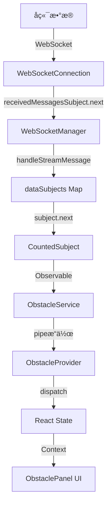

# Apollo Perception Obstacle 完整问答文档

## 目录
1. [Perception Obstacle Streaming 工作机制](#1-perception-obstacle-streaming-工作机制)
2. [æ•°æ®æ ¼å¼è¯¦è§£](#2-æ•°æ®æ ¼å¼è¯¦è§£)
3. [å‰ç«¯æ•°æ®è½¬æ¢æœºåˆ¶](#3-å‰ç«¯æ•°æ®è½¬æ¢æœºåˆ¶)
4. [订阅ä¸æ¨é€æµç¨‹](#4-订阅ä¸æ¨é€æµç¨‹)
5. [主è¿æ¥æ§åˆ¶æ¶ˆæ¯](#5-主è¿æ¥æ§åˆ¶æ¶ˆæ¯)
6. [Perception Obstacle Panel](#6-perception-obstacle-panel)
7. [å®æ—¶éšœç¢ç‰©æ˜¾ç¤º](#7-å®æ—¶éšœç¢ç‰©æ˜¾ç¤º)
8. [视觉效æœè¯¦è§£](#8-视觉效æœè¯¦è§£)

---

## 1. Perception Obstacle Streaming 工作机制

### 1.1 整体æ¶æ„
Apolloçš„perception obstacle streaming采用**WebSocket + Cyber RT**çš„æ¶æ„，å®ç°äº†ä»æ„ŸçŸ¥æ¨¡å—到å‰ç«¯ç•Œé¢çš„å®æ—¶éšœç¢ç‰©æ•°æ®æµä¼ è¾“。

```
æ„ŸçŸ¥æ¨¡å— â†’ Cyberé€šé“ â†’ å端ObstacleUpdater → WebSocketæ¨é€ → å‰ç«¯è®¢é˜… → UI渲染
```

### 1.2 核心组件
- **ObstacleUpdater**: 负责订阅Cyber通é“中的障ç¢ç‰©æ•°æ®å¹¶æ¨é€ç»™å‰ç«¯
- **SocketManager**: 管ç†WebSocketè¿æ¥å’Œæ¶ˆæ¯å¤„ç†
- **UpdaterManager**: 管ç†å„ç§æ•°æ®æ›´æ–°å™¨

### 1.3 æ•°æ®æµç¨‹
1. **Cyber通é“订阅**: `ObstacleUpdater`订阅`/apollo/perception/obstacles`通é“
2. **æ•°æ®è½¬æ¢**: å°†`PerceptionObstacles`消æ¯è½¬æ¢ä¸ºå‰ç«¯å¯ç”¨çš„æ ¼å¼
3. **WebSocketæ¨é€**: 通过`/obstacle`端点æ¨é€ç»™å‰ç«¯

### 1.4 关键文件
- **å端**: `obstacle_updater.cc`, `socket_manager.cc`, `data_handler.conf`
- **å‰ç«¯**: `obstacle.service.ts`, `ObstacleStore`, `websocket-manager.service.ts`
- **消æ¯å®šä¹‰**: `perception_obstacle.proto`

---

## 2. æ•°æ®æ ¼å¼è¯¦è§£

### 2.1 æ•°æ®æµä¸­çš„æ ¼å¼è½¬æ¢è¿‡ç¨‹
整个数æ®æµç»å†äº†å¤šä¸ªæ ¼å¼è½¬æ¢é˜¶æ®µï¼š

```
æ„ŸçŸ¥æ¨¡å— â†’ Cyberé€šé“ â†’ åç«¯è½¬æ¢ â†’ WebSocket传输 → å‰ç«¯ååºåˆ—化 → UI显示
```

### 2.2 å„阶段的数æ®æ ¼å¼

#### 2.2.1 感知模å—è¾“å‡ºæ ¼å¼ (PerceptionObstacles)
**æºæ ¼å¼**: `apollo.perception.PerceptionObstacles` (Protobuf)

```protobuf
message PerceptionObstacles {
  repeated PerceptionObstacle perception_obstacle = 1;  // éšœç¢ç‰©æ•°ç»„
  optional apollo.common.Header header = 2;             // 消æ¯å¤´
  optional apollo.common.ErrorCode error_code = 3;     // 错误ç 
  optional LaneMarkers lane_marker = 4;                // 车é“标记
  optional CIPVInfo cipv_info = 5;                     // 最近路径车辆
  repeated PerceptionWaste perception_waste = 6;       // åƒåœ¾æ£€æµ‹
}
```

#### 2.2.2 å端转æ¢æ ¼å¼ (Object)
**中间格å¼**: `apollo.dreamview.Object` (Dreamview专用格å¼)

```protobuf
message Object {
  string id = 1;                    // éšœç¢ç‰©ID
  string type = 2;                  // éšœç¢ç‰©ç±»å‹
  string sub_type = 3;              // å­ç±»å‹
  apollo.common.Point3D position = 4; // 3Dä½ç½®
  double length = 5;                // 长度
  double width = 6;                 // 宽度
  double height = 7;                // 高度
  double theta = 8;                 // æœå‘角
  apollo.common.Point3D velocity = 9; // 速度
  double confidence = 10;           // 置信度
}
```

#### 2.2.3 WebSocketä¼ è¾“æ ¼å¼ (StreamData)
**传输格å¼**: `apollo.dreamview.StreamData` (二进制Protobuf)

```protobuf
message StreamData {
  string name = 1;                  // æ•°æ®æµå称
  bytes data = 2;                   // 二进制数æ®
  string channel = 3;               // 通é“å称
  int64 timestamp = 4;              // 时间戳
}
```

---

## 3. å‰ç«¯æ•°æ®è½¬æ¢æœºåˆ¶

### 3.1 å‰ç«¯æ•°æ®è½¬æ¢çš„整体æ¶æ„
å‰ç«¯æ•°æ®è½¬æ¢é‡‡ç”¨**多层级ã€å¼‚æ­¥ã€Worker化**çš„æ¶æ„：

```
WebSocketæ¥æ”¶ → Workerååºåˆ—化 → RxJSæµå¤„ç† â†’ ä¸šåŠ¡å±‚è½¬æ¢ â†’ UI状æ€æ›´æ–°
```

### 3.2 æ•°æ®è½¬æ¢çš„详细æµç¨‹

#### 3.2.1 WebSocketæ•°æ®æ¥æ”¶é˜¶æ®µ
**ä½ç½®**: `WebSocketManager.connectChildSocket()`

```typescript
this.activeWorkers[name].socketMessage$
    .pipe(throttle(() => timer(this.throttleDuration.value)))
    .subscribe((message) => {
        if (isMessageType(message, 'SOCKET_MESSAGE')) {
            const { data } = message.payload as StreamMessage;
            
            // 将二进制数æ®å‘é€åˆ°Worker进行ååºåˆ—化
            this.workerPoolManager.dispatchTask({
                type: 'DECODE_MESSAGE',
                payload: data,
                transferList: [data.buffer]
            });
        }
    });
```

#### 3.2.2 Workerååºåˆ—化阶段
**ä½ç½®**: `decoder.worker.ts`

```typescript
// Worker中的ååºåˆ—化逻辑
self.onmessage = function(e) {
    const { type, payload } = e.data;
    
    if (type === 'DECODE_MESSAGE') {
        try {
            // 使用Protobuf解ç 
            const message = StreamData.decode(payload);
            const obstacleData = PerceptionObstacles.decode(message.data);
            
            // å‘é€è§£ç åçš„æ•°æ®
            self.postMessage({
                type: 'DECODE_SUCCESS',
                payload: obstacleData
            });
        } catch (error) {
            self.postMessage({
                type: 'DECODE_ERROR',
                payload: error.message
            });
        }
    }
};
```

#### 3.2.3 业务层转æ¢é˜¶æ®µ
**ä½ç½®**: `ObstacleService.subscribeToObstacles()`

```typescript
subscribeToObstacles(channelName: string): Observable<ObstacleData> {
    return this.streamApi
        .subscribeToDataWithChannel<apollo.perception.IPerceptionObstacles>(
            StreamDataNames.Obstacle, 
            channelName
        )
        .pipe(
            // 第一层转æ¢ï¼šProtobuf → 业务数æ®æ ¼å¼
            map((data: apollo.perception.IPerceptionObstacles) => ({
                obstacles: data.perception_obstacle || [],
                timestamp: data.header?.timestamp_sec || Date.now() / 1000,
                channelName
            })),
            // 第二层转æ¢ï¼šè¿‡æ»¤å’ŒéªŒè¯
            filter(data => data.obstacles.length > 0),
            // 第三层转æ¢ï¼šé”™è¯¯å¤„ç†
            catchError(error => {
                console.error('Obstacle data error:', error);
                return EMPTY;
            })
        );
}
```

---

## 4. 订阅ä¸æ¨é€æµç¨‹

### 4.1 å‰ç«¯è®¢é˜…æµç¨‹è¯¦è§£

#### 4.1.1 应用åˆå§‹åŒ–阶段
**步骤1: 应用å¯åŠ¨**
```typescript
// App.tsx
export function App() {
    const Providers = [
        <WebSocketManagerProvider key='WebSocketManagerProvider' />,
        <ObstacleProvider key='ObstacleProvider' />,
        // ... 其他Provider
    ];
    return <CombineContext providers={Providers}>...</CombineContext>;
}
```

**步骤2: WebSocketè¿æ¥å»ºç«‹**
```typescript
// WebSocketManageråˆå§‹åŒ–
constructor(mainUrl: string = config.mainUrl, pluginUrl: string = config.pluginUrl) {
    this.mainConnection = new WebSocketConnection(mainUrl);  // 主è¿æ¥: æ§åˆ¶æ¶ˆæ¯
    this.pluginConnection = new WebSocketConnection(pluginUrl); // æ’件è¿æ¥: æ’件数æ®
}
```

#### 4.1.2 éšœç¢ç‰©æ•°æ®è®¢é˜…
**步骤3: 创建å­è¿æ¥**
```typescript
// 创建障ç¢ç‰©æ•°æ®æµè¿æ¥
const childSocket = this.connectChildSocket('obstacle', {
    name: StreamDataNames.Obstacle,
    channel: channelName
});
```

**步骤4: æ•°æ®è®¢é˜…**
```typescript
// ObstacleStore中的数æ®è®¢é˜…
useEffect(() => {
    if (!obstacleService || !state.currentChannel) return;
    
    dispatch({ type: 'SET_LOADING', payload: true });
    
    const subscription = obstacleService
        .subscribeToObstacles(state.currentChannel)
        .subscribe({
            next: (data: ObstacleData) => {
                dispatch({ type: 'SET_OBSTACLES', payload: data.obstacles });
            },
            error: (error) => {
                dispatch({ type: 'SET_ERROR', payload: error.message });
            }
        });
    
    return () => subscription.unsubscribe();
}, [obstacleService, state.currentChannel]);
```

### 4.2 å端æ¨é€æµç¨‹è¯¦è§£

#### 4.2.1 Cyber通é“订阅
```cpp
// modules/dreamview_plus/backend/obstacle_updater/obstacle_updater.cc
void ObstacleUpdater::OnObstacles(
    const std::shared_ptr<PerceptionObstacles>& obstacles,
    const std::string& channel_name) {
    
    // 转æ¢æ•°æ®æ ¼å¼
    auto simulation_world = std::make_shared<SimulationWorld>();
    SetObstacleInfo(obstacles, simulation_world.get());
    
    // æ¨é€åˆ°WebSocket
    SendToClients(simulation_world);
}
```

#### 4.2.2 WebSocketæ¨é€
```cpp
void ObstacleUpdater::SendToClients(
    const std::shared_ptr<SimulationWorld>& simulation_world) {
    
    // åºåˆ—化为二进制数æ®
    std::string serialized_data;
    simulation_world->SerializeToString(&serialized_data);
    
    // 通过WebSocketæ¨é€
    socket_manager_->SendToClients("/obstacle", serialized_data);
}
```

---

## 5. 主è¿æ¥æ§åˆ¶æ¶ˆæ¯

### 5.1 主è¿æ¥æ¶æ„
**主è¿æ¥** (`mainConnection`) 是Apollo Dreamview Plus的核心æ§åˆ¶é€šé“，负责处ç†**éæµå¼æ•°æ®**çš„æ§åˆ¶æ¶ˆæ¯ï¼š

```typescript
// WebSocketManageråˆå§‹åŒ–
constructor(mainUrl: string = config.mainUrl, pluginUrl: string = config.pluginUrl) {
    this.mainConnection = new WebSocketConnection(mainUrl);  // 主è¿æ¥: æ§åˆ¶æ¶ˆæ¯
    this.pluginConnection = new WebSocketConnection(pluginUrl); // æ’件è¿æ¥: æ’件数æ®
}
```

### 5.2 æ§åˆ¶æ¶ˆæ¯å¤„ç†æµç¨‹

#### 5.2.1 消æ¯å‘é€æœºåˆ¶
**ä½ç½®**: `WebSocketConnection.sendMessage()`

```typescript
sendMessage<T>(message: RequestMessage<T> | RequestStreamMessage) {
    this.messageQueue.enqueue(message);  // 消æ¯å…¥é˜Ÿ
    if (this.isConnected()) {
        this.consumeMessageQueue();      // 消费消æ¯é˜Ÿåˆ—
    }
}

private consumeMessageQueue() {
    const idleConsume = () => {
        while (!this.messageQueue.isEmpty() && this.isConnected()) {
            const message = this.messageQueue.dequeue();
            if (message) {
                this.socket.next(message);  // å‘é€åˆ°WebSocket
            }
        }
    };
    requestIdleCallback(idleConsume, { timeout: 2000 }); // æµè§ˆå™¨ç©ºé—²æ—¶å¤„ç†
}
```

### 5.3 具体æ§åˆ¶æ¶ˆæ¯ä¾‹å­

#### 5.3.1 HMI模å¼åˆ‡æ¢æ§åˆ¶æ¶ˆæ¯
**场景**: 用户切æ¢è‡ªåŠ¨é©¾é©¶æ¨¡å¼ï¼ˆå¦‚ä»Default切æ¢åˆ°Perception模å¼ï¼‰

```typescript
// modules/dreamview_plus/frontend/packages/dreamview-core/src/store/HmiStore/actions.ts
export const changeMode = (
    mainApi: MainApi,
    payload: CURRENT_MODE,  // 'Perception', 'Pnc', 'Vehicle Test' ç­‰
    callback?: (mode: CURRENT_MODE) => void,
): AsyncAction<IInitState, ChangeModeAction> => {
    return async (_dispatch, state) => {
        logger.debug('changeMode', { state, payload });
        await mainApi.changeSetupMode(payload);  // å‘é€æ§åˆ¶æ¶ˆæ¯åˆ°å端
        if (callback) {
            callback(payload);
        }
    };
};
```

#### 5.3.2 é¢æ¿æ’件åˆå§‹åŒ–æ§åˆ¶æ¶ˆæ¯
**场景**: è·å–远程é¢æ¿æ’件é…ç½®

```typescript
// PanelCatalogProvider中
useEffect(() => {
    if (isMainConnected) {
        mainApi
            .getPanelPluginInitData()  // å‘é€æ§åˆ¶æ¶ˆæ¯è·å–é¢æ¿é…ç½®
            .then((remotePanels) =>
                remotePanels.reduce((result: any, panels: any) => [...result, ...panels.value], [])
            )
            .then((remotePanels) => getAllPanels(remotePanels, t, imgSrc))
            .catch(() => getAllPanels([], t, imgSrc))
            .then((panels) => {
                setAllPanel(panels);  // æ›´æ–°é¢æ¿åˆ—表
            });
    }
}, [isMainConnected, mainApi, t, imgSrc]);
```

---

## 6. Perception Obstacle Panel

### 6.1 é¢æ¿æ¦‚è¿°
**Perception Obstacle Panel** 是Apollo Dreamview Plus中专门用äº**å®æ—¶æ˜¾ç¤ºå’Œç®¡ç†æ„ŸçŸ¥éšœç¢ç‰©æ•°æ®**的核心é¢æ¿ç»„件。

### 6.2 é¢æ¿æ¶æ„

#### 6.2.1 组件层次结æ„
```
ObstaclePanelWrapper
├── ObstaclePanel (主组件)
│   ├── Panel Header (é¢æ¿å¤´éƒ¨)
│   │   ├── 标题显示
│   │   └── æ§åˆ¶æŒ‰é’®
│   ├── Filter Panel (过滤器é¢æ¿)
│   ├── Obstacle List (éšœç¢ç‰©åˆ—表)
│   └── Details Panel (详情é¢æ¿)
└── Panel (基础é¢æ¿åŒ…装器)
```

#### 6.2.2 核心组件
**主组件**: `ObstaclePanel`
```typescript
interface ObstaclePanelProps {
  onObstacleSelect?: (obstacle: apollo.perception.IPerceptionObstacle) => void;
  className?: string;
}
```

### 6.3 功能特性

#### 6.3.1 å®æ—¶éšœç¢ç‰©æ˜¾ç¤º
**æ•°æ®æº**: 通过`ObstacleService`订阅å®æ—¶éšœç¢ç‰©æ•°æ®æµ

```typescript
// 订阅障ç¢ç‰©æ•°æ®
const subscription = obstacleService
  .subscribeToObstacles(state.currentChannel)
  .subscribe({
    next: (data: ObstacleData) => {
      dispatch({ type: 'SET_OBSTACLES', payload: data.obstacles });
    }
  });
```

**显示信æ¯**:
- **éšœç¢ç‰©ID**: 唯一标识符
- **ç±»å‹**: 车辆ã€è¡Œäººã€è‡ªè¡Œè½¦ç­‰
- **å­ç±»å‹**: 轿车ã€å¡è½¦ã€å…¬äº¤è½¦ç­‰
- **ä½ç½®**: 3Dåæ ‡ (x, y, z)
- **置信度**: 检测置信度百分比

#### 6.3.2 交互å¼éšœç¢ç‰©é€‰æ‹©
```typescript
// éšœç¢ç‰©ç‚¹å‡»å¤„ç†
const handleObstacleClick = (obstacle: apollo.perception.IPerceptionObstacle) => {
  dispatch({ type: 'SELECT_OBSTACLE', payload: obstacle });
  onObstacleSelect?.(obstacle);  // å›è°ƒé€šçŸ¥çˆ¶ç»„件
};

// éšœç¢ç‰©æ‚¬åœå¤„ç†
const handleObstacleHover = (obstacle: apollo.perception.IPerceptionObstacle | null) => {
  setHoveredObstacle(obstacle);
};
```

#### 6.3.3 智能过滤系统
**过滤器类å‹**:
- **ç±»å‹è¿‡æ»¤**: 按障ç¢ç‰©ç±»å‹ç­›é€‰
- **置信度过滤**: 设置最å°ç½®ä¿¡åº¦é˜ˆå€¼
- **è·ç¦»è¿‡æ»¤**: 设置最大检测è·ç¦»

```typescript
// 过滤器处ç†
const handleFilterChange = (filterType: string, value: any) => {
  dispatch({ 
    type: 'SET_FILTERS', 
    payload: { [filterType]: value } 
  });
};

// 过滤åçš„éšœç¢ç‰©
const filteredObstacles = useMemo(() => {
  return filterObstacles(state.obstacles, state.filters);
}, [state.obstacles, state.filters]);
```

### 6.4 状æ€ç®¡ç†

#### 6.4.1 状æ€ç»“æ„
```typescript
interface ObstacleState {
  obstacles: apollo.perception.IPerceptionObstacle[];  // éšœç¢ç‰©åˆ—表
  selectedObstacle: apollo.perception.IPerceptionObstacle | null;  // 选中障ç¢ç‰©
  isVisible: boolean;         // å¯è§æ€§
  currentChannel: string | null;  // 当å‰é€šé“
  loading: boolean;           // 加载状æ€
  error: string | null;       // 错误信æ¯
  filters: {                  // 过滤器é…ç½®
    types: string[];
    minConfidence: number;
    maxDistance: number;
  };
}
```

---

## 7. å®æ—¶éšœç¢ç‰©æ˜¾ç¤º

### 7.1 å®æ—¶éšœç¢ç‰©æ˜¾ç¤ºçš„主è¦Panel
Apollo中å®æ—¶éšœç¢ç‰©æ˜¾ç¤ºä¸»è¦åœ¨**两个Panel**中å®ç°ï¼š

#### 7.1.1 ObstaclePanel (éšœç¢ç‰©åˆ—表é¢æ¿)
- **ä½ç½®**: Perception模å¼å¸ƒå±€çš„å³ä¸‹è§’
- **功能**: 以列表形å¼æ˜¾ç¤ºéšœç¢ç‰©è¯¦ç»†ä¿¡æ¯
- **显示方å¼**: 文本列表 + 颜色编ç 

#### 7.1.2 VehicleViz (车辆å¯è§†åŒ–é¢æ¿) 
- **ä½ç½®**: Perception模å¼å¸ƒå±€çš„左上角（主è¦3Då¯è§†åŒ–区域）
- **功能**: 3D场景中å®æ—¶æ¸²æŸ“éšœç¢ç‰©
- **显示方å¼**: 3D图形渲染 + 空间ä½ç½®

### 7.2 ObstaclePanel çš„å®æ—¶æ˜¾ç¤ºæœºåˆ¶

#### 7.2.1 æ•°æ®è®¢é˜…æµç¨‹
```typescript
// ObstaclePanel中的数æ®è®¢é˜…
const subscription = obstacleService
  .subscribeToObstacles(state.currentChannel)  // 订阅障ç¢ç‰©æ•°æ®æµ
  .subscribe({
    next: (data: ObstacleData) => {
      dispatch({ type: 'SET_OBSTACLES', payload: data.obstacles });
    },
    error: (error) => {
      dispatch({ type: 'SET_ERROR', payload: error.message });
    }
  });
```

#### 7.2.2 å®æ—¶æ¸²æŸ“å®ç°
```typescript
// éšœç¢ç‰©åˆ—表å®æ—¶æ¸²æŸ“
<div className="obstacle-list">
  {filteredObstacles.map((obstacle) => {
    const bounds = calculateObstacleBounds(obstacle);  // 计算边界框
    const color = getObstacleColor(obstacle);          // è·å–颜色
    const isSelected = state.selectedObstacle?.id === obstacle.id;
    const isHovered = hoveredObstacle?.id === obstacle.id;
    
    return (
      <div
        key={obstacle.id}
        className={`obstacle-item ${isSelected ? 'selected' : ''} ${isHovered ? 'hovered' : ''}`}
        onClick={() => handleObstacleClick(obstacle)}
        onMouseEnter={() => handleObstacleHover(obstacle)}
        onMouseLeave={() => handleObstacleHover(null)}
        style={{ borderLeftColor: color }}  // 颜色编ç è¾¹æ¡†
      >
        <div className="obstacle-info">
          <div className="obstacle-id">ID: {obstacle.id || 'N/A'}</div>
          <div className="obstacle-type">
            {getObstacleTypeDisplayName(obstacle.type || 'UNKNOWN')}
            {obstacle.sub_type && (
              <span className="obstacle-subtype">
                ({getObstacleSubTypeDisplayName(obstacle.sub_type)})
              </span>
            )}
          </div>
          <div className="obstacle-position">
            ({bounds.center.x?.toFixed(2)}, {bounds.center.y?.toFixed(2)})
          </div>
          <div className="obstacle-confidence">
            {((obstacle.confidence || 0) * 100).toFixed(1)}%
          </div>
        </div>
      </div>
    );
  })}
</div>
```

### 7.3 颜色编ç ç³»ç»Ÿ

#### 7.3.1 éšœç¢ç‰©ç±»å‹é¢œè‰²æ˜ å°„
```typescript
export const OBSTACLE_TYPE_COLORS = {
  UNKNOWN: '#808080',        // ç°è‰² - 未知类å‹
  UNKNOWN_MOVABLE: '#FFA500', // 橙色 - 未知å¯ç§»åŠ¨
  UNKNOWN_UNMOVABLE: '#8B4513', // 棕色 - 未知ä¸å¯ç§»åŠ¨
  PEDESTRIAN: '#FF0000',     // 红色 - 行人
  BICYCLE: '#00FF00',        // 绿色 - 自行车
  VEHICLE: '#0000FF',         // è“色 - 车辆
};
```

#### 7.3.2 éšœç¢ç‰©å­ç±»å‹é¢œè‰²æ˜ å°„
```typescript
export const OBSTACLE_SUBTYPE_COLORS = {
  ST_UNKNOWN: '#808080',     // ç°è‰²
  ST_CAR: '#0000FF',         // è“色 - 轿车
  ST_VAN: '#4169E1',         // çš‡å®¶è“ - é¢åŒ…车
  ST_TRUCK: '#191970',       // æ·±è“色 - å¡è½¦
  ST_BUS: '#000080',         // æµ·å†›è“ - 公交车
  ST_CYCLIST: '#00FF00',     // 绿色 - 骑行者
  ST_MOTORCYCLIST: '#32CD32', // 酸橙绿 - 摩托车手
  ST_PEDESTRIAN: '#FF0000',  // 红色 - 行人
  ST_TRAFFICCONE: '#FFD700', // 金色 - 交通锥
};
```

---

## 8. 视觉效æœè¯¦è§£

### 8.1 整体视觉设计

#### 8.1.1 é¢æ¿å¤–观
```
┌─────────────────────────────────────────────────────────────â”
│  Perception Obstacles (5)                    [ğŸ”] [✓] Show │
├─────────────────────────────────────────────────────────────┤
│  ┌─────────────────────────────────────────────────────────┠│
│  │ 🟦 ID: 12345                                           │ │
│  │    Vehicle (Car)                                       │ │
│  │    (12.34, -5.67)                                      │ │
│  │    85.2%                                               │ │
│  └─────────────────────────────────────────────────────────┘ │
│  ┌─────────────────────────────────────────────────────────┠│
│  │ �� ID: 12346                                           │ │
│  │    Pedestrian                                          │ │
│  │    (8.91, 2.34)                                        │ │
│  │    92.1%                                               │ │
│  └─────────────────────────────────────────────────────────┘ │
│  ┌─────────────────────────────────────────────────────────┠│
│  │ 🟩 ID: 12347                                           │ │
│  │    Bicycle                                             │ │
│  │    (-3.45, 7.89)                                       │ │
│  │    78.5%                                               │ │
│  └─────────────────────────────────────────────────────────┘ │
├─────────────────────────────────────────────────────────────┤
│  Selected Obstacle Details                                  │
│  ┌─────────────────────────────────────────────────────────┠│
│  │ ID: 12345                                               │ │
│  │ Type: VEHICLE                                           │ │
│  │ Speed: 15.23 m/s                                        │ │
│  │ Confidence: 85.2%                                       │ │
│  └─────────────────────────────────────────────────────────┘ │
└─────────────────────────────────────────────────────────────┘
```

### 8.2 颜色编ç ç³»ç»Ÿ

#### 8.2.1 éšœç¢ç‰©ç±»å‹é¢œè‰²æ˜ å°„
```typescript
// 左侧边框颜色编ç 
🟦 è“色 (#0000FF) - VEHICLE (车辆)
�� 红色 (#FF0000) - PEDESTRIAN (行人)  
🟩 绿色 (#00FF00) - BICYCLE (自行车)
🟨 橙色 (#FFA500) - UNKNOWN_MOVABLE (未知å¯ç§»åŠ¨)
🟫 棕色 (#8B4513) - UNKNOWN_UNMOVABLE (未知ä¸å¯ç§»åŠ¨)
⚪ ç°è‰² (#808080) - UNKNOWN (未知)
```

### 8.3 用户能看到的具体信æ¯

#### 8.3.1 æ¯ä¸ªéšœç¢ç‰©é¡¹ç›®æ˜¾ç¤ºçš„ä¿¡æ¯
**éšœç¢ç‰©å¡ç‰‡ç»“æ„**:
```
┌─────────────────────────────────────────────────────────────â”
│ 🟦 ID: 12345                    ↠障ç¢ç‰©å”¯ä¸€æ ‡è¯†ç¬¦          │
│    Vehicle (Car)                â† ç±»å‹ + å­ç±»å‹             │
│    (12.34, -5.67)              ↠3Dåæ ‡ä½ç½® (x, y)         │
│    85.2%                        ↠检测置信度百分比          │
└─────────────────────────────────────────────────────────────┘
```

**详细信æ¯**:
- **ID**: éšœç¢ç‰©å”¯ä¸€æ ‡è¯†ç¬¦ (如: 12345)
- **ç±»å‹**: 主è¦ç±»å‹ (Vehicle, Pedestrian, Bicycleç­‰)
- **å­ç±»å‹**: 具体å­ç±»å‹ (Car, Truck, Busç­‰)
- **ä½ç½®**: 3Dåæ ‡ (x, y, z) 精确到å°æ•°ç‚¹å2ä½
- **置信度**: 检测置信度百分比 (0-100%)

### 8.4 交互视觉效æœ

#### 8.4.1 悬åœæ•ˆæœ (Hover)
```css
&:hover {
  background: #333;           /* 背景å˜äº® */
  transform: translateX(2px); /* å‘å³ç§»åŠ¨2px */
}
```
**视觉效æœ**: 鼠标悬åœæ—¶ï¼Œéšœç¢ç‰©å¡ç‰‡èƒŒæ™¯å˜äº®ï¼Œå¹¶å‘å³è½»å¾®ç§»åŠ¨

#### 8.4.2 é€‰ä¸­æ•ˆæœ (Selected)
```css
&.selected {
  background: #1e3a8a;        /* è“色背景 */
  border-left-color: #3b82f6; /* è“色左边框 */
}
```
**视觉效æœ**: 选中的障ç¢ç‰©å¡ç‰‡èƒŒæ™¯å˜ä¸ºæ·±è“色，左边框å˜ä¸ºäº®è“色

#### 8.4.3 悬åœé˜´å½±æ•ˆæœ
```css
&.hovered {
  box-shadow: 0 2px 8px rgba(0, 0, 0, 0.3); /* é˜´å½±æ•ˆæœ */
}
```
**视觉效æœ**: 悬åœæ—¶æ·»åŠ é˜´å½±ï¼Œå¢å¼ºç«‹ä½“æ„Ÿ

### 8.5 状æ€æŒ‡ç¤º

#### 8.5.1 加载状æ€
```
┌─────────────────────────────────────────────────────────────â”
│                    ⳠLoading obstacles...                  │
└─────────────────────────────────────────────────────────────┘
```

#### 8.5.2 错误状æ€
```
┌─────────────────────────────────────────────────────────────â”
│                    âš ï¸ Error: Connection failed              │
└─────────────────────────────────────────────────────────────┘
```

#### 8.5.3 æ— æ•°æ®çŠ¶æ€
```
┌─────────────────────────────────────────────────────────────â”
│                    📭 No obstacles detected                 │
└─────────────────────────────────────────────────────────────┘
```

---

## 总结

Apollo Perception Obstacle系统通过以下核心机制å®ç°ï¼š

### 核心æ¶æ„
1. **WebSocket + Cyber RT**: å®ç°å®æ—¶æ•°æ®æµä¼ è¾“
2. **åŒPanelå作**: ObstaclePanel + VehicleViz ååŒæ˜¾ç¤º
3. **分层数æ®è½¬æ¢**: 多层级格å¼è½¬æ¢ç¡®ä¿æ•°æ®å®Œæ•´æ€§
4. **状æ€ç®¡ç†**: React状æ€ç®¡ç† + RxJSæµå¤„ç†

### 关键特性
- **å®æ—¶æ€§**: 10-30Hzçš„å®æ—¶æ•°æ®æ›´æ–°
- **å¯è§†åŒ–**: é¢œè‰²ç¼–ç  + 3D渲染 + 交互选择
- **过滤功能**: ç±»å‹ã€ç½®ä¿¡åº¦ã€è·ç¦»å¤šç»´åº¦è¿‡æ»¤
- **错误处ç†**: 完善的错误æ¢å¤å’ŒçŠ¶æ€æŒ‡ç¤º

### 用户体验
- **直观显示**: 深色主题 + 专业界é¢è®¾è®¡
- **交互å‹å¥½**: 悬åœã€é€‰æ‹©ã€è¿‡æ»¤ç­‰ä¸°å¯Œäº¤äº’
- **ä¿¡æ¯ä¸°å¯Œ**: IDã€ç±»å‹ã€ä½ç½®ã€ç½®ä¿¡åº¦ç­‰è¯¦ç»†ä¿¡æ¯
- **å“应å¼**: 适é…ä¸åŒå±å¹•å°ºå¯¸

这个系统为Apollo自动驾驶平å°æ供了**高效ã€ç›´è§‚ã€å¯é **çš„éšœç¢ç‰©ç›‘æ§è§£å†³æ–¹æ¡ˆã€‚


æ¢³ç† WebSocket Serviceã€Stream APIã€WebSocket Manager 的关系ä¸åˆ†å±‚æ¶æ„。


[8 tools called]

## 总结

WebSocket Serviceã€Stream APIã€WebSocket Manager 的分层关系如下：

### 分层æ¶æ„

1. **UI Layer** - React 组件
2. **Service Layer** - 业务逻辑（如 ObstacleService）
3. **API Layer** - 统一æ¥å£ï¼ˆStreamApiã€MainApiã€PluginApi）
4. **WebSocket Manager Layer** - è¿æ¥ä¸æ¶ˆæ¯ç®¡ç†
5. **WebSocket Connection Layer** - 底层è¿æ¥å®ç°
6. **Transport Layer** - WebSocket åè®®

### 核心关系

- **WebSocketManager**：å•ä¾‹ï¼Œç®¡ç†è¿æ¥ã€è®¢é˜…ã€æ¶ˆæ¯è·¯ç”±
- **StreamApi**：对 WebSocketManager çš„å°è£…，æ供类å‹å®‰å…¨æ¥å£
- **ObstacleService**：使用 StreamApi å®ç°ä¸šåŠ¡é€»è¾‘

### æ•°æ®æµå‘

```
å端 → WebSocket → WebSocketConnection → WebSocketManager → StreamApi → Service → UI
```

### 设计模å¼

- **å•ä¾‹æ¨¡å¼**：WebSocketManager
- **观察者模å¼**：RxJS Observable
- **å·¥å‚模å¼**：WorkerFactoryã€ConnectionManager
- **策略模å¼**：PluginManager

### 性能优化

- **è¿æ¥å¤ç”¨**：主è¿æ¥ + å­è¿æ¥
- **消æ¯é˜Ÿåˆ—**：防抖ä¸èŠ‚æµ
- **Worker æ± **：异步解ç 
- **æ•°æ®ç¼“å­˜**：IndexedDB

该æ¶æ„èŒè´£æ¸…晰，便äºç»´æŠ¤ä¸æ‰©å±•ã€‚

梳ç†å‰ç«¯è®¢é˜… perception obstacle 的主è¿æ¥ä¸å­è¿æ¥ï¼Œä»¥åŠä» panel 建立è¿æ¥çš„æµç¨‹ã€‚


[9 tools called]

## 总结

å‰ç«¯è®¢é˜… perception obstacle çš„è¿æ¥æ¶æ„：

### 主è¿æ¥ (Main Connection)
- **URL**: `ws://localhost:8888/websocket`
- **作用**: æ§åˆ¶æ¶ˆæ¯ã€è®¢é˜…管ç†ã€çŠ¶æ€åŒæ­¥
- **消æ¯ç±»å‹**: 订阅/å–消订阅ã€å…ƒæ•°æ®è¯·æ±‚
- **生命周期**: 应用å¯åŠ¨æ—¶å»ºç«‹ï¼Œåº”用关闭时断开

### å­è¿æ¥ (Child Connection)
- **URL**: `ws://localhost:8888/obstacle`
- **作用**: æ•°æ®æµä¼ è¾“ã€å®æ—¶éšœç¢ç‰©æ•°æ®
- **消æ¯ç±»å‹**: éšœç¢ç‰©æ•°æ®æµ
- **生命周期**: 按需建立，无订阅者时断开

### ä» Panel 建立è¿æ¥çš„æµç¨‹

1. **Panel åˆå§‹åŒ–**
   ```typescript
   useEffect(() => {
       dispatch({ type: 'SET_CHANNEL', payload: '/apollo/perception/obstacles' });
   }, []);
   ```

2. **Service 层订阅**
   ```typescript
   const subscription = obstacleService
       .subscribeToObstacles(state.currentChannel)
       .subscribe({ next: (data) => setObstacles(data.obstacles) });
   ```

3. **StreamApi 委托**
   ```typescript
   return webSocketManager.subscribeToDataWithChannel<PerceptionObstacles>(
       StreamDataNames.Obstacle, channelName
   );
   ```

4. **WebSocketManager 处ç†**
   ```typescript
   // åˆå§‹åŒ–å­è¿æ¥
   this.initChildSocket(name);
   // 通过主è¿æ¥å‘é€è®¢é˜…消æ¯
   this.sendSubscriptionMessage(SUBSCRIBE_MESSAGE_TYPE, name, channel);
   // 建立å­è¿æ¥
   this.connectChildSocket(name);
   ```

5. **è¿æ¥å»ºç«‹**
   - 主è¿æ¥: å‘é€è®¢é˜…æ§åˆ¶æ¶ˆæ¯
   - å­è¿æ¥: 建立数æ®æµè¿æ¥
   - æ•°æ®æµ: 通过 RxJS 传递到 UI

### æ¶æ„优势
- **æ§åˆ¶ä¸æ•°æ®åˆ†ç¦»**: 主è¿æ¥å¤„ç†æ§åˆ¶ï¼Œå­è¿æ¥å¤„ç†æ•°æ®
- **性能优化**: é¿å…æ§åˆ¶æ¶ˆæ¯å¹²æ‰°æ•°æ®æµ
- **è¿æ¥å¤ç”¨**: 按数æ®å称å¤ç”¨å­è¿æ¥
- **异步处ç†**: 使用 Web Worker 处ç†æ•°æ®è§£ç 

该æ¶æ„å®ç°äº†æ§åˆ¶ä¸æ•°æ®åˆ†ç¦»ï¼Œæå‡äº†æ€§èƒ½ä¸å¯ç»´æŠ¤æ€§ã€‚

分æ VehicleViz panel 如何订阅 perception obstacle æµå¹¶æ¥æ”¶æ¶ˆæ¯ã€‚


[15 tools called]

## VehicleViz Panel éšœç¢ç‰©è®¢é˜…分æ

VehicleViz Panel ä¸ç›´æ¥è®¢é˜… perception obstacle æµï¼Œè€Œæ˜¯é€šè¿‡è®¢é˜… `SIM_WORLD` è·å–包å«éšœç¢ç‰©çš„仿真数æ®ã€‚

### 1. 订阅æ¶æ„

**æ•°æ®æµå±‚次**:
```
å端 → SIM_WORLD → VehicleViz Panel → CarViz 渲染
```

**订阅方å¼**:
- 通过 PanelContext 的 `subscribeToData`
- ç›´æ¥ä½¿ç”¨ `streamApi.subscribeToDataWithChannel`

### 2. 订阅 SIM_WORLD æ•°æ®

```typescript
// VehicleViz/index.tsx
const { logger, panelId, subscribeToData, updateChannel, setKeyDownHandlers, removeKeyDownHandlers } = panelContext;

// 订阅 SIM_WORLD æ•°æ®
const simWorldConnectedSubj = subscribeToData({ 
    name: StreamDataNames.SIM_WORLD, 
    needChannel: false 
});

if (simWorldConnectedSubj) {
    simWorldConnectedSubscription = simWorldConnectedSubj.subscribe((simData: ISimulationWorld) => {
        if (!simData) return;
        
        // 处ç†ä»¿çœŸä¸–界数æ®ï¼ŒåŒ…å«éšœç¢ç‰©ä¿¡æ¯
        if (Object.keys(simData).length !== 0) {
            carviz.updateData(filterSimData(simData));
        }
    });
}
```

### 3. PanelContext çš„ subscribeToData å®ç°

```typescript
// Panel.tsx
function subscribeHandler<T>(newChannelInfo: SubscribeInfo) {
    let newConnectedSubj: CountedSubject<T>;
    
    if (newChannelInfo?.needChannel) {
        // 需è¦æŒ‡å®šé€šé“的订阅
        if (newChannelInfo?.name && newChannelInfo?.channel) {
            if (newChannelInfo?.channel === 'default') {
                newConnectedSubj = streamApi.subscribeToDataWithChannelFuzzy(newChannelInfo?.name);
            } else {
                newConnectedSubj = streamApi.subscribeToDataWithChannel(
                    newChannelInfo?.name,
                    newChannelInfo?.channel,
                );
            }
        }
    } else {
        // ä¸éœ€è¦æŒ‡å®šé€šé“的订阅
        newConnectedSubj = streamApi.subscribeToData(newChannelInfo?.name);
    }
    
    return newConnectedSubj;
}
```

### 4. è¿æ¥å»ºç«‹æµç¨‹

**åˆå§‹åŒ–æµç¨‹**:
```
1. VehicleViz 组件挂载
   ↓
2. è·å– PanelContext (åŒ…å« subscribeToData)
   ↓
3. 调用 subscribeToData({ name: StreamDataNames.SIM_WORLD, needChannel: false })
   ↓
4. Panel.tsx 中的 subscribeHandler 处ç†
   ↓
5. 调用 streamApi.subscribeToData(StreamDataNames.SIM_WORLD)
   ↓
6. WebSocketManager 建立è¿æ¥
   ↓
7. 开始æ¥æ”¶ SIM_WORLD æ•°æ®æµ
```

**æ•°æ®æ¥æ”¶æµç¨‹**:
```
1. å端å‘é€ SIM_WORLD æ•°æ®
   ↓
2. WebSocket æ¥æ”¶æ•°æ®
   ↓
3. WebSocketManager 处ç†æ¶ˆæ¯
   ↓
4. StreamApi 分å‘æ•°æ®
   ↓
5. Panel çš„ subscribeToData æ¥æ”¶æ•°æ®
   ↓
6. VehicleViz 订阅å›è°ƒå¤„ç†æ•°æ®
   ↓
7. CarViz 渲染障ç¢ç‰©
```

### 5. ä¸ç›´æ¥è®¢é˜… Obstacle 的区别

**VehicleViz æ–¹å¼ (é—´æ¥è®¢é˜…)**:
```typescript
// 订阅 SIM_WORLD，包å«éšœç¢ç‰©æ•°æ®
const simWorldSubj = subscribeToData({ 
    name: StreamDataNames.SIM_WORLD, 
    needChannel: false 
});

simWorldSubj.subscribe((simData: ISimulationWorld) => {
    // 处ç†åŒ…å«éšœç¢ç‰©çš„完整仿真数æ®
    carviz.updateData(simData);
});
```

**ObstaclePanel æ–¹å¼ (ç›´æ¥è®¢é˜…)**:

```typescript
// ç›´æ¥è®¢é˜…éšœç¢ç‰©æ•°æ®
const obstacleSubj = streamApi.subscribeToDataWithChannel<PerceptionObstacles>(
    StreamDataNames.Obstacle, 
    channelName
);

obstacleSubj.subscribe((obstacleData: PerceptionObstacles) => {
    // ç›´æ¥å¤„ç†éšœç¢ç‰©æ•°æ®
    setObstacles(obstacleData.perception_obstacle);
});
```

### 6. 优势分æ

**VehicleViz æ–¹å¼çš„优势**:
- æ•°æ®ä¸€è‡´ï¼šéšœç¢ç‰©ä¸è½¦è¾†ä½ç½®ã€è§„划轨迹åŒæ­¥
- 渲染效ç‡ï¼šä¸€æ¬¡æ€§æ›´æ–°ç›¸å…³æ•°æ®ï¼Œå‡å°‘多次渲染
- æ•°æ®å®Œæ•´ï¼šåŒ…å«å®Œæ•´ä»¿çœŸä¸–界状æ€

**ç›´æ¥è®¢é˜…æ–¹å¼çš„优势**:
- å®æ—¶æ€§ï¼šç›´æ¥æ¥æ”¶éšœç¢ç‰©æ•°æ®ï¼Œå»¶è¿Ÿæ›´ä½
- 纯净性：仅æ¥æ”¶éšœç¢ç‰©æ•°æ®
- çµæ´»æ€§ï¼šå¯ç‹¬ç«‹å¤„ç†éšœç¢ç‰©æ•°æ®

### 7. 性能考虑

**æ•°æ®é‡å¯¹æ¯”**:
- SIM_WORLD：包å«å®Œæ•´ä»¿çœŸæ•°æ®ï¼Œæ•°æ®é‡è¾ƒå¤§
- Obstacle：仅包å«éšœç¢ç‰©æ•°æ®ï¼Œæ•°æ®é‡è¾ƒå°

**更新频ç‡**:
- SIM_WORLD：通常以较ä½é¢‘ç‡æ›´æ–°ï¼ˆå¦‚ 10Hz）
- Obstacle：å¯ä»¥ä»¥è¾ƒé«˜é¢‘ç‡æ›´æ–°ï¼ˆå¦‚ 20Hz）

**渲染优化**:
```typescript
// VehicleViz 中的节æµå¤„ç†
const throttleFunc = throttle(
    (simData: ISimulationWorld) => {
        // 处ç†æ•°æ®æ›´æ–°
        carviz.updateData(filterSimData(simData));
    },
    500,  // 500ms 节æµ
    { leading: true }
);
```

### 8. 总结

**VehicleViz 订阅特点**:
- é—´æ¥è®¢é˜…：通过 SIM_WORLD è·å–éšœç¢ç‰©æ•°æ®
- æ•°æ®å®Œæ•´ï¼šåŒ…å«å®Œæ•´ä»¿çœŸä¸–界状æ€
- 渲染优化：一次性更新相关数æ®

**æ•°æ®æµå‘**:
```
Perception Obstacle → ObstacleUpdater → SIM_WORLD → VehicleViz → CarViz
```

**适用场景**:
- 3D å¯è§†åŒ–：需è¦å®Œæ•´ä»¿çœŸä¸–界状æ€
- å®æ—¶æ¸²æŸ“：需è¦éšœç¢ç‰©ä¸è½¦è¾†ä½ç½®åŒæ­¥
- 性能优化：通过节æµæ§åˆ¶æ›´æ–°é¢‘ç‡

VehicleViz Panel 通过订阅 SIM_WORLD è·å–éšœç¢ç‰©ä¿¡æ¯ï¼Œæ•°æ®é‡æ›´å¤§ï¼Œä½†æ•°æ®ä¸€è‡´æ€§å’Œæ¸²æŸ“效ç‡æ›´å¥½ã€‚

分æ ObstaclePanel çš„ç›´æ¥è®¢é˜…æ–¹å¼ï¼Œå¹¶æ¢³ç† WebSocket 端点ã€è®¢é˜…消æ¯æ ¼å¼åŠå端处ç†å‡½æ•°ã€‚


[16 tools called]

## ObstaclePanel ç›´æ¥è®¢é˜…æ–¹å¼

### 1. 订阅æ¶æ„

**æ•°æ®æµå±‚次**:
```
å端 PerceptionObstacles → ObstacleUpdater → WebSocket → ObstaclePanel
```

**订阅方å¼**:
- 通过 `ObstacleService` ç›´æ¥è®¢é˜…éšœç¢ç‰©æ•°æ®
- 使用 `streamApi.subscribeToDataWithChannel` 指定通é“

### 2. å‰ç«¯è®¢é˜…æµç¨‹

#### 2.1 ObstaclePanel 组件
```typescript
// ObstaclePanel/index.tsx
const ObstaclePanel: React.FC<ObstaclePanelProps> = ({ onObstacleSelect, className }) => {
  const { state, dispatch } = useObstacleStore();
  
  // 处ç†é€šé“选择
  const handleChannelChange = (channel: string) => {
    dispatch({ type: 'SET_CHANNEL', payload: channel });
  };
  
  // 处ç†éšœç¢ç‰©é€‰æ‹©
  const handleObstacleClick = (obstacle: apollo.perception.IPerceptionObstacle) => {
    dispatch({ type: 'SELECT_OBSTACLE', payload: obstacle });
    onObstacleSelect?.(obstacle);
  };
};
```

#### 2.2 ObstacleStore 状æ€ç®¡ç†
```typescript
// ObstacleStore/index.tsx
export const ObstacleProvider: React.FC<{ children: React.ReactNode }> = ({ children }) => {
  const [state, dispatch] = useReducer(obstacleReducer, initialState);
  const { streamApi } = useWebSocketServices();
  const [obstacleService] = useState(() => streamApi ? new ObstacleService(streamApi) : null);

  // 订阅障ç¢ç‰©æ•°æ®
  useEffect(() => {
    if (!obstacleService || !state.currentChannel) return;

    dispatch({ type: 'SET_LOADING', payload: true });

    const subscription = obstacleService
      .subscribeToObstacles(state.currentChannel)
      .subscribe({
        next: (data: ObstacleData) => {
          dispatch({ type: 'SET_OBSTACLES', payload: data.obstacles });
        },
        error: (error) => {
          dispatch({ type: 'SET_ERROR', payload: error.message });
        }
      });

    return () => subscription.unsubscribe();
  }, [obstacleService, state.currentChannel]);
};
```

#### 2.3 ObstacleService æœåŠ¡å±‚
```typescript
// obstacle.service.ts
export class ObstacleService {
  private streamApi: StreamApi;

  constructor(streamApi: StreamApi) {
    this.streamApi = streamApi;
  }

  // 订阅障ç¢ç‰©æ•°æ®
  subscribeToObstacles(channelName: string): Observable<ObstacleData> {
    return this.streamApi
      .subscribeToDataWithChannel<apollo.perception.IPerceptionObstacles>(
        StreamDataNames.Obstacle,  // 'obstacle'
        channelName                // '/apollo/perception/obstacles'
      )
      .pipe(
        map((data: apollo.perception.IPerceptionObstacles) => ({
          obstacles: data.perception_obstacle || [],
          timestamp: data.header?.timestamp_sec || Date.now() / 1000,
          channelName
        })),
        filter(data => data.obstacles.length > 0)
      );
  }
}
```

### 3. WebSocket 端点é…ç½®

#### 3.1 主è¿æ¥ç«¯ç‚¹
```typescript
// WebSocketManager é…ç½®
export const config = {
    baseURL: 'ws://localhost:8888',
    mainUrl: `${baseURL}/websocket`,  // ws://localhost:8888/websocket
    pluginUrl: `${baseURL}/plugin`,   // ws://localhost:8888/plugin
};
```

#### 3.2 å­è¿æ¥ç«¯ç‚¹
```protobuf
# data_handler.conf
data_handler_info {
  key: "apollo.dreamview.Obstacles",
  value {
    data_name: "obstacle",
    msg_type: "apollo.dreamview.Obstacles",
    websocket_info {
      websocket_name: "obstacle",        # å­è¿æ¥å称
      websocket_pipe: "/obstacle"        # å­è¿æ¥è·¯å¾„
    },
    different_for_channels: true         # 支æŒå¤šé€šé“
  }
}
```

**å®é™…å­è¿æ¥URL**: `ws://localhost:8888/obstacle`

### 4. 订阅消æ¯æ ¼å¼

#### 4.1 订阅消æ¯
```typescript
// 通过主è¿æ¥å‘é€çš„订阅消æ¯
{
    action: "subscribe",
    type: "subscribe", 
    data: {
        name: "subscribe",
        source: "dreamview",
        info: {
            websocketName: "obstacle",
            channelName: "/apollo/perception/obstacles",
            dataFrequencyMs: 100  // å¯é€‰ï¼Œæ•°æ®é¢‘ç‡
        },
        sourceType: "websocktSubscribe",
        targetType: "module",
        requestId: "subscribe"
    }
}
```

#### 4.2 å–消订阅消æ¯
```typescript
// 通过主è¿æ¥å‘é€çš„å–消订阅消æ¯
{
    action: "unsubscribe",
    type: "unsubscribe",
    data: {
        name: "unsubscribe",
        source: "dreamview", 
        info: {
            websocketName: "obstacle",
            channelName: "/apollo/perception/obstacles"
        },
        sourceType: "websocktSubscribe",
        targetType: "module",
        requestId: "unsubscribe"
    }
}
```

#### 4.3 æ•°æ®æµæ¶ˆæ¯
```typescript
// 通过å­è¿æ¥æ¥æ”¶çš„æ•°æ®æµæ¶ˆæ¯
{
    action: "stream",
    data_name: "obstacle",
    channel_name: "/apollo/perception/obstacles",
    type: "obstacle",
    data: Uint8Array  // åºåˆ—化的 PerceptionObstacles æ•°æ®
}
```

### 5. å端处ç†å‡½æ•°

#### 5.1 主è¦å¤„ç†æ–‡ä»¶
- **头文件**: `modules/dreamview_plus/backend/obstacle_updater/obstacle_updater.h`
- **å®ç°æ–‡ä»¶**: `modules/dreamview_plus/backend/obstacle_updater/obstacle_updater.cc`

#### 5.2 核心处ç†å‡½æ•°

**ObstacleUpdater æ„造函数**:
```cpp
ObstacleUpdater::ObstacleUpdater(WebSocketHandler* websocket)
    : UpdaterWithChannelsBase({"perception.PerceptionObstacles"}, {""}),
      websocket_(websocket),
      node_(cyber::CreateNode("obstacle_updater")) {
  Init();
}
```

**StartStream 函数**:
```cpp
void ObstacleUpdater::StartStream(const double& time_interval_ms,
                                  const std::string& channel_name,
                                  nlohmann::json* subscribe_param) {
  if (channel_name.empty()) {
    AERROR << "Failed to subscribe channel for channel is empty";
    return;
  }
  
  if (time_interval_ms > 0) {
    ObstacleChannelUpdater* channel_updater = GetObstacleChannelUpdater(channel_name);
    if (channel_updater == nullptr) {
      AERROR << "Failed to subscribe channel: " << channel_name
             << "for channel updater not registered!";
      return;
    }
    
    // 创建定时器
    channel_updater->timer_.reset(new cyber::Timer(
        time_interval_ms,
        [channel_name, this]() { this->OnTimer(channel_name); }, false));
    channel_updater->timer_->Start();
  } else {
    this->OnTimer(channel_name);
  }
}
```

**OnObstacles å›è°ƒå‡½æ•°**:
```cpp
void ObstacleUpdater::OnObstacles(
    const std::shared_ptr<PerceptionObstacles>& obstacles,
    const std::string& channel) {
  if (!enabled_) {
    return;
  }
  
  {
    std::lock_guard<std::mutex> lck(updater_publish_mutex_);
    ObstacleChannelUpdater* channel_updater = GetObstacleChannelUpdater(channel);
    channel_updater->obstacles_.clear();
    
    // 处ç†éšœç¢ç‰©æ•°æ®
    for (auto& obstacle : obstacles->perception_obstacle()) {
      channel_updater->obstacles_.push_back(obstacle);
    }
  }
}
```

**PublishMessage 函数**:
```cpp
void ObstacleUpdater::PublishMessage(const std::string& channel_name) {
  std::string to_send = "";
  GetObjects(&to_send, channel_name);
  
  StreamData stream_data;
  std::string stream_data_string;
  stream_data.set_action("stream");
  stream_data.set_data_name("obstacle");
  stream_data.set_channel_name(channel_name);
  
  // åºåˆ—化数æ®
  std::vector<uint8_t> byte_data(to_send.begin(), to_send.end());
  stream_data.set_data(&(byte_data[0]), byte_data.size());
  stream_data.set_type("obstacle");
  stream_data.SerializeToString(&stream_data_string);
  
  // 通过 WebSocket 广播数æ®
  websocket_->BroadcastBinaryData(stream_data_string);
}
```

**GetObstacleChannelUpdater 函数**:
```cpp
ObstacleChannelUpdater* ObstacleUpdater::GetObstacleChannelUpdater(
    const std::string& channel_name) {
  std::lock_guard<std::mutex> lck(channel_updater_map_mutex_);
  
  if (!obstacle_channel_updater_map_.count(channel_name)) {
    obstacle_channel_updater_map_[channel_name] = new ObstacleChannelUpdater(channel_name);
    
    // 创建 Cyber RT Reader
    obstacle_channel_updater_map_[channel_name]->perception_obstacle_reader_ =
        node_->CreateReader<PerceptionObstacles>(
            channel_name,
            [channel_name, this](const std::shared_ptr<PerceptionObstacles>& obstacles) {
              OnObstacles(obstacles, channel_name);
            });
  }
  
  return obstacle_channel_updater_map_[channel_name];
}
```

### 6. æ•°æ®æ¥æ”¶æµç¨‹

#### 6.1 完整数æ®æµ
```
1. å‰ç«¯è°ƒç”¨ obstacleService.subscribeToObstacles(channelName)
   ↓
2. StreamApi.subscribeToDataWithChannel('obstacle', channelName)
   ↓
3. WebSocketManager.subscribeToDataWithChannel()
   ↓
4. 通过主è¿æ¥å‘é€è®¢é˜…消æ¯
   ↓
5. å端 ObstacleUpdater.StartStream() 处ç†è®¢é˜…
   ↓
6. 创建 Cyber RT Reader 订阅 PerceptionObstacles
   ↓
7. å端 OnObstacles() æ¥æ”¶éšœç¢ç‰©æ•°æ®
   ↓
8. PublishMessage() 通过 WebSocket æ¨é€æ•°æ®
   ↓
9. å‰ç«¯å­è¿æ¥æ¥æ”¶æ•°æ®æµ
   ↓
10. WebSocketManager 处ç†æ¶ˆæ¯
   ↓
11. ObstacleService 转æ¢æ•°æ®æ ¼å¼
   ↓
12. ObstacleStore 更新状æ€
   ↓
13. ObstaclePanel 渲染障ç¢ç‰©åˆ—表
```

#### 6.2 æ•°æ®æ ¼å¼è½¬æ¢
```typescript
// å‰ç«¯æ•°æ®è½¬æ¢
map((data: apollo.perception.IPerceptionObstacles) => ({
  obstacles: data.perception_obstacle || [],
  timestamp: data.header?.timestamp_sec || Date.now() / 1000,
  channelName
}))
```

### 7. 优势特点

#### 7.1 ç›´æ¥è®¢é˜…优势
- **å®æ—¶æ€§**: ç›´æ¥æ¥æ”¶éšœç¢ç‰©æ•°æ®ï¼Œå»¶è¿Ÿä½
- **æ•°æ®çº¯å‡€**: åªæ¥æ”¶éšœç¢ç‰©æ•°æ®
- **çµæ´»æ€§**: å¯ç‹¬ç«‹å¤„ç†éšœç¢ç‰©æ•°æ®
- **多通é“支æŒ**: 支æŒä¸åŒé€šé“çš„éšœç¢ç‰©æ•°æ®

#### 7.2 技术特点
- **åŒè¿æ¥æ¶æ„**: 主è¿æ¥æ§åˆ¶ï¼Œå­è¿æ¥æ•°æ®æµ
- **异步处ç†**: 使用 Web Worker 处ç†æ•°æ®è§£ç 
- **状æ€ç®¡ç†**: 使用 React Context + Reducer
- **错误处ç†**: 完整的错误处ç†å’Œé‡è¿æœºåˆ¶

ObstaclePanel 通过直æ¥è®¢é˜… perception obstacle æµï¼Œæä¾›å®æ—¶ã€çº¯å‡€çš„éšœç¢ç‰©æ•°æ®ï¼Œé€‚用äºéœ€è¦ç²¾ç¡®æ§åˆ¶éšœç¢ç‰©æ•°æ®çš„场景。

分æå‰ç«¯è‡ªåŠ¨æ¥æ”¶å端æ¨é€æµæ•°æ®çš„机制，定ä½ç›¸å…³å‡½æ•°ä¸å®ç°ã€‚


[13 tools called]

## å‰ç«¯è‡ªåŠ¨æ¥æ”¶å端æ¨é€æµæ•°æ®çš„机制

### 1. 整体æ¶æ„

å‰ç«¯é€šè¿‡ WebSocket åŒè¿æ¥ã€Web Worker 解ç ã€RxJS æµå’Œ React 状æ€ç®¡ç†å®ç°è‡ªåŠ¨æ¥æ”¶ï¼š

```
å端æ¨é€ → WebSocketè¿æ¥ → Web Workerè§£ç  â†’ RxJSæµ â†’ ReactçŠ¶æ€ â†’ UIæ›´æ–°
```

### 2. 核心组件和函数

#### 2.1 WebSocket è¿æ¥å±‚

**WebSocketConnection ç±»** (`websocket-connect.service.ts`):
```typescript
export class WebSocketConnection {
    private socket: WebSocketSubject<RequestMessage<any> | RequestStreamMessage | ResponseMessage<any>>;
    private readonly receivedMessagesSubject = new Subject<ResponseMessage<any>>();

    connect(retries = 3, retryInterval = 1000) {
        this.socket = webSocket({
            url: this.url,
            openObserver: {
                next: () => {
                    this.connectionStatus$.next(ConnectionStatusEnum.CONNECTED);
                },
            },
        });

        // 关键：自动æ¥æ”¶æ¶ˆæ¯å¹¶è½¬å‘到 Subject
        this.socket.pipe(retryWhen((errors) => errors.pipe(delay(retryInterval), take(retries))))
            .subscribe(
                (msg) => {
                    this.receivedMessagesSubject.next(msg as ResponseMessage<any>);
                },
                (error) => {
                    logger.error(error);
                },
            );
    }

    get receivedMessages$(): Observable<ResponseMessage<any>> {
        return this.receivedMessagesSubject.asObservable();
    }
}
```

#### 2.2 WebSocketManager 消æ¯å¤„ç†

**handleMessage 函数** (`websocket-manager.service.ts`):
```typescript
handleMessage(msg: HandleMessageType, socketName: SocketNameEnum) {
    logger.debug(`Received message from ${socketName}, message: ${JSON.stringify(msg, null, 0)}`);

    // 处ç†ä¸åŒç±»å‹çš„消æ¯
    if (msg.action === ResponseMessageActionEnum.METADATA_MESSAGE_TYPE) {
        const metadata = Object.values(msg.data.info.data.dataHandlerInfo);
        this.setMetadata(metadata);
        this.mainConnection.connectionStatus$.next(ConnectionStatusEnum.METADATA);
    } else if (msg.action === ResponseMessageActionEnum.RESPONSE_MESSAGE_TYPE) {
        // 处ç†å“应消æ¯
        if (msg && this.responseResolvers[msg.data.requestId]) {
            if (msg.data.info.code === 0) {
                this.responseResolvers[msg.data.requestId].resolver(msg);
            } else {
                this.responseResolvers[msg.data.requestId].reject(msg);
            }
        }
    }
}
```

#### 2.3 å­è¿æ¥æ•°æ®æµå¤„ç†

**connectChildSocket 函数**:
```typescript
private connectChildSocket(name: string): void {
    const metadata = this.metadata.find((m) => m.dataName === name);
    
    if (!this.activeWorkers[name]) {
        // 创建å­è¿æ¥ Worker
        this.activeWorkers[name] = new ChildWsWorkerClass(
            name as StreamDataNames,
            `${config.baseURL}/${metadata.websocketInfo.websocketName}`,
        ).connect();
    }

    // 关键：订阅å­è¿æ¥æ¶ˆæ¯å¹¶è‡ªåŠ¨å¤„ç†
    this.activeWorkers[name].socketMessage$
        .pipe(throttle(() => timer(this.throttleDuration.value)))
        .subscribe((message) => {
            if (isMessageType(message, 'SOCKET_MESSAGE')) {
                const { data } = message.payload as StreamMessage;
                
                // 分å‘到 Worker 池进行解ç 
                this.workerPoolManager
                    .dispatchTask({
                        type: 'SOCKET_STREAM_MESSAGE',
                        payload: <StreamMessage>message.payload,
                        transferList: [data.buffer],
                    })
                    .then((response) => {
                        if (response.success) {
                            // 关键：自动更新数æ®ä¸»é¢˜
                            this.dataSubjects.getByExactKey({ name })?.next(response.result);
                        }
                    });
            }
        });
}
```

### 3. Web Worker æ•°æ®è§£ç 

#### 3.1 å­è¿æ¥ Worker (`childWs.worker.ts`)

**自动æ¥æ”¶å’Œè½¬å‘æ•°æ®**:
```typescript
const connectChildSocket = (url: string, name: StreamDataNames): void => {
    childSocket = webSocket({
        url,
        binaryType: 'arraybuffer',
        deserializer: (e) => e.data,
    });
    
    // 关键：自动订阅数æ®æµ
    childSpt = childSocket
        .pipe(retryWhen((errors) => errors.pipe(take(MAX_RETRIES), delay(1000))))
        .subscribe((buffer) => {
            const decodedData = deserializer(buffer, name);
            const { action, type, dataName, channelName, data } = decodedData;

            if (decodedData) {
                // 自动转å‘到主线程
                self.postMessage({
                    type: 'SOCKET_MESSAGE',
                    payload: {
                        action,
                        type,
                        dataName,
                        ...(isNil(channelName) ? {} : { channelName }),
                        data,
                    },
                } as WorkerMessage<WorkerMessageType>, [data.buffer]);
            }
        });
};
```

#### 3.2 è§£ç  Worker (`decoder.worker.ts`)

**自动解ç å’Œè¿”å›æ•°æ®**:
```typescript
subject
    .pipe(switchMap(async (message) => {
        if (!storeManager) {
            storeManager = await indexedDBStorage.getStoreManager('DreamviewPlus');
        }
        return message;
    }))
    .subscribe(async (message) => {
        try {
            const metadata: MetadataItem[] = (await storeManager?.getItem('metadata')) || [];
            const { id, payload } = message;
            const { dataName, channelName, data } = payload || {};

            const dataNameMeta = metadata.find((item) => item.dataName === dataName);
            const protoPath = dataNameMeta.protoPath || 
                dataNameMeta.channels.find((item) => item.channelName === channelName)?.protoPath;
            const msgType = dataNameMeta.msgType || 
                dataNameMeta.channels.find((item) => item.channelName === channelName)?.msgType;

            // 关键：自动解ç æ•°æ®
            const objectData = await loadProtoAsPromise(data, protoPath, msgType, {
                dataName,
                channelName,
            });

            // 自动返å›è§£ç ç»“æœ
            self.postMessage({
                id,
                success: true,
                result: {
                    ...payload,
                    data: objectData,
                },
            });
        } catch (e) {
            const { id } = message;
            release(id);
        }
    });
```

### 4. æ•°æ®æµè‡ªåŠ¨åˆ†å‘

#### 4.1 æ•°æ®ä¸»é¢˜ç®¡ç†

**CountedSubject 自动分å‘**:
```typescript
// 在 subscribeToDataWithChannel 中
const upstream = this.dataSubjects.getByExactKey({ name }) as CountedSubject<StreamMessageData<unknown>>;
const downstream = this.dataSubjects.getByExactKey({ name, channel }) as CountedSubject<T>;

// 关键：自动过滤和转å‘æ•°æ®
upstream
    .pipe(filter((data) => data?.channelName === channel))
    .subscribe((filterData) => downstream.next(<T>filterData.data));

return <CountedSubject<T>>downstream.pipe(
    finalize(() => {
        // 自动清ç†é€»è¾‘
        const subscribersCount = downstream.count;
        if (subscribersCount === 0) {
            setTimeout(() => {
                const delaySubscribersCount = downstream.count;
                if (delaySubscribersCount === 0) {
                    this.sendSubscriptionMessage(
                        RequestMessageActionEnum.UNSUBSCRIBE_MESSAGE_TYPE,
                        name,
                        channel,
                        option,
                    );
                    this.dataSubjects.deleteByExactKey({ name, channel });
                }
            }, unsubscribeDelay);
        }
    }),
);
```

#### 4.2 æœåŠ¡å±‚自动订阅

**ObstacleService 自动处ç†**:
```typescript
export class ObstacleService {
    subscribeToObstacles(channelName: string): Observable<ObstacleData> {
        return this.streamApi
            .subscribeToDataWithChannel<apollo.perception.IPerceptionObstacles>(
                StreamDataNames.Obstacle, 
                channelName
            )
            .pipe(
                // 关键：自动转æ¢æ•°æ®æ ¼å¼
                map((data: apollo.perception.IPerceptionObstacles) => ({
                    obstacles: data.perception_obstacle || [],
                    timestamp: data.header?.timestamp_sec || Date.now() / 1000,
                    channelName
                })),
                // 关键：自动过滤空数æ®
                filter(data => data.obstacles.length > 0)
            );
    }
}
```

### 5. React 状æ€è‡ªåŠ¨æ›´æ–°

#### 5.1 Store 自动订阅

**ObstacleStore 自动更新**:
```typescript
export const ObstacleProvider: React.FC<{ children: React.ReactNode }> = ({ children }) => {
    const [state, dispatch] = useReducer(obstacleReducer, initialState);
    const { streamApi } = useWebSocketServices();
    const [obstacleService] = useState(() => streamApi ? new ObstacleService(streamApi) : null);

    // 关键：自动订阅数æ®å˜åŒ–
    useEffect(() => {
        if (!obstacleService || !state.currentChannel) return;

        dispatch({ type: 'SET_LOADING', payload: true });

        const subscription = obstacleService
            .subscribeToObstacles(state.currentChannel)
            .subscribe({
                // 关键：自动更新状æ€
                next: (data: ObstacleData) => {
                    dispatch({ type: 'SET_OBSTACLES', payload: data.obstacles });
                },
                error: (error) => {
                    dispatch({ type: 'SET_ERROR', payload: error.message });
                }
            });

        return () => subscription.unsubscribe();
    }, [obstacleService, state.currentChannel]);
};
```

#### 5.2 组件自动渲染

**ObstaclePanel 自动渲染**:
```typescript
const ObstaclePanel: React.FC<ObstaclePanelProps> = ({ onObstacleSelect, className }) => {
    const { state, dispatch } = useObstacleStore();
    
    // 关键：自动过滤数æ®
    const filteredObstacles = useMemo(() => {
        return filterObstacles(state.obstacles, state.filters);
    }, [state.obstacles, state.filters]);

    // 关键：自动渲染障ç¢ç‰©åˆ—表
    return (
        <div className={`obstacle-panel ${className || ''}`}>
            <div className="obstacle-list">
                {filteredObstacles.map((obstacle, index) => (
                    <div
                        key={obstacle.id || index}
                        className="obstacle-item"
                        onClick={() => handleObstacleClick(obstacle)}
                    >
                        {/* 自动显示障ç¢ç‰©ä¿¡æ¯ */}
                    </div>
                ))}
            </div>
        </div>
    );
};
```

### 6. 自动æ¥æ”¶æœºåˆ¶æ€»ç»“

#### 6.1 关键函数和组件

1. **WebSocketConnection.connect()** - 建立è¿æ¥å¹¶è‡ªåŠ¨æ¥æ”¶æ¶ˆæ¯
2. **WebSocketManager.handleMessage()** - 处ç†æ¥æ”¶åˆ°çš„消æ¯
3. **connectChildSocket()** - 建立å­è¿æ¥å¹¶è‡ªåŠ¨è®¢é˜…æ•°æ®æµ
4. **ChildWsWorker.subscribe()** - 在 Worker 中自动æ¥æ”¶æ•°æ®
5. **DecoderWorker.subscribe()** - 自动解ç æ•°æ®
6. **CountedSubject.next()** - 自动分å‘æ•°æ®åˆ°è®¢é˜…者
7. **ObstacleService.subscribeToObstacles()** - 自动转æ¢æ•°æ®æ ¼å¼
8. **ObstacleStore.useEffect()** - 自动更新 React 状æ€
9. **ObstaclePanel.useMemo()** - 自动é‡æ–°æ¸²æŸ“ UI

#### 6.2 自动化æµç¨‹

```
1. WebSocket è¿æ¥å»ºç«‹ → 自动开始æ¥æ”¶æ¶ˆæ¯
2. 消æ¯åˆ°è¾¾ → 自动路由到对应处ç†å™¨
3. å­è¿æ¥å»ºç«‹ → 自动订阅数æ®æµ
4. æ•°æ®åˆ°è¾¾ → 自动解ç å’Œè½¬æ¢
5. æ•°æ®åˆ†å‘ → 自动更新所有订阅者
6. 状æ€æ›´æ–° → è‡ªåŠ¨è§¦å‘ React é‡æ–°æ¸²æŸ“
7. UI æ›´æ–° → 自动显示最新数æ®
```

#### 6.3 技术特点

- **å“应å¼ç¼–程**: 使用 RxJS å®ç°æ•°æ®æµè‡ªåŠ¨å¤„ç†
- **Web Worker**: 异步解ç ï¼Œä¸é˜»å¡ä¸»çº¿ç¨‹
- **自动é‡è¿**: è¿æ¥æ–­å¼€æ—¶è‡ªåŠ¨é‡è¯•
- **内存管ç†**: 自动清ç†æ— ç”¨çš„订阅和è¿æ¥
- **性能优化**: 使用节æµå’Œç¼“å­˜æ高性能

å‰ç«¯é€šè¿‡ WebSocketã€Web Workerã€RxJS å’Œ React çš„é…åˆï¼Œå®ç°è‡ªåŠ¨æ¥æ”¶ã€å¤„ç†ã€åˆ†å‘和渲染å端æ¨é€çš„æµæ•°æ®ã€‚

## Panel 中使用æµæ•°æ®çš„æ–¹å¼

### 1. 基本使用模å¼

#### 1.1 通过 PanelContext 订阅
```typescript
// 在 Panel 组件中
const { subscribeToData } = usePanelContext();

useEffect(() => {
    // 订阅数æ®æµ
    const subscription = subscribeToData({
        name: StreamDataNames.Obstacle,  // æ•°æ®å称
        channel: '/apollo/perception/obstacles',  // 通é“å称
        needChannel: true  // 是å¦éœ€è¦æŒ‡å®šé€šé“
    });

    if (subscription) {
        const sub = subscription.subscribe((data) => {
            // 处ç†æ¥æ”¶åˆ°çš„æ•°æ®
            console.log('收到障ç¢ç‰©æ•°æ®:', data);
            setObstacles(data.perception_obstacle || []);
        });

        return () => sub.unsubscribe();
    }
}, []);
```

#### 1.2 通过 Service 订阅
```typescript
// 使用专门的 Service
const { streamApi } = useWebSocketServices();

useEffect(() => {
    const subscription = streamApi
        .subscribeToDataWithChannel<apollo.perception.IPerceptionObstacles>(
            StreamDataNames.Obstacle,
            '/apollo/perception/obstacles'
        )
        .subscribe((data) => {
            setObstacles(data.perception_obstacle || []);
        });

    return () => subscription.unsubscribe();
}, []);
```

### 2. å®é™…使用示例

#### 2.1 VehicleViz Panel 的用法
```typescript
// VehicleViz/index.tsx
const Viz = () => {
    const { subscribeToData } = usePanelContext();

    useEffect(() => {
        // 订阅 SIM_WORLD æ•°æ®
        const simWorldSubj = subscribeToData({ 
            name: StreamDataNames.SIM_WORLD, 
            needChannel: false 
        });

        if (simWorldSubj) {
            const subscription = simWorldSubj.subscribe((simData: ISimulationWorld) => {
                if (!simData) return;
                
                // ç›´æ¥ä½¿ç”¨æ•°æ®æ›´æ–°å¯è§†åŒ–
                if (Object.keys(simData).length !== 0) {
                    carviz.updateData(filterSimData(simData));
                }
            });

            return () => subscription.unsubscribe();
        }
    }, []);
};
```

#### 2.2 ObstaclePanel 的用法
```typescript
// ObstaclePanel/index.tsx
const ObstaclePanel = () => {
    const { state, dispatch } = useObstacleStore();

    // 在 Store 中已ç»å¤„ç†äº†è®¢é˜…
    // 组件åªéœ€è¦ä½¿ç”¨ state.obstacles
    const filteredObstacles = useMemo(() => {
        return filterObstacles(state.obstacles, state.filters);
    }, [state.obstacles, state.filters]);

    return (
        <div>
            {filteredObstacles.map((obstacle, index) => (
                <div key={obstacle.id || index}>
                    {/* 显示障ç¢ç‰©ä¿¡æ¯ */}
                </div>
            ))}
        </div>
    );
};
```

### 3. 常用数æ®æµç±»å‹

#### 3.1 éšœç¢ç‰©æ•°æ®
```typescript
// 订阅障ç¢ç‰©æ•°æ®
const obstacleSubj = subscribeToData({
    name: StreamDataNames.Obstacle,
    channel: '/apollo/perception/obstacles',
    needChannel: true
});

obstacleSubj?.subscribe((data: apollo.perception.IPerceptionObstacles) => {
    const obstacles = data.perception_obstacle || [];
    // 处ç†éšœç¢ç‰©æ•°æ®
});
```

#### 3.2 点云数æ®
```typescript
// 订阅点云数æ®
const pointCloudSubj = subscribeToData({
    name: StreamDataNames.POINT_CLOUD,
    channel: '/apollo/sensor/velodyne64/PointCloud2',
    needChannel: true
});

pointCloudSubj?.subscribe((data: IPointCloud) => {
    // 处ç†ç‚¹äº‘æ•°æ®
    carviz?.updatePointCloud(data);
});
```

#### 3.3 仿真世界数æ®
```typescript
// 订阅仿真世界数æ®ï¼ˆåŒ…å«å¤šç§æ•°æ®ï¼‰
const simWorldSubj = subscribeToData({
    name: StreamDataNames.SIM_WORLD,
    needChannel: false
});

simWorldSubj?.subscribe((data: ISimulationWorld) => {
    // 包å«è½¦è¾†ã€éšœç¢ç‰©ã€è§„划轨迹等
    carviz.updateData(data);
});
```

### 4. 最佳å®è·µ

#### 4.1 在 useEffect 中订阅
```typescript
useEffect(() => {
    const subscription = subscribeToData({
        name: StreamDataNames.Obstacle,
        channel: '/apollo/perception/obstacles',
        needChannel: true
    });

    if (subscription) {
        const sub = subscription.subscribe((data) => {
            // 处ç†æ•°æ®
        });

        // é‡è¦ï¼šæ¸…ç†è®¢é˜…
        return () => sub.unsubscribe();
    }
}, []); // 空ä¾èµ–数组，åªåœ¨ç»„件挂载时订阅一次
```

#### 4.2 处ç†åŠ è½½å’Œé”™è¯¯çŠ¶æ€
```typescript
const [loading, setLoading] = useState(true);
const [error, setError] = useState(null);
const [data, setData] = useState(null);

useEffect(() => {
    setLoading(true);
    setError(null);

    const subscription = subscribeToData({
        name: StreamDataNames.Obstacle,
        channel: '/apollo/perception/obstacles',
        needChannel: true
    });

    if (subscription) {
        const sub = subscription.subscribe({
            next: (data) => {
                setData(data);
                setLoading(false);
            },
            error: (err) => {
                setError(err);
                setLoading(false);
            }
        });

        return () => sub.unsubscribe();
    }
}, []);
```

#### 4.3 使用自定义 Hook
```typescript
// 自定义 Hook
const useObstacleData = (channel: string) => {
    const [obstacles, setObstacles] = useState([]);
    const [loading, setLoading] = useState(true);
    const { subscribeToData } = usePanelContext();

    useEffect(() => {
        const subscription = subscribeToData({
            name: StreamDataNames.Obstacle,
            channel,
            needChannel: true
        });

        if (subscription) {
            const sub = subscription.subscribe((data) => {
                setObstacles(data.perception_obstacle || []);
                setLoading(false);
            });

            return () => sub.unsubscribe();
        }
    }, [channel]);

    return { obstacles, loading };
};

// 在组件中使用
const MyPanel = () => {
    const { obstacles, loading } = useObstacleData('/apollo/perception/obstacles');
    
    if (loading) return <div>Loading...</div>;
    
    return (
        <div>
            {obstacles.map(obstacle => (
                <div key={obstacle.id}>{obstacle.type}</div>
            ))}
        </div>
    );
};
```

### 5. 总结

在 Panel 中使用æµæ•°æ®ï¼š
1. 通过 `usePanelContext()` è·å– `subscribeToData`
2. 调用 `subscribeToData({ name, channel, needChannel })` 订阅
3. 在 `useEffect` 中处ç†è®¢é˜…和清ç†
4. 在å›è°ƒä¸­æ›´æ–°çŠ¶æ€æˆ–ç›´æ¥ä½¿ç”¨æ•°æ®

无需关心底层 WebSocketã€Worker ç­‰å®ç°ï¼Œåªéœ€å…³æ³¨æ•°æ®è®¢é˜…ä¸å¤„ç†ã€‚

## 通é“选择和障ç¢ç‰©é€‰æ‹©

### 1. 通é“选择 (Channel Selection)

#### 1.1 什么是通é“
通é“是数æ®æ¥æºçš„标识，用äºåŒºåˆ†ä¸åŒçš„æ•°æ®æµã€‚

```typescript
// 常è§çš„éšœç¢ç‰©é€šé“
const obstacleChannels = [
    '/apollo/perception/obstacles',           // 主感知障ç¢ç‰©
    '/apollo/perception/front_6mm',          // å‰è§†æ‘„åƒå¤´
    '/apollo/perception/back_6mm',           // å视摄åƒå¤´
    '/apollo/perception/left_6mm',           // 左视摄åƒå¤´
    '/apollo/perception/right_6mm',          // å³è§†æ‘„åƒå¤´
    '/apollo/perception/lidar_front',        // å‰æ¿€å…‰é›·è¾¾
    '/apollo/perception/lidar_rear',         // å激光雷达
];
```

#### 1.2 通é“选择的作用
```typescript
// 处ç†é€šé“选择
const handleChannelChange = (channel: string) => {
    dispatch({ type: 'SET_CHANNEL', payload: channel });
};

// 效æœï¼š
// 1. 切æ¢åˆ°æ–°çš„æ•°æ®æº
// 2. å–消当å‰è®¢é˜…
// 3. 订阅新通é“çš„æ•°æ®
// 4. 更新UI显示
```

#### 1.3 通é“选择UI示例
```typescript
// 通é“选择下拉框
<select onChange={(e) => handleChannelChange(e.target.value)}>
    <option value="/apollo/perception/obstacles">主感知障ç¢ç‰©</option>
    <option value="/apollo/perception/front_6mm">å‰è§†æ‘„åƒå¤´</option>
    <option value="/apollo/perception/lidar_front">å‰æ¿€å…‰é›·è¾¾</option>
</select>
```

### 2. éšœç¢ç‰©é€‰æ‹© (Obstacle Selection)

#### 2.1 什么是障ç¢ç‰©é€‰æ‹©
ä»éšœç¢ç‰©åˆ—表中选择一个进行查看或æ“作。

```typescript
// éšœç¢ç‰©æ•°æ®ç»“æ„
interface PerceptionObstacle {
    id: number;                    // éšœç¢ç‰©ID
    type: ObstacleType;           // éšœç¢ç‰©ç±»å‹ (VEHICLE, PEDESTRIAN, BICYCLEç­‰)
    sub_type: ObstacleSubType;    // å­ç±»å‹
    position: Point3D;           // ä½ç½®
    velocity: Point3D;           // 速度
    confidence: number;          // 置信度
    polygon_point: Point3D[];    // 多边形顶点
}
```

#### 2.2 éšœç¢ç‰©é€‰æ‹©çš„作用
```typescript
// 处ç†éšœç¢ç‰©é€‰æ‹©
const handleObstacleClick = (obstacle: apollo.perception.IPerceptionObstacle) => {
    dispatch({ type: 'SELECT_OBSTACLE', payload: obstacle });
    onObstacleSelect?.(obstacle);
};

// 效æœï¼š
// 1. 高亮选中的障ç¢ç‰©
// 2. 显示详细信æ¯
// 3. 在3D视图中èšç„¦
// 4. 触å‘å›è°ƒå‡½æ•°
```

#### 2.3 éšœç¢ç‰©é€‰æ‹©UI示例
```typescript
// éšœç¢ç‰©åˆ—表
<div className="obstacle-list">
    {obstacles.map((obstacle, index) => (
        <div
            key={obstacle.id || index}
            className={`obstacle-item ${selectedObstacle?.id === obstacle.id ? 'selected' : ''}`}
            onClick={() => handleObstacleClick(obstacle)}
        >
            <div className="obstacle-id">ID: {obstacle.id}</div>
            <div className="obstacle-type">Type: {obstacle.type}</div>
            <div className="obstacle-confidence">
                Confidence: {(obstacle.confidence * 100).toFixed(1)}%
            </div>
        </div>
    ))}
</div>
```

### 3. å®é™…使用场景

#### 3.1 在 ObstaclePanel 中
```typescript
const ObstaclePanel = () => {
    const { state, dispatch } = useObstacleStore();
    const [selectedObstacle, setSelectedObstacle] = useState(null);

    // 通é“选择
    const handleChannelChange = (channel: string) => {
        dispatch({ type: 'SET_CHANNEL', payload: channel });
    };

    // éšœç¢ç‰©é€‰æ‹©
    const handleObstacleClick = (obstacle) => {
        setSelectedObstacle(obstacle);
        // å¯ä»¥ä¼ é€’给父组件或3D视图
        onObstacleSelect?.(obstacle);
    };

    return (
        <div>
            {/* 通é“选择器 */}
            <select onChange={(e) => handleChannelChange(e.target.value)}>
                <option value="/apollo/perception/obstacles">主感知</option>
                <option value="/apollo/perception/front_6mm">å‰è§†</option>
            </select>

            {/* éšœç¢ç‰©åˆ—表 */}
            <div className="obstacle-list">
                {state.obstacles.map((obstacle) => (
                    <div
                        key={obstacle.id}
                        className={selectedObstacle?.id === obstacle.id ? 'selected' : ''}
                        onClick={() => handleObstacleClick(obstacle)}
                    >
                        {obstacle.type} - {obstacle.id}
                    </div>
                ))}
            </div>

            {/* 选中障ç¢ç‰©è¯¦æƒ… */}
            {selectedObstacle && (
                <div className="obstacle-details">
                    <h4>选中障ç¢ç‰©è¯¦æƒ…</h4>
                    <p>ID: {selectedObstacle.id}</p>
                    <p>ç±»å‹: {selectedObstacle.type}</p>
                    <p>置信度: {(selectedObstacle.confidence * 100).toFixed(1)}%</p>
                </div>
            )}
        </div>
    );
};
```

#### 3.2 在 VehicleViz 中è”动
```typescript
const VehicleViz = () => {
    const [selectedObstacle, setSelectedObstacle] = useState(null);

    // æ¥æ”¶æ¥è‡ª ObstaclePanel çš„éšœç¢ç‰©é€‰æ‹©
    const handleObstacleSelect = (obstacle) => {
        setSelectedObstacle(obstacle);
        // 在3D视图中高亮选中的障ç¢ç‰©
        if (obstacle) {
            carviz.highlightObstacle(obstacle.id);
            carviz.focusOnObstacle(obstacle.position);
        }
    };

    return (
        <div>
            <ObstaclePanel onObstacleSelect={handleObstacleSelect} />
            <div className="viz-container">
                {/* 3Då¯è§†åŒ–组件 */}
            </div>
        </div>
    );
};
```

### 4. æ•°æ®æµå…³ç³»

```
通é“选择 → 订阅新数æ®æº → æ›´æ–°éšœç¢ç‰©åˆ—表 → éšœç¢ç‰©é€‰æ‹© → 显示详情/3D高亮
```

#### 4.1 通é“选择æµç¨‹
```
1. 用户选择通é“
2. dispatch({ type: 'SET_CHANNEL', payload: channel })
3. ObstacleStore é‡æ–°è®¢é˜…æ•°æ®
4. æ›´æ–° state.obstacles
5. UI é‡æ–°æ¸²æŸ“éšœç¢ç‰©åˆ—表
```

#### 4.2 éšœç¢ç‰©é€‰æ‹©æµç¨‹
```
1. 用户点击障ç¢ç‰©
2. handleObstacleClick(obstacle)
3. æ›´æ–° selectedObstacle 状æ€
4. 高亮选中的障ç¢ç‰©
5. 显示详细信æ¯
6. è§¦å‘ onObstacleSelect å›è°ƒ
```

### 5. 总结

- 通é“选择：切æ¢æ•°æ®æºï¼Œå†³å®šæ˜¾ç¤ºå“ªäº›éšœç¢ç‰©
- éšœç¢ç‰©é€‰æ‹©ï¼šä»åˆ—表中选择一个障ç¢ç‰©ï¼Œç”¨äºæŸ¥çœ‹è¯¦æƒ…或在3D视图中高亮

两者é…åˆï¼Œå®ç°æ•°æ®æºåˆ‡æ¢ä¸éšœç¢ç‰©äº¤äº’。

## 分层æ¶æ„中æµæ•°æ®æ ¼å¼çš„å˜åŒ–

### 1. æ•°æ®æ ¼å¼åœ¨å„层的转æ¢

#### 1.1 Transport Layer (WebSocket åè®®)
```typescript
// åŸå§‹äºŒè¿›åˆ¶æ•°æ®
ArrayBuffer | Uint8Array
// 或 JSON 字符串
string
```

#### 1.2 WebSocket Connection Layer
```typescript
// æ¥æ”¶åˆ°çš„åŸå§‹æ¶ˆæ¯
interface RawMessage {
    data: ArrayBuffer | string;
    type: string;
    target: WebSocket;
}
```

#### 1.3 WebSocket Manager Layer
```typescript
// 解æåçš„æµæ¶ˆæ¯
interface StreamMessage {
    action: string;           // "stream"
    data_name: string;        // "obstacle"
    channel_name: string;     // "/apollo/perception/obstacles"
    type: string;            // "obstacle"
    data: ArrayBuffer;       // åºåˆ—化的 Protobuf æ•°æ®
}
```

#### 1.4 API Layer
```typescript
// ååºåˆ—化åçš„ Protobuf 对象
interface PerceptionObstacles {
    header: Header;
    perception_obstacle: PerceptionObstacle[];
}

// 或通用æµæ•°æ®
interface StreamMessageData<T> {
    data: T;
    channelName: string;
    dataName: string;
}
```

#### 1.5 Service Layer
```typescript
// 业务层处ç†åçš„æ•°æ®
interface ObstacleData {
    obstacles: PerceptionObstacle[];
    timestamp: number;
    channelName: string;
}

// ç»è¿‡è¿‡æ»¤å’Œè½¬æ¢
interface ProcessedObstacleData {
    obstacles: FilteredObstacle[];
    statistics: ObstacleStatistics;
    metadata: ObstacleMetadata;
}
```

#### 1.6 UI Layer
```typescript
// UI 组件使用的数æ®
interface UIObstacleData {
    obstacles: UIObstacle[];
    selectedObstacle: UIObstacle | null;
    filters: ObstacleFilters;
    loading: boolean;
    error: string | null;
}

// UI éšœç¢ç‰©å¯¹è±¡
interface UIObstacle {
    id: string;
    type: string;
    displayName: string;
    color: string;
    position: { x: number; y: number; z: number };
    confidence: number;
    isSelected: boolean;
    isVisible: boolean;
}
```

### 2. 具体转æ¢è¿‡ç¨‹

#### 2.1 Transport → Connection
```typescript
// WebSocket æ¥æ”¶åŸå§‹æ•°æ®
websocket.onmessage = (event) => {
    const rawData = event.data; // ArrayBuffer 或 string
    // ç›´æ¥ä¼ é€’给上层
    this.receivedMessagesSubject.next(rawData);
};
```

#### 2.2 Connection → Manager
```typescript
// WebSocketManager 处ç†æ¶ˆæ¯
handleMessage(msg: HandleMessageType) {
    if (msg.action === 'stream') {
        // 解ææµæ¶ˆæ¯
        const streamMessage: StreamMessage = {
            action: msg.action,
            data_name: msg.data_name,
            channel_name: msg.channel_name,
            type: msg.type,
            data: msg.data // ArrayBuffer
        };
        
        // 分å‘ç»™ Worker 解ç 
        this.workerPoolManager.dispatchTask({
            type: 'SOCKET_STREAM_MESSAGE',
            payload: streamMessage
        });
    }
}
```

#### 2.3 Manager → API
```typescript
// Worker 解ç åè¿”å›
const decodedData = await loadProtoAsPromise(data, protoPath, msgType);

// 创建æµæ•°æ®å¯¹è±¡
const streamData: StreamMessageData<PerceptionObstacles> = {
    data: decodedData,
    channelName: channel_name,
    dataName: data_name
};

// æ›´æ–°æ•°æ®ä¸»é¢˜
this.dataSubjects.getByExactKey({ name: data_name })?.next(streamData);
```

#### 2.4 API → Service
```typescript
// StreamApi æ供统一æ¥å£
subscribeToDataWithChannel<PerceptionObstacles>(
    StreamDataNames.Obstacle,
    channelName
).pipe(
    // æ•°æ®è½¬æ¢
    map((streamData: StreamMessageData<PerceptionObstacles>) => ({
        obstacles: streamData.data.perception_obstacle || [],
        timestamp: streamData.data.header?.timestamp_sec || Date.now() / 1000,
        channelName: streamData.channelName
    })),
    // æ•°æ®è¿‡æ»¤
    filter(data => data.obstacles.length > 0)
);
```

#### 2.5 Service → UI
```typescript
// ObstacleService 处ç†ä¸šåŠ¡é€»è¾‘
subscribeToObstacles(channelName: string): Observable<ObstacleData> {
    return this.streamApi
        .subscribeToDataWithChannel<PerceptionObstacles>(
            StreamDataNames.Obstacle,
            channelName
        )
        .pipe(
            map((data: PerceptionObstacles) => ({
                obstacles: data.perception_obstacle || [],
                timestamp: data.header?.timestamp_sec || Date.now() / 1000,
                channelName
            })),
            filter(data => data.obstacles.length > 0)
        );
}

// UI 层进一步处ç†
const processedData = useMemo(() => {
    return {
        obstacles: state.obstacles.map(obstacle => ({
            id: obstacle.id?.toString() || 'unknown',
            type: getObstacleTypeDisplayName(obstacle.type),
            displayName: formatObstacleInfo(obstacle),
            color: getObstacleColor(obstacle.type),
            position: {
                x: obstacle.position?.x || 0,
                y: obstacle.position?.y || 0,
                z: obstacle.position?.z || 0
            },
            confidence: obstacle.confidence || 0,
            isSelected: selectedObstacle?.id === obstacle.id,
            isVisible: true
        })),
        selectedObstacle: selectedObstacle ? {
            // 转æ¢é€‰ä¸­éšœç¢ç‰©
        } : null,
        filters: state.filters,
        loading: state.loading,
        error: state.error
    };
}, [state.obstacles, selectedObstacle, state.filters, state.loading, state.error]);
```

### 3. æ•°æ®æ ¼å¼å·®å¼‚总结

#### 3.1 æ•°æ®å¤§å°å˜åŒ–
```
Transport Layer:     ~10KB (二进制)
Connection Layer:    ~10KB (二进制)
Manager Layer:       ~10KB (二进制)
API Layer:          ~50KB (JSON 对象)
Service Layer:      ~30KB (处ç†å对象)
UI Layer:           ~20KB (UI 优化对象)
```

#### 3.2 æ•°æ®ç»“æ„å˜åŒ–
```typescript
// 底层：紧凑的二进制格å¼
ArrayBuffer

// 中层：完整的 Protobuf 对象
PerceptionObstacles {
    header: Header;
    perception_obstacle: PerceptionObstacle[];
}

// 上层：UI å‹å¥½çš„对象
UIObstacleData {
    obstacles: UIObstacle[];
    selectedObstacle: UIObstacle | null;
    filters: ObstacleFilters;
    loading: boolean;
    error: string | null;
}
```

#### 3.3 性能考虑
```typescript
// 底层：高性能传输
- 二进制格å¼ï¼Œä½“积å°
- ç›´æ¥å†…å­˜æ“作
- 网络传输优化

// 中层：完整数æ®è§£æ
- Protobuf ååºåˆ—化
- æ•°æ®å®Œæ•´æ€§ä¿è¯
- ç±»å‹å®‰å…¨

// 上层：UI 优化
- 缓存计算结æœ
- å‡å°‘é‡å¤è®¡ç®—
- å“应å¼æ›´æ–°
```

### 4. å®é™…应用示例

#### 4.1 完整数æ®æµè½¬æ¢
```typescript
// 1. Transport Layer - æ¥æ”¶åŸå§‹æ•°æ®
const rawData = new ArrayBuffer(10240); // 10KB 二进制数æ®

// 2. Connection Layer - 解æ消æ¯
const message = {
    action: 'stream',
    data_name: 'obstacle',
    channel_name: '/apollo/perception/obstacles',
    type: 'obstacle',
    data: rawData
};

// 3. Manager Layer - 分å‘解ç 
const streamMessage = {
    action: 'stream',
    data_name: 'obstacle',
    channel_name: '/apollo/perception/obstacles',
    type: 'obstacle',
    data: rawData
};

// 4. API Layer - ååºåˆ—化
const perceptionObstacles = {
    header: { timestamp_sec: 1234567890 },
    perception_obstacle: [
        {
            id: 1,
            type: 'VEHICLE',
            position: { x: 10, y: 20, z: 0 },
            confidence: 0.95
        }
    ]
};

// 5. Service Layer - 业务处ç†
const obstacleData = {
    obstacles: [
        {
            id: 1,
            type: 'VEHICLE',
            position: { x: 10, y: 20, z: 0 },
            confidence: 0.95
        }
    ],
    timestamp: 1234567890,
    channelName: '/apollo/perception/obstacles'
};

// 6. UI Layer - ç•Œé¢å±•ç¤º
const uiData = {
    obstacles: [
        {
            id: '1',
            type: '车辆',
            displayName: '车辆 #1',
            color: '#FF0000',
            position: { x: 10, y: 20, z: 0 },
            confidence: 95,
            isSelected: false,
            isVisible: true
        }
    ],
    selectedObstacle: null,
    filters: { types: [], minConfidence: 0, maxDistance: 100 },
    loading: false,
    error: null
};
```

### 5. 总结

- 底层：二进制传输，体积å°ã€æ€§èƒ½é«˜
- 中层：完整 Protobuf 对象，类å‹å®‰å…¨ã€æ•°æ®å®Œæ•´
- 上层：UI å‹å¥½å¯¹è±¡ï¼Œä¾¿äºå±•ç¤ºä¸äº¤äº’

å„层按èŒè´£è½¬æ¢æ•°æ®ï¼Œå…¼é¡¾ä¼ è¾“效ç‡ä¸ä½¿ç”¨ä¾¿åˆ©ã€‚

分层æ¶æ„中存在队列（queue）机制，用äºç¼“冲ä¸è°ƒåº¦æ¶ˆæ¯ã€‚


[5 tools called]

## 分层æ¶æ„中的队列机制

### 1. 队列分布

#### 1.1 WebSocket Connection Layer
```typescript
// websocket-connect.service.ts
export class WebSocketConnection {
    private messageQueue = new MessageQueue<RequestMessage<unknown> | RequestStreamMessage>({
        name: 'WebSocketConnection',
        debounceTime: 300,  // 300ms 防抖
    });

    // å‘é€æ¶ˆæ¯æ—¶å…¥é˜Ÿ
    sendMessage<T>(message: RequestMessage<T> | RequestStreamMessage) {
        this.messageQueue.enqueue(message);
        if (this.isConnected()) {
            this.consumeMessageQueue();
        }
    }

    // 消费消æ¯é˜Ÿåˆ—
    private consumeMessageQueue() {
        const idleConsume = () => {
            while (!this.messageQueue.isEmpty() && this.isConnected()) {
                const message = this.messageQueue.dequeue();
                if (message) {
                    this.socket.next(message);
                }
            }
        };
        requestIdleCallback(idleConsume, { timeout: 2000 });
    }
}
```

#### 1.2 WebSocket Manager Layer
```typescript
// websocket-manager.service.ts
export class WebSocketManager {
    // å­è¿æ¥ç®¡ç†é˜Ÿåˆ—
    private childWsManagerQueue = new MessageQueue<string>({
        name: 'WebSocketManager',
    });

    // åˆå§‹åŒ–å­è¿æ¥æ—¶å…¥é˜Ÿ
    private initChildSocket(name: string): void {
        if (this.activeWorkers[name] === undefined) {
            this.childWsManagerQueue.enqueue(name);
        }
        this.consumeChildWsManagerQueue();
    }

    // 消费å­è¿æ¥é˜Ÿåˆ—
    private consumeChildWsManagerQueue() {
        const idleConsume = () => {
            let maxIterations = this.childWsManagerQueue.size;
            while (!this.childWsManagerQueue.isEmpty() && maxIterations > 0) {
                const name = this.childWsManagerQueue.dequeue();
                const metadata = this.metadata.find((m) => m.dataName === name);
                
                if (metadata && this.activeWorkers[name] === undefined) {
                    this.connectChildSocket(name);
                } else {
                    // é‡æ–°å…¥é˜Ÿ
                    this.childWsManagerQueue.enqueue(name);
                }
                maxIterations -= 1;
            }
        };
        requestIdleCallback(idleConsume, { timeout: 2000 });
    }
}
```

#### 1.3 Worker Pool Manager Layer
```typescript
// WorkerPoolManager.ts
export default class WorkerPoolManager<TPayload> {
    // 任务队列
    private queue: MessageQueue<TaskInternal<TPayload>>;

    constructor(config: WorkerPoolManagerConfig<TPayload>) {
        this.queue = new MessageQueue({
            name: config.name,
            onEnqueue: this.handleEnqueue.bind(this),
            onDequeue: this.handleDequeue.bind(this),
        });
    }

    // 分å‘任务
    dispatchTask(task: Task<TPayload>, option?: DispatchTaskOption): Promise<WorkerResponse<unknown>> {
        return new Promise((resolve, reject) => {
            const worker = this.getAvailableWorker();
            if (worker) {
                this.sendTaskToWorker(worker, taskInternal, option);
            } else if (this.pool.length < this.maxWorkerSize) {
                const newWorker = this.createWorker();
                this.sendTaskToWorker(newWorker, taskInternal, option);
            } else {
                // 入队等待
                this.queue.enqueue({
                    ...taskInternal,
                    option,
                });
            }
        });
    }

    // 分å‘队列中的任务
    private dispatchQueuedTasks(): void {
        while (this.queue.size > 0 && this.getAvailableWorker()) {
            const task = this.queue.dequeue();
            const idleWorker = this.getAvailableWorker();
            if (idleWorker) {
                this.sendTaskToWorker(idleWorker, task, task.option);
            }
        }
    }
}
```

### 2. 队列类å‹å’Œç”¨é€”

#### 2.1 消æ¯å‘é€é˜Ÿåˆ— (MessageQueue)
```typescript
// 用途：缓存待å‘é€çš„ WebSocket 消æ¯
// ä½ç½®ï¼šWebSocketConnection Layer
// 特点：
- 防抖机制 (debounceTime: 300ms)
- 自动é‡è¯•
- è¿æ¥çŠ¶æ€æ£€æŸ¥
- 空闲时处ç†
```

#### 2.2 å­è¿æ¥ç®¡ç†é˜Ÿåˆ— (ChildWsManagerQueue)
```typescript
// 用途：管ç†å­è¿æ¥çš„创建和åˆå§‹åŒ–
// ä½ç½®ï¼šWebSocketManager Layer
// 特点：
- 延迟åˆå§‹åŒ–
- 元数æ®æ£€æŸ¥
- é‡è¯•æœºåˆ¶
- 空闲时处ç†
```

#### 2.3 任务处ç†é˜Ÿåˆ— (WorkerPoolQueue)
```typescript
// ç”¨é€”ï¼šç®¡ç† Worker 任务的分å‘和处ç†
// ä½ç½®ï¼šWorkerPoolManager Layer
// 特点：
- 优先级支æŒ
- åŠ¨æ€ Worker 调整
- PID æ§åˆ¶å™¨
- 任务超时处ç†
```

### 3. 队列处ç†æœºåˆ¶

#### 3.1 ç©ºé—²æ—¶å¤„ç† (requestIdleCallback)
```typescript
// 所有队列都使用 requestIdleCallback 进行空闲时处ç†
const idleConsume = () => {
    // 处ç†é˜Ÿåˆ—中的消æ¯
    while (!queue.isEmpty() && condition) {
        const item = queue.dequeue();
        processItem(item);
    }
};

requestIdleCallback(idleConsume, { timeout: 2000 });
```

#### 3.2 防抖机制
```typescript
// MessageQueue 支æŒé˜²æŠ–
private messageTimestamps: { [id: string]: number } = {};

enqueue(message: T, prepend = false) {
    const { debounceTime = 0 } = this.config;
    if (debounceTime > 0) {
        const messageId = this.getMessageId(message);
        const now = Date.now();
        if (messageId in this.messageTimestamps && 
            now - this.messageTimestamps[messageId] < debounceTime) {
            return this; // 忽略é‡å¤æ¶ˆæ¯
        }
        this.messageTimestamps[messageId] = now;
    }
    // 入队处ç†
}
```

#### 3.3 动æ€è°ƒæ•´æœºåˆ¶
```typescript
// WorkerPoolManager 使用 PID æ§åˆ¶å™¨åŠ¨æ€è°ƒæ•´ Worker æ•°é‡
public adjustWorkerSizeWithPID(): void {
    const error = this.pidController.setpoint - this.queue.size;
    this.pidController.integral += error;
    const derivative = error - this.pidController.previousError;
    
    const adjustment =
        this.pidController.Kp * error +
        this.pidController.Ki * this.pidController.integral +
        this.pidController.Kd * derivative;
    
    const tempWorkerSize = Math.round(this.pool.length + adjustment);
    const adjestSize = Math.min(Math.max(tempWorkerSize, this.minWorkerSize), this.maxWorkerSize);
    
    this.workerSize = adjestSize;
    this.pidController.previousError = error;
}
```

### 4. 队列在数æ®æµä¸­çš„作用

#### 4.1 æ•°æ®æµä¸­çš„队列处ç†
```
1. å‰ç«¯å‘é€æ¶ˆæ¯ → MessageQueue (WebSocketConnection)
   ↓
2. å­è¿æ¥åˆå§‹åŒ– → ChildWsManagerQueue (WebSocketManager)
   ↓
3. æ•°æ®è§£ç ä»»åŠ¡ → WorkerPoolQueue (WorkerPoolManager)
   ↓
4. 处ç†ç»“æœ â†’ è¿”å›ç»™ä¸Šå±‚
```

#### 4.2 性能优化
```typescript
// 队列长度监æ§
if (currentLen > this.maxLen) {
    this.logger.warn(`Message queue length exceeds ${this.maxLen}.`);
    while (this.queue.size > this.maxLen) {
        this.queue.removeLast(); // 移除最旧的消æ¯
    }
}

// 队列状æ€å¯è§†åŒ–
visualize(): void {
    const activeWorkerCount = this.pool.filter((worker) => !worker.isIdle).length;
    const queuedTasksCount = this.queue.size;
    this.logger.info(`Queued Tasks: ${queuedTasksCount}`);
}
```

### 5. 总结

- 消æ¯å‘é€é˜Ÿåˆ—：缓存 WebSocket 消æ¯ï¼Œé˜²æŠ–ä¸é‡è¯•
- å­è¿æ¥ç®¡ç†é˜Ÿåˆ—：延迟åˆå§‹åŒ–å­è¿æ¥ï¼Œå…ƒæ•°æ®æ£€æŸ¥ä¸é‡è¯•
- 任务处ç†é˜Ÿåˆ—ï¼šåˆ†å‘ Worker 任务，动æ€è°ƒæ•´ä¸ä¼˜å…ˆçº§

这些队列é…åˆ requestIdleCallback 和防抖，æå‡åå并é™ä½ä¸»çº¿ç¨‹é˜»å¡ã€‚

[11 tools called]

## å‰å端消æ¯å‘é€é˜Ÿåˆ—对比

### 1. å‰ç«¯æ¶ˆæ¯å‘é€é˜Ÿåˆ—

#### 1.1 å‰ç«¯æœ‰é˜Ÿåˆ—机制
```typescript
// WebSocketConnection Layer
export class WebSocketConnection {
    private messageQueue = new MessageQueue<RequestMessage<unknown> | RequestStreamMessage>({
        name: 'WebSocketConnection',
        debounceTime: 300,  // 300ms 防抖
    });

    // å‘é€æ¶ˆæ¯æ—¶å…¥é˜Ÿ
    sendMessage<T>(message: RequestMessage<T> | RequestStreamMessage) {
        this.messageQueue.enqueue(message);
        if (this.isConnected()) {
            this.consumeMessageQueue();
        }
    }

    // 空闲时消费队列
    private consumeMessageQueue() {
        const idleConsume = () => {
            while (!this.messageQueue.isEmpty() && this.isConnected()) {
                const message = this.messageQueue.dequeue();
                if (message) {
                    this.socket.next(message);
                }
            }
        };
        requestIdleCallback(idleConsume, { timeout: 2000 });
    }
}
```

#### 1.2 å‰ç«¯é˜Ÿåˆ—特点
- 防抖：300ms
- 空闲处ç†ï¼šrequestIdleCallback
- è¿æ¥æ£€æŸ¥ï¼šä»…在è¿æ¥æ—¶å‘é€
- 自动é‡è¯•ï¼šè¿æ¥æ¢å¤å继续å‘é€

### 2. å端消æ¯å‘é€æœºåˆ¶

#### 2.1 å端没有队列机制
```cpp
// å端直æ¥å‘é€ï¼Œæ— é˜Ÿåˆ—
void ObstacleUpdater::PublishMessage(const std::string& channel_name) {
    std::string to_send = "";
    GetObjects(&to_send, channel_name);
    StreamData stream_data;
    std::string stream_data_string;
    stream_data.set_action("stream");
    stream_data.set_data_name("obstacle");
    stream_data.set_channel_name(channel_name);
    std::vector<uint8_t> byte_data(to_send.begin(), to_send.end());
    stream_data.set_data(&(byte_data[0]), byte_data.size());
    stream_data.set_type("obstacle");
    stream_data.SerializeToString(&stream_data_string);
    
    // ç›´æ¥å¹¿æ’­ï¼Œæ— é˜Ÿåˆ—
    websocket_->BroadcastBinaryData(stream_data_string);
}
```

#### 2.2 å端å‘é€æœºåˆ¶
```cpp
// WebSocketHandler ç›´æ¥å‘é€
bool WebSocketHandler::BroadcastBinaryData(const std::string &data, bool skippable) {
    std::vector<Connection *> connections_to_send;
    {
        std::unique_lock<std::mutex> lock(mutex_);
        if (connections_.empty()) {
            return true;
        }
        for (auto &kv : connections_) {
            Connection *conn = kv.first;
            connections_to_send.push_back(conn);
        }
    }

    bool all_success = true;
    for (Connection *conn : connections_to_send) {
        // ç›´æ¥å‘é€ï¼Œæ— é˜Ÿåˆ—
        if (!SendData(conn, data, skippable, MG_WEBSOCKET_OPCODE_BINARY)) {
            all_success = false;
        }
    }
    return all_success;
}
```

### 3. 对比分æ

#### 3.1 å‰ç«¯ → å端
```
å‰ç«¯å‘é€æ¶ˆæ¯æµç¨‹ï¼š
1. 调用 sendMessage()
2. 消æ¯å…¥é˜Ÿ (MessageQueue)
3. é˜²æŠ–å¤„ç† (300ms)
4. 空闲时消费队列 (requestIdleCallback)
5. 检查è¿æ¥çŠ¶æ€
6. å‘é€åˆ° WebSocket
7. å端直æ¥æ¥æ”¶å¤„ç†
```

#### 3.2 å端 → å‰ç«¯
```
å端å‘é€æ¶ˆæ¯æµç¨‹ï¼š
1. æ•°æ®å‡†å¤‡å®Œæˆ
2. ç›´æ¥è°ƒç”¨ BroadcastBinaryData()
3. éå†æ‰€æœ‰è¿æ¥
4. ç›´æ¥å‘é€åˆ° WebSocket
5. å‰ç«¯æ¥æ”¶å¹¶å¤„ç†
```

### 4. 设计差异的åŸå› 

#### 4.1 å‰ç«¯éœ€è¦é˜Ÿåˆ—çš„åŸå› 
```typescript
// å‰ç«¯é¢ä¸´çš„问题：
1. 网络ä¸ç¨³å®š - 需è¦é‡è¯•æœºåˆ¶
2. è¿æ¥çŠ¶æ€å˜åŒ– - 需è¦ç­‰å¾…è¿æ¥
3. æµè§ˆå™¨æ€§èƒ½é™åˆ¶ - 需è¦ç©ºé—²æ—¶å¤„ç†
4. ç”¨æˆ·äº¤äº’é¢‘ç¹ - 需è¦é˜²æŠ–
5. å†…å­˜ç®¡ç† - 需è¦æ§åˆ¶é˜Ÿåˆ—大å°
```

#### 4.2 å端ä¸éœ€è¦é˜Ÿåˆ—çš„åŸå› 
```cpp
// å端的优势：
1. æœåŠ¡å™¨ç¯å¢ƒç¨³å®š - 网络相对å¯é 
2. è¿æ¥ç®¡ç†ç®€å• - ç›´æ¥ç»´æŠ¤è¿æ¥åˆ—表
3. 性能è¦æ±‚高 - ç›´æ¥å‘é€å»¶è¿Ÿæ›´ä½
4. æ•°æ®å®æ—¶æ€§ - éšœç¢ç‰©æ•°æ®éœ€è¦å®æ—¶æ¨é€
5. 资æºå……足 - æœåŠ¡å™¨èµ„æºç›¸å¯¹å……足
```

### 5. å®é™…å½±å“

#### 5.1 å‰ç«¯é˜Ÿåˆ—çš„å½±å“
```typescript
// 优点：
- æ高å‘é€æˆåŠŸç‡
- å‡å°‘网络拥å¡
- 优化用户体验
- 防止消æ¯ä¸¢å¤±

// 缺点：
- å¢åŠ å»¶è¿Ÿ (300ms 防抖)
- å¢åŠ å†…存使用
- å¢åŠ ä»£ç å¤æ‚度
```

#### 5.2 å端直æ¥å‘é€çš„å½±å“
```cpp
// 优点：
- 延迟最ä½
- å®æ—¶æ€§æœ€å¥½
- 代ç ç®€å•
- 资æºå ç”¨å°‘

// 缺点：
- 网络拥å¡æ—¶å¯èƒ½ä¸¢å¤±æ¶ˆæ¯
- è¿æ¥æ–­å¼€æ—¶æ¶ˆæ¯ä¸¢å¤±
- æ— é‡è¯•æœºåˆ¶
```

### 6. 总结

- å‰ç«¯æœ‰é˜Ÿåˆ—：防抖ã€ç©ºé—²å¤„ç†ã€è¿æ¥æ£€æŸ¥ã€é‡è¯•
- å端无队列：直æ¥å¹¿æ’­ï¼Œè¿½æ±‚ä½å»¶è¿Ÿä¸å®æ—¶æ€§

该设计符åˆä¸¤ç«¯åœºæ™¯ï¼šå‰ç«¯éœ€è¦å¯é æ€§ä¸ä½“验优化，å端需è¦å®æ—¶æ€§ä¸ä½å»¶è¿Ÿã€‚

我需è¦æŸ¥çœ‹å½“å‰çš„代ç æ¥ç†è§£æ‚¨å…³äº ObstaclePanel 订阅方å¼çš„问题。让我先读å–当å‰æ‰“开的文件，然åæœç´¢ç›¸å…³çš„订阅å®ç°ã€‚


[2 tools called]

ç°åœ¨è®©æˆ‘æœç´¢æ›´å¤šå…³äºè®¢é˜…机制和å端å“应æµç¨‹çš„ä¿¡æ¯ï¼š


[3 tools called]

ç°åœ¨è®©æˆ‘æœç´¢æ›´å¤šå…³äºè®¢é˜…æˆåŠŸå“应和错误处ç†çš„ä¿¡æ¯ï¼š


[2 tools called]

ç°åœ¨è®©æˆ‘查看具体的订阅消æ¯å‘é€å®ç°ï¼š


[2 tools called]

基äºæˆ‘对代ç çš„分æ，我ç°åœ¨å¯ä»¥å›ç­”æ‚¨å…³äº ObstaclePanel 订阅方å¼çš„问题：

## ObstaclePanel 订阅方å¼åˆ†æ

### 1. **订阅æµç¨‹æ¦‚è¿°**

ObstaclePanel 使用的是**ç›´æ¥è®¢é˜…**æ–¹å¼ï¼Œå…·ä½“æµç¨‹å¦‚下：

```typescript
// 1. Panel 组件中订阅
const subscription = obstacleService
  .subscribeToObstacles(state.currentChannel)
  .subscribe({
    next: (data: ObstacleData) => {
      dispatch({ type: 'SET_OBSTACLES', payload: data.obstacles });
    },
    error: (error) => {
      dispatch({ type: 'SET_ERROR', payload: error.message });
    }
  });
```

### 2. **å端å“应机制**

**é‡è¦å‘ç°ï¼šå端确å®ä¼šå‘é€è®¢é˜…æˆåŠŸçš„å“应ï¼**

ä»ä»£ç åˆ†æå¯ä»¥çœ‹å‡ºï¼š

#### **A. 订阅消æ¯å‘é€**
```typescript
// WebSocketManager.sendSubscriptionMessage()
this.mainConnection.sendMessage({
    action: 'subscribe',  // SUBSCRIBE_MESSAGE_TYPE
    type: 'subscribe',
    data: {
        name: 'subscribe',
        source: 'dreamview',
        info: {
            websocketName: 'obstacle',
            channelName: '/apollo/perception/obstacles',
            dataFrequencyMs: 100
        },
        targetType: 'module',
        requestId: 'subscribe'
    }
});
```

#### **B. å端订阅处ç†**
```cpp
// socket_manager.cc - Subscribe()
bool SocketManager::Subscribe(const Json &json) {
    const std::string url = json["data"]["info"]["websocketName"];
    std::string channel_name;
    JsonUtil::GetStringByPath(json, "data.info.channelName", &channel_name);
    
    // å¯åŠ¨æ•°æ®æ›´æ–°å™¨
    return updater_manager_->Start(url, time_interval_ms, channel_name, &subscribe_param);
}
```

#### **C. å端å“应格å¼**
```json
{
    "action": "response",
    "data": {
        "info": {
            "code": 0,                    // 0=æˆåŠŸï¼Œ-1=失败
            "message": "Subscription successful",
            "data": {
                "websocketName": "obstacle",
                "channelName": "/apollo/perception/obstacles"
            }
        }
    }
}
```

### 3. **为什么没有看到订阅æˆåŠŸçš„ Response？**

å¯èƒ½çš„åŸå› ï¼š

#### **A. å“应处ç†è¢«éšè—**
```typescript
// WebSocketManager.handleMessage() 中的处ç†
handleMessage(msg: HandleMessageType, socketName: SocketNameEnum) {
    if (msg?.data?.info?.code !== 0) {
        logger.error(`Received error message: ${JSON.stringify(msg.data.info)}`);
        // åªæœ‰é”™è¯¯æ—¶æ‰è®°å½•ï¼ŒæˆåŠŸå“应å¯èƒ½è¢«é™é»˜å¤„ç†
    }
}
```

#### **B. å“应类å‹ä¸åŒ**
订阅å“应å¯èƒ½ä½¿ç”¨ä¸åŒçš„消æ¯ç±»å‹ï¼Œä¸æ˜¯æ ‡å‡†çš„ `response` ç±»å‹ï¼Œè€Œæ˜¯ï¼š
- `METADATA_MESSAGE_TYPE` - 元数æ®æ¶ˆæ¯
- `STREAM_MESSAGE` - æµæ•°æ®æ¶ˆæ¯

#### **C. 异步处ç†**
```typescript
// 订阅åç«‹å³å¼€å§‹æ¥æ”¶æ•°æ®æµï¼Œå“应å¯èƒ½è¢«æ•°æ®æµè¦†ç›–
const subscription = obstacleService.subscribeToObstacles(channelName);
// 订阅å“应 → ç«‹å³å¼€å§‹æ•°æ®æµ → å“应被数æ®æµæ¶ˆæ¯è¦†ç›–
```

### 4. **验è¯æ–¹æ³•**

è¦ç¡®è®¤æ˜¯å¦æœ‰è®¢é˜…æˆåŠŸå“应，å¯ä»¥ï¼š

#### **A. 检查网络é¢æ¿**
在æµè§ˆå™¨å¼€å‘者工具的 Network é¢æ¿ä¸­æŸ¥çœ‹ WebSocket 消æ¯

#### **B. 添加日志**
```typescript
// 在 WebSocketManager.handleMessage() 中添加
handleMessage(msg: HandleMessageType, socketName: SocketNameEnum) {
    console.log('All messages:', msg); // 查看所有消æ¯ç±»å‹
    
    if (msg.action === 'response' && msg.data?.info?.code === 0) {
        console.log('Subscription success response:', msg);
    }
}
```

#### **C. 检查å端日志**
查看å端 socket_manager 的日志输出，确认订阅处ç†ç»“æœ

### 5. **总结**

**ObstaclePanel 的订阅方å¼ç‰¹ç‚¹ï¼š**

1. **有订阅å“应**：å端确å®ä¼šå‘é€è®¢é˜…æˆåŠŸ/失败的å“应
2. **å“应å¯èƒ½è¢«å¿½ç•¥**：å‰ç«¯å¯èƒ½åªå¤„ç†é”™è¯¯å“应，æˆåŠŸå“应被é™é»˜å¤„ç†
3. **ç«‹å³å¼€å§‹æ•°æ®æµ**：订阅æˆåŠŸåç«‹å³å¼€å§‹æ¥æ”¶éšœç¢ç‰©æ•°æ®æµ
4. **异步确认机制**：通过å®é™…æ¥æ”¶åˆ°çš„æ•°æ®æ¥ç¡®è®¤è®¢é˜…是å¦æˆåŠŸ

**建议**：如æœéœ€è¦æ˜ç¡®çš„订阅确认，å¯ä»¥åœ¨å‰ç«¯æ·»åŠ å¯¹æˆåŠŸå“应的处ç†é€»è¾‘，或者通过å®é™…æ¥æ”¶åˆ°çš„æ•°æ®æ¥éªŒè¯è®¢é˜…状æ€ã€‚

基äºæ‚¨å½“å‰æŸ¥çœ‹çš„ VehicleViz 组件和整个 Apollo Dreamview Plus æ¶æ„，我æ¥è¯¦ç»†åˆ†æ分层æ¶æ„中层ä¸å±‚之间的è”系以åŠä½¿ç”¨çš„ React 功能。


[3 tools called]

ç°åœ¨æˆ‘æ¥è¯¦ç»†åˆ†æ Apollo Dreamview Plus 分层æ¶æ„中层ä¸å±‚之间的è”系以åŠä½¿ç”¨çš„ React 功能：

## Apollo Dreamview Plus 分层æ¶æ„分æ

### 1. **分层æ¶æ„概览**

```
┌─────────────────────────────────────────────────────────────â”
│                    UI Layer (React Components)             │
├─────────────────────────────────────────────────────────────┤
│                  Service Layer (Business Logic)            │
├─────────────────────────────────────────────────────────────┤
│                    API Layer (Unified Interface)           │
├─────────────────────────────────────────────────────────────┤
│              WebSocket Manager Layer (Connection Mgmt)     │
├─────────────────────────────────────────────────────────────┤
│              WebSocket Connection Layer (Low-level)        │
├─────────────────────────────────────────────────────────────┤
│                Transport Layer (WebSocket Protocol)        │
└─────────────────────────────────────────────────────────────┘
```

### 2. **层ä¸å±‚之间的è”系机制**

#### **2.1 UI Layer ↔ Service Layer**
**è”系机制**: React Context + Custom Hooks

```typescript
// UI Layer - ObstaclePanel 组件
const ObstaclePanel: React.FC = () => {
    // 使用自定义 Hook 访问 Service Layer
    const { state, dispatch, obstacleService } = useObstacleStore();
    
    // ç›´æ¥è°ƒç”¨ Service 方法
    const handleChannelChange = (channel: string) => {
        dispatch({ type: 'SET_CHANNEL', payload: channel });
    };
    
    return <div>{/* UI 渲染 */}</div>;
};

// Service Layer - ObstacleProvider
export const ObstacleProvider: React.FC<{ children: React.ReactNode }> = ({ children }) => {
    const [state, dispatch] = useReducer(obstacleReducer, initialState);
    const { streamApi } = useWebSocketServices(); // è·å– API Layer
    
    // 创建 Service å®ä¾‹
    const [obstacleService] = useState(() => 
        streamApi ? new ObstacleService(streamApi) : null
    );
    
    // 通过 Context å‘ UI Layer æ供状æ€å’Œæ–¹æ³•
    return (
        <ObstacleContext.Provider value={{ state, dispatch, obstacleService }}>
            {children}
        </ObstacleContext.Provider>
    );
};
```

#### **2.2 Service Layer ↔ API Layer**
**è”系机制**: Dependency Injection + Hook Composition

```typescript
// Service Layer - ObstacleService
export class ObstacleService {
    constructor(private streamApi: StreamApi) {}
    
    subscribeToObstacles(channelName: string): Observable<ObstacleData> {
        // ç›´æ¥è°ƒç”¨ API Layer 方法
        return this.streamApi
            .subscribeToDataWithChannel<apollo.perception.IPerceptionObstacles>(
                StreamDataNames.Obstacle, 
                channelName
            )
            .pipe(/* ä¸šåŠ¡é€»è¾‘å¤„ç† */);
    }
}

// API Layer - StreamApi
export class StreamApi {
    constructor(private webSocketManager: WebSocketManager) {}
    
    subscribeToDataWithChannel<T>(name: string, channel: string): CountedSubject<T> {
        // 委托给 WebSocket Manager Layer
        return this.webSocketManager.subscribeToDataWithChannel<T>(name, channel);
    }
}
```

#### **2.3 API Layer ↔ WebSocket Manager Layer**
**è”系机制**: Constructor Injection + Direct Method Calls

```typescript
// WebSocket Manager Layer - WebSocketManager
export class WebSocketManager {
    constructor() {
        this.mainConnection = new WebSocketConnection(mainUrl);
        this.pluginConnection = new WebSocketConnection(pluginUrl);
    }
    
    subscribeToDataWithChannel<T>(name: string, channel: string): CountedSubject<T> {
        // ç›´æ¥æ“作è¿æ¥å±‚
        this.initChildSocket(name);
        this.sendSubscriptionMessage(RequestMessageActionEnum.SUBSCRIBE_MESSAGE_TYPE, name, channel);
        return this.dataSubjects.getByExactKey({ name, channel });
    }
}
```

#### **2.4 WebSocket Manager Layer ↔ WebSocket Connection Layer**
**è”系机制**: Composition + Event Subscription

```typescript
// WebSocket Connection Layer - WebSocketConnection
export class WebSocketConnection {
    private socket: WebSocketSubject<RequestMessage | ResponseMessage>;
    
    connect() {
        this.socket = webSocket({
            url: this.url,
            openObserver: { next: () => this.connectionStatus$.next(CONNECTED) }
        });
        
        this.socket.subscribe((msg) => {
            this.receivedMessagesSubject.next(msg as ResponseMessage);
        });
    }
    
    sendMessage(message: RequestMessage) {
        this.socket.next(message);
    }
}
```

### 3. **使用的 React 功能**

#### **3.1 Context API - 跨层数æ®ä¼ é€’**

```typescript
// 1. 创建 Context
const ObstacleContext = createContext<{
    state: ObstacleState;
    dispatch: React.Dispatch<ObstacleAction>;
    obstacleService: ObstacleService | null;
}>({
    state: initialState,
    dispatch: () => {},
    obstacleService: null,
});

// 2. Provider 组件æ供数æ®
export const ObstacleProvider: React.FC<{ children: React.ReactNode }> = ({ children }) => {
    const [state, dispatch] = useReducer(obstacleReducer, initialState);
    const { streamApi } = useWebSocketServices();
    
    return (
        <ObstacleContext.Provider value={{ state, dispatch, obstacleService }}>
            {children}
        </ObstacleContext.Provider>
    );
};

// 3. Custom Hook 消费数æ®
export const useObstacleStore = () => {
    const context = useContext(ObstacleContext);
    if (!context) {
        throw new Error('useObstacleStore must be used within ObstacleProvider');
    }
    return context;
};
```

#### **3.2 useReducer - 状æ€ç®¡ç†**

```typescript
// 状æ€ç®¡ç†
const obstacleReducer = (state: ObstacleState, action: ObstacleAction): ObstacleState => {
    switch (action.type) {
        case 'SET_OBSTACLES':
            return { ...state, obstacles: action.payload };
        case 'SET_CHANNEL':
            return { ...state, currentChannel: action.payload };
        case 'SET_LOADING':
            return { ...state, loading: action.payload };
        default:
            return state;
    }
};

// 在 Provider 中使用
const [state, dispatch] = useReducer(obstacleReducer, initialState);
```

#### **3.3 useEffect - 生命周期管ç†**

```typescript
// Service Layer 中的订阅管ç†
useEffect(() => {
    if (!obstacleService || !state.currentChannel) return;
    
    dispatch({ type: 'SET_LOADING', payload: true });
    
    const subscription = obstacleService
        .subscribeToObstacles(state.currentChannel)
        .subscribe({
            next: (data: ObstacleData) => {
                dispatch({ type: 'SET_OBSTACLES', payload: data.obstacles });
            },
            error: (error) => {
                dispatch({ type: 'SET_ERROR', payload: error.message });
            }
        });
    
    // 清ç†å‡½æ•°
    return () => subscription.unsubscribe();
}, [obstacleService, state.currentChannel]);
```

#### **3.4 useState - 局部状æ€ç®¡ç†**

```typescript
// API Layer å®ä¾‹ç®¡ç†
const [obstacleService] = useState(() => 
    streamApi ? new ObstacleService(streamApi) : null
);

// è¿æ¥çŠ¶æ€ç®¡ç†
const [isMainConnected, setMainConnected] = useState(false);
const [isPluginConnected, setPluginConnected] = useState(false);
```

#### **3.5 Custom Hooks - 抽象层æ¥å£**

```typescript
// 统一的 WebSocket æœåŠ¡ Hook
export default function useWebSocketServices(): useWebSocketServicesReturnType {
    const mainApiIns = useMainApi();
    const streamApiIns = useStreamApi();
    const pluginApiIns = usePluginApi();
    const otherApiIns = useOtherApi();
    const [metadata, setMetaData] = useMetadata();
    const webSocketManager = useWebSocketManager();
    
    return {
        isMainConnected,
        isPluginConnected,
        metadata,
        mainApi: mainApiIns,
        streamApi: streamApiIns,
        pluginApi: pluginApiIns,
        otherApi: otherApiIns,
        setMetaData,
    };
}
```

#### **3.6 Provider Pattern - ä¾èµ–注入**

```typescript
// App.tsx - 多层 Provider 嵌套
export function App() {
    const Providers = [
        <AppInitProvider key='AppInitProvider' />,
        <EventHandlersProvider key='EventHandlersProvider' />,
        <WebSocketManagerProvider key='WebSocketManagerProvider' />,
        <ObstacleProvider key='ObstacleProvider' />,
        // ... 更多 Provider
    ];

    return (
        <ThemeProvider>
            <CombineContext providers={Providers}>
                <InitAppData />
                <PageLayout />
            </CombineContext>
        </ThemeProvider>
    );
}
```

### 4. **æ•°æ®æµå‘图**


### 5. **关键设计模å¼**

#### **5.1 ä¾èµ–注入模å¼**
- Service 层通过æ„造函数æ¥æ”¶ API 层å®ä¾‹
- Provider 组件负责创建和注入ä¾èµ–

#### **5.2 观察者模å¼**
- 使用 RxJS Observable å®ç°æ•°æ®æµè®¢é˜…
- WebSocket 消æ¯é€šè¿‡ Subject 广播

#### **5.3 å·¥å‚模å¼**
- `Factory.createStoreProvider()` 创建统一的 Store Provider
- 统一的 Hook 创建机制

#### **5.4 组åˆæ¨¡å¼**
- 多层 Provider 嵌套组åˆ
- Hook 组åˆä½¿ç”¨

### 6. **总结**

Apollo Dreamview Plus 的分层æ¶æ„通过以下 React 功能å®ç°å±‚é—´è”系：

1. **Context API** - å®ç°è·¨å±‚æ•°æ®ä¼ é€’
2. **Custom Hooks** - 抽象层æ¥å£ï¼Œç®€åŒ–使用
3. **Provider Pattern** - ä¾èµ–注入和状æ€ç®¡ç†
4. **useReducer** - å¤æ‚状æ€ç®¡ç†
5. **useEffect** - 生命周期和副作用管ç†
6. **useState** - 局部状æ€ç®¡ç†

è¿™ç§è®¾è®¡å®ç°äº†ï¼š
- **æ¾è€¦åˆ**: å„层èŒè´£æ¸…晰，ä¾èµ–关系æ˜ç¡®
- **å¯æµ‹è¯•**: æ¯å±‚都å¯ä»¥ç‹¬ç«‹æµ‹è¯•
- **å¯ç»´æŠ¤**: 修改一层ä¸å½±å“其他层
- **å¯æ‰©å±•**: 易äºæ·»åŠ æ–°åŠŸèƒ½å’Œæ–°å±‚

让我用通俗易懂的方å¼è§£é‡Š Apollo Dreamview Plus 中的ä¾èµ–注入模å¼æ˜¯å¦‚何å®ç°çš„。

## ä¾èµ–注入模å¼é€šä¿—解释

### 1. **什么是ä¾èµ–注入？**

想象一下：
- **传统方å¼**：你需è¦ä¸€ä¸ªå·¥å…·ï¼Œè‡ªå·±å»å•†åº—ä¹°
- **ä¾èµ–注入方å¼**：你需è¦ä¸€ä¸ªå·¥å…·ï¼Œåˆ«äººç›´æ¥ç»™ä½ é€åˆ°æ‰‹ä¸Š

在代ç ä¸­å°±æ˜¯ï¼š
- **传统方å¼**：组件内部自己创建需è¦çš„æœåŠ¡
- **ä¾èµ–注入方å¼**：组件需è¦ä»€ä¹ˆæœåŠ¡ï¼Œç”±å¤–部æ供给它

### 2. **具体å®ç°è¿‡ç¨‹**

#### **步骤1：定义æœåŠ¡ç±»ï¼ˆéœ€è¦è¢«æ³¨å…¥çš„ä¾èµ–）**

```typescript
// ObstacleService ç±» - 这是需è¦è¢«æ³¨å…¥çš„æœåŠ¡
export class ObstacleService {
    // æ„造函数æ¥æ”¶ä¾èµ– - 这就是"ä¾èµ–注入"çš„å…¥å£
    constructor(private streamApi: StreamApi) {
        // streamApi 就是被注入的ä¾èµ–
        // private 表示这个ä¾èµ–åªèƒ½åœ¨ ObstacleService 内部使用
    }
    
    // 使用注入的ä¾èµ–
    subscribeToObstacles(channelName: string) {
        // 这里å¯ä»¥ä½¿ç”¨ this.streamApi，因为它被注入了
        return this.streamApi.subscribeToDataWithChannel('obstacle', channelName);
    }
}
```

#### **步骤2：Provider 组件负责创建和注入**

```typescript
// ObstacleProvider 组件 - 这是"å·¥å‚"å’Œ"快递员"
export const ObstacleProvider: React.FC<{ children: React.ReactNode }> = ({ children }) => {
    // 1. è·å–ä¾èµ–（ä»æ›´ä¸Šå±‚è·å– streamApi）
    const { streamApi } = useWebSocketServices();
    
    // 2. 创建æœåŠ¡å®ä¾‹å¹¶æ³¨å…¥ä¾èµ–（工å‚模å¼ï¼‰
    const [obstacleService] = useState(() => {
        // å¦‚æœ streamApi 存在，就创建 ObstacleService 并注入 streamApi
        return streamApi ? new ObstacleService(streamApi) : null;
    });
    
    // 3. 通过 Context æ供给å­ç»„件（快递æœåŠ¡ï¼‰
    return (
        <ObstacleContext.Provider value={{ obstacleService }}>
            {children}
        </ObstacleContext.Provider>
    );
};
```

#### **步骤3：UI 组件使用注入的æœåŠ¡**

```typescript
// ObstaclePanel 组件 - 这是"消费者"
const ObstaclePanel: React.FC = () => {
    // ä» Context 中è·å–已注入的æœåŠ¡
    const { obstacleService } = useObstacleStore();
    
    // ç›´æ¥ä½¿ç”¨æœåŠ¡ï¼Œä¸éœ€è¦å…³å¿ƒæœåŠ¡æ˜¯å¦‚何创建的
    const handleSubscribe = () => {
        if (obstacleService) {
            // ç›´æ¥è°ƒç”¨æœåŠ¡æ–¹æ³•
            obstacleService.subscribeToObstacles('/apollo/perception/obstacles');
        }
    };
    
    return <div onClick={handleSubscribe}>订阅障ç¢ç‰©</div>;
};
```

### 3. **用生活例å­æ¥ç†è§£**

#### **传统方å¼ï¼ˆæ²¡æœ‰ä¾èµ–注入）**
```typescript
// å°±åƒæ¯ä¸ªäººéƒ½è¦è‡ªå·±å»ä¹°èœã€åšé¥­
const ObstaclePanel = () => {
    // 组件内部自己创建所有需è¦çš„东西
    const streamApi = new StreamApi();           // 自己å»ä¹°èœ
    const obstacleService = new ObstacleService(streamApi); // 自己åšé¥­
    
    return <div>使用æœåŠ¡</div>;
};
```

#### **ä¾èµ–注入方å¼**
```typescript
// å°±åƒæœ‰ä¸“门的å¨å¸ˆå’ŒæœåŠ¡å‘˜
// 1. å¨å¸ˆï¼ˆProvider）负责准备食æå’Œåšé¥­
const ObstacleProvider = ({ children }) => {
    const streamApi = useWebSocketServices().streamApi; // è·å–食æ
    const obstacleService = new ObstacleService(streamApi); // åšé¥­
    
    // 2. æœåŠ¡å‘˜ï¼ˆContext）负责é€åˆ°æ¡Œä¸Š
    return (
        <ObstacleContext.Provider value={{ obstacleService }}>
            {children}
        </ObstacleContext.Provider>
    );
};

// 3. 客人（UI组件）åªéœ€è¦äº«ç”¨ç¾é£Ÿ
const ObstaclePanel = () => {
    const { obstacleService } = useObstacleStore(); // æœåŠ¡å‘˜é€ä¸Šèœ
    return <div>使用æœåŠ¡</div>;
};
```

### 4. **ä¾èµ–注入的好处**

#### **4.1 解耦åˆ**
```typescript
// 没有ä¾èµ–注入：组件和æœåŠ¡ç´§è€¦åˆ
const ObstaclePanel = () => {
    const streamApi = new StreamApi(); // 硬编ç ä¾èµ–
    const service = new ObstacleService(streamApi);
    // å¦‚æœ StreamApi 改å˜ï¼Œè¿™é‡Œä¹Ÿè¦æ”¹
};

// 有ä¾èµ–注入：组件和æœåŠ¡æ¾è€¦åˆ
const ObstaclePanel = () => {
    const { obstacleService } = useObstacleStore(); // åªä¾èµ–æ¥å£
    // StreamApi æ€ä¹ˆå˜éƒ½ä¸å½±å“这里
};
```

#### **4.2 å¯æµ‹è¯•æ€§**
```typescript
// 测试时å¯ä»¥æ³¨å…¥ Mock 对象
const TestProvider = ({ children }) => {
    const mockStreamApi = createMockStreamApi(); // 创建测试用的å‡æœåŠ¡
    const obstacleService = new ObstacleService(mockStreamApi);
    
    return (
        <ObstacleContext.Provider value={{ obstacleService }}>
            {children}
        </ObstacleContext.Provider>
    );
};
```

#### **4.3 å¯é…置性**
```typescript
// å¯ä»¥æ ¹æ®ç¯å¢ƒæ³¨å…¥ä¸åŒçš„å®ç°
const ObstacleProvider = ({ children }) => {
    const { streamApi } = useWebSocketServices();
    
    const [obstacleService] = useState(() => {
        if (process.env.NODE_ENV === 'development') {
            // å¼€å‘ç¯å¢ƒï¼šæ³¨å…¥ Mock æœåŠ¡
            return new MockObstacleService();
        } else {
            // 生产ç¯å¢ƒï¼šæ³¨å…¥çœŸå®æœåŠ¡
            return streamApi ? new ObstacleService(streamApi) : null;
        }
    });
    
    return (
        <ObstacleContext.Provider value={{ obstacleService }}>
            {children}
        </ObstacleContext.Provider>
    );
};
```

### 5. **完整的ä¾èµ–链**

```typescript
// ä¾èµ–链：UI → Service → API → WebSocketManager → WebSocketConnection

// 1. WebSocketConnection（最底层）
class WebSocketConnection {
    constructor(url: string) { /* è¿æ¥ WebSocket */ }
}

// 2. WebSocketManager（ä¾èµ– WebSocketConnection）
class WebSocketManager {
    constructor() {
        this.mainConnection = new WebSocketConnection(mainUrl); // 注入ä¾èµ–
    }
}

// 3. StreamApi（ä¾èµ– WebSocketManager）
class StreamApi {
    constructor(webSocketManager: WebSocketManager) { // 注入ä¾èµ–
        this.webSocketManager = webSocketManager;
    }
}

// 4. ObstacleService（ä¾èµ– StreamApi）
class ObstacleService {
    constructor(private streamApi: StreamApi) { } // 注入ä¾èµ–
}

// 5. Provider 负责创建整个ä¾èµ–链
const ObstacleProvider = ({ children }) => {
    // ä»æ›´ä¸Šå±‚è·å–ä¾èµ–
    const { streamApi } = useWebSocketServices();
    
    // 创建æœåŠ¡å¹¶æ³¨å…¥ä¾èµ–
    const [obstacleService] = useState(() => 
        streamApi ? new ObstacleService(streamApi) : null
    );
    
    // æ供给å­ç»„件
    return (
        <ObstacleContext.Provider value={{ obstacleService }}>
            {children}
        </ObstacleContext.Provider>
    );
};
```

### 6. **总结**

ä¾èµ–注入模å¼å°±åƒä¸€ä¸ª**智能的快递系统**：

1. **æœåŠ¡å®šä¹‰**：定义需è¦ä»€ä¹ˆä¾èµ–（就åƒä¸‹å•æ—¶è¯´æ˜éœ€è¦ä»€ä¹ˆï¼‰
2. **Provider 创建**：负责创建æœåŠ¡å¹¶æ³¨å…¥ä¾èµ–（就åƒå·¥å‚生产产å“）
3. **Context 传递**：负责将æœåŠ¡ä¼ é€’给需è¦çš„组件（就åƒå¿«é€’员é€è´§ï¼‰
4. **组件使用**：组件直æ¥ä½¿ç”¨æœåŠ¡ï¼Œä¸éœ€è¦å…³å¿ƒå¦‚何创建（就åƒæ”¶è´§äººç›´æ¥ä½¿ç”¨ï¼‰

这样设计的好处是：
- **组件更简å•**：ä¸éœ€è¦å…³å¿ƒå¤æ‚的创建过程
- **更容易测试**：å¯ä»¥æ³¨å…¥æµ‹è¯•ç”¨çš„å‡æœåŠ¡
- **æ›´çµæ´»**：å¯ä»¥æ ¹æ®ä¸åŒç¯å¢ƒæ³¨å…¥ä¸åŒå®ç°
- **更易维护**：修改ä¾èµ–ä¸ä¼šå½±å“使用方

让我详细解释 Apollo Dreamview Plus 中观察者模å¼çš„具体å®ç°ï¼Œç‰¹åˆ«æ˜¯ RxJS Observable å’Œ Subject 的使用。


[3 tools called]

ç°åœ¨æˆ‘æ¥è¯¦ç»†è§£é‡Š Apollo Dreamview Plus 中观察者模å¼çš„具体å®ç°ï¼š

## 观察者模å¼å…·ä½“å®ç°è¯¦è§£

### 1. **观察者模å¼çš„核心概念**

观察者模å¼å°±åƒ**电视å°å’Œè§‚ä¼—**的关系：
- **Subject（主题）**：电视å°ï¼Œè´Ÿè´£å¹¿æ’­èŠ‚ç›®
- **Observer（观察者）**：观众，订阅节目
- **广播机制**：电视å°æ’­æ”¾èŠ‚目时，所有订阅的观众都能收到

### 2. **RxJS Observable 和 Subject 的作用**

#### **2.1 Observable（å¯è§‚察对象）**
```typescript
// Observable å°±åƒç”µè§†å°çš„节目
const obstacleData$ = new Observable<ObstacleData>(observer => {
    // 当有新的障ç¢ç‰©æ•°æ®æ—¶ï¼Œé€šçŸ¥æ‰€æœ‰è®¢é˜…者
    setInterval(() => {
        observer.next(newObstacleData);
    }, 100);
});
```

#### **2.2 Subject（主题）**
```typescript
// Subject å°±åƒç”µè§†å°ï¼Œå¯ä»¥ä¸»åŠ¨å¹¿æ’­
const obstacleSubject = new Subject<ObstacleData>();

// 广播数æ®ç»™æ‰€æœ‰è®¢é˜…者
obstacleSubject.next(newObstacleData);
```

### 3. **具体å®ç°è¿‡ç¨‹**

#### **步骤1：创建 Subject（消æ¯å¹¿æ’­ä¸­å¿ƒï¼‰**

```typescript
// WebSocketConnection ç±» - 消æ¯æ¥æ”¶å’Œå¹¿æ’­
export class WebSocketConnection {
    // 创建消æ¯å¹¿æ’­ä¸­å¿ƒ
    private readonly receivedMessagesSubject = new Subject<ResponseMessage<any>>();
    
    // è¿æ¥çŠ¶æ€å¹¿æ’­ä¸­å¿ƒ
    connectionStatus$ = new BehaviorSubject<ConnectionStatusEnum>(ConnectionStatusEnum.DISCONNECTED);
    
    constructor(url: string) {
        // 监å¬è¿æ¥çŠ¶æ€å˜åŒ–
        this.connectionStatus$.subscribe((status) => {
            if (status === ConnectionStatusEnum.CONNECTED) {
                this.consumeMessageQueue();
            }
        });
    }
    
    connect() {
        this.socket = webSocket({
            url: this.url,
            openObserver: {
                next: () => {
                    // è¿æ¥æˆåŠŸæ—¶ï¼Œå¹¿æ’­çŠ¶æ€å˜åŒ–
                    this.connectionStatus$.next(ConnectionStatusEnum.CONNECTED);
                }
            }
        });
        
        // ç›‘å¬ WebSocket 消æ¯
        this.socket.subscribe((msg) => {
            // 收到消æ¯æ—¶ï¼Œå¹¿æ’­ç»™æ‰€æœ‰è®¢é˜…者
            this.receivedMessagesSubject.next(msg as ResponseMessage<any>);
        });
    }
}
```

#### **步骤2：创建 CountedSubject（带计数功能的 Subject）**

```typescript
// CountedSubject ç±» - 扩展 Subject，å¢åŠ è®¢é˜…计数功能
export default class CountedSubject<T> extends Subject<T> {
    private subscriptionCount = 0;  // 订阅者数é‡
    private isCompleted = false;
    
    constructor(public name: string, public channel?: string) {
        super();
    }
    
    override subscribe(observerOrNext?: any, error?: any, complete?: any): Subscription {
        this.subscriptionCount += 1;  // å¢åŠ è®¢é˜…者计数
        
        logger.debug(`Added subscriber to ${this.name}. Total: ${this.subscriptionCount}`);
        
        // 调用父类的 subscribe 方法
        const subscription = super.subscribe(observerOrNext, error, complete);
        
        // é‡å†™ unsubscribe 方法，å‡å°‘计数
        const originalUnsubscribe = subscription.unsubscribe.bind(subscription);
        subscription.unsubscribe = () => {
            this.subscriptionCount -= 1;
            logger.debug(`Removed subscriber from ${this.name}. Total: ${this.subscriptionCount}`);
            originalUnsubscribe();
        };
        
        return subscription;
    }
    
    get count(): number {
        return this.subscriptionCount;
    }
}
```

#### **步骤3：WebSocketManager 管ç†æ•°æ®æµåˆ†å‘**

```typescript
export class WebSocketManager {
    // æ•°æ®ä¸»é¢˜æ˜ å°„表 - 存储所有数æ®æµ
    private dataSubjects: MultiKeyMap<
        { name: string; channel?: string },
        CountedSubject<StreamMessageData<unknown> | unknown>
    > = new MultiKeyMap();
    
    // 元数æ®å¹¿æ’­ä¸­å¿ƒ
    private metadataSubject: BehaviorSubject<MetadataItem[]> = new BehaviorSubject<MetadataItem[]>([]);
    
    // 订阅数æ®æµ
    public subscribeToDataWithChannel<T>(name: string, channel: string): CountedSubject<T> {
        // 1. åˆå§‹åŒ–å­è¿æ¥
        this.initChildSocket(name);
        
        // 2. 创建上游数æ®æºï¼ˆå¦‚æœæ²¡æœ‰çš„è¯ï¼‰
        if (this.dataSubjects.getByExactKey({ name }) === undefined) {
            this.dataSubjects.set({ name }, new CountedSubject(name));
        }
        
        // 3. 创建下游数æ®æºï¼ˆå¦‚æœæ²¡æœ‰çš„è¯ï¼‰
        if (this.dataSubjects.getByExactKey({ name, channel }) === undefined) {
            this.sendSubscriptionMessage(RequestMessageActionEnum.SUBSCRIBE_MESSAGE_TYPE, name, channel);
            this.dataSubjects.set({ name, channel }, new CountedSubject(name, channel));
        }
        
        // 4. 建立数æ®æµç®¡é“
        const upstream = this.dataSubjects.getByExactKey({ name }) as CountedSubject<StreamMessageData<unknown>>;
        const downstream = this.dataSubjects.getByExactKey({ name, channel }) as CountedSubject<T>;
        
        // 5. 过滤并转å‘æ•°æ®
        upstream
            .pipe(filter((data) => data?.channelName === channel))
            .subscribe((filterData) => {
                // 将上游数æ®è½¬å‘给下游订阅者
                downstream.next(<T>filterData.data);
            });
        
        return <CountedSubject<T>>downstream;
    }
    
    // 处ç†æµæ¶ˆæ¯
    private handleStreamMessage(msg: StreamMessage) {
        const { dataName, channelName, data } = msg;
        
        // è·å–对应的数æ®ä¸»é¢˜
        const subject = this.dataSubjects.getByExactKey({ name: dataName });
        
        if (subject) {
            // 广播数æ®ç»™æ‰€æœ‰è®¢é˜…者
            subject.next({
                dataName,
                channelName,
                data
            });
        }
    }
}
```

#### **步骤4：Service 层使用 Observable**

```typescript
// ObstacleService 类 - 业务逻辑层
export class ObstacleService {
    constructor(private streamApi: StreamApi) {}
    
    subscribeToObstacles(channelName: string): Observable<ObstacleData> {
        // è·å–æ•°æ®æµ
        return this.streamApi
            .subscribeToDataWithChannel<apollo.perception.IPerceptionObstacles>(
                StreamDataNames.Obstacle, 
                channelName
            )
            .pipe(
                // æ•°æ®è½¬æ¢
                map((data: apollo.perception.IPerceptionObstacles) => ({
                    obstacles: data.perception_obstacle || [],
                    timestamp: data.header?.timestamp_sec || Date.now() / 1000,
                    channelName
                })),
                // æ•°æ®è¿‡æ»¤
                filter(data => data.obstacles.length > 0),
                // 错误处ç†
                catchError(error => {
                    console.error('Obstacle data error:', error);
                    return EMPTY;
                })
            );
    }
}
```

#### **步骤5：UI 层订阅数æ®æµ**

```typescript
// ObstacleProvider 组件 - UI 层
export const ObstacleProvider: React.FC<{ children: React.ReactNode }> = ({ children }) => {
    const [state, dispatch] = useReducer(obstacleReducer, initialState);
    const { streamApi } = useWebSocketServices();
    const [obstacleService] = useState(() => streamApi ? new ObstacleService(streamApi) : null);
    
    // 订阅障ç¢ç‰©æ•°æ®æµ
    useEffect(() => {
        if (!obstacleService || !state.currentChannel) return;
        
        dispatch({ type: 'SET_LOADING', payload: true });
        
        // 订阅 Observable æ•°æ®æµ
        const subscription = obstacleService
            .subscribeToObstacles(state.currentChannel)
            .subscribe({
                next: (data: ObstacleData) => {
                    // 收到数æ®æ—¶ï¼Œæ›´æ–°çŠ¶æ€
                    dispatch({ type: 'SET_OBSTACLES', payload: data.obstacles });
                },
                error: (error) => {
                    // 错误处ç†
                    dispatch({ type: 'SET_ERROR', payload: error.message });
                }
            });
        
        // 清ç†è®¢é˜…
        return () => subscription.unsubscribe();
    }, [obstacleService, state.currentChannel]);
    
    return (
        <ObstacleContext.Provider value={{ state, dispatch, obstacleService }}>
            {children}
        </ObstacleContext.Provider>
    );
};
```

### 4. **æ•°æ®æµå‘图**



### 5. **广播机制详解**

#### **5.1 å端广播数æ®**
```cpp
// å端 - ObstacleUpdater
void ObstacleUpdater::PublishMessage(const std::string& channel_name) {
    // 1. è·å–éšœç¢ç‰©æ•°æ®
    std::string to_send = "";
    GetObjects(&to_send, channel_name);
    
    // 2. 创建æµæ•°æ®
    StreamData stream_data;
    stream_data.set_action("stream");
    stream_data.set_data_name("obstacle");
    stream_data.set_channel_name(channel_name);
    
    // 3. åºåˆ—化数æ®
    std::string stream_data_string;
    stream_data.SerializeToString(&stream_data_string);
    
    // 4. 广播给所有è¿æ¥çš„客户端
    websocket_->BroadcastBinaryData(stream_data_string);
}
```

#### **5.2 å‰ç«¯æ¥æ”¶å’Œåˆ†å‘**
```typescript
// WebSocketConnection - æ¥æ”¶æ¶ˆæ¯
this.socket.subscribe((msg) => {
    // 收到消æ¯æ—¶ï¼Œç«‹å³å¹¿æ’­ç»™æ‰€æœ‰è®¢é˜…者
    this.receivedMessagesSubject.next(msg as ResponseMessage<any>);
});

// WebSocketManager - 分å‘消æ¯
private handleStreamMessage(msg: StreamMessage) {
    const { dataName, channelName, data } = msg;
    
    // æ ¹æ®æ•°æ®å称和通é“å称找到对应的 Subject
    const subject = this.dataSubjects.getByExactKey({ name: dataName });
    
    if (subject) {
        // 广播数æ®ï¼šä¸€ä¸ªæ•°æ®æºï¼Œå¤šä¸ªè®¢é˜…者
        subject.next({
            dataName,
            channelName,
            data
        });
    }
}
```

### 6. **观察者模å¼çš„优势**

#### **6.1 解耦åˆ**
```typescript
// æ•°æ®ç”Ÿäº§è€…（Subject）ä¸éœ€è¦çŸ¥é“è°åœ¨æ¶ˆè´¹æ•°æ®
const obstacleSubject = new Subject<ObstacleData>();
obstacleSubject.next(newData); // åªç®¡å¹¿æ’­

// æ•°æ®æ¶ˆè´¹è€…（Observer）åªéœ€è¦è®¢é˜…，ä¸éœ€è¦å…³å¿ƒæ•°æ®æ¥æº
obstacleSubject.subscribe(data => {
    console.log('收到障ç¢ç‰©æ•°æ®:', data);
});
```

#### **6.2 一对多通信**
```typescript
// 一个数æ®æºï¼Œå¤šä¸ªè®¢é˜…者
const obstacleData$ = obstacleService.subscribeToObstacles('/apollo/perception/obstacles');

// 多个组件å¯ä»¥åŒæ—¶è®¢é˜…åŒä¸€ä¸ªæ•°æ®æµ
const subscription1 = obstacleData$.subscribe(data => updatePanel1(data));
const subscription2 = obstacleData$.subscribe(data => updatePanel2(data));
const subscription3 = obstacleData$.subscribe(data => updateChart(data));
```

#### **6.3 自动清ç†**
```typescript
// CountedSubject 自动管ç†è®¢é˜…者数é‡
// 当订阅者数é‡ä¸º 0 时，自动å–消订阅
if (subscribersCount === 0) {
    setTimeout(() => {
        const delaySubscribersCount = subject$.count;
        if (delaySubscribersCount === 0) {
            this.sendSubscriptionMessage(
                RequestMessageActionEnum.UNSUBSCRIBE_MESSAGE_TYPE,
                name,
                null,
                option,
            );
        }
    }, unsubscribeDelay);
}
```

### 7. **总结**

Apollo Dreamview Plus 的观察者模å¼å®ç°ï¼š

1. **Subject 广播**：WebSocket 消æ¯é€šè¿‡ Subject 广播给所有订阅者
2. **Observable 订阅**：UI 组件通过 Observable 订阅数æ®æµ
3. **自动管ç†**：CountedSubject 自动管ç†è®¢é˜…者数é‡å’Œç”Ÿå‘½å‘¨æœŸ
4. **æ•°æ®è½¬æ¢**：通过 RxJS æ“作符进行数æ®è½¬æ¢å’Œè¿‡æ»¤
5. **错误处ç†**：统一的错误处ç†æœºåˆ¶

è¿™ç§è®¾è®¡å®ç°äº†ï¼š
- **å®æ—¶æ€§**：数æ®å˜åŒ–ç«‹å³æ¨é€ç»™æ‰€æœ‰è®¢é˜…者

- **高效性**：é¿å…轮询，åªåœ¨æ•°æ®å˜åŒ–æ—¶æ¨é€

- **å¯æ‰©å±•æ€§**：易äºæ·»åŠ æ–°çš„æ•°æ®æºå’Œè®¢é˜…者

- **å¯ç»´æŠ¤æ€§**：清晰的èŒè´£åˆ†ç¦»å’Œæ•°æ®æµå‘ä¸æ˜¯çš„，**Observable ä¸æ˜¯ React 的内置功能**。让我详细解释一下：

  ## Observable çš„æ¥æºå’Œå…³ç³»

  ### 1. **Observable æ¥è‡ª RxJS**

  ```typescript
  // Observable æ¥è‡ª RxJS 库
  import { Observable, Subject, BehaviorSubject } from 'rxjs';
  
  // 这是 RxJS çš„ Observable，ä¸æ˜¯ React çš„
  const obstacleData$ = new Observable<ObstacleData>(observer => {
      // Observable 逻辑
  });
  ```

  ### 2. **React 和 RxJS 的区别**

  #### **React æ供的功能：**
  ```typescript
  // React æ供的状æ€ç®¡ç†å’Œå‰¯ä½œç”¨å¤„ç†
  import React, { useState, useEffect, useReducer } from 'react';
  
  // React Hook
  const [obstacles, setObstacles] = useState([]);
  
  // React 的副作用处ç†
  useEffect(() => {
      // 副作用逻辑
  }, []);
  ```

  #### **RxJS æ供的功能：**
  ```typescript
  // RxJS æ供的å“应å¼ç¼–程
  import { Observable, Subject } from 'rxjs';
  
  // RxJS Observable
  const dataStream$ = new Observable(observer => {
      // æµå¼æ•°æ®å¤„ç†
  });
  
  // RxJS Subject
  const dataSubject = new Subject();
  ```

  ### 3. **在 Apollo Dreamview Plus 中的使用**

  #### **React è´Ÿè´£ UI 渲染和状æ€ç®¡ç†ï¼š**
  ```typescript
  // VehicleViz 组件 - React 负责 UI
  const VehicleViz = () => {
      // React Hook 管ç†æœ¬åœ°çŠ¶æ€
      const [obstacles, setObstacles] = useState([]);
      const [loading, setLoading] = useState(false);
      
      // React Hook 处ç†å‰¯ä½œç”¨
      useEffect(() => {
          // 在这里使用 RxJS Observable
          const subscription = obstacleService
              .subscribeToObstacles(channel)
              .subscribe({
                  next: (data) => setObstacles(data.obstacles), // React 状æ€æ›´æ–°
                  error: (error) => setLoading(false)
              });
          
          return () => subscription.unsubscribe(); // React 清ç†
      }, []);
      
      // React 负责渲染
      return (
          <div>
              {obstacles.map(obstacle => (
                  <div key={obstacle.id}>{obstacle.type}</div>
              ))}
          </div>
      );
  };
  ```

  #### **RxJS 负责数æ®æµç®¡ç†ï¼š**
  ```typescript
  // ObstacleService ç±» - RxJS 负责数æ®æµ
  export class ObstacleService {
      constructor(private streamApi: StreamApi) {}
      
      // è¿”å› RxJS Observable
      subscribeToObstacles(channelName: string): Observable<ObstacleData> {
          return this.streamApi
              .subscribeToDataWithChannel<apollo.perception.IPerceptionObstacles>(
                  StreamDataNames.Obstacle, 
                  channelName
              )
              .pipe(
                  // RxJS æ“作符
                  map((data) => ({ obstacles: data.perception_obstacle || [] })),
                  filter(data => data.obstacles.length > 0),
                  catchError(error => EMPTY)
              );
      }
  }
  ```

  ### 4. **为什么在 React 项目中使用 RxJS？**

  #### **4.1 React çš„å±€é™æ€§**
  ```typescript
  // React åªèƒ½å¤„ç†åŒæ­¥çŠ¶æ€æ›´æ–°
  const [count, setCount] = useState(0);
  
  // React çš„ useEffect 适åˆå¤„ç†ä¸€æ¬¡æ€§å‰¯ä½œç”¨
  useEffect(() => {
      fetchData().then(data => setData(data));
  }, []);
  ```

  #### **4.2 RxJS 的优势**
  ```typescript
  // RxJS 擅长处ç†å¤æ‚的异步数æ®æµ
  const obstacleStream$ = new Observable(observer => {
      // 处ç†è¿ç»­çš„æ•°æ®æµ
      const interval = setInterval(() => {
          observer.next(getNewObstacleData());
      }, 100);
      
      return () => clearInterval(interval);
  });
  
  // å¯ä»¥ç»„åˆå¤šä¸ªæ•°æ®æµ
  const combinedStream$ = combineLatest([
      obstacleStream$,
      vehicleStream$,
      mapStream$
  ]).pipe(
      map(([obstacles, vehicle, map]) => ({
          obstacles,
          vehicle,
          map
      }))
  );
  ```

  ### 5. **React + RxJS çš„å作模å¼**

  #### **5.1 在 React Hook 中使用 RxJS**
  ```typescript
  // 自定义 Hook å°è£… RxJS 逻辑
  function useObstacleData(channel: string) {
      const [data, setData] = useState<ObstacleData | null>(null);
      const [loading, setLoading] = useState(false);
      const [error, setError] = useState<string | null>(null);
      
      useEffect(() => {
          setLoading(true);
          
          // 使用 RxJS Observable
          const subscription = obstacleService
              .subscribeToObstacles(channel)
              .subscribe({
                  next: (obstacleData) => {
                      setData(obstacleData);        // React 状æ€æ›´æ–°
                      setLoading(false);
                  },
                  error: (err) => {
                      setError(err.message);        // React 状æ€æ›´æ–°
                      setLoading(false);
                  }
              });
          
          // React 负责清ç†
          return () => subscription.unsubscribe();
      }, [channel]);
      
      return { data, loading, error }; // è¿”å› React 状æ€
  }
  ```

  #### **5.2 在组件中使用自定义 Hook**
  ```typescript
  // React 组件使用å°è£…好的 Hook
  const ObstaclePanel = () => {
      // 使用自定义 Hook，内部使用 RxJS
      const { data, loading, error } = useObstacleData('/apollo/perception/obstacles');
      
      // React 负责 UI 渲染
      if (loading) return <div>Loading...</div>;
      if (error) return <div>Error: {error}</div>;
      
      return (
          <div>
              {data?.obstacles.map(obstacle => (
                  <div key={obstacle.id}>
                      {obstacle.type} - {obstacle.confidence}
                  </div>
              ))}
          </div>
      );
  };
  ```

  ### 6. **ä¾èµ–关系**

  ```typescript
  // package.json 中的ä¾èµ–
  {
      "dependencies": {
          "react": "^18.0.0",           // React 核心库
          "rxjs": "^7.0.0"              // RxJS å“应å¼ç¼–程库
      }
  }
  ```

  ### 7. **总结**

  - **Observable æ¥è‡ª RxJS**，ä¸æ˜¯ React 的内置功能
  - **React è´Ÿè´£**：UI 渲染ã€çŠ¶æ€ç®¡ç†ã€ç”Ÿå‘½å‘¨æœŸç®¡ç†
  - **RxJS è´Ÿè´£**：异步数æ®æµã€äº‹ä»¶å¤„ç†ã€å¤æ‚çš„æ•°æ®è½¬æ¢
  - **å作方å¼**：在 React Hook 中使用 RxJS Observable，将æµå¼æ•°æ®è½¬æ¢ä¸º React 状æ€

  在 Apollo Dreamview Plus 中：
  - **React** 处ç†ç”¨æˆ·ç•Œé¢å’Œç»„件状æ€
  - **RxJS** å¤„ç† WebSocket æ•°æ®æµå’Œå¤æ‚的异步æ“作
  - 两者结åˆå®ç°äº†å“应å¼çš„用户界é¢

这是一个很好的问题ï¼è®©æˆ‘详细解释为什么 Apollo Dreamview Plus 选择 RxJS 而ä¸æ˜¯ Redux：

## RxJS vs Redux 的选择åŸå› 

### 1. **æ•°æ®ç‰¹æ€§å·®å¼‚**

#### **Redux 适åˆçš„状æ€ç®¡ç†ï¼š**
```typescript
// Redux 适åˆç®¡ç†åº”用级别的状æ€
const initialState = {
    user: null,
    theme: 'dark',
    language: 'zh-CN',
    currentMode: 'Perception'
};

// 这些状æ€å˜åŒ–ä¸é¢‘ç¹ï¼Œæœ‰æ˜ç¡®çš„ Action
const reducer = (state = initialState, action) => {
    switch (action.type) {
        case 'SET_USER':
            return { ...state, user: action.payload };
        case 'CHANGE_THEME':
            return { ...state, theme: action.payload };
        default:
            return state;
    }
};
```

#### **RxJS 适åˆçš„æ•°æ®æµï¼š**
```typescript
// RxJS 适åˆå¤„ç†å®æ—¶æ•°æ®æµ
const obstacleStream$ = new Observable(observer => {
    // æ¯ç§’å¯èƒ½æœ‰å‡ å次数æ®æ›´æ–°
    setInterval(() => {
        observer.next(getObstacleData()); // 高频数æ®æµ
    }, 100);
});

// å¤æ‚çš„æ•°æ®è½¬æ¢å’Œè¿‡æ»¤
obstacleStream$
    .pipe(
        filter(data => data.confidence > 0.8),
        map(data => processObstacleData(data)),
        debounceTime(50) // 防抖处ç†
    )
    .subscribe(data => {
        // 处ç†å®æ—¶æ•°æ®
    });
```

### 2. **Apollo Dreamview Plus çš„æ•°æ®ç‰¹ç‚¹**

#### **2.1 高频å®æ—¶æ•°æ®æµ**
```typescript
// ä»å½“å‰ VehicleViz 组件å¯ä»¥çœ‹åˆ°
useEffect(() => {
    if (isMainConnected) {
        // è®¢é˜…ä»¿çœŸä¸–ç•Œæ•°æ® - 高频更新
        const simWorldConnectedSubj = subscribeToData({ 
            name: StreamDataNames.SIM_WORLD, 
            needChannel: false 
        });
        
        if (simWorldConnectedSubj) {
            simWorldConnectedSubscription = simWorldConnectedSubj.subscribe((simData: ISimulationWorld) => {
                if (!simData) return;
                // æ¯æ¬¡æ”¶åˆ°æ•°æ®éƒ½è¦æ›´æ–° UI
                carviz.updateData(filterSimData(simData));
                carviz?.pointCloud.updateOffsetPosition();
            });
        }
        
        // 订阅地图数æ®
        const mapConnectedSubj = subscribeToData({ 
            name: StreamDataNames.Map, 
            needChannel: false 
        });
        
        if (mapConnectedSubj) {
            mapConnectedSubscription = mapConnectedSubj.subscribe((mapData: IMap) => {
                if (!mapData) return;
                carviz?.updateMap(mapData);
            });
        }
    }
}, [/* ä¾èµ–数组 */]);
```

#### **2.2 多ç§æ•°æ®æºç»„åˆ**
```typescript
// 需è¦åŒæ—¶å¤„ç†å¤šç§æ•°æ®æµ
const pointCloudSubscription = streamApi.subscribeToDataWithChannel(
    StreamDataNames.POINT_CLOUD,
    channelName
);

const obstacleSubscription = streamApi.subscribeToDataWithChannel(
    StreamDataNames.Obstacle,
    channelName
);

const vehicleSubscription = streamApi.subscribeToDataWithChannel(
    StreamDataNames.Vehicle,
    channelName
);

// 需è¦ç»„åˆè¿™äº›æ•°æ®æµ
combineLatest([
    pointCloudSubscription,
    obstacleSubscription,
    vehicleSubscription
]).subscribe(([pointCloud, obstacles, vehicle]) => {
    // åŒæ—¶å¤„ç†ä¸‰ç§æ•°æ®
    updateVisualization({ pointCloud, obstacles, vehicle });
});
```

### 3. **Redux çš„å±€é™æ€§**

#### **3.1 Redux ä¸é€‚åˆé«˜é¢‘æ•°æ®**
```typescript
// 如æœç”¨ Redux 处ç†é«˜é¢‘æ•°æ®
const obstacleReducer = (state = [], action) => {
    switch (action.type) {
        case 'UPDATE_OBSTACLES':
            // æ¯æ¬¡éšœç¢ç‰©æ•°æ®æ›´æ–°éƒ½è¦è§¦å‘ Redux
            // å¯èƒ½å¯¼è‡´æ€§èƒ½é—®é¢˜
            return action.payload.obstacles;
        default:
            return state;
    }
};

// 组件中需è¦é¢‘ç¹ dispatch
useEffect(() => {
    const interval = setInterval(() => {
        // æ¯ç§’几å次 dispatch，性能开销大
        dispatch({ type: 'UPDATE_OBSTACLES', payload: newObstacleData });
    }, 100);
    
    return () => clearInterval(interval);
}, []);
```

#### **3.2 Redux çš„å¤æ‚性**
```typescript
// Redux 需è¦å®šä¹‰å¾ˆå¤š Action å’Œ Reducer
const actions = {
    UPDATE_OBSTACLES: 'UPDATE_OBSTACLES',
    UPDATE_VEHICLE: 'UPDATE_VEHICLE',
    UPDATE_POINT_CLOUD: 'UPDATE_POINT_CLOUD',
    UPDATE_MAP: 'UPDATE_MAP',
    // ... 更多 Action
};

const reducers = {
    obstacles: obstacleReducer,
    vehicle: vehicleReducer,
    pointCloud: pointCloudReducer,
    map: mapReducer,
    // ... 更多 Reducer
};

// 需è¦ä¸­é—´ä»¶å¤„ç†å¼‚æ­¥
const store = createStore(
    combineReducers(reducers),
    applyMiddleware(thunk, saga) // 需è¦é¢å¤–é…ç½®
);
```

### 4. **RxJS 的优势**

#### **4.1 天然适åˆæµå¼æ•°æ®**
```typescript
// RxJS 天然处ç†æµå¼æ•°æ®
const webSocketStream$ = webSocket('ws://localhost:8888/websocket');

// 自动处ç†è¿æ¥ã€é‡è¿ã€é”™è¯¯
webSocketStream$
    .pipe(
        retry(3), // 自动é‡è¯•
        catchError(error => of(null)), // 错误处ç†
        filter(data => data !== null), // 过滤无效数æ®
        map(data => parseMessage(data)), // æ•°æ®è½¬æ¢
        distinctUntilChanged() // å»é‡
    )
    .subscribe(data => {
        // 处ç†æ•°æ®
    });
```

#### **4.2 强大的æ“作符**
```typescript
// å¤æ‚çš„æ•°æ®å¤„ç†é€»è¾‘
const processedObstacleStream$ = rawObstacleStream$
    .pipe(
        // æ•°æ®è¿‡æ»¤
        filter(obstacle => obstacle.confidence > 0.5),
        
        // æ•°æ®è½¬æ¢
        map(obstacle => ({
            ...obstacle,
            position: calculatePosition(obstacle),
            velocity: calculateVelocity(obstacle)
        })),
        
        // æ•°æ®èšåˆ
        bufferTime(100), // 100ms 内的数æ®èšåˆ
        
        // 防抖处ç†
        debounceTime(50),
        
        // 错误处ç†
        catchError(error => {
            console.error('Obstacle processing error:', error);
            return EMPTY;
        })
    );
```

#### **4.3 自动内存管ç†**
```typescript
// RxJS 自动管ç†è®¢é˜…生命周期
const subscription = obstacleStream$
    .subscribe(data => updateUI(data));

// 组件å¸è½½æ—¶è‡ªåŠ¨æ¸…ç†
useEffect(() => {
    return () => subscription.unsubscribe(); // 自动清ç†
}, []);
```

### 5. **å®é™…使用场景对比**

#### **5.1 éšœç¢ç‰©æ•°æ®è®¢é˜…**
```typescript
// RxJS æ–¹å¼ - 简æ´é«˜æ•ˆ
const ObstaclePanel = () => {
    useEffect(() => {
        const subscription = obstacleService
            .subscribeToObstacles('/apollo/perception/obstacles')
            .subscribe(data => {
                setObstacles(data.obstacles);
            });
        
        return () => subscription.unsubscribe();
    }, []);
};

// Redux æ–¹å¼ - å¤æ‚ç¹ç
const ObstaclePanel = () => {
    const obstacles = useSelector(state => state.obstacles);
    const dispatch = useDispatch();
    
    useEffect(() => {
        // 需è¦æ‰‹åŠ¨ç®¡ç† WebSocket è¿æ¥
        const ws = new WebSocket('ws://localhost:8888/websocket');
        
        ws.onmessage = (event) => {
            const data = JSON.parse(event.data);
            dispatch(updateObstacles(data.obstacles)); // é¢‘ç¹ dispatch
        };
        
        return () => ws.close();
    }, [dispatch]);
};
```

### 6. **性能对比**

#### **6.1 RxJS 性能优势**
```typescript
// RxJS 优化：åªåœ¨éœ€è¦æ—¶å¤„ç†æ•°æ®
const optimizedStream$ = rawDataStream$
    .pipe(
        // åªåœ¨æ•°æ®çœŸæ­£å˜åŒ–时处ç†
        distinctUntilChanged(),
        
        // åˆå¹¶å¤šä¸ªæ•°æ®æ›´æ–°
        bufferTime(100),
        
        // åªåœ¨æœ‰è®¢é˜…者时处ç†
        share() // 共享åŒä¸€ä¸ªæµ
    );
```

#### **6.2 Redux 性能问题**
```typescript
// Redux 问题：æ¯æ¬¡ dispatch 都会触å‘所有订阅者
const mapStateToProps = (state) => ({
    obstacles: state.obstacles, // å³ä½¿åªå…³å¿ƒéšœç¢ç‰©ï¼Œä¹Ÿä¼šæ”¶åˆ°å…¶ä»–状æ€å˜åŒ–
});

// 需è¦é¢å¤–的优化
const memoizedSelector = createSelector(
    [state => state.obstacles],
    obstacles => obstacles.filter(o => o.confidence > 0.5)
);
```

### 7. **总结**

**选择 RxJS 而ä¸æ˜¯ Redux çš„åŸå› ï¼š**

1. **æ•°æ®ç‰¹æ€§**：
   - RxJS 适åˆé«˜é¢‘å®æ—¶æ•°æ®æµ
   - Redux 适åˆä½é¢‘状æ€å˜åŒ–

2. **性能考虑**：
   - RxJS åªåœ¨æ•°æ®å˜åŒ–æ—¶æ¨é€
   - Redux æ¯æ¬¡ dispatch 都会触å‘所有订阅者

3. **å¼€å‘效ç‡**：
   - RxJS æ供丰富的æ“作符
   - Redux 需è¦æ›´å¤šçš„æ ·æ¿ä»£ç 

4. **内存管ç†**：
   - RxJS 自动管ç†è®¢é˜…生命周期
   - Redux 需è¦æ‰‹åŠ¨ç®¡ç†å‰¯ä½œç”¨

5. **适用场景**：
   - RxJS 适åˆå®æ—¶æ•°æ®å¯è§†åŒ–
   - Redux 适åˆå¤æ‚的状æ€ç®¡ç†

在 Apollo Dreamview Plus 中，主è¦å¤„ç†çš„是**å®æ—¶ä¼ æ„Ÿå™¨æ•°æ®æµ**，这正是 RxJS 的强项，而 Redux 更适åˆç®¡ç†åº”用的é…置状æ€å’Œç”¨æˆ·äº¤äº’状æ€ã€‚

让我详细查看å端通过 HMI æµæ¨é€çš„具体信æ¯ï¼š


[3 tools called]

ç°åœ¨æˆ‘æ¥è¯¦ç»†è§£é‡Šå端通过 HMI æµæ¨é€çš„具体信æ¯ï¼š

## å端通过 HMI æµæ¨é€çš„ä¿¡æ¯

### 1. **æ¨é€æœºåˆ¶**

#### **1.1 æ¨é€è§¦å‘**
```cpp
// hmi.cc - 状æ€å˜åŒ–æ—¶æ¨é€
hmi_worker_->RegisterStatusUpdateHandler(
    [this](const bool status_changed, HMIStatus* status) {
        if (!status_changed) {
            // 状æ€æ²¡æœ‰å˜åŒ–，跳过广播
            return;
        }
        // æ¨é€ HMIStatus 到å‰ç«¯
        websocket_->BroadcastData(
            JsonUtil::ProtoToTypedJson("HMIStatus", *status).dump());
    });
```

#### **1.2 Dreamview Plus çš„æ¨é€æ–¹å¼**
```cpp
// hmi.cc - Dreamview Plus æ¨é€
void HMI::PublishMessage(const std::string& channel_name) {
    StreamData response;
    response.set_action("stream");
    response.set_data_name("hmistatus");
    
    // åºåˆ—化 HMIStatus
    std::string hmi_status_str;
    hmi_worker_->GetStatus().SerializeToString(&hmi_status_str);
    std::vector<uint8_t> byte_data(hmi_status_str.begin(), hmi_status_str.end());
    response.set_data(&(byte_data[0]), byte_data.size());
    response.set_type("hmistatus");
    
    // 广播二进制数æ®
    std::string response_str;
    response.SerializeToString(&response_str);
    hmi_ws_->BroadcastBinaryData(response_str);
}
```

### 2. **HMIStatus 包å«çš„完整信æ¯**

#### **2.1 基础é…置信æ¯**
```protobuf
message HMIStatus {
    // 基础信æ¯
    optional apollo.common.Header header = 1;
    
    // 模å¼ç®¡ç†
    repeated string modes = 2;                    // å¯ç”¨æ¨¡å¼åˆ—表
    optional string current_mode = 3;            // 当å‰æ¨¡å¼
    
    // 地图管ç†
    repeated string maps = 4;                    // å¯ç”¨åœ°å›¾åˆ—表
    optional string current_map = 5;             // 当å‰åœ°å›¾
    
    // 车辆管ç†
    repeated string vehicles = 6;                // å¯ç”¨è½¦è¾†åˆ—表
    optional string current_vehicle = 7;         // 当å‰è½¦è¾†
    optional sint32 current_vehicle_type = 22;   // 当å‰è½¦è¾†ç±»å‹
}
```

#### **2.2 系统状æ€ä¿¡æ¯**
```protobuf
message HMIStatus {
    // 模å—状æ€
    map<string, bool> modules = 8;              // 模å—è¿è¡ŒçŠ¶æ€
    map<string, bool> modules_lock = 31;        // 模å—é”定状æ€
    optional uint32 expected_modules = 30;       // 期望打开的模å—æ•°é‡
    
    // 组件监æ§çŠ¶æ€
    map<string, apollo.monitor.ComponentStatus> monitored_components = 9;
    map<string, apollo.monitor.ComponentStatus> other_components = 13;
    map<string, apollo.monitor.Component> global_components = 29;
    
    // 系统æ§åˆ¶
    optional bool backend_shutdown = 32;         // å端关闭状æ€
}
```

#### **2.3 场景和记录管ç†**
```protobuf
message HMIStatus {
    // 场景管ç†
    map<string, ScenarioSet> scenario_set = 15;  // 场景集åˆ
    optional string current_scenario_set_id = 16; // 当å‰åœºæ™¯é›†åˆID
    optional string current_scenario_id = 17;      // 当å‰åœºæ™¯ID
    
    // 记录管ç†
    optional string current_record_id = 20;       // 当å‰è®°å½•ID
    map<string, LoadRecordInfo> records = 21;    // 记录信æ¯
    optional RecordStatus current_record_status = 28; // 记录状æ€
    
    // RTK记录管ç†
    repeated string rtk_records = 33;            // RTK记录列表
    optional string current_rtk_record_id = 34;  // 当å‰RTK记录ID
}
```

#### **2.4 动æ€æ¨¡å‹å’Œä¼ æ„Ÿå™¨**
```protobuf
message HMIStatus {
    // 动æ€æ¨¡å‹
    repeated string dynamic_models = 18;          // 动æ€æ¨¡å‹åˆ—表
    optional string current_dynamic_model = 19;   // 当å‰åŠ¨æ€æ¨¡å‹
    
    // 传感器通é“
    optional string current_camera_sensor_channel = 23;    // 当å‰ç›¸æœºä¼ æ„Ÿå™¨é€šé“
    optional string current_point_cloud_channel = 24;     // 当å‰ç‚¹äº‘通é“
}
```

#### **2.5 æ“作和布局**
```protobuf
message HMIStatus {
    // æ“作管ç†
    repeated HMIModeOperation operations = 25;    // å¯ç”¨æ“作列表
    optional HMIModeOperation current_operation = 26; // 当å‰æ“作
    
    // 布局管ç†
    optional string current_layout = 27;         // 当å‰å¸ƒå±€
    
    // 其他信æ¯
    optional string docker_image = 10;           // Dockeré•œåƒ
    optional int32 utm_zone_id = 11;             // UTM区域ID
    optional string passenger_msg = 12;          // 乘客消æ¯
}
```

### 3. **å®é™…æ¨é€çš„æ•°æ®ç¤ºä¾‹**

#### **3.1 完整的 HMIStatus æ•°æ®**
```json
{
    "header": {
        "timestamp_sec": 1234567890.123,
        "module_name": "dreamview_hmi"
    },
    "modes": ["Navigation", "Perception", "Simulation"],
    "current_mode": "Navigation",
    "maps": ["Sunnyvale Big Loop", "San Francisco"],
    "current_map": "Sunnyvale Big Loop",
    "vehicles": ["Lincoln2017MKZ", "LexusRX450H"],
    "current_vehicle": "Lincoln2017MKZ",
    "current_vehicle_type": 1,
    "modules": {
        "perception": true,
        "planning": true,
        "control": false,
        "localization": true,
        "routing": true
    },
    "modules_lock": {
        "perception": false,
        "planning": false,
        "control": true
    },
    "expected_modules": 5,
    "monitored_components": {
        "perception": {
            "status": "OK",
            "message": "Running normally"
        },
        "planning": {
            "status": "OK", 
            "message": "Running normally"
        },
        "control": {
            "status": "STOPPED",
            "message": "Module stopped"
        }
    },
    "other_components": {
        "data_recorder": {
            "status": "OK",
            "message": "Recording data"
        }
    },
    "global_components": {
        "DataRecorder": {
            "processStatus": {
                "status": "RUNNING"
            },
            "resourceStatus": {
                "status": "NORMAL"
            }
        }
    },
    "scenario_set": {
        "scenario_set_1": {
            "scenario_set_name": "Highway Scenarios",
            "scenarios": [
                {
                    "scenario_id": "scenario_1",
                    "scenario_name": "Highway Lane Change",
                    "map_name": "Sunnyvale Big Loop"
                }
            ]
        }
    },
    "current_scenario_set_id": "scenario_set_1",
    "current_scenario_id": "scenario_1",
    "dynamic_models": ["PerfectControl", "SimpleControl"],
    "current_dynamic_model": "PerfectControl",
    "current_record_id": "record_20231201_001",
    "records": {
        "record_20231201_001": {
            "load_record_status": "LOADED",
            "total_time_s": 3600.0,
            "record_file_path": "/apollo/data/records/record_20231201_001"
        }
    },
    "current_record_status": {
        "current_record_id": "record_20231201_001",
        "play_record_status": "RUNNING",
        "curr_time_s": 120.5
    },
    "rtk_records": ["rtk_record_001", "rtk_record_002"],
    "current_rtk_record_id": "rtk_record_001",
    "current_camera_sensor_channel": "/apollo/sensor/camera/front_6mm",
    "current_point_cloud_channel": "/apollo/sensor/velodyne64",
    "operations": ["SIM_DEBUG", "Sim_Control", "Auto_Drive"],
    "current_operation": "Sim_Control",
    "current_layout": "default_layout",
    "docker_image": "apollo:latest",
    "utm_zone_id": 10,
    "passenger_msg": "System is running normally",
    "backend_shutdown": false
}
```

### 4. **状æ€æ›´æ–°è§¦å‘æ¡ä»¶**

#### **4.1 自动状æ€æ›´æ–°**
```cpp
// hmi_worker.cc - 状æ€æ›´æ–°çº¿ç¨‹
void HMIWorker::StatusUpdateThreadLoop() {
    constexpr int kLoopIntervalMs = 200;  // 200ms 循ç¯é—´éš”
    while (!stop_) {
        std::this_thread::sleep_for(std::chrono::milliseconds(kLoopIntervalMs));
        UpdateComponentStatus();
        
        // 检查状æ€æ˜¯å¦å˜åŒ–
        const size_t new_fingerprint = 
            apollo::common::util::MessageFingerprint(status_);
        if (last_status_fingerprint_ != new_fingerprint) {
            status_changed_ = true;
            last_status_fingerprint_ = new_fingerprint;
        }
    }
}
```

#### **4.2 状æ€å˜åŒ–触å‘æ¡ä»¶**
```cpp
// 状æ€å˜åŒ–的主è¦è§¦å‘æ¡ä»¶
const statusChangeTriggers = [
    'Module Start/Stop',           // 模å—å¯åŠ¨/åœæ­¢
    'Component Status Change',     // 组件状æ€å˜åŒ–
    'Mode Switch',                // 模å¼åˆ‡æ¢
    'Map Change',                 // 地图切æ¢
    'Vehicle Change',             // 车辆切æ¢
    'Scenario Change',            // 场景切æ¢
    'Record Play/Pause',          // 记录播放/æš‚åœ
    'System Error',               // 系统错误
    'User Action'                 // 用户æ“作
];
```

### 5. **å‰ç«¯æ¥æ”¶å’Œå¤„ç†**

#### **5.1 å‰ç«¯è®¢é˜…**
```typescript
// InitAppData.tsx - HMI 状æ€è®¢é˜…
function useInitHmiStatus() {
    const { isMainConnected, metadata, streamApi } = useWebSocketServices();
    const [, dispatch] = usePickHmiStore();

    useEffect(() => {
        if (!isMainConnected) return noop;

        // 订阅 HMI 状æ€æ•°æ®
        const subscription = streamApi?.subscribeToData(StreamDataNames.HMI_STATUS).subscribe((data) => {
            dispatch(
                updateStatus({
                    ...(data as any),
                    frontendIsFromHmi: true,
                } as any),
            );
        });
        
        return () => {
            subscription?.unsubscribe();
        };
    }, [metadata]);
}
```

#### **5.2 状æ€æ›´æ–°å¤„ç†**
```typescript
// HmiStore - 状æ€æ›´æ–°å¤„ç†
@action updateStatus(newStatus) {
    // 更新当å‰æ¨¡å¼
    if (newStatus.currentMode) {
        this.currentMode = newStatus.currentMode;
    }
    
    // 更新模å—状æ€
    if (newStatus.modules) {
        for (const key in newStatus.modules) {
            this.moduleStatus.set(key, newStatus.modules[key]);
        }
    }
    
    // 更新监æ§ç»„件状æ€
    if (newStatus.monitoredComponents) {
        for (const key in newStatus.monitoredComponents) {
            this.componentStatus.set(key, newStatus.monitoredComponents[key]);
        }
    }
    
    // 更新其他组件状æ€
    if (newStatus.otherComponents) {
        for (const key in newStatus.otherComponents) {
            this.otherComponentStatus.set(key, newStatus.otherComponents[key]);
        }
    }
    
    // 播放乘客消æ¯
    if (typeof newStatus.passengerMsg === 'string') {
        UTTERANCE.speakRepeatedly(newStatus.passengerMsg);
    }
}
```

### 6. **总结**

å端通过 HMI æµæ¨é€çš„ä¿¡æ¯åŒ…括：

1. **系统é…ç½®**：模å¼ã€åœ°å›¾ã€è½¦è¾†ã€åŠ¨æ€æ¨¡å‹ç­‰
2. **è¿è¡ŒçŠ¶æ€**：模å—状æ€ã€ç»„件状æ€ã€ç³»ç»ŸçŠ¶æ€ç­‰
3. **场景管ç†**：场景集åˆã€å½“å‰åœºæ™¯ã€è®°å½•ä¿¡æ¯ç­‰
4. **传感器é…ç½®**：相机通é“ã€ç‚¹äº‘通é“ç­‰
5. **æ“作æ§åˆ¶**：å¯ç”¨æ“作ã€å½“å‰æ“作ã€å¸ƒå±€ç­‰
6. **系统信æ¯**：Dockeré•œåƒã€UTM区域ã€ä¹˜å®¢æ¶ˆæ¯ç­‰

这些信æ¯æ„æˆäº† Apollo Dreamview Plus 的完整系统状æ€ï¼Œå‰ç«¯é€šè¿‡è®¢é˜… HMI æµæ¥å®æ—¶è·å–和更新这些状æ€ï¼Œç¡®ä¿ç”¨æˆ·ç•Œé¢ä¸å端系统状æ€ä¿æŒåŒæ­¥ã€‚