https://github.com/ProgramTraveler/Road-To-Autonomous-Driving?tab=readme-ov-file


我来帮您解析frontend中dreamview目录下的文件结构和内容。让我先查看这个目录的详细结构。

Ran tool
让我查看各个子目录的内容：

Ran tool
Ran tool
现在让我读取关键文件来了解这个包的功能和结构：

Read file: frontend/packages/dreamview/package.json
Read file: frontend/packages/dreamview/README.md
Read file: frontend/packages/dreamview/scripts/gen.js
Read file: frontend/packages/dreamview/tsconfig.json
现在让我查看生成的protobuf文件的开头部分，了解其结构：

Read file: frontend/packages/dreamview/lib/dreamview_proto_bundle.js
让我也查看TypeScript声明文件的开头部分：

Read file: frontend/packages/dreamview/lib/dreamview_proto_bundle.d.ts
让我查看原始的proto文件来了解数据结构：

Read file: proto/data_handler.proto
现在让我查看ESLint配置文件：

Read file: frontend/packages/dreamview/.eslintrc.js
## Dreamview包解析总结

基于对`frontend/packages/dreamview`目录的分析，这是一个专门用于处理Dreamview数据类型的npm包。以下是详细解析：

### �� 目录结构
```
dreamview/
├── lib/                           # 生成的库文件
│   ├── dreamview_proto_bundle.js  # JavaScript protobuf库
│   └── dreamview_proto_bundle.d.ts # TypeScript类型声明
├── scripts/                       # 构建脚本
│   └── gen.js                     # 生成protobuf文件的脚本
├── package.json                   # 包配置
├── README.md                      # 使用说明
├── tsconfig.json                  # TypeScript配置
└── .eslintrc.js                   # ESLint配置
```

### 🎯 主要功能
这个包的主要作用是**为Dreamview提供Protocol Buffer消息类型的JavaScript/TypeScript绑定**。

### 📦 包信息
- **名称**: `@dreamview/dreamview`
- **版本**: 1.1.4
- **描述**: "The message type of dreamview"
- **作者**: wangkang12@baidu.com
- **许可证**: MIT

### �� 核心依赖
- `protobufjs`: ^7.2.3 - Protocol Buffer的JavaScript实现
- `protobufjs-cli`: ^1.1.1 - 命令行工具

### 📋 数据结构定义
基于`proto/data_handler.proto`文件，定义了以下消息类型：

1. **WebsocketInfo** - WebSocket连接信息
   - `websocket_name`: WebSocket名称
   - `websocket_pipe`: WebSocket管道

2. **ChannelInfo** - 通道信息
   - `channel_name`: 通道名称
   - `proto_path`: proto文件路径
   - `msg_type`: 消息类型

3. **DataHandlerInfo** - 数据处理器信息
   - `data_name`: 数据名称
   - `proto_path`: proto文件位置
   - `msg_type`: 消息类型
   - `websocket_info`: WebSocket信息
   - `different_for_channels`: 是否对不同通道使用不同处理
   - `channels`: 通道信息列表

4. **DataHandlerConf** - 数据处理器配置
   - `data_handler_info`: 数据处理器信息映射

5. **StreamData** - 流数据
   - `type`: 数据类型
   - `action`: 操作类型
   - `data_name`: 数据名称
   - `channel_name`: 通道名称
   - `data`: 二进制数据

### ��️ 构建流程
`scripts/gen.js`脚本负责：
1. 使用`pbjs`将proto文件编译为JavaScript模块
2. 使用`pbts`生成TypeScript类型声明文件
3. 生成的文件保存在`lib/`目录中

### �� 使用方式
```javascript
const protobuf = require('dreamview');

// 创建消息实例
let message = protobuf.apollo.dreamview.WebsocketInfo.create({
    websocket_name: "example",
    websocket_pipe: "pipe_name"
});

// 序列化
let buffer = protobuf.apollo.dreamview.WebsocketInfo.encode(message).finish();

// 反序列化
let decodedMessage = protobuf.apollo.dreamview.WebsocketInfo.decode(buffer);
```

### 🎨 开发配置
- 使用`@dreamview/eslint-config-dreamview`的ESLint配置
- 继承`@dreamview/tslint-config-dreamview`的TypeScript配置
- 支持React JSX语法

这个包是Dreamview Plus项目中处理数据通信的核心类型定义库，为前端和后端之间的数据交换提供了类型安全的接口。

是的，proto文件是文本文件，但它可以编译成JavaScript文件。让我详细解释这个过程：

## Proto文件是什么

Proto文件（Protocol Buffer定义文件）是**文本格式的接口定义语言（IDL）文件**，使用`.proto`扩展名。它定义了结构化数据的格式和消息类型。

让我查看一下项目中的proto文件内容：

Read file: proto/data_handler.proto
现在让我查看生成脚本，了解编译过程：

Read file: frontend/packages/dreamview/scripts/gen.js
让我查看生成的JavaScript文件的开头部分，看看编译结果：

Read file: frontend/packages/dreamview/lib/dreamview_proto_bundle.js
## 详细解释

### 1. Proto文件确实是文本文件

Proto文件是**纯文本格式**的接口定义文件，就像这样：

```protobuf
syntax = "proto2";

package apollo.dreamview;

message WebsocketInfo {
  optional string websocket_name = 1;
  optional string websocket_pipe = 2;
}
```

### 2. 为什么可以编译成JavaScript文件？

这是因为**Protocol Buffer编译器**的存在。编译过程如下：

#### 编译工具链
- **pbjs**: Protocol Buffer JavaScript编译器
- **pbts**: Protocol Buffer TypeScript类型生成器

#### 编译命令分析
```javascript
// 第一步：生成JavaScript文件
const generateProto = `
${'../node_modules/.bin/pbjs'} -t static-module -w commonjs \
${DREAMVIEW_DIR}/proto/data_handler.proto \
-o ${DREAMVIEW_PROTO_BUNDLE_PATH}
`;

// 第二步：生成TypeScript声明文件
const generateDeclaration = `
${'../node_modules/.bin/pbts'} ${DREAMVIEW_PROTO_BUNDLE_PATH} -o ${DECLARATION_BUNDLE_PATH}
`;
```

### 3. 编译过程详解

#### 输入：Proto文本文件
```protobuf
message WebsocketInfo {
  optional string websocket_name = 1;
  optional string websocket_pipe = 2;
}
```

#### 输出：JavaScript类定义
```javascript
dreamview.WebsocketInfo = (function () {
    function WebsocketInfo(properties) {
        if (properties)
            for (var keys = Object.keys(properties), i = 0; i < keys.length; ++i)
                if (properties[keys[i]] != null) this[keys[i]] = properties[keys[i]];
    }

    WebsocketInfo.prototype.websocketName = '';
    WebsocketInfo.prototype.websocketPipe = '';

    WebsocketInfo.create = function create(properties) {
        return new WebsocketInfo(properties);
    };

    WebsocketInfo.encode = function encode(message, writer) {
        if (!writer) writer = $Writer.create();
        if (message.websocketName != null && Object.hasOwnProperty.call(message, 'websocketName'))
            writer.uint32(10).string(message.websocketName);
        if (message.websocketPipe != null && Object.hasOwnProperty.call(message, 'websocketPipe'))
            writer.uint32(18).string(message.websocketPipe);
        return writer;
    };

    // ... 更多方法
});
```

### 4. 编译器做了什么？

1. **解析Proto语法**: 读取文本文件，解析消息定义、字段类型、编号等
2. **生成JavaScript类**: 为每个message创建对应的JavaScript类
3. **添加序列化方法**: 生成`encode()`、`decode()`等方法
4. **添加工具方法**: 生成`create()`、`verify()`、`toJSON()`等方法
5. **生成类型声明**: 创建TypeScript类型定义文件

### 5. 类比理解

这就像其他编译过程：
- **C/C++**: `.c/.cpp` 文本文件 → 编译器 → `.o/.exe` 二进制文件
- **TypeScript**: `.ts` 文本文件 → 编译器 → `.js` JavaScript文件
- **Protocol Buffer**: `.proto` 文本文件 → 编译器 → `.js` JavaScript文件

### 6. 优势

1. **类型安全**: 编译时检查数据结构
2. **跨语言**: 同一份proto文件可以生成多种语言的代码
3. **版本兼容**: 支持向前和向后兼容
4. **性能优化**: 生成的代码经过优化，序列化/反序列化效率高

所以，proto文件虽然是文本文件，但通过专门的编译器可以生成包含完整功能实现的JavaScript代码，这就是为什么它能"编译"成JavaScript文件的原因。

我来帮您解析`dreamview-analysis`目录下的文件结构和内容。让我先查看这个目录的详细结构。

Ran tool
让我查看各个子目录的内容：

Ran tool
Ran tool
现在让我读取关键文件来了解这个包的功能和结构：

Read file: frontend/packages/dreamview-analysis/package.json
Read file: frontend/packages/dreamview-analysis/README.md
Read file: frontend/packages/dreamview-analysis/index.ts
现在让我查看核心库文件：

Read file: frontend/packages/dreamview-analysis/lib/dreamview-analysis.ts
Read file: frontend/packages/dreamview-analysis/lib/performance-monitor.ts
Read file: frontend/packages/dreamview-analysis/lib/Statistics.ts
Read file: frontend/packages/dreamview-analysis/lib/types.ts
现在让我查看React组件：

Read file: frontend/packages/dreamview-analysis/react/PerformanceMonitor.tsx
Read file: frontend/packages/dreamview-analysis/react/PerformanceMonitor.tsx
Read file: frontend/packages/dreamview-analysis/react/PerformanceMonitorPluginAdaptor.tsx
Read file: frontend/packages/dreamview-analysis/react/PerformanceMonitorPluginAdaptor.tsx
让我查看配置文件：

Read file: frontend/packages/dreamview-analysis/tsconfig.json
Read file: frontend/packages/dreamview-analysis/.eslintrc.js
## Dreamview-Analysis包解析总结

基于对`frontend/packages/dreamview-analysis`目录的分析，这是一个专门用于前端性能数据收集和分析的npm包。以下是详细解析：

### �� 目录结构
```
dreamview-analysis/
├── lib/                                    # 核心库文件
│   ├── dreamview-analysis.ts              # 主要分析服务类
│   ├── performance-monitor.ts             # 性能监控器
│   ├── Statistics.ts                      # 统计计算类
│   └── types.ts                           # 类型定义
├── react/                                 # React组件
│   ├── PerformanceMonitor.tsx             # 性能监控UI组件
│   └── PerformanceMonitorPluginAdaptor.tsx # 插件适配器组件
├── package.json                           # 包配置
├── README.md                              # 使用说明
├── index.ts                               # 入口文件
├── tsconfig.json                          # TypeScript配置
└── .eslintrc.js                           # ESLint配置
```

### �� 主要功能
这个包提供**前端性能数据收集和分析能力**，包括：
- 实时性能数据收集
- 统计分析功能
- 可视化监控界面
- 浏览器插件集成

### 📦 包信息
- **名称**: `@dreamview/dreamview-analysis`
- **版本**: 1.0.0
- **描述**: "Provide performance data collection and analysis capabilities for various front-end applications"
- **作者**: wangkang12@baidu.com
- **许可证**: ISC

### �� 核心依赖
- **RxJS**: ^7.8.1 - 响应式编程库
- **React**: ^18.3.1 - UI框架
- **Events**: ^3.3.0 - 事件系统
- **re-resizable**: ^6.9.16 - 可调整大小组件
- **react-draggable**: ^4.4.6 - 可拖拽组件
- **react-json-view**: ^1.21.3 - JSON可视化组件

### 🏗️ 核心架构

#### 1. DreamviewAnalysis类 (单例模式)
```typescript
export class DreamviewAnalysis {
    private dataStream = new BehaviorSubject<Record<string, any>>({});
    private stats = new Statistics();
    
    logData(source: string, metric: Record<string, any>, options?: MetricOptions): void
    getDataStream(): BehaviorSubject<Record<string, any>>
}
```

**功能**:
- 数据收集和存储
- 实时数据流管理
- 统计分析支持
- 数据转换处理

#### 2. PerformanceMonitor类
```typescript
class PerformanceMonitor extends EventEmitter {
    public mark(name: string): void
    public measure(name: string, startMark: string, endMark: string): void
    public start(): void
    public stop(): void
}
```

**功能**:
- 性能标记和测量
- 阈值监控
- 事件驱动架构
- 自动清理机制

#### 3. Statistics类
```typescript
export default class Statistics {
    updateMetrics(source: string, value: number, useStatistics: useStatisticsType): void
    getMetrics(source: string): any
}
```

**功能**:
- 数值统计分析
- 支持最大值、最小值、平均值、总和、计数
- 灵活的统计配置

### �� 数据收集类型

#### 1. 内存信息
```typescript
{
    TotalJSHeapSize: number,    // 总堆大小 (MB)
    UsedJSHeapSize: number,     // 已使用堆大小 (MB)
    JSHeapSizeLimit: number     // 堆大小限制 (MB)
}
```

#### 2. DOM信息
```typescript
{
    NodeCount: number           // DOM节点数量
}
```

#### 3. 页面性能信息
```typescript
{
    LoadTime: string,           // 页面加载总时间
    ParseDOMTime: string,       // DOM解析时间
    RedirectTime: string,       // 重定向时间
    DNSLookupTime: string,      // DNS查询时间
    TCPConnectTime: string,     // TCP连接时间
    RequestTime: string,        // 请求时间
    ResponseTime: string,       // 响应时间
    ParseTime: string           // 解析时间
}
```

#### 4. 自定义性能测量
```typescript
{
    [measureName]: number       // 自定义性能指标
}
```

### 🎨 React组件

#### 1. PerformanceMonitor组件
- **功能**: 可视化性能监控界面
- **特性**: 
  - 可拖拽和调整大小
  - JSON格式数据展示
  - 快捷键控制 (Shift+D)
  - 实时数据更新

#### 2. PerformanceMonitorPluginAdaptor组件
- **功能**: 浏览器插件适配器
- **特性**:
  - 自定义事件分发
  - Chrome插件集成
  - 无UI界面，纯数据收集

### 🔧 使用方式

#### 基本使用
```typescript
import { DreamviewAnalysis } from '@dreamview/dreamview-analysis';

// 记录性能数据
DreamviewAnalysis.logData('componentName', { renderTime: 200 });

// 使用统计功能
DreamviewAnalysis.logData('memory', { heapSize: 100 }, {
    useStatistics: {
        useMax: true,
        useMin: true,
        useAverage: true
    }
});
```

#### React集成
```jsx
import { PerformanceMonitor } from '@dreamview/dreamview-analysis';

function App() {
    return (
        <div>
            <h1>My App</h1>
            <PerformanceMonitor />
        </div>
    );
}
```

### 🎯 特色功能

1. **响应式数据流**: 使用RxJS BehaviorSubject实现实时数据更新
2. **智能数据收集**: 使用requestIdleCallback避免影响主线程
3. **灵活统计**: 支持多种统计模式配置
4. **可视化界面**: 提供美观的监控面板
5. **插件集成**: 支持浏览器插件扩展
6. **快捷键控制**: Shift+D切换监控面板显示

这个包为Dreamview Plus项目提供了强大的前端性能监控能力，帮助开发者实时了解应用性能状况，优化用户体验。


让我详细分析RxJS BehaviorSubject在dreamview-analysis中是如何实现实时数据更新的。

Read file: frontend/packages/dreamview-analysis/lib/dreamview-analysis.ts
现在让我查看React组件是如何订阅这个数据流的：

Read file: frontend/packages/dreamview-analysis/react/PerformanceMonitor.tsx
让我也查看插件适配器组件中的订阅逻辑：

Read file: frontend/packages/dreamview-analysis/react/PerformanceMonitorPluginAdaptor.tsx
## RxJS BehaviorSubject实现实时数据更新的详细分析

基于代码分析，让我详细解释RxJS BehaviorSubject是如何实现实时数据更新的：

### 1. BehaviorSubject的核心特性

```typescript
private dataStream = new BehaviorSubject<Record<string, any>>({});
```

**BehaviorSubject的特点**：
- **有初始值**: 创建时需要一个初始值 `{}`
- **缓存最新值**: 保存最近发出的值
- **新订阅者立即获得最新值**: 新订阅者会立即收到当前缓存的值
- **广播机制**: 所有订阅者都会收到新值

### 2. 数据更新流程

#### 步骤1: 数据收集和更新
```typescript
logData(source: string, metric: Record<string, any> | any, options?: MetricOptions): void {
    // 1. 处理数据
    processedMetric = options?.transformFunc ? options.transformFunc(metric) : metric;
    
    // 2. 更新内部状态
    if (!this.dataStream.value[source]) {
        this.dataStream.value[source] = {};
    }
    
    // 3. 处理不同类型的数据
    if (typeof processedMetric === 'object' && !Array.isArray(processedMetric)) {
        // 对象类型：更新每个键
        Object.entries(processedMetric).forEach(([key, value]) => {
            if (typeof value === 'number' && options?.useStatistics) {
                // 统计处理
                this.stats.updateMetrics(`${source}_${key}`, value, options?.useStatistics);
                this.dataStream.value[source][key] = this.stats.getMetrics(`${source}_${key}`);
            } else {
                // 直接赋值
                this.dataStream.value[source][key] = value;
            }
        });
    } else {
        // 简单类型：直接赋值
        this.dataStream.value[source] = processedMetric;
    }
    
    // 4. 关键步骤：触发数据流更新
    this.dataStream.next({...this.dataStream.value});
}
```

#### 步骤2: 数据广播
```typescript
this.dataStream.next({...this.dataStream.value});
```

**这里的关键点**：
- 使用扩展运算符 `{...this.dataStream.value}` 创建新对象
- 确保引用变化，触发React重新渲染
- 所有订阅者都会收到新的数据

### 3. 订阅机制

#### React组件订阅
```typescript
useEffect(() => {
    if (visible) {
        // 订阅数据流
        const sub = dreamviewAnalysis.getDataStream().subscribe(setData);
        setSubscription(sub);
    } else {
        // 取消订阅
        subscription?.unsubscribe();
        setSubscription(null);
    }

    return () => {
        subscription?.unsubscribe();
    };
}, [visible]);
```

#### 插件适配器订阅
```typescript
useEffect(() => {
    if (visible) {
        const sub = dreamviewAnalysis.getDataStream().subscribe({
            next: (data) => {
                // 发送自定义事件给插件
                const event = new CustomEvent('dreamview-analysis', {detail: data});
                document.dispatchEvent(event);
            },
            error: (err) => {
                console.error(err);
            },
        });
        setSubscription(sub);
    } else {
        subscription?.unsubscribe();
        setSubscription(null);
    }

    return () => {
        subscription?.unsubscribe();
    };
}, [visible]);
```

### 4. 实时数据更新的完整流程

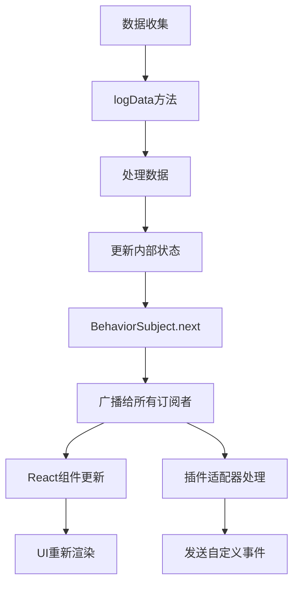

### 5. 具体示例

#### 内存数据收集示例
```typescript
// 1. 收集数据
dreamviewAnalysis.logData('Memory', {
    TotalJSHeapSize: memory.totalJSHeapSize / 1024 / 1024,
    UsedJSHeapSize: memory.usedJSHeapSize / 1024 / 1024,
    JSHeapSizeLimit: memory.jsHeapSizeLimit / 1024 / 1024,
}, {
    useStatistics: {
        useMax: true,
        useMin: true,
    },
});

// 2. 内部处理
// dataStream.value 从 {} 变成:
// {
//   Memory: {
//     TotalJSHeapSize: { value: 100, max: 100, min: 100, ... },
//     UsedJSHeapSize: { value: 50, max: 50, min: 50, ... },
//     JSHeapSizeLimit: { value: 200, max: 200, min: 200, ... }
//   }
// }

// 3. 触发更新
this.dataStream.next({...this.dataStream.value});

// 4. 所有订阅者收到新数据
// React组件: setData(newData) -> 重新渲染
// 插件适配器: 发送自定义事件
```

### 6. BehaviorSubject的优势

1. **即时性**: 新订阅者立即获得最新数据
2. **响应式**: 数据变化自动触发UI更新
3. **内存效率**: 只保存最新值，不保存历史
4. **类型安全**: TypeScript支持
5. **错误处理**: 内置错误传播机制
6. **取消订阅**: 防止内存泄漏

### 7. 性能优化

```typescript
// 使用requestIdleCallback避免阻塞主线程
const collectMemoryInfo = () =>
    requestIdleCallback(() => {
        // 收集数据
        dreamviewAnalysis.logData('Memory', {...});
        // 递归调用，持续监控
        collectMemoryInfo();
    });
```

这种设计确保了：
- **实时性**: 数据变化立即反映到UI
- **性能**: 不阻塞主线程
- **可扩展性**: 多个组件可以同时订阅
- **内存安全**: 正确的订阅管理

这就是RxJS BehaviorSubject在dreamview-analysis中实现实时数据更新的完整机制。

TSX文件是**TypeScript JSX**文件的扩展名，让我详细解释一下：

## TSX文件是什么

### 1. 基本定义
- **TSX** = **TypeScript** + **JSX**
- 文件扩展名：`.tsx`
- 这是一种特殊的TypeScript文件，支持JSX语法

### 2. JSX是什么
JSX (JavaScript XML) 是React中用于描述UI的语法扩展：

```jsx
// 这是JSX语法
const element = <h1>Hello, World!</h1>;
```

### 3. TSX vs TS vs JSX

| 文件类型   | 扩展名 | 用途             | 示例                                             |
| ---------- | ------ | ---------------- | ------------------------------------------------ |
| TypeScript | `.ts`  | 纯TypeScript代码 | `const name: string = "John";`                   |
| JSX        | `.jsx` | JavaScript + JSX | `const element = <div>Hello</div>;`              |
| TSX        | `.tsx` | TypeScript + JSX | `const element: JSX.Element = <div>Hello</div>;` |

## 在Dreamview-Analysis中的TSX文件

让我查看项目中的TSX文件示例：

Read file: frontend/packages/dreamview-analysis/react/PerformanceMonitor.tsx
Read file: frontend/packages/dreamview-analysis/react/PerformanceMonitor.tsx
## TSX文件的详细解析

### 1. TSX文件的特点

从上面的代码可以看出，TSX文件结合了：

#### TypeScript特性
```typescript
// 类型注解
const PerformanceMonitor: React.FC = () => { ... }

// 泛型类型
const [subscription, setSubscription] = useState<Subscription | null>(null);

// 接口类型
perfMonitor.on('measure', (measure: PerformanceMeasure) => { ... });
```

#### JSX语法
```jsx
// JSX元素
return ReactDOM.createPortal(
    <Draggable handle='.handle'>
        <Resizable
            defaultSize={{
                width: 300,
                height: 200,
            }}
            minWidth={300}
            minHeight={200}
            maxWidth={1800}
            maxHeight={1800}
            style={{
                position: 'fixed',
                bottom: 4,
                right: 4,
                backgroundColor: 'transparent',
                padding: '10px',
                zIndex: 1000,
            }}
        >
            <div
                style={{
                    position: 'relative',
                    width: '100%',
                    height: '100%',
                    backgroundColor: 'rgba(15, 15, 20, .6)',
                    padding: '10px',
                    borderRadius: '6px',
                    boxShadow: '0 2px 6px rgba(26, 29, 36, .5)',
                    zIndex: 1000,
                    backdropFilter: 'blur(10px)',
                }}
            >
                <strong style={{ color: 'rgba(128, 139, 157, 1.000)' }}>
                    Dreamview Analysis
                </strong>
            </div>
        </Resizable>
    </Draggable>,
    document.body,
);
```

### 2. TSX vs JSX vs TS 对比

| 特性          | TSX              | JSX              | TS             |
| ------------- | ---------------- | ---------------- | -------------- |
| **语法支持**  | TypeScript + JSX | JavaScript + JSX | 仅TypeScript   |
| **类型检查**  | ✅ 完整类型检查   | ❌ 无类型检查     | ✅ 完整类型检查 |
| **React组件** | ✅ 支持           | ✅ 支持           | ❌ 不支持JSX    |
| **编译**      | 需要TSX编译器    | 需要JSX编译器    | 需要TS编译器   |

### 3. TSX文件的优势

#### 类型安全
```typescript
// 组件属性类型检查
interface Props {
    service: DreamviewAnalysis;
    visible?: boolean;
}

const PerformanceMonitor: React.FC<Props> = ({ service, visible = false }) => {
    // TypeScript会检查service的类型
    const data = service.getDataStream();
    return <div>{/* JSX内容 */}</div>;
};
```

#### 智能提示
```typescript
// IDE会提供完整的类型提示
const [data, setData] = useState<Record<string, any>>({});
// 当你输入 data. 时，IDE会提示可能的属性
```

#### 编译时错误检查
```typescript
// 编译时会检查类型错误
const element: JSX.Element = <div>Hello</div>; // ✅ 正确
const element: string = <div>Hello</div>;      // ❌ 类型错误
```

### 4. TSX文件的编译过程

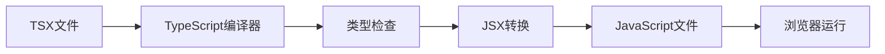

### 5. 实际使用示例

#### 简单的TSX组件
```tsx
import React, { useState } from 'react';

interface CounterProps {
    initialValue?: number;
    onCountChange?: (count: number) => void;
}

const Counter: React.FC<CounterProps> = ({ 
    initialValue = 0, 
    onCountChange 
}) => {
    const [count, setCount] = useState<number>(initialValue);

    const increment = () => {
        const newCount = count + 1;
        setCount(newCount);
        onCountChange?.(newCount);
    };

    return (
        <div>
            <p>Count: {count}</p>
            <button onClick={increment}>Increment</button>
        </div>
    );
};

export default Counter;
```

#### 复杂的TSX组件（如PerformanceMonitor）
```tsx
const PerformanceMonitor: React.FC = () => {
    // TypeScript状态管理
    const [data, setData] = useState<Record<string, any>>({});
    const [visible, setVisible] = useState<boolean>(false);
    
    // TypeScript类型注解
    const dreamviewAnalysis: DreamviewAnalysis = DreamviewAnalysis.getInstance();
    
    // JSX渲染
    return (
        <div style={{ position: 'fixed', bottom: 0, right: 0 }}>
            <h3>Performance Monitor</h3>
            <pre>{JSON.stringify(data, null, 2)}</pre>
        </div>
    );
};
```

### 6. 配置文件中的TSX支持

在项目的`tsconfig.json`中：
```json
{
    "compilerOptions": {
        "jsx": "react",  // 启用JSX支持
        "typeRoots": [
            "lib",
            "react",     // 包含React类型
            "src/@types",
            "node_modules/@types"
        ]
    },
    "include": [
        "**/*.ts",
        "**/*.tsx"      // 包含TSX文件
    ]
}
```

### 总结

TSX文件是：
- **TypeScript + JSX**的组合
- 提供**完整的类型安全**
- 支持**React组件开发**
- 在编译时进行**类型检查**
- 提供**更好的开发体验**（智能提示、错误检查）

在Dreamview-Analysis项目中，TSX文件用于创建类型安全的React组件，确保性能监控界面的可靠性和可维护性。

让我分析dreamview-analysis模块与后端的联系。首先查看相关的配置文件和代码结构。

Search files...
现在让我查看WebSocketManager中与dreamview-analysis相关的代码：

Ran tool
让我查看WebSocketManager中具体如何使用dreamview-analysis：

Read file: frontend/packages/dreamview-core/src/services/WebSocketManager/websocket-manager.service.ts
让我查看后端的数据处理器配置：

Read file: conf/data_handler.conf
现在让我查看后端SocketManager的实现：

Read file: backend/socket_manager/socket_manager.cc
## Dreamview-Analysis模块与后端的联系分析

基于代码分析，dreamview-analysis模块与后端有着密切的联系，主要体现在以下几个方面：

### 1. 数据流架构

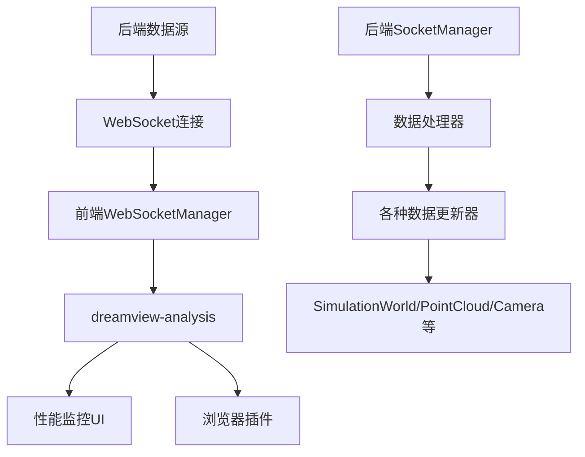

### 2. WebSocket连接机制

#### 后端WebSocket服务
```cpp
// backend/dreamview.cc
server_->addWebSocketHandler("/websocket", *websocket_);
server_->addWebSocketHandler("/map", *map_ws_);
server_->addWebSocketHandler("/pointcloud", *point_cloud_ws_);
server_->addWebSocketHandler("/camera", *camera_ws_);
server_->addWebSocketHandler("/plugin", *plugin_ws_);
server_->addWebSocketHandler("/simworld", *sim_world_ws_);
server_->addWebSocketHandler("/hmi", *hmi_ws_);
server_->addWebSocketHandler("/obstacle", *obstacle_ws_);
server_->addWebSocketHandler("/channelsinfo", *channels_info_ws_);
```

#### 前端WebSocket连接
```typescript
// frontend/packages/dreamview-core/src/services/WebSocketManager/websocket-manager.service.ts
export const config = {
    baseURL,
    baseHttpURL,
    mainUrl: `${baseURL}/websocket`,      // 主连接
    pluginUrl: `${baseURL}/plugin`,       // 插件连接
};
```

### 3. 数据处理器配置

#### 后端配置 (conf/data_handler.conf)
```protobuf
data_handler_info {
  key: "apollo.dreamview.SimulationWorld",
  value {
    data_name: "simworld",
    msg_type: "apollo.dreamview.SimulationWorld",
    websocket_info {
      websocket_name: "simworld",
      websocket_pipe: "/simworld"
    }
  }
}
```

#### 前端元数据处理
```typescript
// WebSocketManager处理元数据
private metadata: MetadataItem[] = [];
private metadataSubject: BehaviorSubject<MetadataItem[]> = new BehaviorSubject<MetadataItem[]>([]);
```

### 4. 性能监控集成

#### WebSocketManager中的性能监控
```typescript
// frontend/packages/dreamview-core/src/services/WebSocketManager/websocket-manager.service.ts
import { perfMonitor, DreamviewAnalysis } from '@dreamview/dreamview-analysis';

// 在数据反序列化过程中进行性能监控
this.workerPoolManager.dispatchTask({
    type: 'SOCKET_STREAM_MESSAGE',
    payload: <StreamMessage>message.payload,
    transferList: [data.buffer],
}, {
    callback: () => {
        perfMonitor.mark(`dataDeserializeStart-${name}`);
    },
}).then((response) => {
    if (response.success) {
        perfMonitor.mark(`dataDeserializeEnd-${name}`);
        perfMonitor.measure(
            `dataDeserialize-${name}`,
            `dataDeserializeStart-${name}`,
            `dataDeserializeEnd-${name}`,
        );
        this.dataSubjects.getByExactKey({ name })?.next(response.result);
    }
});
```

### 5. 数据订阅机制

#### 后端订阅处理
```cpp
// backend/socket_manager/socket_manager.cc
websocket_->RegisterMessageHandler(
    "subscribe",
    [this](const Json &json, WebSocketHandler::Connection *conn) {
        Json response;
        response["action"] = "response";
        response["data"]["info"] = {};
        response["data"]["info"]["code"] = this->Subscribe(json) ? 0 : -1;
        websocket_->SendData(conn, response.dump());
    });
```

#### 前端订阅请求
```typescript
// WebSocketManager发送订阅消息
public sendSubscriptionMessage<Param>(
    action: RequestMessageActionEnum,
    name: string,
    channel: Nullable<string>,
    option?: {
        param?: Param;
        dataFrequencyMs?: number;
    },
): void {
    const info: SubscribePayload = {
        websocketName: metadata.websocketInfo.websocketName,
        ...(isNil(channel) ? {} : { channelName: channel }),
        ...(isNil(option?.param) ? {} : { param: option.param }),
        dataFrequencyMs: option?.dataFrequencyMs ?? dataFrequencyMs,
    };

    this.mainConnection.sendMessage({
        action,
        type: action,
        data: {
            name: action,
            source: 'dreamview',
            info,
            sourceType: 'websocktSubscribe',
            targetType: 'module',
            requestId: action,
        },
    } as RequestStreamMessage);
}
```

### 6. 实时数据流

#### 后端数据更新器
```cpp
// backend/dreamview.cc
sim_world_updater_.reset(new SimulationWorldUpdater(
    websocket_.get(), map_ws_.get(), plugin_ws_.get(), map_service_.get(),
    plugin_manager_.get(), sim_world_ws_.get(), hmi_.get(),
    FLAGS_routing_from_file));
point_cloud_updater_.reset(new PointCloudUpdater(point_cloud_ws_.get()));
map_updater_.reset(new MapUpdater(map_ws_.get(), map_service_.get()));
obstacle_updater_.reset(new ObstacleUpdater(obstacle_ws_.get()));
```

#### 前端数据接收
```typescript
// 子WebSocket连接处理
this.activeWorkers[name].socketMessage$
    .pipe(throttle(() => timer(this.throttleDuration.value)))
    .subscribe((message) => {
        if (isMessageType(message, 'SOCKET_MESSAGE')) {
            const { data } = message.payload as StreamMessage;
            // 处理接收到的数据
            this.workerPoolManager.dispatchTask({
                type: 'SOCKET_STREAM_MESSAGE',
                payload: <StreamMessage>message.payload,
                transferList: [data.buffer],
            });
        }
    });
```

### 7. 插件适配器

#### 自定义事件分发
```typescript
// PerformanceMonitorPluginAdaptor.tsx
const sub = dreamviewAnalysis.getDataStream().subscribe({
    next: (data) => {
        // 发送自定义事件给浏览器插件
        const event = new CustomEvent('dreamview-analysis', {detail: data});
        document.dispatchEvent(event);
    },
    error: (err) => {
        console.error(err);
    },
});
```

#### 浏览器插件监听
```javascript
// dreamview-debug-extension
document.addEventListener('dreamview-analysis', (event) => {
    chrome.runtime.sendMessage({
        type: "updateData", 
        payload: event.detail
    });
});
```

### 8. 连接状态管理

#### 前端连接状态监控
```typescript
// WebSocketManagerStore
useEffect(() => {
    store.mainApi.webSocketManager.connectMain().subscribe((status) => {
        if (status === ConnectionStatusEnum.METADATA) {
            const metadata = store.mainApi.webSocketManager.getMetadata();
            if (metadata.find((item) => item.dataName === StreamDataNames.SIM_HMI_STATUS)) {
                store.otherApi.getSocketIns(SocketNameEnum.SIMULATION);
            }
            mainConnectionRef.current.publish('main:connection successful');
        }
    });
}, [store.mainApi, store.pluginApi]);
```

### 总结

dreamview-analysis模块与后端的联系主要体现在：

1. **数据源依赖**: 依赖后端提供的各种数据流（仿真世界、点云、摄像头等）
2. **性能监控**: 监控前后端数据交互的性能指标
3. **WebSocket通信**: 通过WebSocket接收后端实时数据
4. **插件集成**: 将性能数据分发给浏览器插件
5. **连接管理**: 监控和管理与后端的连接状态
6. **数据订阅**: 动态订阅后端数据源
7. **元数据同步**: 同步后端数据处理器配置

这种架构确保了前端能够实时获取后端数据，同时监控整个系统的性能状况，为开发者提供完整的性能分析能力。

这是一个很好的问题！让我分析一下为什么dreamview-analysis模块没有使用Redux，而是选择了RxJS BehaviorSubject。

Search files...
现在让我查看项目中是否有使用Redux的地方：

Ran tool
让我查看项目的package.json文件，看看是否有Redux依赖：

Ran tool
Read file: frontend/packages/dreamview-core/package.json
现在让我查看自定义Store的实现：

Read file: frontend/packages/dreamview-core/src/store/base/Store.ts
## 为什么dreamview-analysis没有使用Redux？

基于代码分析，我可以解释为什么dreamview-analysis模块没有使用Redux，而是选择了RxJS BehaviorSubject：

### 1. 项目架构选择：自定义Store而非Redux

#### 项目使用了自定义的状态管理方案
```typescript
// frontend/packages/dreamview-core/src/store/base/Store.ts
class Store<S, A> {
    private state: BehaviorSubject<S>;  // 使用RxJS BehaviorSubject
    private readonly reducer: (state: S, action: A) => S;
    
    constructor(initialState: S, reducer: (state: S, action: A) => S) {
        this.state = new BehaviorSubject(initialState);
        this.reducer = reducer;
    }
}
```

#### 项目依赖中没有Redux
```json
// frontend/packages/dreamview-core/package.json
{
    "dependencies": {
        "rxjs": "^7.8.1",        // 使用RxJS
        "immer": "^10.0.2",      // 使用Immer进行不可变更新
        // 没有redux相关依赖
    }
}
```

### 2. 为什么选择RxJS BehaviorSubject而不是Redux？

#### 2.1 性能考虑
```typescript
// dreamview-analysis中的实时数据流
private dataStream = new BehaviorSubject<Record<string, any>>({});

logData(source: string, metric: Record<string, any>, options?: MetricOptions): void {
    // 直接更新状态，无需通过action/reducer
    this.dataStream.value[source] = processedMetric;
    // 立即广播新值
    this.dataStream.next({...this.dataStream.value});
}
```

**优势**：
- **更少的开销**: 无需action创建、dispatch、reducer处理
- **更快的响应**: 直接状态更新，减少中间层
- **内存效率**: 只保存最新值，不保存历史状态

#### 2.2 实时数据流需求
```typescript
// 高频数据收集
const collectMemoryInfo = () =>
    requestIdleCallback(() => {
        dreamviewAnalysis.logData('Memory', {
            TotalJSHeapSize: memory.totalJSHeapSize / 1024 / 1024,
            UsedJSHeapSize: memory.usedJSHeapSize / 1024 / 1024,
            JSHeapSizeLimit: memory.jsHeapSizeLimit / 1024 / 1024,
        });
        collectMemoryInfo(); // 递归调用，持续监控
    });
```

**Redux的问题**：
- **性能瓶颈**: 频繁的action dispatch会导致性能问题
- **状态膨胀**: 历史状态积累导致内存占用
- **复杂性**: 对于简单状态更新过于复杂

#### 2.3 响应式编程优势
```typescript
// RxJS的响应式特性
const sub = dreamviewAnalysis.getDataStream().subscribe({
    next: (data) => {
        // 自动响应数据变化
        const event = new CustomEvent('dreamview-analysis', {detail: data});
        document.dispatchEvent(event);
    },
    error: (err) => {
        console.error(err);
    },
});
```

**RxJS的优势**：
- **自动响应**: 数据变化自动触发订阅者更新
- **操作符支持**: 丰富的流操作符（throttle、debounce等）
- **错误处理**: 内置错误传播机制

### 3. 项目整体架构的一致性

#### 3.1 统一使用RxJS
```typescript
// WebSocketManager也使用RxJS
private dataSubjects: MultiKeyMap<
    { name: string; channel?: Emptyable<string> },
    CountedSubject<StreamMessageData<unknown> | unknown>
> = new MultiKeyMap();
```

#### 3.2 自定义Store架构
```typescript
// 项目使用自定义Store，基于RxJS
export const { StoreProvider, useStore } = Factory.createStoreProvider<IInitState, TYPES.CombineAction>({
    initialState: initState,
    reducer,
});
```

### 4. 具体场景对比

#### 4.1 使用Redux的方式（如果选择）
```typescript
// 需要定义action
const updatePerformanceData = (source: string, data: any) => ({
    type: 'UPDATE_PERFORMANCE_DATA',
    payload: { source, data }
});

// 需要reducer处理
const performanceReducer = (state, action) => {
    switch (action.type) {
        case 'UPDATE_PERFORMANCE_DATA':
            return {
                ...state,
                [action.payload.source]: action.payload.data
            };
        default:
            return state;
    }
};

// 需要dispatch
dispatch(updatePerformanceData('Memory', memoryData));
```

#### 4.2 使用RxJS BehaviorSubject的方式（实际选择）
```typescript
// 直接更新，简洁高效
dreamviewAnalysis.logData('Memory', memoryData);
```

### 5. 技术选型的合理性

#### 5.1 项目特点
- **高频数据更新**: 性能监控需要实时数据
- **简单状态结构**: 主要是数据收集和展示
- **响应式需求**: 数据变化需要立即响应UI

#### 5.2 技术栈一致性
- **RxJS生态**: 项目大量使用RxJS进行异步处理
- **自定义Store**: 项目有自己的状态管理方案
- **性能优先**: 实时监控对性能要求较高

### 总结

dreamview-analysis没有使用Redux的原因：

1. **性能考虑**: 高频数据更新场景下，Redux的action/reducer模式开销较大
2. **架构一致性**: 项目整体使用RxJS和自定义Store架构
3. **实时性需求**: BehaviorSubject提供更直接的响应式数据流
4. **简洁性**: 对于简单的数据收集场景，RxJS比Redux更简洁
5. **技术栈统一**: 避免引入额外的状态管理库，保持技术栈一致性

这种选择是合理的，特别是在实时性能监控这种高频数据更新的场景下，RxJS BehaviorSubject提供了更好的性能和更简洁的API。

让我详细解释RxJS和JavaScript的关系。

## RxJS和JavaScript的关系

### 1. 基本关系

**RxJS是JavaScript的一个库**，具体来说：

- **RxJS** = **Reactive Extensions for JavaScript**
- 它是JavaScript的**响应式编程库**
- 基于**观察者模式**和**迭代器模式**
- 使用**函数式编程**思想

### 2. 技术层次关系

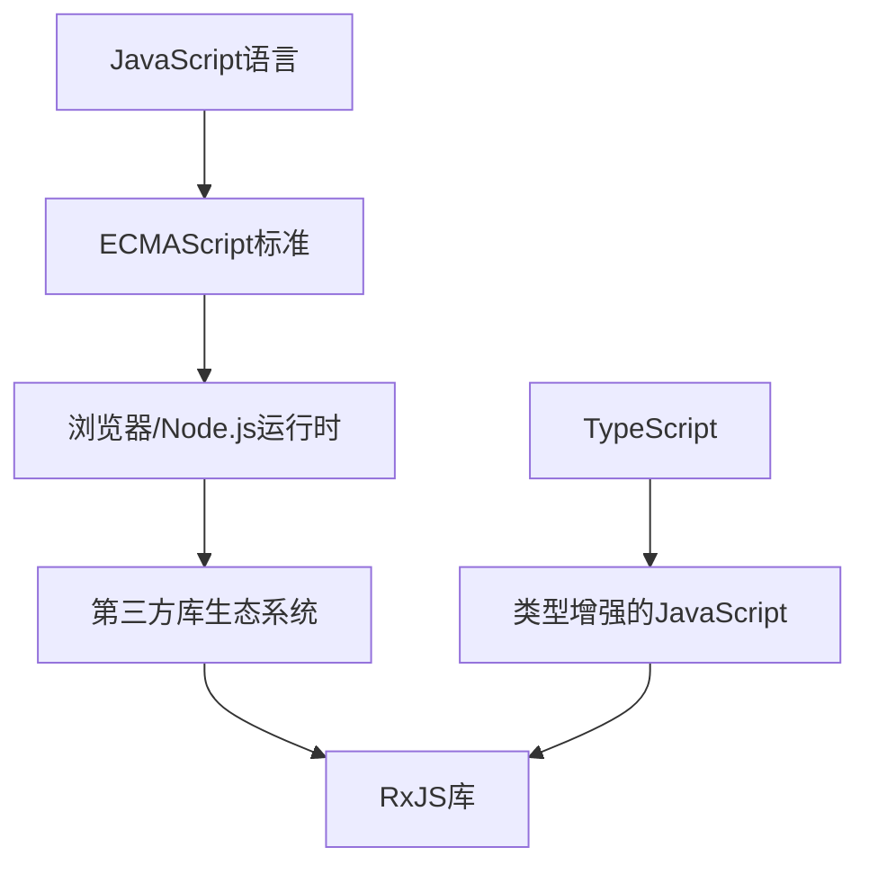

### 3. 在Dreamview项目中的体现

让我查看项目中RxJS的具体使用：

Ran tool
现在让我查看具体的RxJS使用示例：

Read file: frontend/packages/dreamview-core/src/services/WebSocketManager/websocket-connect.service.ts
Read file: frontend/packages/dreamview-core/src/services/WebSocketManager/websocket-manager.service.ts
## RxJS和JavaScript的详细关系解析

### 1. 基本概念关系

#### JavaScript是语言，RxJS是库
```javascript
// 纯JavaScript
const data = [1, 2, 3, 4, 5];
const doubled = data.map(x => x * 2);
console.log(doubled); // [2, 4, 6, 8, 10]

// 使用RxJS
import { from } from 'rxjs';
import { map } from 'rxjs/operators';

const dataStream = from([1, 2, 3, 4, 5]);
dataStream.pipe(
    map(x => x * 2)
).subscribe(result => console.log(result));
```

### 2. 在Dreamview项目中的具体应用

#### 2.1 WebSocket连接管理
```typescript
// 使用RxJS的WebSocket
import { webSocket, WebSocketSubject } from 'rxjs/webSocket';
import { BehaviorSubject, delay, Observable, retryWhen, Subject, take } from 'rxjs';

export class WebSocketConnection {
    private socket: WebSocketSubject<RequestMessage<any>>;
    private readonly receivedMessagesSubject = new Subject<ResponseMessage<any>>();
    connectionStatus$ = new BehaviorSubject<ConnectionStatusEnum>(ConnectionStatusEnum.DISCONNECTED);

    connect(retries = 3, retryInterval = 1000) {
        this.socket = webSocket({
            url: this.url,
            openObserver: {
                next: () => {
                    this.connectionStatus$.next(ConnectionStatusEnum.CONNECTED);
                },
            },
        });

        // 使用RxJS操作符处理重试逻辑
        this.socket.pipe(
            retryWhen((errors) => errors.pipe(delay(retryInterval), take(retries)))
        ).subscribe(
            (msg) => {
                this.receivedMessagesSubject.next(msg as ResponseMessage<any>);
            },
            (error) => {
                logger.error(error);
            },
        );
    }
}
```

#### 2.2 数据流处理
```typescript
// 使用RxJS操作符进行数据流控制
import { BehaviorSubject, filter, finalize, from, map, Observable, Subject, tap, timer } from 'rxjs';
import { debounceTime, throttle } from 'rxjs/operators';

export class WebSocketManager {
    // 使用BehaviorSubject管理状态
    private throttleDuration = new BehaviorSubject<number>(100);
    private metadataSubject: BehaviorSubject<MetadataItem[]> = new BehaviorSubject<MetadataItem[]>([]);

    // 使用操作符控制数据流频率
    this.activeWorkers[name].socketMessage$
        .pipe(throttle(() => timer(this.throttleDuration.value)))
        .subscribe((message) => {
            // 处理消息
        });
}
```

### 3. RxJS vs 原生JavaScript对比

#### 3.1 异步处理

**原生JavaScript (Promise/async-await)**:
```javascript
// 传统方式
async function fetchData() {
    try {
        const response = await fetch('/api/data');
        const data = await response.json();
        return data;
    } catch (error) {
        console.error('Error:', error);
    }
}
```

**RxJS方式**:
```typescript
// RxJS方式
import { from } from 'rxjs';
import { catchError, map } from 'rxjs/operators';

const dataStream = from(fetch('/api/data')).pipe(
    map(response => response.json()),
    catchError(error => {
        console.error('Error:', error);
        return [];
    })
);

dataStream.subscribe(data => console.log(data));
```

#### 3.2 事件处理

**原生JavaScript**:
```javascript
// 传统事件处理
const button = document.getElementById('button');
button.addEventListener('click', (event) => {
    console.log('Button clicked');
});

// 需要手动管理事件监听器
button.removeEventListener('click', handler);
```

**RxJS方式**:
```typescript
// RxJS事件处理
import { fromEvent } from 'rxjs';
import { take } from 'rxjs/operators';

const button = document.getElementById('button');
const clickStream = fromEvent(button, 'click');

// 自动管理订阅
const subscription = clickStream.pipe(
    take(5) // 只处理前5次点击
).subscribe(event => {
    console.log('Button clicked');
});

// 取消订阅
subscription.unsubscribe();
```

### 4. RxJS的核心概念

#### 4.1 Observable（可观察对象）
```typescript
// 创建Observable
import { Observable } from 'rxjs';

const observable = new Observable(subscriber => {
    subscriber.next(1);
    subscriber.next(2);
    subscriber.next(3);
    subscriber.complete();
});

observable.subscribe({
    next: value => console.log(value),
    complete: () => console.log('Done')
});
```

#### 4.2 Subject（主题）
```typescript
// BehaviorSubject - 有初始值，缓存最新值
import { BehaviorSubject } from 'rxjs';

const subject = new BehaviorSubject(0); // 初始值为0
subject.subscribe(value => console.log('Observer A:', value));

subject.next(1); // 输出: Observer A: 1
subject.next(2); // 输出: Observer A: 2

// 新订阅者立即获得最新值
subject.subscribe(value => console.log('Observer B:', value)); // 输出: Observer B: 2
```

#### 4.3 操作符（Operators）
```typescript
import { from } from 'rxjs';
import { map, filter, debounceTime } from 'rxjs/operators';

const numbers = from([1, 2, 3, 4, 5, 6, 7, 8, 9, 10]);

numbers.pipe(
    filter(x => x % 2 === 0),  // 过滤偶数
    map(x => x * 2),           // 每个数乘以2
    debounceTime(100)          // 防抖
).subscribe(result => console.log(result));
```

### 5. 在Dreamview项目中的优势

#### 5.1 统一的数据流管理
```typescript
// 所有数据都通过Observable管理
private dataSubjects: MultiKeyMap<
    { name: string; channel?: Emptyable<string> },
    CountedSubject<StreamMessageData<unknown> | unknown>
> = new MultiKeyMap();
```

#### 5.2 响应式状态管理
```typescript
// 状态变化自动触发UI更新
const [data, setData] = useState({});
const dreamviewAnalysis = DreamviewAnalysis.getInstance();

useEffect(() => {
    const sub = dreamviewAnalysis.getDataStream().subscribe(setData);
    return () => sub.unsubscribe();
}, []);
```

#### 5.3 复杂的异步操作处理
```typescript
// 处理WebSocket重连、错误处理、数据转换等复杂逻辑
this.socket.pipe(
    retryWhen((errors) => errors.pipe(delay(retryInterval), take(retries))),
    map(msg => this.transformMessage(msg)),
    catchError(error => this.handleError(error))
).subscribe(/* 处理结果 */);
```

### 6. 总结

RxJS和JavaScript的关系：

1. **JavaScript是基础语言**，RxJS是构建在JavaScript之上的**响应式编程库**
2. **RxJS扩展了JavaScript的能力**，提供了处理异步数据流的强大工具
3. **RxJS使用JavaScript的语法**，但引入了函数式编程和响应式编程的概念
4. **在Dreamview项目中**，RxJS主要用于：
   - WebSocket连接管理
   - 实时数据流处理
   - 状态管理
   - 事件处理
   - 异步操作控制

RxJS让JavaScript能够更好地处理复杂的异步场景，特别是在需要处理实时数据流的应用中，如Dreamview这样的实时监控系统。

------

我来帮您解析dreamview-core目录下的文件结构和内容。让我先查看这个目录的详细结构。

Ran tool
Read file: frontend/packages/dreamview-core/package.json
Read file: frontend/packages/dreamview-core/README.md
Ran tool
Read file: frontend/packages/dreamview-core/src/index.ts
Read file: frontend/packages/dreamview-core/src/App.tsx
Ran tool
Ran tool
Ran tool
Ran tool
Ran tool
Read file: frontend/packages/dreamview-core/src/InitAppData.tsx
Ran tool
Read file: frontend/packages/dreamview-core/config/webpack.section.js
Read file: frontend/packages/dreamview-core/tsconfig.json
现在让我查看一些关键的组件和store文件来更好地理解架构：

Read file: frontend/packages/dreamview-core/src/store/combineContext.tsx
Ran tool
Read file: frontend/packages/dreamview-core/src/components/panels/index.tsx
基于我对dreamview-core目录的详细分析，我来为您解析这个核心包的结构和功能：

## Dreamview-Core 核心包解析

### �� 包基本信息
- **名称**: `@dreamview/dreamview-core`
- **版本**: 5.0.13
- **描述**: Dreamview的核心包，提供主要的应用框架和基础功能
- **入口**: `src/index.ts` → `src/App.tsx`

### 🏗️ 整体架构

#### 1. **应用入口结构**
```
App.tsx (主应用组件)
├── ThemeProvider (主题提供者)
├── DndProvider (拖拽功能提供者)
├── CombineContext (组合上下文)
│   ├── AppInitProvider (应用初始化)
│   ├── EventHandlersProvider (事件处理器)
│   ├── WebSocketManagerProvider (WebSocket管理)
│   ├── UserInfoStoreProvider (用户信息)
│   ├── PanelCatalogProvider (面板目录)
│   ├── PanelLayoutStoreProvider (面板布局)
│   ├── MenuStoreProvider (菜单管理)
│   ├── HmiStoreProvider (HMI状态)
│   └── PanelInfoStoreProvider (面板信息)
├── InitAppData (应用数据初始化)
└── PageLayout (页面布局)
```

#### 2. **核心目录结构**

**📁 src/components/** - 组件库
- `panels/` - 各种功能面板（Console、CameraView、PointCloud等）
- `PageLayout/` - 页面布局组件
- `PanelLayout/` - 面板布局组件
- `Menu/` - 菜单组件
- `BottomBar/` - 底部栏组件
- `CustomPopover/` - 自定义弹出框

**📁 src/store/** - 状态管理
- `AppInitStore/` - 应用初始化状态
- `PanelLayoutStore/` - 面板布局状态
- `HmiStore/` - HMI状态管理
- `WebSocketManagerStore/` - WebSocket连接管理
- `UserInfoStore/` - 用户信息状态
- `MenuStore/` - 菜单状态

**�� src/services/** - 服务层
- `WebSocketManager/` - WebSocket通信管理
- `api/` - API接口
- `models/` - 数据模型
- `hooks/` - 服务相关钩子

**�� src/hooks/** - 自定义React钩子
- `useComponentDisplay.ts` - 组件显示控制
- `useCarviz.ts` - Carviz相关
- `useFullScreen.ts` - 全屏功能
- `useUpdateChannel.ts` - 通道更新

**�� src/util/** - 工具函数
- `ProtoLoader.ts` - Protocol Buffer加载器
- `MessageQueue.ts` - 消息队列
- `MultiKeyMap.ts` - 多键映射
- `IndexedDBStorage.ts` - 本地存储
- `PerformanceMonitor/` - 性能监控

### �� 主要功能模块

#### 1. **面板系统 (Panels)**
支持多种功能面板：
- **Console** - 控制台面板
- **CameraView** - 摄像头视图
- **PointCloud** - 点云显示
- **VehicleViz** - 车辆可视化
- **DashBoard** - 仪表板
- **Terminal** - 终端
- **Charts** - 图表组件

#### 2. **状态管理系统**
使用Context API构建的状态管理体系：
- **组合上下文模式**: 通过`CombineContext`组合多个Provider
- **模块化状态**: 每个功能模块有独立的状态管理
- **响应式更新**: 基于RxJS的响应式数据流

#### 3. **WebSocket通信**
- **实时数据流**: 处理来自后端的实时数据
- **协议解析**: 支持Protocol Buffer格式
- **连接管理**: 自动重连和状态监控

#### 4. **模块联邦 (Module Federation)**
- **远程模块加载**: 支持动态加载远程面板
- **插件化架构**: 可扩展的面板系统
- **懒加载**: 按需加载组件

### 🛠️ 技术栈

**前端框架**: React 18 + TypeScript
**状态管理**: Context API + RxJS
**UI组件**: 自定义组件库
**构建工具**: Webpack + Babel
**样式**: Less + PostCSS
**3D渲染**: Three.js
**通信**: WebSocket + Protocol Buffer

### 📊 应用初始化流程

1. **Proto文件解析** - 加载Protocol Buffer定义
2. **WebSocket连接** - 建立与后端的通信
3. **用户信息初始化** - 加载用户配置
4. **HMI状态初始化** - 设置HMI模式
5. **布局初始化** - 恢复面板布局
6. **动态配置加载** - 加载动态配置

### �� 核心特性

- **模块化设计**: 高度模块化的组件和状态管理
- **可扩展性**: 支持远程模块和插件系统
- **实时通信**: 基于WebSocket的实时数据流
- **性能监控**: 内置性能监控工具
- **主题系统**: 支持主题切换
- **国际化**: 支持多语言

这个核心包为Dreamview提供了完整的前端应用框架，包括状态管理、组件系统、通信机制等基础设施，是整个Dreamview应用的核心支撑。

让我详细解释一下组合上下文模式的作用和优势。

Read file: frontend/packages/dreamview-core/src/store/combineContext.tsx
Read file: frontend/packages/dreamview-core/src/App.tsx
现在让我查看一个具体的Provider实现来更好地理解这种模式：

Ran tool
Read file: frontend/packages/dreamview-core/src/store/PanelLayoutStore/index.tsx
Read file: frontend/packages/dreamview-core/src/store/base/index.ts
Read file: frontend/packages/dreamview-core/src/store/base/Factory.ts
Read file: frontend/packages/dreamview-core/src/store/base/Factory.tsx
现在我来详细解释**组合上下文模式**的作用和优势：

## 组合上下文模式的作用和优势

### 🎯 **核心作用**

组合上下文模式通过`CombineContext`组件将多个React Context Provider组合在一起，避免了传统的嵌套写法，提供了更清晰、更易维护的状态管理架构。

### 📊 **传统写法 vs 组合上下文模式**

#### 传统嵌套写法（复杂且难以维护）：
```tsx
// 传统方式 - 嵌套地狱
<ThemeProvider>
  <DndProvider backend={HTML5Backend}>
    <AppInitProvider>
      <EventHandlersProvider>
        <WebSocketManagerProvider>
          <UserInfoStoreProvider>
            <PanelCatalogProvider>
              <PanelLayoutStoreProvider>
                <MenuStoreProvider>
                  <HmiStoreProvider>
                    <PickHmiStoreProvider>
                      <PanelInfoStoreProvider>
                        <InitAppData />
                        <PageLayout />
                      </PanelInfoStoreProvider>
                    </PickHmiStoreProvider>
                  </HmiStoreProvider>
                </MenuStoreProvider>
              </PanelLayoutStoreProvider>
            </PanelCatalogProvider>
          </UserInfoStoreProvider>
        </WebSocketManagerProvider>
      </EventHandlersProvider>
    </AppInitProvider>
  </DndProvider>
</ThemeProvider>
```

#### 组合上下文模式（清晰简洁）：
```tsx
// 组合上下文模式
const Providers = [
  <AppInitProvider key='AppInitProvider' />,
  <EventHandlersProvider key='EventHandlersProvider' />,
  <WebSocketManagerProvider key='WebSocketManagerProvider' />,
  <UserInfoStoreProvider key='UserInfoStoreProvider' />,
  <PanelCatalogProvider key='PanelCatalogProvider' />,
  <PanelLayoutStoreProvider key='PanelLayoutStoreProvider' />,
  <MenuStoreProvider key='MenuStoreProvider' />,
  <HmiStoreProvider key='HmiStoreProvider' />,
  <PickHmiStoreProvider key='PickHmiStoreProvider' />,
  <PanelInfoStoreProvider key='PanelInfoStoreProvider' />,
];

<ThemeProvider>
  <DndProvider backend={HTML5Backend}>
    <CombineContext providers={Providers}>
      <InitAppData />
      <PageLayout />
    </CombineContext>
  </DndProvider>
</ThemeProvider>
```

### 🔧 **实现原理**

```tsx
export default function CombineContext(props: PropsWithChildren<ICombineContext>) {
    const { providers, children } = props;
    const wrapped = providers.reduceRight(
        (wrappedChildren, provider) => React.cloneElement(provider, undefined, wrappedChildren),
        children,
    );
    return <>{wrapped}</>;
}
```

**关键点**：
- 使用`reduceRight`从右到左组合Provider
- 每个Provider包裹前一个Provider的结果
- 最终形成一个Provider链

### ✨ **主要优势**

#### 1. **代码可读性**
- **扁平化结构**：避免了深层嵌套，代码更易读
- **清晰的依赖关系**：Provider数组直观显示所有状态管理模块
- **易于维护**：添加/删除Provider只需修改数组

#### 2. **模块化管理**
- **独立状态模块**：每个Provider管理独立的功能域
- **解耦合**：不同状态模块之间解耦
- **可复用**：Provider可以在不同组件中复用

#### 3. **性能优化**
- **按需加载**：可以动态添加/移除Provider
- **状态隔离**：每个Provider的状态变化只影响相关组件
- **避免不必要的重渲染**：精确的状态更新

#### 4. **开发体验**
- **易于调试**：每个Provider有独立的key，便于调试
- **类型安全**：TypeScript支持，提供完整的类型检查
- **测试友好**：可以单独测试每个Provider

### 🏗️ **在Dreamview中的应用**

在Dreamview中，组合上下文模式管理了以下核心状态：

```tsx
const Providers = [
  // 应用初始化状态
  <AppInitProvider key='AppInitProvider' />,
  
  // 事件处理
  <EventHandlersProvider key='EventHandlersProvider' />,
  
  // WebSocket通信管理
  <WebSocketManagerProvider key='WebSocketManagerProvider' />,
  
  // 用户信息
  <UserInfoStoreProvider key='UserInfoStoreProvider' />,
  
  // 面板目录
  <PanelCatalogProvider key='PanelCatalogProvider' />,
  
  // 面板布局
  <PanelLayoutStoreProvider key='PanelLayoutStoreProvider' />,
  
  // 菜单状态
  <MenuStoreProvider key='MenuStoreProvider' />,
  
  // HMI状态
  <HmiStoreProvider key='HmiStoreProvider' />,
  <PickHmiStoreProvider key='PickHmiStoreProvider' />,
  
  // 面板信息
  <PanelInfoStoreProvider key='PanelInfoStoreProvider' />,
];
```

### 🎯 **实际效果**

1. **状态隔离**：每个功能模块的状态独立管理
2. **数据流清晰**：从WebSocket → 用户信息 → 面板布局 → UI渲染
3. **易于扩展**：新增功能只需添加新的Provider
4. **维护简单**：修改某个功能只需关注对应的Provider

这种模式特别适合像Dreamview这样的大型应用，因为它需要管理多个复杂的状态模块（WebSocket通信、面板布局、用户配置等），组合上下文模式让这些复杂的状态管理变得清晰和可维护。

让我详细分析一下Dreamview中这些Provider的具体作用。首先让我查看每个Provider的实现来了解它们的功能。

Ran tool
Read file: frontend/packages/dreamview-core/src/store/AppInitStore/index.tsx
Ran tool
Read file: frontend/packages/dreamview-core/src/store/WebSocketManagerStore/index.tsx
Ran tool
Read file: frontend/packages/dreamview-core/src/store/HmiStore/index.tsx
Ran tool
Read file: frontend/packages/dreamview-core/src/store/PanelLayoutStore/actionTypes.ts
Ran tool
Read file: frontend/packages/dreamview-core/src/store/UserInfoStore/index.tsx
Read file: frontend/packages/dreamview-core/src/store/UserInfoStore/actionTypes.ts
Ran tool
Read file: frontend/packages/dreamview-core/src/store/MenuStore/actionTypes.ts
Ran tool
Read file: frontend/packages/dreamview-core/src/store/PanelCatalogStore/index.tsx
现在让我查看EventHandlersStore来了解事件处理机制：

Ran tool
Read file: frontend/packages/dreamview-core/src/store/EventHandlersStore/index.tsx
基于我对各个Provider的详细分析，现在我来详细解释这些Provider的具体作用：

## Dreamview中各个Provider的作用详解

### 🎯 **1. AppInitProvider - 应用初始化状态管理**

**作用**：管理整个应用的初始化状态和进度

**核心功能**：
- **初始化进度跟踪**：监控各个模块的初始化状态（LOADING/DONE/FAIL）
- **模块注册机制**：允许子组件注册自己的初始化状态
- **全局初始化控制**：当所有模块初始化完成后，设置`hasInit = true`
- **进度回调**：提供进度变化的回调机制

**使用场景**：
```tsx
// 在子组件中注册初始化状态
const changeHandler = useRegistryInitEvent('Proto Parsing', 2);
changeHandler({
    status: IAppInitStatus.LOADING,
    progress: 50,
    message: '正在解析协议文件...'
});
```

### 🌐 **2. WebSocketManagerProvider - WebSocket通信管理**

**作用**：管理所有WebSocket连接和实时数据流

**核心功能**：
- **主连接管理**：连接主服务器，处理核心数据流
- **插件连接管理**：连接插件服务器，处理扩展功能
- **元数据管理**：管理数据通道的元信息
- **连接状态监控**：监控连接状态（CONNECTED/DISCONNECTED/METADATA）
- **API封装**：提供MainApi、PluginApi、StreamApi等接口

**使用场景**：
```tsx
// 获取主API实例
const mainApi = useMainApi();
// 获取元数据
const [metadata, setMetadata] = useMetadata();
// 获取WebSocket管理器
const wsManager = useWebSocketManager();
```

### 🎮 **3. HmiStoreProvider - HMI状态管理**

**作用**：管理人机交互界面的核心状态

**核心功能**：
- **当前模式管理**：管理当前HMI模式（如：PNC、Perception等）
- **操作状态管理**：管理当前操作状态
- **记录状态管理**：管理数据记录状态
- **状态持久化**：保存和恢复HMI状态

**使用场景**：
```tsx
// 获取HMI状态
const [hmi, dispatch] = useHmiStore();
// 更新当前模式
dispatch(updateCurrentMode('PNC'));
// 更新操作状态
dispatch(updateCurrentOperate('START'));
```

### ��️ **4. PickHmiStoreProvider - 优化的HMI状态管理**

**作用**：提供性能优化的HMI状态访问

**核心功能**：
- **状态过滤**：过滤掉频繁变化的状态（如currentRecordStatus）
- **性能优化**：减少不必要的重渲染
- **深度比较**：使用深度比较避免不必要的状态更新

**设计理念**：将频繁变化的状态和稳定状态分离，提高性能

### 📐 **5. PanelLayoutStoreProvider - 面板布局管理**

**作用**：管理所有面板的布局和位置信息

**核心功能**：
- **布局状态管理**：管理每个模式下的面板布局
- **面板操作**：添加、删除、移动面板
- **布局持久化**：保存和恢复布局配置
- **模式关联**：不同HMI模式对应不同的布局

**使用场景**：
```tsx
// 获取当前布局
const currentLayout = useGetCurrentLayout();
// 添加面板
dispatch(addPanelFromOutside(panelInfo));
// 重置布局
dispatch(resetLayout());
```

### �� **6. UserInfoStoreProvider - 用户信息管理**

**作用**：管理用户相关的信息和配置

**核心功能**：
- **用户信息管理**：存储用户基本信息
- **账户切换**：支持多账户切换
- **用户偏好**：保存用户个性化设置
- **订阅管理**：管理用户的数据订阅

### 🍔 **7. MenuStoreProvider - 菜单状态管理**

**作用**：管理应用菜单和导航状态

**核心功能**：
- **菜单状态管理**：管理菜单的显示/隐藏状态
- **认证状态管理**：管理用户认证状态
- **环境管理器**：管理地图、场景、记录等环境资源
- **ADS管理器**：管理车辆、V2X、动态等ADS资源

**菜单类型**：
- `MODE_SETTING` - 模式设置
- `ADD_PANEL` - 添加面板
- `PROFILE_MANAGER` - 配置文件管理
- `HIDDEN` - 隐藏菜单

### 📚 **8. PanelCatalogProvider - 面板目录管理**

**作用**：管理所有可用面板的目录和组件

**核心功能**：
- **面板注册**：注册所有可用的面板类型
- **组件懒加载**：支持面板组件的懒加载
- **远程面板**：支持加载远程面板模块
- **工具栏管理**：管理面板的工具栏组件

**使用场景**：
```tsx
// 获取面板信息
const panelInfo = panelCatalog.get('Console');
// 获取面板组件
const PanelComponent = panelComponents.get('Console');
// 获取工具栏组件
const ToolbarComponent = panelToolBar.get('Console');
```

### �� **9. EventHandlersProvider - 事件处理管理**

**作用**：提供全局的事件处理机制

**核心功能**：
- **键盘事件处理**：处理键盘快捷键和组合键
- **拖拽事件处理**：处理拖拽相关事件
- **自定义事件**：提供发布/订阅机制
- **事件过滤**：支持事件过滤和条件监听

**使用场景**：
```tsx
// 监听组合键
setMultiPressedKey(
    (event) => console.log('Ctrl+A pressed'),
    ['a'],
    'ctrlKey'
);

// 自定义事件
const customEvent = customizeSubs.getCustomizeEvent('myEvent');
customEvent.subscribe((data) => console.log(data));
customEvent.publish('hello');
```

### 📋 **10. PanelInfoStoreProvider - 面板信息管理**

**作用**：管理面板的详细信息状态

**核心功能**：
- **面板元信息**：存储面板的元数据
- **面板状态**：管理面板的显示状态
- **面板配置**：管理面板的配置信息

### 🔄 **Provider之间的协作关系**

```
AppInitProvider (初始化控制)
    ↓
WebSocketManagerProvider (建立连接)
    ↓
UserInfoStoreProvider (加载用户信息)
    ↓
HmiStoreProvider (设置HMI状态)
    ↓
PanelCatalogProvider (加载面板目录)
    ↓
PanelLayoutStoreProvider (恢复布局)
    ↓
MenuStoreProvider (设置菜单状态)
    ↓
EventHandlersProvider (启动事件监听)
```

### �� **总结**

这些Provider共同构建了一个完整的状态管理体系：

1. **分层管理**：每个Provider负责特定的功能域
2. **数据流清晰**：从初始化 → 连接 → 用户信息 → 界面状态
3. **性能优化**：通过状态分离和懒加载优化性能
4. **可扩展性**：支持远程模块和插件系统
5. **事件驱动**：基于事件的松耦合架构

这种设计使得Dreamview能够处理复杂的自动驾驶可视化需求，同时保持良好的代码组织和性能表现。

让我详细分析这些Provider是如何串起来的。首先让我查看CombineContext的具体实现和App.tsx中的使用方式。

Read file: frontend/packages/dreamview-core/src/store/combineContext.tsx
Read file: frontend/packages/dreamview-core/src/App.tsx
现在让我查看一些具体的Provider实现，了解它们是如何相互依赖的：

Read file: frontend/packages/dreamview-core/src/store/WebSocketManagerStore/index.tsx
Read file: frontend/packages/dreamview-core/src/store/PanelCatalogStore/index.tsx
Read file: frontend/packages/dreamview-core/src/store/PanelLayoutStore/index.tsx
现在让我查看InitAppData来了解初始化流程：

Read file: frontend/packages/dreamview-core/src/InitAppData.tsx
现在我来详细解释这些Provider是如何串起来的：

## Provider串联机制详解

### 🔗 **1. 物理串联 - CombineContext的实现**

```tsx
// CombineContext的核心逻辑
const wrapped = providers.reduceRight(
    (wrappedChildren, provider) => React.cloneElement(provider, undefined, wrappedChildren),
    children,
);
```

**串联过程**：
```tsx
// 假设providers数组为：[A, B, C]，children为<PageLayout />
// reduceRight从右到左执行：

// 第1步：C包裹PageLayout
C(PageLayout)

// 第2步：B包裹C(PageLayout)  
B(C(PageLayout))

// 第3步：A包裹B(C(PageLayout))
A(B(C(PageLayout)))

// 最终结果：
<A>
  <B>
    <C>
      <PageLayout />
    </C>
  </B>
</A>
```

### 📋 **2. 逻辑串联 - Provider的执行顺序**

在App.tsx中，Provider的执行顺序是：

```tsx
const Providers = [
    <AppInitProvider key='AppInitProvider' />,           // 1. 应用初始化
    <EventHandlersProvider key='EventHandlersProvider' />, // 2. 事件处理
    <WebSocketManagerProvider key='WebSocketManagerProvider' />, // 3. WebSocket连接
    <UserInfoStoreProvider key='UserInfoStoreProvider' />, // 4. 用户信息
    <PanelCatalogProvider key='PanelCatalogProvider' />, // 5. 面板目录
    <PanelLayoutStoreProvider key='PanelLayoutStoreProvider' />, // 6. 面板布局
    <MenuStoreProvider key='MenuStoreProvider' />, // 7. 菜单状态
    <HmiStoreProvider key='HmiStoreProvider' />, // 8. HMI状态
    <PickHmiStoreProvider key='PickHmiStoreProvider' />, // 9. 优化的HMI状态
    <PanelInfoStoreProvider key='PanelInfoStoreProvider' />, // 10. 面板信息
];
```

### 🔄 **3. 依赖关系串联**

#### **直接依赖关系**：

```tsx
// WebSocketManagerProvider 依赖 EventHandlersProvider
function WebSocketManagerInner() {
    const eventHandlers = useEventHandlersContext(); // 使用事件处理器
    // ...
}

// PanelCatalogProvider 依赖 WebSocketManagerProvider
export function PanelCatalogProvider() {
    const { mainApi, isMainConnected } = useWebSocketServices(); // 使用WebSocket服务
    // ...
}

// PanelLayoutStoreProvider 依赖 HmiStoreProvider
export function useGetCurrentLayout() {
    const [hmi] = usePickHmiStore(); // 使用HMI状态
    const [store] = usePanelLayoutStore();
    // ...
}
```

#### **数据流依赖**：

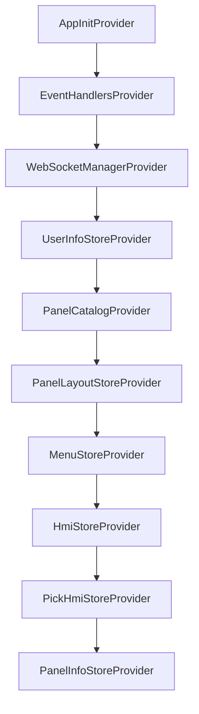

### ⚡ **4. 初始化流程串联**

在`InitAppData`组件中，各个初始化hook按照依赖关系执行：

```tsx
export default function InitAppData() {
    useInitLayout();        // 依赖WebSocket和HMI状态
    useInitHmiStatus();     // 依赖WebSocket连接
    useInitUserMixInfo();   // 依赖用户信息
    useInitAppData();       // 依赖基础数据
    useInitDynamic();       // 依赖动态配置
    useInitProto();         // 依赖协议解析
    useInitWebSocket();     // 依赖WebSocket管理器
    useInitDreamviewVersion(); // 依赖版本信息
    return <></>;
}
```

### 🎯 **5. 状态共享机制**

#### **Context嵌套访问**：
```tsx
// 外层Provider的状态可以被内层Provider访问
function InnerComponent() {
    // 可以访问所有外层Provider的状态
    const [hmi] = useHmiStore();           // 来自HmiStoreProvider
    const [layout] = usePanelLayoutStore(); // 来自PanelLayoutStoreProvider
    const mainApi = useMainApi();          // 来自WebSocketManagerProvider
    const eventHandlers = useEventHandlersContext(); // 来自EventHandlersProvider
}
```

#### **状态更新传播**：
```tsx
// 当某个Provider的状态更新时，会触发依赖它的组件重新渲染
function useGetCurrentLayout() {
    const [hmi] = usePickHmiStore();     // 监听HMI状态变化
    const [store] = usePanelLayoutStore(); // 监听布局状态变化
    
    // 当hmi.currentMode变化时，会重新计算当前布局
    const currentLayout = store.layout[hmi.currentMode]?.layout;
    return currentLayout;
}
```

### 🔧 **6. 实际串联示例**

让我用一个具体的例子来说明：

```tsx
// 1. 用户点击切换HMI模式
dispatch(updateCurrentMode('PNC')); // 触发HmiStoreProvider状态更新

// 2. HMI状态更新触发布局重新计算
function useGetCurrentLayout() {
    const [hmi] = usePickHmiStore(); // 监听到currentMode变化
    const [store] = usePanelLayoutStore();
    return store.layout[hmi.currentMode]?.layout; // 返回PNC模式的布局
}

// 3. 布局变化触发面板重新渲染
function PanelLayout() {
    const currentLayout = useGetCurrentLayout(); // 获取新布局
    return renderPanels(currentLayout); // 重新渲染面板
}

// 4. 面板渲染需要面板组件
function renderPanels(layout) {
    const PanelComponent = panelComponents.get(panelType); // 从PanelCatalogProvider获取
    return <PanelComponent />;
}

// 5. 面板组件需要数据
function PanelComponent() {
    const data = useStreamData(); // 从WebSocketManagerProvider获取实时数据
    return renderData(data);
}
```

### 🎪 **7. 事件驱动的串联**

```tsx
// WebSocket连接成功事件
store.mainApi.webSocketManager.connectMain().subscribe((status) => {
    if (status === ConnectionStatusEnum.METADATA) {
        // 触发连接成功事件
        mainConnectionRef.current.publish('main:connection successful');
        
        // 其他Provider监听此事件并执行相应操作
        // 例如：PanelCatalogProvider开始加载面板数据
        // 例如：UserInfoStoreProvider开始加载用户信息
    }
});
```

### 📊 **总结**

Provider的串联机制包含三个层面：

1. **物理串联**：通过React Context的嵌套结构
2. **逻辑串联**：通过依赖关系和执行顺序
3. **数据串联**：通过状态共享和事件传播

这种设计实现了：
- **解耦合**：每个Provider独立管理自己的状态
- **可组合**：Provider可以灵活组合和重用
- **高性能**：只有依赖的状态变化才会触发重渲染
- **可维护**：清晰的依赖关系和数据流

这就是为什么Dreamview能够处理复杂的自动驾驶可视化需求，同时保持良好的代码组织和性能表现的原因。

让我为您绘制frontend中的架构图。首先让我分析整个frontend的结构，然后创建一个清晰的架构图。

Ran tool
Read file: frontend/lerna.json
Ran tool
Read file: frontend/packages/dreamview-web/package.json
Read file: frontend/packages/dreamview/package.json
Read file: frontend/packages/dreamview-ui/package.json
Read file: frontend/packages/dreamview-carviz/package.json
Read file: frontend/packages/dreamview-theme/package.json
Read file: frontend/packages/dreamview-lang/package.json
Read file: frontend/packages/dreamview-analysis/package.json
现在让我查看一些核心包的结构来更好地理解架构：

Ran tool
Ran tool
基于我对frontend结构的深入分析，现在我来为您绘制完整的架构图：

# Dreamview Frontend 架构图

## 🏗️ **整体架构概览**

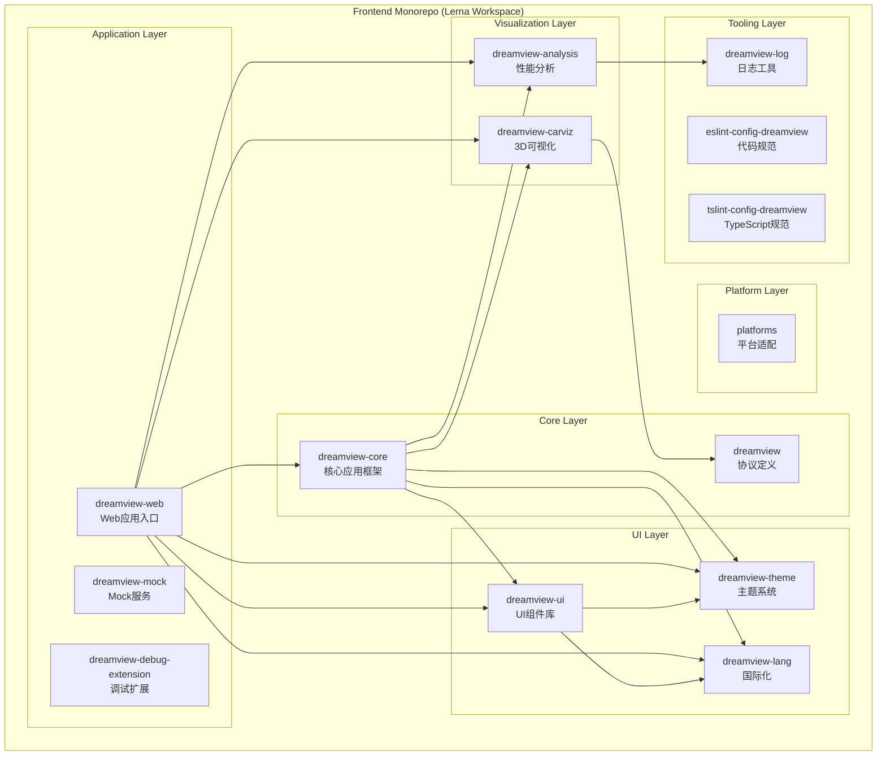

## 📦 **包依赖关系图**

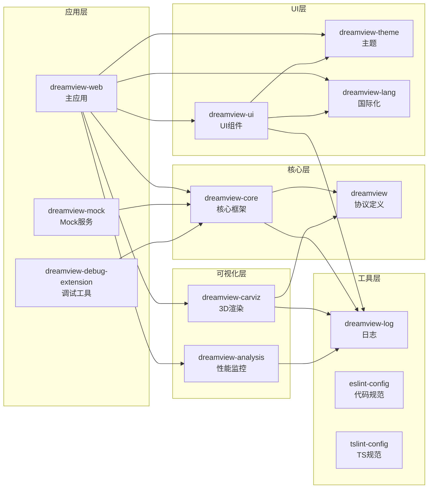

## �� **Core架构详细图**

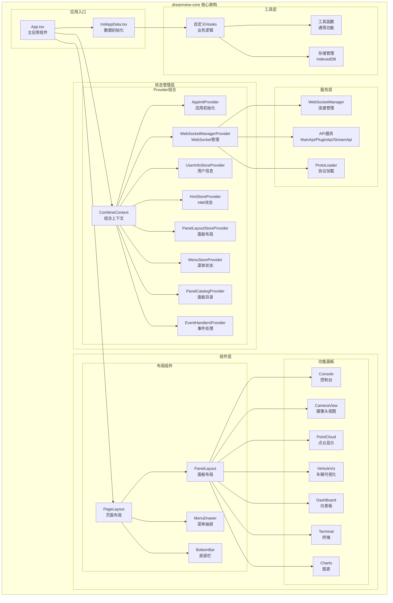

## 🔄 **数据流架构图**

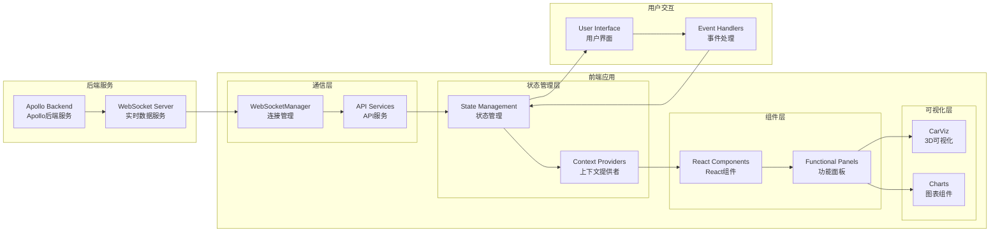

## 🎨 **UI组件架构图**

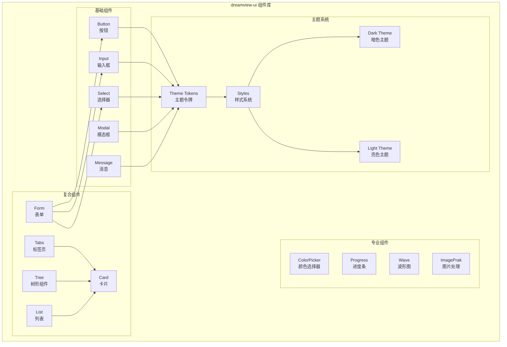

## 🌐 **模块联邦架构图**

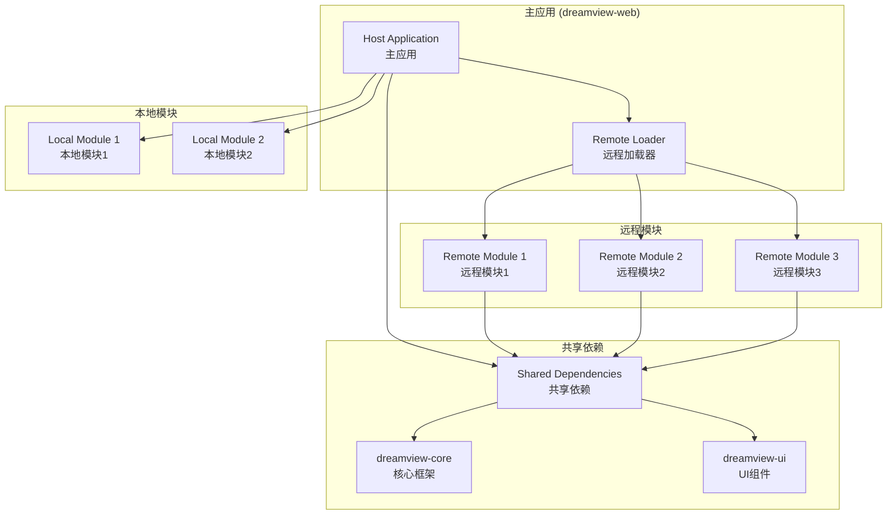

## �� **构建和部署架构图**

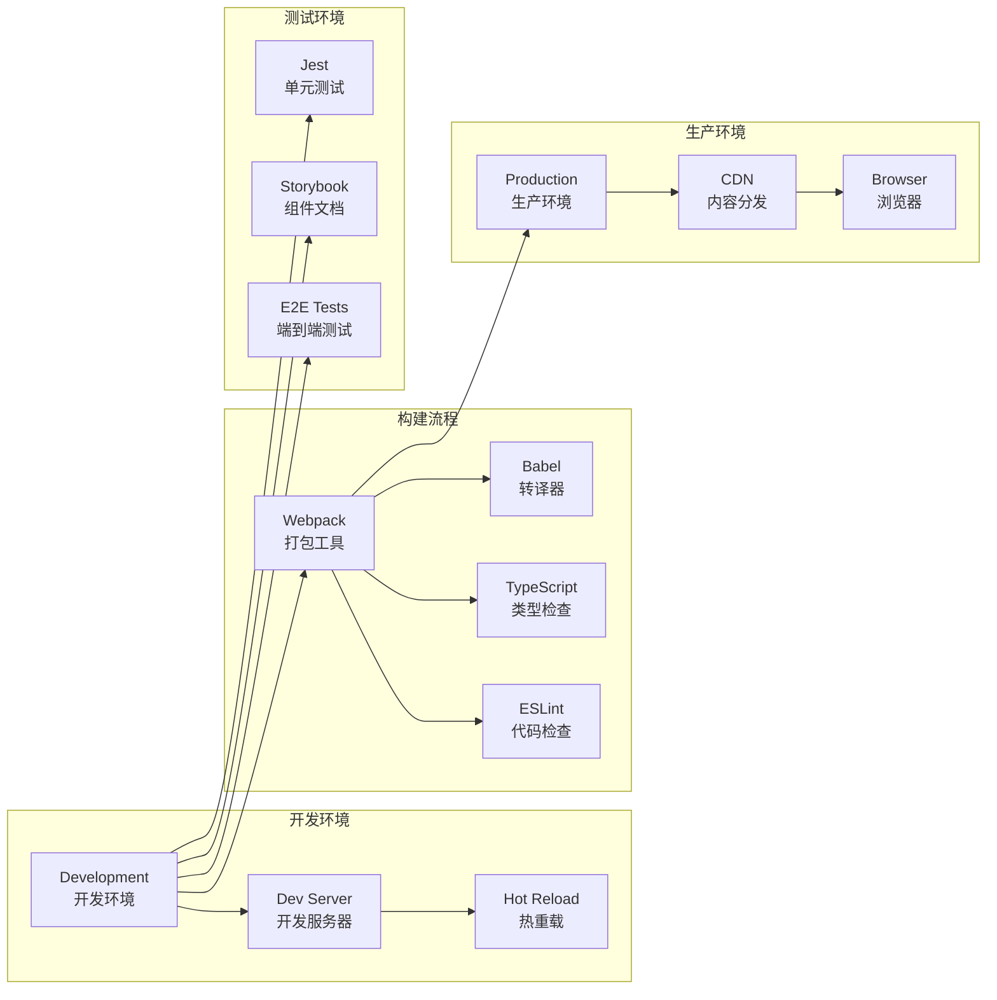

## 📊 **技术栈架构图**

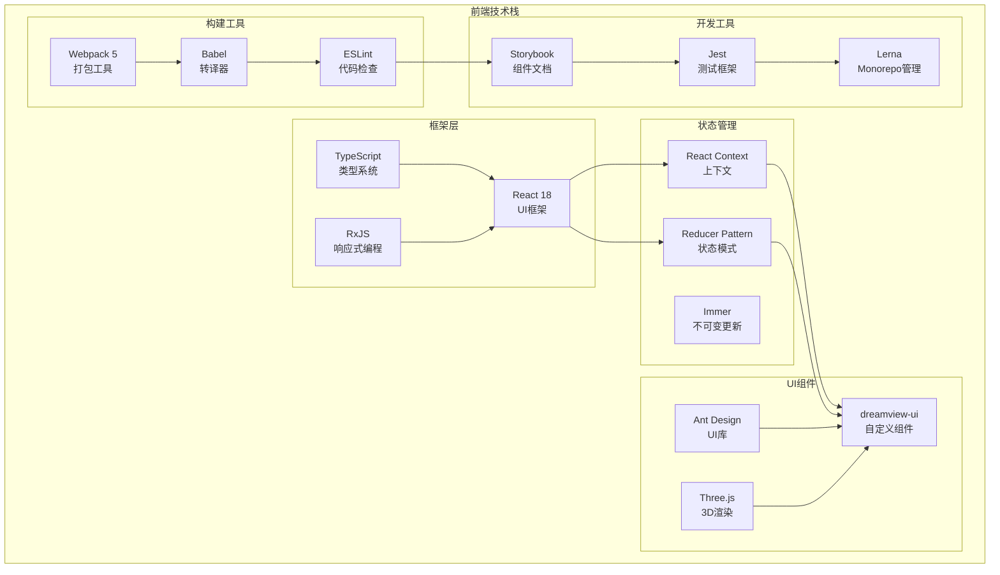

## 🎯 **总结**

Dreamview Frontend采用了现代化的前端架构设计：

### **核心特点**：
1. **Monorepo架构**：使用Lerna管理多个包
2. **模块化设计**：每个功能模块独立封装
3. **组件化开发**：可复用的UI组件系统
4. **状态管理**：基于Context的响应式状态管理
5. **类型安全**：完整的TypeScript支持
6. **性能优化**：懒加载、代码分割、缓存策略

### **架构优势**：
- **可扩展性**：支持远程模块和插件系统
- **可维护性**：清晰的模块边界和依赖关系
- **可复用性**：组件和工具函数高度复用
- **开发体验**：完善的开发工具和文档系统
- **性能表现**：优化的构建和运行时性能

这种架构设计使得Dreamview能够处理复杂的自动驾驶可视化需求，同时保持良好的代码组织和开发效率。

让我详细分析为什么Dreamview架构中使用了Context Provider，以及这种选择的原因和优势。

Read file: frontend/packages/dreamview-core/src/store/base/Factory.tsx
Read file: frontend/packages/dreamview-core/src/store/base/Store.ts
Read file: frontend/packages/dreamview-core/src/store/HmiStore/reducer.ts
Read file: frontend/packages/dreamview-core/src/store/HmiStore/actions.ts
现在让我查看一些实际使用Context的组件来了解具体应用场景：

Read file: frontend/packages/dreamview-core/src/components/panels/Console/index.tsx
基于我对Dreamview架构的深入分析，现在我来详细解释为什么使用了Context Provider：

# 为什么Dreamview架构中使用Context Provider？

## �� **核心原因分析**

### **1. 复杂的状态管理需求**

Dreamview是一个复杂的自动驾驶可视化系统，需要管理多种状态：

```typescript
// 需要管理的状态类型
- WebSocket连接状态
- HMI模式状态（PNC、Perception等）
- 面板布局状态
- 用户配置状态
- 实时数据流状态
- 事件处理状态
- 主题和国际化状态
```

### **2. 避免Props Drilling问题**

在传统的Props传递方式下，会出现深层嵌套的Props传递：

```tsx
// 传统方式 - Props Drilling地狱
<App>
  <PageLayout>
    <PanelLayout>
      <Console>
        <ConsoleContent>
          <ConsoleItem>
            {/* 需要访问WebSocket状态、HMI状态、用户状态等 */}
          </ConsoleItem>
        </ConsoleContent>
      </Console>
    </PanelLayout>
  </PageLayout>
</App>
```

使用Context Provider后：

```tsx
// Context方式 - 直接访问状态
function ConsoleItem() {
  const [hmi] = useHmiStore();           // 直接获取HMI状态
  const mainApi = useMainApi();          // 直接获取WebSocket API
  const [user] = useUserInfoStore();     // 直接获取用户信息
  // 无需通过Props层层传递
}
```

## 🏗️ **Context Provider的架构优势**

### **1. 模块化状态管理**

```typescript
// 每个功能域有独立的状态管理
const Providers = [
  <AppInitProvider />,           // 应用初始化状态
  <WebSocketManagerProvider />,  // WebSocket连接状态
  <HmiStoreProvider />,          // HMI模式状态
  <PanelLayoutStoreProvider />,  // 面板布局状态
  <UserInfoStoreProvider />,     // 用户信息状态
  <EventHandlersProvider />,     // 事件处理状态
];
```

### **2. 响应式状态更新**

```typescript
// 基于RxJS的响应式状态管理
class Store<S, A> {
  private state: BehaviorSubject<S>;  // 响应式状态流
  
  subscribe(listener: (state: S) => void) {
    return this.state.subscribe(listener);  // 订阅状态变化
  }
  
  dispatch = (action: A) => {
    const newState = this.reducer(this.getState(), action);
    this.state.next(newState);  // 推送新状态
  };
}
```

### **3. 中间件支持**

```typescript
// 支持异步操作和副作用处理
const middlewareExtra = [
  asyncActionMiddleware,    // 异步Action处理
  // crashReporterMiddleware,  // 错误报告
  // reduxDevToolsMiddleware,  // 开发工具
];

// 异步Action示例
export const changeMode = (
  mainApi: MainApi,
  payload: ChangeModePayload,
): AsyncAction => {
  return async (dispatch, state) => {
    await mainApi.changeSetupMode(payload);  // 异步API调用
    dispatch({ type: ACTIONS.CHANGE_MODE, payload });  // 状态更新
  };
};
```

## �� **数据流架构**

### **1. 单向数据流**

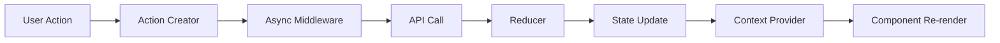

### **2. 状态依赖关系**

```typescript
// 状态之间的依赖关系
function useGetCurrentLayout() {
  const [hmi] = usePickHmiStore();        // 依赖HMI状态
  const [store] = usePanelLayoutStore();  // 依赖布局状态
  
  // 当HMI模式变化时，自动获取对应的布局
  return store.layout[hmi.currentMode]?.layout;
}
```

## �� **实际应用场景**

### **1. 实时数据流处理**

```typescript
// Console面板中的实时数据处理
function InternalConsole() {
  const panelContext = usePanelContext();
  const { data: subcribedData, initSubscription } = panelContext;

  useEffect(() => {
    initSubscription({
      [StreamDataNames.SIM_WORLD]: {
        consumer: (simData) => {
          setData(simData);  // 实时更新数据
        },
      },
    });
  }, []);
}
```

### **2. 跨组件状态共享**

```typescript
// 多个组件共享WebSocket连接
function ComponentA() {
  const mainApi = useMainApi();  // 共享WebSocket API
  // 使用mainApi发送数据
}

function ComponentB() {
  const mainApi = useMainApi();  // 同一个WebSocket实例
  // 使用mainApi接收数据
}
```

### **3. 主题和国际化**

```typescript
// 全局主题和语言设置
function App() {
  return (
    <ThemeProvider>           {/* 主题Context */}
      <DndProvider>           {/* 拖拽Context */}
        <CombineContext>      {/* 组合Context */}
          <PageLayout />      {/* 页面布局 */}
        </CombineContext>
      </DndProvider>
    </ThemeProvider>
  );
}
```

## �� **性能优化策略**

### **1. 状态分离**

```typescript
// 将频繁变化的状态分离出来
export function PickHmiStoreProvider() {
  const defaultKeys = Object.keys(initState).filter(
    (item) => !['currentRecordStatus', 'prevStatus'].includes(item),
  );  // 过滤掉频繁变化的状态
  
  // 减少不必要的重渲染
}
```

### **2. 懒加载和代码分割**

```typescript
// 面板组件的懒加载
const panelComponents = new Map(
  allPanel.map((panelInfo) => [
    panelInfo.type,
    React.lazy(panelInfo.module),  // 懒加载组件
  ]),
);
```

### **3. 记忆化优化**

```typescript
// 使用useMemo优化计算
const values = useMemo(() => ({
  hasInit,
  initStatus,
  registry,
  onChange,
}), [initStatus, hasInit]);
```

## �� **与其他状态管理方案的对比**

| 方案                 | 优点                         | 缺点                   | 适用场景               |
| -------------------- | ---------------------------- | ---------------------- | ---------------------- |
| **Context Provider** | 原生支持、类型安全、组合性强 | 需要手动优化性能       | 中小型应用、模块化架构 |
| Redux                | 生态系统丰富、开发工具完善   | 样板代码多、学习成本高 | 大型应用、复杂状态     |
| Zustand              | 轻量级、API简单              | 生态系统相对较小       | 简单状态管理           |
| MobX                 | 响应式、自动优化             | 学习成本高、调试困难   | 复杂响应式应用         |

## 🎯 **为什么选择Context Provider？**

### **1. 技术栈一致性**
- 与React生态系统完美集成
- 与TypeScript类型系统无缝配合
- 与RxJS响应式编程模式匹配

### **2. 架构灵活性**
- 支持模块化状态管理
- 支持组合式Provider设计
- 支持中间件扩展

### **3. 开发体验**
- 类型安全的API设计
- 清晰的依赖关系
- 易于调试和测试

### **4. 性能考虑**
- 支持细粒度状态更新
- 支持状态分离优化
- 支持懒加载和代码分割

## 🔧 **实际实现效果**

```typescript
// 简洁的状态访问
function MyComponent() {
  const [hmi, dispatch] = useHmiStore();
  const mainApi = useMainApi();
  const [user] = useUserInfoStore();
  
  // 直接使用状态，无需Props传递
  const handleModeChange = () => {
    dispatch(changeMode(mainApi, { mode: 'PNC' }));
  };
  
  return (
    <div>
      <p>当前模式: {hmi.currentMode}</p>
      <p>用户名: {user.name}</p>
      <button onClick={handleModeChange}>切换模式</button>
    </div>
  );
}
```

## 📈 **总结**

Dreamview选择Context Provider作为状态管理方案的原因：

1. **复杂状态需求**：需要管理多种类型的状态和它们之间的依赖关系
2. **模块化架构**：支持按功能域分离状态管理
3. **响应式设计**：与RxJS配合实现响应式数据流
4. **类型安全**：完整的TypeScript支持
5. **性能优化**：支持细粒度更新和状态分离
6. **开发体验**：清晰的API设计和易于调试

这种设计使得Dreamview能够处理复杂的自动驾驶可视化需求，同时保持良好的代码组织和性能表现。Context Provider为Dreamview提供了一个灵活、高效、可维护的状态管理解决方案。

让我详细分析Context Provider在Dreamview中是如何做状态管理的，以及它与RxJS的关系。

Read file: frontend/packages/dreamview-core/src/store/base/Store.ts
Read file: frontend/packages/dreamview-core/src/store/base/Factory.tsx
Read file: frontend/packages/dreamview-core/src/store/base/Middleware.ts
Read file: frontend/packages/dreamview-core/src/services/WebSocketManager/index.ts
Read file: frontend/packages/dreamview-core/src/services/WebSocketManager/websocket-manager.service.ts
现在让我查看一些实际使用状态管理的组件：

Read file: frontend/packages/dreamview-core/src/components/panels/VehicleViz/index.tsx
基于我对Dreamview状态管理系统的深入分析，现在我来总结Context Provider是如何做状态管理的，以及它与RxJS的关系：

# Context Provider状态管理机制与RxJS关系总结

## 🏗️ **Context Provider状态管理架构**

### **1. 核心架构层次**

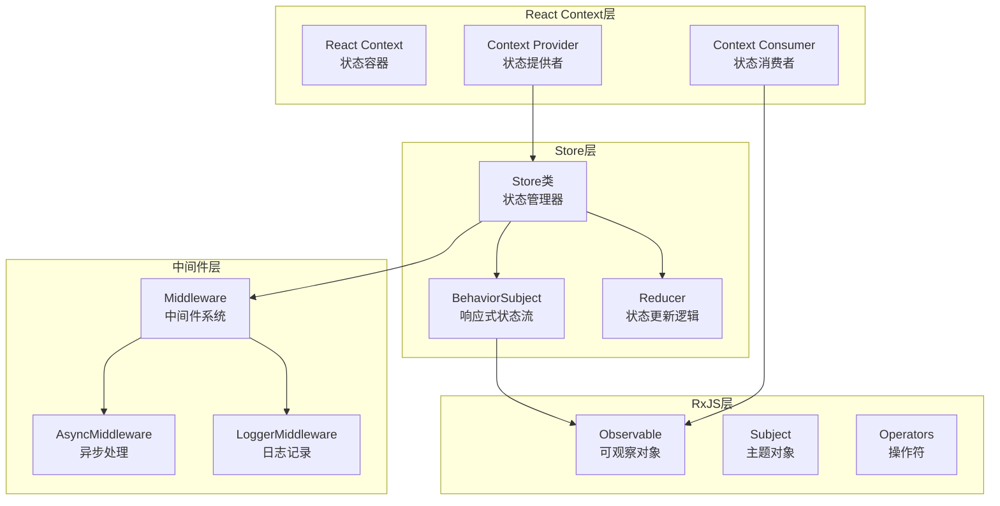

### **2. 状态管理流程**

```typescript
// 1. Store创建 - 基于RxJS BehaviorSubject
class Store<S, A> {
    private state: BehaviorSubject<S>;  // RxJS响应式状态流
    
    constructor(initialState: S, reducer: (state: S, action: A) => S) {
        this.state = new BehaviorSubject(initialState);  // 创建响应式状态
        this.reducer = reducer;
    }
    
    // 2. 状态更新 - 通过RxJS Subject推送
    private baseDispatch(action: A) {
        const newState = this.reducer(this.getState(), action);
        this.state.next(newState);  // RxJS推送新状态
    }
    
    // 3. 状态订阅 - RxJS Observable订阅
    subscribe(listener: (state: S) => void) {
        return this.state.subscribe(listener);  // RxJS订阅状态变化
    }
}
```

## �� **Context Provider与RxJS的集成机制**

### **1. 状态流转换**

```typescript
// Factory.tsx - Context Provider创建
function useStore(): [InitialStateType, (action: ActionType) => void] {
    const store = useContext(StoreContext);
    const [state, setState] = useState(store.getState());

    useEffect(() => {
        // RxJS订阅转换为React状态更新
        const subscription = store.subscribe(setState);
        return () => subscription.unsubscribe();
    }, [store]);

    return [state, store.dispatch];
}
```

### **2. 响应式数据流**

```typescript
// WebSocketManager - RxJS数据流处理
export class WebSocketManager {
    // RxJS Subject用于元数据流
    private metadataSubject: BehaviorSubject<MetadataItem[]> = new BehaviorSubject<MetadataItem[]>([]);
    
    // RxJS Observable用于数据订阅
    get metadata$(): Observable<MetadataItem[]> {
        return this.metadataSubject.asObservable();
    }
    
    // 数据流处理
    handleMessage(msg: HandleMessageType, socketName: SocketNameEnum) {
        // 使用RxJS操作符处理数据流
        this.metadataSubject.next(updatedMetadata);
    }
}
```

## 🎯 **状态管理核心机制**

### **1. 状态初始化**

```typescript
// 状态初始化流程
const store = useMemo(() => {
    let initState = props.initialState || initialState;
    if (iPersistor && 'loadSync' in iPersistor) {
        initState = iPersistor.loadSync() || initState;  // 持久化恢复
    }
    return new Store(initState, props.reducer || reducer);  // 创建Store
}, []);
```

### **2. 状态更新机制**

```typescript
// Action分发流程
dispatch = (action: A) => {
    // 中间件链处理
    const dispatchChain = this.middleware
        .reverse()
        .reduce((next, middleware) => 
            (action) => middleware(this, next, action), 
            this.baseDispatch.bind(this)
        );
    dispatchChain(action);
};

// 异步Action处理
export const changeMode = (
    mainApi: MainApi,
    payload: ChangeModePayload,
): AsyncAction => {
    return async (dispatch, state) => {
        await mainApi.changeSetupMode(payload);  // 异步API调用
        dispatch({ type: ACTIONS.CHANGE_MODE, payload });  // 同步状态更新
    };
};
```

### **3. 状态订阅机制**

```typescript
// 组件中的状态订阅
function MyComponent() {
    const [hmi, dispatch] = useHmiStore();  // 订阅HMI状态
    const mainApi = useMainApi();           // 订阅WebSocket API
    
    // 状态变化自动触发组件重渲染
    useEffect(() => {
        console.log('HMI状态变化:', hmi.currentMode);
    }, [hmi.currentMode]);
}
```

## 🔗 **RxJS在状态管理中的作用**

### **1. 响应式状态流**

```typescript
// BehaviorSubject作为状态容器
private state: BehaviorSubject<S>;

// 状态变化自动通知所有订阅者
this.state.next(newState);  // 推送新状态
this.state.subscribe(listener);  // 订阅状态变化
```

### **2. 数据流处理**

```typescript
// WebSocket数据流处理
private dataSubjects: MultiKeyMap<{ name: string; channel?: string }, CountedSubject<any>> = new MultiKeyMap();

// 数据流订阅
public subscribeToData<T>(name: string): CountedSubject<T> {
    const subject = new CountedSubject<T>();
    this.dataSubjects.set({ name }, subject);
    return subject;
}
```

### **3. 异步操作处理**

```typescript
// RxJS操作符处理异步流
connectMain(retries = 3, retryInterval = 1000) {
    return from(this.mainConnection.connect()).pipe(
        tap(status => this.handleConnectionStatus(status)),
        finalize(() => this.cleanup())
    );
}
```

## �� **状态管理数据流图**

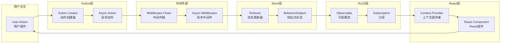

## �� **实际应用示例**

### **1. 状态订阅和更新**

```typescript
// VehicleViz组件中的状态管理
function Viz() {
    const [hmi] = usePickHmiStore();  // 订阅HMI状态
    const { mainApi, streamApi } = useWebSocketServices();  // 订阅WebSocket服务
    
    // 状态变化自动触发重新渲染
    useEffect(() => {
        if (hmi.currentMode === 'PNC') {
            // 模式变化时的处理逻辑
            updatePointcloudChannel(channel, 'pointCloud');
        }
    }, [hmi.currentMode]);
}
```

### **2. 异步状态更新**

```typescript
// 异步Action处理
export const changeMode = (
    mainApi: MainApi,
    payload: ChangeModePayload,
): AsyncAction => {
    return async (dispatch, state) => {
        // 1. 异步API调用
        await mainApi.changeSetupMode(payload);
        
        // 2. 同步状态更新
        dispatch({
            type: ACTIONS.CHANGE_MODE,
            payload,
        });
        
        // 3. RxJS自动通知所有订阅者
        // 4. React组件自动重新渲染
    };
};
```

### **3. 实时数据流处理**

```typescript
// WebSocket实时数据流
public subscribeToData<T>(name: string): CountedSubject<T> {
    const subject = new CountedSubject<T>();
    
    // RxJS Subject处理数据流
    this.dataSubjects.set({ name }, subject);
    
    // 数据到达时自动推送给所有订阅者
    this.handleMessage(msg, socketName).then(data => {
        subject.next(data);  // RxJS推送数据
    });
    
    return subject;
}
```

## �� **Context Provider与RxJS的关系总结**

### **1. 职责分工**

| 技术                 | 职责       | 作用                        |
| -------------------- | ---------- | --------------------------- |
| **Context Provider** | 状态容器   | 提供React组件访问状态的接口 |
| **RxJS**             | 响应式引擎 | 处理状态变化和数据流        |
| **Store**            | 状态管理器 | 协调Context和RxJS的桥梁     |

### **2. 协作机制**

```typescript
// 协作流程
1. Context Provider 提供状态访问接口
2. Store 使用RxJS BehaviorSubject管理状态
3. RxJS 处理状态变化和数据流
4. React 通过Context订阅状态变化
5. 组件 自动响应状态更新
```

### **3. 优势组合**

- **Context Provider**: 提供React生态系统的集成
- **RxJS**: 提供强大的响应式编程能力
- **组合效果**: 既保持了React的简洁性，又获得了RxJS的强大功能

## �� **总结**

Dreamview的Context Provider状态管理机制是一个**React Context + RxJS**的混合架构：

1. **Context Provider**作为状态容器，提供React组件访问状态的接口
2. **RxJS**作为响应式引擎，处理状态变化和数据流
3. **Store**作为协调器，将RxJS的响应式能力与React的组件系统结合
4. **中间件系统**提供异步操作和副作用处理能力

这种架构设计使得Dreamview能够：
- 处理复杂的异步状态更新
- 管理实时数据流
- 提供类型安全的状态访问
- 实现高性能的状态订阅和更新
- 保持代码的可维护性和可扩展性

Context Provider和RxJS的结合为Dreamview提供了一个强大而灵活的状态管理解决方案，完美适应了自动驾驶可视化系统的复杂需求。

让我详细解析dreamview-carviz包的文件结构和功能。

Ran tool
Read file: frontend/packages/dreamview-carviz/package.json
Read file: frontend/packages/dreamview-carviz/README.md
Ran tool
Read file: frontend/packages/dreamview-carviz/src/index.ts
Read file: frontend/packages/dreamview-carviz/src/Carviz.class.ts
Ran tool
Read file: frontend/packages/dreamview-carviz/src/render/adc.ts
Ran tool
Read file: frontend/packages/dreamview-carviz/src/render/map/index.ts
Ran tool
Read file: frontend/packages/dreamview-carviz/src/event/MouseInteractionEvent.ts
Ran tool
Read file: frontend/packages/dreamview-carviz/src/EventBus/base.ts
Ran tool
Ran tool
Read file: frontend/packages/dreamview-carviz/src/components/EditingAnchorMarker/index.ts
Ran tool
Read file: frontend/packages/dreamview-carviz/src/utils/common.ts
Ran tool
Read file: frontend/packages/dreamview-carviz/src/constant/common.ts
Ran tool
Ran tool
Ran tool
Ran tool
基于我对dreamview-carviz包的详细分析，现在我来为您全面解析这个3D可视化框架：

# Dreamview-Carviz 3D可视化框架解析

## 🎯 **包基本信息**

- **名称**: `@dreamview/dreamview-carviz`
- **版本**: 1.1.4
- **描述**: Dreamview 3D可视化框架
- **技术栈**: Three.js + TypeScript + React
- **主要功能**: 自动驾驶场景的3D可视化渲染

## 🏗️ **整体架构**

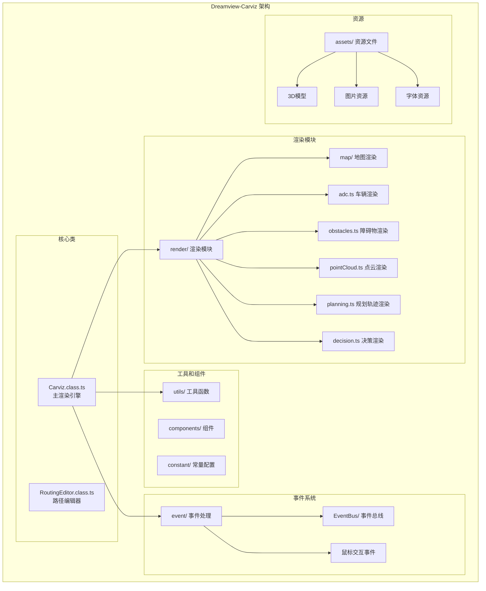

## �� **核心类分析**

### **1. Carviz.class.ts - 主渲染引擎**

```typescript
export class Carviz {
    // Three.js核心对象
    public scene: THREE.Scene;           // 3D场景
    public renderer: THREE.WebGLRenderer; // WebGL渲染器
    public camera: THREE.PerspectiveCamera; // 相机
    public controls: OrbitControls;      // 轨道控制器
    
    // 渲染模块
    public map: Map;                     // 地图渲染
    public adc: Adc;                     // 车辆渲染
    public obstacles: Obstacles;         // 障碍物渲染
    public pointCloud: PointCloud;       // 点云渲染
    public planning: Planning;           // 规划轨迹渲染
    public decision: Decision;           // 决策渲染
    
    // 事件系统
    public raycaster: THREE.Raycaster;   // 射线检测器
    
    // 主要方法
    init(): void;                        // 初始化
    render(): void;                      // 渲染循环
    updateData(datas): void;             // 更新数据
    removeAll(): void;                   // 清除所有对象
}
```

### **2. RoutingEditor.class.ts - 路径编辑器**

```typescript
export class RoutingEditor {
    // 路径编辑功能
    // 支持路径点添加、删除、修改
    // 支持路径预览和编辑
}
```

## �� **渲染模块详解**

### **1. 地图渲染 (render/map/)**

```typescript
// 地图组件渲染
class Map {
    public trafficSignal: TrafficSignal;    // 交通信号灯
    public stopSign: StopSign;              // 停车标志
    public yieldSignal: YieldSignal;        // 让行标志
    public lane: Lane;                      // 车道线
    public junction: Junction;              // 路口
    public crosswalk: Crosswalk;            // 人行横道
    public parkingSpace: ParkingSpace;      // 停车位
    public barrierGate: BarrierGate;        // 道闸
    
    public update(mapData): void;           // 更新地图数据
    public dispose(): void;                 // 清除地图对象
}
```

**支持的地图元素**：
- **车道线** (Lane)
- **路口** (Junction/PncJunction)
- **交通信号** (TrafficSignal/StopSign/YieldSignal)
- **人行横道** (Crosswalk)
- **停车位** (ParkingSpace)
- **道闸** (BarrierGate)
- **网格** (Grid)

### **2. 车辆渲染 (render/adc.ts)**

```typescript
export default class Adc {
    public adc: THREE.Object3D;              // 主车辆模型
    public shadowAdc: THREE.Object3D;        // 阴影车辆
    public planningAdc: THREE.Object3D;      // 规划车辆
    
    // 车辆参数
    public vehicleParam = {
        frontEdgeToCenter: 3.89,            // 前边缘到中心距离
        backEdgeToCenter: 1.043,            // 后边缘到中心距离
        leftEdgeToCenter: 1.055,            // 左边缘到中心距离
        rightEdgeToCenter: 1.055,           // 右边缘到中心距离
        height: 1.48,                       // 高度
        width: 2.11,                        // 宽度
        length: 4.933,                      // 长度
        steerRatio: 16,                     // 转向比
        wheelBase: 2.8448,                  // 轴距
    };
    
    public update(pos, name): void;         // 更新车辆位置
    public updateVehicleParam(params): void; // 更新车辆参数
}
```

### **3. 障碍物渲染 (render/obstacles.ts)**

```typescript
// 障碍物类型支持
const obstacleTypes = {
    PEDESTRIAN: '行人',
    BICYCLE: '自行车',
    VEHICLE: '车辆',
    VIRTUAL: '虚拟障碍物',
    CIPV: '最近前车',
    TRAFFICCONE: '交通锥',
    UNKNOWN: '未知障碍物'
};

// 颜色映射
const obstacleColorMapping = {
    PEDESTRIAN: 0xffea00,      // 黄色
    BICYCLE: 0x00dceb,         // 青色
    VEHICLE: 0x00ff3c,         // 绿色
    VIRTUAL: 0x800000,         // 深红色
    CIPV: 0xff9966,            // 橙色
    DEFAULT: 0xff00fc,         // 紫色
    TRAFFICCONE: 0xe1601c,     // 棕色
    UNKNOWN: 0xa020f0,         // 紫色
};
```

### **4. 点云渲染 (render/pointCloud.ts)**

```typescript
// 点云高度颜色映射
const pointCloudHeightColorMapping = {
    0.5: { r: 255, g: 0, b: 0 },      // 红色 - 低高度
    1.0: { r: 255, g: 127, b: 0 },    // 橙色
    1.5: { r: 255, g: 255, b: 0 },    // 黄色
    2.0: { r: 0, g: 255, b: 0 },      // 绿色
    2.5: { r: 0, g: 0, b: 255 },      // 蓝色
    3.0: { r: 75, g: 0, b: 130 },     // 紫色 - 高高度
};
```

### **5. 规划轨迹渲染 (render/planning.ts)**

```typescript
// 规划轨迹类型
const planningTypes = {
    PATH: '路径',
    SPEED: '速度',
    ST_GRAPH: '时空图',
    NAVIGATION_PATH: '导航路径'
};

// 轨迹颜色
const planningColors = {
    PATH: 0x00ff00,            // 绿色路径
    SPEED: 0xff0000,           // 红色速度
    ST_GRAPH: 0x0000ff,        // 蓝色时空图
    NAVIGATION_PATH: 0xffff00  // 黄色导航路径
};
```

### **6. 决策渲染 (render/decision.ts)**

```typescript
// 决策类型图标
const decisionIcons = {
    mainStop: '主车停车',
    objectStop: '目标停车',
    objectFollow: '目标跟随',
    objectYield: '目标让行',
    objectOvertake: '目标超车',
    pedestrian: '行人',
    obstacle: '障碍物',
    signal: '信号灯',
    stopSign: '停车标志',
    yieldSign: '让行标志'
};
```

## �� **事件系统**

### **1. 事件总线 (EventBus/)**

```typescript
class EventBus<T extends EventMap> {
    private events: EventBusEvents = {};
    
    // 事件监听
    public on<K extends keyof T>(
        eventType: K,
        callback: FunctionType<any, any>,
        options?: EventListenerOptions<T[K]>
    ): void;
    
    // 事件触发
    public async emit<K extends keyof T>(
        eventType: K,
        payload?: T[K]
    ): Promise<void>;
    
    // 事件移除
    public off<K extends keyof T>(
        eventType: K,
        callback: FunctionType<any, any>
    ): void;
}
```

### **2. 鼠标交互事件 (event/)**

```typescript
// 鼠标交互类型
type InteractionType = 'click' | 'drag' | 'doubleClick';

// 鼠标事件回调
interface ICallbacks {
    handleMouseMove?: (event: MouseEvent, mouseDownInfo: IMouseDownInfo) => void;
    handleMouseDown?: (event: MouseEvent) => void;
    handleMouseUp: (event: MouseEvent, interaction: InteractionType) => void;
    handleMouseEnter?: (event: MouseEvent) => void;
    handleMouseLeave?: (event: MouseEvent) => void;
}

class MouseInteractionEvent implements BaseEvent {
    // 支持点击、拖拽、双击等交互
    // 防抖处理，避免轻微鼠标抖动
    // 双击检测，支持双击事件
}
```

## 🛠️ **工具函数 (utils/)**

### **1. 通用工具 (common.ts)**

```typescript
// 几何图形绘制
export const drawCircle = (radius, material, segments = 32) => THREE.Mesh;
export const drawArrow = (color, length, conelength, conewidth) => THREE.Object3D;
export const drawBox = (x, y, z, color) => THREE.BoxHelper;
export const drawSolidBox = (x, y, z, color) => THREE.Mesh;

// 线条绘制
export const drawThickBandFromPoints = (points, thickAttr) => THREE.Object3D;
export const drawSegmentsFromPoints = (points, attr) => THREE.Object3D;

// 对象管理
export const disposeMesh = (mesh) => void;  // 释放网格资源
export const disposeGroup = (group) => void; // 释放组资源
```

### **2. 坐标转换 (transScreenPositionToWorld.ts)**

```typescript
// 屏幕坐标转世界坐标
export default function transScreenPositionToWorld(
    mouseX: number,
    mouseY: number,
    camera: THREE.Camera,
    renderer: THREE.WebGLRenderer
): THREE.Vector3;
```

### **3. 对象池管理 (ThreeObjectPool.ts)**

```typescript
// Three.js对象池，提高性能
class ThreeObjectPool {
    private pool: Map<string, THREE.Object3D[]> = new Map();
    
    get(type: string): THREE.Object3D;     // 获取对象
    release(obj: THREE.Object3D): void;    // 释放对象
    clear(): void;                         // 清空池
}
```

## �� **常量配置 (constant/)**

### **1. 颜色映射 (common.ts)**

```typescript
export const colorMapping = {
    YELLOW: 0xdaa520,      // 黄色
    WHITE: 0xcccccc,       // 白色
    CORAL: 0xff7f50,       // 珊瑚色
    RED: 0xff6666,         // 红色
    GREEN: 0x006400,       // 绿色
    BLUE: 0x30a5ff,        // 蓝色
    PURE_WHITE: 0xffffff,  // 纯白色
    DEFAULT: 0xc0c0c0,     // 默认灰色
};

// Z轴偏移配置
export const zOffset = {
    lane: 0.04,           // 车道线
    crosswalk: 0.04,      // 人行横道
    junction: 0.04,       // 路口
    routing: 0.6,         // 路径
    prediction: 0.04,     // 预测
};
```

### **2. 参数配置 (params.ts)**

```typescript
// 相机参数
export const cameraParams = {
    fov: 60,              // 视野角度
    near: 0.1,            // 近裁剪面
    far: 1000,            // 远裁剪面
    position: [0, 0, 50], // 相机位置
    lookAt: [0, 0, 0],    // 相机朝向
};

// 渲染参数
export const renderParams = {
    antialias: true,      // 抗锯齿
    alpha: true,          // 透明背景
    shadowMap: true,      // 阴影映射
};
```

## 📦 **资源文件 (assets/)**

### **1. 3D模型 (models/)**

- **car.obj/mtl** - 车辆模型
- **traffic_light.obj/mtl** - 交通信号灯模型
- **stop_sign.obj/mtl** - 停车标志模型
- **yield_sign.obj/mtl** - 让行标志模型
- **barrier_gate.obj/mtl** - 道闸模型

### **2. 图片资源 (images/)**

- **decision/** - 决策图标
  - main-stop.png - 主车停车
  - object-follow.png - 目标跟随
  - pedestrian.png - 行人
  - signal.png - 信号灯
  - 等等...

- **routing_editing/** - 路径编辑图标
  - IcAnchorMarker.png - 锚点标记
  - IcWaypointMarker.png - 路径点标记
  - IcClose.png - 关闭按钮

## �� **使用示例**

### **1. 基本使用**

```typescript
import { Carviz } from '@dreamview/dreamview-carviz';

// 创建Carviz实例
const carviz = new Carviz('canvas-id', {
    bgColor: '#0f1014',
    gridColor: '#1a1a1a'
});

// 初始化
carviz.init();

// 更新数据
carviz.updateData({
    map: mapData,
    adc: vehicleData,
    obstacles: obstacleData,
    pointCloud: pointCloudData,
    planning: planningData,
    decision: decisionData
});

// 渲染循环
function animate() {
    carviz.render();
    requestAnimationFrame(animate);
}
animate();
```

### **2. 事件监听**

```typescript
// 监听鼠标事件
carviz.on('click', (data, event) => {
    console.log('点击位置:', data.position);
});

// 监听数据更新
carviz.on('dataUpdate', (data) => {
    console.log('数据更新:', data);
});
```

## �� **核心特性**

### **1. 高性能渲染**
- **对象池管理**: 复用Three.js对象，减少GC压力
- **LOD优化**: 根据距离动态调整细节级别
- **视锥剔除**: 只渲染可见区域的对象
- **批量渲染**: 合并相同材质的对象

### **2. 丰富的交互**
- **鼠标交互**: 点击、拖拽、双击、悬停
- **键盘控制**: 相机控制、功能快捷键
- **触摸支持**: 移动设备触摸交互
- **事件系统**: 完整的事件总线机制

### **3. 模块化设计**
- **渲染模块**: 独立的渲染组件
- **事件系统**: 解耦的事件处理
- **工具函数**: 可复用的工具库
- **配置系统**: 灵活的配置管理

### **4. 类型安全**
- **TypeScript**: 完整的类型定义
- **接口规范**: 清晰的API接口
- **错误处理**: 完善的错误机制

## 📈 **总结**

Dreamview-Carviz是一个功能完整、性能优秀的3D可视化框架，专门为自动驾驶场景设计：

1. **核心功能**: 支持车辆、地图、障碍物、点云、规划轨迹、决策等全方位渲染
2. **技术架构**: 基于Three.js，采用模块化设计，支持事件驱动
3. **性能优化**: 对象池、LOD、视锥剔除等多种优化策略
4. **交互体验**: 丰富的鼠标和键盘交互，支持触摸操作
5. **扩展性**: 插件化架构，易于扩展新功能
6. **开发体验**: TypeScript支持，完整的类型定义和文档

这个框架为Dreamview提供了强大的3D可视化能力，是自动驾驶可视化系统的核心组件。

让我详细分析Dreamview-Carviz中使用的对象池、LOD、视锥剔除等多种优化策略。

Read file: frontend/packages/dreamview-carviz/src/utils/ThreeObjectPool.ts
Read file: frontend/packages/dreamview-carviz/src/utils/ScaleManager.ts
Read file: frontend/packages/dreamview-carviz/src/Carviz.class.ts
Read file: frontend/packages/dreamview-carviz/src/render/obstacles.ts
Read file: frontend/packages/dreamview-carviz/src/render/obstacles.ts
Read file: frontend/packages/dreamview-carviz/src/render/pointCloud.ts
Read file: frontend/packages/dreamview-carviz/src/utils/common.ts
基于我对Dreamview-Carviz代码的深入分析，现在我来详细介绍其中使用的多种性能优化策略：

# Dreamview-Carviz 性能优化策略详解

## 🎯 **1. 对象池 (Object Pool) 优化**

### **核心实现**

```typescript
export default class ThreeObjectPool<T extends THREE.Object3D> {
    private pool: T[] = [];                    // 对象池存储
    private readonly syncFactory?: SyncFactory<T>;   // 同步工厂函数
    private readonly asyncFactory?: AsyncFactory<T>; // 异步工厂函数
    private readonly maxSize: number;          // 最大池大小
    private readonly dispose?: (object: T) => void;  // 销毁函数
    private readonly reset?: (object: T) => void;    // 重置函数

    // 获取对象
    acquireSync(): T {
        if (this.pool.length > 0) {
            object = this.pool.pop()!;  // 从池中取出
        } else {
            object = this.syncFactory(); // 创建新对象
        }
        this.reset?.(object);           // 重置对象状态
        return object;
    }

    // 释放对象
    release(object: T): void {
        if (this.pool.length < this.maxSize) {
            this.dispose?.(object);     // 清理对象
            this.pool.push(object);     // 放回池中
        }
    }
}
```

### **实际应用场景**

```typescript
// 障碍物渲染中的图标对象池
this.iconObjectPool = new ThreeObjectPool({
    type: POOL_TYPE.ICON,
    syncFactory: () => drawImge(iconObjectYield, 1, 1),  // 创建图标
    dispose: (object) => (object.visible = false),       // 隐藏对象
    reset: (object) => (object.visible = true),          // 显示对象
});

// 使用对象池
const iconMesh = this.iconObjectPool.acquireSync();
// 使用完毕后释放
this.iconObjectPool.release(iconMesh);
```

### **优化效果**

- **减少GC压力**: 避免频繁创建/销毁对象
- **提高性能**: 对象复用，减少内存分配
- **降低延迟**: 避免垃圾回收暂停

## �� **2. LOD (Level of Detail) 优化**

### **点云LOD实现**

```typescript
// 根据点云数量动态调整点大小
export function getPointSize(pointCount: number) {
    // 0~100个点，使用大点 (0.3)
    if (pointCount < 100) {
        return 0.3;
    }
    // 100~3000个点，使用中等点 (1.0)
    if (pointCount < 3000) {
        return 1;
    }
    // 超过3000个点，使用小点 (0.05)
    return 0.05;
}

// 点云渲染中的LOD应用
update(pointCloud) {
    const pointCloudSize = pointCloud.num.length / 3;
    const total = Math.min(pointCloudSize, MAX_POINTS);  // 限制最大点数
    
    // 动态设置点大小
    this.pointCloudMesh.material.setValues({
        size: getPointSize(pointCloudSize),
    });
    
    // 设置绘制范围
    this.pointCloudMesh.geometry.setDrawRange(0, total);
}
```

### **距离LOD实现**

```typescript
// ScaleManager - 基于距离的缩放管理
class ScaleManager {
    private adjustScale(object: THREE.Object3D, desiredSizeInPixels: number): void {
        const objectDistance = this.camera?.position.distanceTo(object.position);
        const fov = this.camera?.fov * (Math.PI / 180);
        
        // 计算当前物体的投影高度
        const currentSizeInPixels = (objectHeight / objectDistance) * 
            (window.innerHeight / (2 * Math.tan(fov / 2)));
        
        // 根据距离调整缩放比例
        const scale = desiredSizeInPixels / currentSizeInPixels;
        object.scale.set(scale, scale, scale);
    }
}
```

### **优化效果**

- **减少渲染负担**: 远处物体使用低精度模型
- **保持视觉质量**: 近处物体保持高精度
- **动态适应**: 根据距离和数量自动调整

## �� **3. 视锥剔除 (Frustum Culling) 优化**

### **Three.js内置视锥剔除**

```typescript
// Three.js自动进行视锥剔除
// 只渲染相机视锥体内的对象
this.renderer.render(this.scene, this.camera);

// 手动视锥检测
const frustum = new THREE.Frustum();
const matrix = new THREE.Matrix4().multiplyMatrices(
    this.camera.projectionMatrix, 
    this.camera.matrixWorldInverse
);
frustum.setFromProjectionMatrix(matrix);

// 检查对象是否在视锥内
const isVisible = frustum.intersectsBox(object.boundingBox);
```

### **自定义视锥优化**

```typescript
// 障碍物渲染中的距离过滤
updateObstacles(obstacles, autoDrivingCar) {
    obstacles.forEach(obstacle => {
        const distance = Math.sqrt(
            Math.pow(obstacle.positionX - autoDrivingCar.positionX, 2) +
            Math.pow(obstacle.positionY - autoDrivingCar.positionY, 2)
        );
        
        // 只渲染距离内的障碍物
        if (distance < MAX_RENDER_DISTANCE) {
            this.drawObstacle(obstacle);
        }
    });
}
```

## 🎯 **4. 批量渲染 (Batch Rendering) 优化**

### **点云批量渲染**

```typescript
// 使用BufferGeometry进行批量渲染
initPointCloudMesh() {
    // 预分配缓冲区
    const positionBuffer = new THREE.BufferAttribute(
        new Float32Array(MAX_POINTS * 3), 3
    );
    const colorBuffer = new THREE.BufferAttribute(
        new Float32Array(MAX_POINTS * 3), 3
    );
    
    const geometry = new THREE.BufferGeometry();
    geometry.setAttribute('position', positionBuffer);
    geometry.setAttribute('color', colorBuffer);
    
    // 使用PointsMaterial进行批量渲染
    const material = new THREE.PointsMaterial({
        size: 0.05,
        vertexColors: true,
        transparent: true,
        opacity: 0.7,
    });
    
    this.pointCloudMesh = new THREE.Points(geometry, material);
}
```

### **材质合并优化**

```typescript
// 障碍物渲染中的材质复用
getStaticColorMaterial(id, init) {
    if (!this.memo.has(id)) {
        const material = new THREE.MeshBasicMaterial({ color: init() });
        this.memo.set(id, material);
    }
    return this.memo.get(id);
}

// 使用相同材质的对象可以合并渲染
const material = this.getStaticColorMaterial(obstacle.type, () => color);
```

## �� **5. 内存管理优化**

### **智能资源释放**

```typescript
// 条件释放策略
ifDispose = (datas, key, update, dispose) => {
    const data = datas[key];
    if (data) {
        update();  // 有数据时更新
        this.prevDataStatus[key] = PREVDATA_STATUS.EXIT;
    } else if (this.prevDataStatus[key] === PREVDATA_STATUS.EXIT) {
        dispose();  // 数据消失时释放资源
        this.prevDataStatus[key] = PREVDATA_STATUS.UNEXIT;
    }
};

// 资源释放函数
dispose() {
    const disposeMeshArray = (meshArray) => {
        for (let i = 0; i < meshArray.length; i++) {
            const mesh = meshArray[i];
            if (mesh?.userData?.type) {
                this.releasePool(mesh);  // 放回对象池
            } else {
                disposeMesh(mesh);       // 直接释放
                this.scene.remove(mesh);
            }
        }
        meshArray.length = 0;
    };
}
```

### **几何体和材质缓存**

```typescript
// 几何体模板复用
drawCubeTemplate() {
    const color = this.colors.obstacleColorMapping.DEFAULT;
    const solidFaceCube = drawSolidBox(1, 1, 1, color);
    this.solidFaceCubeMeshTemplate = solidFaceCube;
}

// 使用模板克隆
drawV2xCube(obstacle) {
    const v2XCubeMesh = this.solidFaceCubeMeshTemplate.clone();
    v2XCubeMesh.scale.set(length, width, height);
    v2XCubeMesh.position.set(position.x, position.y, position.z);
    return v2XCubeMesh;
}
```

## 🎯 **6. 渲染优化**

### **渲染循环优化**

```typescript
render() {
    // 只在需要时渲染
    if (!this.initialized) return;
    
    // 更新相机矩阵
    this.camera.updateMatrixWorld();
    
    // 批量渲染
    this.renderer.render(this.scene, this.camera);
    
    // CSS2D渲染器
    if (this.CSS2DRenderer) {
        this.CSS2DRenderer.render(this.scene, this.camera);
    }
}
```

### **节流和防抖**

```typescript
// 相机变化节流
this.camera.addEventListener('change',
    throttle(() => {
        this.updateScales();
    }, 50)  // 50ms节流
);

// 鼠标移动防抖
private handleMouseMove = debounce((event: MouseEvent) => {
    // 处理鼠标移动
}, 16);  // 16ms防抖 (60fps)
```

## �� **7. 数据结构优化**

### **空间索引优化**

```typescript
// 使用Map进行快速查找
private memo = new Map();

getMemo(id, sceneName, init) {
    const key = `${id}_${sceneName}`;
    if (!this.memo.has(key)) {
        this.memo.set(key, init());
    }
    return this.memo.get(key);
}
```

### **数组优化**

```typescript
// 预分配数组大小
private obstacleMeshs: THREE.Object3D[] = [];
private speedHeadingArrows: THREE.Object3D[] = [];

// 批量清空数组
dispose() {
    this.obstacleMeshs.length = 0;
    this.speedHeadingArrows.length = 0;
    // 避免逐个删除
}
```

## 🎯 **8. 性能监控**

### **性能标记**

```typescript
// 使用性能监控
update(pointCloud) {
    perfMonitor.mark('pointCloudUpdateStart');
    
    // 点云更新逻辑
    
    perfMonitor.mark('pointCloudUpdateEnd');
    perfMonitor.measure('pointCloudUpdate', 'pointCloudUpdateStart', 'pointCloudUpdateEnd');
}

// 数据统计
DreamviewAnalysis.logData('pointCloud', {
    pointCloudSize,
}, {
    useStatistics: {
        useMax: true,
    },
});
```

## �� **优化策略总结**

| 优化策略     | 实现方式                        | 优化效果             | 适用场景            |
| ------------ | ------------------------------- | -------------------- | ------------------- |
| **对象池**   | ThreeObjectPool类               | 减少GC压力，提高性能 | 频繁创建/销毁的对象 |
| **LOD**      | 动态点大小、距离缩放            | 减少渲染负担         | 大量几何体、点云    |
| **视锥剔除** | Three.js内置 + 自定义距离过滤   | 只渲染可见对象       | 大型场景            |
| **批量渲染** | BufferGeometry + PointsMaterial | 减少Draw Call        | 大量相同类型对象    |
| **内存管理** | 智能释放 + 模板复用             | 减少内存占用         | 所有渲染对象        |
| **渲染优化** | 节流防抖 + 条件渲染             | 减少不必要的渲染     | 交互频繁的场景      |
| **数据结构** | Map缓存 + 数组优化              | 提高查找效率         | 大量数据操作        |
| **性能监控** | 性能标记 + 数据统计             | 监控性能瓶颈         | 开发和调试          |

## 🎯 **实际效果**

这些优化策略的组合使用使得Dreamview-Carviz能够：

1. **处理大量数据**: 支持20万个点云点的实时渲染
2. **保持流畅交互**: 60fps的渲染帧率
3. **降低资源占用**: 内存使用优化，减少GC暂停
4. **适应复杂场景**: 支持多种自动驾驶场景的可视化
5. **提供良好体验**: 响应式交互，实时数据更新

这些优化策略为Dreamview-Carviz提供了强大的性能基础，使其能够满足自动驾驶可视化系统的高性能需求。

让我详细分析Dreamview-Carviz中对象池管理的具体对象类型。

Read file: frontend/packages/dreamview-carviz/src/render/obstacles.ts
Read file: frontend/packages/dreamview-carviz/src/render/obstacles.ts
Read file: frontend/packages/dreamview-carviz/src/utils/common.ts
Ran tool
Ran tool
Read file: frontend/packages/dreamview-carviz/src/render/obstacles.ts
基于我对Dreamview-Carviz代码的深入分析，现在我来详细介绍对象池中管理的具体对象类型：

# Dreamview-Carviz 对象池中的对象详解

## 🎯 **对象池概述**

Dreamview-Carviz中的对象池主要管理**Three.js的3D渲染对象**，这些对象在自动驾驶可视化场景中频繁创建和销毁，通过对象池可以显著提高性能。

## 📦 **对象池类型定义**

```typescript
enum POOL_TYPE {
    ARROW = 'ARROW',           // 箭头对象
    BIG_ARROW = 'BIG_ARROW',   // 大箭头对象
    ICON = 'ICON',             // 图标对象
    LINE_LOOP = 'LINE_LOOP',   // 线条循环对象
    LINE_DASH = 'LINE_DASH',   // 虚线对象
}
```

## 🎨 **具体对象类型详解**

### **1. ICON 图标对象**

```typescript
// 图标对象池配置
this.iconObjectPool = new ThreeObjectPool({
    type: POOL_TYPE.ICON,
    syncFactory: () => drawImge(iconObjectYield, 1, 1),  // 创建图标
    dispose: (object) => (object.visible = false),       // 隐藏对象
    reset: (object) => (object.visible = true),          // 显示对象
});
```

**图标对象的创建过程**：
```typescript
export const drawImge = (img, width, height) => {
    const textLoader = new THREE.TextureLoader();
    const material = new THREE.MeshBasicMaterial({
        map: textLoader.load(img),        // 加载纹理
        transparent: true,                // 透明
        depthWrite: false,                // 不写入深度缓冲
        side: THREE.DoubleSide,           // 双面渲染
    });
    const mesh = new THREE.Mesh(
        new THREE.PlaneGeometry(width, height),  // 平面几何体
        material
    );
    return mesh;
};
```

**图标对象的特点**：
- **类型**: `THREE.Mesh` (平面网格)
- **几何体**: `PlaneGeometry` (平面几何)
- **材质**: `MeshBasicMaterial` (基础材质)
- **纹理**: 加载PNG图片作为纹理
- **用途**: 显示障碍物的让行图标

### **2. 图标对象的使用场景**

```typescript
// 在障碍物渲染中使用图标对象
if (yieldedobstacle) {
    // 从对象池获取图标对象
    const icon = this.iconObjectPool.acquireSync();
    
    // 设置图标位置
    const position = this.coordinates.applyOffset({
        x: positionX,
        y: positionY,
        z: (obstacle.height || DEFAULT_HEIGHT) + 0.5,
    });
    icon.position.set(position.x, position.y, position.z);
    
    // 添加到场景
    if (this.scene.children.indexOf(icon) === -1) {
        this.scene.add(icon);
    }
    this.iconMeshs.push(icon);
}
```

## ��️ **对象池的工作原理**

### **1. 对象获取流程**

```typescript
acquireSync(): T {
    if (this.pool.length > 0) {
        object = this.pool.pop()!;  // 从池中取出已存在的对象
    } else {
        object = this.syncFactory(); // 创建新对象
        this.initialize?.(object);   // 初始化对象
        if (object instanceof THREE.Object3D) {
            object.userData.type = this.type;  // 标记对象类型
        }
    }
    this.reset?.(object);           // 重置对象状态
    return object;
}
```

### **2. 对象释放流程**

```typescript
release(object: T): void {
    if (this.pool.length < this.maxSize) {
        this.dispose?.(object);     // 清理对象状态
        this.pool.push(object);     // 放回对象池
    }
}
```

### **3. 对象类型识别**

```typescript
releasePool(mesh) {
    const type = mesh?.userData?.type;  // 获取对象类型
    if (type === POOL_TYPE.ICON) {
        this.iconObjectPool.release(mesh);  // 释放到对应池
    }
}
```

## 🎯 **对象池管理的具体对象**

### **1. 图标对象 (ICON)**

**物理结构**：
```typescript
// 图标对象的组成
{
    geometry: PlaneGeometry,           // 平面几何体
    material: MeshBasicMaterial,       // 基础材质
    texture: Texture,                  // 纹理贴图
    userData: { type: 'ICON' },       // 用户数据
    visible: boolean,                  // 可见性
    position: Vector3,                 // 位置
    scale: Vector3,                    // 缩放
    rotation: Euler                    // 旋转
}
```

**生命周期**：
```typescript
// 1. 创建阶段
const icon = drawImge(iconObjectYield, 1, 1);
icon.userData.type = 'ICON';

// 2. 使用阶段
icon.visible = true;
icon.position.set(x, y, z);
scene.add(icon);

// 3. 释放阶段
icon.visible = false;  // 隐藏对象
scene.remove(icon);    // 从场景移除
objectPool.release(icon);  // 放回对象池
```

### **2. 其他潜在对象类型**

虽然当前代码中主要使用了ICON对象池，但POOL_TYPE枚举定义了其他类型：

```typescript
// 箭头对象 (ARROW)
// 用于显示障碍物的朝向箭头
// 类型: THREE.LineSegments 或 THREE.Mesh

// 大箭头对象 (BIG_ARROW)  
// 用于显示速度方向的大箭头
// 类型: THREE.LineSegments 或 THREE.Mesh

// 线条循环对象 (LINE_LOOP)
// 用于绘制障碍物的边界线
// 类型: THREE.LineLoop

// 虚线对象 (LINE_DASH)
// 用于绘制虚线边界
// 类型: THREE.LineSegments with LineDashedMaterial
```

## �� **图标对象的具体应用**

### **1. 让行图标显示**

```typescript
// 当障碍物需要让行时显示图标
if (yieldedobstacle) {
    const icon = this.iconObjectPool.acquireSync();
    
    // 图标显示在障碍物上方
    icon.position.set(
        position.x, 
        position.y, 
        (obstacle.height || DEFAULT_HEIGHT) + 0.5  // 高度偏移
    );
    
    this.scene.add(icon);
    this.iconMeshs.push(icon);
}
```

### **2. 图标纹理**

```typescript
// 使用的图标纹理
import iconObjectYield from '../../assets/images/decision/object-yield.png';

// 图标纹理特点
// - 格式: PNG
// - 用途: 表示"让行"含义
// - 尺寸: 1x1 单位
// - 透明度: 支持透明背景
```

## 🔄 **对象池的性能优化效果**

### **1. 内存优化**

```typescript
// 传统方式 - 频繁创建销毁
for (let i = 0; i < 100; i++) {
    const icon = drawImge(iconObjectYield, 1, 1);  // 创建新对象
    scene.add(icon);
    // 使用后销毁
    scene.remove(icon);
    disposeMesh(icon);  // 释放内存
}

// 对象池方式 - 复用对象
for (let i = 0; i < 100; i++) {
    const icon = iconObjectPool.acquireSync();  // 从池中获取
    scene.add(icon);
    // 使用后放回池中
    scene.remove(icon);
    iconObjectPool.release(icon);  // 放回池中复用
}
```

### **2. 性能提升**

- **减少GC压力**: 避免频繁的内存分配和释放
- **提高响应速度**: 对象复用，减少创建时间
- **降低内存碎片**: 对象在池中连续存储
- **减少CPU开销**: 避免重复的几何体和材质创建

## 📊 **对象池统计**

### **当前实现的对象池**

| 对象类型      | 池名称         | 对象数量 | 用途           |
| ------------- | -------------- | -------- | -------------- |
| **ICON**      | iconObjectPool | 动态     | 障碍物让行图标 |
| **ARROW**     | 未实现         | -        | 朝向箭头       |
| **BIG_ARROW** | 未实现         | -        | 速度箭头       |
| **LINE_LOOP** | 未实现         | -        | 边界线         |
| **LINE_DASH** | 未实现         | -        | 虚线边界       |

### **对象池配置参数**

```typescript
{
    type: POOL_TYPE.ICON,              // 对象类型
    syncFactory: () => drawImge(...),  // 创建工厂
    maxSize: Infinity,                 // 最大池大小
    initialize: (object) => {...},     // 初始化函数
    reset: (object) => {...},          // 重置函数
    dispose: (object) => {...}         // 销毁函数
}
```

## 🎯 **总结**

Dreamview-Carviz对象池中管理的对象主要是：

1. **图标对象 (ICON)**: 
   - 类型: `THREE.Mesh` (平面网格)
   - 用途: 显示障碍物的让行图标
   - 特点: 带纹理的平面几何体，支持透明

2. **对象池优势**:
   - 减少内存分配/释放
   - 提高渲染性能
   - 降低GC压力
   - 支持对象复用

3. **扩展性**:
   - 预留了其他对象类型的池定义
   - 可以轻松添加新的对象池
   - 支持同步和异步对象创建

这种对象池设计为Dreamview-Carviz提供了高效的3D对象管理机制，特别适合处理大量频繁变化的可视化元素。