https://github.com/ProgramTraveler/Road-To-Autonomous-Driving?tab=readme-ov-file


我æ¥å¸®æ‚¨è§£æfrontend中dreamview目录下的文件结æ„和内容。让我先查看这个目录的详细结æ„。

Ran tool
让我查看å„个å­ç›®å½•çš„内容：

Ran tool
Ran tool
ç°åœ¨è®©æˆ‘读å–关键文件æ¥äº†è§£è¿™ä¸ªåŒ…的功能和结æ„：

Read file: frontend/packages/dreamview/package.json
Read file: frontend/packages/dreamview/README.md
Read file: frontend/packages/dreamview/scripts/gen.js
Read file: frontend/packages/dreamview/tsconfig.json
ç°åœ¨è®©æˆ‘查看生æˆçš„protobuf文件的开头部分，了解其结æ„：

Read file: frontend/packages/dreamview/lib/dreamview_proto_bundle.js
让我也查看TypeScript声æ˜æ–‡ä»¶çš„开头部分：

Read file: frontend/packages/dreamview/lib/dreamview_proto_bundle.d.ts
让我查看åŸå§‹çš„proto文件æ¥äº†è§£æ•°æ®ç»“æ„：

Read file: proto/data_handler.proto
ç°åœ¨è®©æˆ‘查看ESLinté…置文件：

Read file: frontend/packages/dreamview/.eslintrc.js
## Dreamview包解æ总结

基äºå¯¹`frontend/packages/dreamview`目录的分æ，这是一个专门用äºå¤„ç†Dreamviewæ•°æ®ç±»å‹çš„npm包。以下是详细解æ：

### �� 目录结æ„
```
dreamview/
├── lib/                           # 生æˆçš„库文件
│   ├── dreamview_proto_bundle.js  # JavaScript protobuf库
│   └── dreamview_proto_bundle.d.ts # TypeScriptç±»å‹å£°æ˜
├── scripts/                       # æ„建脚本
│   └── gen.js                     # 生æˆprotobuf文件的脚本
├── package.json                   # 包é…ç½®
├── README.md                      # 使用说æ˜
├── tsconfig.json                  # TypeScripté…ç½®
└── .eslintrc.js                   # ESLinté…ç½®
```

### 🯠主è¦åŠŸèƒ½
这个包的主è¦ä½œç”¨æ˜¯**为Dreamviewæä¾›Protocol Buffer消æ¯ç±»å‹çš„JavaScript/TypeScript绑定**。

### 📦 包信æ¯
- **å称**: `@dreamview/dreamview`
- **版本**: 1.1.4
- **æè¿°**: "The message type of dreamview"
- **作者**: wangkang12@baidu.com
- **许å¯è¯**: MIT

### �� 核心ä¾èµ–
- `protobufjs`: ^7.2.3 - Protocol Bufferçš„JavaScriptå®ç°
- `protobufjs-cli`: ^1.1.1 - 命令行工具

### 📋 æ•°æ®ç»“æ„定义
基äº`proto/data_handler.proto`文件，定义了以下消æ¯ç±»å‹ï¼š

1. **WebsocketInfo** - WebSocketè¿æ¥ä¿¡æ¯
   - `websocket_name`: WebSocketå称
   - `websocket_pipe`: WebSocket管é“

2. **ChannelInfo** - 通é“ä¿¡æ¯
   - `channel_name`: 通é“å称
   - `proto_path`: proto文件路径
   - `msg_type`: 消æ¯ç±»å‹

3. **DataHandlerInfo** - æ•°æ®å¤„ç†å™¨ä¿¡æ¯
   - `data_name`: æ•°æ®å称
   - `proto_path`: proto文件ä½ç½®
   - `msg_type`: 消æ¯ç±»å‹
   - `websocket_info`: WebSocketä¿¡æ¯
   - `different_for_channels`: 是å¦å¯¹ä¸åŒé€šé“使用ä¸åŒå¤„ç†
   - `channels`: 通é“ä¿¡æ¯åˆ—表

4. **DataHandlerConf** - æ•°æ®å¤„ç†å™¨é…ç½®
   - `data_handler_info`: æ•°æ®å¤„ç†å™¨ä¿¡æ¯æ˜ å°„

5. **StreamData** - æµæ•°æ®
   - `type`: æ•°æ®ç±»å‹
   - `action`: æ“作类å‹
   - `data_name`: æ•°æ®å称
   - `channel_name`: 通é“å称
   - `data`: 二进制数æ®

### ï¿½ï¿½ï¸ æ„建æµç¨‹
`scripts/gen.js`脚本负责：
1. 使用`pbjs`å°†proto文件编译为JavaScript模å—
2. 使用`pbts`生æˆTypeScriptç±»å‹å£°æ˜æ–‡ä»¶
3. 生æˆçš„文件ä¿å­˜åœ¨`lib/`目录中

### �� 使用方å¼
```javascript
const protobuf = require('dreamview');

// 创建消æ¯å®ä¾‹
let message = protobuf.apollo.dreamview.WebsocketInfo.create({
    websocket_name: "example",
    websocket_pipe: "pipe_name"
});

// åºåˆ—化
let buffer = protobuf.apollo.dreamview.WebsocketInfo.encode(message).finish();

// ååºåˆ—化
let decodedMessage = protobuf.apollo.dreamview.WebsocketInfo.decode(buffer);
```

### 🨠开å‘é…ç½®
- 使用`@dreamview/eslint-config-dreamview`çš„ESLinté…ç½®
- 继承`@dreamview/tslint-config-dreamview`çš„TypeScripté…ç½®
- 支æŒReact JSX语法

这个包是Dreamview Plus项目中处ç†æ•°æ®é€šä¿¡çš„核心类å‹å®šä¹‰åº“，为å‰ç«¯å’Œå端之间的数æ®äº¤æ¢æ供了类å‹å®‰å…¨çš„æ¥å£ã€‚

是的，proto文件是文本文件，但它å¯ä»¥ç¼–译æˆJavaScript文件。让我详细解释这个过程：

## Proto文件是什么

Proto文件（Protocol Buffer定义文件）是**文本格å¼çš„æ¥å£å®šä¹‰è¯­è¨€ï¼ˆIDL）文件**，使用`.proto`扩展å。它定义了结æ„化数æ®çš„æ ¼å¼å’Œæ¶ˆæ¯ç±»å‹ã€‚

让我查看一下项目中的proto文件内容：

Read file: proto/data_handler.proto
ç°åœ¨è®©æˆ‘查看生æˆè„šæœ¬ï¼Œäº†è§£ç¼–译过程：

Read file: frontend/packages/dreamview/scripts/gen.js
让我查看生æˆçš„JavaScript文件的开头部分，看看编译结æœï¼š

Read file: frontend/packages/dreamview/lib/dreamview_proto_bundle.js
## 详细解释

### 1. Proto文件确å®æ˜¯æ–‡æœ¬æ–‡ä»¶

Proto文件是**纯文本格å¼**çš„æ¥å£å®šä¹‰æ–‡ä»¶ï¼Œå°±åƒè¿™æ ·ï¼š

```protobuf
syntax = "proto2";

package apollo.dreamview;

message WebsocketInfo {
  optional string websocket_name = 1;
  optional string websocket_pipe = 2;
}
```

### 2. 为什么å¯ä»¥ç¼–译æˆJavaScript文件？

这是因为**Protocol Buffer编译器**的存在。编译过程如下：

#### 编译工具链
- **pbjs**: Protocol Buffer JavaScript编译器
- **pbts**: Protocol Buffer TypeScriptç±»å‹ç”Ÿæˆå™¨

#### 编译命令分æ
```javascript
// 第一步：生æˆJavaScript文件
const generateProto = `
${'../node_modules/.bin/pbjs'} -t static-module -w commonjs \
${DREAMVIEW_DIR}/proto/data_handler.proto \
-o ${DREAMVIEW_PROTO_BUNDLE_PATH}
`;

// 第二步：生æˆTypeScript声æ˜æ–‡ä»¶
const generateDeclaration = `
${'../node_modules/.bin/pbts'} ${DREAMVIEW_PROTO_BUNDLE_PATH} -o ${DECLARATION_BUNDLE_PATH}
`;
```

### 3. 编译过程详解

#### 输入：Proto文本文件
```protobuf
message WebsocketInfo {
  optional string websocket_name = 1;
  optional string websocket_pipe = 2;
}
```

#### 输出：JavaScript类定义
```javascript
dreamview.WebsocketInfo = (function () {
    function WebsocketInfo(properties) {
        if (properties)
            for (var keys = Object.keys(properties), i = 0; i < keys.length; ++i)
                if (properties[keys[i]] != null) this[keys[i]] = properties[keys[i]];
    }

    WebsocketInfo.prototype.websocketName = '';
    WebsocketInfo.prototype.websocketPipe = '';

    WebsocketInfo.create = function create(properties) {
        return new WebsocketInfo(properties);
    };

    WebsocketInfo.encode = function encode(message, writer) {
        if (!writer) writer = $Writer.create();
        if (message.websocketName != null && Object.hasOwnProperty.call(message, 'websocketName'))
            writer.uint32(10).string(message.websocketName);
        if (message.websocketPipe != null && Object.hasOwnProperty.call(message, 'websocketPipe'))
            writer.uint32(18).string(message.websocketPipe);
        return writer;
    };

    // ... 更多方法
});
```

### 4. 编译器åšäº†ä»€ä¹ˆï¼Ÿ

1. **解æProto语法**: 读å–文本文件，解æ消æ¯å®šä¹‰ã€å­—段类å‹ã€ç¼–å·ç­‰
2. **生æˆJavaScriptç±»**: 为æ¯ä¸ªmessage创建对应的JavaScriptç±»
3. **添加åºåˆ—化方法**: 生æˆ`encode()`ã€`decode()`等方法
4. **添加工具方法**: 生æˆ`create()`ã€`verify()`ã€`toJSON()`等方法
5. **生æˆç±»å‹å£°æ˜**: 创建TypeScriptç±»å‹å®šä¹‰æ–‡ä»¶

### 5. 类比ç†è§£

这就åƒå…¶ä»–编译过程：
- **C/C++**: `.c/.cpp` 文本文件 → 编译器 → `.o/.exe` 二进制文件
- **TypeScript**: `.ts` 文本文件 → 编译器 → `.js` JavaScript文件
- **Protocol Buffer**: `.proto` 文本文件 → 编译器 → `.js` JavaScript文件

### 6. 优势

1. **ç±»å‹å®‰å…¨**: 编译时检查数æ®ç»“æ„
2. **跨语言**: åŒä¸€ä»½proto文件å¯ä»¥ç”Ÿæˆå¤šç§è¯­è¨€çš„代ç 
3. **版本兼容**: 支æŒå‘å‰å’Œå‘å兼容
4. **性能优化**: 生æˆçš„代ç ç»è¿‡ä¼˜åŒ–，åºåˆ—化/ååºåˆ—化效ç‡é«˜

所以，proto文件虽然是文本文件，但通过专门的编译器å¯ä»¥ç”ŸæˆåŒ…å«å®Œæ•´åŠŸèƒ½å®ç°çš„JavaScript代ç ï¼Œè¿™å°±æ˜¯ä¸ºä»€ä¹ˆå®ƒèƒ½"编译"æˆJavaScript文件的åŸå› ã€‚

我æ¥å¸®æ‚¨è§£æ`dreamview-analysis`目录下的文件结æ„和内容。让我先查看这个目录的详细结æ„。

Ran tool
让我查看å„个å­ç›®å½•çš„内容：

Ran tool
Ran tool
ç°åœ¨è®©æˆ‘读å–关键文件æ¥äº†è§£è¿™ä¸ªåŒ…的功能和结æ„：

Read file: frontend/packages/dreamview-analysis/package.json
Read file: frontend/packages/dreamview-analysis/README.md
Read file: frontend/packages/dreamview-analysis/index.ts
ç°åœ¨è®©æˆ‘查看核心库文件：

Read file: frontend/packages/dreamview-analysis/lib/dreamview-analysis.ts
Read file: frontend/packages/dreamview-analysis/lib/performance-monitor.ts
Read file: frontend/packages/dreamview-analysis/lib/Statistics.ts
Read file: frontend/packages/dreamview-analysis/lib/types.ts
ç°åœ¨è®©æˆ‘查看React组件：

Read file: frontend/packages/dreamview-analysis/react/PerformanceMonitor.tsx
Read file: frontend/packages/dreamview-analysis/react/PerformanceMonitor.tsx
Read file: frontend/packages/dreamview-analysis/react/PerformanceMonitorPluginAdaptor.tsx
Read file: frontend/packages/dreamview-analysis/react/PerformanceMonitorPluginAdaptor.tsx
让我查看é…置文件：

Read file: frontend/packages/dreamview-analysis/tsconfig.json
Read file: frontend/packages/dreamview-analysis/.eslintrc.js
## Dreamview-Analysis包解æ总结

基äºå¯¹`frontend/packages/dreamview-analysis`目录的分æ，这是一个专门用äºå‰ç«¯æ€§èƒ½æ•°æ®æ”¶é›†å’Œåˆ†æçš„npm包。以下是详细解æ：

### �� 目录结æ„
```
dreamview-analysis/
├── lib/                                    # 核心库文件
│   ├── dreamview-analysis.ts              # 主è¦åˆ†ææœåŠ¡ç±»
│   ├── performance-monitor.ts             # 性能监æ§å™¨
│   ├── Statistics.ts                      # 统计计算类
│   └── types.ts                           # ç±»å‹å®šä¹‰
├── react/                                 # React组件
│   ├── PerformanceMonitor.tsx             # 性能监æ§UI组件
│   └── PerformanceMonitorPluginAdaptor.tsx # æ’件适é…器组件
├── package.json                           # 包é…ç½®
├── README.md                              # 使用说æ˜
├── index.ts                               # å…¥å£æ–‡ä»¶
├── tsconfig.json                          # TypeScripté…ç½®
└── .eslintrc.js                           # ESLinté…ç½®
```

### �� 主è¦åŠŸèƒ½
这个包æä¾›**å‰ç«¯æ€§èƒ½æ•°æ®æ”¶é›†å’Œåˆ†æ能力**，包括：
- å®æ—¶æ€§èƒ½æ•°æ®æ”¶é›†
- 统计分æ功能
- å¯è§†åŒ–监æ§ç•Œé¢
- æµè§ˆå™¨æ’件集æˆ

### 📦 包信æ¯
- **å称**: `@dreamview/dreamview-analysis`
- **版本**: 1.0.0
- **æè¿°**: "Provide performance data collection and analysis capabilities for various front-end applications"
- **作者**: wangkang12@baidu.com
- **许å¯è¯**: ISC

### �� 核心ä¾èµ–
- **RxJS**: ^7.8.1 - å“应å¼ç¼–程库
- **React**: ^18.3.1 - UI框æ¶
- **Events**: ^3.3.0 - 事件系统
- **re-resizable**: ^6.9.16 - å¯è°ƒæ•´å¤§å°ç»„件
- **react-draggable**: ^4.4.6 - å¯æ‹–拽组件
- **react-json-view**: ^1.21.3 - JSONå¯è§†åŒ–组件

### ğŸ—ï¸ æ ¸å¿ƒæ¶æ„

#### 1. DreamviewAnalysisç±» (å•ä¾‹æ¨¡å¼)
```typescript
export class DreamviewAnalysis {
    private dataStream = new BehaviorSubject<Record<string, any>>({});
    private stats = new Statistics();
    
    logData(source: string, metric: Record<string, any>, options?: MetricOptions): void
    getDataStream(): BehaviorSubject<Record<string, any>>
}
```

**功能**:
- æ•°æ®æ”¶é›†å’Œå­˜å‚¨
- å®æ—¶æ•°æ®æµç®¡ç†
- 统计分æ支æŒ
- æ•°æ®è½¬æ¢å¤„ç†

#### 2. PerformanceMonitorç±»
```typescript
class PerformanceMonitor extends EventEmitter {
    public mark(name: string): void
    public measure(name: string, startMark: string, endMark: string): void
    public start(): void
    public stop(): void
}
```

**功能**:
- 性能标记和测é‡
- 阈值监æ§
- 事件驱动æ¶æ„
- 自动清ç†æœºåˆ¶

#### 3. Statisticsç±»
```typescript
export default class Statistics {
    updateMetrics(source: string, value: number, useStatistics: useStatisticsType): void
    getMetrics(source: string): any
}
```

**功能**:
- 数值统计分æ
- 支æŒæœ€å¤§å€¼ã€æœ€å°å€¼ã€å¹³å‡å€¼ã€æ€»å’Œã€è®¡æ•°
- çµæ´»çš„统计é…ç½®

### �� æ•°æ®æ”¶é›†ç±»å‹

#### 1. 内存信æ¯
```typescript
{
    TotalJSHeapSize: number,    // æ€»å †å¤§å° (MB)
    UsedJSHeapSize: number,     // å·²ä½¿ç”¨å †å¤§å° (MB)
    JSHeapSizeLimit: number     // 堆大å°é™åˆ¶ (MB)
}
```

#### 2. DOMä¿¡æ¯
```typescript
{
    NodeCount: number           // DOM节点数é‡
}
```

#### 3. 页é¢æ€§èƒ½ä¿¡æ¯
```typescript
{
    LoadTime: string,           // 页é¢åŠ è½½æ€»æ—¶é—´
    ParseDOMTime: string,       // DOM解æ时间
    RedirectTime: string,       // é‡å®šå‘时间
    DNSLookupTime: string,      // DNS查询时间
    TCPConnectTime: string,     // TCPè¿æ¥æ—¶é—´
    RequestTime: string,        // 请求时间
    ResponseTime: string,       // å“应时间
    ParseTime: string           // 解æ时间
}
```

#### 4. 自定义性能测é‡
```typescript
{
    [measureName]: number       // 自定义性能指标
}
```

### 🨠React组件

#### 1. PerformanceMonitor组件
- **功能**: å¯è§†åŒ–性能监æ§ç•Œé¢
- **特性**: 
  - å¯æ‹–拽和调整大å°
  - JSONæ ¼å¼æ•°æ®å±•ç¤º
  - å¿«æ·é”®æ§åˆ¶ (Shift+D)
  - å®æ—¶æ•°æ®æ›´æ–°

#### 2. PerformanceMonitorPluginAdaptor组件
- **功能**: æµè§ˆå™¨æ’件适é…器
- **特性**:
  - 自定义事件分å‘
  - Chromeæ’件集æˆ
  - æ— UIç•Œé¢ï¼Œçº¯æ•°æ®æ”¶é›†

### 🔧 使用方å¼

#### 基本使用
```typescript
import { DreamviewAnalysis } from '@dreamview/dreamview-analysis';

// 记录性能数æ®
DreamviewAnalysis.logData('componentName', { renderTime: 200 });

// 使用统计功能
DreamviewAnalysis.logData('memory', { heapSize: 100 }, {
    useStatistics: {
        useMax: true,
        useMin: true,
        useAverage: true
    }
});
```

#### React集æˆ
```jsx
import { PerformanceMonitor } from '@dreamview/dreamview-analysis';

function App() {
    return (
        <div>
            <h1>My App</h1>
            <PerformanceMonitor />
        </div>
    );
}
```

### 🯠特色功能

1. **å“应å¼æ•°æ®æµ**: 使用RxJS BehaviorSubjectå®ç°å®æ—¶æ•°æ®æ›´æ–°
2. **智能数æ®æ”¶é›†**: 使用requestIdleCallbacké¿å…å½±å“主线程
3. **çµæ´»ç»Ÿè®¡**: 支æŒå¤šç§ç»Ÿè®¡æ¨¡å¼é…ç½®
4. **å¯è§†åŒ–ç•Œé¢**: æä¾›ç¾è§‚的监æ§é¢æ¿
5. **æ’件集æˆ**: 支æŒæµè§ˆå™¨æ’件扩展
6. **å¿«æ·é”®æ§åˆ¶**: Shift+D切æ¢ç›‘æ§é¢æ¿æ˜¾ç¤º

这个包为Dreamview Plus项目æ供了强大的å‰ç«¯æ€§èƒ½ç›‘æ§èƒ½åŠ›ï¼Œå¸®åŠ©å¼€å‘者å®æ—¶äº†è§£åº”用性能状况，优化用户体验。


让我详细分æRxJS BehaviorSubject在dreamview-analysis中是如何å®ç°å®æ—¶æ•°æ®æ›´æ–°çš„。

Read file: frontend/packages/dreamview-analysis/lib/dreamview-analysis.ts
ç°åœ¨è®©æˆ‘查看React组件是如何订阅这个数æ®æµçš„：

Read file: frontend/packages/dreamview-analysis/react/PerformanceMonitor.tsx
让我也查看æ’件适é…器组件中的订阅逻辑：

Read file: frontend/packages/dreamview-analysis/react/PerformanceMonitorPluginAdaptor.tsx
## RxJS BehaviorSubjectå®ç°å®æ—¶æ•°æ®æ›´æ–°çš„详细分æ

基äºä»£ç åˆ†æ，让我详细解释RxJS BehaviorSubject是如何å®ç°å®æ—¶æ•°æ®æ›´æ–°çš„：

### 1. BehaviorSubject的核心特性

```typescript
private dataStream = new BehaviorSubject<Record<string, any>>({});
```

**BehaviorSubject的特点**：
- **有åˆå§‹å€¼**: 创建时需è¦ä¸€ä¸ªåˆå§‹å€¼ `{}`
- **缓存最新值**: ä¿å­˜æœ€è¿‘å‘出的值
- **新订阅者立å³è·å¾—最新值**: 新订阅者会立å³æ”¶åˆ°å½“å‰ç¼“存的值
- **广播机制**: 所有订阅者都会收到新值

### 2. æ•°æ®æ›´æ–°æµç¨‹

#### 步骤1: æ•°æ®æ”¶é›†å’Œæ›´æ–°
```typescript
logData(source: string, metric: Record<string, any> | any, options?: MetricOptions): void {
    // 1. 处ç†æ•°æ®
    processedMetric = options?.transformFunc ? options.transformFunc(metric) : metric;
    
    // 2. 更新内部状æ€
    if (!this.dataStream.value[source]) {
        this.dataStream.value[source] = {};
    }
    
    // 3. 处ç†ä¸åŒç±»å‹çš„æ•°æ®
    if (typeof processedMetric === 'object' && !Array.isArray(processedMetric)) {
        // 对象类å‹ï¼šæ›´æ–°æ¯ä¸ªé”®
        Object.entries(processedMetric).forEach(([key, value]) => {
            if (typeof value === 'number' && options?.useStatistics) {
                // 统计处ç†
                this.stats.updateMetrics(`${source}_${key}`, value, options?.useStatistics);
                this.dataStream.value[source][key] = this.stats.getMetrics(`${source}_${key}`);
            } else {
                // ç›´æ¥èµ‹å€¼
                this.dataStream.value[source][key] = value;
            }
        });
    } else {
        // 简å•ç±»å‹ï¼šç›´æ¥èµ‹å€¼
        this.dataStream.value[source] = processedMetric;
    }
    
    // 4. 关键步骤：触å‘æ•°æ®æµæ›´æ–°
    this.dataStream.next({...this.dataStream.value});
}
```

#### 步骤2: æ•°æ®å¹¿æ’­
```typescript
this.dataStream.next({...this.dataStream.value});
```

**这里的关键点**：
- 使用扩展è¿ç®—符 `{...this.dataStream.value}` 创建新对象
- ç¡®ä¿å¼•ç”¨å˜åŒ–，触å‘Reacté‡æ–°æ¸²æŸ“
- 所有订阅者都会收到新的数æ®

### 3. 订阅机制

#### React组件订阅
```typescript
useEffect(() => {
    if (visible) {
        // 订阅数æ®æµ
        const sub = dreamviewAnalysis.getDataStream().subscribe(setData);
        setSubscription(sub);
    } else {
        // å–消订阅
        subscription?.unsubscribe();
        setSubscription(null);
    }

    return () => {
        subscription?.unsubscribe();
    };
}, [visible]);
```

#### æ’件适é…器订阅
```typescript
useEffect(() => {
    if (visible) {
        const sub = dreamviewAnalysis.getDataStream().subscribe({
            next: (data) => {
                // å‘é€è‡ªå®šä¹‰äº‹ä»¶ç»™æ’件
                const event = new CustomEvent('dreamview-analysis', {detail: data});
                document.dispatchEvent(event);
            },
            error: (err) => {
                console.error(err);
            },
        });
        setSubscription(sub);
    } else {
        subscription?.unsubscribe();
        setSubscription(null);
    }

    return () => {
        subscription?.unsubscribe();
    };
}, [visible]);
```

### 4. å®æ—¶æ•°æ®æ›´æ–°çš„完整æµç¨‹

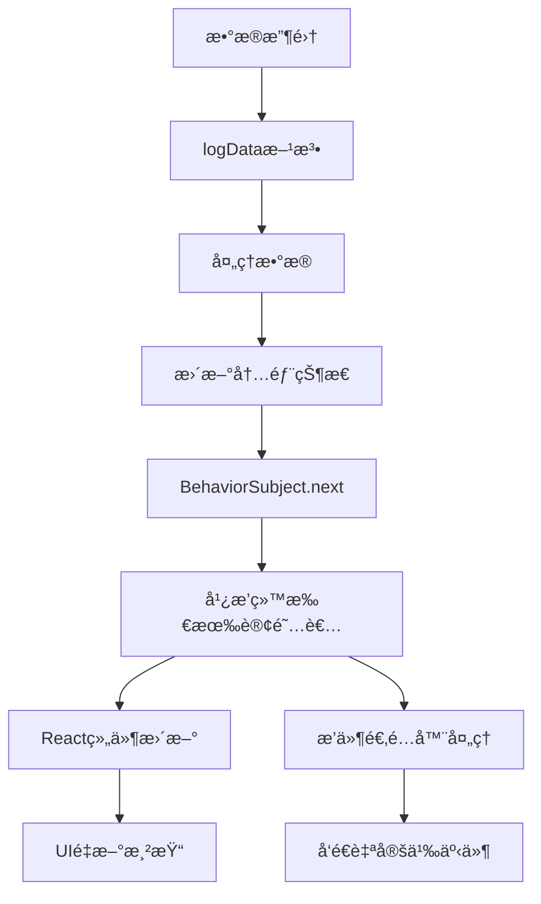

### 5. 具体示例

#### 内存数æ®æ”¶é›†ç¤ºä¾‹
```typescript
// 1. 收集数æ®
dreamviewAnalysis.logData('Memory', {
    TotalJSHeapSize: memory.totalJSHeapSize / 1024 / 1024,
    UsedJSHeapSize: memory.usedJSHeapSize / 1024 / 1024,
    JSHeapSizeLimit: memory.jsHeapSizeLimit / 1024 / 1024,
}, {
    useStatistics: {
        useMax: true,
        useMin: true,
    },
});

// 2. 内部处ç†
// dataStream.value ä» {} å˜æˆ:
// {
//   Memory: {
//     TotalJSHeapSize: { value: 100, max: 100, min: 100, ... },
//     UsedJSHeapSize: { value: 50, max: 50, min: 50, ... },
//     JSHeapSizeLimit: { value: 200, max: 200, min: 200, ... }
//   }
// }

// 3. 触å‘æ›´æ–°
this.dataStream.next({...this.dataStream.value});

// 4. 所有订阅者收到新数æ®
// React组件: setData(newData) -> é‡æ–°æ¸²æŸ“
// æ’件适é…器: å‘é€è‡ªå®šä¹‰äº‹ä»¶
```

### 6. BehaviorSubject的优势

1. **å³æ—¶æ€§**: 新订阅者立å³è·å¾—最新数æ®
2. **å“应å¼**: æ•°æ®å˜åŒ–自动触å‘UIæ›´æ–°
3. **内存效ç‡**: åªä¿å­˜æœ€æ–°å€¼ï¼Œä¸ä¿å­˜å†å²
4. **ç±»å‹å®‰å…¨**: TypeScript支æŒ
5. **错误处ç†**: 内置错误传播机制
6. **å–消订阅**: 防止内存泄æ¼

### 7. 性能优化

```typescript
// 使用requestIdleCallbacké¿å…阻å¡ä¸»çº¿ç¨‹
const collectMemoryInfo = () =>
    requestIdleCallback(() => {
        // 收集数æ®
        dreamviewAnalysis.logData('Memory', {...});
        // 递归调用，æŒç»­ç›‘æ§
        collectMemoryInfo();
    });
```

è¿™ç§è®¾è®¡ç¡®ä¿äº†ï¼š
- **å®æ—¶æ€§**: æ•°æ®å˜åŒ–ç«‹å³å映到UI
- **性能**: ä¸é˜»å¡ä¸»çº¿ç¨‹
- **å¯æ‰©å±•æ€§**: 多个组件å¯ä»¥åŒæ—¶è®¢é˜…
- **内存安全**: 正确的订阅管ç†

这就是RxJS BehaviorSubject在dreamview-analysis中å®ç°å®æ—¶æ•°æ®æ›´æ–°çš„完整机制。

TSX文件是**TypeScript JSX**文件的扩展å，让我详细解释一下：

## TSX文件是什么

### 1. 基本定义
- **TSX** = **TypeScript** + **JSX**
- 文件扩展å：`.tsx`
- 这是一ç§ç‰¹æ®Šçš„TypeScript文件，支æŒJSX语法

### 2. JSX是什么
JSX (JavaScript XML) 是React中用äºæè¿°UI的语法扩展：

```jsx
// 这是JSX语法
const element = <h1>Hello, World!</h1>;
```

### 3. TSX vs TS vs JSX

| æ–‡ä»¶ç±»å‹   | 扩展å | 用途             | 示例                                             |
| ---------- | ------ | ---------------- | ------------------------------------------------ |
| TypeScript | `.ts`  | 纯TypeScriptä»£ç  | `const name: string = "John";`                   |
| JSX        | `.jsx` | JavaScript + JSX | `const element = <div>Hello</div>;`              |
| TSX        | `.tsx` | TypeScript + JSX | `const element: JSX.Element = <div>Hello</div>;` |

## 在Dreamview-Analysis中的TSX文件

让我查看项目中的TSX文件示例：

Read file: frontend/packages/dreamview-analysis/react/PerformanceMonitor.tsx
Read file: frontend/packages/dreamview-analysis/react/PerformanceMonitor.tsx
## TSX文件的详细解æ

### 1. TSX文件的特点

ä»ä¸Šé¢çš„代ç å¯ä»¥çœ‹å‡ºï¼ŒTSX文件结åˆäº†ï¼š

#### TypeScript特性
```typescript
// ç±»å‹æ³¨è§£
const PerformanceMonitor: React.FC = () => { ... }

// æ³›å‹ç±»å‹
const [subscription, setSubscription] = useState<Subscription | null>(null);

// æ¥å£ç±»å‹
perfMonitor.on('measure', (measure: PerformanceMeasure) => { ... });
```

#### JSX语法
```jsx
// JSX元素
return ReactDOM.createPortal(
    <Draggable handle='.handle'>
        <Resizable
            defaultSize={{
                width: 300,
                height: 200,
            }}
            minWidth={300}
            minHeight={200}
            maxWidth={1800}
            maxHeight={1800}
            style={{
                position: 'fixed',
                bottom: 4,
                right: 4,
                backgroundColor: 'transparent',
                padding: '10px',
                zIndex: 1000,
            }}
        >
            <div
                style={{
                    position: 'relative',
                    width: '100%',
                    height: '100%',
                    backgroundColor: 'rgba(15, 15, 20, .6)',
                    padding: '10px',
                    borderRadius: '6px',
                    boxShadow: '0 2px 6px rgba(26, 29, 36, .5)',
                    zIndex: 1000,
                    backdropFilter: 'blur(10px)',
                }}
            >
                <strong style={{ color: 'rgba(128, 139, 157, 1.000)' }}>
                    Dreamview Analysis
                </strong>
            </div>
        </Resizable>
    </Draggable>,
    document.body,
);
```

### 2. TSX vs JSX vs TS 对比

| 特性          | TSX              | JSX              | TS             |
| ------------- | ---------------- | ---------------- | -------------- |
| **语法支æŒ**  | TypeScript + JSX | JavaScript + JSX | ä»…TypeScript   |
| **ç±»å‹æ£€æŸ¥**  | ✅ 完整类å‹æ£€æŸ¥   | ⌠无类å‹æ£€æŸ¥     | ✅ 完整类å‹æ£€æŸ¥ |
| **React组件** | ✅ æ”¯æŒ           | ✅ æ”¯æŒ           | ⌠ä¸æ”¯æŒJSX    |
| **编译**      | 需è¦TSX编译器    | 需è¦JSX编译器    | 需è¦TS编译器   |

### 3. TSX文件的优势

#### ç±»å‹å®‰å…¨
```typescript
// 组件å±æ€§ç±»å‹æ£€æŸ¥
interface Props {
    service: DreamviewAnalysis;
    visible?: boolean;
}

const PerformanceMonitor: React.FC<Props> = ({ service, visible = false }) => {
    // TypeScript会检查serviceçš„ç±»å‹
    const data = service.getDataStream();
    return <div>{/* JSX内容 */}</div>;
};
```

#### 智能æ示
```typescript
// IDE会æ供完整的类å‹æ示
const [data, setData] = useState<Record<string, any>>({});
// 当你输入 data. 时，IDE会æ示å¯èƒ½çš„å±æ€§
```

#### 编译时错误检查
```typescript
// 编译时会检查类å‹é”™è¯¯
const element: JSX.Element = <div>Hello</div>; // ✅ 正确
const element: string = <div>Hello</div>;      // ⌠类å‹é”™è¯¯
```

### 4. TSX文件的编译过程

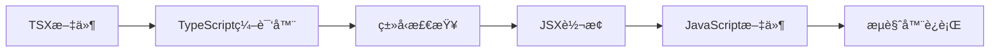

### 5. å®é™…使用示例

#### 简å•çš„TSX组件
```tsx
import React, { useState } from 'react';

interface CounterProps {
    initialValue?: number;
    onCountChange?: (count: number) => void;
}

const Counter: React.FC<CounterProps> = ({ 
    initialValue = 0, 
    onCountChange 
}) => {
    const [count, setCount] = useState<number>(initialValue);

    const increment = () => {
        const newCount = count + 1;
        setCount(newCount);
        onCountChange?.(newCount);
    };

    return (
        <div>
            <p>Count: {count}</p>
            <button onClick={increment}>Increment</button>
        </div>
    );
};

export default Counter;
```

#### å¤æ‚çš„TSX组件（如PerformanceMonitor）
```tsx
const PerformanceMonitor: React.FC = () => {
    // TypeScript状æ€ç®¡ç†
    const [data, setData] = useState<Record<string, any>>({});
    const [visible, setVisible] = useState<boolean>(false);
    
    // TypeScriptç±»å‹æ³¨è§£
    const dreamviewAnalysis: DreamviewAnalysis = DreamviewAnalysis.getInstance();
    
    // JSX渲染
    return (
        <div style={{ position: 'fixed', bottom: 0, right: 0 }}>
            <h3>Performance Monitor</h3>
            <pre>{JSON.stringify(data, null, 2)}</pre>
        </div>
    );
};
```

### 6. é…置文件中的TSX支æŒ

在项目的`tsconfig.json`中：
```json
{
    "compilerOptions": {
        "jsx": "react",  // å¯ç”¨JSX支æŒ
        "typeRoots": [
            "lib",
            "react",     // 包å«Reactç±»å‹
            "src/@types",
            "node_modules/@types"
        ]
    },
    "include": [
        "**/*.ts",
        "**/*.tsx"      // 包å«TSX文件
    ]
}
```

### 总结

TSX文件是：
- **TypeScript + JSX**的组åˆ
- æä¾›**完整的类å‹å®‰å…¨**
- 支æŒ**React组件开å‘**
- 在编译时进行**ç±»å‹æ£€æŸ¥**
- æä¾›**更好的开å‘体验**（智能æ示ã€é”™è¯¯æ£€æŸ¥ï¼‰

在Dreamview-Analysis项目中，TSX文件用äºåˆ›å»ºç±»å‹å®‰å…¨çš„React组件，确ä¿æ€§èƒ½ç›‘æ§ç•Œé¢çš„å¯é æ€§å’Œå¯ç»´æŠ¤æ€§ã€‚

让我分ædreamview-analysis模å—ä¸å端的è”系。首先查看相关的é…置文件和代ç ç»“æ„。

Search files...
ç°åœ¨è®©æˆ‘查看WebSocketManager中ä¸dreamview-analysis相关的代ç ï¼š

Ran tool
让我查看WebSocketManager中具体如何使用dreamview-analysis：

Read file: frontend/packages/dreamview-core/src/services/WebSocketManager/websocket-manager.service.ts
让我查看å端的数æ®å¤„ç†å™¨é…置：

Read file: conf/data_handler.conf
ç°åœ¨è®©æˆ‘查看å端SocketManagerçš„å®ç°ï¼š

Read file: backend/socket_manager/socket_manager.cc
## Dreamview-Analysis模å—ä¸å端的è”系分æ

基äºä»£ç åˆ†æ，dreamview-analysis模å—ä¸å端有ç€å¯†åˆ‡çš„è”系，主è¦ä½“ç°åœ¨ä»¥ä¸‹å‡ ä¸ªæ–¹é¢ï¼š

### 1. æ•°æ®æµæ¶æ„

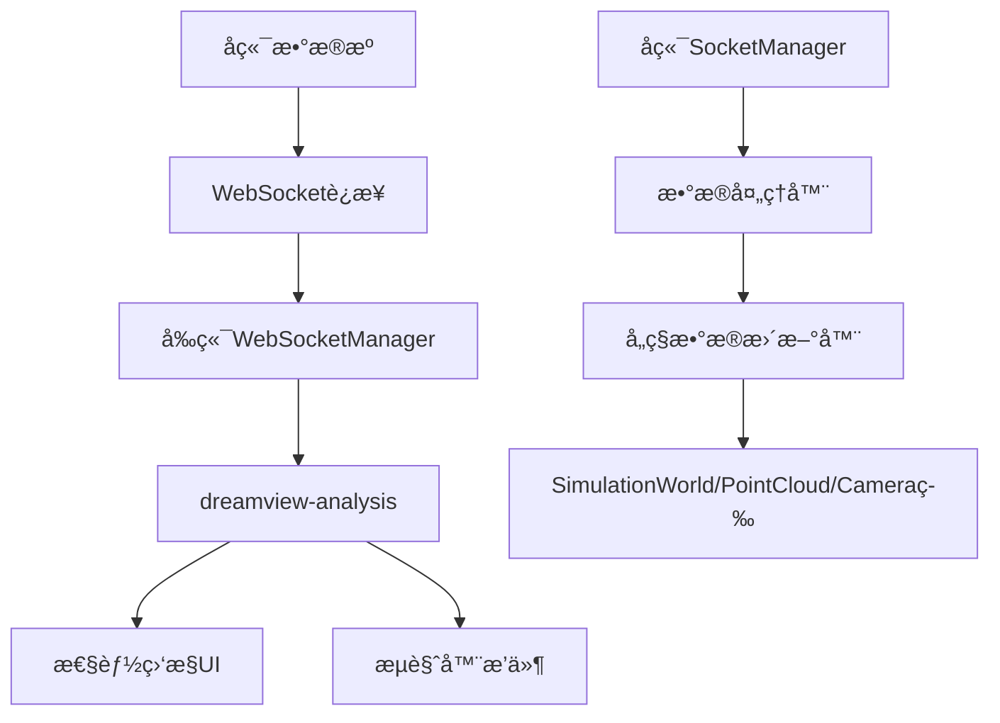

### 2. WebSocketè¿æ¥æœºåˆ¶

#### å端WebSocketæœåŠ¡
```cpp
// backend/dreamview.cc
server_->addWebSocketHandler("/websocket", *websocket_);
server_->addWebSocketHandler("/map", *map_ws_);
server_->addWebSocketHandler("/pointcloud", *point_cloud_ws_);
server_->addWebSocketHandler("/camera", *camera_ws_);
server_->addWebSocketHandler("/plugin", *plugin_ws_);
server_->addWebSocketHandler("/simworld", *sim_world_ws_);
server_->addWebSocketHandler("/hmi", *hmi_ws_);
server_->addWebSocketHandler("/obstacle", *obstacle_ws_);
server_->addWebSocketHandler("/channelsinfo", *channels_info_ws_);
```

#### å‰ç«¯WebSocketè¿æ¥
```typescript
// frontend/packages/dreamview-core/src/services/WebSocketManager/websocket-manager.service.ts
export const config = {
    baseURL,
    baseHttpURL,
    mainUrl: `${baseURL}/websocket`,      // 主è¿æ¥
    pluginUrl: `${baseURL}/plugin`,       // æ’件è¿æ¥
};
```

### 3. æ•°æ®å¤„ç†å™¨é…ç½®

#### å端é…ç½® (conf/data_handler.conf)
```protobuf
data_handler_info {
  key: "apollo.dreamview.SimulationWorld",
  value {
    data_name: "simworld",
    msg_type: "apollo.dreamview.SimulationWorld",
    websocket_info {
      websocket_name: "simworld",
      websocket_pipe: "/simworld"
    }
  }
}
```

#### å‰ç«¯å…ƒæ•°æ®å¤„ç†
```typescript
// WebSocketManager处ç†å…ƒæ•°æ®
private metadata: MetadataItem[] = [];
private metadataSubject: BehaviorSubject<MetadataItem[]> = new BehaviorSubject<MetadataItem[]>([]);
```

### 4. 性能监æ§é›†æˆ

#### WebSocketManager中的性能监æ§
```typescript
// frontend/packages/dreamview-core/src/services/WebSocketManager/websocket-manager.service.ts
import { perfMonitor, DreamviewAnalysis } from '@dreamview/dreamview-analysis';

// 在数æ®ååºåˆ—化过程中进行性能监æ§
this.workerPoolManager.dispatchTask({
    type: 'SOCKET_STREAM_MESSAGE',
    payload: <StreamMessage>message.payload,
    transferList: [data.buffer],
}, {
    callback: () => {
        perfMonitor.mark(`dataDeserializeStart-${name}`);
    },
}).then((response) => {
    if (response.success) {
        perfMonitor.mark(`dataDeserializeEnd-${name}`);
        perfMonitor.measure(
            `dataDeserialize-${name}`,
            `dataDeserializeStart-${name}`,
            `dataDeserializeEnd-${name}`,
        );
        this.dataSubjects.getByExactKey({ name })?.next(response.result);
    }
});
```

### 5. æ•°æ®è®¢é˜…机制

#### å端订阅处ç†
```cpp
// backend/socket_manager/socket_manager.cc
websocket_->RegisterMessageHandler(
    "subscribe",
    [this](const Json &json, WebSocketHandler::Connection *conn) {
        Json response;
        response["action"] = "response";
        response["data"]["info"] = {};
        response["data"]["info"]["code"] = this->Subscribe(json) ? 0 : -1;
        websocket_->SendData(conn, response.dump());
    });
```

#### å‰ç«¯è®¢é˜…请求
```typescript
// WebSocketManagerå‘é€è®¢é˜…消æ¯
public sendSubscriptionMessage<Param>(
    action: RequestMessageActionEnum,
    name: string,
    channel: Nullable<string>,
    option?: {
        param?: Param;
        dataFrequencyMs?: number;
    },
): void {
    const info: SubscribePayload = {
        websocketName: metadata.websocketInfo.websocketName,
        ...(isNil(channel) ? {} : { channelName: channel }),
        ...(isNil(option?.param) ? {} : { param: option.param }),
        dataFrequencyMs: option?.dataFrequencyMs ?? dataFrequencyMs,
    };

    this.mainConnection.sendMessage({
        action,
        type: action,
        data: {
            name: action,
            source: 'dreamview',
            info,
            sourceType: 'websocktSubscribe',
            targetType: 'module',
            requestId: action,
        },
    } as RequestStreamMessage);
}
```

### 6. å®æ—¶æ•°æ®æµ

#### å端数æ®æ›´æ–°å™¨
```cpp
// backend/dreamview.cc
sim_world_updater_.reset(new SimulationWorldUpdater(
    websocket_.get(), map_ws_.get(), plugin_ws_.get(), map_service_.get(),
    plugin_manager_.get(), sim_world_ws_.get(), hmi_.get(),
    FLAGS_routing_from_file));
point_cloud_updater_.reset(new PointCloudUpdater(point_cloud_ws_.get()));
map_updater_.reset(new MapUpdater(map_ws_.get(), map_service_.get()));
obstacle_updater_.reset(new ObstacleUpdater(obstacle_ws_.get()));
```

#### å‰ç«¯æ•°æ®æ¥æ”¶
```typescript
// å­WebSocketè¿æ¥å¤„ç†
this.activeWorkers[name].socketMessage$
    .pipe(throttle(() => timer(this.throttleDuration.value)))
    .subscribe((message) => {
        if (isMessageType(message, 'SOCKET_MESSAGE')) {
            const { data } = message.payload as StreamMessage;
            // 处ç†æ¥æ”¶åˆ°çš„æ•°æ®
            this.workerPoolManager.dispatchTask({
                type: 'SOCKET_STREAM_MESSAGE',
                payload: <StreamMessage>message.payload,
                transferList: [data.buffer],
            });
        }
    });
```

### 7. æ’件适é…器

#### 自定义事件分å‘
```typescript
// PerformanceMonitorPluginAdaptor.tsx
const sub = dreamviewAnalysis.getDataStream().subscribe({
    next: (data) => {
        // å‘é€è‡ªå®šä¹‰äº‹ä»¶ç»™æµè§ˆå™¨æ’件
        const event = new CustomEvent('dreamview-analysis', {detail: data});
        document.dispatchEvent(event);
    },
    error: (err) => {
        console.error(err);
    },
});
```

#### æµè§ˆå™¨æ’件监å¬
```javascript
// dreamview-debug-extension
document.addEventListener('dreamview-analysis', (event) => {
    chrome.runtime.sendMessage({
        type: "updateData", 
        payload: event.detail
    });
});
```

### 8. è¿æ¥çŠ¶æ€ç®¡ç†

#### å‰ç«¯è¿æ¥çŠ¶æ€ç›‘æ§
```typescript
// WebSocketManagerStore
useEffect(() => {
    store.mainApi.webSocketManager.connectMain().subscribe((status) => {
        if (status === ConnectionStatusEnum.METADATA) {
            const metadata = store.mainApi.webSocketManager.getMetadata();
            if (metadata.find((item) => item.dataName === StreamDataNames.SIM_HMI_STATUS)) {
                store.otherApi.getSocketIns(SocketNameEnum.SIMULATION);
            }
            mainConnectionRef.current.publish('main:connection successful');
        }
    });
}, [store.mainApi, store.pluginApi]);
```

### 总结

dreamview-analysis模å—ä¸å端的è”系主è¦ä½“ç°åœ¨ï¼š

1. **æ•°æ®æºä¾èµ–**: ä¾èµ–å端æ供的å„ç§æ•°æ®æµï¼ˆä»¿çœŸä¸–ç•Œã€ç‚¹äº‘ã€æ‘„åƒå¤´ç­‰ï¼‰
2. **性能监æ§**: 监æ§å‰å端数æ®äº¤äº’的性能指标
3. **WebSocket通信**: 通过WebSocketæ¥æ”¶å端å®æ—¶æ•°æ®
4. **æ’件集æˆ**: 将性能数æ®åˆ†å‘ç»™æµè§ˆå™¨æ’件
5. **è¿æ¥ç®¡ç†**: 监æ§å’Œç®¡ç†ä¸å端的è¿æ¥çŠ¶æ€
6. **æ•°æ®è®¢é˜…**: 动æ€è®¢é˜…å端数æ®æº
7. **元数æ®åŒæ­¥**: åŒæ­¥å端数æ®å¤„ç†å™¨é…ç½®

è¿™ç§æ¶æ„ç¡®ä¿äº†å‰ç«¯èƒ½å¤Ÿå®æ—¶è·å–å端数æ®ï¼ŒåŒæ—¶ç›‘æ§æ•´ä¸ªç³»ç»Ÿçš„性能状况，为开å‘者æ供完整的性能分æ能力。

这是一个很好的问题ï¼è®©æˆ‘分æ一下为什么dreamview-analysis模å—没有使用Redux，而是选择了RxJS BehaviorSubject。

Search files...
ç°åœ¨è®©æˆ‘查看项目中是å¦æœ‰ä½¿ç”¨Redux的地方：

Ran tool
让我查看项目的package.json文件，看看是å¦æœ‰Reduxä¾èµ–：

Ran tool
Read file: frontend/packages/dreamview-core/package.json
ç°åœ¨è®©æˆ‘查看自定义Storeçš„å®ç°ï¼š

Read file: frontend/packages/dreamview-core/src/store/base/Store.ts
## 为什么dreamview-analysis没有使用Redux？

基äºä»£ç åˆ†æ，我å¯ä»¥è§£é‡Šä¸ºä»€ä¹ˆdreamview-analysis模å—没有使用Redux，而是选择了RxJS BehaviorSubject：

### 1. 项目æ¶æ„选择：自定义Store而éRedux

#### 项目使用了自定义的状æ€ç®¡ç†æ–¹æ¡ˆ
```typescript
// frontend/packages/dreamview-core/src/store/base/Store.ts
class Store<S, A> {
    private state: BehaviorSubject<S>;  // 使用RxJS BehaviorSubject
    private readonly reducer: (state: S, action: A) => S;
    
    constructor(initialState: S, reducer: (state: S, action: A) => S) {
        this.state = new BehaviorSubject(initialState);
        this.reducer = reducer;
    }
}
```

#### 项目ä¾èµ–中没有Redux
```json
// frontend/packages/dreamview-core/package.json
{
    "dependencies": {
        "rxjs": "^7.8.1",        // 使用RxJS
        "immer": "^10.0.2",      // 使用Immer进行ä¸å¯å˜æ›´æ–°
        // 没有redux相关ä¾èµ–
    }
}
```

### 2. 为什么选择RxJS BehaviorSubject而ä¸æ˜¯Redux？

#### 2.1 性能考虑
```typescript
// dreamview-analysis中的å®æ—¶æ•°æ®æµ
private dataStream = new BehaviorSubject<Record<string, any>>({});

logData(source: string, metric: Record<string, any>, options?: MetricOptions): void {
    // ç›´æ¥æ›´æ–°çŠ¶æ€ï¼Œæ— éœ€é€šè¿‡action/reducer
    this.dataStream.value[source] = processedMetric;
    // ç«‹å³å¹¿æ’­æ–°å€¼
    this.dataStream.next({...this.dataStream.value});
}
```

**优势**：
- **更少的开销**: 无需action创建ã€dispatchã€reducer处ç†
- **æ›´å¿«çš„å“应**: ç›´æ¥çŠ¶æ€æ›´æ–°ï¼Œå‡å°‘中间层
- **内存效ç‡**: åªä¿å­˜æœ€æ–°å€¼ï¼Œä¸ä¿å­˜å†å²çŠ¶æ€

#### 2.2 å®æ—¶æ•°æ®æµéœ€æ±‚
```typescript
// 高频数æ®æ”¶é›†
const collectMemoryInfo = () =>
    requestIdleCallback(() => {
        dreamviewAnalysis.logData('Memory', {
            TotalJSHeapSize: memory.totalJSHeapSize / 1024 / 1024,
            UsedJSHeapSize: memory.usedJSHeapSize / 1024 / 1024,
            JSHeapSizeLimit: memory.jsHeapSizeLimit / 1024 / 1024,
        });
        collectMemoryInfo(); // 递归调用，æŒç»­ç›‘æ§
    });
```

**Redux的问题**：
- **性能瓶颈**: 频ç¹çš„action dispatch会导致性能问题
- **状æ€è†¨èƒ€**: å†å²çŠ¶æ€ç§¯ç´¯å¯¼è‡´å†…å­˜å ç”¨
- **å¤æ‚性**: 对äºç®€å•çŠ¶æ€æ›´æ–°è¿‡äºå¤æ‚

#### 2.3 å“应å¼ç¼–程优势
```typescript
// RxJSçš„å“应å¼ç‰¹æ€§
const sub = dreamviewAnalysis.getDataStream().subscribe({
    next: (data) => {
        // 自动å“应数æ®å˜åŒ–
        const event = new CustomEvent('dreamview-analysis', {detail: data});
        document.dispatchEvent(event);
    },
    error: (err) => {
        console.error(err);
    },
});
```

**RxJS的优势**：
- **自动å“应**: æ•°æ®å˜åŒ–自动触å‘订阅者更新
- **æ“作符支æŒ**: 丰富的æµæ“作符（throttleã€debounce等）
- **错误处ç†**: 内置错误传播机制

### 3. 项目整体æ¶æ„的一致性

#### 3.1 统一使用RxJS
```typescript
// WebSocketManager也使用RxJS
private dataSubjects: MultiKeyMap<
    { name: string; channel?: Emptyable<string> },
    CountedSubject<StreamMessageData<unknown> | unknown>
> = new MultiKeyMap();
```

#### 3.2 自定义Storeæ¶æ„
```typescript
// 项目使用自定义Store，基äºRxJS
export const { StoreProvider, useStore } = Factory.createStoreProvider<IInitState, TYPES.CombineAction>({
    initialState: initState,
    reducer,
});
```

### 4. 具体场景对比

#### 4.1 使用Reduxçš„æ–¹å¼ï¼ˆå¦‚æœé€‰æ‹©ï¼‰
```typescript
// 需è¦å®šä¹‰action
const updatePerformanceData = (source: string, data: any) => ({
    type: 'UPDATE_PERFORMANCE_DATA',
    payload: { source, data }
});

// 需è¦reducer处ç†
const performanceReducer = (state, action) => {
    switch (action.type) {
        case 'UPDATE_PERFORMANCE_DATA':
            return {
                ...state,
                [action.payload.source]: action.payload.data
            };
        default:
            return state;
    }
};

// 需è¦dispatch
dispatch(updatePerformanceData('Memory', memoryData));
```

#### 4.2 使用RxJS BehaviorSubjectçš„æ–¹å¼ï¼ˆå®é™…选择）
```typescript
// ç›´æ¥æ›´æ–°ï¼Œç®€æ´é«˜æ•ˆ
dreamviewAnalysis.logData('Memory', memoryData);
```

### 5. 技术选å‹çš„åˆç†æ€§

#### 5.1 项目特点
- **高频数æ®æ›´æ–°**: 性能监æ§éœ€è¦å®æ—¶æ•°æ®
- **简å•çŠ¶æ€ç»“æ„**: 主è¦æ˜¯æ•°æ®æ”¶é›†å’Œå±•ç¤º
- **å“应å¼éœ€æ±‚**: æ•°æ®å˜åŒ–需è¦ç«‹å³å“应UI

#### 5.2 技术栈一致性
- **RxJS生æ€**: 项目大é‡ä½¿ç”¨RxJS进行异步处ç†
- **自定义Store**: 项目有自己的状æ€ç®¡ç†æ–¹æ¡ˆ
- **性能优先**: å®æ—¶ç›‘æ§å¯¹æ€§èƒ½è¦æ±‚较高

### 总结

dreamview-analysis没有使用Reduxçš„åŸå› ï¼š

1. **性能考虑**: 高频数æ®æ›´æ–°åœºæ™¯ä¸‹ï¼ŒReduxçš„action/reducer模å¼å¼€é”€è¾ƒå¤§
2. **æ¶æ„一致性**: 项目整体使用RxJS和自定义Storeæ¶æ„
3. **å®æ—¶æ€§éœ€æ±‚**: BehaviorSubjectæ供更直æ¥çš„å“应å¼æ•°æ®æµ
4. **简æ´æ€§**: 对äºç®€å•çš„æ•°æ®æ”¶é›†åœºæ™¯ï¼ŒRxJS比Redux更简æ´
5. **技术栈统一**: é¿å…引入é¢å¤–的状æ€ç®¡ç†åº“，ä¿æŒæŠ€æœ¯æ ˆä¸€è‡´æ€§

è¿™ç§é€‰æ‹©æ˜¯åˆç†çš„，特别是在å®æ—¶æ€§èƒ½ç›‘æ§è¿™ç§é«˜é¢‘æ•°æ®æ›´æ–°çš„场景下，RxJS BehaviorSubjectæ供了更好的性能和更简æ´çš„API。

让我详细解释RxJS和JavaScript的关系。

## RxJS和JavaScript的关系

### 1. 基本关系

**RxJS是JavaScript的一个库**，具体æ¥è¯´ï¼š

- **RxJS** = **Reactive Extensions for JavaScript**
- 它是JavaScriptçš„**å“应å¼ç¼–程库**
- 基äº**观察者模å¼**å’Œ**迭代器模å¼**
- 使用**函数å¼ç¼–程**æ€æƒ³

### 2. 技术层次关系

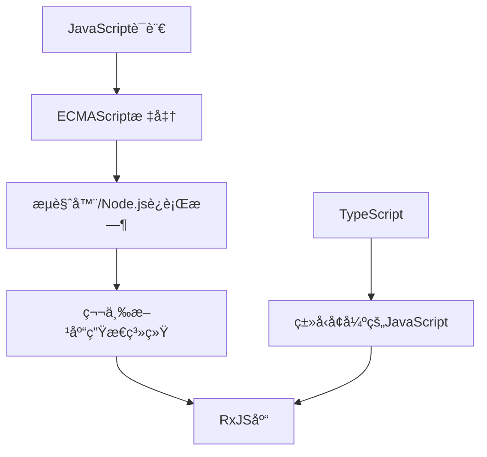

### 3. 在Dreamview项目中的体ç°

让我查看项目中RxJS的具体使用：

Ran tool
ç°åœ¨è®©æˆ‘查看具体的RxJS使用示例：

Read file: frontend/packages/dreamview-core/src/services/WebSocketManager/websocket-connect.service.ts
Read file: frontend/packages/dreamview-core/src/services/WebSocketManager/websocket-manager.service.ts
## RxJSå’ŒJavaScript的详细关系解æ

### 1. 基本概念关系

#### JavaScript是语言，RxJS是库
```javascript
// 纯JavaScript
const data = [1, 2, 3, 4, 5];
const doubled = data.map(x => x * 2);
console.log(doubled); // [2, 4, 6, 8, 10]

// 使用RxJS
import { from } from 'rxjs';
import { map } from 'rxjs/operators';

const dataStream = from([1, 2, 3, 4, 5]);
dataStream.pipe(
    map(x => x * 2)
).subscribe(result => console.log(result));
```

### 2. 在Dreamview项目中的具体应用

#### 2.1 WebSocketè¿æ¥ç®¡ç†
```typescript
// 使用RxJS的WebSocket
import { webSocket, WebSocketSubject } from 'rxjs/webSocket';
import { BehaviorSubject, delay, Observable, retryWhen, Subject, take } from 'rxjs';

export class WebSocketConnection {
    private socket: WebSocketSubject<RequestMessage<any>>;
    private readonly receivedMessagesSubject = new Subject<ResponseMessage<any>>();
    connectionStatus$ = new BehaviorSubject<ConnectionStatusEnum>(ConnectionStatusEnum.DISCONNECTED);

    connect(retries = 3, retryInterval = 1000) {
        this.socket = webSocket({
            url: this.url,
            openObserver: {
                next: () => {
                    this.connectionStatus$.next(ConnectionStatusEnum.CONNECTED);
                },
            },
        });

        // 使用RxJSæ“作符处ç†é‡è¯•é€»è¾‘
        this.socket.pipe(
            retryWhen((errors) => errors.pipe(delay(retryInterval), take(retries)))
        ).subscribe(
            (msg) => {
                this.receivedMessagesSubject.next(msg as ResponseMessage<any>);
            },
            (error) => {
                logger.error(error);
            },
        );
    }
}
```

#### 2.2 æ•°æ®æµå¤„ç†
```typescript
// 使用RxJSæ“作符进行数æ®æµæ§åˆ¶
import { BehaviorSubject, filter, finalize, from, map, Observable, Subject, tap, timer } from 'rxjs';
import { debounceTime, throttle } from 'rxjs/operators';

export class WebSocketManager {
    // 使用BehaviorSubject管ç†çŠ¶æ€
    private throttleDuration = new BehaviorSubject<number>(100);
    private metadataSubject: BehaviorSubject<MetadataItem[]> = new BehaviorSubject<MetadataItem[]>([]);

    // 使用æ“作符æ§åˆ¶æ•°æ®æµé¢‘ç‡
    this.activeWorkers[name].socketMessage$
        .pipe(throttle(() => timer(this.throttleDuration.value)))
        .subscribe((message) => {
            // 处ç†æ¶ˆæ¯
        });
}
```

### 3. RxJS vs åŸç”ŸJavaScript对比

#### 3.1 异步处ç†

**åŸç”ŸJavaScript (Promise/async-await)**:
```javascript
// 传统方å¼
async function fetchData() {
    try {
        const response = await fetch('/api/data');
        const data = await response.json();
        return data;
    } catch (error) {
        console.error('Error:', error);
    }
}
```

**RxJSæ–¹å¼**:
```typescript
// RxJSæ–¹å¼
import { from } from 'rxjs';
import { catchError, map } from 'rxjs/operators';

const dataStream = from(fetch('/api/data')).pipe(
    map(response => response.json()),
    catchError(error => {
        console.error('Error:', error);
        return [];
    })
);

dataStream.subscribe(data => console.log(data));
```

#### 3.2 事件处ç†

**åŸç”ŸJavaScript**:
```javascript
// 传统事件处ç†
const button = document.getElementById('button');
button.addEventListener('click', (event) => {
    console.log('Button clicked');
});

// 需è¦æ‰‹åŠ¨ç®¡ç†äº‹ä»¶ç›‘å¬å™¨
button.removeEventListener('click', handler);
```

**RxJSæ–¹å¼**:
```typescript
// RxJS事件处ç†
import { fromEvent } from 'rxjs';
import { take } from 'rxjs/operators';

const button = document.getElementById('button');
const clickStream = fromEvent(button, 'click');

// 自动管ç†è®¢é˜…
const subscription = clickStream.pipe(
    take(5) // åªå¤„ç†å‰5次点击
).subscribe(event => {
    console.log('Button clicked');
});

// å–消订阅
subscription.unsubscribe();
```

### 4. RxJS的核心概念

#### 4.1 Observable（å¯è§‚察对象）
```typescript
// 创建Observable
import { Observable } from 'rxjs';

const observable = new Observable(subscriber => {
    subscriber.next(1);
    subscriber.next(2);
    subscriber.next(3);
    subscriber.complete();
});

observable.subscribe({
    next: value => console.log(value),
    complete: () => console.log('Done')
});
```

#### 4.2 Subject（主题）
```typescript
// BehaviorSubject - 有åˆå§‹å€¼ï¼Œç¼“存最新值
import { BehaviorSubject } from 'rxjs';

const subject = new BehaviorSubject(0); // åˆå§‹å€¼ä¸º0
subject.subscribe(value => console.log('Observer A:', value));

subject.next(1); // 输出: Observer A: 1
subject.next(2); // 输出: Observer A: 2

// 新订阅者立å³è·å¾—最新值
subject.subscribe(value => console.log('Observer B:', value)); // 输出: Observer B: 2
```

#### 4.3 æ“作符（Operators）
```typescript
import { from } from 'rxjs';
import { map, filter, debounceTime } from 'rxjs/operators';

const numbers = from([1, 2, 3, 4, 5, 6, 7, 8, 9, 10]);

numbers.pipe(
    filter(x => x % 2 === 0),  // 过滤å¶æ•°
    map(x => x * 2),           // æ¯ä¸ªæ•°ä¹˜ä»¥2
    debounceTime(100)          // 防抖
).subscribe(result => console.log(result));
```

### 5. 在Dreamview项目中的优势

#### 5.1 统一的数æ®æµç®¡ç†
```typescript
// 所有数æ®éƒ½é€šè¿‡Observable管ç†
private dataSubjects: MultiKeyMap<
    { name: string; channel?: Emptyable<string> },
    CountedSubject<StreamMessageData<unknown> | unknown>
> = new MultiKeyMap();
```

#### 5.2 å“应å¼çŠ¶æ€ç®¡ç†
```typescript
// 状æ€å˜åŒ–自动触å‘UIæ›´æ–°
const [data, setData] = useState({});
const dreamviewAnalysis = DreamviewAnalysis.getInstance();

useEffect(() => {
    const sub = dreamviewAnalysis.getDataStream().subscribe(setData);
    return () => sub.unsubscribe();
}, []);
```

#### 5.3 å¤æ‚的异步æ“作处ç†
```typescript
// 处ç†WebSocketé‡è¿ã€é”™è¯¯å¤„ç†ã€æ•°æ®è½¬æ¢ç­‰å¤æ‚逻辑
this.socket.pipe(
    retryWhen((errors) => errors.pipe(delay(retryInterval), take(retries))),
    map(msg => this.transformMessage(msg)),
    catchError(error => this.handleError(error))
).subscribe(/* 处ç†ç»“æœ */);
```

### 6. 总结

RxJS和JavaScript的关系：

1. **JavaScript是基础语言**，RxJS是æ„建在JavaScript之上的**å“应å¼ç¼–程库**
2. **RxJS扩展了JavaScript的能力**，æ供了处ç†å¼‚步数æ®æµçš„强大工具
3. **RxJS使用JavaScript的语法**，但引入了函数å¼ç¼–程和å“应å¼ç¼–程的概念
4. **在Dreamview项目中**，RxJS主è¦ç”¨äºï¼š
   - WebSocketè¿æ¥ç®¡ç†
   - å®æ—¶æ•°æ®æµå¤„ç†
   - 状æ€ç®¡ç†
   - 事件处ç†
   - 异步æ“作æ§åˆ¶

RxJS让JavaScript能够更好地处ç†å¤æ‚的异步场景，特别是在需è¦å¤„ç†å®æ—¶æ•°æ®æµçš„应用中，如Dreamview这样的å®æ—¶ç›‘æ§ç³»ç»Ÿã€‚

------

我æ¥å¸®æ‚¨è§£ædreamview-core目录下的文件结æ„和内容。让我先查看这个目录的详细结æ„。

Ran tool
Read file: frontend/packages/dreamview-core/package.json
Read file: frontend/packages/dreamview-core/README.md
Ran tool
Read file: frontend/packages/dreamview-core/src/index.ts
Read file: frontend/packages/dreamview-core/src/App.tsx
Ran tool
Ran tool
Ran tool
Ran tool
Ran tool
Read file: frontend/packages/dreamview-core/src/InitAppData.tsx
Ran tool
Read file: frontend/packages/dreamview-core/config/webpack.section.js
Read file: frontend/packages/dreamview-core/tsconfig.json
ç°åœ¨è®©æˆ‘查看一些关键的组件和store文件æ¥æ›´å¥½åœ°ç†è§£æ¶æ„：

Read file: frontend/packages/dreamview-core/src/store/combineContext.tsx
Ran tool
Read file: frontend/packages/dreamview-core/src/components/panels/index.tsx
基äºæˆ‘对dreamview-core目录的详细分æ，我æ¥ä¸ºæ‚¨è§£æ这个核心包的结æ„和功能：

## Dreamview-Core 核心包解æ

### �� 包基本信æ¯
- **å称**: `@dreamview/dreamview-core`
- **版本**: 5.0.13
- **æè¿°**: Dreamview的核心包，æ供主è¦çš„应用框æ¶å’ŒåŸºç¡€åŠŸèƒ½
- **å…¥å£**: `src/index.ts` → `src/App.tsx`

### ğŸ—ï¸ æ•´ä½“æ¶æ„

#### 1. **应用入å£ç»“æ„**
```
App.tsx (主应用组件)
├── ThemeProvider (主题æ供者)
├── DndProvider (拖拽功能æ供者)
├── CombineContext (组åˆä¸Šä¸‹æ–‡)
│   ├── AppInitProvider (应用åˆå§‹åŒ–)
│   ├── EventHandlersProvider (事件处ç†å™¨)
│   ├── WebSocketManagerProvider (WebSocket管ç†)
│   ├── UserInfoStoreProvider (用户信æ¯)
│   ├── PanelCatalogProvider (é¢æ¿ç›®å½•)
│   ├── PanelLayoutStoreProvider (é¢æ¿å¸ƒå±€)
│   ├── MenuStoreProvider (èœå•ç®¡ç†)
│   ├── HmiStoreProvider (HMI状æ€)
│   └── PanelInfoStoreProvider (é¢æ¿ä¿¡æ¯)
├── InitAppData (应用数æ®åˆå§‹åŒ–)
└── PageLayout (页é¢å¸ƒå±€)
```

#### 2. **核心目录结æ„**

**📠src/components/** - 组件库
- `panels/` - å„ç§åŠŸèƒ½é¢æ¿ï¼ˆConsoleã€CameraViewã€PointCloud等）
- `PageLayout/` - 页é¢å¸ƒå±€ç»„件
- `PanelLayout/` - é¢æ¿å¸ƒå±€ç»„件
- `Menu/` - èœå•ç»„件
- `BottomBar/` - 底部æ ç»„件
- `CustomPopover/` - 自定义弹出框

**📠src/store/** - 状æ€ç®¡ç†
- `AppInitStore/` - 应用åˆå§‹åŒ–状æ€
- `PanelLayoutStore/` - é¢æ¿å¸ƒå±€çŠ¶æ€
- `HmiStore/` - HMI状æ€ç®¡ç†
- `WebSocketManagerStore/` - WebSocketè¿æ¥ç®¡ç†
- `UserInfoStore/` - 用户信æ¯çŠ¶æ€
- `MenuStore/` - èœå•çŠ¶æ€

**�� src/services/** - æœåŠ¡å±‚
- `WebSocketManager/` - WebSocket通信管ç†
- `api/` - APIæ¥å£
- `models/` - æ•°æ®æ¨¡å‹
- `hooks/` - æœåŠ¡ç›¸å…³é’©å­

**�� src/hooks/** - 自定义Reacté’©å­
- `useComponentDisplay.ts` - 组件显示æ§åˆ¶
- `useCarviz.ts` - Carviz相关
- `useFullScreen.ts` - å…¨å±åŠŸèƒ½
- `useUpdateChannel.ts` - 通é“æ›´æ–°

**�� src/util/** - 工具函数
- `ProtoLoader.ts` - Protocol Buffer加载器
- `MessageQueue.ts` - 消æ¯é˜Ÿåˆ—
- `MultiKeyMap.ts` - 多键映射
- `IndexedDBStorage.ts` - 本地存储
- `PerformanceMonitor/` - 性能监æ§

### �� 主è¦åŠŸèƒ½æ¨¡å—

#### 1. **é¢æ¿ç³»ç»Ÿ (Panels)**
支æŒå¤šç§åŠŸèƒ½é¢æ¿ï¼š
- **Console** - æ§åˆ¶å°é¢æ¿
- **CameraView** - æ‘„åƒå¤´è§†å›¾
- **PointCloud** - 点云显示
- **VehicleViz** - 车辆å¯è§†åŒ–
- **DashBoard** - 仪表æ¿
- **Terminal** - 终端
- **Charts** - 图表组件

#### 2. **状æ€ç®¡ç†ç³»ç»Ÿ**
使用Context APIæ„建的状æ€ç®¡ç†ä½“系：
- **组åˆä¸Šä¸‹æ–‡æ¨¡å¼**: 通过`CombineContext`组åˆå¤šä¸ªProvider
- **模å—化状æ€**: æ¯ä¸ªåŠŸèƒ½æ¨¡å—有独立的状æ€ç®¡ç†
- **å“应å¼æ›´æ–°**: 基äºRxJSçš„å“应å¼æ•°æ®æµ

#### 3. **WebSocket通信**
- **å®æ—¶æ•°æ®æµ**: 处ç†æ¥è‡ªå端的å®æ—¶æ•°æ®
- **å议解æ**: 支æŒProtocol Bufferæ ¼å¼
- **è¿æ¥ç®¡ç†**: 自动é‡è¿å’ŒçŠ¶æ€ç›‘æ§

#### 4. **模å—è”邦 (Module Federation)**
- **远程模å—加载**: 支æŒåŠ¨æ€åŠ è½½è¿œç¨‹é¢æ¿
- **æ’件化æ¶æ„**: å¯æ‰©å±•çš„é¢æ¿ç³»ç»Ÿ
- **懒加载**: 按需加载组件

### ğŸ› ï¸ æŠ€æœ¯æ ˆ

**å‰ç«¯æ¡†æ¶**: React 18 + TypeScript
**状æ€ç®¡ç†**: Context API + RxJS
**UI组件**: 自定义组件库
**æ„建工具**: Webpack + Babel
**æ ·å¼**: Less + PostCSS
**3D渲染**: Three.js
**通信**: WebSocket + Protocol Buffer

### 📊 应用åˆå§‹åŒ–æµç¨‹

1. **Proto文件解æ** - 加载Protocol Buffer定义
2. **WebSocketè¿æ¥** - 建立ä¸å端的通信
3. **用户信æ¯åˆå§‹åŒ–** - 加载用户é…ç½®
4. **HMI状æ€åˆå§‹åŒ–** - 设置HMI模å¼
5. **布局åˆå§‹åŒ–** - æ¢å¤é¢æ¿å¸ƒå±€
6. **动æ€é…置加载** - 加载动æ€é…ç½®

### �� 核心特性

- **模å—化设计**: 高度模å—化的组件和状æ€ç®¡ç†
- **å¯æ‰©å±•æ€§**: 支æŒè¿œç¨‹æ¨¡å—å’Œæ’件系统
- **å®æ—¶é€šä¿¡**: 基äºWebSocketçš„å®æ—¶æ•°æ®æµ
- **性能监æ§**: 内置性能监æ§å·¥å…·
- **主题系统**: 支æŒä¸»é¢˜åˆ‡æ¢
- **国际化**: 支æŒå¤šè¯­è¨€

这个核心包为Dreamviewæ供了完整的å‰ç«¯åº”用框æ¶ï¼ŒåŒ…括状æ€ç®¡ç†ã€ç»„件系统ã€é€šä¿¡æœºåˆ¶ç­‰åŸºç¡€è®¾æ–½ï¼Œæ˜¯æ•´ä¸ªDreamview应用的核心支撑。

让我详细解释一下组åˆä¸Šä¸‹æ–‡æ¨¡å¼çš„作用和优势。

Read file: frontend/packages/dreamview-core/src/store/combineContext.tsx
Read file: frontend/packages/dreamview-core/src/App.tsx
ç°åœ¨è®©æˆ‘查看一个具体的Providerå®ç°æ¥æ›´å¥½åœ°ç†è§£è¿™ç§æ¨¡å¼ï¼š

Ran tool
Read file: frontend/packages/dreamview-core/src/store/PanelLayoutStore/index.tsx
Read file: frontend/packages/dreamview-core/src/store/base/index.ts
Read file: frontend/packages/dreamview-core/src/store/base/Factory.ts
Read file: frontend/packages/dreamview-core/src/store/base/Factory.tsx
ç°åœ¨æˆ‘æ¥è¯¦ç»†è§£é‡Š**组åˆä¸Šä¸‹æ–‡æ¨¡å¼**的作用和优势：

## 组åˆä¸Šä¸‹æ–‡æ¨¡å¼çš„作用和优势

### 🯠**核心作用**

组åˆä¸Šä¸‹æ–‡æ¨¡å¼é€šè¿‡`CombineContext`组件将多个React Context Provider组åˆåœ¨ä¸€èµ·ï¼Œé¿å…了传统的嵌套写法，æ供了更清晰ã€æ›´æ˜“维护的状æ€ç®¡ç†æ¶æ„。

### 📊 **传统写法 vs 组åˆä¸Šä¸‹æ–‡æ¨¡å¼**

#### 传统嵌套写法（å¤æ‚且难以维护）：
```tsx
// ä¼ ç»Ÿæ–¹å¼ - 嵌套地狱
<ThemeProvider>
  <DndProvider backend={HTML5Backend}>
    <AppInitProvider>
      <EventHandlersProvider>
        <WebSocketManagerProvider>
          <UserInfoStoreProvider>
            <PanelCatalogProvider>
              <PanelLayoutStoreProvider>
                <MenuStoreProvider>
                  <HmiStoreProvider>
                    <PickHmiStoreProvider>
                      <PanelInfoStoreProvider>
                        <InitAppData />
                        <PageLayout />
                      </PanelInfoStoreProvider>
                    </PickHmiStoreProvider>
                  </HmiStoreProvider>
                </MenuStoreProvider>
              </PanelLayoutStoreProvider>
            </PanelCatalogProvider>
          </UserInfoStoreProvider>
        </WebSocketManagerProvider>
      </EventHandlersProvider>
    </AppInitProvider>
  </DndProvider>
</ThemeProvider>
```

#### 组åˆä¸Šä¸‹æ–‡æ¨¡å¼ï¼ˆæ¸…晰简æ´ï¼‰ï¼š
```tsx
// 组åˆä¸Šä¸‹æ–‡æ¨¡å¼
const Providers = [
  <AppInitProvider key='AppInitProvider' />,
  <EventHandlersProvider key='EventHandlersProvider' />,
  <WebSocketManagerProvider key='WebSocketManagerProvider' />,
  <UserInfoStoreProvider key='UserInfoStoreProvider' />,
  <PanelCatalogProvider key='PanelCatalogProvider' />,
  <PanelLayoutStoreProvider key='PanelLayoutStoreProvider' />,
  <MenuStoreProvider key='MenuStoreProvider' />,
  <HmiStoreProvider key='HmiStoreProvider' />,
  <PickHmiStoreProvider key='PickHmiStoreProvider' />,
  <PanelInfoStoreProvider key='PanelInfoStoreProvider' />,
];

<ThemeProvider>
  <DndProvider backend={HTML5Backend}>
    <CombineContext providers={Providers}>
      <InitAppData />
      <PageLayout />
    </CombineContext>
  </DndProvider>
</ThemeProvider>
```

### 🔧 **å®ç°åŸç†**

```tsx
export default function CombineContext(props: PropsWithChildren<ICombineContext>) {
    const { providers, children } = props;
    const wrapped = providers.reduceRight(
        (wrappedChildren, provider) => React.cloneElement(provider, undefined, wrappedChildren),
        children,
    );
    return <>{wrapped}</>;
}
```

**关键点**：
- 使用`reduceRight`ä»å³åˆ°å·¦ç»„åˆProvider
- æ¯ä¸ªProvider包裹å‰ä¸€ä¸ªProvider的结æœ
- 最终形æˆä¸€ä¸ªProvider链

### ✨ **主è¦ä¼˜åŠ¿**

#### 1. **代ç å¯è¯»æ€§**
- **æ‰å¹³åŒ–结æ„**：é¿å…了深层嵌套，代ç æ›´æ˜“读
- **清晰的ä¾èµ–关系**：Provider数组直观显示所有状æ€ç®¡ç†æ¨¡å—
- **易äºç»´æŠ¤**：添加/删除Provideråªéœ€ä¿®æ”¹æ•°ç»„

#### 2. **模å—化管ç†**
- **独立状æ€æ¨¡å—**：æ¯ä¸ªProvider管ç†ç‹¬ç«‹çš„功能域
- **解耦åˆ**：ä¸åŒçŠ¶æ€æ¨¡å—之间解耦
- **å¯å¤ç”¨**：Providerå¯ä»¥åœ¨ä¸åŒç»„件中å¤ç”¨

#### 3. **性能优化**
- **按需加载**：å¯ä»¥åŠ¨æ€æ·»åŠ /移除Provider
- **状æ€éš”离**：æ¯ä¸ªProvider的状æ€å˜åŒ–åªå½±å“相关组件
- **é¿å…ä¸å¿…è¦çš„é‡æ¸²æŸ“**：精确的状æ€æ›´æ–°

#### 4. **å¼€å‘体验**
- **易äºè°ƒè¯•**：æ¯ä¸ªProvider有独立的key，便äºè°ƒè¯•
- **ç±»å‹å®‰å…¨**：TypeScript支æŒï¼Œæ供完整的类å‹æ£€æŸ¥
- **测试å‹å¥½**：å¯ä»¥å•ç‹¬æµ‹è¯•æ¯ä¸ªProvider

### ğŸ—ï¸ **在Dreamview中的应用**

在Dreamview中，组åˆä¸Šä¸‹æ–‡æ¨¡å¼ç®¡ç†äº†ä»¥ä¸‹æ ¸å¿ƒçŠ¶æ€ï¼š

```tsx
const Providers = [
  // 应用åˆå§‹åŒ–状æ€
  <AppInitProvider key='AppInitProvider' />,
  
  // 事件处ç†
  <EventHandlersProvider key='EventHandlersProvider' />,
  
  // WebSocket通信管ç†
  <WebSocketManagerProvider key='WebSocketManagerProvider' />,
  
  // 用户信æ¯
  <UserInfoStoreProvider key='UserInfoStoreProvider' />,
  
  // é¢æ¿ç›®å½•
  <PanelCatalogProvider key='PanelCatalogProvider' />,
  
  // é¢æ¿å¸ƒå±€
  <PanelLayoutStoreProvider key='PanelLayoutStoreProvider' />,
  
  // èœå•çŠ¶æ€
  <MenuStoreProvider key='MenuStoreProvider' />,
  
  // HMI状æ€
  <HmiStoreProvider key='HmiStoreProvider' />,
  <PickHmiStoreProvider key='PickHmiStoreProvider' />,
  
  // é¢æ¿ä¿¡æ¯
  <PanelInfoStoreProvider key='PanelInfoStoreProvider' />,
];
```

### 🯠**å®é™…效æœ**

1. **状æ€éš”离**：æ¯ä¸ªåŠŸèƒ½æ¨¡å—的状æ€ç‹¬ç«‹ç®¡ç†
2. **æ•°æ®æµæ¸…æ™°**：ä»WebSocket → ç”¨æˆ·ä¿¡æ¯ â†’ é¢æ¿å¸ƒå±€ → UI渲染
3. **易äºæ‰©å±•**：新å¢åŠŸèƒ½åªéœ€æ·»åŠ æ–°çš„Provider
4. **维护简å•**：修改æŸä¸ªåŠŸèƒ½åªéœ€å…³æ³¨å¯¹åº”çš„Provider

è¿™ç§æ¨¡å¼ç‰¹åˆ«é€‚åˆåƒDreamview这样的大å‹åº”用，因为它需è¦ç®¡ç†å¤šä¸ªå¤æ‚的状æ€æ¨¡å—（WebSocket通信ã€é¢æ¿å¸ƒå±€ã€ç”¨æˆ·é…置等），组åˆä¸Šä¸‹æ–‡æ¨¡å¼è®©è¿™äº›å¤æ‚的状æ€ç®¡ç†å˜å¾—清晰和å¯ç»´æŠ¤ã€‚

让我详细分æ一下Dreamview中这些Provider的具体作用。首先让我查看æ¯ä¸ªProviderçš„å®ç°æ¥äº†è§£å®ƒä»¬çš„功能。

Ran tool
Read file: frontend/packages/dreamview-core/src/store/AppInitStore/index.tsx
Ran tool
Read file: frontend/packages/dreamview-core/src/store/WebSocketManagerStore/index.tsx
Ran tool
Read file: frontend/packages/dreamview-core/src/store/HmiStore/index.tsx
Ran tool
Read file: frontend/packages/dreamview-core/src/store/PanelLayoutStore/actionTypes.ts
Ran tool
Read file: frontend/packages/dreamview-core/src/store/UserInfoStore/index.tsx
Read file: frontend/packages/dreamview-core/src/store/UserInfoStore/actionTypes.ts
Ran tool
Read file: frontend/packages/dreamview-core/src/store/MenuStore/actionTypes.ts
Ran tool
Read file: frontend/packages/dreamview-core/src/store/PanelCatalogStore/index.tsx
ç°åœ¨è®©æˆ‘查看EventHandlersStoreæ¥äº†è§£äº‹ä»¶å¤„ç†æœºåˆ¶ï¼š

Ran tool
Read file: frontend/packages/dreamview-core/src/store/EventHandlersStore/index.tsx
基äºæˆ‘对å„个Provider的详细分æ，ç°åœ¨æˆ‘æ¥è¯¦ç»†è§£é‡Šè¿™äº›Provider的具体作用：

## Dreamview中å„个Provider的作用详解

### 🯠**1. AppInitProvider - 应用åˆå§‹åŒ–状æ€ç®¡ç†**

**作用**：管ç†æ•´ä¸ªåº”用的åˆå§‹åŒ–状æ€å’Œè¿›åº¦

**核心功能**：
- **åˆå§‹åŒ–进度跟踪**：监æ§å„个模å—çš„åˆå§‹åŒ–状æ€ï¼ˆLOADING/DONE/FAIL）
- **模å—注册机制**：å…许å­ç»„件注册自己的åˆå§‹åŒ–状æ€
- **全局åˆå§‹åŒ–æ§åˆ¶**：当所有模å—åˆå§‹åŒ–完æˆå，设置`hasInit = true`
- **进度å›è°ƒ**：æ供进度å˜åŒ–çš„å›è°ƒæœºåˆ¶

**使用场景**：
```tsx
// 在å­ç»„件中注册åˆå§‹åŒ–状æ€
const changeHandler = useRegistryInitEvent('Proto Parsing', 2);
changeHandler({
    status: IAppInitStatus.LOADING,
    progress: 50,
    message: '正在解æå议文件...'
});
```

### 🌠**2. WebSocketManagerProvider - WebSocket通信管ç†**

**作用**：管ç†æ‰€æœ‰WebSocketè¿æ¥å’Œå®æ—¶æ•°æ®æµ

**核心功能**：
- **主è¿æ¥ç®¡ç†**：è¿æ¥ä¸»æœåŠ¡å™¨ï¼Œå¤„ç†æ ¸å¿ƒæ•°æ®æµ
- **æ’件è¿æ¥ç®¡ç†**：è¿æ¥æ’件æœåŠ¡å™¨ï¼Œå¤„ç†æ‰©å±•åŠŸèƒ½
- **元数æ®ç®¡ç†**：管ç†æ•°æ®é€šé“的元信æ¯
- **è¿æ¥çŠ¶æ€ç›‘æ§**：监æ§è¿æ¥çŠ¶æ€ï¼ˆCONNECTED/DISCONNECTED/METADATA）
- **APIå°è£…**：æä¾›MainApiã€PluginApiã€StreamApiç­‰æ¥å£

**使用场景**：
```tsx
// è·å–主APIå®ä¾‹
const mainApi = useMainApi();
// è·å–元数æ®
const [metadata, setMetadata] = useMetadata();
// è·å–WebSocket管ç†å™¨
const wsManager = useWebSocketManager();
```

### 🮠**3. HmiStoreProvider - HMI状æ€ç®¡ç†**

**作用**：管ç†äººæœºäº¤äº’ç•Œé¢çš„核心状æ€

**核心功能**：
- **当å‰æ¨¡å¼ç®¡ç†**：管ç†å½“å‰HMI模å¼ï¼ˆå¦‚：PNCã€Perception等）
- **æ“作状æ€ç®¡ç†**：管ç†å½“å‰æ“作状æ€
- **记录状æ€ç®¡ç†**：管ç†æ•°æ®è®°å½•çŠ¶æ€
- **状æ€æŒä¹…化**：ä¿å­˜å’Œæ¢å¤HMI状æ€

**使用场景**：
```tsx
// è·å–HMI状æ€
const [hmi, dispatch] = useHmiStore();
// 更新当å‰æ¨¡å¼
dispatch(updateCurrentMode('PNC'));
// æ›´æ–°æ“作状æ€
dispatch(updateCurrentOperate('START'));
```

### ï¿½ï¿½ï¸ **4. PickHmiStoreProvider - 优化的HMI状æ€ç®¡ç†**

**作用**：æ供性能优化的HMI状æ€è®¿é—®

**核心功能**：
- **状æ€è¿‡æ»¤**：过滤æ‰é¢‘ç¹å˜åŒ–的状æ€ï¼ˆå¦‚currentRecordStatus）
- **性能优化**：å‡å°‘ä¸å¿…è¦çš„é‡æ¸²æŸ“
- **深度比较**：使用深度比较é¿å…ä¸å¿…è¦çš„状æ€æ›´æ–°

**设计ç†å¿µ**：将频ç¹å˜åŒ–的状æ€å’Œç¨³å®šçŠ¶æ€åˆ†ç¦»ï¼Œæ高性能

### 📠**5. PanelLayoutStoreProvider - é¢æ¿å¸ƒå±€ç®¡ç†**

**作用**：管ç†æ‰€æœ‰é¢æ¿çš„布局和ä½ç½®ä¿¡æ¯

**核心功能**：
- **布局状æ€ç®¡ç†**：管ç†æ¯ä¸ªæ¨¡å¼ä¸‹çš„é¢æ¿å¸ƒå±€
- **é¢æ¿æ“作**：添加ã€åˆ é™¤ã€ç§»åŠ¨é¢æ¿
- **布局æŒä¹…化**：ä¿å­˜å’Œæ¢å¤å¸ƒå±€é…ç½®
- **模å¼å…³è”**：ä¸åŒHMI模å¼å¯¹åº”ä¸åŒçš„布局

**使用场景**：
```tsx
// è·å–当å‰å¸ƒå±€
const currentLayout = useGetCurrentLayout();
// 添加é¢æ¿
dispatch(addPanelFromOutside(panelInfo));
// é‡ç½®å¸ƒå±€
dispatch(resetLayout());
```

### �� **6. UserInfoStoreProvider - 用户信æ¯ç®¡ç†**

**作用**：管ç†ç”¨æˆ·ç›¸å…³çš„ä¿¡æ¯å’Œé…ç½®

**核心功能**：
- **用户信æ¯ç®¡ç†**：存储用户基本信æ¯
- **账户切æ¢**：支æŒå¤šè´¦æˆ·åˆ‡æ¢
- **用户å好**：ä¿å­˜ç”¨æˆ·ä¸ªæ€§åŒ–设置
- **订阅管ç†**：管ç†ç”¨æˆ·çš„æ•°æ®è®¢é˜…

### 🔠**7. MenuStoreProvider - èœå•çŠ¶æ€ç®¡ç†**

**作用**：管ç†åº”用èœå•å’Œå¯¼èˆªçŠ¶æ€

**核心功能**：
- **èœå•çŠ¶æ€ç®¡ç†**：管ç†èœå•çš„显示/éšè—状æ€
- **认è¯çŠ¶æ€ç®¡ç†**：管ç†ç”¨æˆ·è®¤è¯çŠ¶æ€
- **ç¯å¢ƒç®¡ç†å™¨**：管ç†åœ°å›¾ã€åœºæ™¯ã€è®°å½•ç­‰ç¯å¢ƒèµ„æº
- **ADS管ç†å™¨**：管ç†è½¦è¾†ã€V2Xã€åŠ¨æ€ç­‰ADS资æº

**èœå•ç±»å‹**：
- `MODE_SETTING` - 模å¼è®¾ç½®
- `ADD_PANEL` - 添加é¢æ¿
- `PROFILE_MANAGER` - é…置文件管ç†
- `HIDDEN` - éšè—èœå•

### 📚 **8. PanelCatalogProvider - é¢æ¿ç›®å½•ç®¡ç†**

**作用**：管ç†æ‰€æœ‰å¯ç”¨é¢æ¿çš„目录和组件

**核心功能**：
- **é¢æ¿æ³¨å†Œ**：注册所有å¯ç”¨çš„é¢æ¿ç±»å‹
- **组件懒加载**：支æŒé¢æ¿ç»„件的懒加载
- **远程é¢æ¿**：支æŒåŠ è½½è¿œç¨‹é¢æ¿æ¨¡å—
- **工具æ ç®¡ç†**：管ç†é¢æ¿çš„工具æ ç»„件

**使用场景**：
```tsx
// è·å–é¢æ¿ä¿¡æ¯
const panelInfo = panelCatalog.get('Console');
// è·å–é¢æ¿ç»„件
const PanelComponent = panelComponents.get('Console');
// è·å–工具æ ç»„件
const ToolbarComponent = panelToolBar.get('Console');
```

### �� **9. EventHandlersProvider - 事件处ç†ç®¡ç†**

**作用**：æ供全局的事件处ç†æœºåˆ¶

**核心功能**：
- **键盘事件处ç†**：处ç†é”®ç›˜å¿«æ·é”®å’Œç»„åˆé”®
- **拖拽事件处ç†**：处ç†æ‹–拽相关事件
- **自定义事件**：æä¾›å‘布/订阅机制
- **事件过滤**：支æŒäº‹ä»¶è¿‡æ»¤å’Œæ¡ä»¶ç›‘å¬

**使用场景**：
```tsx
// 监å¬ç»„åˆé”®
setMultiPressedKey(
    (event) => console.log('Ctrl+A pressed'),
    ['a'],
    'ctrlKey'
);

// 自定义事件
const customEvent = customizeSubs.getCustomizeEvent('myEvent');
customEvent.subscribe((data) => console.log(data));
customEvent.publish('hello');
```

### 📋 **10. PanelInfoStoreProvider - é¢æ¿ä¿¡æ¯ç®¡ç†**

**作用**：管ç†é¢æ¿çš„详细信æ¯çŠ¶æ€

**核心功能**：
- **é¢æ¿å…ƒä¿¡æ¯**：存储é¢æ¿çš„元数æ®
- **é¢æ¿çŠ¶æ€**：管ç†é¢æ¿çš„显示状æ€
- **é¢æ¿é…ç½®**：管ç†é¢æ¿çš„é…置信æ¯

### 🔄 **Provider之间的å作关系**

```
AppInitProvider (åˆå§‹åŒ–æ§åˆ¶)
    ↓
WebSocketManagerProvider (建立è¿æ¥)
    ↓
UserInfoStoreProvider (加载用户信æ¯)
    ↓
HmiStoreProvider (设置HMI状æ€)
    ↓
PanelCatalogProvider (加载é¢æ¿ç›®å½•)
    ↓
PanelLayoutStoreProvider (æ¢å¤å¸ƒå±€)
    ↓
MenuStoreProvider (设置èœå•çŠ¶æ€)
    ↓
EventHandlersProvider (å¯åŠ¨äº‹ä»¶ç›‘å¬)
```

### �� **总结**

这些Providerå…±åŒæ„建了一个完整的状æ€ç®¡ç†ä½“系：

1. **分层管ç†**：æ¯ä¸ªProvider负责特定的功能域
2. **æ•°æ®æµæ¸…æ™°**：ä»åˆå§‹åŒ– → è¿æ¥ → ç”¨æˆ·ä¿¡æ¯ â†’ ç•Œé¢çŠ¶æ€
3. **性能优化**：通过状æ€åˆ†ç¦»å’Œæ‡’加载优化性能
4. **å¯æ‰©å±•æ€§**：支æŒè¿œç¨‹æ¨¡å—å’Œæ’件系统
5. **事件驱动**：基äºäº‹ä»¶çš„æ¾è€¦åˆæ¶æ„

è¿™ç§è®¾è®¡ä½¿å¾—Dreamview能够处ç†å¤æ‚的自动驾驶å¯è§†åŒ–需求，åŒæ—¶ä¿æŒè‰¯å¥½çš„代ç ç»„织和性能表ç°ã€‚

让我详细分æ这些Provider是如何串起æ¥çš„。首先让我查看CombineContext的具体å®ç°å’ŒApp.tsx中的使用方å¼ã€‚

Read file: frontend/packages/dreamview-core/src/store/combineContext.tsx
Read file: frontend/packages/dreamview-core/src/App.tsx
ç°åœ¨è®©æˆ‘查看一些具体的Providerå®ç°ï¼Œäº†è§£å®ƒä»¬æ˜¯å¦‚何相互ä¾èµ–的：

Read file: frontend/packages/dreamview-core/src/store/WebSocketManagerStore/index.tsx
Read file: frontend/packages/dreamview-core/src/store/PanelCatalogStore/index.tsx
Read file: frontend/packages/dreamview-core/src/store/PanelLayoutStore/index.tsx
ç°åœ¨è®©æˆ‘查看InitAppDataæ¥äº†è§£åˆå§‹åŒ–æµç¨‹ï¼š

Read file: frontend/packages/dreamview-core/src/InitAppData.tsx
ç°åœ¨æˆ‘æ¥è¯¦ç»†è§£é‡Šè¿™äº›Provider是如何串起æ¥çš„：

## Provider串è”机制详解

### 🔗 **1. 物ç†ä¸²è” - CombineContextçš„å®ç°**

```tsx
// CombineContext的核心逻辑
const wrapped = providers.reduceRight(
    (wrappedChildren, provider) => React.cloneElement(provider, undefined, wrappedChildren),
    children,
);
```

**串è”过程**：
```tsx
// å‡è®¾providers数组为：[A, B, C]，children为<PageLayout />
// reduceRightä»å³åˆ°å·¦æ‰§è¡Œï¼š

// 第1步：C包裹PageLayout
C(PageLayout)

// 第2步：B包裹C(PageLayout)  
B(C(PageLayout))

// 第3步：A包裹B(C(PageLayout))
A(B(C(PageLayout)))

// 最终结æœï¼š
<A>
  <B>
    <C>
      <PageLayout />
    </C>
  </B>
</A>
```

### 📋 **2. é€»è¾‘ä¸²è” - Provider的执行顺åº**

在App.tsx中，Provider的执行顺åºæ˜¯ï¼š

```tsx
const Providers = [
    <AppInitProvider key='AppInitProvider' />,           // 1. 应用åˆå§‹åŒ–
    <EventHandlersProvider key='EventHandlersProvider' />, // 2. 事件处ç†
    <WebSocketManagerProvider key='WebSocketManagerProvider' />, // 3. WebSocketè¿æ¥
    <UserInfoStoreProvider key='UserInfoStoreProvider' />, // 4. 用户信æ¯
    <PanelCatalogProvider key='PanelCatalogProvider' />, // 5. é¢æ¿ç›®å½•
    <PanelLayoutStoreProvider key='PanelLayoutStoreProvider' />, // 6. é¢æ¿å¸ƒå±€
    <MenuStoreProvider key='MenuStoreProvider' />, // 7. èœå•çŠ¶æ€
    <HmiStoreProvider key='HmiStoreProvider' />, // 8. HMI状æ€
    <PickHmiStoreProvider key='PickHmiStoreProvider' />, // 9. 优化的HMI状æ€
    <PanelInfoStoreProvider key='PanelInfoStoreProvider' />, // 10. é¢æ¿ä¿¡æ¯
];
```

### 🔄 **3. ä¾èµ–关系串è”**

#### **ç›´æ¥ä¾èµ–关系**：

```tsx
// WebSocketManagerProvider ä¾èµ– EventHandlersProvider
function WebSocketManagerInner() {
    const eventHandlers = useEventHandlersContext(); // 使用事件处ç†å™¨
    // ...
}

// PanelCatalogProvider ä¾èµ– WebSocketManagerProvider
export function PanelCatalogProvider() {
    const { mainApi, isMainConnected } = useWebSocketServices(); // 使用WebSocketæœåŠ¡
    // ...
}

// PanelLayoutStoreProvider ä¾èµ– HmiStoreProvider
export function useGetCurrentLayout() {
    const [hmi] = usePickHmiStore(); // 使用HMI状æ€
    const [store] = usePanelLayoutStore();
    // ...
}
```

#### **æ•°æ®æµä¾èµ–**：


### âš¡ **4. åˆå§‹åŒ–æµç¨‹ä¸²è”**

在`InitAppData`组件中，å„个åˆå§‹åŒ–hook按照ä¾èµ–关系执行：

```tsx
export default function InitAppData() {
    useInitLayout();        // ä¾èµ–WebSocketå’ŒHMI状æ€
    useInitHmiStatus();     // ä¾èµ–WebSocketè¿æ¥
    useInitUserMixInfo();   // ä¾èµ–用户信æ¯
    useInitAppData();       // ä¾èµ–基础数æ®
    useInitDynamic();       // ä¾èµ–动æ€é…ç½®
    useInitProto();         // ä¾èµ–å议解æ
    useInitWebSocket();     // ä¾èµ–WebSocket管ç†å™¨
    useInitDreamviewVersion(); // ä¾èµ–版本信æ¯
    return <></>;
}
```

### 🯠**5. 状æ€å…±äº«æœºåˆ¶**

#### **Context嵌套访问**：
```tsx
// 外层Provider的状æ€å¯ä»¥è¢«å†…层Provider访问
function InnerComponent() {
    // å¯ä»¥è®¿é—®æ‰€æœ‰å¤–层Provider的状æ€
    const [hmi] = useHmiStore();           // æ¥è‡ªHmiStoreProvider
    const [layout] = usePanelLayoutStore(); // æ¥è‡ªPanelLayoutStoreProvider
    const mainApi = useMainApi();          // æ¥è‡ªWebSocketManagerProvider
    const eventHandlers = useEventHandlersContext(); // æ¥è‡ªEventHandlersProvider
}
```

#### **状æ€æ›´æ–°ä¼ æ’­**：
```tsx
// 当æŸä¸ªProvider的状æ€æ›´æ–°æ—¶ï¼Œä¼šè§¦å‘ä¾èµ–它的组件é‡æ–°æ¸²æŸ“
function useGetCurrentLayout() {
    const [hmi] = usePickHmiStore();     // 监å¬HMI状æ€å˜åŒ–
    const [store] = usePanelLayoutStore(); // 监å¬å¸ƒå±€çŠ¶æ€å˜åŒ–
    
    // 当hmi.currentModeå˜åŒ–时，会é‡æ–°è®¡ç®—当å‰å¸ƒå±€
    const currentLayout = store.layout[hmi.currentMode]?.layout;
    return currentLayout;
}
```

### 🔧 **6. å®é™…串è”示例**

让我用一个具体的例å­æ¥è¯´æ˜ï¼š

```tsx
// 1. 用户点击切æ¢HMI模å¼
dispatch(updateCurrentMode('PNC')); // 触å‘HmiStoreProvider状æ€æ›´æ–°

// 2. HMI状æ€æ›´æ–°è§¦å‘布局é‡æ–°è®¡ç®—
function useGetCurrentLayout() {
    const [hmi] = usePickHmiStore(); // 监å¬åˆ°currentModeå˜åŒ–
    const [store] = usePanelLayoutStore();
    return store.layout[hmi.currentMode]?.layout; // è¿”å›PNC模å¼çš„布局
}

// 3. 布局å˜åŒ–触å‘é¢æ¿é‡æ–°æ¸²æŸ“
function PanelLayout() {
    const currentLayout = useGetCurrentLayout(); // è·å–新布局
    return renderPanels(currentLayout); // é‡æ–°æ¸²æŸ“é¢æ¿
}

// 4. é¢æ¿æ¸²æŸ“需è¦é¢æ¿ç»„件
function renderPanels(layout) {
    const PanelComponent = panelComponents.get(panelType); // ä»PanelCatalogProviderè·å–
    return <PanelComponent />;
}

// 5. é¢æ¿ç»„件需è¦æ•°æ®
function PanelComponent() {
    const data = useStreamData(); // ä»WebSocketManagerProviderè·å–å®æ—¶æ•°æ®
    return renderData(data);
}
```

### 🪠**7. 事件驱动的串è”**

```tsx
// WebSocketè¿æ¥æˆåŠŸäº‹ä»¶
store.mainApi.webSocketManager.connectMain().subscribe((status) => {
    if (status === ConnectionStatusEnum.METADATA) {
        // 触å‘è¿æ¥æˆåŠŸäº‹ä»¶
        mainConnectionRef.current.publish('main:connection successful');
        
        // 其他Provider监å¬æ­¤äº‹ä»¶å¹¶æ‰§è¡Œç›¸åº”æ“作
        // 例如：PanelCatalogProvider开始加载é¢æ¿æ•°æ®
        // 例如：UserInfoStoreProvider开始加载用户信æ¯
    }
});
```

### 📊 **总结**

Provider的串è”机制包å«ä¸‰ä¸ªå±‚é¢ï¼š

1. **物ç†ä¸²è”**：通过React Context的嵌套结æ„
2. **逻辑串è”**：通过ä¾èµ–关系和执行顺åº
3. **æ•°æ®ä¸²è”**：通过状æ€å…±äº«å’Œäº‹ä»¶ä¼ æ’­

è¿™ç§è®¾è®¡å®ç°äº†ï¼š
- **解耦åˆ**：æ¯ä¸ªProvider独立管ç†è‡ªå·±çš„状æ€
- **å¯ç»„åˆ**：Providerå¯ä»¥çµæ´»ç»„åˆå’Œé‡ç”¨
- **高性能**：åªæœ‰ä¾èµ–的状æ€å˜åŒ–æ‰ä¼šè§¦å‘é‡æ¸²æŸ“
- **å¯ç»´æŠ¤**：清晰的ä¾èµ–关系和数æ®æµ

这就是为什么Dreamview能够处ç†å¤æ‚的自动驾驶å¯è§†åŒ–需求，åŒæ—¶ä¿æŒè‰¯å¥½çš„代ç ç»„织和性能表ç°çš„åŸå› ã€‚

让我为您绘制frontend中的æ¶æ„图。首先让我分æ整个frontend的结æ„，然å创建一个清晰的æ¶æ„图。

Ran tool
Read file: frontend/lerna.json
Ran tool
Read file: frontend/packages/dreamview-web/package.json
Read file: frontend/packages/dreamview/package.json
Read file: frontend/packages/dreamview-ui/package.json
Read file: frontend/packages/dreamview-carviz/package.json
Read file: frontend/packages/dreamview-theme/package.json
Read file: frontend/packages/dreamview-lang/package.json
Read file: frontend/packages/dreamview-analysis/package.json
ç°åœ¨è®©æˆ‘查看一些核心包的结æ„æ¥æ›´å¥½åœ°ç†è§£æ¶æ„：

Ran tool
Ran tool
基äºæˆ‘对frontend结æ„的深入分æ，ç°åœ¨æˆ‘æ¥ä¸ºæ‚¨ç»˜åˆ¶å®Œæ•´çš„æ¶æ„图：

# Dreamview Frontend æ¶æ„图

## ğŸ—ï¸ **整体æ¶æ„概览**

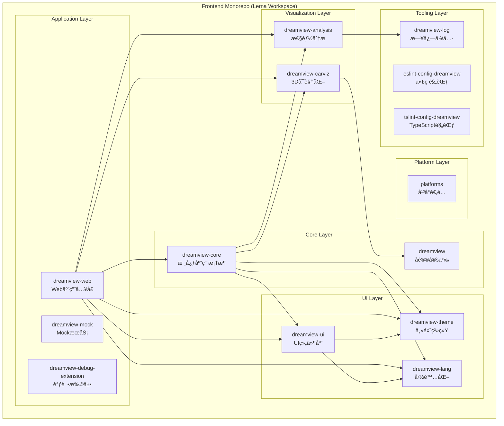

## 📦 **包ä¾èµ–关系图**

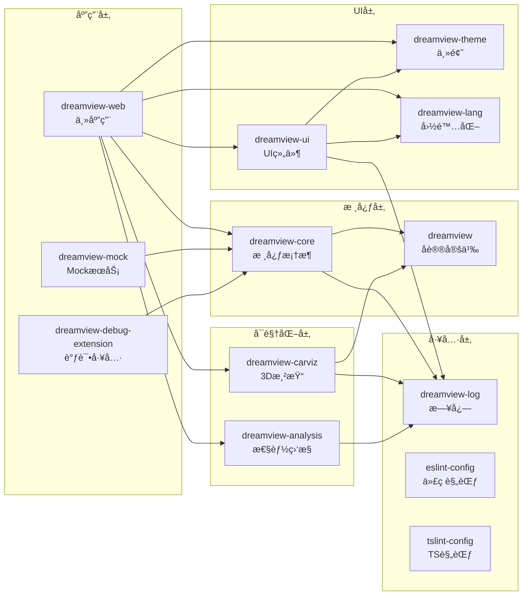

## �� **Coreæ¶æ„详细图**

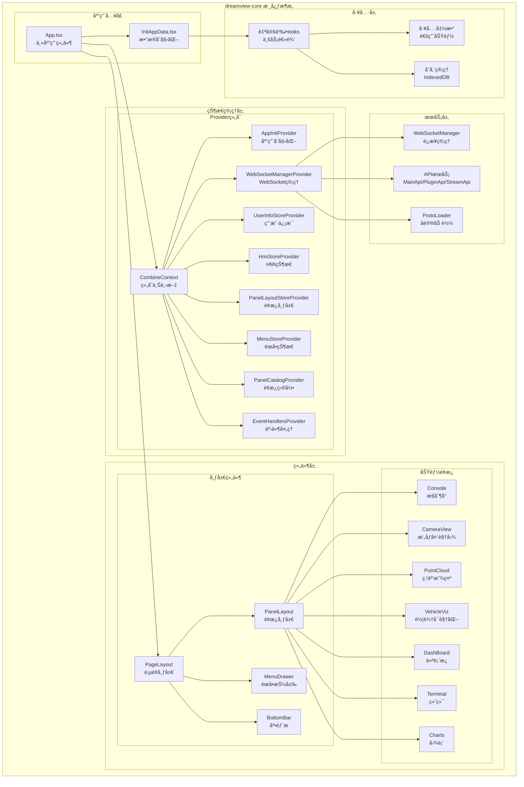

## 🔄 **æ•°æ®æµæ¶æ„图**

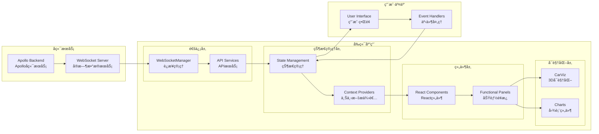

## 🨠**UI组件æ¶æ„图**

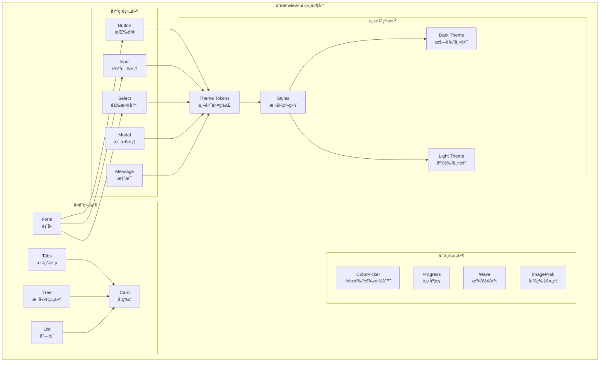

## 🌠**模å—è”邦æ¶æ„图**

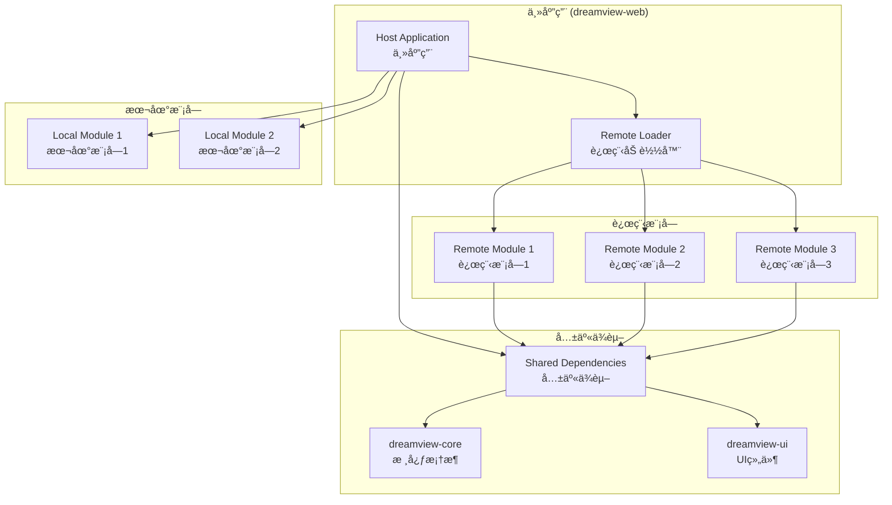

## �� **æ„建和部署æ¶æ„图**

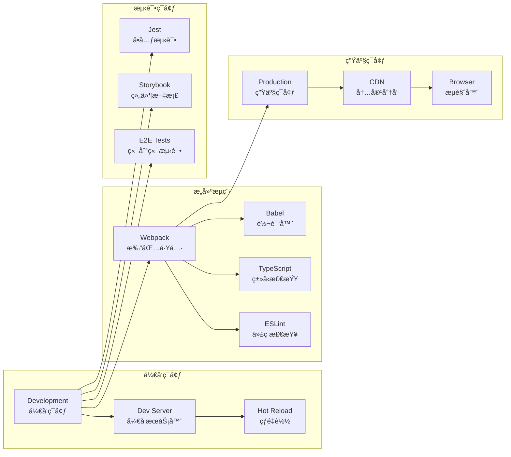

## 📊 **技术栈æ¶æ„图**

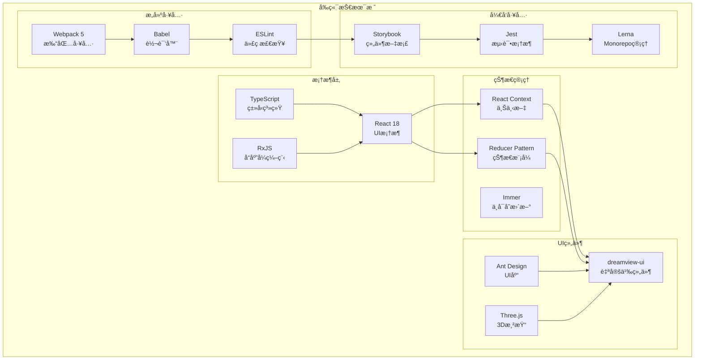

## 🯠**总结**

Dreamview Frontend采用了ç°ä»£åŒ–çš„å‰ç«¯æ¶æ„设计：

### **核心特点**：
1. **Monorepoæ¶æ„**：使用Lerna管ç†å¤šä¸ªåŒ…
2. **模å—化设计**：æ¯ä¸ªåŠŸèƒ½æ¨¡å—独立å°è£…
3. **组件化开å‘**：å¯å¤ç”¨çš„UI组件系统
4. **状æ€ç®¡ç†**：基äºContextçš„å“应å¼çŠ¶æ€ç®¡ç†
5. **ç±»å‹å®‰å…¨**：完整的TypeScript支æŒ
6. **性能优化**：懒加载ã€ä»£ç åˆ†å‰²ã€ç¼“存策略

### **æ¶æ„优势**：
- **å¯æ‰©å±•æ€§**：支æŒè¿œç¨‹æ¨¡å—å’Œæ’件系统
- **å¯ç»´æŠ¤æ€§**：清晰的模å—边界和ä¾èµ–关系
- **å¯å¤ç”¨æ€§**：组件和工具函数高度å¤ç”¨
- **å¼€å‘体验**：完善的开å‘工具和文档系统
- **性能表ç°**：优化的æ„建和è¿è¡Œæ—¶æ€§èƒ½

è¿™ç§æ¶æ„设计使得Dreamview能够处ç†å¤æ‚的自动驾驶å¯è§†åŒ–需求，åŒæ—¶ä¿æŒè‰¯å¥½çš„代ç ç»„织和开å‘效ç‡ã€‚

让我详细分æ为什么Dreamviewæ¶æ„中使用了Context Provider，以åŠè¿™ç§é€‰æ‹©çš„åŸå› å’Œä¼˜åŠ¿ã€‚

Read file: frontend/packages/dreamview-core/src/store/base/Factory.tsx
Read file: frontend/packages/dreamview-core/src/store/base/Store.ts
Read file: frontend/packages/dreamview-core/src/store/HmiStore/reducer.ts
Read file: frontend/packages/dreamview-core/src/store/HmiStore/actions.ts
ç°åœ¨è®©æˆ‘查看一些å®é™…使用Context的组件æ¥äº†è§£å…·ä½“应用场景：

Read file: frontend/packages/dreamview-core/src/components/panels/Console/index.tsx
基äºæˆ‘对Dreamviewæ¶æ„的深入分æ，ç°åœ¨æˆ‘æ¥è¯¦ç»†è§£é‡Šä¸ºä»€ä¹ˆä½¿ç”¨äº†Context Provider：

# 为什么Dreamviewæ¶æ„中使用Context Provider？

## �� **核心åŸå› åˆ†æ**

### **1. å¤æ‚的状æ€ç®¡ç†éœ€æ±‚**

Dreamview是一个å¤æ‚的自动驾驶å¯è§†åŒ–系统，需è¦ç®¡ç†å¤šç§çŠ¶æ€ï¼š

```typescript
// 需è¦ç®¡ç†çš„状æ€ç±»å‹
- WebSocketè¿æ¥çŠ¶æ€
- HMI模å¼çŠ¶æ€ï¼ˆPNCã€Perception等）
- é¢æ¿å¸ƒå±€çŠ¶æ€
- 用户é…置状æ€
- å®æ—¶æ•°æ®æµçŠ¶æ€
- 事件处ç†çŠ¶æ€
- 主题和国际化状æ€
```

### **2. é¿å…Props Drilling问题**

在传统的Props传递方å¼ä¸‹ï¼Œä¼šå‡ºç°æ·±å±‚嵌套的Props传递：

```tsx
// ä¼ ç»Ÿæ–¹å¼ - Props Drilling地狱
<App>
  <PageLayout>
    <PanelLayout>
      <Console>
        <ConsoleContent>
          <ConsoleItem>
            {/* 需è¦è®¿é—®WebSocket状æ€ã€HMI状æ€ã€ç”¨æˆ·çŠ¶æ€ç­‰ */}
          </ConsoleItem>
        </ConsoleContent>
      </Console>
    </PanelLayout>
  </PageLayout>
</App>
```

使用Context Providerå：

```tsx
// Contextæ–¹å¼ - ç›´æ¥è®¿é—®çŠ¶æ€
function ConsoleItem() {
  const [hmi] = useHmiStore();           // ç›´æ¥è·å–HMI状æ€
  const mainApi = useMainApi();          // ç›´æ¥è·å–WebSocket API
  const [user] = useUserInfoStore();     // ç›´æ¥è·å–用户信æ¯
  // 无需通过Props层层传递
}
```

## ğŸ—ï¸ **Context Providerçš„æ¶æ„优势**

### **1. 模å—化状æ€ç®¡ç†**

```typescript
// æ¯ä¸ªåŠŸèƒ½åŸŸæœ‰ç‹¬ç«‹çš„状æ€ç®¡ç†
const Providers = [
  <AppInitProvider />,           // 应用åˆå§‹åŒ–状æ€
  <WebSocketManagerProvider />,  // WebSocketè¿æ¥çŠ¶æ€
  <HmiStoreProvider />,          // HMI模å¼çŠ¶æ€
  <PanelLayoutStoreProvider />,  // é¢æ¿å¸ƒå±€çŠ¶æ€
  <UserInfoStoreProvider />,     // 用户信æ¯çŠ¶æ€
  <EventHandlersProvider />,     // 事件处ç†çŠ¶æ€
];
```

### **2. å“应å¼çŠ¶æ€æ›´æ–°**

```typescript
// 基äºRxJSçš„å“应å¼çŠ¶æ€ç®¡ç†
class Store<S, A> {
  private state: BehaviorSubject<S>;  // å“应å¼çŠ¶æ€æµ
  
  subscribe(listener: (state: S) => void) {
    return this.state.subscribe(listener);  // 订阅状æ€å˜åŒ–
  }
  
  dispatch = (action: A) => {
    const newState = this.reducer(this.getState(), action);
    this.state.next(newState);  // æ¨é€æ–°çŠ¶æ€
  };
}
```

### **3. 中间件支æŒ**

```typescript
// 支æŒå¼‚æ­¥æ“作和副作用处ç†
const middlewareExtra = [
  asyncActionMiddleware,    // 异步Action处ç†
  // crashReporterMiddleware,  // 错误报告
  // reduxDevToolsMiddleware,  // å¼€å‘工具
];

// 异步Action示例
export const changeMode = (
  mainApi: MainApi,
  payload: ChangeModePayload,
): AsyncAction => {
  return async (dispatch, state) => {
    await mainApi.changeSetupMode(payload);  // 异步API调用
    dispatch({ type: ACTIONS.CHANGE_MODE, payload });  // 状æ€æ›´æ–°
  };
};
```

## �� **æ•°æ®æµæ¶æ„**

### **1. å•å‘æ•°æ®æµ**


### **2. 状æ€ä¾èµ–关系**

```typescript
// 状æ€ä¹‹é—´çš„ä¾èµ–关系
function useGetCurrentLayout() {
  const [hmi] = usePickHmiStore();        // ä¾èµ–HMI状æ€
  const [store] = usePanelLayoutStore();  // ä¾èµ–布局状æ€
  
  // 当HMI模å¼å˜åŒ–时，自动è·å–对应的布局
  return store.layout[hmi.currentMode]?.layout;
}
```

## �� **å®é™…应用场景**

### **1. å®æ—¶æ•°æ®æµå¤„ç†**

```typescript
// Consoleé¢æ¿ä¸­çš„å®æ—¶æ•°æ®å¤„ç†
function InternalConsole() {
  const panelContext = usePanelContext();
  const { data: subcribedData, initSubscription } = panelContext;

  useEffect(() => {
    initSubscription({
      [StreamDataNames.SIM_WORLD]: {
        consumer: (simData) => {
          setData(simData);  // å®æ—¶æ›´æ–°æ•°æ®
        },
      },
    });
  }, []);
}
```

### **2. 跨组件状æ€å…±äº«**

```typescript
// 多个组件共享WebSocketè¿æ¥
function ComponentA() {
  const mainApi = useMainApi();  // 共享WebSocket API
  // 使用mainApiå‘é€æ•°æ®
}

function ComponentB() {
  const mainApi = useMainApi();  // åŒä¸€ä¸ªWebSocketå®ä¾‹
  // 使用mainApiæ¥æ”¶æ•°æ®
}
```

### **3. 主题和国际化**

```typescript
// 全局主题和语言设置
function App() {
  return (
    <ThemeProvider>           {/* 主题Context */}
      <DndProvider>           {/* 拖拽Context */}
        <CombineContext>      {/* 组åˆContext */}
          <PageLayout />      {/* 页é¢å¸ƒå±€ */}
        </CombineContext>
      </DndProvider>
    </ThemeProvider>
  );
}
```

## �� **性能优化策略**

### **1. 状æ€åˆ†ç¦»**

```typescript
// 将频ç¹å˜åŒ–的状æ€åˆ†ç¦»å‡ºæ¥
export function PickHmiStoreProvider() {
  const defaultKeys = Object.keys(initState).filter(
    (item) => !['currentRecordStatus', 'prevStatus'].includes(item),
  );  // 过滤æ‰é¢‘ç¹å˜åŒ–的状æ€
  
  // å‡å°‘ä¸å¿…è¦çš„é‡æ¸²æŸ“
}
```

### **2. 懒加载和代ç åˆ†å‰²**

```typescript
// é¢æ¿ç»„件的懒加载
const panelComponents = new Map(
  allPanel.map((panelInfo) => [
    panelInfo.type,
    React.lazy(panelInfo.module),  // 懒加载组件
  ]),
);
```

### **3. 记忆化优化**

```typescript
// 使用useMemo优化计算
const values = useMemo(() => ({
  hasInit,
  initStatus,
  registry,
  onChange,
}), [initStatus, hasInit]);
```

## �� **ä¸å…¶ä»–状æ€ç®¡ç†æ–¹æ¡ˆçš„对比**

| 方案                 | 优点                         | 缺点                   | 适用场景               |
| -------------------- | ---------------------------- | ---------------------- | ---------------------- |
| **Context Provider** | åŸç”Ÿæ”¯æŒã€ç±»å‹å®‰å…¨ã€ç»„åˆæ€§å¼º | 需è¦æ‰‹åŠ¨ä¼˜åŒ–性能       | 中å°å‹åº”用ã€æ¨¡å—化æ¶æ„ |
| Redux                | 生æ€ç³»ç»Ÿä¸°å¯Œã€å¼€å‘工具完善   | æ ·æ¿ä»£ç å¤šã€å­¦ä¹ æˆæœ¬é«˜ | 大å‹åº”用ã€å¤æ‚çŠ¶æ€     |
| Zustand              | è½»é‡çº§ã€APIç®€å•              | 生æ€ç³»ç»Ÿç›¸å¯¹è¾ƒå°       | 简å•çŠ¶æ€ç®¡ç†           |
| MobX                 | å“应å¼ã€è‡ªåŠ¨ä¼˜åŒ–             | 学习æˆæœ¬é«˜ã€è°ƒè¯•å›°éš¾   | å¤æ‚å“应å¼åº”用         |

## 🯠**为什么选择Context Provider？**

### **1. 技术栈一致性**
- ä¸React生æ€ç³»ç»Ÿå®Œç¾é›†æˆ
- ä¸TypeScriptç±»å‹ç³»ç»Ÿæ— ç¼é…åˆ
- ä¸RxJSå“应å¼ç¼–程模å¼åŒ¹é…

### **2. æ¶æ„çµæ´»æ€§**
- 支æŒæ¨¡å—化状æ€ç®¡ç†
- 支æŒç»„åˆå¼Provider设计
- 支æŒä¸­é—´ä»¶æ‰©å±•

### **3. å¼€å‘体验**
- ç±»å‹å®‰å…¨çš„API设计
- 清晰的ä¾èµ–关系
- 易äºè°ƒè¯•å’Œæµ‹è¯•

### **4. 性能考虑**
- 支æŒç»†ç²’度状æ€æ›´æ–°
- 支æŒçŠ¶æ€åˆ†ç¦»ä¼˜åŒ–
- 支æŒæ‡’加载和代ç åˆ†å‰²

## 🔧 **å®é™…å®ç°æ•ˆæœ**

```typescript
// 简æ´çš„状æ€è®¿é—®
function MyComponent() {
  const [hmi, dispatch] = useHmiStore();
  const mainApi = useMainApi();
  const [user] = useUserInfoStore();
  
  // ç›´æ¥ä½¿ç”¨çŠ¶æ€ï¼Œæ— éœ€Props传递
  const handleModeChange = () => {
    dispatch(changeMode(mainApi, { mode: 'PNC' }));
  };
  
  return (
    <div>
      <p>当å‰æ¨¡å¼: {hmi.currentMode}</p>
      <p>用户å: {user.name}</p>
      <button onClick={handleModeChange}>切æ¢æ¨¡å¼</button>
    </div>
  );
}
```

## 📈 **总结**

Dreamview选择Context Provider作为状æ€ç®¡ç†æ–¹æ¡ˆçš„åŸå› ï¼š

1. **å¤æ‚状æ€éœ€æ±‚**：需è¦ç®¡ç†å¤šç§ç±»å‹çš„状æ€å’Œå®ƒä»¬ä¹‹é—´çš„ä¾èµ–关系
2. **模å—化æ¶æ„**：支æŒæŒ‰åŠŸèƒ½åŸŸåˆ†ç¦»çŠ¶æ€ç®¡ç†
3. **å“应å¼è®¾è®¡**：ä¸RxJSé…åˆå®ç°å“应å¼æ•°æ®æµ
4. **ç±»å‹å®‰å…¨**：完整的TypeScript支æŒ
5. **性能优化**：支æŒç»†ç²’度更新和状æ€åˆ†ç¦»
6. **å¼€å‘体验**：清晰的API设计和易äºè°ƒè¯•

è¿™ç§è®¾è®¡ä½¿å¾—Dreamview能够处ç†å¤æ‚的自动驾驶å¯è§†åŒ–需求，åŒæ—¶ä¿æŒè‰¯å¥½çš„代ç ç»„织和性能表ç°ã€‚Context Provider为Dreamviewæ供了一个çµæ´»ã€é«˜æ•ˆã€å¯ç»´æŠ¤çš„状æ€ç®¡ç†è§£å†³æ–¹æ¡ˆã€‚

让我详细分æContext Provider在Dreamview中是如何åšçŠ¶æ€ç®¡ç†çš„，以åŠå®ƒä¸RxJS的关系。

Read file: frontend/packages/dreamview-core/src/store/base/Store.ts
Read file: frontend/packages/dreamview-core/src/store/base/Factory.tsx
Read file: frontend/packages/dreamview-core/src/store/base/Middleware.ts
Read file: frontend/packages/dreamview-core/src/services/WebSocketManager/index.ts
Read file: frontend/packages/dreamview-core/src/services/WebSocketManager/websocket-manager.service.ts
ç°åœ¨è®©æˆ‘查看一些å®é™…使用状æ€ç®¡ç†çš„组件：

Read file: frontend/packages/dreamview-core/src/components/panels/VehicleViz/index.tsx
基äºæˆ‘对Dreamview状æ€ç®¡ç†ç³»ç»Ÿçš„深入分æ，ç°åœ¨æˆ‘æ¥æ€»ç»“Context Provider是如何åšçŠ¶æ€ç®¡ç†çš„，以åŠå®ƒä¸RxJS的关系：

# Context Provider状æ€ç®¡ç†æœºåˆ¶ä¸RxJS关系总结

## ğŸ—ï¸ **Context Provider状æ€ç®¡ç†æ¶æ„**

### **1. 核心æ¶æ„层次**

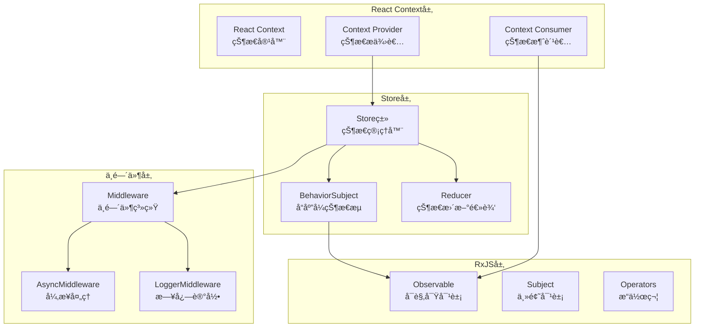

### **2. 状æ€ç®¡ç†æµç¨‹**

```typescript
// 1. Store创建 - 基äºRxJS BehaviorSubject
class Store<S, A> {
    private state: BehaviorSubject<S>;  // RxJSå“应å¼çŠ¶æ€æµ
    
    constructor(initialState: S, reducer: (state: S, action: A) => S) {
        this.state = new BehaviorSubject(initialState);  // 创建å“应å¼çŠ¶æ€
        this.reducer = reducer;
    }
    
    // 2. 状æ€æ›´æ–° - 通过RxJS Subjectæ¨é€
    private baseDispatch(action: A) {
        const newState = this.reducer(this.getState(), action);
        this.state.next(newState);  // RxJSæ¨é€æ–°çŠ¶æ€
    }
    
    // 3. 状æ€è®¢é˜… - RxJS Observable订阅
    subscribe(listener: (state: S) => void) {
        return this.state.subscribe(listener);  // RxJS订阅状æ€å˜åŒ–
    }
}
```

## �� **Context Providerä¸RxJS的集æˆæœºåˆ¶**

### **1. 状æ€æµè½¬æ¢**

```typescript
// Factory.tsx - Context Provider创建
function useStore(): [InitialStateType, (action: ActionType) => void] {
    const store = useContext(StoreContext);
    const [state, setState] = useState(store.getState());

    useEffect(() => {
        // RxJS订阅转æ¢ä¸ºReact状æ€æ›´æ–°
        const subscription = store.subscribe(setState);
        return () => subscription.unsubscribe();
    }, [store]);

    return [state, store.dispatch];
}
```

### **2. å“应å¼æ•°æ®æµ**

```typescript
// WebSocketManager - RxJSæ•°æ®æµå¤„ç†
export class WebSocketManager {
    // RxJS Subject用äºå…ƒæ•°æ®æµ
    private metadataSubject: BehaviorSubject<MetadataItem[]> = new BehaviorSubject<MetadataItem[]>([]);
    
    // RxJS Observable用äºæ•°æ®è®¢é˜…
    get metadata$(): Observable<MetadataItem[]> {
        return this.metadataSubject.asObservable();
    }
    
    // æ•°æ®æµå¤„ç†
    handleMessage(msg: HandleMessageType, socketName: SocketNameEnum) {
        // 使用RxJSæ“作符处ç†æ•°æ®æµ
        this.metadataSubject.next(updatedMetadata);
    }
}
```

## 🯠**状æ€ç®¡ç†æ ¸å¿ƒæœºåˆ¶**

### **1. 状æ€åˆå§‹åŒ–**

```typescript
// 状æ€åˆå§‹åŒ–æµç¨‹
const store = useMemo(() => {
    let initState = props.initialState || initialState;
    if (iPersistor && 'loadSync' in iPersistor) {
        initState = iPersistor.loadSync() || initState;  // æŒä¹…化æ¢å¤
    }
    return new Store(initState, props.reducer || reducer);  // 创建Store
}, []);
```

### **2. 状æ€æ›´æ–°æœºåˆ¶**

```typescript
// Action分å‘æµç¨‹
dispatch = (action: A) => {
    // 中间件链处ç†
    const dispatchChain = this.middleware
        .reverse()
        .reduce((next, middleware) => 
            (action) => middleware(this, next, action), 
            this.baseDispatch.bind(this)
        );
    dispatchChain(action);
};

// 异步Action处ç†
export const changeMode = (
    mainApi: MainApi,
    payload: ChangeModePayload,
): AsyncAction => {
    return async (dispatch, state) => {
        await mainApi.changeSetupMode(payload);  // 异步API调用
        dispatch({ type: ACTIONS.CHANGE_MODE, payload });  // åŒæ­¥çŠ¶æ€æ›´æ–°
    };
};
```

### **3. 状æ€è®¢é˜…机制**

```typescript
// 组件中的状æ€è®¢é˜…
function MyComponent() {
    const [hmi, dispatch] = useHmiStore();  // 订阅HMI状æ€
    const mainApi = useMainApi();           // 订阅WebSocket API
    
    // 状æ€å˜åŒ–自动触å‘组件é‡æ¸²æŸ“
    useEffect(() => {
        console.log('HMI状æ€å˜åŒ–:', hmi.currentMode);
    }, [hmi.currentMode]);
}
```

## 🔗 **RxJS在状æ€ç®¡ç†ä¸­çš„作用**

### **1. å“应å¼çŠ¶æ€æµ**

```typescript
// BehaviorSubject作为状æ€å®¹å™¨
private state: BehaviorSubject<S>;

// 状æ€å˜åŒ–自动通知所有订阅者
this.state.next(newState);  // æ¨é€æ–°çŠ¶æ€
this.state.subscribe(listener);  // 订阅状æ€å˜åŒ–
```

### **2. æ•°æ®æµå¤„ç†**

```typescript
// WebSocketæ•°æ®æµå¤„ç†
private dataSubjects: MultiKeyMap<{ name: string; channel?: string }, CountedSubject<any>> = new MultiKeyMap();

// æ•°æ®æµè®¢é˜…
public subscribeToData<T>(name: string): CountedSubject<T> {
    const subject = new CountedSubject<T>();
    this.dataSubjects.set({ name }, subject);
    return subject;
}
```

### **3. 异步æ“作处ç†**

```typescript
// RxJSæ“作符处ç†å¼‚æ­¥æµ
connectMain(retries = 3, retryInterval = 1000) {
    return from(this.mainConnection.connect()).pipe(
        tap(status => this.handleConnectionStatus(status)),
        finalize(() => this.cleanup())
    );
}
```

## �� **状æ€ç®¡ç†æ•°æ®æµå›¾**

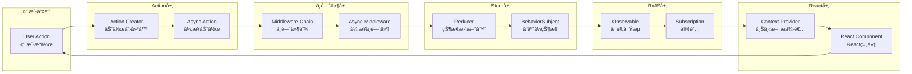

## �� **å®é™…应用示例**

### **1. 状æ€è®¢é˜…和更新**

```typescript
// VehicleViz组件中的状æ€ç®¡ç†
function Viz() {
    const [hmi] = usePickHmiStore();  // 订阅HMI状æ€
    const { mainApi, streamApi } = useWebSocketServices();  // 订阅WebSocketæœåŠ¡
    
    // 状æ€å˜åŒ–自动触å‘é‡æ–°æ¸²æŸ“
    useEffect(() => {
        if (hmi.currentMode === 'PNC') {
            // 模å¼å˜åŒ–时的处ç†é€»è¾‘
            updatePointcloudChannel(channel, 'pointCloud');
        }
    }, [hmi.currentMode]);
}
```

### **2. 异步状æ€æ›´æ–°**

```typescript
// 异步Action处ç†
export const changeMode = (
    mainApi: MainApi,
    payload: ChangeModePayload,
): AsyncAction => {
    return async (dispatch, state) => {
        // 1. 异步API调用
        await mainApi.changeSetupMode(payload);
        
        // 2. åŒæ­¥çŠ¶æ€æ›´æ–°
        dispatch({
            type: ACTIONS.CHANGE_MODE,
            payload,
        });
        
        // 3. RxJS自动通知所有订阅者
        // 4. React组件自动é‡æ–°æ¸²æŸ“
    };
};
```

### **3. å®æ—¶æ•°æ®æµå¤„ç†**

```typescript
// WebSocketå®æ—¶æ•°æ®æµ
public subscribeToData<T>(name: string): CountedSubject<T> {
    const subject = new CountedSubject<T>();
    
    // RxJS Subject处ç†æ•°æ®æµ
    this.dataSubjects.set({ name }, subject);
    
    // æ•°æ®åˆ°è¾¾æ—¶è‡ªåŠ¨æ¨é€ç»™æ‰€æœ‰è®¢é˜…者
    this.handleMessage(msg, socketName).then(data => {
        subject.next(data);  // RxJSæ¨é€æ•°æ®
    });
    
    return subject;
}
```

## �� **Context Providerä¸RxJS的关系总结**

### **1. èŒè´£åˆ†å·¥**

| 技术                 | èŒè´£       | 作用                        |
| -------------------- | ---------- | --------------------------- |
| **Context Provider** | 状æ€å®¹å™¨   | æä¾›React组件访问状æ€çš„æ¥å£ |
| **RxJS**             | å“应å¼å¼•æ“ | 处ç†çŠ¶æ€å˜åŒ–和数æ®æµ        |
| **Store**            | 状æ€ç®¡ç†å™¨ | åè°ƒContextå’ŒRxJSçš„æ¡¥æ¢     |

### **2. å作机制**

```typescript
// å作æµç¨‹
1. Context Provider æ供状æ€è®¿é—®æ¥å£
2. Store 使用RxJS BehaviorSubject管ç†çŠ¶æ€
3. RxJS 处ç†çŠ¶æ€å˜åŒ–和数æ®æµ
4. React 通过Context订阅状æ€å˜åŒ–
5. 组件 自动å“应状æ€æ›´æ–°
```

### **3. 优势组åˆ**

- **Context Provider**: æä¾›React生æ€ç³»ç»Ÿçš„集æˆ
- **RxJS**: æ供强大的å“应å¼ç¼–程能力
- **组åˆæ•ˆæœ**: æ—¢ä¿æŒäº†React的简æ´æ€§ï¼Œåˆè·å¾—了RxJS的强大功能

## �� **总结**

Dreamviewçš„Context Provider状æ€ç®¡ç†æœºåˆ¶æ˜¯ä¸€ä¸ª**React Context + RxJS**çš„æ··åˆæ¶æ„：

1. **Context Provider**作为状æ€å®¹å™¨ï¼Œæä¾›React组件访问状æ€çš„æ¥å£
2. **RxJS**作为å“应å¼å¼•æ“，处ç†çŠ¶æ€å˜åŒ–和数æ®æµ
3. **Store**作为å调器，将RxJSçš„å“应å¼èƒ½åŠ›ä¸React的组件系统结åˆ
4. **中间件系统**æ供异步æ“作和副作用处ç†èƒ½åŠ›

è¿™ç§æ¶æ„设计使得Dreamview能够：
- 处ç†å¤æ‚的异步状æ€æ›´æ–°
- 管ç†å®æ—¶æ•°æ®æµ
- æ供类å‹å®‰å…¨çš„状æ€è®¿é—®
- å®ç°é«˜æ€§èƒ½çš„状æ€è®¢é˜…和更新
- ä¿æŒä»£ç çš„å¯ç»´æŠ¤æ€§å’Œå¯æ‰©å±•æ€§

Context Providerå’ŒRxJS的结åˆä¸ºDreamviewæ供了一个强大而çµæ´»çš„状æ€ç®¡ç†è§£å†³æ–¹æ¡ˆï¼Œå®Œç¾é€‚应了自动驾驶å¯è§†åŒ–系统的å¤æ‚需求。

让我详细解ædreamview-carviz包的文件结æ„和功能。

Ran tool
Read file: frontend/packages/dreamview-carviz/package.json
Read file: frontend/packages/dreamview-carviz/README.md
Ran tool
Read file: frontend/packages/dreamview-carviz/src/index.ts
Read file: frontend/packages/dreamview-carviz/src/Carviz.class.ts
Ran tool
Read file: frontend/packages/dreamview-carviz/src/render/adc.ts
Ran tool
Read file: frontend/packages/dreamview-carviz/src/render/map/index.ts
Ran tool
Read file: frontend/packages/dreamview-carviz/src/event/MouseInteractionEvent.ts
Ran tool
Read file: frontend/packages/dreamview-carviz/src/EventBus/base.ts
Ran tool
Ran tool
Read file: frontend/packages/dreamview-carviz/src/components/EditingAnchorMarker/index.ts
Ran tool
Read file: frontend/packages/dreamview-carviz/src/utils/common.ts
Ran tool
Read file: frontend/packages/dreamview-carviz/src/constant/common.ts
Ran tool
Ran tool
Ran tool
Ran tool
基äºæˆ‘对dreamview-carviz包的详细分æ，ç°åœ¨æˆ‘æ¥ä¸ºæ‚¨å…¨é¢è§£æ这个3Då¯è§†åŒ–框æ¶ï¼š

# Dreamview-Carviz 3Då¯è§†åŒ–框æ¶è§£æ

## 🯠**包基本信æ¯**

- **å称**: `@dreamview/dreamview-carviz`
- **版本**: 1.1.4
- **æè¿°**: Dreamview 3Då¯è§†åŒ–框æ¶
- **技术栈**: Three.js + TypeScript + React
- **主è¦åŠŸèƒ½**: 自动驾驶场景的3Då¯è§†åŒ–渲染

## ğŸ—ï¸ **整体æ¶æ„**

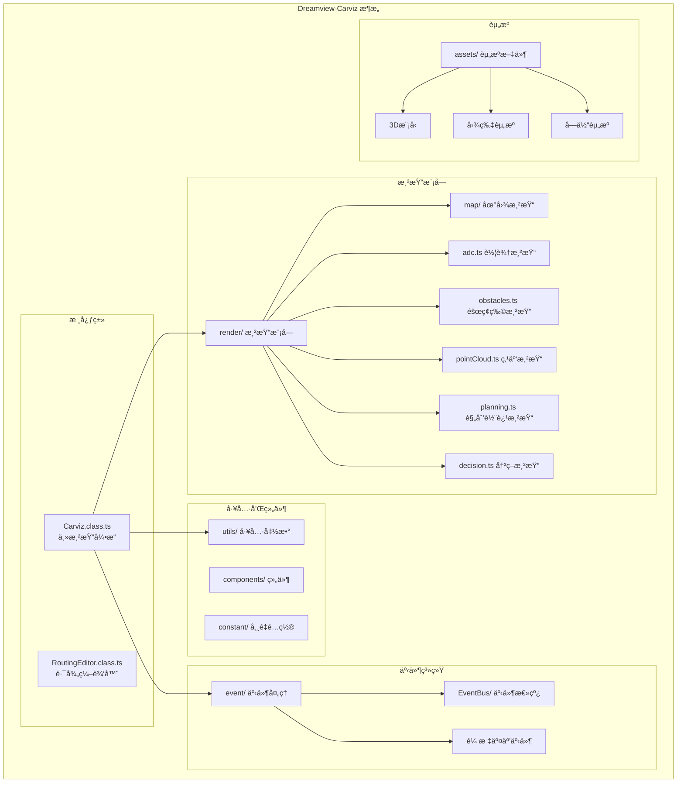

## �� **核心类分æ**

### **1. Carviz.class.ts - 主渲染引æ“**

```typescript
export class Carviz {
    // Three.js核心对象
    public scene: THREE.Scene;           // 3D场景
    public renderer: THREE.WebGLRenderer; // WebGL渲染器
    public camera: THREE.PerspectiveCamera; // 相机
    public controls: OrbitControls;      // 轨é“æ§åˆ¶å™¨
    
    // 渲染模å—
    public map: Map;                     // 地图渲染
    public adc: Adc;                     // 车辆渲染
    public obstacles: Obstacles;         // éšœç¢ç‰©æ¸²æŸ“
    public pointCloud: PointCloud;       // 点云渲染
    public planning: Planning;           // 规划轨迹渲染
    public decision: Decision;           // 决策渲染
    
    // 事件系统
    public raycaster: THREE.Raycaster;   // 射线检测器
    
    // 主è¦æ–¹æ³•
    init(): void;                        // åˆå§‹åŒ–
    render(): void;                      // 渲染循ç¯
    updateData(datas): void;             // æ›´æ–°æ•°æ®
    removeAll(): void;                   // 清除所有对象
}
```

### **2. RoutingEditor.class.ts - 路径编辑器**

```typescript
export class RoutingEditor {
    // 路径编辑功能
    // 支æŒè·¯å¾„点添加ã€åˆ é™¤ã€ä¿®æ”¹
    // 支æŒè·¯å¾„预览和编辑
}
```

## �� **渲染模å—详解**

### **1. 地图渲染 (render/map/)**

```typescript
// 地图组件渲染
class Map {
    public trafficSignal: TrafficSignal;    // 交通信å·ç¯
    public stopSign: StopSign;              // åœè½¦æ ‡å¿—
    public yieldSignal: YieldSignal;        // 让行标志
    public lane: Lane;                      // 车é“线
    public junction: Junction;              // è·¯å£
    public crosswalk: Crosswalk;            // 人行横é“
    public parkingSpace: ParkingSpace;      // åœè½¦ä½
    public barrierGate: BarrierGate;        // é“é—¸
    
    public update(mapData): void;           // 更新地图数æ®
    public dispose(): void;                 // 清除地图对象
}
```

**支æŒçš„地图元素**：
- **车é“线** (Lane)
- **è·¯å£** (Junction/PncJunction)
- **交通信å·** (TrafficSignal/StopSign/YieldSignal)
- **人行横é“** (Crosswalk)
- **åœè½¦ä½** (ParkingSpace)
- **é“é—¸** (BarrierGate)
- **网格** (Grid)

### **2. 车辆渲染 (render/adc.ts)**

```typescript
export default class Adc {
    public adc: THREE.Object3D;              // 主车辆模å‹
    public shadowAdc: THREE.Object3D;        // 阴影车辆
    public planningAdc: THREE.Object3D;      // 规划车辆
    
    // 车辆å‚æ•°
    public vehicleParam = {
        frontEdgeToCenter: 3.89,            // å‰è¾¹ç¼˜åˆ°ä¸­å¿ƒè·ç¦»
        backEdgeToCenter: 1.043,            // å边缘到中心è·ç¦»
        leftEdgeToCenter: 1.055,            // 左边缘到中心è·ç¦»
        rightEdgeToCenter: 1.055,           // å³è¾¹ç¼˜åˆ°ä¸­å¿ƒè·ç¦»
        height: 1.48,                       // 高度
        width: 2.11,                        // 宽度
        length: 4.933,                      // 长度
        steerRatio: 16,                     // 转å‘比
        wheelBase: 2.8448,                  // è½´è·
    };
    
    public update(pos, name): void;         // 更新车辆ä½ç½®
    public updateVehicleParam(params): void; // 更新车辆å‚æ•°
}
```

### **3. éšœç¢ç‰©æ¸²æŸ“ (render/obstacles.ts)**

```typescript
// éšœç¢ç‰©ç±»å‹æ”¯æŒ
const obstacleTypes = {
    PEDESTRIAN: '行人',
    BICYCLE: '自行车',
    VEHICLE: '车辆',
    VIRTUAL: '虚拟障ç¢ç‰©',
    CIPV: '最近å‰è½¦',
    TRAFFICCONE: '交通锥',
    UNKNOWN: '未知障ç¢ç‰©'
};

// 颜色映射
const obstacleColorMapping = {
    PEDESTRIAN: 0xffea00,      // 黄色
    BICYCLE: 0x00dceb,         // é’色
    VEHICLE: 0x00ff3c,         // 绿色
    VIRTUAL: 0x800000,         // 深红色
    CIPV: 0xff9966,            // 橙色
    DEFAULT: 0xff00fc,         // 紫色
    TRAFFICCONE: 0xe1601c,     // 棕色
    UNKNOWN: 0xa020f0,         // 紫色
};
```

### **4. 点云渲染 (render/pointCloud.ts)**

```typescript
// 点云高度颜色映射
const pointCloudHeightColorMapping = {
    0.5: { r: 255, g: 0, b: 0 },      // 红色 - ä½é«˜åº¦
    1.0: { r: 255, g: 127, b: 0 },    // 橙色
    1.5: { r: 255, g: 255, b: 0 },    // 黄色
    2.0: { r: 0, g: 255, b: 0 },      // 绿色
    2.5: { r: 0, g: 0, b: 255 },      // è“色
    3.0: { r: 75, g: 0, b: 130 },     // 紫色 - 高高度
};
```

### **5. 规划轨迹渲染 (render/planning.ts)**

```typescript
// 规划轨迹类å‹
const planningTypes = {
    PATH: '路径',
    SPEED: '速度',
    ST_GRAPH: '时空图',
    NAVIGATION_PATH: '导航路径'
};

// 轨迹颜色
const planningColors = {
    PATH: 0x00ff00,            // 绿色路径
    SPEED: 0xff0000,           // 红色速度
    ST_GRAPH: 0x0000ff,        // è“色时空图
    NAVIGATION_PATH: 0xffff00  // 黄色导航路径
};
```

### **6. 决策渲染 (render/decision.ts)**

```typescript
// 决策类å‹å›¾æ ‡
const decisionIcons = {
    mainStop: '主车åœè½¦',
    objectStop: '目标åœè½¦',
    objectFollow: '目标跟éš',
    objectYield: '目标让行',
    objectOvertake: '目标超车',
    pedestrian: '行人',
    obstacle: 'éšœç¢ç‰©',
    signal: 'ä¿¡å·ç¯',
    stopSign: 'åœè½¦æ ‡å¿—',
    yieldSign: '让行标志'
};
```

## �� **事件系统**

### **1. 事件总线 (EventBus/)**

```typescript
class EventBus<T extends EventMap> {
    private events: EventBusEvents = {};
    
    // 事件监å¬
    public on<K extends keyof T>(
        eventType: K,
        callback: FunctionType<any, any>,
        options?: EventListenerOptions<T[K]>
    ): void;
    
    // 事件触å‘
    public async emit<K extends keyof T>(
        eventType: K,
        payload?: T[K]
    ): Promise<void>;
    
    // 事件移除
    public off<K extends keyof T>(
        eventType: K,
        callback: FunctionType<any, any>
    ): void;
}
```

### **2. 鼠标交互事件 (event/)**

```typescript
// 鼠标交互类å‹
type InteractionType = 'click' | 'drag' | 'doubleClick';

// 鼠标事件å›è°ƒ
interface ICallbacks {
    handleMouseMove?: (event: MouseEvent, mouseDownInfo: IMouseDownInfo) => void;
    handleMouseDown?: (event: MouseEvent) => void;
    handleMouseUp: (event: MouseEvent, interaction: InteractionType) => void;
    handleMouseEnter?: (event: MouseEvent) => void;
    handleMouseLeave?: (event: MouseEvent) => void;
}

class MouseInteractionEvent implements BaseEvent {
    // 支æŒç‚¹å‡»ã€æ‹–拽ã€åŒå‡»ç­‰äº¤äº’
    // 防抖处ç†ï¼Œé¿å…轻微鼠标抖动
    // åŒå‡»æ£€æµ‹ï¼Œæ”¯æŒåŒå‡»äº‹ä»¶
}
```

## ğŸ› ï¸ **工具函数 (utils/)**

### **1. 通用工具 (common.ts)**

```typescript
// 几何图形绘制
export const drawCircle = (radius, material, segments = 32) => THREE.Mesh;
export const drawArrow = (color, length, conelength, conewidth) => THREE.Object3D;
export const drawBox = (x, y, z, color) => THREE.BoxHelper;
export const drawSolidBox = (x, y, z, color) => THREE.Mesh;

// 线æ¡ç»˜åˆ¶
export const drawThickBandFromPoints = (points, thickAttr) => THREE.Object3D;
export const drawSegmentsFromPoints = (points, attr) => THREE.Object3D;

// 对象管ç†
export const disposeMesh = (mesh) => void;  // 释放网格资æº
export const disposeGroup = (group) => void; // 释放组资æº
```

### **2. åæ ‡è½¬æ¢ (transScreenPositionToWorld.ts)**

```typescript
// å±å¹•å标转世界åæ ‡
export default function transScreenPositionToWorld(
    mouseX: number,
    mouseY: number,
    camera: THREE.Camera,
    renderer: THREE.WebGLRenderer
): THREE.Vector3;
```

### **3. å¯¹è±¡æ± ç®¡ç† (ThreeObjectPool.ts)**

```typescript
// Three.js对象池，æ高性能
class ThreeObjectPool {
    private pool: Map<string, THREE.Object3D[]> = new Map();
    
    get(type: string): THREE.Object3D;     // è·å–对象
    release(obj: THREE.Object3D): void;    // 释放对象
    clear(): void;                         // 清空池
}
```

## �� **常é‡é…ç½® (constant/)**

### **1. 颜色映射 (common.ts)**

```typescript
export const colorMapping = {
    YELLOW: 0xdaa520,      // 黄色
    WHITE: 0xcccccc,       // 白色
    CORAL: 0xff7f50,       // çŠç‘šè‰²
    RED: 0xff6666,         // 红色
    GREEN: 0x006400,       // 绿色
    BLUE: 0x30a5ff,        // è“色
    PURE_WHITE: 0xffffff,  // 纯白色
    DEFAULT: 0xc0c0c0,     // 默认ç°è‰²
};

// Zè½´å移é…ç½®
export const zOffset = {
    lane: 0.04,           // 车é“线
    crosswalk: 0.04,      // 人行横é“
    junction: 0.04,       // è·¯å£
    routing: 0.6,         // 路径
    prediction: 0.04,     // 预测
};
```

### **2. å‚æ•°é…ç½® (params.ts)**

```typescript
// 相机å‚æ•°
export const cameraParams = {
    fov: 60,              // 视é‡è§’度
    near: 0.1,            // è¿‘è£å‰ªé¢
    far: 1000,            // è¿œè£å‰ªé¢
    position: [0, 0, 50], // 相机ä½ç½®
    lookAt: [0, 0, 0],    // 相机æœå‘
};

// 渲染å‚æ•°
export const renderParams = {
    antialias: true,      // 抗锯齿
    alpha: true,          // é€æ˜èƒŒæ™¯
    shadowMap: true,      // 阴影映射
};
```

## 📦 **资æºæ–‡ä»¶ (assets/)**

### **1. 3Dæ¨¡å‹ (models/)**

- **car.obj/mtl** - 车辆模å‹
- **traffic_light.obj/mtl** - 交通信å·ç¯æ¨¡å‹
- **stop_sign.obj/mtl** - åœè½¦æ ‡å¿—模å‹
- **yield_sign.obj/mtl** - 让行标志模å‹
- **barrier_gate.obj/mtl** - é“闸模å‹

### **2. å›¾ç‰‡èµ„æº (images/)**

- **decision/** - 决策图标
  - main-stop.png - 主车åœè½¦
  - object-follow.png - 目标跟éš
  - pedestrian.png - 行人
  - signal.png - ä¿¡å·ç¯
  - 等等...

- **routing_editing/** - 路径编辑图标
  - IcAnchorMarker.png - 锚点标记
  - IcWaypointMarker.png - 路径点标记
  - IcClose.png - 关闭按钮

## �� **使用示例**

### **1. 基本使用**

```typescript
import { Carviz } from '@dreamview/dreamview-carviz';

// 创建Carvizå®ä¾‹
const carviz = new Carviz('canvas-id', {
    bgColor: '#0f1014',
    gridColor: '#1a1a1a'
});

// åˆå§‹åŒ–
carviz.init();

// æ›´æ–°æ•°æ®
carviz.updateData({
    map: mapData,
    adc: vehicleData,
    obstacles: obstacleData,
    pointCloud: pointCloudData,
    planning: planningData,
    decision: decisionData
});

// 渲染循ç¯
function animate() {
    carviz.render();
    requestAnimationFrame(animate);
}
animate();
```

### **2. 事件监å¬**

```typescript
// 监å¬é¼ æ ‡äº‹ä»¶
carviz.on('click', (data, event) => {
    console.log('点击ä½ç½®:', data.position);
});

// 监å¬æ•°æ®æ›´æ–°
carviz.on('dataUpdate', (data) => {
    console.log('æ•°æ®æ›´æ–°:', data);
});
```

## �� **核心特性**

### **1. 高性能渲染**
- **对象池管ç†**: å¤ç”¨Three.js对象，å‡å°‘GCå‹åŠ›
- **LOD优化**: æ ¹æ®è·ç¦»åŠ¨æ€è°ƒæ•´ç»†èŠ‚级别
- **视锥剔除**: åªæ¸²æŸ“å¯è§åŒºåŸŸçš„对象
- **批é‡æ¸²æŸ“**: åˆå¹¶ç›¸åŒæ质的对象

### **2. 丰富的交互**
- **鼠标交互**: 点击ã€æ‹–拽ã€åŒå‡»ã€æ‚¬åœ
- **键盘æ§åˆ¶**: 相机æ§åˆ¶ã€åŠŸèƒ½å¿«æ·é”®
- **触摸支æŒ**: 移动设备触摸交互
- **事件系统**: 完整的事件总线机制

### **3. 模å—化设计**
- **渲染模å—**: 独立的渲染组件
- **事件系统**: 解耦的事件处ç†
- **工具函数**: å¯å¤ç”¨çš„工具库
- **é…置系统**: çµæ´»çš„é…置管ç†

### **4. ç±»å‹å®‰å…¨**
- **TypeScript**: 完整的类å‹å®šä¹‰
- **æ¥å£è§„范**: 清晰的APIæ¥å£
- **错误处ç†**: 完善的错误机制

## 📈 **总结**

Dreamview-Carviz是一个功能完整ã€æ€§èƒ½ä¼˜ç§€çš„3Då¯è§†åŒ–框æ¶ï¼Œä¸“门为自动驾驶场景设计：

1. **核心功能**: 支æŒè½¦è¾†ã€åœ°å›¾ã€éšœç¢ç‰©ã€ç‚¹äº‘ã€è§„划轨迹ã€å†³ç­–等全方ä½æ¸²æŸ“
2. **技术æ¶æ„**: 基äºThree.js，采用模å—化设计，支æŒäº‹ä»¶é©±åŠ¨
3. **性能优化**: 对象池ã€LODã€è§†é”¥å‰”除等多ç§ä¼˜åŒ–ç­–ç•¥
4. **交互体验**: 丰富的鼠标和键盘交互，支æŒè§¦æ‘¸æ“作
5. **扩展性**: æ’件化æ¶æ„，易äºæ‰©å±•æ–°åŠŸèƒ½
6. **å¼€å‘体验**: TypeScript支æŒï¼Œå®Œæ•´çš„ç±»å‹å®šä¹‰å’Œæ–‡æ¡£

这个框æ¶ä¸ºDreamviewæ供了强大的3Då¯è§†åŒ–能力，是自动驾驶å¯è§†åŒ–系统的核心组件。

让我详细分æDreamview-Carviz中使用的对象池ã€LODã€è§†é”¥å‰”除等多ç§ä¼˜åŒ–策略。

Read file: frontend/packages/dreamview-carviz/src/utils/ThreeObjectPool.ts
Read file: frontend/packages/dreamview-carviz/src/utils/ScaleManager.ts
Read file: frontend/packages/dreamview-carviz/src/Carviz.class.ts
Read file: frontend/packages/dreamview-carviz/src/render/obstacles.ts
Read file: frontend/packages/dreamview-carviz/src/render/obstacles.ts
Read file: frontend/packages/dreamview-carviz/src/render/pointCloud.ts
Read file: frontend/packages/dreamview-carviz/src/utils/common.ts
基äºæˆ‘对Dreamview-Carviz代ç çš„深入分æ，ç°åœ¨æˆ‘æ¥è¯¦ç»†ä»‹ç»å…¶ä¸­ä½¿ç”¨çš„多ç§æ€§èƒ½ä¼˜åŒ–策略：

# Dreamview-Carviz 性能优化策略详解

## 🯠**1. 对象池 (Object Pool) 优化**

### **核心å®ç°**

```typescript
export default class ThreeObjectPool<T extends THREE.Object3D> {
    private pool: T[] = [];                    // 对象池存储
    private readonly syncFactory?: SyncFactory<T>;   // åŒæ­¥å·¥å‚函数
    private readonly asyncFactory?: AsyncFactory<T>; // 异步工å‚函数
    private readonly maxSize: number;          // 最大池大å°
    private readonly dispose?: (object: T) => void;  // 销æ¯å‡½æ•°
    private readonly reset?: (object: T) => void;    // é‡ç½®å‡½æ•°

    // è·å–对象
    acquireSync(): T {
        if (this.pool.length > 0) {
            object = this.pool.pop()!;  // ä»æ± ä¸­å–出
        } else {
            object = this.syncFactory(); // 创建新对象
        }
        this.reset?.(object);           // é‡ç½®å¯¹è±¡çŠ¶æ€
        return object;
    }

    // 释放对象
    release(object: T): void {
        if (this.pool.length < this.maxSize) {
            this.dispose?.(object);     // 清ç†å¯¹è±¡
            this.pool.push(object);     // 放å›æ± ä¸­
        }
    }
}
```

### **å®é™…应用场景**

```typescript
// éšœç¢ç‰©æ¸²æŸ“中的图标对象池
this.iconObjectPool = new ThreeObjectPool({
    type: POOL_TYPE.ICON,
    syncFactory: () => drawImge(iconObjectYield, 1, 1),  // 创建图标
    dispose: (object) => (object.visible = false),       // éšè—对象
    reset: (object) => (object.visible = true),          // 显示对象
});

// 使用对象池
const iconMesh = this.iconObjectPool.acquireSync();
// 使用完毕å释放
this.iconObjectPool.release(iconMesh);
```

### **优化效æœ**

- **å‡å°‘GCå‹åŠ›**: é¿å…频ç¹åˆ›å»º/销æ¯å¯¹è±¡
- **æ高性能**: 对象å¤ç”¨ï¼Œå‡å°‘内存分é…
- **é™ä½å»¶è¿Ÿ**: é¿å…åƒåœ¾å›æ”¶æš‚åœ

## �� **2. LOD (Level of Detail) 优化**

### **点云LODå®ç°**

```typescript
// æ ¹æ®ç‚¹äº‘æ•°é‡åŠ¨æ€è°ƒæ•´ç‚¹å¤§å°
export function getPointSize(pointCount: number) {
    // 0~100个点，使用大点 (0.3)
    if (pointCount < 100) {
        return 0.3;
    }
    // 100~3000个点，使用中等点 (1.0)
    if (pointCount < 3000) {
        return 1;
    }
    // 超过3000个点，使用å°ç‚¹ (0.05)
    return 0.05;
}

// 点云渲染中的LOD应用
update(pointCloud) {
    const pointCloudSize = pointCloud.num.length / 3;
    const total = Math.min(pointCloudSize, MAX_POINTS);  // é™åˆ¶æœ€å¤§ç‚¹æ•°
    
    // 动æ€è®¾ç½®ç‚¹å¤§å°
    this.pointCloudMesh.material.setValues({
        size: getPointSize(pointCloudSize),
    });
    
    // 设置绘制范围
    this.pointCloudMesh.geometry.setDrawRange(0, total);
}
```

### **è·ç¦»LODå®ç°**

```typescript
// ScaleManager - 基äºè·ç¦»çš„缩放管ç†
class ScaleManager {
    private adjustScale(object: THREE.Object3D, desiredSizeInPixels: number): void {
        const objectDistance = this.camera?.position.distanceTo(object.position);
        const fov = this.camera?.fov * (Math.PI / 180);
        
        // 计算当å‰ç‰©ä½“的投影高度
        const currentSizeInPixels = (objectHeight / objectDistance) * 
            (window.innerHeight / (2 * Math.tan(fov / 2)));
        
        // æ ¹æ®è·ç¦»è°ƒæ•´ç¼©æ”¾æ¯”例
        const scale = desiredSizeInPixels / currentSizeInPixels;
        object.scale.set(scale, scale, scale);
    }
}
```

### **优化效æœ**

- **å‡å°‘渲染负担**: 远处物体使用ä½ç²¾åº¦æ¨¡å‹
- **ä¿æŒè§†è§‰è´¨é‡**: 近处物体ä¿æŒé«˜ç²¾åº¦
- **动æ€é€‚应**: æ ¹æ®è·ç¦»å’Œæ•°é‡è‡ªåŠ¨è°ƒæ•´

## �� **3. 视锥剔除 (Frustum Culling) 优化**

### **Three.js内置视锥剔除**

```typescript
// Three.js自动进行视锥剔除
// åªæ¸²æŸ“相机视锥体内的对象
this.renderer.render(this.scene, this.camera);

// 手动视锥检测
const frustum = new THREE.Frustum();
const matrix = new THREE.Matrix4().multiplyMatrices(
    this.camera.projectionMatrix, 
    this.camera.matrixWorldInverse
);
frustum.setFromProjectionMatrix(matrix);

// 检查对象是å¦åœ¨è§†é”¥å†…
const isVisible = frustum.intersectsBox(object.boundingBox);
```

### **自定义视锥优化**

```typescript
// éšœç¢ç‰©æ¸²æŸ“中的è·ç¦»è¿‡æ»¤
updateObstacles(obstacles, autoDrivingCar) {
    obstacles.forEach(obstacle => {
        const distance = Math.sqrt(
            Math.pow(obstacle.positionX - autoDrivingCar.positionX, 2) +
            Math.pow(obstacle.positionY - autoDrivingCar.positionY, 2)
        );
        
        // åªæ¸²æŸ“è·ç¦»å†…çš„éšœç¢ç‰©
        if (distance < MAX_RENDER_DISTANCE) {
            this.drawObstacle(obstacle);
        }
    });
}
```

## 🯠**4. 批é‡æ¸²æŸ“ (Batch Rendering) 优化**

### **点云批é‡æ¸²æŸ“**

```typescript
// 使用BufferGeometry进行批é‡æ¸²æŸ“
initPointCloudMesh() {
    // 预分é…缓冲区
    const positionBuffer = new THREE.BufferAttribute(
        new Float32Array(MAX_POINTS * 3), 3
    );
    const colorBuffer = new THREE.BufferAttribute(
        new Float32Array(MAX_POINTS * 3), 3
    );
    
    const geometry = new THREE.BufferGeometry();
    geometry.setAttribute('position', positionBuffer);
    geometry.setAttribute('color', colorBuffer);
    
    // 使用PointsMaterial进行批é‡æ¸²æŸ“
    const material = new THREE.PointsMaterial({
        size: 0.05,
        vertexColors: true,
        transparent: true,
        opacity: 0.7,
    });
    
    this.pointCloudMesh = new THREE.Points(geometry, material);
}
```

### **æè´¨åˆå¹¶ä¼˜åŒ–**

```typescript
// éšœç¢ç‰©æ¸²æŸ“中的æè´¨å¤ç”¨
getStaticColorMaterial(id, init) {
    if (!this.memo.has(id)) {
        const material = new THREE.MeshBasicMaterial({ color: init() });
        this.memo.set(id, material);
    }
    return this.memo.get(id);
}

// 使用相åŒæ质的对象å¯ä»¥åˆå¹¶æ¸²æŸ“
const material = this.getStaticColorMaterial(obstacle.type, () => color);
```

## �� **5. 内存管ç†ä¼˜åŒ–**

### **智能资æºé‡Šæ”¾**

```typescript
// æ¡ä»¶é‡Šæ”¾ç­–ç•¥
ifDispose = (datas, key, update, dispose) => {
    const data = datas[key];
    if (data) {
        update();  // 有数æ®æ—¶æ›´æ–°
        this.prevDataStatus[key] = PREVDATA_STATUS.EXIT;
    } else if (this.prevDataStatus[key] === PREVDATA_STATUS.EXIT) {
        dispose();  // æ•°æ®æ¶ˆå¤±æ—¶é‡Šæ”¾èµ„æº
        this.prevDataStatus[key] = PREVDATA_STATUS.UNEXIT;
    }
};

// 资æºé‡Šæ”¾å‡½æ•°
dispose() {
    const disposeMeshArray = (meshArray) => {
        for (let i = 0; i < meshArray.length; i++) {
            const mesh = meshArray[i];
            if (mesh?.userData?.type) {
                this.releasePool(mesh);  // 放å›å¯¹è±¡æ± 
            } else {
                disposeMesh(mesh);       // ç›´æ¥é‡Šæ”¾
                this.scene.remove(mesh);
            }
        }
        meshArray.length = 0;
    };
}
```

### **几何体和æ质缓存**

```typescript
// 几何体模æ¿å¤ç”¨
drawCubeTemplate() {
    const color = this.colors.obstacleColorMapping.DEFAULT;
    const solidFaceCube = drawSolidBox(1, 1, 1, color);
    this.solidFaceCubeMeshTemplate = solidFaceCube;
}

// 使用模æ¿å…‹éš†
drawV2xCube(obstacle) {
    const v2XCubeMesh = this.solidFaceCubeMeshTemplate.clone();
    v2XCubeMesh.scale.set(length, width, height);
    v2XCubeMesh.position.set(position.x, position.y, position.z);
    return v2XCubeMesh;
}
```

## 🯠**6. 渲染优化**

### **渲染循ç¯ä¼˜åŒ–**

```typescript
render() {
    // åªåœ¨éœ€è¦æ—¶æ¸²æŸ“
    if (!this.initialized) return;
    
    // 更新相机矩阵
    this.camera.updateMatrixWorld();
    
    // 批é‡æ¸²æŸ“
    this.renderer.render(this.scene, this.camera);
    
    // CSS2D渲染器
    if (this.CSS2DRenderer) {
        this.CSS2DRenderer.render(this.scene, this.camera);
    }
}
```

### **节æµå’Œé˜²æŠ–**

```typescript
// 相机å˜åŒ–节æµ
this.camera.addEventListener('change',
    throttle(() => {
        this.updateScales();
    }, 50)  // 50ms节æµ
);

// 鼠标移动防抖
private handleMouseMove = debounce((event: MouseEvent) => {
    // 处ç†é¼ æ ‡ç§»åŠ¨
}, 16);  // 16ms防抖 (60fps)
```

## �� **7. æ•°æ®ç»“æ„优化**

### **空间索引优化**

```typescript
// 使用Map进行快速查找
private memo = new Map();

getMemo(id, sceneName, init) {
    const key = `${id}_${sceneName}`;
    if (!this.memo.has(key)) {
        this.memo.set(key, init());
    }
    return this.memo.get(key);
}
```

### **数组优化**

```typescript
// 预分é…数组大å°
private obstacleMeshs: THREE.Object3D[] = [];
private speedHeadingArrows: THREE.Object3D[] = [];

// 批é‡æ¸…空数组
dispose() {
    this.obstacleMeshs.length = 0;
    this.speedHeadingArrows.length = 0;
    // é¿å…é€ä¸ªåˆ é™¤
}
```

## 🯠**8. 性能监æ§**

### **性能标记**

```typescript
// 使用性能监æ§
update(pointCloud) {
    perfMonitor.mark('pointCloudUpdateStart');
    
    // 点云更新逻辑
    
    perfMonitor.mark('pointCloudUpdateEnd');
    perfMonitor.measure('pointCloudUpdate', 'pointCloudUpdateStart', 'pointCloudUpdateEnd');
}

// æ•°æ®ç»Ÿè®¡
DreamviewAnalysis.logData('pointCloud', {
    pointCloudSize,
}, {
    useStatistics: {
        useMax: true,
    },
});
```

## �� **优化策略总结**

| 优化策略     | å®ç°æ–¹å¼                        | ä¼˜åŒ–æ•ˆæœ             | 适用场景            |
| ------------ | ------------------------------- | -------------------- | ------------------- |
| **对象池**   | ThreeObjectPoolç±»               | å‡å°‘GCå‹åŠ›ï¼Œæ高性能 | 频ç¹åˆ›å»º/销æ¯çš„对象 |
| **LOD**      | 动æ€ç‚¹å¤§å°ã€è·ç¦»ç¼©æ”¾            | å‡å°‘渲染负担         | 大é‡å‡ ä½•ä½“ã€ç‚¹äº‘    |
| **视锥剔除** | Three.js内置 + 自定义è·ç¦»è¿‡æ»¤   | åªæ¸²æŸ“å¯è§å¯¹è±¡       | 大å‹åœºæ™¯            |
| **批é‡æ¸²æŸ“** | BufferGeometry + PointsMaterial | å‡å°‘Draw Call        | 大é‡ç›¸åŒç±»å‹å¯¹è±¡    |
| **内存管ç†** | 智能释放 + 模æ¿å¤ç”¨             | å‡å°‘内存å ç”¨         | 所有渲染对象        |
| **渲染优化** | 节æµé˜²æŠ– + æ¡ä»¶æ¸²æŸ“             | å‡å°‘ä¸å¿…è¦çš„渲染     | 交互频ç¹çš„场景      |
| **æ•°æ®ç»“æ„** | Map缓存 + 数组优化              | æé«˜æŸ¥æ‰¾æ•ˆç‡         | 大é‡æ•°æ®æ“作        |
| **性能监æ§** | 性能标记 + æ•°æ®ç»Ÿè®¡             | 监æ§æ€§èƒ½ç“¶é¢ˆ         | å¼€å‘和调试          |

## 🯠**å®é™…效æœ**

这些优化策略的组åˆä½¿ç”¨ä½¿å¾—Dreamview-Carviz能够：

1. **处ç†å¤§é‡æ•°æ®**: 支æŒ20万个点云点的å®æ—¶æ¸²æŸ“
2. **ä¿æŒæµç•…交互**: 60fps的渲染帧ç‡
3. **é™ä½èµ„æºå ç”¨**: 内存使用优化，å‡å°‘GCæš‚åœ
4. **适应å¤æ‚场景**: 支æŒå¤šç§è‡ªåŠ¨é©¾é©¶åœºæ™¯çš„å¯è§†åŒ–
5. **æ供良好体验**: å“应å¼äº¤äº’，å®æ—¶æ•°æ®æ›´æ–°

这些优化策略为Dreamview-Carvizæ供了强大的性能基础，使其能够满足自动驾驶å¯è§†åŒ–系统的高性能需求。

让我详细分æDreamview-Carviz中对象池管ç†çš„具体对象类å‹ã€‚

Read file: frontend/packages/dreamview-carviz/src/render/obstacles.ts
Read file: frontend/packages/dreamview-carviz/src/render/obstacles.ts
Read file: frontend/packages/dreamview-carviz/src/utils/common.ts
Ran tool
Ran tool
Read file: frontend/packages/dreamview-carviz/src/render/obstacles.ts
基äºæˆ‘对Dreamview-Carviz代ç çš„深入分æ，ç°åœ¨æˆ‘æ¥è¯¦ç»†ä»‹ç»å¯¹è±¡æ± ä¸­ç®¡ç†çš„具体对象类å‹ï¼š

# Dreamview-Carviz 对象池中的对象详解

## 🯠**对象池概述**

Dreamview-Carviz中的对象池主è¦ç®¡ç†**Three.jsçš„3D渲染对象**，这些对象在自动驾驶å¯è§†åŒ–场景中频ç¹åˆ›å»ºå’Œé”€æ¯ï¼Œé€šè¿‡å¯¹è±¡æ± å¯ä»¥æ˜¾è‘—æ高性能。

## 📦 **对象池类å‹å®šä¹‰**

```typescript
enum POOL_TYPE {
    ARROW = 'ARROW',           // 箭头对象
    BIG_ARROW = 'BIG_ARROW',   // 大箭头对象
    ICON = 'ICON',             // 图标对象
    LINE_LOOP = 'LINE_LOOP',   // 线æ¡å¾ªç¯å¯¹è±¡
    LINE_DASH = 'LINE_DASH',   // 虚线对象
}
```

## 🨠**具体对象类å‹è¯¦è§£**

### **1. ICON 图标对象**

```typescript
// 图标对象池é…ç½®
this.iconObjectPool = new ThreeObjectPool({
    type: POOL_TYPE.ICON,
    syncFactory: () => drawImge(iconObjectYield, 1, 1),  // 创建图标
    dispose: (object) => (object.visible = false),       // éšè—对象
    reset: (object) => (object.visible = true),          // 显示对象
});
```

**图标对象的创建过程**：
```typescript
export const drawImge = (img, width, height) => {
    const textLoader = new THREE.TextureLoader();
    const material = new THREE.MeshBasicMaterial({
        map: textLoader.load(img),        // 加载纹ç†
        transparent: true,                // é€æ˜
        depthWrite: false,                // ä¸å†™å…¥æ·±åº¦ç¼“冲
        side: THREE.DoubleSide,           // åŒé¢æ¸²æŸ“
    });
    const mesh = new THREE.Mesh(
        new THREE.PlaneGeometry(width, height),  // å¹³é¢å‡ ä½•ä½“
        material
    );
    return mesh;
};
```

**图标对象的特点**：
- **ç±»å‹**: `THREE.Mesh` (å¹³é¢ç½‘æ ¼)
- **几何体**: `PlaneGeometry` (å¹³é¢å‡ ä½•)
- **æè´¨**: `MeshBasicMaterial` (基础æè´¨)
- **纹ç†**: 加载PNG图片作为纹ç†
- **用途**: 显示障ç¢ç‰©çš„让行图标

### **2. 图标对象的使用场景**

```typescript
// 在障ç¢ç‰©æ¸²æŸ“中使用图标对象
if (yieldedobstacle) {
    // ä»å¯¹è±¡æ± è·å–图标对象
    const icon = this.iconObjectPool.acquireSync();
    
    // 设置图标ä½ç½®
    const position = this.coordinates.applyOffset({
        x: positionX,
        y: positionY,
        z: (obstacle.height || DEFAULT_HEIGHT) + 0.5,
    });
    icon.position.set(position.x, position.y, position.z);
    
    // 添加到场景
    if (this.scene.children.indexOf(icon) === -1) {
        this.scene.add(icon);
    }
    this.iconMeshs.push(icon);
}
```

## ï¿½ï¿½ï¸ **对象池的工作åŸç†**

### **1. 对象è·å–æµç¨‹**

```typescript
acquireSync(): T {
    if (this.pool.length > 0) {
        object = this.pool.pop()!;  // ä»æ± ä¸­å–出已存在的对象
    } else {
        object = this.syncFactory(); // 创建新对象
        this.initialize?.(object);   // åˆå§‹åŒ–对象
        if (object instanceof THREE.Object3D) {
            object.userData.type = this.type;  // 标记对象类å‹
        }
    }
    this.reset?.(object);           // é‡ç½®å¯¹è±¡çŠ¶æ€
    return object;
}
```

### **2. 对象释放æµç¨‹**

```typescript
release(object: T): void {
    if (this.pool.length < this.maxSize) {
        this.dispose?.(object);     // 清ç†å¯¹è±¡çŠ¶æ€
        this.pool.push(object);     // 放å›å¯¹è±¡æ± 
    }
}
```

### **3. 对象类å‹è¯†åˆ«**

```typescript
releasePool(mesh) {
    const type = mesh?.userData?.type;  // è·å–对象类å‹
    if (type === POOL_TYPE.ICON) {
        this.iconObjectPool.release(mesh);  // 释放到对应池
    }
}
```

## 🯠**对象池管ç†çš„具体对象**

### **1. 图标对象 (ICON)**

**物ç†ç»“æ„**：
```typescript
// 图标对象的组æˆ
{
    geometry: PlaneGeometry,           // å¹³é¢å‡ ä½•ä½“
    material: MeshBasicMaterial,       // 基础æè´¨
    texture: Texture,                  // 纹ç†è´´å›¾
    userData: { type: 'ICON' },       // 用户数æ®
    visible: boolean,                  // å¯è§æ€§
    position: Vector3,                 // ä½ç½®
    scale: Vector3,                    // 缩放
    rotation: Euler                    // 旋转
}
```

**生命周期**：
```typescript
// 1. 创建阶段
const icon = drawImge(iconObjectYield, 1, 1);
icon.userData.type = 'ICON';

// 2. 使用阶段
icon.visible = true;
icon.position.set(x, y, z);
scene.add(icon);

// 3. 释放阶段
icon.visible = false;  // éšè—对象
scene.remove(icon);    // ä»åœºæ™¯ç§»é™¤
objectPool.release(icon);  // 放å›å¯¹è±¡æ± 
```

### **2. 其他潜在对象类å‹**

虽然当å‰ä»£ç ä¸­ä¸»è¦ä½¿ç”¨äº†ICON对象池，但POOL_TYPEæšä¸¾å®šä¹‰äº†å…¶ä»–ç±»å‹ï¼š

```typescript
// 箭头对象 (ARROW)
// 用äºæ˜¾ç¤ºéšœç¢ç‰©çš„æœå‘箭头
// ç±»å‹: THREE.LineSegments 或 THREE.Mesh

// 大箭头对象 (BIG_ARROW)  
// 用äºæ˜¾ç¤ºé€Ÿåº¦æ–¹å‘的大箭头
// ç±»å‹: THREE.LineSegments 或 THREE.Mesh

// 线æ¡å¾ªç¯å¯¹è±¡ (LINE_LOOP)
// 用äºç»˜åˆ¶éšœç¢ç‰©çš„边界线
// ç±»å‹: THREE.LineLoop

// 虚线对象 (LINE_DASH)
// 用äºç»˜åˆ¶è™šçº¿è¾¹ç•Œ
// ç±»å‹: THREE.LineSegments with LineDashedMaterial
```

## �� **图标对象的具体应用**

### **1. 让行图标显示**

```typescript
// 当障ç¢ç‰©éœ€è¦è®©è¡Œæ—¶æ˜¾ç¤ºå›¾æ ‡
if (yieldedobstacle) {
    const icon = this.iconObjectPool.acquireSync();
    
    // 图标显示在障ç¢ç‰©ä¸Šæ–¹
    icon.position.set(
        position.x, 
        position.y, 
        (obstacle.height || DEFAULT_HEIGHT) + 0.5  // 高度å移
    );
    
    this.scene.add(icon);
    this.iconMeshs.push(icon);
}
```

### **2. 图标纹ç†**

```typescript
// 使用的图标纹ç†
import iconObjectYield from '../../assets/images/decision/object-yield.png';

// 图标纹ç†ç‰¹ç‚¹
// - æ ¼å¼: PNG
// - 用途: 表示"让行"å«ä¹‰
// - 尺寸: 1x1 å•ä½
// - é€æ˜åº¦: 支æŒé€æ˜èƒŒæ™¯
```

## 🔄 **对象池的性能优化效æœ**

### **1. 内存优化**

```typescript
// ä¼ ç»Ÿæ–¹å¼ - 频ç¹åˆ›å»ºé”€æ¯
for (let i = 0; i < 100; i++) {
    const icon = drawImge(iconObjectYield, 1, 1);  // 创建新对象
    scene.add(icon);
    // 使用å销æ¯
    scene.remove(icon);
    disposeMesh(icon);  // 释放内存
}

// å¯¹è±¡æ± æ–¹å¼ - å¤ç”¨å¯¹è±¡
for (let i = 0; i < 100; i++) {
    const icon = iconObjectPool.acquireSync();  // ä»æ± ä¸­è·å–
    scene.add(icon);
    // 使用å放å›æ± ä¸­
    scene.remove(icon);
    iconObjectPool.release(icon);  // 放å›æ± ä¸­å¤ç”¨
}
```

### **2. 性能æå‡**

- **å‡å°‘GCå‹åŠ›**: é¿å…频ç¹çš„内存分é…和释放
- **æ高å“应速度**: 对象å¤ç”¨ï¼Œå‡å°‘创建时间
- **é™ä½å†…å­˜ç¢ç‰‡**: 对象在池中è¿ç»­å­˜å‚¨
- **å‡å°‘CPU开销**: é¿å…é‡å¤çš„几何体和æ质创建

## 📊 **对象池统计**

### **当å‰å®ç°çš„对象池**

| å¯¹è±¡ç±»å‹      | æ± å称         | å¯¹è±¡æ•°é‡ | 用途           |
| ------------- | -------------- | -------- | -------------- |
| **ICON**      | iconObjectPool | åŠ¨æ€     | éšœç¢ç‰©è®©è¡Œå›¾æ ‡ |
| **ARROW**     | 未å®ç°         | -        | æœå‘箭头       |
| **BIG_ARROW** | 未å®ç°         | -        | 速度箭头       |
| **LINE_LOOP** | 未å®ç°         | -        | 边界线         |
| **LINE_DASH** | 未å®ç°         | -        | 虚线边界       |

### **对象池é…ç½®å‚æ•°**

```typescript
{
    type: POOL_TYPE.ICON,              // 对象类å‹
    syncFactory: () => drawImge(...),  // 创建工å‚
    maxSize: Infinity,                 // 最大池大å°
    initialize: (object) => {...},     // åˆå§‹åŒ–函数
    reset: (object) => {...},          // é‡ç½®å‡½æ•°
    dispose: (object) => {...}         // 销æ¯å‡½æ•°
}
```

## 🯠**总结**

Dreamview-Carviz对象池中管ç†çš„对象主è¦æ˜¯ï¼š

1. **图标对象 (ICON)**: 
   - ç±»å‹: `THREE.Mesh` (å¹³é¢ç½‘æ ¼)
   - 用途: 显示障ç¢ç‰©çš„让行图标
   - 特点: 带纹ç†çš„å¹³é¢å‡ ä½•ä½“，支æŒé€æ˜

2. **对象池优势**:
   - å‡å°‘内存分é…/释放
   - æ高渲染性能
   - é™ä½GCå‹åŠ›
   - 支æŒå¯¹è±¡å¤ç”¨

3. **扩展性**:
   - 预留了其他对象类å‹çš„池定义
   - å¯ä»¥è½»æ¾æ·»åŠ æ–°çš„对象池
   - 支æŒåŒæ­¥å’Œå¼‚步对象创建

è¿™ç§å¯¹è±¡æ± è®¾è®¡ä¸ºDreamview-Carvizæ供了高效的3D对象管ç†æœºåˆ¶ï¼Œç‰¹åˆ«é€‚åˆå¤„ç†å¤§é‡é¢‘ç¹å˜åŒ–çš„å¯è§†åŒ–元素。