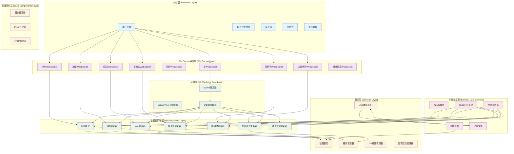
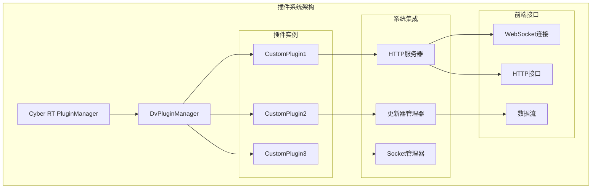
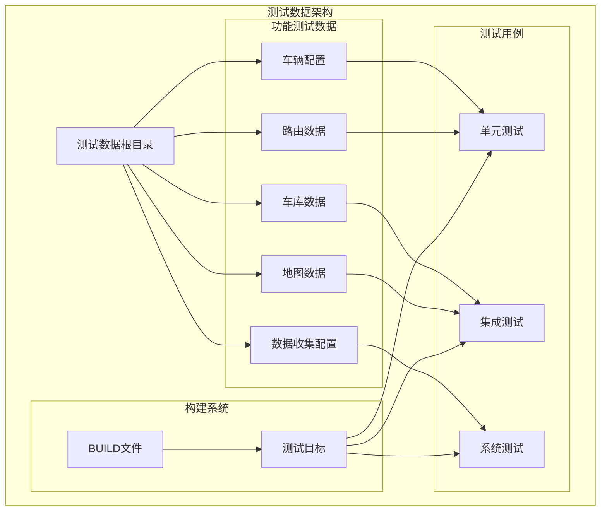
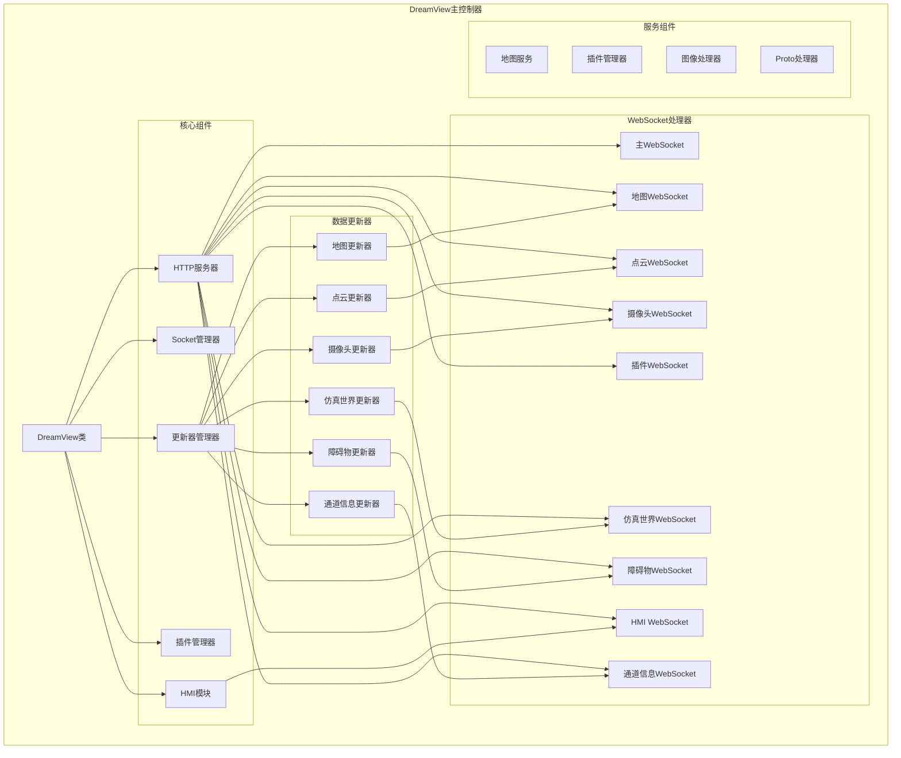

我来为您解析这个 `obstacle_updater.h` 头文件。这是一个用于处理障碍物更新的C++头文件，属于Apollo自动驾驶系统的DreamView模块。

Read file: backend/obstacle_updater/obstacle_updater.cc
现在让我为您详细解析这个头文件的结构和功能：

## 文件概述

这是一个用于处理障碍物数据更新的头文件，属于Apollo自动驾驶系统的DreamView Plus模块。主要功能是将感知模块检测到的障碍物信息通过WebSocket推送给前端显示。

## 主要组件分析

### 1. 包含的头文件和命名空间

```cpp
// 标准库
#include <map>
#include <memory>
#include <string>
#include <unordered_map>
#include <vector>

// Apollo相关消息类型
#include "modules/common_msgs/localization_msgs/localization.pb.h"
#include "modules/common_msgs/localization_msgs/pose.pb.h"
#include "modules/common_msgs/perception_msgs/perception_obstacle.pb.h"
#include "modules/dreamview_plus/proto/obstacle.pb.h"

// Cyber RT框架
#include "cyber/cyber.h"
#include "cyber/service_discovery/specific_manager/channel_manager.h"

// 基类
#include "modules/dreamview_plus/backend/updater/updater_with_channels_base.h"
```

### 2. 核心数据结构

#### `ObstacleChannelUpdater` 结构体
```cpp
struct ObstacleChannelUpdater {
  std::string curr_channel_name_;                    // 当前通道名称
  std::shared_ptr<cyber::Reader<PerceptionObstacles>> perception_obstacle_reader_; // 障碍物数据读取器
  std::unordered_map<std::string, Object> obj_map_;  // 障碍物对象映射表
  std::unique_ptr<cyber::Timer> timer_;              // 定时器
  std::vector<PerceptionObstacle> obstacles_;        // 障碍物列表
  Obstacles obstacle_objects_;                       // 障碍物对象集合
};
```

这个结构体管理单个通道的障碍物数据，包括数据读取、存储和定时更新。

### 3. 主类 `ObstacleUpdater`

#### 继承关系
```cpp
class ObstacleUpdater : public UpdaterWithChannelsBase
```
继承自 `UpdaterWithChannelsBase`，支持多通道数据更新。

#### 主要成员变量
```cpp
private:
  bool enabled_ = false;                                    // 是否启用
  WebSocketHandler* websocket_;                            // WebSocket处理器
  std::unique_ptr<cyber::Node> node_;                      // Cyber RT节点
  std::map<std::string, ObstacleChannelUpdater*> obstacle_channel_updater_map_; // 通道更新器映射
  std::mutex channel_updater_map_mutex_;                   // 通道映射互斥锁
  std::mutex updater_publish_mutex_;                       // 发布互斥锁
  std::shared_ptr<cyber::Reader<LocalizationEstimate>> localization_reader_; // 定位数据读取器
  Pose adc_pose_;                                          // 自车位姿
```

#### 主要公共方法

1. **构造函数和初始化**
   ```cpp
   explicit ObstacleUpdater(WebSocketHandler* websocket);
   void Init();
   ```

2. **流控制方法**
   ```cpp
   void StartStream(const double& time_interval_ms, const std::string& channel_name = "", nlohmann::json* subscribe_param = nullptr);
   void StopStream(const std::string& channel_name);
   void Stop();
   ```

3. **数据处理方法**
   ```cpp
   void OnTimer(const std::string& channel_name = "");
   void PublishMessage(const std::string& channel_name = "");
   void GetChannelMsg(std::vector<std::string>* channels);
   ```

#### 主要私有方法

1. **障碍物数据处理**
   ```cpp
   void SetObstacleSource(const PerceptionObstacle& obstacle, Object* obj);
   void SetObstacleType(const PerceptionObstacle::Type obstacle_type, const PerceptionObstacle::SubType obstalce_sub_type, Object* obj);
   void SetObstaclePolygon(const PerceptionObstacle& obstalce, Object* obj);
   void SetObstacleInfo(const PerceptionObstacle& obstalce, Object* obj);
   void SetObstacleSensorMeasurements(const PerceptionObstacle& obstacle, Object* obj, ObstacleChannelUpdater* channel_updater);
   ```

2. **自车位置处理**
   ```cpp
   void SetADCPosition(Object* auto_driving_car);
   ```

3. **回调函数**
   ```cpp
   void OnObstacles(const std::shared_ptr<PerceptionObstacles>& obstacles, const std::string& channel_name);
   void OnLocalization(const std::shared_ptr<LocalizationEstimate>& localization);
   ```

4. **工具方法**
   ```cpp
   ObstacleChannelUpdater* GetObstacleChannelUpdater(const std::string& channel_name);
   void GetObjects(std::string* to_send, std::string channel_name);
   ```

## 功能特点

1. **多通道支持**: 可以同时处理多个障碍物数据通道
2. **实时更新**: 通过定时器机制定期推送数据到前端
3. **线程安全**: 使用互斥锁保护共享数据
4. **WebSocket通信**: 通过WebSocket将数据推送给前端显示
5. **数据转换**: 将Apollo内部消息格式转换为前端可用的格式

## 工作流程

1. 初始化时创建Cyber RT节点和定位数据读取器
2. 当启动流时，为指定通道创建障碍物数据读取器和定时器
3. 定时器触发时，收集当前通道的障碍物数据
4. 将障碍物数据转换为前端格式并通过WebSocket发送
5. 支持动态订阅和取消订阅不同的数据通道

这个头文件设计了一个完整的障碍物数据管理系统，为DreamView Plus提供了实时、可靠的障碍物可视化功能。

------

我来为您详细解析 `obstacle_updater.cc` 实现文件。

Read file: backend/obstacle_updater/obstacle_updater.cc
现在我来为您详细解析这个 `obstacle_updater.cc` 实现文件：

## 文件结构分析

### 1. 构造函数和初始化

```cpp
ObstacleUpdater::ObstacleUpdater(WebSocketHandler* websocket)
    : UpdaterWithChannelsBase({"perception.PerceptionObstacles"}, {""}),
      websocket_(websocket),
      node_(cyber::CreateNode("obstacle_updater")) {
  Init();
}
```

**功能**: 
- 继承自 `UpdaterWithChannelsBase`，支持感知障碍物数据通道
- 创建Cyber RT节点用于数据通信
- 调用 `Init()` 进行初始化

```cpp
void ObstacleUpdater::Init() {
  localization_reader_ = node_->CreateReader<LocalizationEstimate>(
      FLAGS_localization_topic,
      [this](const std::shared_ptr<LocalizationEstimate>& localization) {
        OnLocalization(localization);
      });
}
```

**功能**: 创建定位数据读取器，用于获取自车位置信息

### 2. 通道管理

```cpp
ObstacleChannelUpdater* ObstacleUpdater::GetObstacleChannelUpdater(
    const std::string& channel_name) {
  std::lock_guard<std::mutex> lck(channel_updater_map_mutex_);
  if (!obstacle_channel_updater_map_.count(channel_name)) {
    obstacle_channel_updater_map_[channel_name] =
        new ObstacleChannelUpdater(channel_name);
    obstacle_channel_updater_map_[channel_name]->perception_obstacle_reader_ =
        node_->CreateReader<PerceptionObstacles>(
            channel_name,
            [channel_name, this](const std::shared_ptr<PerceptionObstacles>& obstacles) {
              OnObstacles(obstacles, channel_name);
            });
  }
  return obstacle_channel_updater_map_[channel_name];
}
```

**功能**: 
- 线程安全地获取或创建指定通道的障碍物更新器
- 为每个通道创建独立的障碍物数据读取器
- 使用回调函数处理接收到的障碍物数据

### 3. 流控制机制

#### StartStream 方法
```cpp
void ObstacleUpdater::StartStream(const double& time_interval_ms,
                                  const std::string& channel_name,
                                  nlohmann::json* subscribe_param) {
  if (channel_name.empty()) {
    AERROR << "Failed to subscribe channel for channel is empty";
    return;
  }
  if (time_interval_ms > 0) {
    ObstacleChannelUpdater* channel_updater =
        GetObstacleChannelUpdater(channel_name);
    if (channel_updater == nullptr) {
      AERROR << "Failed to subscribe channel: " << channel_name
             << "for channel updater not registered!";
      return;
    }
    channel_updater->timer_.reset(new cyber::Timer(
        time_interval_ms,
        [channel_name, this]() { this->OnTimer(channel_name); }, false));
    channel_updater->timer_->Start();
  } else {
    this->OnTimer(channel_name);
  }
}
```

**功能**:
- 启动指定通道的数据流
- 如果时间间隔大于0，创建定时器定期推送数据
- 如果时间间隔为0，立即推送一次数据

#### StopStream 方法
```cpp
void ObstacleUpdater::StopStream(const std::string& channel_name) {
  if (channel_name.empty()) {
    AERROR << "Failed to unsubscribe channel for channel is empty";
    return;
  }
  if (enabled_) {
    ObstacleChannelUpdater* channel_updater =
        GetObstacleChannelUpdater(channel_name);
    if (channel_updater->timer_) {
      channel_updater->timer_->Stop();
    }
    channel_updater->obj_map_.clear();
    channel_updater->obstacle_objects_.Clear();
    channel_updater->obstacles_.clear();
  }
}
```

**功能**: 停止指定通道的数据流并清理相关数据

### 4. 数据发布机制

```cpp
void ObstacleUpdater::PublishMessage(const std::string& channel_name) {
  std::string to_send = "";
  GetObjects(&to_send, channel_name);
  StreamData stream_data;
  std::string stream_data_string;
  stream_data.set_action("stream");
  stream_data.set_data_name("obstacle");
  stream_data.set_channel_name(channel_name);
  std::vector<uint8_t> byte_data(to_send.begin(), to_send.end());
  stream_data.set_data(&(byte_data[0]), byte_data.size());
  stream_data.set_type("obstacle");
  stream_data.SerializeToString(&stream_data_string);
  websocket_->BroadcastBinaryData(stream_data_string);
}
```

**功能**:
- 获取指定通道的障碍物数据
- 将数据封装为 `StreamData` 格式
- 通过WebSocket广播二进制数据到前端

### 5. 数据回调处理

#### OnObstacles 回调
```cpp
void ObstacleUpdater::OnObstacles(
    const std::shared_ptr<PerceptionObstacles>& obstacles,
    const std::string& channel) {
  if (!enabled_) {
    return;
  }
  {
    std::lock_guard<std::mutex> lck(updater_publish_mutex_);
    ObstacleChannelUpdater* channel_updater =
        GetObstacleChannelUpdater(channel);
    channel_updater->obstacles_.clear();
    for (auto& obstacle : obstacles->perception_obstacle()) {
      channel_updater->obstacles_.push_back(obstacle);
    }
  }
}
```

**功能**: 线程安全地处理接收到的障碍物数据

#### OnLocalization 回调
```cpp
void ObstacleUpdater::OnLocalization(
    const std::shared_ptr<LocalizationEstimate>& localization) {
  if (!enabled_) {
    return;
  }
  adc_pose_ = localization->pose();
}
```

**功能**: 更新自车位置信息

### 6. 数据转换和处理

#### GetObjects 方法
```cpp
void ObstacleUpdater::GetObjects(std::string* to_send, std::string channel_name) {
  {
    std::lock_guard<std::mutex> lck(updater_publish_mutex_);
    ObstacleChannelUpdater* channel_updater =
        GetObstacleChannelUpdater(channel_name);

    if (channel_updater->obstacles_.empty()) {
      return;
    }
    channel_updater->obj_map_.clear();
    for (const auto& obstacle : channel_updater->obstacles_) {
      const std::string id = std::to_string(obstacle.id());
      if (!apollo::common::util::ContainsKey(channel_updater->obj_map_, id)) {
        Object& obj = channel_updater->obj_map_[id];
        SetObstacleInfo(obstacle, &obj);
        SetObstaclePolygon(obstacle, &obj);
        SetObstacleType(obstacle.type(), obstacle.sub_type(), &obj);
        SetObstacleSensorMeasurements(obstacle, &obj, channel_updater);
        SetObstacleSource(obstacle, &obj);
      } else {
        // 更新已存在对象的信息
        Object& obj = channel_updater->obj_map_[id];
        SetObstacleInfo(obstacle, &obj);
        SetObstaclePolygon(obstacle, &obj);
        SetObstacleSensorMeasurements(obstacle, &obj, channel_updater);
      }
    }
    Object auto_driving_car;
    SetADCPosition(&auto_driving_car);
    channel_updater->obstacle_objects_.Clear();
    for (const auto& kv : channel_updater->obj_map_) {
      *channel_updater->obstacle_objects_.add_obstacle() = kv.second;
    }
    channel_updater->obstacle_objects_.mutable_auto_driving_car()->CopyFrom(
        auto_driving_car);
    channel_updater->obstacle_objects_.SerializeToString(to_send);
  }
}
```

**功能**: 
- 将原始障碍物数据转换为前端可用的格式
- 处理重复对象（只更新位置和传感器测量信息）
- 添加自车位置信息
- 序列化数据用于传输

### 7. 障碍物属性设置方法

#### SetObstacleInfo
```cpp
void ObstacleUpdater::SetObstacleInfo(const PerceptionObstacle& obstacle, Object* obj) {
  if (obj == nullptr) {
    return;
  }
  obj->set_id(std::to_string(obstacle.id()));
  obj->set_position_x(obstacle.position().x());
  obj->set_position_y(obstacle.position().y());
  obj->set_heading(obstacle.theta());
  obj->set_length(obstacle.length());
  obj->set_width(obstacle.width());
  obj->set_height(obstacle.height());
  obj->set_speed(std::hypot(obstacle.velocity().x(), obstacle.velocity().y()));
  obj->set_speed_heading(std::atan2(obstacle.velocity().y(), obstacle.velocity().x()));
  obj->set_timestamp_sec(obstacle.timestamp());
  obj->set_confidence(obstacle.has_confidence() ? obstacle.confidence() : 1);
}
```

**功能**: 设置障碍物的基本属性（位置、尺寸、速度、置信度等）

#### SetObstaclePolygon
```cpp
void ObstacleUpdater::SetObstaclePolygon(const PerceptionObstacle& obstacle, Object* obj) {
  if (obj == nullptr) {
    return;
  }

  std::unordered_set<std::pair<double, double>, PairHash> seen_points;
  obj->clear_polygon_point();
  for (const auto& point : obstacle.polygon_point()) {
    std::pair<double, double> xy_pair = {point.x(), point.y()};
    if (seen_points.count(xy_pair) == 0) {
      PolygonPoint* poly_pt = obj->add_polygon_point();
      poly_pt->set_x(point.x());
      poly_pt->set_y(point.y());
      seen_points.insert(xy_pair);
    }
  }
}
```

**功能**: 设置障碍物的多边形轮廓，去除重复点

#### SetObstacleType
```cpp
void ObstacleUpdater::SetObstacleType(
    const PerceptionObstacle::Type obstacle_type,
    const PerceptionObstacle::SubType obstacle_subtype, Object* obj) {
  if (obj == nullptr) {
    return;
  }
  switch (obstacle_type) {
    case PerceptionObstacle::UNKNOWN:
      obj->set_type(Object_Type_UNKNOWN);
      break;
    case PerceptionObstacle::UNKNOWN_MOVABLE:
      obj->set_type(Object_Type_UNKNOWN_MOVABLE);
      break;
    case PerceptionObstacle::UNKNOWN_UNMOVABLE:
      obj->set_type(Object_Type_UNKNOWN_UNMOVABLE);
      break;
    case PerceptionObstacle::PEDESTRIAN:
      obj->set_type(Object_Type_PEDESTRIAN);
      break;
    case PerceptionObstacle::BICYCLE:
      obj->set_type(Object_Type_BICYCLE);
      break;
    case PerceptionObstacle::VEHICLE:
      obj->set_type(Object_Type_VEHICLE);
      break;
    default:
      obj->set_type(Object_Type_VIRTUAL);
  }
  obj->set_sub_type(obstacle_subtype);
}
```

**功能**: 设置障碍物类型和子类型

#### SetObstacleSource
```cpp
void ObstacleUpdater::SetObstacleSource(const PerceptionObstacle& obstacle, Object* obj) {
  if (obj == nullptr || !obstacle.has_source()) {
    return;
  }
  const PerceptionObstacle::Source obstacle_source = obstacle.source();
  obj->set_source(obstacle_source);
  obj->clear_v2x_info();
  if (obstacle_source == PerceptionObstacle::V2X && obstacle.has_v2x_info()) {
    obj->mutable_v2x_info()->CopyFrom(obstacle.v2x_info());
  }
}
```

**功能**: 设置障碍物数据来源，特别处理V2X信息

#### SetObstacleSensorMeasurements
```cpp
void ObstacleUpdater::SetObstacleSensorMeasurements(
    const PerceptionObstacle& obstacle, Object* obj,
    ObstacleChannelUpdater* channel_updater) {
  if (obj == nullptr) {
    return;
  }
  for (const auto& sensor : obstacle.measurements()) {
    Object* obj = (*(channel_updater->obstacle_objects_
                         .mutable_sensor_measurements()))[sensor.sensor_id()]
                      .add_sensor_measurement();
    obj->set_id(std::to_string(sensor.id()));
    obj->set_position_x(sensor.position().x());
    obj->set_position_y(sensor.position().y());
    obj->set_heading(sensor.theta());
    obj->set_length(sensor.length());
    obj->set_width(sensor.width());
    obj->set_height(sensor.height());
    SetObstacleType(sensor.type(), sensor.sub_type(), obj);
  }
}
```

**功能**: 处理多传感器测量数据

#### SetADCPosition
```cpp
void ObstacleUpdater::SetADCPosition(Object* auto_driving_car) {
  auto_driving_car->set_position_x(adc_pose_.position().x());
  auto_driving_car->set_position_y(adc_pose_.position().y());
  auto_driving_car->set_heading(adc_pose_.heading());
}
```

**功能**: 设置自车位置信息

## 总结

这个实现文件提供了一个完整的障碍物数据处理系统：

1. **多通道支持**: 可以同时处理多个障碍物数据通道
2. **实时数据流**: 通过定时器机制定期推送数据
3. **线程安全**: 使用互斥锁保护共享数据
4. **数据转换**: 将Apollo内部消息格式转换为前端可用的格式
5. **WebSocket通信**: 通过WebSocket将数据推送给前端显示
6. **完整的数据处理**: 包括位置、类型、轮廓、传感器测量等所有障碍物属性

整个系统设计合理，具有良好的扩展性和可维护性。

让我深入分析一下为什么需要多个障碍物数据通道，以及它们分别处理什么。

Search files...
Ran tool
Ran tool
Search files...
Read file: backend/updater/updater_with_channels_base.h
基于对代码的深入分析，我现在可以详细解释为什么需要多个障碍物数据通道，以及它们分别处理什么：

## 多通道障碍物数据的原因

### 1. **多传感器融合系统**

Apollo自动驾驶系统使用多种传感器来感知环境：
- **激光雷达 (LiDAR)**: 提供3D点云数据
- **毫米波雷达 (Radar)**: 提供距离和速度信息
- **摄像头 (Camera)**: 提供2D图像和视觉信息
- **V2X通信**: 提供车联网信息

每种传感器都会产生独立的障碍物检测结果，需要分别处理。

### 2. **不同数据来源**

从代码中可以看到，障碍物数据有多种来源：

```cpp
// 在 perception_camera_updater.cc 中
std::string perception_obstacle_channel = 
    "/apollo/prediction/perception_obstacles_" + camera_name;
```

这表明每个摄像头都有对应的障碍物检测通道，例如：
- `/apollo/prediction/perception_obstacles_front_camera`
- `/apollo/prediction/perception_obstacles_left_camera`
- `/apollo/prediction/perception_obstacles_right_camera`

### 3. **不同处理阶段**

障碍物数据在不同处理阶段有不同的通道：

```cpp
// 在 simulation_world_service.cc 中
perception_obstacle_reader_ = 
    node_->CreateReader<PerceptionObstacles>(FLAGS_perception_obstacle_topic);
prediction_obstacle_reader_ = 
    node_->CreateReader<PredictionObstacles>(FLAGS_prediction_topic);
```

- **感知阶段**: 原始传感器检测结果
- **预测阶段**: 经过预测算法处理的结果

## 各通道的具体功能

### 1. **传感器专用通道**

#### 摄像头障碍物通道
```cpp
// 每个摄像头对应一个障碍物通道
std::string camera_name = 
    channel_name.substr(camera_string_start_pos + 1,
                       camera_string_end_pos - camera_string_start_pos - 1);
std::string perception_obstacle_channel = 
    "/apollo/prediction/perception_obstacles_" + camera_name;
```

**功能**: 
- 处理特定摄像头的2D障碍物检测结果
- 提供2D边界框 (BBox2D) 信息
- 与摄像头图像同步显示

#### 激光雷达障碍物通道
**功能**:
- 处理3D点云障碍物检测
- 提供精确的3D位置和尺寸信息
- 支持多边形轮廓显示

#### 雷达障碍物通道
**功能**:
- 处理雷达检测的障碍物
- 提供距离和速度信息
- 适用于恶劣天气条件

### 2. **融合通道**

#### 主感知通道 (`FLAGS_perception_obstacle_topic`)
```cpp
// 在 simulation_world_service.cc 中
perception_obstacle_reader_ = 
    node_->CreateReader<PerceptionObstacles>(FLAGS_perception_obstacle_topic);
```

**功能**:
- 融合多传感器数据
- 提供统一的障碍物列表
- 包含CIPV (Closest In-Path Vehicle) 信息

### 3. **预测通道**

```cpp
prediction_obstacle_reader_ = 
    node_->CreateReader<PredictionObstacles>(FLAGS_prediction_topic);
```

**功能**:
- 提供障碍物的预测轨迹
- 包含运动预测信息
- 支持决策规划

### 4. **V2X通道**

```cpp
if (obstacle_source == PerceptionObstacle::V2X && obstacle.has_v2x_info()) {
    obj->mutable_v2x_info()->CopyFrom(obstacle.v2x_info());
}
```

**功能**:
- 处理车联网信息
- 提供远程障碍物数据
- 支持协同感知

## 多通道架构的优势

### 1. **模块化设计**
- 每个传感器独立处理
- 便于调试和优化
- 支持传感器热插拔

### 2. **数据隔离**
- 避免不同传感器数据相互干扰
- 便于故障诊断
- 支持传感器降级

### 3. **灵活配置**
```cpp
// 在 data_handler.conf 中
data_handler_info {
  key: "apollo.dreamview.Obstacles",
  value {
    data_name: "obstacle",
    different_for_channels: true  // 支持多通道
  }
}
```

### 4. **前端显示控制**
```typescript
// 前端可以控制显示哪些传感器数据
const { lidar, radar, camera } = this.option.layerOption.Perception;
if (sensorMeasurements && (lidar || radar || camera)) {
    Object.keys(sensorMeasurements).forEach((key) => {
        const sensorType = memoizeGetSensorType(key.toLowerCase());
        if (!sensorType || !this.option.layerOption.Perception[sensorType]) {
            return;
        }
        // 处理特定传感器数据
    });
}
```

## 总结

多通道障碍物数据系统是Apollo自动驾驶系统的重要组成部分，它：

1. **支持多传感器融合**: 激光雷达、雷达、摄像头、V2X等
2. **提供数据隔离**: 每个传感器独立处理，便于调试
3. **支持灵活配置**: 前端可以选择显示哪些传感器数据
4. **实现模块化设计**: 便于系统维护和升级
5. **提供完整感知**: 从原始检测到预测轨迹的全流程数据

这种设计使得DreamView Plus能够全面展示自动驾驶系统的感知能力，为开发者和测试人员提供详细的调试信息。

让我详细分析 `obstacle_updater.cc` 中的线程安全机制和共享数据保护。

Read file: backend/obstacle_updater/obstacle_updater.h
现在让我详细分析线程安全机制和共享数据保护：

## 共享数据识别

### 1. **主类中的共享数据**

```cpp
class ObstacleUpdater : public UpdaterWithChannelsBase {
private:
  // 共享数据1: 通道更新器映射表
  std::map<std::string, ObstacleChannelUpdater*> obstacle_channel_updater_map_;
  
  // 共享数据2: 自车位置信息
  Pose adc_pose_;
  
  // 共享数据3: 启用状态标志
  bool enabled_ = false;
};
```

### 2. **通道更新器中的共享数据**

```cpp
struct ObstacleChannelUpdater {
  // 共享数据4: 障碍物对象映射表
  std::unordered_map<std::string, Object> obj_map_;
  
  // 共享数据5: 原始障碍物数据列表
  std::vector<PerceptionObstacle> obstacles_;
  
  // 共享数据6: 序列化的障碍物对象
  Obstacles obstacle_objects_;
};
```

## 互斥锁保护机制

### 1. **通道映射表互斥锁**

```cpp
std::mutex channel_updater_map_mutex_;
```

#### 保护的数据：
- `obstacle_channel_updater_map_`: 通道更新器映射表

#### 使用场景：

**在 `GetObstacleChannelUpdater` 方法中：**
```cpp
ObstacleChannelUpdater* ObstacleUpdater::GetObstacleChannelUpdater(
    const std::string& channel_name) {
  std::lock_guard<std::mutex> lck(channel_updater_map_mutex_);  // 加锁
  if (!obstacle_channel_updater_map_.count(channel_name)) {
    obstacle_channel_updater_map_[channel_name] =
        new ObstacleChannelUpdater(channel_name);
    // 创建新的通道更新器
  }
  return obstacle_channel_updater_map_[channel_name];
}  // 自动解锁
```

**保护目的：**
- 防止多个线程同时创建同一个通道的更新器
- 避免重复创建导致的资源浪费
- 确保映射表的一致性

### 2. **发布互斥锁**

```cpp
std::mutex updater_publish_mutex_;
```

#### 保护的数据：
- 所有通道更新器中的 `obstacles_`、`obj_map_`、`obstacle_objects_`
- 数据读取和写入操作

#### 使用场景：

**在 `OnObstacles` 回调中：**
```cpp
void ObstacleUpdater::OnObstacles(
    const std::shared_ptr<PerceptionObstacles>& obstacles,
    const std::string& channel) {
  if (!enabled_) {
    return;
  }
  {
    std::lock_guard<std::mutex> lck(updater_publish_mutex_);  // 加锁
    ObstacleChannelUpdater* channel_updater =
        GetObstacleChannelUpdater(channel);
    channel_updater->obstacles_.clear();  // 清空旧数据
    for (auto& obstacle : obstacles->perception_obstacle()) {
      channel_updater->obstacles_.push_back(obstacle);  // 添加新数据
    }
  }  // 自动解锁
}
```

**在 `GetObjects` 方法中：**
```cpp
void ObstacleUpdater::GetObjects(std::string* to_send, std::string channel_name) {
  {
    std::lock_guard<std::mutex> lck(updater_publish_mutex_);  // 加锁
    ObstacleChannelUpdater* channel_updater =
        GetObstacleChannelUpdater(channel_name);

    if (channel_updater->obstacles_.empty()) {
      return;
    }
    
    // 处理障碍物数据
    channel_updater->obj_map_.clear();
    for (const auto& obstacle : channel_updater->obstacles_) {
      // 转换和处理数据
    }
    
    // 序列化数据
    channel_updater->obstacle_objects_.SerializeToString(to_send);
  }  // 自动解锁
}
```

**保护目的：**
- 防止数据读取时被写入线程修改
- 确保数据一致性
- 避免竞态条件

## 线程安全设计模式

### 1. **RAII锁管理**

使用 `std::lock_guard` 实现RAII（Resource Acquisition Is Initialization）模式：

```cpp
{
  std::lock_guard<std::mutex> lck(mutex_);  // 构造时自动加锁
  // 临界区代码
}  // 析构时自动解锁
```

**优势：**
- 自动管理锁的生命周期
- 异常安全
- 避免忘记解锁

### 2. **细粒度锁设计**

```cpp
// 通道映射表锁 - 保护通道创建/访问
std::mutex channel_updater_map_mutex_;

// 数据发布锁 - 保护数据读写
std::mutex updater_publish_mutex_;
```

**优势：**
- 减少锁竞争
- 提高并发性能
- 避免死锁

### 3. **原子操作**

对于简单的状态标志，使用原子操作：

```cpp
// 启用状态检查
if (!enabled_) {
  return;
}
```

## 潜在的线程安全问题

### 1. **自车位置数据**

```cpp
void ObstacleUpdater::OnLocalization(
    const std::shared_ptr<LocalizationEstimate>& localization) {
  if (!enabled_) {
    return;
  }
  adc_pose_ = localization->pose();  // 没有锁保护！
}
```

**问题：**
- `adc_pose_` 的写入没有锁保护
- 可能在读取时被并发修改

**建议修复：**
```cpp
void ObstacleUpdater::OnLocalization(
    const std::shared_ptr<LocalizationEstimate>& localization) {
  if (!enabled_) {
    return;
  }
  std::lock_guard<std::mutex> lck(updater_publish_mutex_);
  adc_pose_ = localization->pose();
}
```

### 2. **启用状态标志**

```cpp
void ObstacleUpdater::GetChannelMsg(std::vector<std::string>* channels) {
  enabled_ = true;  // 没有锁保护！
  GetChannelMsgWithFilter(channels);
}
```

**问题：**
- `enabled_` 的修改没有锁保护
- 可能与读取操作产生竞态条件

**建议修复：**
```cpp
void ObstacleUpdater::GetChannelMsg(std::vector<std::string>* channels) {
  std::lock_guard<std::mutex> lck(updater_publish_mutex_);
  enabled_ = true;
  GetChannelMsgWithFilter(channels);
}
```

## 线程安全最佳实践

### 1. **锁的粒度控制**

```cpp
// 好的做法：细粒度锁
{
  std::lock_guard<std::mutex> lck(channel_updater_map_mutex_);
  // 只保护通道映射表操作
  auto* updater = GetObstacleChannelUpdater(channel_name);
}
// 锁已释放，可以进行其他操作

// 不好的做法：粗粒度锁
{
  std::lock_guard<std::mutex> lck(updater_publish_mutex_);
  // 保护所有数据操作，锁持有时间过长
  // 大量数据处理...
}
```

### 2. **避免嵌套锁**

```cpp
// 潜在的死锁风险
void SomeMethod() {
  std::lock_guard<std::mutex> lck1(mutex1_);
  std::lock_guard<std::mutex> lck2(mutex2_);  // 可能死锁
}
```

### 3. **使用条件变量**

对于需要等待特定条件的场景：

```cpp
std::condition_variable cv_;
std::mutex cv_mutex_;

// 等待数据就绪
{
  std::unique_lock<std::mutex> lck(cv_mutex_);
  cv_.wait(lck, [this] { return !obstacles_.empty(); });
}
```

## 总结

`obstacle_updater.cc` 的线程安全机制主要包括：

1. **两个互斥锁**：
   - `channel_updater_map_mutex_`: 保护通道映射表
   - `updater_publish_mutex_`: 保护数据读写操作

2. **保护的共享数据**：
   - 通道更新器映射表
   - 障碍物数据列表
   - 对象映射表
   - 序列化数据

3. **RAII锁管理**：
   - 使用 `std::lock_guard` 自动管理锁生命周期

4. **潜在问题**：
   - 自车位置数据缺少锁保护
   - 启用状态标志缺少锁保护

5. **改进建议**：
   - 为所有共享数据添加适当的锁保护
   - 考虑使用原子操作优化简单状态标志
   - 进一步细化锁粒度以提高并发性能

这种设计确保了在多线程环境下的数据一致性，但仍有改进空间以提高性能和安全性。

让我详细解释通道映射表的概念，并通过具体例子说明。

Read file: backend/obstacle_updater/obstacle_updater.cc
Search files...
现在我来详细解释通道映射表的概念，并通过具体例子说明。

## 通道映射表的概念

### 1. **定义**

通道映射表是一个数据结构，用于管理多个数据通道的更新器实例。在 `ObstacleUpdater` 中，它被定义为：

```cpp
std::map<std::string, ObstacleChannelUpdater*> obstacle_channel_updater_map_;
```

- **键 (Key)**: 通道名称 (std::string)
- **值 (Value)**: 对应通道的更新器指针 (ObstacleChannelUpdater*)

### 2. **作用**

- **通道管理**: 为每个数据通道创建独立的更新器
- **数据隔离**: 不同通道的数据互不干扰
- **动态创建**: 按需创建通道更新器，避免资源浪费
- **统一访问**: 提供统一的接口访问所有通道

## 具体例子说明

### 1. **通道名称示例**

基于代码分析，Apollo系统中的障碍物通道包括：

```cpp
// 主感知通道
"/apollo/perception/obstacles"

// 摄像头专用通道
"/apollo/prediction/perception_obstacles_front_camera"
"/apollo/prediction/perception_obstacles_left_camera"  
"/apollo/prediction/perception_obstacles_right_camera"
"/apollo/prediction/perception_obstacles_rear_camera"

// 激光雷达通道
"/apollo/perception/lidar_obstacles"
"/apollo/perception/velodyne_obstacles"

// 雷达通道
"/apollo/perception/radar_obstacles"

// 预测通道
"/apollo/prediction/obstacles"

// V2X通道
"/apollo/v2x/obstacles"
```

### 2. **通道映射表的具体内容**

假设系统中有以下通道，通道映射表的内容可能是：

```cpp
obstacle_channel_updater_map_ = {
    // 主感知通道
    "/apollo/perception/obstacles" -> ObstacleChannelUpdater*
    
    // 摄像头通道
    "/apollo/prediction/perception_obstacles_front_camera" -> ObstacleChannelUpdater*
    "/apollo/prediction/perception_obstacles_left_camera" -> ObstacleChannelUpdater*
    "/apollo/prediction/perception_obstacles_right_camera" -> ObstacleChannelUpdater*
    
    // 激光雷达通道
    "/apollo/perception/lidar_obstacles" -> ObstacleChannelUpdater*
    
    // 雷达通道
    "/apollo/perception/radar_obstacles" -> ObstacleChannelUpdater*
    
    // 预测通道
    "/apollo/prediction/obstacles" -> ObstacleChannelUpdater*
};
```

### 3. **每个通道更新器的内容**

每个 `ObstacleChannelUpdater` 包含：

```cpp
struct ObstacleChannelUpdater {
  std::string curr_channel_name_;                    // 通道名称
  std::shared_ptr<cyber::Reader<PerceptionObstacles>> perception_obstacle_reader_; // 数据读取器
  std::unordered_map<std::string, Object> obj_map_;  // 障碍物对象映射
  std::unique_ptr<cyber::Timer> timer_;              // 定时器
  std::vector<PerceptionObstacle> obstacles_;        // 原始障碍物数据
  Obstacles obstacle_objects_;                       // 序列化数据
};
```

### 4. **实际运行示例**

#### 场景1: 前端订阅摄像头通道

```cpp
// 前端请求订阅前摄像头通道
StartStream(100.0, "/apollo/prediction/perception_obstacles_front_camera");

// 系统检查通道映射表
if (!obstacle_channel_updater_map_.count("/apollo/prediction/perception_obstacles_front_camera")) {
    // 创建新的通道更新器
    obstacle_channel_updater_map_["/apollo/prediction/perception_obstacles_front_camera"] = 
        new ObstacleChannelUpdater("/apollo/prediction/perception_obstacles_front_camera");
    
    // 创建数据读取器
    obstacle_channel_updater_map_["/apollo/prediction/perception_obstacles_front_camera"]->perception_obstacle_reader_ =
        node_->CreateReader<PerceptionObstacles>("/apollo/prediction/perception_obstacles_front_camera", callback);
}

// 启动定时器
obstacle_channel_updater_map_["/apollo/prediction/perception_obstacles_front_camera"]->timer_->Start();
```

#### 场景2: 数据接收和处理

```cpp
// 前摄像头检测到障碍物，数据到达
OnObstacles(obstacles_data, "/apollo/prediction/perception_obstacles_front_camera");

// 系统找到对应的通道更新器
ObstacleChannelUpdater* updater = obstacle_channel_updater_map_["/apollo/prediction/perception_obstacles_front_camera"];

// 更新该通道的数据
updater->obstacles_.clear();
for (auto& obstacle : obstacles_data->perception_obstacle()) {
    updater->obstacles_.push_back(obstacle);
}
```

#### 场景3: 定时发布数据

```cpp
// 定时器触发，发布前摄像头通道的数据
OnTimer("/apollo/prediction/perception_obstacles_front_camera");

// 获取该通道的数据
ObstacleChannelUpdater* updater = obstacle_channel_updater_map_["/apollo/prediction/perception_obstacles_front_camera"];

// 处理数据并发送到前端
GetObjects(&to_send, "/apollo/prediction/perception_obstacles_front_camera");
PublishMessage("/apollo/prediction/perception_obstacles_front_camera");
```

### 5. **多通道并发处理示例**

```cpp
// 同时处理多个通道的数据
void ProcessAllChannels() {
    // 前摄像头通道
    if (obstacle_channel_updater_map_.count("/apollo/prediction/perception_obstacles_front_camera")) {
        auto* front_camera_updater = obstacle_channel_updater_map_["/apollo/prediction/perception_obstacles_front_camera"];
        // 处理前摄像头数据
        ProcessChannelData(front_camera_updater);
    }
    
    // 激光雷达通道
    if (obstacle_channel_updater_map_.count("/apollo/perception/lidar_obstacles")) {
        auto* lidar_updater = obstacle_channel_updater_map_["/apollo/perception/lidar_obstacles"];
        // 处理激光雷达数据
        ProcessChannelData(lidar_updater);
    }
    
    // 雷达通道
    if (obstacle_channel_updater_map_.count("/apollo/perception/radar_obstacles")) {
        auto* radar_updater = obstacle_channel_updater_map_["/apollo/perception/radar_obstacles"];
        // 处理雷达数据
        ProcessChannelData(radar_updater);
    }
}
```

### 6. **前端显示控制示例**

```typescript
// 前端可以选择显示哪些通道的数据
const channels = [
    { label: "前摄像头", value: "/apollo/prediction/perception_obstacles_front_camera" },
    { label: "激光雷达", value: "/apollo/perception/lidar_obstacles" },
    { label: "毫米波雷达", value: "/apollo/perception/radar_obstacles" },
    { label: "预测结果", value: "/apollo/prediction/obstacles" }
];

// 用户选择显示前摄像头和激光雷达数据
const selectedChannels = [
    "/apollo/prediction/perception_obstacles_front_camera",
    "/apollo/perception/lidar_obstacles"
];

// 订阅选中的通道
selectedChannels.forEach(channel => {
    streamApi.subscribe('obstacle', channel, 100);
});
```

## 通道映射表的优势

### 1. **模块化设计**
- 每个通道独立管理
- 便于调试和优化
- 支持热插拔

### 2. **资源管理**
- 按需创建通道更新器
- 避免不必要的资源消耗
- 支持动态清理

### 3. **数据隔离**
- 不同传感器数据互不干扰
- 便于故障诊断
- 支持传感器降级

### 4. **灵活配置**
- 前端可以选择显示哪些通道
- 支持实时切换通道
- 便于性能调优

## 总结

通道映射表是Apollo DreamView Plus中多通道数据管理的核心机制，它：

1. **管理多个数据源**: 摄像头、激光雷达、雷达、V2X等
2. **提供统一接口**: 所有通道使用相同的处理流程
3. **支持动态管理**: 按需创建和销毁通道更新器
4. **确保数据隔离**: 不同通道的数据互不干扰
5. **便于前端控制**: 支持选择性显示和实时切换

这种设计使得系统能够灵活地处理来自不同传感器的障碍物数据，为开发者提供全面的调试和可视化能力。

让我详细分析通道映射表中键(Key)和值(Value)的数据类型。

## 通道映射表的定义

```cpp
std::map<std::string, ObstacleChannelUpdater*> obstacle_channel_updater_map_;
```

## 键(Key)的数据类型

### 1. **类型**: `std::string`

### 2. **具体内容**: 通道名称字符串

#### 示例通道名称：
```cpp
// 主感知通道
"/apollo/perception/obstacles"

// 摄像头专用通道
"/apollo/prediction/perception_obstacles_front_camera"
"/apollo/prediction/perception_obstacles_left_camera"
"/apollo/prediction/perception_obstacles_right_camera"
"/apollo/prediction/perception_obstacles_rear_camera"

// 激光雷达通道
"/apollo/perception/lidar_obstacles"
"/apollo/perception/velodyne_obstacles"

// 雷达通道
"/apollo/perception/radar_obstacles"

// 预测通道
"/apollo/prediction/obstacles"

// V2X通道
"/apollo/v2x/obstacles"
```

### 3. **通道名称的构成规则**：

```cpp
// 在 perception_camera_updater.cc 中的通道名称解析
size_t camera_string_end_pos = channel_name.find_last_of("/");
size_t camera_string_start_pos = 
    channel_name.find_last_of("/", camera_string_end_pos - 1);
std::string camera_name = 
    channel_name.substr(camera_string_start_pos + 1,
                       camera_string_end_pos - camera_string_start_pos - 1);
std::string perception_obstacle_channel = 
    "/apollo/prediction/perception_obstacles_" + camera_name;
```

## 值(Value)的数据类型

### 1. **类型**: `ObstacleChannelUpdater*` (指针类型)

### 2. **指向的结构体定义**：

```cpp
struct ObstacleChannelUpdater {
  std::string curr_channel_name_;                    // 通道名称
  std::shared_ptr<cyber::Reader<PerceptionObstacles>> perception_obstacle_reader_; // 数据读取器
  std::unordered_map<std::string, Object> obj_map_;  // 障碍物对象映射
  std::unique_ptr<cyber::Timer> timer_;              // 定时器
  std::vector<PerceptionObstacle> obstacles_;        // 原始障碍物数据
  Obstacles obstacle_objects_;                       // 序列化数据
  explicit ObstacleChannelUpdater(std::string channel_name)
      : curr_channel_name_(channel_name),
        perception_obstacle_reader_(nullptr) {}
};
```

### 3. **结构体成员详解**：

#### `curr_channel_name_` (std::string)
- **作用**: 存储当前通道的名称
- **示例**: `"/apollo/prediction/perception_obstacles_front_camera"`

#### `perception_obstacle_reader_` (std::shared_ptr<cyber::Reader<PerceptionObstacles>>)
- **作用**: Cyber RT数据读取器，用于订阅障碍物数据
- **类型**: 智能指针，自动管理内存
- **功能**: 接收来自指定通道的障碍物数据

#### `obj_map_` (std::unordered_map<std::string, Object>)
- **作用**: 存储障碍物ID到Object对象的映射
- **键**: 障碍物ID字符串 (std::string)
- **值**: Object对象 (protobuf消息类型)
- **示例**:
```cpp
obj_map_ = {
    "1001" -> Object{id: "1001", type: VEHICLE, position_x: 10.5, ...},
    "1002" -> Object{id: "1002", type: PEDESTRIAN, position_x: 5.2, ...},
    "1003" -> Object{id: "1003", type: BICYCLE, position_x: 8.1, ...}
};
```

#### `timer_` (std::unique_ptr<cyber::Timer>)
- **作用**: 定时器，用于定期推送数据到前端
- **类型**: 智能指针，自动管理内存
- **功能**: 控制数据推送的频率

#### `obstacles_` (std::vector<PerceptionObstacle>)
- **作用**: 存储原始感知障碍物数据
- **类型**: 动态数组
- **内容**: 来自传感器的原始障碍物检测结果

#### `obstacle_objects_` (Obstacles)
- **作用**: 存储序列化后的障碍物数据
- **类型**: protobuf消息类型
- **功能**: 用于WebSocket传输到前端

## 完整的数据类型示例

```cpp
// 通道映射表的完整示例
obstacle_channel_updater_map_ = {
    // 键: std::string, 值: ObstacleChannelUpdater*
    
    "/apollo/perception/obstacles" -> ObstacleChannelUpdater* {
        curr_channel_name_: "/apollo/perception/obstacles",
        perception_obstacle_reader_: shared_ptr<Reader<PerceptionObstacles>>,
        obj_map_: {
            "1001" -> Object{id: "1001", type: VEHICLE, ...},
            "1002" -> Object{id: "1002", type: PEDESTRIAN, ...}
        },
        timer_: unique_ptr<cyber::Timer>,
        obstacles_: [PerceptionObstacle{id: 1001, ...}, PerceptionObstacle{id: 1002, ...}],
        obstacle_objects_: Obstacles{obstacle: [Object{...}, Object{...}]}
    },
    
    "/apollo/prediction/perception_obstacles_front_camera" -> ObstacleChannelUpdater* {
        curr_channel_name_: "/apollo/prediction/perception_obstacles_front_camera",
        perception_obstacle_reader_: shared_ptr<Reader<PerceptionObstacles>>,
        obj_map_: {
            "2001" -> Object{id: "2001", type: VEHICLE, ...},
            "2002" -> Object{id: "2002", type: BICYCLE, ...}
        },
        timer_: unique_ptr<cyber::Timer>,
        obstacles_: [PerceptionObstacle{id: 2001, ...}, PerceptionObstacle{id: 2002, ...}],
        obstacle_objects_: Obstacles{obstacle: [Object{...}, Object{...}]}
    },
    
    "/apollo/perception/lidar_obstacles" -> ObstacleChannelUpdater* {
        curr_channel_name_: "/apollo/perception/lidar_obstacles",
        perception_obstacle_reader_: shared_ptr<Reader<PerceptionObstacles>>,
        obj_map_: {
            "3001" -> Object{id: "3001", type: VEHICLE, ...},
            "3002" -> Object{id: "3002", type: UNKNOWN_MOVABLE, ...}
        },
        timer_: unique_ptr<cyber::Timer>,
        obstacles_: [PerceptionObstacle{id: 3001, ...}, PerceptionObstacle{id: 3002, ...}],
        obstacle_objects_: Obstacles{obstacle: [Object{...}, Object{...}]}
    }
};
```

## 数据类型的特点

### 1. **键(Key)的特点**：
- **类型**: `std::string`
- **特点**: 
  - 不可变，用作唯一标识符
  - 支持字符串操作和比较
  - 内存占用相对较小
  - 便于调试和日志记录

### 2. **值(Value)的特点**：
- **类型**: `ObstacleChannelUpdater*` (原始指针)
- **特点**:
  - 指向动态分配的对象
  - 需要手动管理内存
  - 支持多态和继承
  - 可以指向nullptr

### 3. **为什么使用原始指针而不是智能指针**：

```cpp
// 当前实现使用原始指针
std::map<std::string, ObstacleChannelUpdater*> obstacle_channel_updater_map_;

// 可能的改进：使用智能指针
std::map<std::string, std::unique_ptr<ObstacleChannelUpdater>> obstacle_channel_updater_map_;
```

**使用原始指针的原因**：
- 保持与现有代码的兼容性
- 简化内存管理逻辑
- 避免智能指针的引用计数开销

## 内存管理

### 1. **创建通道更新器**：
```cpp
obstacle_channel_updater_map_[channel_name] = 
    new ObstacleChannelUpdater(channel_name);  // 动态分配内存
```

### 2. **清理通道更新器**：
```cpp
void ObstacleUpdater::Stop() {
  if (enabled_) {
    obstacle_channel_updater_map_.clear();  // 清空映射表，但可能造成内存泄漏
  }
  enabled_ = false;
}
```

### 3. **改进建议**：
```cpp
// 使用智能指针自动管理内存
std::map<std::string, std::unique_ptr<ObstacleChannelUpdater>> obstacle_channel_updater_map_;

// 创建时
obstacle_channel_updater_map_[channel_name] = 
    std::make_unique<ObstacleChannelUpdater>(channel_name);

// 清理时自动释放内存
obstacle_channel_updater_map_.clear();  // 自动释放所有内存
```

## 总结

通道映射表的数据类型：

1. **键(Key)**: `std::string` - 通道名称字符串
2. **值(Value)**: `ObstacleChannelUpdater*` - 指向通道更新器结构体的原始指针

这种设计提供了：
- **灵活性**: 支持动态添加和删除通道
- **效率**: 直接指针访问，避免拷贝开销
- **功能完整**: 每个通道更新器包含完整的数据处理能力
- **内存管理**: 需要手动管理内存，有改进空间

让我详细分析通道映射表为什么是共享数据，以及哪些线程在使用它。

Read file: backend/obstacle_updater/obstacle_updater.cc
Read file: backend/obstacle_updater/obstacle_updater.cc
Search files...
现在我来详细分析通道映射表为什么是共享数据，以及哪些线程在使用它。

## 通道映射表是共享数据的原因

### 1. **多线程访问需求**

通道映射表 `obstacle_channel_updater_map_` 需要被多个线程同时访问：

```cpp
std::map<std::string, ObstacleChannelUpdater*> obstacle_channel_updater_map_;
std::mutex channel_updater_map_mutex_;  // 保护通道映射表的互斥锁
```

### 2. **共享数据的本质**

- **全局资源**: 通道映射表是 `ObstacleUpdater` 类的成员变量，被所有相关线程共享
- **动态管理**: 需要支持动态添加、删除和访问通道
- **状态维护**: 维护所有活跃通道的状态信息

## 使用通道映射表的线程

### 1. **主线程 (Main Thread)**

#### 功能：初始化和清理
```cpp
// 在 ObstacleUpdater 构造函数中
ObstacleUpdater::ObstacleUpdater(WebSocketHandler* websocket)
    : UpdaterWithChannelsBase({"perception.PerceptionObstacles"}, {""}),
      websocket_(websocket),
      node_(cyber::CreateNode("obstacle_updater")) {
  Init();  // 主线程初始化
}

// 在 Stop() 方法中
void ObstacleUpdater::Stop() {
  if (enabled_) {
    obstacle_channel_updater_map_.clear();  // 主线程清理
  }
  enabled_ = false;
}
```

### 2. **WebSocket处理线程 (WebSocket Handler Thread)**

#### 功能：处理前端订阅请求
```cpp
// 前端请求订阅通道时调用
void ObstacleUpdater::StartStream(const double& time_interval_ms,
                                  const std::string& channel_name,
                                  nlohmann::json* subscribe_param) {
  if (channel_name.empty()) {
    AERROR << "Failed to subscribe channel for channel is empty";
    return;
  }
  if (time_interval_ms > 0) {
    ObstacleChannelUpdater* channel_updater =
        GetObstacleChannelUpdater(channel_name);  // 访问通道映射表
    if (channel_updater == nullptr) {
      AERROR << "Failed to subscribe channel: " << channel_name
             << "for channel updater not registered!";
      return;
    }
    channel_updater->timer_.reset(new cyber::Timer(
        time_interval_ms,
        [channel_name, this]() { this->OnTimer(channel_name); }, false));
    channel_updater->timer_->Start();
  } else {
    this->OnTimer(channel_name);
  }
}
```

### 3. **Cyber RT回调线程 (Cyber RT Callback Threads)**

#### 功能：处理传感器数据回调
```cpp
// 障碍物数据回调线程
void ObstacleUpdater::OnObstacles(
    const std::shared_ptr<PerceptionObstacles>& obstacles,
    const std::string& channel) {
  if (!enabled_) {
    return;
  }
  {
    std::lock_guard<std::mutex> lck(updater_publish_mutex_);
    ObstacleChannelUpdater* channel_updater =
        GetObstacleChannelUpdater(channel);  // 访问通道映射表
    channel_updater->obstacles_.clear();
    for (auto& obstacle : obstacles->perception_obstacle()) {
      channel_updater->obstacles_.push_back(obstacle);
    }
  }
}

// 定位数据回调线程
void ObstacleUpdater::OnLocalization(
    const std::shared_ptr<LocalizationEstimate>& localization) {
  if (!enabled_) {
    return;
  }
  adc_pose_ = localization->pose();
}
```

### 4. **定时器线程 (Timer Threads)**

#### 功能：定期推送数据
```cpp
// 每个通道的定时器线程
void ObstacleUpdater::OnTimer(const std::string& channel_name) {
  PublishMessage(channel_name);  // 定时器线程调用
}

void ObstacleUpdater::PublishMessage(const std::string& channel_name) {
  std::string to_send = "";
  GetObjects(&to_send, channel_name);  // 访问通道映射表
  // ... 发送数据到前端
}

void ObstacleUpdater::GetObjects(std::string* to_send, std::string channel_name) {
  {
    std::lock_guard<std::mutex> lck(updater_publish_mutex_);
    ObstacleChannelUpdater* channel_updater =
        GetObstacleChannelUpdater(channel_name);  // 访问通道映射表
    // ... 处理数据
  }
}
```

### 5. **通道管理线程 (Channel Management Thread)**

#### 功能：动态管理通道
```cpp
// 获取或创建通道更新器
ObstacleChannelUpdater* ObstacleUpdater::GetObstacleChannelUpdater(
    const std::string& channel_name) {
  std::lock_guard<std::mutex> lck(channel_updater_map_mutex_);  // 加锁保护
  if (!obstacle_channel_updater_map_.count(channel_name)) {
    // 创建新的通道更新器
    obstacle_channel_updater_map_[channel_name] =
        new ObstacleChannelUpdater(channel_name);
    obstacle_channel_updater_map_[channel_name]->perception_obstacle_reader_ =
        node_->CreateReader<PerceptionObstacles>(
            channel_name,
            [channel_name, this](const std::shared_ptr<PerceptionObstacles>& obstacles) {
              OnObstacles(obstacles, channel_name);
            });
  }
  return obstacle_channel_updater_map_[channel_name];
}
```

## 线程间的竞态条件

### 1. **读-写竞态**

```cpp
// 线程A：读取通道映射表
ObstacleChannelUpdater* channel_updater = 
    GetObstacleChannelUpdater(channel_name);  // 读取操作

// 线程B：修改通道映射表
obstacle_channel_updater_map_[new_channel] = 
    new ObstacleChannelUpdater(new_channel);  // 写入操作
```

### 2. **写-写竞态**

```cpp
// 线程A：创建通道
obstacle_channel_updater_map_[channel_name] = 
    new ObstacleChannelUpdater(channel_name);

// 线程B：同时创建同一个通道
obstacle_channel_updater_map_[channel_name] = 
    new ObstacleChannelUpdater(channel_name);  // 重复创建！
```

### 3. **访问已删除对象的竞态**

```cpp
// 线程A：删除通道
obstacle_channel_updater_map_.clear();

// 线程B：访问已删除的通道
ObstacleChannelUpdater* updater = 
    obstacle_channel_updater_map_[channel_name];  // 访问无效指针！
```

## 互斥锁保护机制

### 1. **通道映射表锁**

```cpp
std::mutex channel_updater_map_mutex_;

// 保护通道映射表的访问
ObstacleChannelUpdater* ObstacleChannelUpdater::GetObstacleChannelUpdater(
    const std::string& channel_name) {
  std::lock_guard<std::mutex> lck(channel_updater_map_mutex_);  // 加锁
  // ... 访问通道映射表
  return obstacle_channel_updater_map_[channel_name];
}  // 自动解锁
```

### 2. **数据发布锁**

```cpp
std::mutex updater_publish_mutex_;

// 保护数据读写操作
void ObstacleUpdater::OnObstacles(...) {
  std::lock_guard<std::mutex> lck(updater_publish_mutex_);  // 加锁
  ObstacleChannelUpdater* channel_updater = GetObstacleChannelUpdater(channel);
  // ... 修改数据
}  // 自动解锁
```

## 线程安全设计模式

### 1. **双重检查锁定模式**

```cpp
// 改进的通道获取方法
ObstacleChannelUpdater* GetObstacleChannelUpdater(const std::string& channel_name) {
  // 第一次检查（无锁）
  auto it = obstacle_channel_updater_map_.find(channel_name);
  if (it != obstacle_channel_updater_map_.end()) {
    return it->second;
  }
  
  // 加锁后再次检查
  std::lock_guard<std::mutex> lck(channel_updater_map_mutex_);
  it = obstacle_channel_updater_map_.find(channel_name);
  if (it != obstacle_channel_updater_map_.end()) {
    return it->second;
  }
  
  // 创建新通道
  auto* new_updater = new ObstacleChannelUpdater(channel_name);
  obstacle_channel_updater_map_[channel_name] = new_updater;
  return new_updater;
}
```

### 2. **读写锁优化**

```cpp
// 使用读写锁提高并发性能
std::shared_mutex channel_updater_map_rw_mutex_;

// 读操作使用共享锁
ObstacleChannelUpdater* GetChannelUpdater(const std::string& channel_name) {
  std::shared_lock<std::shared_mutex> read_lock(channel_updater_map_rw_mutex_);
  auto it = obstacle_channel_updater_map_.find(channel_name);
  if (it != obstacle_channel_updater_map_.end()) {
    return it->second;
  }
  return nullptr;
}

// 写操作使用独占锁
void CreateChannelUpdater(const std::string& channel_name) {
  std::unique_lock<std::shared_mutex> write_lock(channel_updater_map_rw_mutex_);
  obstacle_channel_updater_map_[channel_name] = 
      new ObstacleChannelUpdater(channel_name);
}
```

## 总结

通道映射表是共享数据的原因：

1. **多线程访问**: 被WebSocket线程、Cyber RT回调线程、定时器线程等多个线程同时访问
2. **动态管理**: 需要支持动态创建、删除和访问通道
3. **状态维护**: 维护所有活跃通道的状态信息

使用通道映射表的线程包括：
- **主线程**: 初始化和清理
- **WebSocket线程**: 处理前端订阅请求
- **Cyber RT回调线程**: 处理传感器数据
- **定时器线程**: 定期推送数据
- **通道管理线程**: 动态管理通道

通过互斥锁保护机制确保线程安全，避免竞态条件和数据不一致问题。

让我详细介绍Cyber RT回调线程的概念、工作原理和在Apollo系统中的应用。

Search files...
现在我来详细介绍Cyber RT回调线程的概念、工作原理和在Apollo系统中的应用。

## Cyber RT回调线程概述

### 1. **定义**

Cyber RT回调线程是Apollo自动驾驶系统中用于处理异步消息传递的线程机制。

当数据在Cyber RT通道中传输时，接收方会通过回调函数在专门的线程中处理接收到的数据。

### 2. **核心概念**

- **异步处理**: 数据接收和处理是异步的，不会阻塞发送方
- **事件驱动**: 基于事件驱动模型，数据到达时触发回调
- **线程安全**: 每个回调在独立的线程中执行，确保线程安全

## Cyber RT回调线程的工作原理

### 1. **线程池管理**

```cpp
// Cyber RT内部维护线程池来处理回调
// 每个Reader对应一个或多个回调线程
std::shared_ptr<cyber::Reader<MessageType>> reader = 
    node_->CreateReader<MessageType>(channel_name, callback_function);
```

### 2. **回调函数注册**

```cpp
// 注册回调函数，指定数据到达时的处理逻辑
localization_reader_ = node_->CreateReader<LocalizationEstimate>(
    FLAGS_localization_topic,
    [this](const std::shared_ptr<LocalizationEstimate>& localization) {
        OnLocalization(localization);  // 回调函数
    });
```

### 3. **数据流处理**

```cpp
// 数据流：发布者 -> 通道 -> 订阅者 -> 回调线程 -> 回调函数
// 1. 发布者发送数据到通道
// 2. Cyber RT将数据分发给所有订阅者
// 3. 每个订阅者的回调线程接收数据
// 4. 回调线程执行注册的回调函数
```

## 在DreamView Plus中的应用

### 1. **障碍物数据回调**

```cpp
// 在 ObstacleUpdater 中
void ObstacleUpdater::Init() {
  localization_reader_ = node_->CreateReader<LocalizationEstimate>(
      FLAGS_localization_topic,
      [this](const std::shared_ptr<LocalizationEstimate>& localization) {
        OnLocalization(localization);  // 定位数据回调
      });
}

// 动态创建障碍物数据读取器
obstacle_channel_updater_map_[channel_name]->perception_obstacle_reader_ =
    node_->CreateReader<PerceptionObstacles>(
        channel_name,
        [channel_name, this](const std::shared_ptr<PerceptionObstacles>& obstacles) {
          OnObstacles(obstacles, channel_name);  // 障碍物数据回调
        });
```

### 2. **回调函数实现**

```cpp
// 定位数据回调函数
void ObstacleUpdater::OnLocalization(
    const std::shared_ptr<LocalizationEstimate>& localization) {
  if (!enabled_) {
    return;
  }
  adc_pose_ = localization->pose();  // 更新自车位置
}

// 障碍物数据回调函数
void ObstacleUpdater::OnObstacles(
    const std::shared_ptr<PerceptionObstacles>& obstacles,
    const std::string& channel) {
  if (!enabled_) {
    return;
  }
  {
    std::lock_guard<std::mutex> lck(updater_publish_mutex_);
    ObstacleChannelUpdater* channel_updater =
        GetObstacleChannelUpdater(channel);
    channel_updater->obstacles_.clear();
    for (auto& obstacle : obstacles->perception_obstacle()) {
      channel_updater->obstacles_.push_back(obstacle);
    }
  }
}
```

### 3. **多通道回调管理**

```cpp
// 每个通道都有独立的回调线程
struct ObstacleChannelUpdater {
  std::shared_ptr<cyber::Reader<PerceptionObstacles>> perception_obstacle_reader_;
  // 每个reader对应一个回调线程
};

// 不同通道的回调函数
void OnObstacles(const std::shared_ptr<PerceptionObstacles>& obstacles,
                 const std::string& channel) {
  // 根据通道名称处理不同的数据
  if (channel == "/apollo/perception/lidar_obstacles") {
    // 处理激光雷达数据
  } else if (channel == "/apollo/perception/radar_obstacles") {
    // 处理雷达数据
  } else if (channel == "/apollo/prediction/perception_obstacles_front_camera") {
    // 处理前摄像头数据
  }
}
```

## 回调线程的特点

### 1. **并发处理**

```cpp
// 多个回调线程可以同时处理不同通道的数据
// 线程A: 处理激光雷达数据
void OnLidarObstacles(const std::shared_ptr<PerceptionObstacles>& obstacles) {
    // 处理激光雷达障碍物数据
}

// 线程B: 处理雷达数据
void OnRadarObstacles(const std::shared_ptr<PerceptionObstacles>& obstacles) {
    // 处理雷达障碍物数据
}

// 线程C: 处理定位数据
void OnLocalization(const std::shared_ptr<LocalizationEstimate>& localization) {
    // 处理定位数据
}
```

### 2. **非阻塞执行**

```cpp
// 回调函数执行不会阻塞数据接收
void OnObstacles(const std::shared_ptr<PerceptionObstacles>& obstacles,
                 const std::string& channel) {
  // 快速处理数据，避免阻塞
  {
    std::lock_guard<std::mutex> lck(updater_publish_mutex_);
    // 更新数据
  }
  // 立即返回，不阻塞后续数据接收
}
```

### 3. **线程安全**

```cpp
// 使用互斥锁保护共享数据
void OnObstacles(const std::shared_ptr<PerceptionObstacles>& obstacles,
                 const std::string& channel) {
  {
    std::lock_guard<std::mutex> lck(updater_publish_mutex_);  // 加锁
    ObstacleChannelUpdater* channel_updater =
        GetObstacleChannelUpdater(channel);
    // 安全地修改共享数据
    channel_updater->obstacles_.clear();
    for (auto& obstacle : obstacles->perception_obstacle()) {
      channel_updater->obstacles_.push_back(obstacle);
    }
  }  // 自动解锁
}
```

## 回调线程的生命周期

### 1. **创建阶段**

```cpp
// 创建Reader时自动创建回调线程
std::shared_ptr<cyber::Reader<PerceptionObstacles>> reader =
    node_->CreateReader<PerceptionObstacles>(
        channel_name,
        [this](const std::shared_ptr<PerceptionObstacles>& obstacles) {
          OnObstacles(obstacles, channel_name);
        });
```

### 2. **运行阶段**

```cpp
// 回调线程持续运行，等待数据到达
// 当数据到达时，自动执行回调函数
while (running) {
    // 等待数据
    // 执行回调函数
    // 处理完成，继续等待
}
```

### 3. **销毁阶段**

```cpp
// 当Reader被销毁时，回调线程也会被清理
void ObstacleUpdater::Stop() {
  if (enabled_) {
    obstacle_channel_updater_map_.clear();  // 清理所有Reader
  }
  enabled_ = false;
}
```

## 回调线程的性能优化

### 1. **回调函数优化**

```cpp
// 优化前：回调函数执行时间过长
void OnObstacles(const std::shared_ptr<PerceptionObstacles>& obstacles) {
  // 复杂的数据处理
  ProcessObstacles(obstacles);  // 耗时操作
}

// 优化后：快速处理，异步执行耗时操作
void OnObstacles(const std::shared_ptr<PerceptionObstacles>& obstacles) {
  // 快速更新数据
  {
    std::lock_guard<std::mutex> lck(mutex_);
    obstacles_.push_back(obstacles);
  }
  
  // 异步处理复杂逻辑
  std::async(std::launch::async, [this, obstacles]() {
    ProcessObstacles(obstacles);
  });
}
```

### 2. **线程池配置**

```cpp
// 配置回调线程池大小
cyber::ReaderConfig config;
config.channel_name = channel_name;
config.pending_queue_size = 100;  // 队列大小
config.history_depth = 10;        // 历史深度

std::shared_ptr<cyber::Reader<MessageType>> reader =
    node_->CreateReader<MessageType>(config, callback_function);
```

### 3. **数据批处理**

```cpp
// 批量处理数据，减少回调频率
std::vector<std::shared_ptr<PerceptionObstacles>> obstacle_batch_;

void OnObstacles(const std::shared_ptr<PerceptionObstacles>& obstacles) {
  {
    std::lock_guard<std::mutex> lck(mutex_);
    obstacle_batch_.push_back(obstacles);
  }
  
  // 当批次达到一定大小时处理
  if (obstacle_batch_.size() >= batch_size_) {
    ProcessObstacleBatch(obstacle_batch_);
    obstacle_batch_.clear();
  }
}
```

## 回调线程的调试和监控

### 1. **性能监控**

```cpp
// 监控回调函数执行时间
void OnObstacles(const std::shared_ptr<PerceptionObstacles>& obstacles) {
  auto start_time = std::chrono::high_resolution_clock::now();
  
  // 处理数据
  ProcessObstacles(obstacles);
  
  auto end_time = std::chrono::high_resolution_clock::now();
  auto duration = std::chrono::duration_cast<std::chrono::microseconds>(
      end_time - start_time);
  
  if (duration.count() > 1000) {  // 超过1ms
    AWARN << "Obstacle callback took " << duration.count() << " microseconds";
  }
}
```

### 2. **错误处理**

```cpp
// 在回调函数中添加错误处理
void OnObstacles(const std::shared_ptr<PerceptionObstacles>& obstacles) {
  try {
    ProcessObstacles(obstacles);
  } catch (const std::exception& e) {
    AERROR << "Error in obstacle callback: " << e.what();
  }
}
```

## 总结

Cyber RT回调线程是Apollo系统中的核心机制，具有以下特点：

1. **异步处理**: 数据接收和处理完全异步，提高系统响应性
2. **并发执行**: 多个回调线程可以同时处理不同通道的数据
3. **事件驱动**: 基于事件驱动模型，数据到达时自动触发处理
4. **线程安全**: 通过互斥锁等机制确保数据访问的线程安全
5. **性能优化**: 支持批处理、异步处理等优化策略

在DreamView Plus中，回调线程主要用于：
- 处理传感器数据（激光雷达、雷达、摄像头）
- 处理定位数据
- 处理系统状态信息
- 支持多通道数据流的并发处理

这种设计使得DreamView Plus能够实时、高效地处理来自各个模块的数据，为前端提供流畅的可视化体验。

让我详细分析Cyber RT回调线程在哪个对象中执行，以及线程的执行上下文。

Search files...
现在我来详细分析Cyber RT回调线程在哪个对象中执行，以及线程的执行上下文。

## Cyber RT回调线程的执行对象

### 1. **线程执行的基本对象**

Cyber RT回调线程主要在以下对象中执行：

#### **cyber::Node 对象**
```cpp
// 每个Node对象管理自己的回调线程池
std::unique_ptr<cyber::Node> node_ = cyber::CreateNode("obstacle_updater");
```

#### **cyber::Reader 对象**
```cpp
// 每个Reader对象对应一个或多个回调线程
std::shared_ptr<cyber::Reader<PerceptionObstacles>> perception_obstacle_reader_;
```

### 2. **具体的执行对象实例**

#### **ObstacleUpdater 对象**
```cpp
class ObstacleUpdater : public UpdaterWithChannelsBase {
private:
  std::unique_ptr<cyber::Node> node_;  // 管理回调线程的Node对象
  std::map<std::string, ObstacleChannelUpdater*> obstacle_channel_updater_map_;
};

// 回调线程在ObstacleUpdater对象的上下文中执行
void ObstacleUpdater::OnObstacles(
    const std::shared_ptr<PerceptionObstacles>& obstacles,
    const std::string& channel) {
  // 这个回调函数在ObstacleUpdater对象的上下文中执行
  // 可以访问ObstacleUpdater的所有成员变量和方法
  if (!enabled_) {
    return;
  }
  {
    std::lock_guard<std::mutex> lck(updater_publish_mutex_);
    ObstacleChannelUpdater* channel_updater =
        GetObstacleChannelUpdater(channel);  // 访问成员方法
    // 访问成员变量
    channel_updater->obstacles_.clear();
  }
}
```

#### **ObstacleChannelUpdater 对象**
```cpp
struct ObstacleChannelUpdater {
  std::shared_ptr<cyber::Reader<PerceptionObstacles>> perception_obstacle_reader_;
  std::vector<PerceptionObstacle> obstacles_;
  // 回调线程可以访问这些成员变量
};

// 回调函数可以访问ObstacleChannelUpdater的成员
void OnObstacles(const std::shared_ptr<PerceptionObstacles>& obstacles,
                 const std::string& channel) {
  ObstacleChannelUpdater* channel_updater = GetObstacleChannelUpdater(channel);
  // 访问ObstacleChannelUpdater的成员变量
  channel_updater->obstacles_.clear();
  for (auto& obstacle : obstacles->perception_obstacle()) {
    channel_updater->obstacles_.push_back(obstacle);
  }
}
```

## 线程执行上下文分析

### 1. **this指针的上下文**

```cpp
// 回调函数中的this指针指向注册回调的对象
obstacle_channel_updater_map_[channel_name]->perception_obstacle_reader_ =
    node_->CreateReader<PerceptionObstacles>(
        channel_name,
        [channel_name, this](const std::shared_ptr<PerceptionObstacles>& obstacles) {
          // 这里的this指向ObstacleUpdater对象
          OnObstacles(obstacles, channel_name);  // 调用成员方法
        });
```

### 2. **Lambda捕获的上下文**

```cpp
// Lambda表达式捕获了执行上下文
[channel_name, this](const std::shared_ptr<PerceptionObstacles>& obstacles) {
  // channel_name: 捕获的通道名称
  // this: 捕获的ObstacleUpdater对象指针
  OnObstacles(obstacles, channel_name);
}
```

### 3. **对象生命周期管理**

```cpp
// 回调线程的生命周期与对象绑定
class ObstacleUpdater {
private:
  std::unique_ptr<cyber::Node> node_;  // Node对象管理线程池
  
public:
  ~ObstacleUpdater() {
    // 析构时自动清理所有回调线程
    Stop();
  }
  
  void Stop() {
    if (enabled_) {
      obstacle_channel_updater_map_.clear();  // 清理所有Reader
    }
    enabled_ = false;
  }
};
```

## 线程执行的具体场景

### 1. **多对象并发执行**

```cpp
// 不同的Updater对象有独立的回调线程
class Dreamview {
private:
  std::unique_ptr<ObstacleUpdater> obstacle_updater_;      // 障碍物更新器
  std::unique_ptr<PointCloudUpdater> point_cloud_updater_; // 点云更新器
  std::unique_ptr<PerceptionCameraUpdater> camera_updater_; // 摄像头更新器
  std::unique_ptr<HMI> hmi_;                               // HMI更新器
};

// 每个Updater对象都有自己的Node和回调线程池
// 回调线程在不同的对象上下文中并发执行
```

### 2. **对象内部的多线程执行**

```cpp
// 单个对象内部可能有多个回调线程
class ObstacleUpdater {
private:
  std::unique_ptr<cyber::Node> node_;
  std::map<std::string, ObstacleChannelUpdater*> obstacle_channel_updater_map_;
  
  // 多个Reader，每个都有独立的回调线程
  std::shared_ptr<cyber::Reader<LocalizationEstimate>> localization_reader_;
  // 动态创建的多个障碍物数据Reader
};

// 回调线程1: 处理定位数据
void OnLocalization(const std::shared_ptr<LocalizationEstimate>& localization) {
  // 在ObstacleUpdater对象的上下文中执行
  adc_pose_ = localization->pose();
}

// 回调线程2: 处理激光雷达障碍物数据
void OnLidarObstacles(const std::shared_ptr<PerceptionObstacles>& obstacles) {
  // 在ObstacleUpdater对象的上下文中执行
  ObstacleChannelUpdater* updater = GetObstacleChannelUpdater("/apollo/perception/lidar_obstacles");
  // 处理数据
}

// 回调线程3: 处理雷达障碍物数据
void OnRadarObstacles(const std::shared_ptr<PerceptionObstacles>& obstacles) {
  // 在ObstacleUpdater对象的上下文中执行
  ObstacleChannelUpdater* updater = GetObstacleChannelUpdater("/apollo/perception/radar_obstacles");
  // 处理数据
}
```

### 3. **线程安全的对象访问**

```cpp
// 回调线程安全地访问对象成员
void ObstacleUpdater::OnObstacles(
    const std::shared_ptr<PerceptionObstacles>& obstacles,
    const std::string& channel) {
  if (!enabled_) {
    return;  // 访问对象成员变量
  }
  {
    std::lock_guard<std::mutex> lck(updater_publish_mutex_);  // 保护对象成员
    ObstacleChannelUpdater* channel_updater =
        GetObstacleChannelUpdater(channel);  // 调用对象方法
    channel_updater->obstacles_.clear();     // 访问对象成员
    for (auto& obstacle : obstacles->perception_obstacle()) {
      channel_updater->obstacles_.push_back(obstacle);
    }
  }
}
```

## 线程执行的内存模型

### 1. **对象内存布局**

```cpp
// 对象在内存中的布局
class ObstacleUpdater {
private:
  bool enabled_ = false;                                    // 成员变量1
  WebSocketHandler* websocket_;                            // 成员变量2
  std::unique_ptr<cyber::Node> node_;                      // 成员变量3
  std::map<std::string, ObstacleChannelUpdater*> obstacle_channel_updater_map_; // 成员变量4
  std::mutex channel_updater_map_mutex_;                   // 成员变量5
  std::mutex updater_publish_mutex_;                       // 成员变量6
  std::shared_ptr<cyber::Reader<LocalizationEstimate>> localization_reader_; // 成员变量7
  Pose adc_pose_;                                          // 成员变量8
};

// 回调线程可以访问所有这些成员变量
```

### 2. **线程栈和对象访问**

```cpp
// 回调线程的执行栈
void OnObstacles(const std::shared_ptr<PerceptionObstacles>& obstacles,
                 const std::string& channel) {
  // 线程栈帧1: 参数
  // - obstacles: 障碍物数据指针
  // - channel: 通道名称
  
  // 线程栈帧2: 局部变量
  ObstacleChannelUpdater* channel_updater;
  
  // 线程栈帧3: 对象成员访问
  if (!this->enabled_) {  // 访问对象成员
    return;
  }
  
  // 线程栈帧4: 方法调用
  channel_updater = this->GetObstacleChannelUpdater(channel);  // 调用对象方法
}
```

## 线程执行的对象依赖关系

### 1. **对象依赖图**

```
Dreamview (主对象)
├── ObstacleUpdater (障碍物更新器)
│   ├── cyber::Node (节点对象)
│   ├── ObstacleChannelUpdater[] (通道更新器数组)
│   └── WebSocketHandler (WebSocket处理器)
├── PointCloudUpdater (点云更新器)
│   ├── cyber::Node (节点对象)
│   └── PointCloudChannelUpdater[] (通道更新器数组)
├── PerceptionCameraUpdater (摄像头更新器)
│   ├── cyber::Node (节点对象)
│   └── CameraChannelUpdater[] (通道更新器数组)
└── HMI (HMI更新器)
    ├── cyber::Node (节点对象)
    └── HMIWorker (HMI工作器)
```

### 2. **回调线程的对象归属**

```cpp
// 每个回调线程归属于特定的对象
class ObstacleUpdater {
  // 障碍物数据回调线程 -> 归属于ObstacleUpdater对象
  void OnObstacles(...) { /* 在ObstacleUpdater上下文中执行 */ }
  
  // 定位数据回调线程 -> 归属于ObstacleUpdater对象
  void OnLocalization(...) { /* 在ObstacleUpdater上下文中执行 */ }
};

class PointCloudUpdater {
  // 点云数据回调线程 -> 归属于PointCloudUpdater对象
  void OnPointCloud(...) { /* 在PointCloudUpdater上下文中执行 */ }
};

class HMIWorker {
  // HMI状态回调线程 -> 归属于HMIWorker对象
  void OnSystemStatus(...) { /* 在HMIWorker上下文中执行 */ }
};
```

## 总结

Cyber RT回调线程的执行对象和上下文：

1. **主要执行对象**：
   - `cyber::Node` 对象：管理线程池
   - `cyber::Reader` 对象：具体的回调线程
   - 各种Updater对象：提供执行上下文

2. **执行上下文**：
   - 回调函数在注册它们的对象上下文中执行
   - 可以访问对象的所有成员变量和方法
   - 通过`this`指针访问对象实例

3. **线程归属**：
   - 每个回调线程归属于创建它的对象
   - 线程的生命周期与对象绑定
   - 对象销毁时自动清理相关线程

4. **并发执行**：
   - 不同对象有独立的回调线程池
   - 同一对象内可能有多个回调线程
   - 通过互斥锁保护共享数据访问

这种设计确保了回调线程能够安全、高效地在正确的对象上下文中执行，同时保持了良好的封装性和线程安全性。


让我详细分析 `obstacle_updater.cc` 中的实时更新、WebSocket通信和数据转换的具体流程。

Read file: backend/obstacle_updater/obstacle_updater.cc
Read file: backend/obstacle_updater/obstacle_updater.cc
Search files...
现在我来详细总结 `obstacle_updater.cc` 中的实时更新、WebSocket通信和数据转换的具体流程：

## 具体流程总结

### 1. **实时更新机制**

#### **定时器创建和启动**
```cpp
void ObstacleUpdater::StartStream(const double& time_interval_ms,
                                  const std::string& channel_name,
                                  nlohmann::json* subscribe_param) {
  if (time_interval_ms > 0) {
    ObstacleChannelUpdater* channel_updater = GetObstacleChannelUpdater(channel_name);
    channel_updater->timer_.reset(new cyber::Timer(
        time_interval_ms,
        [channel_name, this]() { this->OnTimer(channel_name); }, false));
    channel_updater->timer_->Start();
  }
}
```

#### **定时器回调处理**
```cpp
void ObstacleUpdater::OnTimer(const std::string& channel_name) {
  PublishMessage(channel_name);  // 触发数据推送
}
```

### 2. **WebSocket通信流程**

#### **数据推送方法**
```cpp
void ObstacleUpdater::PublishMessage(const std::string& channel_name) {
  // 1. 获取序列化的障碍物数据
  std::string to_send = "";
  GetObjects(&to_send, channel_name);
  
  // 2. 构建StreamData消息
  StreamData stream_data;
  stream_data.set_action("stream");
  stream_data.set_data_name("obstacle");
  stream_data.set_channel_name(channel_name);
  
  // 3. 将数据转换为字节数组
  std::vector<uint8_t> byte_data(to_send.begin(), to_send.end());
  stream_data.set_data(&(byte_data[0]), byte_data.size());
  stream_data.set_type("obstacle");
  
  // 4. 序列化并广播
  std::string stream_data_string;
  stream_data.SerializeToString(&stream_data_string);
  websocket_->BroadcastBinaryData(stream_data_string);
}
```

### 3. **数据转换流程**

#### **原始数据接收**
```cpp
void ObstacleUpdater::OnObstacles(
    const std::shared_ptr<PerceptionObstacles>& obstacles,
    const std::string& channel) {
  // 接收来自感知模块的原始障碍物数据
  ObstacleChannelUpdater* channel_updater = GetObstacleChannelUpdater(channel);
  channel_updater->obstacles_ = obstacles->perception_obstacle();
}
```

#### **数据格式转换**

**基础信息转换**：
```cpp
void ObstacleUpdater::SetObstacleInfo(const PerceptionObstacle& obstacle, Object* obj) {
  obj->set_id(std::to_string(obstacle.id()));
  obj->set_position_x(obstacle.position().x());
  obj->set_position_y(obstacle.position().y());
  obj->set_heading(obstacle.theta());
  obj->set_length(obstacle.length());
  obj->set_width(obstacle.width());
  obj->set_height(obstacle.height());
  obj->set_speed(std::hypot(obstacle.velocity().x(), obstacle.velocity().y()));
  obj->set_speed_heading(std::atan2(obstacle.velocity().y(), obstacle.velocity().x()));
  obj->set_timestamp_sec(obstacle.timestamp());
  obj->set_confidence(obstacle.has_confidence() ? obstacle.confidence() : 1);
}
```

**多边形轮廓转换**：
```cpp
void ObstacleUpdater::SetObstaclePolygon(const PerceptionObstacle& obstacle, Object* obj) {
  std::unordered_set<std::pair<double, double>, PairHash> seen_points;
  obj->clear_polygon_point();
  for (const auto& point : obstacle.polygon_point()) {
    std::pair<double, double> xy_pair = {point.x(), point.y()};
    if (seen_points.count(xy_pair) == 0) {
      PolygonPoint* poly_pt = obj->add_polygon_point();
      poly_pt->set_x(point.x());
      poly_pt->set_y(point.y());
      seen_points.insert(xy_pair);
    }
  }
}
```

**类型转换**：
```cpp
void ObstacleUpdater::SetObstacleType(
    const PerceptionObstacle::Type obstacle_type,
    const PerceptionObstacle::SubType obstacle_subtype, Object* obj) {
  switch (obstacle_type) {
    case PerceptionObstacle::UNKNOWN:
      obj->set_type(Object_Type_UNKNOWN);
      break;
    case PerceptionObstacle::PEDESTRIAN:
      obj->set_type(Object_Type_PEDESTRIAN);
      break;
    case PerceptionObstacle::VEHICLE:
      obj->set_type(Object_Type_VEHICLE);
      break;
    // ... 其他类型转换
  }
}
```

### 4. **完整数据流**

```
感知模块 → Cyber RT通道 → ObstacleUpdater::OnObstacles()
    ↓
数据存储到 ObstacleChannelUpdater
    ↓
定时器触发 OnTimer() → PublishMessage()
    ↓
GetObjects() 进行数据转换
    ↓
构建 StreamData 消息
    ↓
WebSocket 广播到前端
    ↓
前端接收并显示障碍物信息
```

### 5. **关键特性**

- **多通道支持**: 每个通道有独立的定时器和数据缓存
- **线程安全**: 使用互斥锁保护共享数据
- **实时性**: 通过定时器机制保证数据定期更新
- **数据完整性**: 保留原始数据的完整信息
- **前端兼容**: 转换为前端可理解的格式

这个流程确保了障碍物数据能够实时、准确地从Apollo系统传递到DreamView前端界面进行可视化显示。

让我详细分析为什么使用定时器而不是立即处理数据的原因。

Search files...
现在我来详细分析为什么使用定时器而不是立即处理数据的原因：

## 使用定时器而非立即处理的原因

### 1. **性能优化和资源控制**

#### **前端性能保护**
```typescript
// 前端性能监控和自适应调节
performanceController.logicController$.subscribe((isHighLoad) => {
    if (isHighLoad && this.frameRate > 5) {
        this.frameRate -= 1;  // 降低帧率
    } else if (!isHighLoad && this.frameRate < 10) {
        this.frameRate += 1;  // 提高帧率
    }
    this.throttleDuration.next(Math.floor(1000 / this.frameRate));
});
```

**原因**：
- **防止前端过载**: 如果每次收到数据都立即处理，可能导致前端渲染性能下降
- **自适应调节**: 根据系统负载动态调整数据更新频率
- **用户体验**: 保证界面流畅性，避免卡顿

#### **后端资源控制**
```cpp
// 节流机制防止过度发送
void ChannelsUpdater::ControlThrottle(bool add_lock) {
    boost::unique_lock<boost::shared_mutex> wlock(throttle_mutex_);
    throttle = add_lock;
}

bool ChannelsUpdater::GetThrottleFlag() {
    boost::shared_lock<boost::shared_mutex> rlock(throttle_mutex_);
    return throttle;
}
```

### 2. **数据频率控制**

#### **可配置的更新频率**
```cpp
void ObstacleUpdater::StartStream(const double& time_interval_ms,
                                  const std::string& channel_name,
                                  nlohmann::json* subscribe_param) {
    if (time_interval_ms > 0) {
        channel_updater->timer_.reset(new cyber::Timer(
            time_interval_ms,  // 可配置的时间间隔
            [channel_name, this]() { this->OnTimer(channel_name); }, false));
        channel_updater->timer_->Start();
    }
}
```

**典型的时间间隔**：
- **障碍物数据**: 100ms (10Hz)
- **HMI状态**: 3000ms (0.33Hz)
- **点云数据**: 100ms (10Hz)
- **地图数据**: 根据需求配置

### 3. **网络和带宽优化**

#### **减少网络拥塞**
```cpp
// 批量处理和发送数据
void ObstacleUpdater::PublishMessage(const std::string& channel_name) {
    std::string to_send = "";
    GetObjects(&to_send, channel_name);  // 批量获取数据
    
    StreamData stream_data;
    // 构建完整的消息包
    stream_data.set_action("stream");
    stream_data.set_data_name("obstacle");
    stream_data.set_channel_name(channel_name);
    
    websocket_->BroadcastBinaryData(stream_data_string);  // 一次性发送
}
```

**优势**：
- **减少网络包数量**: 定时批量发送而不是每个数据包都发送
- **降低网络延迟**: 避免频繁的小数据包传输
- **节省带宽**: 减少协议开销

### 4. **数据一致性和完整性**

#### **数据聚合**
```cpp
void ObstacleUpdater::OnObstacles(
    const std::shared_ptr<PerceptionObstacles>& obstacles,
    const std::string& channel) {
    // 接收并存储数据，但不立即发送
    ObstacleChannelUpdater* channel_updater = GetObstacleChannelUpdater(channel);
    channel_updater->obstacles_ = obstacles->perception_obstacle();
}
```

**好处**：
- **数据完整性**: 在定时器触发时，可以发送完整的一帧数据
- **避免数据碎片**: 防止发送不完整或过时的数据
- **状态一致性**: 确保前端看到的是完整的状态快照

### 5. **系统稳定性**

#### **防止级联故障**
```cpp
// 如果立即处理可能导致的问题：
// 1. 高频数据可能导致系统过载
// 2. 网络拥塞影响其他重要数据
// 3. 前端渲染性能下降
```

#### **错误恢复**
```cpp
// 定时器机制提供了错误恢复能力
void ObstacleUpdater::StopStream(const std::string& channel_name) {
    if (channel_updater->timer_) {
        channel_updater->timer_->Stop();  // 停止定时器
    }
    // 清理数据，准备重新开始
    channel_updater->obj_map_.clear();
    channel_updater->obstacle_objects_.Clear();
    channel_updater->obstacles_.clear();
}
```

### 6. **实时性与效率的平衡**

#### **实时性要求**
- **自动驾驶系统**: 需要实时感知环境变化
- **用户界面**: 需要流畅的视觉反馈
- **系统监控**: 需要及时的状态更新

#### **效率考虑**
- **计算资源**: 避免过度消耗CPU和内存
- **网络资源**: 合理利用带宽
- **用户体验**: 保证界面响应性

### 7. **具体场景分析**

#### **高频数据场景**
```cpp
// 感知数据可能以100Hz的频率产生
// 如果立即处理：
// - 100次/秒的网络传输
// - 100次/秒的前端渲染
// - 可能导致系统过载

// 使用定时器：
// - 10次/秒的数据推送 (100ms间隔)
// - 前端可以平滑处理
// - 系统负载可控
```

#### **低频数据场景**
```cpp
// HMI状态数据变化不频繁
// 使用3000ms间隔足够满足需求
// 减少不必要的网络传输
```

## 总结

使用定时器而不是立即处理的核心原因是**在实时性和系统效率之间找到最佳平衡点**：

1. **保护系统资源**: 防止过载和性能下降
2. **优化网络传输**: 减少带宽占用和网络拥塞
3. **提升用户体验**: 保证界面流畅性
4. **确保数据质量**: 发送完整、一致的数据
5. **提供灵活性**: 支持不同数据类型的差异化处理策略

这种设计体现了Apollo系统在工程实践中的成熟考虑，既满足了自动驾驶对实时性的要求，又保证了系统的稳定性和效率。

让我详细分析哪些后端数据需要转换成前端格式，以及转换后的数据存储位置。

Search files...
Search files...
Read file: conf/data_handler.conf
现在我来详细分析哪些后端数据需要转换成前端格式，以及转换后的数据存储位置：

## 需要转换的后端数据类型

### 1. **主要数据类型列表**

根据 `data_handler.conf` 配置文件，以下后端数据需要转换成前端格式：

#### **核心数据类型**
```protobuf
// 1. 仿真世界数据
"apollo.dreamview.SimulationWorld" -> "simworld"

// 2. 摄像头数据  
"apollo.dreamview.CameraUpdate" -> "camera"

// 3. 点云数据
"apollo.dreamview.PointCloud" -> "pointcloud"

// 4. HMI状态数据
"apollo.dreamview.HMIStatus" -> "hmistatus"

// 5. 地图数据
"apollo.hdmap.Map" -> "map"

// 6. 障碍物数据
"apollo.dreamview.Obstacles" -> "obstacle"

// 7. Cyber通道信息
"apollo.dreamview.Cyber" -> "cyber"
```

### 2. **需要枚举转换的数据类型**

```typescript
// 在 decoder.worker.ts 中定义的需要特殊枚举转换的数据类型
const ENUM_DATA_TYPES = [
    'apollo.dreamview.CameraUpdate',
    'apollo.dreamview.HMIStatus', 
    'apollo.dreamview.SimulationWorld',
    'apollo.dreamview.Obstacles',
    'apollo.hdmap.Map',
];
```

## 数据转换流程

### 1. **后端数据转换**

#### **障碍物数据转换示例**
```cpp
// 后端：obstacle_updater.cc
void ObstacleUpdater::SetObstacleInfo(const PerceptionObstacle& obstacle, Object* obj) {
    obj->set_id(std::to_string(obstacle.id()));
    obj->set_position_x(obstacle.position().x());
    obj->set_position_y(obstacle.position().y());
    obj->set_heading(obstacle.theta());
    obj->set_length(obstacle.length());
    obj->set_width(obstacle.width());
    obj->set_height(obstacle.height());
    obj->set_speed(std::hypot(obstacle.velocity().x(), obstacle.velocity().y()));
    obj->set_speed_heading(std::atan2(obstacle.velocity().y(), obstacle.velocity().x()));
    obj->set_timestamp_sec(obstacle.timestamp());
    obj->set_confidence(obstacle.has_confidence() ? obstacle.confidence() : 1);
}
```

### 2. **前端数据反序列化**

#### **WebSocket数据解码**
```typescript
// 前端：decoder.worker.ts
async function loadProtoAsPromise(data: any, protoPath: string, msgType: string, config?: any) {
    const root = await protoLoader.loadAndCacheProto(protoPath, config);
    const message = root.lookupType(msgType);
    
    let decodedData: any = message.decode(data);
    if (isEnumDataType(msgType)) {
        // 枚举类型特殊处理
        decodedData = message.toObject(decodedData, {
            enums: String,  // 将枚举值转换为字符串
        });
    }
    return decodedData;
}
```

## 转换后数据的存储位置

### 1. **内存存储**

#### **WebSocket管理器中的数据流**
```typescript
// 前端：websocket-manager.service.ts
private dataSubjects: MultiKeyMap<
    { name: string; channel?: Emptyable<string> },
    CountedSubject<StreamMessageData<unknown> | unknown>
> = new MultiKeyMap();
```

#### **性能监控数据**
```typescript
// 前端：dreamview-analysis.ts
export class DreamviewAnalysis {
    private dataStream = new BehaviorSubject<Record<string, any>>({});
    
    logData(source: string, metric: Record<string, any> | any, options?: MetricOptions): void {
        // 数据存储在 dataStream 中
        this.dataStream.value[source] = processedMetric;
        this.dataStream.next({...this.dataStream.value});
    }
}
```

### 2. **本地存储**

#### **IndexedDB存储**
```typescript
// 前端：IndexedDBStorage.ts
export interface StoreTypes {
    DreamviewPlus: any;        // 主要数据存储
    ProtoCache: string;        // Proto文件缓存
    ProtoDescriptor: any;      // Proto描述符缓存
}
```

#### **LocalStorage存储**
```typescript
// 前端：LocalStorage.ts
export class LocalStorage<T> {
    set = (value: T, others?: { timeout?: number }) => {
        localStorage.setItem(
            this.storageKey,
            JSON.stringify({
                timeout: others?.timeout,
                version: this.version,
                value,
            }),
        );
    };
}
```

### 3. **状态管理存储**

#### **Redux Store**
```typescript
// 前端：HmiStore/reducer.ts
export const initState: IInitState = {
    modes: [],
    currentMode: CURRENT_MODE.NONE,
    vehicles: [],
    currentVehicle: '',
    maps: [],
    currentMap: '',
    modules: new Map(),
    modulesLock: new Map(),
    records: {},
    // ... 其他状态数据
};
```

#### **面板布局存储**
```typescript
// 前端：PanelLayoutStore/reducer.ts
function toLayoutJson(value: any) {
    // 布局数据转换为JSON格式存储
    const result: any = {};
    Object.entries(value).forEach(([key, subValue]) => {
        if (key === 'direction' || key === 'splitPercentage') {
            result[key] = subValue;
        }
        if (key === 'first' || key === 'second') {
            result[key] = toLayoutJson(subValue);
        }
    });
    return result;
}
```

## 数据转换的具体场景

### 1. **实时数据流**
```typescript
// 数据从后端到前端的完整流程
Backend Proto Message → Serialize → WebSocket → Deserialize → Frontend Object → Store → UI
```

### 2. **配置数据**
```typescript
// 布局配置转换
function toConfJson(value: any) {
    if (typeof value === 'string') {
        return { type: value };
    }
    const result: any = {};
    Object.entries(value).forEach(([key, subValue]) => {
        if (key === 'direction' || key === 'splitPercentage') {
            result[key] = subValue;
        }
        if (key === 'first' || key === 'second') {
            result[key] = toConfJson(subValue);
        }
    });
    return result;
}
```

### 3. **枚举值转换**
```typescript
// 枚举转换器
export function enumTransformer(enumType: any): ValueTransformer {
    const numToName = (value: number | string) => {
        const num = typeof value === 'string' ? parseInt(value, 10) : value;
        return enumType[num] || `Unknown value: ${num}`;
    };
    
    return (value: any): any => {
        if (typeof value === 'number') {
            return numToName(value);
        }
        return value;
    };
}
```

## 总结

### **需要转换的数据类型**：
1. **SimulationWorld** - 仿真世界数据
2. **CameraUpdate** - 摄像头数据
3. **PointCloud** - 点云数据
4. **HMIStatus** - HMI状态数据
5. **Map** - 地图数据
6. **Obstacles** - 障碍物数据
7. **Cyber** - Cyber通道信息

### **转换后数据存储位置**：
1. **内存存储** - WebSocket数据流、性能监控数据
2. **IndexedDB** - Proto缓存、数据描述符
3. **LocalStorage** - 配置数据、布局信息
4. **Redux Store** - 应用状态、HMI数据
5. **组件状态** - 实时UI数据

这种多层次的数据存储策略确保了数据的持久性、性能和可访问性，同时支持实时更新和历史数据管理。

基于对代码的分析，我来为您制作一个详细的表格，列出需要转换的数据类型和对应的转换后数据存储位置：

## 数据类型转换与存储位置对照表

| 数据类型            | 后端Proto类型                      | 前端数据名称 | 主要存储位置                                            | 次要存储位置                                     | 转换特点                                                     |
| ------------------- | ---------------------------------- | ------------ | ------------------------------------------------------- | ------------------------------------------------ | ------------------------------------------------------------ |
| **SimulationWorld** | `apollo.dreamview.SimulationWorld` | `simworld`   | **内存存储**<br/>• WebSocket数据流<br/>• 实时状态管理   | **IndexedDB**<br/>• Proto缓存<br/>• 数据描述符   | • 枚举值转字符串<br/>• 实时更新<br/>• 包含车辆、障碍物、路径等综合信息 |
| **CameraUpdate**    | `apollo.dreamview.CameraUpdate`    | `camera`     | **内存存储**<br/>• WebSocket数据流<br/>• 图像渲染缓存   | **IndexedDB**<br/>• Proto缓存                    | • 多通道支持<br/>• 图像数据压缩<br/>• 实时视频流处理         |
| **PointCloud**      | `apollo.dreamview.PointCloud`      | `pointcloud` | **内存存储**<br/>• WebSocket数据流<br/>• 3D渲染缓存     | **IndexedDB**<br/>• Proto缓存                    | • 大量点云数据<br/>• 3D可视化<br/>• 性能优化处理             |
| **HMIStatus**       | `apollo.dreamview.HMIStatus`       | `hmistatus`  | **Redux Store**<br/>• 应用状态管理<br/>• HMI数据        | **LocalStorage**<br/>• 配置持久化                | • 枚举值转字符串<br/>• 状态持久化<br/>• 用户界面状态         |
| **Map**             | `apollo.hdmap.Map`                 | `map`        | **内存存储**<br/>• WebSocket数据流<br/>• 地图渲染缓存   | **IndexedDB**<br/>• Proto缓存<br/>• 地图元素缓存 | • 地图元素序列化<br/>• 静态数据缓存<br/>• 按需加载           |
| **Obstacles**       | `apollo.dreamview.Obstacles`       | `obstacle`   | **内存存储**<br/>• WebSocket数据流<br/>• 实时障碍物状态 | **IndexedDB**<br/>• Proto缓存                    | • 多通道支持<br/>• 实时位置更新<br/>• 障碍物类型转换         |
| **Cyber**           | `apollo.dreamview.Cyber`           | `cyber`      | **内存存储**<br/>• WebSocket数据流<br/>• 通道信息管理   | **IndexedDB**<br/>• Proto缓存                    | • 通道信息管理<br/>• 系统状态监控<br/>• 动态通道支持         |

## 详细存储机制说明

### **内存存储 (WebSocket数据流)**
```typescript
// 所有实时数据的主要存储位置
private dataSubjects: MultiKeyMap<
    { name: string; channel?: string },
    CountedSubject<StreamMessageData<unknown>>
> = new MultiKeyMap();
```

### **IndexedDB存储**
```typescript
// Proto文件和描述符的持久化缓存
export interface StoreTypes {
    DreamviewPlus: any;        // 主要数据存储
    ProtoCache: string;        // Proto文件缓存
    ProtoDescriptor: any;      // Proto描述符缓存
}
```

### **Redux Store**
```typescript
// 应用状态和HMI数据的集中管理
export const initState: IInitState = {
    modes: [],
    currentMode: CURRENT_MODE.NONE,
    vehicles: [],
    currentVehicle: '',
    maps: [],
    currentMap: '',
    modules: new Map(),
    modulesLock: new Map(),
    records: {},
    // ... 其他状态数据
};
```

### **LocalStorage**
```typescript
// 配置数据和布局信息的持久化
export class LocalStorage<T> {
    set = (value: T, others?: { timeout?: number }) => {
        localStorage.setItem(this.storageKey, JSON.stringify({
            timeout: others?.timeout,
            version: this.version,
            value,
        }));
    };
}
```

### **组件状态**
```typescript
// 实时UI数据的本地状态管理
const [data, setData] = useState([]);
const [activeChannel, setActiveChannel] = useState<IChannelListItem>();
```

## 数据转换流程总结

| 阶段             | 处理内容             | 存储位置                 | 特点           |
| ---------------- | -------------------- | ------------------------ | -------------- |
| **后端转换**     | Proto消息格式转换    | 后端内存                 | 数据标准化处理 |
| **网络传输**     | WebSocket序列化      | 网络层                   | 二进制数据传输 |
| **前端反序列化** | Proto解码 + 枚举转换 | WebSocket Worker         | 数据格式还原   |
| **状态管理**     | 数据分发到各组件     | 内存 + Redux             | 实时状态更新   |
| **持久化存储**   | 配置和历史数据       | IndexedDB + LocalStorage | 数据持久化     |
| **UI渲染**       | 组件状态更新         | 组件状态                 | 界面实时更新   |

这个表格清晰地展示了每种数据类型的转换路径和存储策略，有助于理解整个数据流的管理机制。

让我详细介绍Proto消息格式转换的机制和流程。

Search files...
Read file: backend/obstacle_updater/obstacle_updater.cc
现在我来详细介绍Proto消息格式转换的机制和流程：

## Proto消息格式转换详解

### 1. **Proto消息格式概述**

#### **什么是Proto消息**
Protocol Buffers (Protobuf) 是Google开发的一种跨语言、跨平台的数据序列化格式，具有以下特点：
- **紧凑的二进制格式**: 比JSON更小、更快
- **强类型定义**: 通过.proto文件定义消息结构
- **跨语言支持**: 支持C++、JavaScript、Python等多种语言
- **向后兼容**: 支持字段的添加和删除

#### **DreamView中的Proto定义**
```protobuf
// data_handler.proto
message StreamData {
    optional string type = 1;
    optional string action = 2;
    optional string data_name = 3;
    optional string channel_name = 4;
    optional bytes data = 5;
}

// obstacle.proto
message Obstacles {
    repeated Object obstacle = 1;
    optional Object auto_driving_car = 2;
    map<string, SensorMeasurements> sensor_measurements = 3;
}
```

### 2. **后端Proto消息转换**

#### **数据收集和转换**
```cpp
// 后端：obstacle_updater.cc
void ObstacleUpdater::SetObstacleInfo(const PerceptionObstacle& obstacle, Object* obj) {
    // 1. 基础信息转换
    obj->set_id(std::to_string(obstacle.id()));
    obj->set_position_x(obstacle.position().x());
    obj->set_position_y(obstacle.position().y());
    obj->set_heading(obstacle.theta());
    obj->set_length(obstacle.length());
    obj->set_width(obstacle.width());
    obj->set_height(obstacle.height());
    
    // 2. 计算派生数据
    obj->set_speed(std::hypot(obstacle.velocity().x(), obstacle.velocity().y()));
    obj->set_speed_heading(std::atan2(obstacle.velocity().y(), obstacle.velocity().x()));
    
    // 3. 时间戳和置信度
    obj->set_timestamp_sec(obstacle.timestamp());
    obj->set_confidence(obstacle.has_confidence() ? obstacle.confidence() : 1);
}
```

#### **类型转换**
```cpp
// 枚举类型转换
void ObstacleUpdater::SetObstacleType(
    const PerceptionObstacle::Type obstacle_type,
    const PerceptionObstacle::SubType obstacle_subtype, Object* obj) {
    switch (obstacle_type) {
        case PerceptionObstacle::UNKNOWN:
            obj->set_type(Object_Type_UNKNOWN);
            break;
        case PerceptionObstacle::PEDESTRIAN:
            obj->set_type(Object_Type_PEDESTRIAN);
            break;
        case PerceptionObstacle::VEHICLE:
            obj->set_type(Object_Type_VEHICLE);
            break;
        // ... 其他类型
    }
    obj->set_sub_type(obstacle_subtype);
}
```

#### **序列化过程**
```cpp
// 后端：simulation_world_updater.cc
void SimulationWorldUpdater::PublishMessage(const std::string& channel_name) {
    // 1. 获取序列化数据
    std::string to_send;
    {
        boost::shared_lock<boost::shared_mutex> writer_lock(mutex_);
        to_send = simulation_world_with_planning_data_;
    }
    
    // 2. 构建StreamData消息
    StreamData stream_data;
    stream_data.set_action("stream");
    stream_data.set_data_name("simworld");
    
    // 3. 转换为字节数组
    std::vector<uint8_t> byte_data(to_send.begin(), to_send.end());
    stream_data.set_data(&(byte_data[0]), byte_data.size());
    stream_data.set_type("simworld");
    
    // 4. 序列化为二进制
    std::string stream_data_string;
    stream_data.SerializeToString(&stream_data_string);
    
    // 5. 通过WebSocket发送
    sim_world_ws_->BroadcastBinaryData(stream_data_string);
}
```

### 3. **前端Proto消息反序列化**

#### **WebSocket数据接收**
```typescript
// 前端：childWs.worker.ts
const deserializer = (data: unknown, name: string): Nullable<StreamMessage> => {
    try {
        if (data instanceof ArrayBuffer) {
            const arrayBuffer = new Uint8Array(data);
            return <StreamMessage>decodeStreamData(arrayBuffer);  // 第一层反序列化
        }
        if (typeof data === 'string') {
            return <StreamMessage>JSON.parse(data);
        }
        logger.error(`Failed to decode message from ${name}, data: ${data}`);
        return null;
    } catch (error) {
        logger.error(`Failed to decode message from ${name}, error: ${error}`);
        return null;
    }
};
```

#### **Proto文件加载和缓存**
```typescript
// 前端：ProtoLoader.ts
export class ProtoLoader {
    private rootCache: { [key: string]: protobuf.Root } = {};
    
    async loadAndCacheProto(
        protoPath: string,
        config?: { dataName: string; channelName?: string }
    ): Promise<protobuf.Root> {
        try {
            // 1. 检查内存缓存
            if (this.rootCache[protoPath]) {
                return this.rootCache[protoPath];
            }
            
            // 2. 检查IndexedDB缓存
            const cachedProto = await this.getProtoDescriptor(config?.dataName, config?.channelName);
            if (cachedProto && cachedProto.nested) {
                this.rootCache[protoPath] = Root.fromJSON(cachedProto);
                return this.rootCache[protoPath];
            }
            
            // 3. 从文件加载
            const root = new protobuf.Root();
            root.resolvePath = this.resolvePath;
            const pRoot = await root.load(protoPath);
            
            // 4. 缓存到IndexedDB
            if (config?.dataName) {
                const descriptor = pRoot.toJSON();
                if (descriptor && descriptor.nested) {
                    await this.setProtoDescriptor(descriptor, config);
                }
            }
            
            this.rootCache[protoPath] = root;
            return root;
        } catch (error) {
            logger.error(`Error loading or caching proto ${protoPath}: ${error}`);
            throw error;
        }
    }
}
```

#### **Worker中的反序列化**
```typescript
// 前端：decoder.worker.ts
async function loadProtoAsPromise(data: any, protoPath: string, msgType: string, config?: any) {
    try {
        // 1. 加载Proto定义
        const root = await protoLoader.loadAndCacheProto(protoPath, config);
        const message = root.lookupType(msgType);
        
        // 2. 解码二进制数据
        let decodedData: any = message.decode(data);
        
        // 3. 特殊处理枚举类型
        if (isEnumDataType(msgType)) {
            decodedData = message.toObject(decodedData, {
                enums: String,  // 将枚举值转换为字符串
            });
        }
        return decodedData;
    } catch (e) {
        console.error(e);
        return Promise.reject(e);
    }
}
```

### 4. **转换流程详解**

#### **完整的数据转换流程**
```
1. 后端数据收集
   ↓
2. Proto消息构建
   ↓
3. 二进制序列化
   ↓
4. WebSocket传输
   ↓
5. 前端接收
   ↓
6. 第一层反序列化 (StreamData)
   ↓
7. Proto文件加载/缓存
   ↓
8. 第二层反序列化 (具体数据类型)
   ↓
9. 枚举值转换
   ↓
10. 数据分发到组件
```

#### **枚举值转换机制**
```typescript
// 需要枚举转换的数据类型
const ENUM_DATA_TYPES = [
    'apollo.dreamview.CameraUpdate',
    'apollo.dreamview.HMIStatus',
    'apollo.dreamview.SimulationWorld',
    'apollo.dreamview.Obstacles',
    'apollo.hdmap.Map',
];

// 枚举转换处理
if (isEnumDataType(msgType)) {
    decodedData = message.toObject(decodedData, {
        enums: String,  // 数字枚举值转换为字符串
    });
}
```

### 5. **性能优化策略**

#### **多级缓存机制**
```typescript
// 1. 内存缓存
private rootCache: { [key: string]: protobuf.Root } = {};

// 2. IndexedDB缓存
async setProtoDescriptor(descriptor: any, config: { dataName: string; channelName?: string }) {
    const key = `${dataName}${channelName ? `-${channelName}` : ''}`;
    const storeManager = await indexedDBStorage.getStoreManager('ProtoDescriptor');
    return storeManager.setItem(key, descriptor, 1000 * 60 * 60 * 24);  // 24小时缓存
}

// 3. 缓存状态管理
export enum ProtoStatus {
    Loading = 'loading',
    Loaded = 'loaded',
    Error = 'error',
    Idle = 'idle',
}
```

#### **Worker池处理**
```typescript
// 使用Worker池处理反序列化任务
private workerPoolManager = new WorkerPoolManager<StreamMessage>({
    name: 'decoderWorkerPool',
    workerFactory: new WorkerFactory<StreamMessage>(() => new DecoderWorkerClass()),
});
```

### 6. **错误处理和容错**

#### **错误处理机制**
```typescript
// 反序列化错误处理
const objectData = await loadProtoAsPromise(data, protoPath, msgType, {
    dataName,
    channelName,
}).catch(() => {
    release(id);
    throw new Error(`Failed to decode data for ${dataName} ${channelName}`);
});
```

#### **数据验证**
```typescript
// 元数据验证
if (!dataNameMeta) {
    logger.error(`Data name ${dataName} not found in metadata`);
    throw new Error(`Data name ${dataName} not found in metadata`);
}

if (dataNameMeta.differentForChannels && !channelName) {
    logger.error('Channel name not found in message payload');
    throw new Error('Channel name not found in message payload');
}
```

## 总结

Proto消息格式转换是DreamView系统中数据传递的核心机制，它确保了：

1. **高效传输**: 二进制格式比JSON更紧凑
2. **类型安全**: 强类型定义避免运行时错误
3. **跨语言兼容**: 后端C++和前端JavaScript无缝对接
4. **性能优化**: 多级缓存和Worker池处理
5. **向后兼容**: 支持协议版本演进

这种设计使得Apollo自动驾驶系统能够高效、可靠地在后端和前端之间传递复杂的结构化数据。

让我详细介绍IndexedDB的概念和在DreamView中的应用。

Search files...
现在我来详细介绍IndexedDB的概念和在DreamView中的应用：

## IndexedDB详解

### 1. **什么是IndexedDB**

#### **基本概念**
IndexedDB是一个**低级API**，用于在浏览器中存储大量结构化数据（包括文件和二进制大型对象）。它是一个**事务性数据库系统**，类似于基于SQL的RDBMS。

#### **主要特点**
- **异步操作**: 所有操作都是异步的，不会阻塞主线程
- **事务性**: 支持ACID事务特性
- **大容量存储**: 可以存储大量数据，远超localStorage的限制
- **结构化数据**: 支持复杂的数据结构
- **索引支持**: 支持创建索引进行高效查询
- **版本控制**: 支持数据库版本升级

#### **与localStorage的区别**
| 特性         | IndexedDB                      | localStorage   |
| ------------ | ------------------------------ | -------------- |
| **存储容量** | 无限制（受硬盘空间限制）       | 5-10MB         |
| **数据类型** | 支持复杂对象、文件、二进制数据 | 仅支持字符串   |
| **查询能力** | 支持索引、范围查询             | 仅支持键值查询 |
| **事务支持** | 支持ACID事务                   | 不支持         |
| **异步操作** | 异步API                        | 同步API        |
| **性能**     | 高性能，适合大量数据           | 适合小量数据   |

### 2. **DreamView中的IndexedDB架构**

#### **数据库结构**
```typescript
// 数据库配置
const DB_NAME = 'Dreamview_Plus';
const majorVersion = packageVersion
    .split('.')
    .reduce((acc: number, cur: string, index: number) => 
        acc * 10 ** index + parseInt(cur, 10), 0);

// 存储类型定义
export interface StoreTypes {
    DreamviewPlus: any;        // 主要数据存储
    ProtoCache: string;        // Proto文件缓存
    ProtoDescriptor: any;      // Proto描述符缓存
}
```

#### **存储管理器**
```typescript
export class IndexedDBStorage {
    private db: IDBDatabase | null = null;
    private storeManagers: Map<StoreNames, StoreManager<StoreTypes[StoreNames]>> = new Map();

    constructor(private stores: StoreNames[]) {
        this.initializeDatabase().catch((error) => 
            console.error('Database initialization error:', error));
    }
}
```

### 3. **数据库初始化和管理**

#### **数据库打开和升级**
```typescript
private async openDatabase(): Promise<IDBDatabase> {
    return new Promise((resolve, reject) => {
        const openDB = () => {
            const request = indexedDB.open(`${DB_NAME}`, majorVersion || 1);
            
            // 错误处理
            request.onerror = (event) => {
                const error = (event.target as IDBOpenDBRequest).error;
                if (error?.name === 'VersionError') {
                    // 版本降级处理：删除旧数据库并重新创建
                    const deleteRequest = indexedDB.deleteDatabase(`${DB_NAME}`);
                    deleteRequest.onsuccess = () => openDB();
                    deleteRequest.onerror = () => reject(error);
                } else {
                    reject(error);
                }
            };
            
            // 数据库升级
            request.onupgradeneeded = (event) => {
                const db = (event.target as IDBOpenDBRequest).result;
                this.stores.forEach((storeName) => {
                    if (!db.objectStoreNames.contains(storeName)) {
                        db.createObjectStore(storeName, { keyPath: 'key' });
                    }
                });
            };
            
            request.onsuccess = (event) => {
                resolve((event.target as IDBOpenDBRequest).result);
            };
        };
        openDB();
    });
}
```

### 4. **数据存储和检索**

#### **StoreManager类**
```typescript
export class StoreManager<T = any> {
    constructor(private db: IDBDatabase, private storeName: string) {}

    // 存储数据
    async setItem(key: string, value: T, timeout?: number): Promise<void> {
        const transaction = this.db.transaction(this.storeName, 'readwrite');
        const store = transaction.objectStore(this.storeName);
        return new Promise((resolve, reject) => {
            const request = store.put({ 
                key, 
                value, 
                time: Date.now(), 
                timeout 
            });
            request.onsuccess = () => resolve();
            request.onerror = () => reject(request.error);
        });
    }

    // 获取数据
    async getItem(key: string): Promise<T | null> {
        const transaction = this.db.transaction(this.storeName, 'readonly');
        const store = transaction.objectStore(this.storeName);
        return new Promise((resolve, reject) => {
            const request = store.get(key);
            request.onsuccess = () => {
                const result = request.result as StorageItem<T> | undefined;
                if (result && (!result.timeout || Date.now() - result.time < result.timeout)) {
                    resolve(result.value);
                } else {
                    resolve(null);
                }
            };
            request.onerror = () => reject(request.error);
        });
    }
}
```

### 5. **在DreamView中的具体应用**

#### **Proto文件缓存**
```typescript
// ProtoLoader.ts
export class ProtoLoader {
    async setProtoDescriptor(descriptor: any, config: { dataName: string; channelName?: string }) {
        const { dataName, channelName } = config;
        const key = `${dataName}${channelName ? `-${channelName}` : ''}`;
        const storeManager = await indexedDBStorage.getStoreManager('ProtoDescriptor');
        // 缓存24小时
        return storeManager.setItem(key, descriptor, 1000 * 60 * 60 * 24);
    }

    async getProtoDescriptor(dataName: string, channelName?: string) {
        const key = `${dataName}${channelName ? `-${channelName}` : ''}`;
        if (this.jsonDescriptor[key]) {
            return this.jsonDescriptor[key];
        }
        const storeManager = await indexedDBStorage.getStoreManager('ProtoDescriptor');
        this.jsonDescriptor[key] = storeManager.getItem(key);
        return this.jsonDescriptor[key];
    }
}
```

#### **元数据存储**
```typescript
// decoder.worker.ts
let storeManager: any;

subject
    .pipe(
        switchMap(async (message) => {
            if (!storeManager) {
                storeManager = await indexedDBStorage.getStoreManager('DreamviewPlus');
            }
            return message;
        }),
    )
    .subscribe(async (message) => {
        try {
            const metadata: MetadataItem[] = 
                (await storeManager?.getItem('metadata')) || <MetadataItem[]>[];
            
            if (metadata.length === 0) release();
            
            // 使用元数据进行数据解码
            const dataNameMeta = metadata.find((item) => item.dataName === dataName);
            // ... 后续处理
        } catch (e) {
            // 错误处理
        }
    });
```

### 6. **数据生命周期管理**

#### **超时机制**
```typescript
interface StorageItem<T> {
    key: string;
    value: T;
    time: number;        // 存储时间戳
    timeout?: number;    // 超时时间（毫秒）
}

// 检查数据是否过期
if (result && (!result.timeout || Date.now() - result.time < result.timeout)) {
    resolve(result.value);
} else {
    resolve(null);  // 数据已过期
}
```

#### **版本控制**
```typescript
// 通过版本号管理数据库升级
const majorVersion = packageVersion
    .split('.')
    .reduce((acc: number, cur: string, index: number) => 
        acc * 10 ** index + parseInt(cur, 10), 0);

// 版本降级时自动清理旧数据
if (error?.name === 'VersionError') {
    const deleteRequest = indexedDB.deleteDatabase(`${DB_NAME}`);
    deleteRequest.onsuccess = () => openDB();
}
```

### 7. **性能优化策略**

#### **多级缓存**
```typescript
export class ProtoLoader {
    // 内存缓存
    private rootCache: { [key: string]: protobuf.Root } = {};
    private jsonDescriptor: any = {};

    async loadAndCacheProto(protoPath: string, config?: any): Promise<protobuf.Root> {
        // 1. 检查内存缓存
        if (this.rootCache[protoPath]) {
            return this.rootCache[protoPath];
        }
        
        // 2. 检查IndexedDB缓存
        const cachedProto = await this.getProtoDescriptor(config?.dataName, config?.channelName);
        if (cachedProto && cachedProto.nested) {
            this.rootCache[protoPath] = Root.fromJSON(cachedProto);
            return this.rootCache[protoPath];
        }
        
        // 3. 从文件加载并缓存
        const root = await root.load(protoPath);
        await this.setProtoDescriptor(descriptor, config);
        this.rootCache[protoPath] = root;
        return root;
    }
}
```

### 8. **错误处理和容错**

#### **数据库错误处理**
```typescript
request.onerror = (event) => {
    const error = (event.target as IDBOpenDBRequest).error;
    if (error?.name === 'VersionError') {
        // 版本错误：删除旧数据库重新创建
        const deleteRequest = indexedDB.deleteDatabase(`${DB_NAME}`);
        deleteRequest.onsuccess = () => openDB();
    } else {
        reject(error);
    }
};
```

#### **事务回滚**
```typescript
const transaction = this.db.transaction(this.storeName, 'readwrite');
transaction.onerror = () => {
    // 事务失败，自动回滚
    console.error('Transaction failed:', transaction.error);
};
```

## 总结

IndexedDB在DreamView中主要用于：

1. **Proto文件缓存**: 缓存Proto定义文件，避免重复加载
2. **元数据存储**: 存储数据处理的元信息
3. **大容量数据**: 存储大量结构化数据
4. **持久化存储**: 数据在浏览器关闭后仍然保留
5. **性能优化**: 通过缓存减少网络请求和计算开销

这种设计确保了DreamView系统能够高效地处理大量数据，同时保持良好的用户体验。

IndexedDB既不是纯粹的内存数据库，也不是传统的文件数据库，而是一种**混合存储系统**。让我详细解释：

## IndexedDB的存储机制

### 1. **存储位置**

#### **浏览器存储位置**
IndexedDB的数据实际存储在**浏览器的本地文件系统中**，具体位置取决于操作系统：

**Windows:**
```
C:\Users\{用户名}\AppData\Local\{浏览器}\User Data\Default\IndexedDB\
```

**macOS:**
```
~/Library/Application Support/{浏览器}/Default/IndexedDB/
```

**Linux:**
```
~/.config/{浏览器}/Default/IndexedDB/
```

### 2. **存储特性**

#### **文件系统存储**
```typescript
// IndexedDB数据实际存储在浏览器的本地文件系统中
// 每个数据库对应一个文件夹，包含多个文件：
// - 数据文件 (.ldb)
// - 日志文件 (.log)
// - 元数据文件
```

#### **内存缓存机制**
```typescript
// 浏览器会在内存中缓存活跃的数据
// 当访问数据时，优先从内存读取
// 内存不足时，数据会被交换到磁盘
```

### 3. **与不同类型数据库的对比**

| 特性         | IndexedDB                 | 内存数据库    | 文件数据库 | 关系型数据库 |
| ------------ | ------------------------- | ------------- | ---------- | ------------ |
| **存储介质** | 浏览器文件系统 + 内存缓存 | 内存          | 磁盘文件   | 磁盘文件     |
| **持久性**   | ✅ 持久化                  | ❌ 临时        | ✅ 持久化   | ✅ 持久化     |
| **访问速度** | �� 中等（内存缓存）       | �� 最快       | 🟡 中等     | 🟡 中等       |
| **容量限制** | 🟢 大（受硬盘空间限制）    | �� 受内存限制 | 🟢 大       | �� 大        |
| **事务支持** | ✅ 支持                    | �� 部分支持   | 🟡 部分支持 | ✅ 完整支持   |
| **索引支持** | ✅ 支持                    | �� 部分支持   | 🟡 部分支持 | ✅ 完整支持   |

### 4. **DreamView中的实际应用**

#### **数据存储层次**
```typescript
// DreamView中的数据存储层次结构
1. 内存缓存 (Memory Cache)
   ├── ProtoLoader.rootCache
   ├── ProtoLoader.jsonDescriptor
   └── 活跃数据

2. IndexedDB (浏览器文件系统)
   ├── DreamviewPlus (主要数据)
   ├── ProtoDescriptor (Proto描述符)
   └── ProtoCache (Proto文件缓存)

3. 网络存储 (WebSocket实时数据)
   └── 实时数据流
```

#### **缓存策略**
```typescript
export class ProtoLoader {
    // 内存缓存 - 最快访问
    private rootCache: { [key: string]: protobuf.Root } = {};
    private jsonDescriptor: any = {};

    async loadAndCacheProto(protoPath: string, config?: any): Promise<protobuf.Root> {
        // 1. 优先从内存缓存读取
        if (this.rootCache[protoPath]) {
            return this.rootCache[protoPath];
        }
        
        // 2. 从IndexedDB读取（文件系统）
        const cachedProto = await this.getProtoDescriptor(config?.dataName, config?.channelName);
        if (cachedProto && cachedProto.nested) {
            // 加载到内存缓存
            this.rootCache[protoPath] = Root.fromJSON(cachedProto);
            return this.rootCache[protoPath];
        }
        
        // 3. 从网络加载并存储到IndexedDB
        const root = await root.load(protoPath);
        await this.setProtoDescriptor(descriptor, config);
        this.rootCache[protoPath] = root;
        return root;
    }
}
```

### 5. **性能特点**

#### **访问速度层次**
```
1. 内存缓存: ~0.1ms (最快)
2. IndexedDB: ~1-10ms (中等)
3. 网络请求: ~10-100ms (较慢)
```

#### **存储容量层次**
```
1. 内存缓存: 受可用内存限制 (通常几百MB)
2. IndexedDB: 受硬盘空间限制 (通常几GB)
3. 网络存储: 无限制 (受网络带宽限制)
```

### 6. **数据持久性**

#### **持久化特性**
```typescript
// IndexedDB数据在以下情况下会持久保存：
// 1. 浏览器关闭后重新打开
// 2. 系统重启
// 3. 浏览器崩溃恢复

// 数据会在以下情况下被清除：
// 1. 用户手动清除浏览器数据
// 2. 隐私模式关闭
// 3. 存储空间不足
// 4. 版本升级时的清理
```

#### **数据生命周期**
```typescript
interface StorageItem<T> {
    key: string;
    value: T;
    time: number;        // 存储时间戳
    timeout?: number;    // 超时时间
}

// 数据过期检查
if (result && (!result.timeout || Date.now() - result.time < result.timeout)) {
    resolve(result.value);  // 数据有效
} else {
    resolve(null);          // 数据已过期
}
```

### 7. **浏览器实现差异**

#### **不同浏览器的存储位置**
```typescript
// Chrome/Edge
// Windows: %LOCALAPPDATA%\Google\Chrome\User Data\Default\IndexedDB\
// macOS: ~/Library/Application Support/Google/Chrome/Default/IndexedDB/

// Firefox
// Windows: %APPDATA%\Mozilla\Firefox\Profiles\{profile}\storage\default\
// macOS: ~/Library/Application Support/Firefox/Profiles/{profile}/storage/default/

// Safari
// macOS: ~/Library/Safari/Databases/
```

### 8. **实际文件结构示例**

```
IndexedDB/
├── 000003.log                    # 事务日志
├── CURRENT                       # 当前版本标识
├── LOCK                          # 数据库锁文件
├── LOG                           # 日志文件
├── MANIFEST-000001              # 清单文件
└── 000004.ldb                   # 实际数据文件
```

## 总结

IndexedDB是一种**混合存储系统**：

1. **存储介质**: 主要存储在浏览器的本地文件系统中
2. **访问机制**: 通过内存缓存优化访问速度
3. **持久性**: 数据持久化保存，浏览器重启后仍然存在
4. **性能**: 结合了内存数据库的速度和文件数据库的持久性
5. **容量**: 受硬盘空间限制，远大于localStorage

这种设计使得IndexedDB既保证了数据的持久性，又通过内存缓存提供了良好的访问性能，非常适合DreamView这种需要处理大量结构化数据的应用场景。

------

让我为您详细解析 `channels_updater.h` 头文件。

Read file: backend/channels_updater/channels_updater.h
现在让我详细解析这个 `channels_updater.h` 头文件：

## ChannelsUpdater 头文件解析

### 1. **文件概述**

这是一个用于管理多个Cyber RT通道数据更新的头文件，主要负责将指定的通道信息通过WebSocket推送给前端。

### 2. **包含的头文件和依赖**

#### **标准库**
```cpp
#include <memory>        // 智能指针
#include <string>        // 字符串处理
#include <unordered_map> // 哈希映射
```

#### **第三方库**
```cpp
#include <boost/thread/locks.hpp>      // Boost线程锁
#include <boost/thread/shared_mutex.hpp> // 读写锁
```

#### **Apollo相关**
```cpp
#include "cyber/common/log.h"           // Cyber日志
#include "cyber/cyber.h"                // Cyber核心
#include "modules/dreamview/backend/common/handlers/websocket_handler.h" // WebSocket处理器
#include "modules/dreamview_plus/backend/updater/updater_base.h"         // 更新器基类
```

### 3. **核心数据结构**

#### **ChannelUpdater 结构体**
```cpp
struct ChannelUpdater {
  std::shared_ptr<apollo::cyber::Reader<RawMessage>> reader;  // Cyber RT读取器
  std::string channel_data_str;                               // 通道数据字符串
  ChannelUpdater() : reader(nullptr), channel_data_str("") {} // 默认构造函数
};
```

**功能说明**：
- **reader**: 用于从Cyber RT通道读取原始消息的读取器
- **channel_data_str**: 存储从通道读取的数据的字符串表示
- 每个通道对应一个ChannelUpdater实例

### 4. **ChannelsUpdater 类定义**

#### **类继承关系**
```cpp
class ChannelsUpdater : public UpdaterBase
```
- 继承自 `UpdaterBase`，实现统一的更新器接口

#### **类型别名**
```cpp
using ReaderMap = std::unordered_map<std::string, ChannelUpdater>;
```
- 定义通道名称到ChannelUpdater的映射类型

### 5. **公共接口方法**

#### **构造函数**
```cpp
explicit ChannelsUpdater(WebSocketHandler *websocket);
```
- 接收WebSocket处理器指针
- 用于将数据推送给前端

#### **析构函数**
```cpp
~ChannelsUpdater() override {
  if (timer_initialized_) {
    timer_->Stop();
  }
}
```
- 确保定时器在对象销毁时停止

#### **流控制方法**
```cpp
void StartStream(const double &time_interval_ms,
                 const std::string &channel_name = "",
                 nlohmann::json *subscribe_param = nullptr) override;

void StopStream(const std::string& channel_name = "") override;

void PublishMessage(const std::string& channel_name = "") override;
```

**功能说明**：
- **StartStream**: 开始指定通道的数据流推送
- **StopStream**: 停止指定通道的数据流推送
- **PublishMessage**: 发布指定通道的消息到前端

### 6. **私有成员变量**

#### **核心组件**
```cpp
std::unique_ptr<cyber::Node> node_;           // Cyber RT节点
WebSocketHandler *websocket_ = nullptr;       // WebSocket处理器
ReaderMap channel_updaters_;                  // 通道更新器映射
```

#### **定时器管理**
```cpp
bool timer_initialized_ = false;              // 定时器初始化标志
std::unique_ptr<cyber::Timer> timer_;         // 定时器
```

#### **节流控制**
```cpp
bool throttle = false;                        // 节流标志
mutable boost::shared_mutex throttle_mutex_;  // 节流互斥锁
```

### 7. **私有方法**

#### **通道管理**
```cpp
bool SubscribeChannel(const std::string &channel_name);
```
- 订阅指定的Cyber RT通道

#### **节流控制**
```cpp
void ControlThrottle(bool add_lock);
bool GetThrottleFlag();
```
- **ControlThrottle**: 控制节流状态
- **GetThrottleFlag**: 获取当前节流标志

### 8. **设计模式和特点**

#### **单例模式**
- 每个通道对应一个ChannelUpdater实例
- 通过ReaderMap管理多个通道

#### **观察者模式**
- 订阅Cyber RT通道
- 监听数据变化并推送给前端

#### **节流机制**
```cpp
// 使用读写锁保护节流状态
mutable boost::shared_mutex throttle_mutex_;
bool throttle = false;
```

### 9. **线程安全设计**

#### **读写锁使用**
```cpp
mutable boost::shared_mutex throttle_mutex_;
```
- 使用Boost的读写锁保护节流状态
- 允许多个读操作并发执行
- 写操作独占访问

#### **智能指针管理**
```cpp
std::unique_ptr<cyber::Node> node_;
std::unique_ptr<cyber::Timer> timer_;
std::shared_ptr<apollo::cyber::Reader<RawMessage>> reader;
```
- 使用智能指针自动管理资源
- 避免内存泄漏

### 10. **与其他组件的交互**

#### **与Cyber RT的交互**
```cpp
std::unique_ptr<cyber::Node> node_;
std::shared_ptr<apollo::cyber::Reader<RawMessage>> reader;
```
- 创建Cyber RT节点
- 订阅通道数据

#### **与WebSocket的交互**
```cpp
WebSocketHandler *websocket_ = nullptr;
```
- 通过WebSocket推送数据到前端

#### **与基类的交互**
```cpp
class ChannelsUpdater : public UpdaterBase
```
- 实现统一的更新器接口
- 支持多态调用

### 11. **使用场景**

#### **典型使用流程**
```cpp
// 1. 创建ChannelsUpdater实例
ChannelsUpdater updater(websocket_handler);

// 2. 开始数据流
updater.StartStream(100.0, "channel_name");

// 3. 定时器触发PublishMessage
// 4. 数据通过WebSocket推送到前端

// 5. 停止数据流
updater.StopStream("channel_name");
```

### 12. **性能优化特性**

#### **节流机制**
- 防止数据推送过于频繁
- 控制网络带宽使用

#### **智能指针**
- 自动内存管理
- 避免资源泄漏

#### **读写锁**
- 提高并发性能
- 减少锁竞争

## 总结

`channels_updater.h` 定义了一个专门用于管理多个Cyber RT通道数据更新的类，具有以下特点：

1. **多通道支持**: 可以同时管理多个通道的数据流
2. **实时推送**: 通过WebSocket实时推送数据到前端
3. **节流控制**: 防止数据推送过于频繁
4. **线程安全**: 使用读写锁保护共享数据
5. **资源管理**: 使用智能指针自动管理资源
6. **统一接口**: 继承自UpdaterBase，提供统一的更新器接口

这个设计使得系统能够高效地管理多个数据通道，并确保数据能够及时、可靠地推送给前端用户界面。

让我详细分析节流控制的具体实现机制。

Read file: backend/channels_updater/channels_updater.cc
现在让我详细分析节流控制的具体实现机制：

## 节流控制实现机制详解

### 1. **节流控制的核心组件**

#### **节流状态变量**
```cpp
// 在头文件中定义
bool throttle = false;                        // 节流标志
mutable boost::shared_mutex throttle_mutex_;  // 读写锁保护节流状态
```

#### **定时器组件**
```cpp
bool timer_initialized_ = false;              // 定时器初始化标志
std::unique_ptr<cyber::Timer> timer_;         // 定时器
```

### 2. **节流控制的工作流程**

#### **数据推送时的节流检查**
```cpp
void ChannelsUpdater::PublishMessage(const std::string &channel_name) {
  // 1. 检查通道是否已注册
  if (channel_updaters_.count(channel_name) == 0) {
    AERROR << "Failed to publish channel info for channel has not been registered!";
    return;
  }
  
  // 2. 关键：检查节流标志
  if (GetThrottleFlag()) {
    // 如果节流标志为true，直接返回，不发送数据
    return;
  }
  
  // 3. 设置节流标志为true，防止后续推送
  ControlThrottle(true);
  
  // 4. 执行实际的数据推送
  std::string channel_data_str = channel_updaters_[channel_name].channel_data_str;
  StreamData stream_data;
  // ... 构建和发送数据
  websocket_->BroadcastBinaryData(stream_data_string);
}
```

### 3. **节流控制的核心方法**

#### **设置节流状态**
```cpp
void ChannelsUpdater::ControlThrottle(bool add_lock) {
  {
    boost::unique_lock<boost::shared_mutex> wlock(throttle_mutex_);
    throttle = add_lock;  // 设置节流标志
  }
}
```

#### **获取节流状态**
```cpp
bool ChannelsUpdater::GetThrottleFlag() {
  boost::shared_lock<boost::shared_mutex> rlock(throttle_mutex_);
  return throttle;  // 返回当前节流状态
}
```

### 4. **定时器重置机制**

#### **定时器初始化**
```cpp
void ChannelsUpdater::StartStream(const double &time_interval_ms,
                                  const std::string &channel_name,
                                  nlohmann::json *subscribe_param) {
  if (!timer_initialized_) {
    // 创建定时器，定期重置节流标志
    timer_.reset(new cyber::Timer(
        time_interval_ms, 
        [this]() { this->ControlThrottle(false); },  // 定时器回调：重置节流
        false));
    timer_->Start();
  }
  SubscribeChannel(channel_name);
}
```

### 5. **节流控制的时间线分析**

#### **完整的时间线**
```
时间点 0ms:  数据到达 → PublishMessage() 被调用
时间点 0ms:  检查 GetThrottleFlag() → 返回 false
时间点 0ms:  调用 ControlThrottle(true) → 设置 throttle = true
时间点 0ms:  发送数据到前端
时间点 0ms:  后续的 PublishMessage() 调用被阻塞

时间点 100ms: 定时器触发 → ControlThrottle(false) → 设置 throttle = false
时间点 100ms: 节流解除，允许下一次数据推送

时间点 100ms+: 新的数据到达 → 可以正常推送
```

### 6. **线程安全保护**

#### **读写锁的使用**
```cpp
// 写操作：设置节流状态
void ControlThrottle(bool add_lock) {
  {
    boost::unique_lock<boost::shared_mutex> wlock(throttle_mutex_);  // 写锁
    throttle = add_lock;
  }
}

// 读操作：获取节流状态
bool GetThrottleFlag() {
  boost::shared_lock<boost::shared_mutex> rlock(throttle_mutex_);  // 读锁
  return throttle;
}
```

**优势**：
- **写锁**: 独占访问，确保状态设置的一致性
- **读锁**: 共享访问，允许多个线程同时检查状态
- **性能**: 读操作不会相互阻塞

### 7. **节流控制的具体效果**

#### **防止数据推送过于频繁**
```cpp
// 场景：高频数据到达
void ChannelsUpdater::SubscribeChannel(const std::string &channel_name) {
  auto cb = [this, channel_name](const std::shared_ptr<const RawMessage> &msg) {
    std::string str;
    msg->SerializeToString(&str);
    channel_updaters_[channel_name].channel_data_str = str;
    PublishMessage(channel_name);  // 每次数据到达都会调用
  };
  // ...
}
```

**节流效果**：
- **第一次数据到达**: 正常推送，设置节流标志
- **后续数据到达**: 被节流标志阻止，不推送
- **定时器触发**: 重置节流标志，允许下一次推送

### 8. **节流参数配置**

#### **时间间隔控制**
```cpp
void StartStream(const double &time_interval_ms, ...) {
  timer_.reset(new cyber::Timer(
      time_interval_ms,  // 用户配置的时间间隔
      [this]() { this->ControlThrottle(false); }, 
      false));
}
```

**典型配置**：
- **100ms**: 每秒最多10次推送
- **200ms**: 每秒最多5次推送
- **500ms**: 每秒最多2次推送

### 9. **与其他节流机制的对比**

#### **传统节流 vs 定时器节流**
```cpp
// 传统节流：基于时间窗口
class TraditionalThrottle {
  std::chrono::steady_clock::time_point last_send_time_;
  std::chrono::milliseconds min_interval_;
  
  bool shouldSend() {
    auto now = std::chrono::steady_clock::now();
    if (now - last_send_time_ >= min_interval_) {
      last_send_time_ = now;
      return true;
    }
    return false;
  }
};

// 定时器节流：基于定时器重置
class TimerThrottle {
  bool throttle_ = false;
  std::unique_ptr<cyber::Timer> timer_;
  
  void send() {
    if (!throttle_) {
      throttle_ = true;
      // 发送数据
    }
  }
  
  void resetThrottle() {
    throttle_ = false;  // 定时器回调重置
  }
};
```

### 10. **性能优势**

#### **减少网络负载**
```cpp
// 没有节流控制
// 数据频率: 1000Hz → 网络负载: 1000次/秒

// 有节流控制 (100ms间隔)
// 数据频率: 1000Hz → 网络负载: 10次/秒
// 减少: 99% 的网络负载
```

#### **减少前端处理负担**
```cpp
// 前端接收数据频率降低
// 减少DOM更新频率
// 提高用户界面响应性
```

### 11. **实际应用场景**

#### **高频传感器数据**
```cpp
// 激光雷达数据: 10Hz
// 摄像头数据: 30Hz
// 雷达数据: 20Hz

// 节流控制后: 统一为 10Hz
// 保证数据实时性的同时，避免过度推送
```

#### **多通道数据聚合**
```cpp
// 多个通道同时推送数据
// 节流控制确保总体推送频率可控
// 避免网络拥塞
```

## 总结

节流控制通过以下机制防止数据推送过于频繁：

1. **状态标志**: 使用 `throttle` 标志控制推送状态
2. **定时器重置**: 使用定时器定期重置节流状态
3. **线程安全**: 使用读写锁保护节流状态
4. **时间间隔**: 用户可配置的推送时间间隔
5. **自动阻塞**: 高频数据到达时自动阻塞推送

这种设计既保证了数据的实时性，又有效控制了网络负载和前端处理负担，是一个高效的数据流控制机制。

让我详细解析 `channels_updater.cc` 实现文件。

Read file: backend/channels_updater/channels_updater.cc
现在让我详细解析这个 `channels_updater.cc` 实现文件：

## ChannelsUpdater 实现文件解析

### 1. **文件结构和依赖**

#### **包含的头文件**
```cpp
#include "modules/dreamview_plus/backend/channels_updater/channels_updater.h"
#include <memory>
#include <string>
#include <vector>
#include "modules/dreamview_plus/proto/data_handler.pb.h"
#include "modules/common/util/json_util.h"
#include "modules/common/util/map_util.h"
```

#### **命名空间和别名**
```cpp
namespace apollo {
namespace dreamview {

using apollo::common::util::ContainsKey;
using apollo::common::util::JsonUtil;
```

### 2. **构造函数实现**

#### **构造函数**
```cpp
ChannelsUpdater::ChannelsUpdater(WebSocketHandler *websocket)
    : node_(cyber::CreateNode("channels_info_updater")),
      websocket_(websocket) {}
```

**功能分析**：
- **创建Cyber RT节点**: `cyber::CreateNode("channels_info_updater")`
- **初始化WebSocket处理器**: 用于数据推送
- **成员初始化列表**: 使用初始化列表提高效率

### 3. **数据推送机制**

#### **PublishMessage方法**
```cpp
void ChannelsUpdater::PublishMessage(const std::string &channel_name) {
  // 1. 验证通道是否已注册
  if (channel_updaters_.count(channel_name) == 0) {
    AERROR << "Failed to publish channel info for channel has not been registered!";
    return;
  }
  
  // 2. 节流控制检查
  if (GetThrottleFlag()) {
    return;  // 如果节流标志为true，直接返回
  }
  
  // 3. 设置节流标志
  ControlThrottle(true);
  
  // 4. 获取通道数据
  std::string channel_data_str = channel_updaters_[channel_name].channel_data_str;
  
  // 5. 构建StreamData消息
  StreamData stream_data;
  std::string stream_data_string;
  stream_data.set_action("stream");
  stream_data.set_data_name("cyber");
  
  // 6. 数据转换
  std::vector<uint8_t> byte_data(channel_data_str.begin(), channel_data_str.end());
  stream_data.set_data(&(byte_data[0]), byte_data.size());
  stream_data.set_type("cyber");
  stream_data.set_channel_name(channel_name);
  
  // 7. 序列化并发送
  stream_data.SerializeToString(&stream_data_string);
  websocket_->BroadcastBinaryData(stream_data_string);
}
```

**详细流程**：
1. **通道验证**: 检查通道是否已注册
2. **节流检查**: 防止数据推送过于频繁
3. **节流设置**: 设置节流标志
4. **数据获取**: 从通道更新器获取数据
5. **消息构建**: 构建StreamData消息
6. **数据转换**: 将字符串转换为字节数组
7. **序列化发送**: 序列化并通过WebSocket广播

### 4. **节流控制实现**

#### **ControlThrottle方法**
```cpp
void ChannelsUpdater::ControlThrottle(bool add_lock) {
  {
    boost::unique_lock<boost::shared_mutex> wlock(throttle_mutex_);
    throttle = add_lock;
  }
}
```

**特点**：
- **写锁保护**: 使用 `boost::unique_lock` 确保独占访问
- **作用域锁**: 使用花括号限制锁的作用域
- **原子操作**: 确保节流状态的原子性设置

#### **GetThrottleFlag方法**
```cpp
bool ChannelsUpdater::GetThrottleFlag() {
  boost::shared_lock<boost::shared_mutex> rlock(throttle_mutex_);
  return throttle;
}
```

**特点**：
- **读锁保护**: 使用 `boost::shared_lock` 允许多个读操作
- **快速访问**: 读操作不会相互阻塞
- **状态查询**: 安全地查询当前节流状态

### 5. **流控制机制**

#### **StartStream方法**
```cpp
void ChannelsUpdater::StartStream(const double &time_interval_ms,
                                  const std::string &channel_name,
                                  nlohmann::json *subscribe_param) {
  if (!timer_initialized_) {
    timer_.reset(new cyber::Timer(
        time_interval_ms, 
        [this]() { this->ControlThrottle(false); },  // 定时器回调
        false));
    timer_->Start();
  }
  SubscribeChannel(channel_name);
}
```

**功能分析**：
- **定时器初始化**: 只在第一次调用时初始化
- **定时器回调**: 定期重置节流标志
- **通道订阅**: 订阅指定的通道

### 6. **通道订阅机制**

#### **SubscribeChannel方法**
```cpp
bool ChannelsUpdater::SubscribeChannel(const std::string &channel_name) {
  // 1. 参数验证
  if (channel_name.empty() || channel_updaters_.count(channel_name) == 1) {
    AERROR << "Invalid channel name or channel name has already registered,avoid dumplicate register!";
    return false;
  }
  
  // 2. 创建通道更新器
  struct ChannelUpdater channel_updater;
  channel_updaters_[channel_name] = channel_updater;
  
  // 3. 定义回调函数
  auto cb = [this, channel_name](const std::shared_ptr<const RawMessage> &msg) {
    std::string str;
    msg->SerializeToString(&str);
    channel_updaters_[channel_name].channel_data_str = str;
    PublishMessage(channel_name);
  };
  
  // 4. 创建读取器
  auto reader = node_->CreateReader<RawMessage>(channel_name, cb);
  if (!reader) {
    channel_updaters_.erase(channel_name);
    return false;
  }
  
  // 5. 保存读取器
  channel_updaters_[channel_name].reader = reader;
  return true;
}
```

**详细流程**：
1. **参数验证**: 检查通道名称有效性和重复性
2. **创建更新器**: 为通道创建ChannelUpdater实例
3. **定义回调**: 创建数据到达时的处理函数
4. **创建读取器**: 订阅Cyber RT通道
5. **错误处理**: 如果创建失败，清理已创建的资源
6. **保存引用**: 保存读取器引用

#### **回调函数分析**
```cpp
auto cb = [this, channel_name](const std::shared_ptr<const RawMessage> &msg) {
  std::string str;
  msg->SerializeToString(&str);                                    // 序列化消息
  channel_updaters_[channel_name].channel_data_str = str;          // 保存数据
  PublishMessage(channel_name);                                    // 触发推送
};
```

**功能**：
- **消息序列化**: 将RawMessage转换为字符串
- **数据存储**: 保存到通道更新器中
- **触发推送**: 调用PublishMessage推送数据

### 7. **流停止机制**

#### **StopStream方法**
```cpp
void ChannelsUpdater::StopStream(const std::string &channel_name) {
  // 1. 参数验证
  if (channel_name.empty()) {
    AERROR << "Unsubscribe channelsInfo must bring channel param.";
    return;
  }
  
  // 2. 检查通道是否存在
  if (channel_updaters_.count(channel_name) == 0) {
    AERROR << "This channel is unsubscribed,no need to unsubscribe.";
    return;
  }
  
  // 3. 删除读取器
  node_->DeleteReader(channel_name);
  
  // 4. 清理映射
  channel_updaters_.erase(channel_name);
  return;
}
```

**清理流程**：
1. **参数验证**: 确保通道名称不为空
2. **存在性检查**: 确保通道已订阅
3. **删除读取器**: 从Cyber RT节点删除读取器
4. **清理映射**: 从channel_updaters_中移除

### 8. **数据流分析**

#### **完整的数据流**
```
1. StartStream() 被调用
   ↓
2. 初始化定时器 (如果未初始化)
   ↓
3. SubscribeChannel() 被调用
   ↓
4. 创建Cyber RT读取器
   ↓
5. 数据到达时触发回调
   ↓
6. 回调函数序列化数据并保存
   ↓
7. 调用 PublishMessage()
   ↓
8. 检查节流标志
   ↓
9. 如果未节流，发送数据到前端
   ↓
10. 设置节流标志
   ↓
11. 定时器触发，重置节流标志
   ↓
12. 循环继续
```

### 9. **错误处理机制**

#### **错误类型和处理**
```cpp
// 1. 通道未注册错误
if (channel_updaters_.count(channel_name) == 0) {
  AERROR << "Failed to publish channel info for channel has not been registered!";
  return;
}

// 2. 重复注册错误
if (channel_name.empty() || channel_updaters_.count(channel_name) == 1) {
  AERROR << "Invalid channel name or channel name has already registered,avoid dumplicate register!";
  return false;
}

// 3. 读取器创建失败
if (!reader) {
  channel_updaters_.erase(channel_name);
  return false;
}

// 4. 重复取消订阅错误
if (channel_updaters_.count(channel_name) == 0) {
  AERROR << "This channel is unsubscribed,no need to unsubscribe.";
  return;
}
```

### 10. **性能优化特性**

#### **智能指针使用**
```cpp
std::unique_ptr<cyber::Node> node_;
std::unique_ptr<cyber::Timer> timer_;
std::shared_ptr<apollo::cyber::Reader<RawMessage>> reader;
```

#### **读写锁优化**
```cpp
// 写操作使用独占锁
boost::unique_lock<boost::shared_mutex> wlock(throttle_mutex_);

// 读操作使用共享锁
boost::shared_lock<boost::shared_mutex> rlock(throttle_mutex_);
```

#### **作用域锁**
```cpp
{
  boost::unique_lock<boost::shared_mutex> wlock(throttle_mutex_);
  throttle = add_lock;
}  // 锁自动释放
```

### 11. **线程安全设计**

#### **并发访问保护**
- **节流状态**: 使用读写锁保护
- **通道映射**: 通过Cyber RT框架保证线程安全
- **定时器**: Cyber RT定时器本身是线程安全的

#### **资源管理**
- **智能指针**: 自动管理内存
- **RAII**: 通过作用域自动管理锁
- **错误恢复**: 创建失败时自动清理资源

## 总结

`channels_updater.cc` 实现了一个完整的通道数据管理系统，具有以下特点：

1. **多通道支持**: 可以同时管理多个Cyber RT通道
2. **实时数据推送**: 通过WebSocket实时推送数据到前端
3. **节流控制**: 防止数据推送过于频繁
4. **线程安全**: 使用读写锁保护共享数据
5. **错误处理**: 完善的错误检查和恢复机制
6. **资源管理**: 使用智能指针和RAII模式
7. **性能优化**: 通过缓存和锁优化提高性能

这个实现确保了系统能够高效、可靠地管理多个数据通道，并保证数据的实时性和系统的稳定性。

让我详细解析updater目录中的头文件和实现文件。

Ran tool
Read file: backend/updater/updater_base.h
Read file: backend/updater/updater_base.cc
Read file: backend/updater/updater_with_channels_base.h
Read file: backend/updater/updater_with_channels_base.cc
Read file: backend/updater/updater_manager.h
Read file: backend/updater/updater_manager.cc
现在让我详细解析updater目录中的所有头文件和实现文件：

## Updater 模块完整解析

### 1. **整体架构设计**

#### **类继承关系**
```
UpdaterBase (抽象基类)
    ↓
UpdaterWithChannelsBase (多通道基类)
    ↓
具体实现类 (ObstacleUpdater, PointCloudUpdater等)

UpdaterManager (管理器类)
```

### 2. **UpdaterBase - 抽象基类**

#### **头文件分析 (updater_base.h)**
```cpp
class UpdaterBase {
public:
    UpdaterBase();
    
    // 纯虚函数 - 子类必须实现
    virtual void StartStream(const double& time_interval_ms,
                             const std::string& channel_name = "",
                             nlohmann::json* subscribe_param = nullptr) = 0;
    
    virtual void StopStream(const std::string& channel_name = "") = 0;
    virtual void PublishMessage(const std::string& channel_name = "") = 0;
    
    virtual ~UpdaterBase() {}
};
```

**设计特点**：
- **抽象基类**: 定义了所有更新器的统一接口
- **纯虚函数**: 强制子类实现核心方法
- **虚析构函数**: 支持多态删除
- **参数化设计**: 支持时间间隔、通道名称和订阅参数

#### **实现文件分析 (updater_base.cc)**
```cpp
UpdaterBase::UpdaterBase() {}
```
- **最小实现**: 只包含默认构造函数
- **接口定义**: 主要功能在头文件中定义

### 3. **UpdaterWithChannelsBase - 多通道基类**

#### **头文件分析 (updater_with_channels_base.h)**
```cpp
class UpdaterWithChannelsBase : public UpdaterBase {
public:
    // 构造函数 - 接收过滤条件
    UpdaterWithChannelsBase(const std::vector<std::string> &filter_message_types,
                            const std::vector<std::string> &filter_channels);
    
    // 纯虚函数
    virtual void GetChannelMsg(std::vector<std::string> *channels) = 0;
    
    // 具体实现方法
    void GetChannelMsgWithFilter(std::vector<std::string> *channels);
    bool IsChannelInUpdater(const std::string &message_type,
                            const std::string &channel_name);
    
    // 成员变量
    std::vector<std::string> channels_;                    // 当前通道列表
    std::vector<std::string> filter_message_types_;        // 消息类型过滤器
    std::vector<std::string> filter_channels_;             // 通道名称过滤器
};
```

**设计特点**：
- **过滤机制**: 支持按消息类型和通道名称过滤
- **通道管理**: 维护当前支持的通道列表
- **继承关系**: 继承自UpdaterBase，提供多通道支持

#### **实现文件分析 (updater_with_channels_base.cc)**

##### **构造函数**
```cpp
UpdaterWithChannelsBase::UpdaterWithChannelsBase(
    const std::vector<std::string> &filter_message_types,
    const std::vector<std::string> &filter_channels)
    : filter_message_types_(filter_message_types),
      filter_channels_(filter_channels) {}
```

##### **通道过滤检查**
```cpp
bool UpdaterWithChannelsBase::IsChannelInUpdater(
    const std::string &message_type, const std::string &channel_name) {
    // 如果没有过滤器，接受所有通道
    if (filter_message_types_.size() == 0 && filter_channels_.size() == 0) {
        return true;
    }
    
    // 检查消息类型和通道名称是否匹配过滤器
    for (size_t i = 0; i < filter_message_types_.size(); ++i) {
        if (message_type.rfind(filter_message_types_[i]) != std::string::npos &&
            channel_name.rfind(filter_channels_[i]) != std::string::npos) {
            return true;
        }
    }
    return false;
}
```

**过滤逻辑**：
- **无过滤器**: 接受所有通道
- **有过滤器**: 使用字符串匹配检查
- **部分匹配**: 使用 `rfind` 进行子字符串匹配

##### **获取过滤后的通道消息**
```cpp
void UpdaterWithChannelsBase::GetChannelMsgWithFilter(
    std::vector<std::string> *channels) {
    // 1. 获取Cyber RT通道管理器
    auto channelManager = apollo::cyber::service_discovery::TopologyManager::Instance()
                             ->channel_manager();
    
    // 2. 获取所有写入者
    std::vector<apollo::cyber::proto::RoleAttributes> role_attr_vec;
    channelManager->GetWriters(&role_attr_vec);
    
    // 3. 处理记录播放器
    std::vector<std::string> records;
    std::vector<std::string> other_record_node_name;
    auto *record_player_factory = RecordPlayerFactory::Instance();
    record_player_factory->GetAllRecords(&records);
    const std::string current_record = record_player_factory->GetCurrentRecord();
    
    // 4. 过滤其他记录节点
    for (auto iter = records.begin(); iter != records.end(); iter++) {
        if (current_record.empty() || *iter != current_record) {
            std::string other_node_name = "record_player_factory_" + *iter;
            other_record_node_name.push_back(other_node_name);
        }
    }
    
    // 5. 应用过滤器
    std::vector<std::string> tmp_channels;
    for (auto &role_attr : role_attr_vec) {
        std::string messageType = role_attr.message_type();
        std::string node_name = role_attr.node_name();
        
        if (IsChannelInUpdater(messageType, role_attr.channel_name())) {
            if (current_record.empty() ||
                std::find(other_record_node_name.begin(),
                          other_record_node_name.end(),
                          node_name) == other_record_node_name.end()) {
                tmp_channels.push_back(role_attr.channel_name());
            }
        }
    }
    
    // 6. 去重并保存结果
    std::set<std::string> s(tmp_channels.begin(), tmp_channels.end());
    channels->assign(tmp_channels.begin(), tmp_channels.end());
    channels_.clear();
    channels_.assign(s.begin(), s.end());
}
```

**处理流程**：
1. **获取通道信息**: 从Cyber RT获取所有活跃通道
2. **记录播放器处理**: 过滤掉其他记录播放器的通道
3. **应用过滤器**: 根据消息类型和通道名称过滤
4. **去重处理**: 使用set去除重复通道
5. **结果保存**: 保存到成员变量和输出参数

### 4. **UpdaterManager - 管理器类**

#### **头文件分析 (updater_manager.h)**
```cpp
class UpdaterManager {
public:
    UpdaterManager() {}
    virtual ~UpdaterManager() {}
    
    // 注册更新器
    void RegisterUpdater(std::string path_name, UpdaterBase *updater);
    
    // 启动更新器
    bool Start(const std::string &path_name, const double &time_interval_ms,
               const std::string &channel_name = "",
               nlohmann::json *subscribe_param = nullptr);
    
    // 停止更新器
    bool Stop(const std::string &path_name, const std::string& channel_name);
    
    // 获取更新器
    UpdaterBase* GetUpdater(const std::string &path_name);
    
    // 检查通道归属
    bool IsChannelInUpdater(const std::string &path_name,
                            const std::string &message_type,
                            const std::string &channel_name);

private:
    std::map<std::string, UpdaterBase *> updater_map_;  // 更新器映射表
};
```

**设计特点**：
- **统一管理**: 管理所有类型的更新器
- **路径映射**: 通过路径名称映射到具体更新器
- **生命周期管理**: 提供启动和停止功能
- **类型检查**: 支持检查通道归属

#### **实现文件分析 (updater_manager.cc)**

##### **启动更新器**
```cpp
bool UpdaterManager::Start(const std::string& path_name,
                           const double& time_interval_ms,
                           const std::string& channel_name,
                           nlohmann::json* subscribe_param) {
    auto iter = updater_map_.find(path_name);
    if (iter == updater_map_.end()) {
        AERROR << "Related data updater for " << path_name
               << " is not exists, failed to start!";
        return false;
    }
    UpdaterBase* updater = iter->second;
    updater->StartStream(time_interval_ms, channel_name, subscribe_param);
    return true;
}
```

**处理流程**：
1. **查找更新器**: 在映射表中查找指定路径的更新器
2. **错误检查**: 如果不存在则返回错误
3. **启动流**: 调用更新器的StartStream方法
4. **返回结果**: 返回操作是否成功

##### **停止更新器**
```cpp
bool UpdaterManager::Stop(const std::string& path_name,
                          const std::string& channel_name) {
    auto iter = updater_map_.find(path_name);
    if (iter == updater_map_.end()) {
        AERROR << "Related data updater for " << path_name
               << " is not exists,failed to stop!";
        return false;
    }
    UpdaterBase* updater = iter->second;
    updater->StopStream(channel_name);
    return true;
}
```

##### **注册更新器**
```cpp
void UpdaterManager::RegisterUpdater(std::string path_name,
                                     UpdaterBase* updater) {
    updater_map_[path_name] = updater;
}
```

##### **获取更新器**
```cpp
UpdaterBase* UpdaterManager::GetUpdater(const std::string& path_name) {
    if (updater_map_.find(path_name) == updater_map_.end()) {
        return nullptr;
    }
    return updater_map_[path_name];
}
```

##### **检查通道归属**
```cpp
bool UpdaterManager::IsChannelInUpdater(const std::string& path_name,
                                        const std::string& message_type,
                                        const std::string& channel_name) {
    UpdaterBase* updater = GetUpdater(path_name);
    UpdaterWithChannelsBase* updater_with_channels =
        dynamic_cast<UpdaterWithChannelsBase*>(updater);
    if (updater_with_channels == nullptr) {
        return false;
    }
    
    return updater_with_channels->IsChannelInUpdater(message_type, channel_name);
}
```

**处理流程**：
1. **获取更新器**: 通过路径名称获取更新器
2. **类型转换**: 尝试转换为多通道更新器
3. **类型检查**: 如果不是多通道更新器则返回false
4. **委托检查**: 调用具体更新器的通道检查方法

### 5. **设计模式和特点**

#### **模板方法模式**
```cpp
// UpdaterBase定义算法骨架
virtual void StartStream(...) = 0;
virtual void StopStream(...) = 0;
virtual void PublishMessage(...) = 0;

// 子类实现具体算法
class ObstacleUpdater : public UpdaterWithChannelsBase {
    void StartStream(...) override { /* 具体实现 */ }
    void StopStream(...) override { /* 具体实现 */ }
    void PublishMessage(...) override { /* 具体实现 */ }
};
```

#### **策略模式**
```cpp
// UpdaterManager管理不同的更新策略
std::map<std::string, UpdaterBase *> updater_map_;

// 根据路径名称选择不同的更新器
UpdaterBase* updater = updater_map_[path_name];
updater->StartStream(...);  // 多态调用
```

#### **工厂模式**
```cpp
// 通过路径名称创建和管理不同类型的更新器
void RegisterUpdater(std::string path_name, UpdaterBase *updater);
```

### 6. **使用示例**

#### **注册更新器**
```cpp
// 创建更新器管理器
UpdaterManager manager;

// 注册不同类型的更新器
manager.RegisterUpdater("obstacle", new ObstacleUpdater(websocket));
manager.RegisterUpdater("pointcloud", new PointCloudUpdater(websocket));
manager.RegisterUpdater("camera", new CameraUpdater(websocket));
```

#### **启动数据流**
```cpp
// 启动障碍物数据流，100ms间隔
manager.Start("obstacle", 100.0, "channel_name");

// 启动点云数据流，200ms间隔
manager.Start("pointcloud", 200.0, "channel_name");
```

#### **停止数据流**
```cpp
// 停止指定通道的数据流
manager.Stop("obstacle", "channel_name");
```

### 7. **性能优化特性**

#### **映射表查找**
```cpp
// 使用std::map进行O(log n)查找
auto iter = updater_map_.find(path_name);
```

#### **智能指针管理**
```cpp
// 使用智能指针管理更新器生命周期
std::unique_ptr<UpdaterBase> updater;
```

#### **过滤优化**
```cpp
// 使用set进行去重
std::set<std::string> s(tmp_channels.begin(), tmp_channels.end());
```

## 总结

Updater模块提供了一个完整的、可扩展的数据更新器框架：

1. **分层设计**: 从抽象基类到具体实现的分层架构
2. **多通道支持**: 支持管理多个数据通道
3. **统一管理**: 通过UpdaterManager统一管理所有更新器
4. **过滤机制**: 支持按消息类型和通道名称过滤
5. **生命周期管理**: 提供完整的启动、停止和注册功能
6. **类型安全**: 使用多态和类型检查确保类型安全
7. **性能优化**: 使用映射表和智能指针优化性能

这个设计使得系统能够灵活地管理各种类型的数据流，并提供了良好的扩展性和维护性。

让我详细分析记录播放器在Apollo DreamView系统中的作用和功能。

Search files...
现在让我详细分析记录播放器在Apollo DreamView系统中的作用和功能：

## 记录播放器 (Record Player) 详解

### 1. **记录播放器的基本概念**

#### **什么是记录播放器**
记录播放器是Apollo自动驾驶系统中的一个重要组件，用于**回放历史数据记录**，让用户能够：
- 查看和分析历史驾驶数据
- 调试和验证算法性能
- 重现特定场景进行问题分析
- 进行离线数据分析和可视化

#### **记录文件格式**
```cpp
// 记录文件通常以 .record 结尾
const std::string record_file_path = directory_path + "/" + record_id + ".record";
```

### 2. **RecordPlayerFactory - 记录播放器工厂**

#### **核心功能**
```cpp
class RecordPlayerFactory {
public:
    // 注册记录播放器
    bool RegisterRecordPlayer(const std::string& record_name, 
                             const std::string& record_file_path);
    
    // 获取记录播放器
    Player* GetRecordPlayer(const std::string& record_name);
    
    // 设置当前记录
    void SetCurrentRecord(const std::string& record_name);
    
    // 获取当前记录
    std::string GetCurrentRecord();
    
    // 获取所有记录
    void GetAllRecords(std::vector<std::string>* records);
    
    // 增加记录优先级
    void IncreaseRecordPriority(const std::string& record_name);
    
    // 移除LRU记录
    bool RemoveLRURecord(std::string* remove_record_id);
};
```

#### **单例模式设计**
```cpp
DECLARE_SINGLETON(RecordPlayerFactory);
```
- **全局管理**: 使用单例模式管理所有记录播放器
- **统一访问**: 提供全局访问点
- **资源管理**: 统一管理播放器生命周期

### 3. **记录播放器的核心功能**

#### **数据回放**
```cpp
bool HMIWorker::RePlayRecord() {
    // 1. 获取记录ID
    std::string record_id = status_.current_record_status().current_record_id();
    
    // 2. 获取记录播放器
    auto *record_player_factory = RecordPlayerFactory::Instance();
    auto player_ptr = record_player_factory->GetRecordPlayer(record_id);
    
    // 3. 预加载记录
    player_ptr->PreloadPlayRecord();
    
    // 4. 开始播放
    player_ptr->NohupPlayRecord();
    
    // 5. 更新状态
    status_.mutable_current_record_status()->set_play_record_status(PlayRecordStatus::RUNNING);
}
```

#### **播放控制**
```cpp
bool HMIWorker::handlePlayRecordProcess(const std::string &action_type) {
    if (action_type.compare("continue") == 0) {
        // 继续播放
        expected_play_record_status = PlayRecordStatus::RUNNING;
    } else if (action_type.compare("pause") == 0) {
        // 暂停播放
        expected_play_record_status = PlayRecordStatus::PAUSED;
    }
    
    // 控制播放器状态
    player_ptr->HandleNohupThreadStatus();
}
```

#### **进度控制**
```cpp
bool HMIWorker::ResetRecordProgress(const double &progress) {
    // 1. 重置播放器
    player_ptr->Reset();
    
    // 2. 预加载到指定进度
    player_ptr->PreloadPlayRecord(progress, (last_record_status != PlayRecordStatus::RUNNING));
    
    // 3. 开始播放
    player_ptr->NohupPlayRecord();
    
    // 4. 更新进度
    record_status->set_curr_time_s(progress);
}
```

### 4. **记录播放器在通道管理中的作用**

#### **通道过滤机制**
```cpp
void UpdaterWithChannelsBase::GetChannelMsgWithFilter(std::vector<std::string> *channels) {
    // 1. 获取所有记录
    auto *record_player_factory = RecordPlayerFactory::Instance();
    record_player_factory->GetAllRecords(&records);
    const std::string current_record = record_player_factory->GetCurrentRecord();
    
    // 2. 过滤其他记录节点
    for (auto iter = records.begin(); iter != records.end(); iter++) {
        if (current_record.empty() || *iter != current_record) {
            std::string other_node_name = "record_player_factory_" + *iter;
            other_record_node_name.push_back(other_node_name);
        }
    }
    
    // 3. 应用过滤器
    for (auto &role_attr : role_attr_vec) {
        if (IsChannelInUpdater(messageType, role_attr.channel_name())) {
            if (current_record.empty() ||
                std::find(other_record_node_name.begin(),
                          other_record_node_name.end(),
                          node_name) == other_record_node_name.end()) {
                tmp_channels.push_back(role_attr.channel_name());
            }
        }
    }
}
```

**作用**：
- **避免冲突**: 防止多个记录播放器同时播放造成数据冲突
- **通道隔离**: 确保只有当前播放的记录数据被处理
- **资源管理**: 合理分配通道资源

### 5. **记录播放器的生命周期管理**

#### **加载机制**
```cpp
bool HMIWorker::LoadRecord(const std::string &record_name,
                           const std::string &record_file_path,
                           double *total_time_s) {
    // 1. 检查是否已加载
    if (RecordIsLoaded(record_name)) {
        return false;
    }
    
    // 2. 检查加载限制
    auto record_player_factory = RecordPlayerFactory::Instance();
    if (!record_player_factory->EnableContinueLoad()) {
        // 移除LRU记录
        std::string remove_record_id;
        record_player_factory->RemoveLRURecord(&remove_record_id);
    }
    
    // 3. 读取记录信息
    if (!ReadRecordInfo(record_file_path, total_time_s)) {
        return false;
    }
    
    // 4. 注册播放器
    if (!record_player_factory->RegisterRecordPlayer(record_name, record_file_path)) {
        return false;
    }
    
    return true;
}
```

#### **LRU缓存策略**
```cpp
bool RecordPlayerFactory::RemoveLRURecord(std::string* remove_record_id) {
    if (EnableContinueLoad()) {
        return false;  // 不需要移除
    }
    
    // 找到最久未使用的记录（非当前记录）
    auto iter = loaded_record_.begin();
    while (iter != loaded_record_.end()) {
        if (*iter != current_record_) {
            *remove_record_id = *iter;
            break;
        }
        iter++;
    }
    
    // 注销播放器
    UnregisterRecordPlayer(*remove_record_id);
    return true;
}
```

### 6. **前端界面集成**

#### **播放控制界面**
```typescript
// 播放控制组件
function PlayerControlBar(props: PlayerControlBarProps) {
    // 播放状态
    const isInPlaying = recordInfo.playRecordStatus === PlayRecordStatus.RUNNING;
    
    // 进度控制
    const onChange = useCallback((progress: number) => {
        if (isMainConnected) {
            mainApi.resetRecordProgress({ progress });
        }
    }, [isMainConnected, recordInfo.totalTimeS]);
    
    // 播放/暂停控制
    const onStart = useCallback(() => {
        if (recordInfo.playRecordStatus === PlayRecordStatus.CLOSED) {
            mainApi.startPlayRecorder();
        }
        if (recordInfo.playRecordStatus === PlayRecordStatus.PAUSED) {
            mainApi.ctrRecorderAction('continue', recordInfo.currTimeS);
        }
    }, [mainApi, recordInfo.playRecordStatus]);
    
    return (
        <div className="player-controlbar-container">
            <span>{playIc}</span>
            <span className="player-progress-text">
                {recordInfo.currTimeS} / {recordInfo.totalTimeS}
            </span>
            <Progress onChange={onChange} progress={recordInfo.currTimeS} />
        </div>
    );
}
```

### 7. **记录播放器的应用场景**

#### **算法调试**
```cpp
// 重现特定场景进行算法调试
bool HMIWorker::RePlayRecord() {
    // 加载历史记录
    auto player_ptr = record_player_factory->GetRecordPlayer(record_id);
    
    // 播放到特定时间点
    player_ptr->PreloadPlayRecord(target_time);
    
    // 分析算法表现
    // 查看感知、预测、规划等模块的历史数据
}
```

#### **问题分析**
```cpp
// 分析事故或异常情况
bool HMIWorker::ResetRecordProgress(const double &progress) {
    // 跳转到事故发生时间点
    player_ptr->PreloadPlayRecord(accident_time);
    
    // 逐步分析事故发生过程
    // 查看各模块数据变化
}
```

#### **性能评估**
```cpp
// 评估系统性能
void HMIWorker::LoadRecords() {
    // 加载多个记录文件
    // 批量分析系统性能
    // 生成性能报告
}
```

### 8. **技术特点**

#### **异步播放**
```cpp
// 使用nohup后台播放
player_ptr->NohupPlayRecord();
```

#### **预加载机制**
```cpp
// 预加载数据提高播放流畅性
player_ptr->PreloadPlayRecord();
```

#### **通道管理**
```cpp
// 智能通道过滤
if (current_record.empty() || *iter != current_record) {
    // 过滤其他记录的数据
}
```

#### **资源限制**
```cpp
static const int32_t PRELOAD_RECORD_NUM = 3;   // 预加载记录数
static const int32_t LOADED_RECORD_NUM = 15;   // 最大加载记录数
```

## 总结

记录播放器在Apollo DreamView系统中具有以下重要作用：

1. **数据回放**: 回放历史驾驶数据进行分析
2. **算法调试**: 重现特定场景进行算法验证
3. **问题分析**: 分析事故和异常情况
4. **性能评估**: 评估系统整体性能
5. **教学演示**: 用于培训和演示
6. **离线分析**: 支持离线数据分析和可视化

通过记录播放器，用户可以：
- 查看历史驾驶轨迹
- 分析感知、预测、规划等模块的历史数据
- 重现特定场景进行问题定位
- 评估算法改进效果
- 进行系统性能分析

这是Apollo自动驾驶系统开发和调试的重要工具，为算法优化和系统验证提供了强有力的支持。

让我详细解析record_player目录下的文件。

Ran tool
Read file: backend/record_player/record_player_factory.h
Read file: backend/record_player/record_player_factory.cc
现在让我详细解析record_player目录下的文件：

## RecordPlayer 模块完整解析

### 1. **整体架构设计**

#### **核心组件**
```
RecordPlayerFactory (单例模式)
    ↓
Player (Cyber RT播放器)
    ↓
记录文件 (.record格式)
```

### 2. **RecordPlayerFactory.h - 头文件分析**

#### **类定义和依赖**
```cpp
class RecordPlayerFactory {
private:
    // 核心数据结构
    std::unordered_map<std::string, std::unique_ptr<Player>> s_record_player_map_;
    std::string current_record_;
    std::vector<std::string> loaded_record_;
    mutable boost::shared_mutex mutex_;
    
    // 配置常量
    static const int32_t PRELOAD_RECORD_NUM = 3;   // 预加载记录数
    static const int32_t LOADED_RECORD_NUM = 15;   // 最大加载记录数
};
```

#### **主要接口方法**
```cpp
public:
    // 记录播放器管理
    Player* GetRecordPlayer(const std::string& record_name);
    bool RegisterRecordPlayer(const std::string& record_name, 
                             const std::string& record_file_path);
    void UnregisterRecordPlayer(const std::string& record_name);
    
    // 记录状态管理
    void SetCurrentRecord(const std::string& record_name);
    std::string GetCurrentRecord();
    void GetAllRecords(std::vector<std::string>* records);
    
    // 内存管理
    void IncreaseRecordPriority(const std::string& record_name);
    bool RemoveLRURecord(std::string* remove_record_id);
    int GetLoadedRecordNum();
    
    // 预加载控制
    bool EnableContinuePreload();
    bool EnableContinueLoad();
```

### 3. **RecordPlayerFactory.cc - 实现文件分析**

#### **构造函数和初始化**
```cpp
RecordPlayerFactory::RecordPlayerFactory() {
    // 统一初始化Cyber RT环境
    apollo::cyber::Init("record_player_factory");
    current_record_ = "";
}
```

#### **记录播放器注册机制**
```cpp
bool RecordPlayerFactory::RegisterRecordPlayer(
    const std::string& record_name, const std::string& record_file_path) {
    
    // 1. 配置播放参数
    apollo::cyber::record::PlayParam play_param;
    play_param.is_play_all_channels = true;      // 播放所有通道
    play_param.is_loop_playback = false;         // 禁止循环播放
    
    // 2. 设置黑名单通道（避免与实时数据冲突）
    std::vector<std::string> opt_black_channels;
    opt_black_channels.push_back("/apollo/hmi/status");
    opt_black_channels.push_back("/apollo/monitor/system_status");
    opt_black_channels.push_back("/apollo/cyber/record_info");
    
    // 3. 配置播放参数
    play_param.preload_time_s = 1;               // 预加载时间
    play_param.record_id = record_name;          // 记录ID
    play_param.files_to_play.insert(record_file_path); // 文件路径
    
    // 4. 创建播放器实例
    const std::string node_name = "record_player_factory_" + record_name;
    s_record_player_map_[record_name] = std::unique_ptr<Player>(
        new Player(play_param, apollo::cyber::CreateNode(node_name), true));
    
    // 5. 初始化播放器
    s_record_player_map_[record_name]->Init();
    
    // 6. 添加到已加载列表
    {
        WLock wlock(mutex_);
        loaded_record_.push_back(record_name);
    }
    
    return true;
}
```

#### **LRU缓存管理机制**
```cpp
bool RecordPlayerFactory::RemoveLRURecord(std::string* remove_record_id) {
    // 1. 检查是否需要移除记录
    if (EnableContinueLoad()) {
        AERROR << "No need to remove record.";
        return false;
    }
    
    // 2. 查找最久未使用的记录（LRU算法）
    {
        RLock rlock(mutex_);
        auto iter = loaded_record_.begin();
        *remove_record_id = *loaded_record_.begin();
        
        while (iter != loaded_record_.end()) {
            // 不能移除当前选中的记录
            if (*iter != current_record_) {
                *remove_record_id = *iter;
                break;
            }
            iter++;
        }
    }
    
    // 3. 注销记录播放器
    UnregisterRecordPlayer(*remove_record_id);
    return true;
}
```

#### **优先级管理**
```cpp
void RecordPlayerFactory::IncreaseRecordPriority(
    const std::string& record_name) {
    WLock wlock(mutex_);
    
    // 1. 查找记录在列表中的位置
    auto iter = std::find(loaded_record_.begin(), 
                         loaded_record_.end(), record_name);
    if (iter == loaded_record_.end()) {
        AERROR << "Current record is not loaded,invalid operation!";
        return;
    }
    
    // 2. 移动到列表末尾（提高优先级）
    loaded_record_.erase(iter);
    loaded_record_.push_back(record_name);
}
```

### 4. **关键特性分析**

#### **线程安全机制**
```cpp
// 使用读写锁保护共享数据
mutable boost::shared_mutex mutex_;
using RLock = boost::shared_lock<boost::shared_mutex>;  // 读锁
using WLock = boost::unique_lock<boost::shared_mutex>;  // 写锁
```

#### **内存管理策略**
- **预加载限制**: 最多预加载3个记录
- **总加载限制**: 最多加载15个记录
- **LRU淘汰**: 当超过限制时，移除最久未使用的记录

#### **通道冲突避免**
```cpp
// 黑名单通道，避免与实时数据冲突
opt_black_channels.push_back("/apollo/hmi/status");
opt_black_channels.push_back("/apollo/monitor/system_status");
opt_black_channels.push_back("/apollo/cyber/record_info");
```

### 5. **使用场景**

#### **主要应用**
1. **历史数据回放**: 回放自动驾驶测试记录
2. **算法调试**: 重现特定场景进行问题分析
3. **性能验证**: 验证算法在不同场景下的表现
4. **离线分析**: 对历史数据进行深入分析

#### **工作流程**
1. **注册记录**: 将.record文件注册到工厂
2. **选择记录**: 设置当前要播放的记录
3. **播放控制**: 通过Player控制播放、暂停、快进等
4. **数据推送**: 将播放的数据推送给前端显示
5. **内存管理**: 自动管理记录的内存占用

这个模块是DreamView系统中数据回放功能的核心，提供了高效、安全的历史数据管理机制。

让我详细分析LRU缓存中存储的内容和机制。

Read file: backend/record_player/record_player_factory.cc
现在让我详细分析LRU缓存中存储的内容：

## LRU缓存内容详解

### 1. **LRU缓存的数据结构**

#### **核心缓存容器**
```cpp
// 在头文件中定义
std::vector<std::string> loaded_record_;  // LRU缓存的核心数据结构
```

#### **缓存内容类型**
```cpp
// loaded_record_ 中存储的是记录名称（字符串）
// 例如：
loaded_record_ = {
    "record_20231201_143022",    // 最久未使用（LRU）
    "record_20231201_150015", 
    "record_20231201_160030",
    "record_20231201_170045"     // 最近使用（MRU）
};
```

### 2. **LRU缓存中存储的具体内容**

#### **记录名称 (Record Names)**
```cpp
// 每个记录名称对应一个.record文件
std::string record_name = "record_20231201_143022";
// 对应的文件路径可能是：
// /apollo/data/records/record_20231201_143022.record
```

#### **记录播放器实例**
```cpp
// 通过记录名称可以获取对应的播放器实例
std::unordered_map<std::string, std::unique_ptr<Player>> s_record_player_map_;

// 例如：
s_record_player_map_["record_20231201_143022"] = std::unique_ptr<Player>(...);
```

### 3. **LRU缓存的工作原理**

#### **访问顺序维护**
```cpp
void RecordPlayerFactory::IncreaseRecordPriority(
    const std::string& record_name) {
    WLock wlock(mutex_);
    
    // 1. 查找记录在缓存中的位置
    auto iter = std::find(loaded_record_.begin(), 
                         loaded_record_.end(), record_name);
    
    // 2. 从当前位置移除
    loaded_record_.erase(iter);
    
    // 3. 添加到末尾（最近使用位置）
    loaded_record_.push_back(record_name);
}
```

#### **淘汰机制**
```cpp
bool RecordPlayerFactory::RemoveLRURecord(std::string* remove_record_id) {
    // 1. 检查是否需要淘汰
    if (EnableContinueLoad()) {
        return false;  // 缓存未满，不需要淘汰
    }
    
    // 2. 查找最久未使用的记录（列表头部）
    {
        RLock rlock(mutex_);
        auto iter = loaded_record_.begin();
        *remove_record_id = *loaded_record_.begin();
        
        // 3. 不能淘汰当前正在播放的记录
        while (iter != loaded_record_.end()) {
            if (*iter != current_record_) {
                *remove_record_id = *iter;
                break;
            }
            iter++;
        }
    }
    
    // 4. 注销记录播放器
    UnregisterRecordPlayer(*remove_record_id);
    return true;
}
```

### 4. **缓存容量控制**

#### **预加载限制**
```cpp
static const int32_t PRELOAD_RECORD_NUM = 3;  // 最多预加载3个记录

bool RecordPlayerFactory::EnableContinuePreload() {
    return GetLoadedRecordNum() < PRELOAD_RECORD_NUM;
}
```

#### **总加载限制**
```cpp
static const int32_t LOADED_RECORD_NUM = 15;  // 最多加载15个记录

bool RecordPlayerFactory::EnableContinueLoad() {
    return GetLoadedRecordNum() < LOADED_RECORD_NUM;
}
```

### 5. **LRU缓存的具体内容示例**

#### **缓存状态示例**
```cpp
// 假设当前缓存状态：
loaded_record_ = {
    "record_20231201_100000",    // 最久未使用，可能被淘汰
    "record_20231201_110000", 
    "record_20231201_120000",
    "record_20231201_130000",
    "record_20231201_140000",
    "record_20231201_150000",
    "record_20231201_160000",
    "record_20231201_170000",
    "record_20231201_180000",
    "record_20231201_190000",
    "record_20231201_200000",
    "record_20231201_210000",
    "record_20231201_220000",
    "record_20231201_230000",
    "record_20231201_240000"     // 最近使用
};

// 对应的播放器映射：
s_record_player_map_ = {
    {"record_20231201_100000", Player实例1},
    {"record_20231201_110000", Player实例2},
    // ... 更多映射
};
```

### 6. **缓存操作流程**

#### **访问记录时的LRU更新**
```cpp
// 1. 用户选择记录 "record_20231201_110000"
SetCurrentRecord("record_20231201_110000");

// 2. 提高该记录的优先级（移动到MRU位置）
IncreaseRecordPriority("record_20231201_110000");

// 3. 缓存状态更新：
// 之前：["100000", "110000", "120000", ...]
// 之后：["100000", "120000", ..., "110000"]
```

#### **缓存满时的淘汰**
```cpp
// 1. 尝试加载第16个记录
if (!EnableContinueLoad()) {
    // 2. 缓存已满，需要淘汰一个记录
    std::string remove_record_id;
    if (RemoveLRURecord(&remove_record_id)) {
        // 3. 淘汰最久未使用的记录（非当前记录）
        // 4. 加载新记录
    }
}
```

### 7. **LRU缓存的优势**

#### **内存效率**
- **自动管理**: 无需手动管理内存
- **智能淘汰**: 优先保留最近使用的记录
- **容量控制**: 防止内存无限增长

#### **性能优化**
- **快速访问**: 已加载的记录可以快速播放
- **预加载**: 提前加载可能需要的记录
- **避免重复加载**: 相同记录不会重复加载

#### **用户体验**
- **响应迅速**: 最近使用的记录可以立即播放
- **资源节约**: 自动释放不常用的记录
- **稳定运行**: 防止内存溢出导致系统崩溃

LRU缓存在这个系统中主要存储**记录名称字符串**，通过维护访问顺序来实现智能的内存管理，确保系统能够高效地处理多个历史记录文件。

让我详细分析记录文件中存储的内容。

Search files...
Search files...
现在让我详细分析记录文件中存储的内容：

## 记录文件内容详解

### 1. **记录文件格式概述**

#### **文件扩展名**
```cpp
// 记录文件以 .record 结尾
const std::string record_id = file->d_name;
const int index = record_id.rfind(".record");
```

#### **Cyber RT记录格式**
记录文件是Cyber RT框架的二进制数据格式，包含以下结构：

### 2. **记录文件头部信息**

#### **文件头结构**
```cpp
cyber::proto::Header hdr = file_reader.GetHeader();

// 头部包含的信息：
struct Header {
    uint64_t begin_time();    // 记录开始时间（纳秒）
    uint64_t end_time();      // 记录结束时间（纳秒）
    bool is_complete();       // 记录是否完整
    // 其他元数据...
};
```

#### **时间信息计算**
```cpp
bool HMIWorker::ReadRecordInfo(const std::string &file, double *total_time_s) const {
    cyber::record::RecordFileReader file_reader;
    if (!file_reader.Open(file)) {
        AERROR << "open record file error. file: " << file;
        return false;
    }
    
    cyber::proto::Header hdr = file_reader.GetHeader();
    if (!hdr.is_complete()) {
        AERROR << "record is not complete, can not be used. file: " << file;
        return false;
    }
    
    // 计算记录总时长
    auto begin_time_s = static_cast<double>(hdr.begin_time()) / 1e9;
    auto end_time_s = static_cast<double>(hdr.end_time()) / 1e9;
    double loop_time_s = end_time_s - begin_time_s;
    *total_time_s = std::round(loop_time_s * 1e2) / 1e2;
    return true;
}
```

### 3. **记录文件中的数据类型**

#### **主要数据类型**
根据README和配置文件，记录文件包含以下数据类型：

```cpp
// 1. 定位数据
"apollo.common_msgs.localization_msgs.LocalizationEstimate"
- 车辆位置、姿态、速度等信息

// 2. 底盘数据  
"apollo.common_msgs.chassis_msgs.Chassis"
- 车辆底盘状态、控制信息

// 3. 规划数据
"apollo.common_msgs.planning_msgs.ADCTrajectory"
- 自动驾驶轨迹规划

// 4. 监控数据
"apollo.common_msgs.monitor_msgs.MonitorMessage"
- 系统监控和状态信息

// 5. 感知障碍物数据
"apollo.common_msgs.perception_msgs.PerceptionObstacles"
- 感知模块检测的障碍物信息

// 6. 预测数据
"apollo.common_msgs.prediction_msgs.PredictionObstacles"
- 障碍物预测轨迹

// 7. 路由数据
"apollo.common_msgs.routing_msgs.RoutingResponse"
- 路径规划信息
```

### 4. **记录文件中的通道信息**

#### **通道结构**
```cpp
// 每个通道包含：
struct ChannelInfo {
    string channel_name;    // 通道名称
    string proto_path;      // Proto文件路径
    string msg_type;        // 消息类型
};

// 示例通道：
"/apollo/perception/obstacles"     // 感知障碍物通道
"/apollo/localization/pose"        // 定位通道
"/apollo/planning"                 // 规划通道
"/apollo/control"                  // 控制通道
"/apollo/chassis"                  // 底盘通道
```

### 5. **记录文件的具体内容**

#### **时间序列数据**
```cpp
// 记录文件按时间顺序存储消息：
[
    {
        timestamp: 1234567890,           // 时间戳
        channel: "/apollo/localization/pose",
        message: LocalizationEstimate {   // 定位消息
            header: { timestamp_sec: 1234567890.123 },
            pose: {
                position: { x: 100.5, y: 200.3, z: 0.0 },
                orientation: { qx: 0.0, qy: 0.0, qz: 0.0, qw: 1.0 }
            },
            velocity: { x: 10.5, y: 0.0, z: 0.0 }
        }
    },
    {
        timestamp: 1234567891,
        channel: "/apollo/perception/obstacles", 
        message: PerceptionObstacles {    // 感知消息
            header: { timestamp_sec: 1234567891.123 },
            perception_obstacle: [
                {
                    id: 1,
                    position: { x: 150.0, y: 180.0, z: 0.0 },
                    velocity: { x: 5.0, y: 0.0, z: 0.0 },
                    type: VEHICLE
                }
            ]
        }
    },
    // ... 更多时间序列数据
]
```

#### **传感器数据**
```cpp
// 摄像头数据
{
    channel: "/apollo/sensor/camera/front_6mm/image",
    message: SensorImage {
        header: { timestamp_sec: 1234567892.123 },
        frame_id: "front_6mm",
        measurement_time: 1234567892.123,
        width: 1920,
        height: 1080,
        encoding: "rgb8",
        data: [/* 图像二进制数据 */]
    }
}

// 激光雷达数据
{
    channel: "/apollo/sensor/velodyne64/PointCloud2",
    message: PointCloud {
        header: { timestamp_sec: 1234567893.123 },
        frame_id: "velodyne64",
        point: [/* 3D点云数据 */]
    }
}
```

### 6. **记录文件的播放参数**

#### **播放配置**
```cpp
apollo::cyber::record::PlayParam play_param;
play_param.is_play_all_channels = true;      // 播放所有通道
play_param.is_loop_playback = false;         // 不循环播放
play_param.preload_time_s = 1;               // 预加载1秒数据

// 黑名单通道（避免冲突）
opt_black_channels.push_back("/apollo/hmi/status");
opt_black_channels.push_back("/apollo/monitor/system_status");
opt_black_channels.push_back("/apollo/cyber/record_info");
```

### 7. **记录文件的使用场景**

#### **主要应用**
1. **历史数据回放**: 重现自动驾驶测试场景
2. **算法调试**: 分析特定时间点的系统状态
3. **性能评估**: 评估算法在不同场景下的表现
4. **问题复现**: 重现和调试系统问题
5. **数据标注**: 为机器学习提供标注数据

#### **数据流向**
```
记录文件 (.record)
    ↓
RecordPlayerFactory
    ↓
Cyber RT Player
    ↓
数据通道 (Channels)
    ↓
Updater (ObstacleUpdater等)
    ↓
WebSocket
    ↓
前端显示
```

### 8. **记录文件的特点**

#### **优势**
- **完整性**: 包含完整的自动驾驶数据
- **时序性**: 保持原始数据的时间顺序
- **可重现**: 能够精确重现历史场景
- **高效性**: 二进制格式，读取速度快

#### **限制**
- **文件大小**: 可能非常大（几GB到几十GB）
- **内存占用**: 播放时需要大量内存
- **兼容性**: 依赖特定的Cyber RT版本

记录文件是Apollo自动驾驶系统的核心数据存储格式，包含了车辆运行过程中的所有关键信息，为系统调试、性能评估和算法优化提供了重要的数据基础。

让我详细解析socket_manager目录中的文件。

Ran tool
Read file: backend/socket_manager/socket_manager.h
Read file: backend/socket_manager/socket_manager.cc
Read file: backend/socket_manager/socket_manager.cc
Read file: backend/socket_manager/socket_manager.cc
Read file: backend/socket_manager/socket_manager.cc
现在让我详细解析socket_manager目录中的文件：

## SocketManager 模块完整解析

### 1. **整体架构设计**

#### **核心组件**
```
SocketManager (WebSocket管理器)
    ↓
WebSocketHandler (WebSocket处理器)
    ↓
UpdaterManager (更新器管理器)
    ↓
各种Updater (数据更新器)
```

#### **主要职责**
- **WebSocket连接管理**: 管理所有前端连接
- **消息路由**: 处理前端请求并路由到相应的处理器
- **数据订阅管理**: 管理数据订阅和取消订阅
- **通道监控**: 监控Cyber RT通道变化
- **配置广播**: 向所有连接广播配置信息

### 2. **SocketManager.h - 头文件分析**

#### **类定义和依赖**
```cpp
class SocketManager {
private:
    // 核心配置
    DataHandlerConf data_handler_base_conf_;    // 基础配置
    DataHandlerConf data_handler_conf_;         // 运行时配置
    bool enabled_;                              // 启用状态
    
    // 通道计数管理
    std::map<std::string, int> complete_channel_count_;     // 完整通道计数
    std::map<std::string, int> data_handler_channel_count_; // 数据处理器通道计数
    
    // 组件指针
    WebSocketHandler *websocket_;               // WebSocket处理器
    UpdaterManager *updater_manager_;           // 更新器管理器
    DvPluginManager *dv_plugin_manager_;        // 插件管理器
};
```

#### **主要接口方法**
```cpp
public:
    // 构造函数
    SocketManager(WebSocketHandler *websocket, 
                 UpdaterManager *updater_manager,
                 DvPluginManager *dv_plugin_manager);
    
    // 配置广播
    void BrocastDataHandlerConf(bool clear_channel_msg = false);

private:
    // 注册和初始化
    void RegisterDataHandlers();
    void RegisterMessageHandlers();
    
    // 订阅管理
    bool Subscribe(const Json &json);
    bool UnSubscribe(const Json &json);
    
    // 通道管理
    bool GetDataUpdaterChannels(const std::string &updater_path,
                               std::vector<std::string> *channels);
    bool ModifyUpdaterChannels(const std::string &updater_path,
                              const std::string &channel_name,
                              const std::string &operation);
    
    // 配置管理
    Json GetDataHandlerInfo();
    Json ClearDataHandlerChannelMsgs();
    
    // 通道刷新
    void RefreshChannels(const apollo::cyber::proto::ChangeMsg &change_msg);
    bool UpdateCyberChannels(const apollo::cyber::proto::ChangeMsg &change_msg,
                            DataHandlerInfo &updater_info);
    void RefreshDataHandlerChannels(const apollo::cyber::proto::ChangeMsg &change_msg,
                                   DataHandlerConf &data_handler_conf_diff, 
                                   bool &flag);
    bool UpdateUpdaterInfo(const apollo::cyber::proto::ChangeMsg &change_msg,
                          DataHandlerInfo &updater_info);
};
```

### 3. **SocketManager.cc - 实现文件分析**

#### **构造函数和初始化**
```cpp
SocketManager::SocketManager(WebSocketHandler *websocket,
                           UpdaterManager *updater_manager,
                           DvPluginManager *dv_plugin_manager)
    : enabled_(false),
      websocket_(websocket),
      updater_manager_(updater_manager),
      dv_plugin_manager_(dv_plugin_manager) {
    
    // 1. 注册数据处理器
    RegisterDataHandlers();
    
    // 2. 注册消息处理器
    RegisterMessageHandlers();
    
    // 3. 注册通道变化监听器
    auto channel_manager = apollo::cyber::service_discovery::TopologyManager::Instance()
                          ->channel_manager();
    auto topology_callback = [this](const apollo::cyber::proto::ChangeMsg &change_msg) {
        this->RefreshChannels(change_msg);
    };
    channel_manager->AddChangeListener(topology_callback);
}
```

#### **数据处理器注册**
```cpp
void SocketManager::RegisterDataHandlers() {
    // 1. 从配置文件加载基础配置
    enabled_ = GetProtoFromFile(FLAGS_data_handler_config_path,
                               &data_handler_base_conf_);
    if (!enabled_) {
        AERROR << "Unable to parse data handler configuration from file "
               << FLAGS_data_handler_config_path;
    }
    
    // 2. 合并插件配置
    for (auto &data_handler_iter : dv_plugin_manager_->data_handler_conf_.data_handler_info()) {
        if (data_handler_base_conf_.data_handler_info().find(data_handler_iter.first) !=
            data_handler_base_conf_.data_handler_info().end()) {
            AERROR << "There are duplicate updater handlers between dv and plugins";
            continue;
        }
        auto data_handler_info = data_handler_base_conf_.mutable_data_handler_info();
        (*data_handler_info)[data_handler_iter.first] = data_handler_iter.second;
    }
}
```

#### **消息处理器注册**
```cpp
void SocketManager::RegisterMessageHandlers() {
    // 1. 连接就绪处理器
    websocket_->RegisterConnectionReadyHandler(
        [this](WebSocketHandler::Connection *conn) { 
            BrocastDataHandlerConf(); 
        });

    // 2. 订阅消息处理器
    websocket_->RegisterMessageHandler(
        "subscribe",
        [this](const Json &json, WebSocketHandler::Connection *conn) {
            Json response;
            response["action"] = "response";
            response["data"]["info"] = {};
            response["data"]["info"]["code"] = this->Subscribe(json) ? 0 : -1;
            websocket_->SendData(conn, response.dump());
        });

    // 3. 取消订阅消息处理器
    websocket_->RegisterMessageHandler(
        "unsubscribe",
        [this](const Json &json, WebSocketHandler::Connection *conn) {
            Json response;
            response["action"] = "response";
            response["data"]["info"] = {};
            response["data"]["info"]["code"] = this->UnSubscribe(json) ? 0 : -1;
            websocket_->SendData(conn, response.dump());
        });
}
```

#### **订阅处理**
```cpp
bool SocketManager::Subscribe(const Json &json) {
    // 1. 提取订阅参数
    const std::string url = json["data"]["info"]["websocketName"];
    double time_interval_ms = 0;
    JsonUtil::GetNumberByPath(json, "data.info.dataFrequencyMs", &time_interval_ms);
    
    std::string channel_name;
    if (!JsonUtil::GetStringByPath(json, "data.info.channelName", &channel_name)) {
        channel_name = "";
    }
    
    Json subscribe_param = {};
    std::vector<std::string> json_path = {"data", "info", "param"};
    JsonUtil::GetJsonByPath(json, json_path, &subscribe_param);
    
    // 2. 启动更新器
    return updater_manager_->Start(url, time_interval_ms, channel_name, &subscribe_param);
}
```

#### **通道管理**
```cpp
bool SocketManager::ModifyUpdaterChannels(const std::string &updater_path,
                                         const std::string &channel_name,
                                         const std::string &operation) {
    // 1. 获取更新器
    UpdaterBase *updater = updater_manager_->GetUpdater(updater_path);
    UpdaterWithChannelsBase *updater_with_channels = 
        dynamic_cast<UpdaterWithChannelsBase *>(updater);
    if (updater_with_channels == nullptr) {
        return false;
    }
    
    // 2. 查找通道
    auto iter = std::find(updater_with_channels->channels_.begin(),
                         updater_with_channels->channels_.end(), channel_name);
    
    // 3. 执行操作
    if (operation == "join" && iter == updater_with_channels->channels_.end()) {
        updater_with_channels->channels_.emplace_back(channel_name);
    } else if (operation == "leave" && iter != updater_with_channels->channels_.end()) {
        updater_with_channels->channels_.erase(iter);
    }
    
    return true;
}
```

#### **配置信息获取**
```cpp
Json SocketManager::GetDataHandlerInfo() {
    Json response_data({});
    Json data({});
    data_handler_conf_.Clear();
    data_handler_channel_count_.clear();
    complete_channel_count_.clear();

    if (enabled_) {
        for (auto iter = data_handler_base_conf_.mutable_data_handler_info()->begin();
             iter != data_handler_base_conf_.mutable_data_handler_info()->end();
             iter++) {
            
            const std::string &data_type = (*iter).first;
            DataHandlerInfo updater_info;
            updater_info.CopyFrom(iter->second);
            
            if (data_type == FLAGS_cyber_channels_key) {
                // 处理Cyber通道
                auto topology_manager = apollo::cyber::service_discovery::TopologyManager::Instance();
                auto channel_manager = topology_manager->channel_manager();
                
                std::vector<apollo::cyber::proto::RoleAttributes> role_attributes;
                channel_manager->GetWriters(&role_attributes);
                
                for (const auto &role : role_attributes) {
                    if (!complete_channel_count_[role.channel_name()]) {
                        std::string proto_path;
                        apollo::cyber::message::ProtobufFactory::Instance()->GetProtoPath(
                            role.message_type(), proto_path);
                        
                        if (proto_path.empty()) {
                            AWARN << "Cannot find proto location for message type "
                                  << role.message_type();
                            continue;
                        }
                        
                        auto channel_item = updater_info.add_channels();
                        channel_item->set_proto_path(proto_path);
                        channel_item->set_channel_name(role.channel_name());
                        channel_item->set_msg_type(role.message_type());
                    }
                    complete_channel_count_[role.channel_name()]++;
                }
            } else {
                // 处理其他通道
                const std::string &updater_path = (*iter).second.data_name();
                std::string proto_path;
                apollo::cyber::message::ProtobufFactory::Instance()->GetProtoPath(
                    data_type, proto_path);
                
                if (proto_path.empty()) {
                    AWARN << "Cannot find proto location for message type " << data_type;
                    continue;
                }
                
                updater_info.set_proto_path(proto_path);
                
                if (iter->second.different_for_channels()) {
                    std::vector<std::string> channels;
                    if (!GetDataUpdaterChannels(updater_path, &channels)) {
                        continue;
                    }
                    
                    for (auto iter = channels.begin(); iter != channels.end(); iter++) {
                        if (!data_handler_channel_count_[*iter]) {
                            auto channel_item = updater_info.add_channels();
                            channel_item->set_channel_name(*iter);
                        }
                        data_handler_channel_count_[*iter]++;
                    }
                }
            }
            
            (*data_handler_conf_.mutable_data_handler_info())[data_type] = updater_info;
        }
    }
    
    data = JsonUtil::ProtoToTypedJson("data", data_handler_conf_);
    data.erase("type");
    response_data["info"] = data;
    response_data["info"]["code"] = 0;
    return response_data;
}
```

#### **通道变化处理**
```cpp
void SocketManager::RefreshChannels(const apollo::cyber::proto::ChangeMsg &change_msg) {
    // 1. 只处理写者变化
    if (::apollo::cyber::proto::RoleType::ROLE_READER == change_msg.role_type()) {
        return;
    }

    DataHandlerConf data_handler_conf_diff;
    bool flag = false;

    // 2. 刷新数据处理器通道
    RefreshDataHandlerChannels(change_msg, data_handler_conf_diff, flag);

    // 3. 如果没有变化，直接返回
    if (flag == false) {
        return;
    }

    // 4. 广播变化信息
    Json response({});
    Json data({});
    data = JsonUtil::ProtoToTypedJson("data", data_handler_conf_diff);
    data.erase("type");
    response["data"]["info"] = data;
    response["data"]["info"]["code"] = 0;
    response["action"] = ::apollo::cyber::proto::OperateType::OPT_JOIN == change_msg.operate_type()
                        ? "join" : "leave";
    websocket_->BroadcastData(response.dump());
}
```

### 4. **关键特性分析**

#### **动态通道管理**
- **实时监控**: 监听Cyber RT拓扑变化
- **自动更新**: 自动更新通道配置
- **增量广播**: 只广播变化的通道信息

#### **多连接支持**
- **连接管理**: 管理多个前端连接
- **消息路由**: 将消息路由到正确的处理器
- **状态同步**: 保持所有连接的状态同步

#### **配置管理**
- **文件配置**: 从配置文件加载基础配置
- **插件扩展**: 支持插件扩展配置
- **运行时更新**: 支持运行时配置更新

#### **错误处理**
- **配置验证**: 验证配置文件的正确性
- **错误恢复**: 处理配置加载失败的情况
- **日志记录**: 记录详细的错误信息

### 5. **工作流程**

#### **初始化流程**
1. **加载配置**: 从配置文件加载数据处理器配置
2. **合并插件**: 合并插件提供的配置
3. **注册处理器**: 注册消息处理器
4. **监听变化**: 注册通道变化监听器

#### **订阅流程**
1. **接收请求**: 接收前端的订阅请求
2. **解析参数**: 解析订阅参数
3. **启动更新器**: 启动相应的数据更新器
4. **返回响应**: 返回订阅结果

#### **通道变化流程**
1. **监听变化**: 监听Cyber RT拓扑变化
2. **过滤变化**: 过滤出相关的通道变化
3. **更新配置**: 更新内部配置
4. **广播变化**: 向所有连接广播变化信息

SocketManager是DreamView系统的核心组件，负责管理所有的WebSocket连接、消息路由和数据订阅，是整个系统的通信枢纽。

让我详细分析SocketManager中的消息路由机制。

Read file: backend/socket_manager/socket_manager.cc
Search files...
现在让我详细分析SocketManager中的消息路由机制：

## SocketManager 消息路由机制详解

### 1. **消息路由架构概述**

#### **整体架构**
```
前端请求 → WebSocket → SocketManager → 消息处理器 → 具体业务逻辑
    ↓
响应返回 ← WebSocket ← SocketManager ← 处理结果
```

#### **路由层次结构**
```
SocketManager (主路由器)
    ↓
WebSocketHandler (连接管理器)
    ↓
MessageHandler (消息处理器)
    ↓
UpdaterManager (更新器管理器)
    ↓
具体Updater (业务处理器)
```

### 2. **消息处理器注册机制**

#### **处理器注册流程**
```cpp
void SocketManager::RegisterMessageHandlers() {
    // 1. 连接就绪处理器
    websocket_->RegisterConnectionReadyHandler(
        [this](WebSocketHandler::Connection *conn) { 
            BrocastDataHandlerConf(); 
        });

    // 2. 订阅消息处理器
    websocket_->RegisterMessageHandler(
        "subscribe",
        [this](const Json &json, WebSocketHandler::Connection *conn) {
            Json response;
            response["action"] = "response";
            response["data"]["info"] = {};
            response["data"]["info"]["code"] = this->Subscribe(json) ? 0 : -1;
            websocket_->SendData(conn, response.dump());
        });

    // 3. 取消订阅消息处理器
    websocket_->RegisterMessageHandler(
        "unsubscribe",
        [this](const Json &json, WebSocketHandler::Connection *conn) {
            Json response;
            response["action"] = "response";
            response["data"]["info"] = {};
            response["data"]["info"]["code"] = this->UnSubscribe(json) ? 0 : -1;
            websocket_->SendData(conn, response.dump());
        });
}
```

### 3. **消息路由表结构**

#### **路由映射关系**
```cpp
// 消息类型到处理器的映射
std::map<std::string, MessageHandler> message_handlers_ = {
    {"subscribe", SubscribeHandler},
    {"unsubscribe", UnSubscribeHandler},
    {"HMIAction", HMIActionHandler},
    {"SendRoutingRequest", RoutingRequestHandler},
    {"GetDefaultRoutings", DefaultRoutingsHandler},
    {"SaveDefaultRouting", SaveRoutingHandler},
    {"DeleteDefaultRouting", DeleteRoutingHandler},
    {"Reset", ResetHandler},
    {"Dump", DumpHandler},
    // ... 更多处理器
};
```

#### **数据处理器配置映射**
```cpp
// 从 data_handler.conf 加载的配置
DataHandlerConf data_handler_base_conf_ = {
    "apollo.dreamview.SimulationWorld": {
        data_name: "simworld",
        websocket_name: "simworld",
        websocket_pipe: "/simworld"
    },
    "apollo.dreamview.CameraUpdate": {
        data_name: "camera",
        websocket_name: "camera", 
        websocket_pipe: "/camera",
        different_for_channels: true
    },
    "apollo.dreamview.PointCloud": {
        data_name: "pointcloud",
        websocket_name: "pointcloud",
        websocket_pipe: "/pointcloud", 
        different_for_channels: true
    },
    // ... 更多配置
};
```

### 4. **消息路由处理流程**

#### **订阅消息路由**
```cpp
bool SocketManager::Subscribe(const Json &json) {
    // 1. 解析订阅参数
    const std::string url = json["data"]["info"]["websocketName"];
    double time_interval_ms = 0;
    JsonUtil::GetNumberByPath(json, "data.info.dataFrequencyMs", &time_interval_ms);
    
    std::string channel_name;
    if (!JsonUtil::GetStringByPath(json, "data.info.channelName", &channel_name)) {
        channel_name = "";
    }
    
    Json subscribe_param = {};
    std::vector<std::string> json_path = {"data", "info", "param"};
    JsonUtil::GetJsonByPath(json, json_path, &subscribe_param);
    
    // 2. 路由到更新器管理器
    return updater_manager_->Start(url, time_interval_ms, channel_name, &subscribe_param);
}
```

#### **路由决策逻辑**
```cpp
// 根据 websocketName 路由到不同的更新器
std::string url = json["data"]["info"]["websocketName"];

// 路由映射：
// "simworld" → SimulationWorldUpdater
// "camera" → PerceptionCameraUpdater  
// "pointcloud" → PointCloudUpdater
// "obstacle" → ObstacleUpdater
// "map" → MapUpdater
// "hmistatus" → HMI
// "channelsinfo" → ChannelsUpdater
```

### 5. **多级路由机制**

#### **第一级：消息类型路由**
```cpp
// 根据消息的 action 字段进行第一级路由
if (action == "subscribe") {
    // 路由到订阅处理器
    SubscribeHandler(json, conn);
} else if (action == "unsubscribe") {
    // 路由到取消订阅处理器
    UnSubscribeHandler(json, conn);
} else if (action == "HMIAction") {
    // 路由到HMI动作处理器
    HMIActionHandler(json, conn);
}
```

#### **第二级：数据名称路由**
```cpp
// 根据 websocketName 进行第二级路由
std::string data_name = json["data"]["info"]["websocketName"];

if (data_name == "simworld") {
    // 路由到仿真世界更新器
    sim_world_updater_->StartStream(time_interval_ms, channel_name, &subscribe_param);
} else if (data_name == "camera") {
    // 路由到摄像头更新器
    perception_camera_updater_->StartStream(time_interval_ms, channel_name, &subscribe_param);
} else if (data_name == "pointcloud") {
    // 路由到点云更新器
    point_cloud_updater_->StartStream(time_interval_ms, channel_name, &subscribe_param);
}
```

#### **第三级：通道路由**
```cpp
// 对于支持多通道的数据类型，进行第三级路由
if (data_handler_info.different_for_channels()) {
    // 根据 channel_name 路由到特定通道
    std::string channel_name = json["data"]["info"]["channelName"];
    
    // 在更新器内部根据通道名称进行进一步路由
    updater->StartStream(time_interval_ms, channel_name, &subscribe_param);
}
```

### 6. **动态路由更新**

#### **通道变化监听**
```cpp
// 注册通道变化监听器
auto topology_callback = [this](const apollo::cyber::proto::ChangeMsg &change_msg) {
    this->RefreshChannels(change_msg);
};
channel_manager->AddChangeListener(topology_callback);
```

#### **动态路由更新**
```cpp
void SocketManager::RefreshChannels(const apollo::cyber::proto::ChangeMsg &change_msg) {
    // 1. 只处理写者变化
    if (::apollo::cyber::proto::RoleType::ROLE_READER == change_msg.role_type()) {
        return;
    }

    DataHandlerConf data_handler_conf_diff;
    bool flag = false;

    // 2. 刷新数据处理器通道
    RefreshDataHandlerChannels(change_msg, data_handler_conf_diff, flag);

    // 3. 广播变化信息
    if (flag) {
        Json response({});
        Json data({});
        data = JsonUtil::ProtoToTypedJson("data", data_handler_conf_diff);
        data.erase("type");
        response["data"]["info"] = data;
        response["data"]["info"]["code"] = 0;
        response["action"] = ::apollo::cyber::proto::OperateType::OPT_JOIN == change_msg.operate_type()
                            ? "join" : "leave";
        websocket_->BroadcastData(response.dump());
    }
}
```

### 7. **错误处理和响应**

#### **统一响应格式**
```cpp
// 成功响应
{
    "action": "response",
    "data": {
        "requestId": "req_123",
        "info": {
            "code": 0,
            "message": "Success"
        }
    }
}

// 错误响应
{
    "action": "response", 
    "data": {
        "requestId": "req_123",
        "info": {
            "code": -1,
            "message": "Error message"
        }
    }
}
```

#### **错误处理机制**
```cpp
// 参数验证
if (!JsonUtil::GetStringByPath(json, "data.requestId", &request_id)) {
    AERROR << "Failed to subscribe: requestId not found.";
    response["data"]["info"]["code"] = -1;
    response["data"]["info"]["message"] = "Miss requestId";
    websocket_->SendData(conn, response.dump());
    return;
}

// 业务逻辑错误处理
bool result = updater_manager_->Start(url, time_interval_ms, channel_name, &subscribe_param);
response["data"]["info"]["code"] = result ? 0 : -1;
```

### 8. **路由性能优化**

#### **缓存机制**
```cpp
// 配置缓存
DataHandlerConf data_handler_base_conf_;    // 基础配置缓存
DataHandlerConf data_handler_conf_;         // 运行时配置缓存

// 通道计数缓存
std::map<std::string, int> complete_channel_count_;     // 完整通道计数
std::map<std::string, int> data_handler_channel_count_; // 数据处理器通道计数
```

#### **异步处理**
```cpp
// 使用lambda表达式进行异步处理
websocket_->RegisterMessageHandler(
    "subscribe",
    [this](const Json &json, WebSocketHandler::Connection *conn) {
        // 异步处理订阅请求
        Json response;
        response["action"] = "response";
        response["data"]["info"] = {};
        response["data"]["info"]["code"] = this->Subscribe(json) ? 0 : -1;
        websocket_->SendData(conn, response.dump());
    });
```

### 9. **路由扩展性**

#### **插件支持**
```cpp
// 支持插件扩展路由
for (auto &data_handler_iter : dv_plugin_manager_->data_handler_conf_.data_handler_info()) {
    if (data_handler_base_conf_.data_handler_info().find(data_handler_iter.first) !=
        data_handler_base_conf_.data_handler_info().end()) {
        AERROR << "There are duplicate updater handlers between dv and plugins";
        continue;
    }
    auto data_handler_info = data_handler_base_conf_.mutable_data_handler_info();
    (*data_handler_info)[data_handler_iter.first] = data_handler_iter.second;
}
```

#### **动态配置**
```cpp
// 支持运行时配置更新
void SocketManager::BrocastDataHandlerConf(bool clear_channel_msg) {
    Json response({});
    response["data"] = clear_channel_msg ? ClearDataHandlerChannelMsgs() : GetDataHandlerInfo();
    response["action"] = "metadata";
    websocket_->BroadcastData(response.dump());
}
```

SocketManager的消息路由机制是一个多层次、动态、可扩展的路由系统，能够高效地将前端请求路由到相应的业务处理器，并支持动态更新和错误处理。

让我详细分析路由的发起方和流程。

Search files...
现在让我详细分析路由的发起方和流程：

## 路由发起方分析

### 1. **路由发起方确认**

**是的，路由是由前端发起的**。让我详细分析整个流程：

### 2. **前端发起路由的流程**

#### **前端订阅请求发起**
```typescript
// 前端发起订阅请求
public subscribeToData<T, Param>(
    name: string,
    option?: {
        param?: Param;
        dataFrequencyMs?: number;
    },
): CountedSubject<T> {
    this.initChildSocket(name);
    if (this.dataSubjects.getByExactKey({ name }) === undefined) {
        this.dataSubjects.set({ name }, new CountedSubject(name));
        // 发送订阅消息到后端
        this.sendSubscriptionMessage(
            RequestMessageActionEnum.SUBSCRIBE_MESSAGE_TYPE, 
            name, 
            null, 
            option
        );
    }
    // ... 返回数据流
}
```

#### **订阅消息发送**
```typescript
public sendSubscriptionMessage<Param>(
    action: RequestMessageActionEnum,
    name: string,
    channel: Nullable<string>,
    option?: {
        param?: Param;
        dataFrequencyMs?: number;
    },
): void {
    const metadata = this.metadata.find((m) => m.dataName === name);
    
    const info: SubscribePayload = {
        websocketName: metadata.websocketInfo.websocketName,
        ...(isNil(channel) ? {} : { channelName: channel }),
        ...(isNil(option?.param) ? {} : { param: option.param }),
        dataFrequencyMs: option?.dataFrequencyMs ?? dataFrequencyMs,
    };

    // 发送订阅消息到后端
    this.mainConnection.sendMessage({
        action,
        type: action,
        data: {
            name: action,
            source: 'dreamview',
            info,
            sourceType: 'websocktSubscribe',
            targetType: 'module',
            requestId: action,
        },
    } as RequestStreamMessage);
}
```

### 3. **消息路由的完整流程**

#### **前端到后端的消息流**
```
前端组件
    ↓ (用户操作或组件初始化)
Panel组件
    ↓ (调用订阅方法)
streamApi.subscribeToData()
    ↓ (发送WebSocket消息)
WebSocketManager.sendSubscriptionMessage()
    ↓ (WebSocket传输)
后端WebSocket接收
    ↓ (消息路由)
SocketManager.RegisterMessageHandler("subscribe")
    ↓ (业务处理)
SocketManager.Subscribe()
    ↓ (更新器管理)
UpdaterManager.Start()
    ↓ (具体更新器)
ObstacleUpdater.StartStream()
```

#### **具体示例：障碍物数据订阅**
```typescript
// 1. 前端组件发起订阅
const subscription = streamApi.subscribeToData(StreamDataNames.Obstacle);

// 2. 发送订阅消息
{
    "action": "subscribe",
    "type": "subscribe", 
    "data": {
        "name": "subscribe",
        "source": "dreamview",
        "info": {
            "websocketName": "obstacle",
            "dataFrequencyMs": 100
        },
        "sourceType": "websocktSubscribe",
        "targetType": "module",
        "requestId": "subscribe"
    }
}

// 3. 后端接收并路由
websocket_->RegisterMessageHandler(
    "subscribe",
    [this](const Json &json, WebSocketHandler::Connection *conn) {
        Json response;
        response["action"] = "response";
        response["data"]["info"] = {};
        response["data"]["info"]["code"] = this->Subscribe(json) ? 0 : -1;
        websocket_->SendData(conn, response.dump());
    });

// 4. 路由到具体处理器
bool SocketManager::Subscribe(const Json &json) {
    const std::string url = json["data"]["info"]["websocketName"]; // "obstacle"
    // ... 解析其他参数
    return updater_manager_->Start(url, time_interval_ms, channel_name, &subscribe_param);
}
```

### 4. **路由的触发时机**

#### **自动触发**
```typescript
// 1. 组件初始化时自动订阅
useEffect(() => {
    if (!isMainConnected) return noop;

    const subscription = streamApi?.subscribeToData(StreamDataNames.HMI_STATUS)
        .subscribe((data) => {
            dispatch(updateStatus({
                ...(data as any),
                frontendIsFromHmi: true,
            } as any));
        });
    
    return () => {
        subscription?.unsubscribe();
    };
}, [metadata]);
```

#### **用户操作触发**
```typescript
// 2. 用户点击或操作时触发
const handleSubscribe = useCallback(subscribeHandler, [streamApi]);

function subscribeHandler<T>(newChannelInfo: SubscribeInfo) {
    let newConnectedSubj: CountedSubject<T>;
    if (newChannelInfo?.needChannel) {
        if (newChannelInfo?.name && newChannelInfo?.channel) {
            newConnectedSubj = streamApi.subscribeToDataWithChannel(
                newChannelInfo?.name,
                newChannelInfo?.channel,
            );
        }
    } else {
        newConnectedSubj = streamApi.subscribeToData(newChannelInfo?.name);
    }
    return newConnectedSubj;
}
```

### 5. **路由的响应流程**

#### **后端响应**
```cpp
// 后端处理订阅请求后返回响应
{
    "action": "response",
    "data": {
        "info": {
            "code": 0  // 0表示成功，-1表示失败
        }
    }
}
```

#### **数据流建立**
```typescript
// 订阅成功后，后端开始推送数据
// 前端接收数据流
this.activeWorkers[name].socketMessage$
    .pipe(throttle(() => timer(this.throttleDuration.value)))
    .subscribe((message) => {
        if (isMessageType(message, 'SOCKET_MESSAGE')) {
            const { data } = message.payload as StreamMessage;
            // 处理接收到的数据
            this.handleStreamData(data);
        }
    });
```

### 6. **路由的取消流程**

#### **前端取消订阅**
```typescript
// 组件卸载或用户操作时取消订阅
finalize(() => {
    const subscribersCount = subject$.count;
    const isCompleted = subject$.completed;
    if (isCompleted) return;
    if (subscribersCount === 0) {
        setTimeout(() => {
            const delaySubscribersCount = subject$.count;
            if (delaySubscribersCount === 0) {
                // 发送取消订阅消息
                this.sendSubscriptionMessage(
                    RequestMessageActionEnum.UNSUBSCRIBE_MESSAGE_TYPE,
                    name,
                    null,
                    option,
                );
                this.dataSubjects.delete({ name }, (countedSubject) => countedSubject.complete());
            }
        }, unsubscribeDelay);
    }
})
```

#### **后端处理取消订阅**
```cpp
websocket_->RegisterMessageHandler(
    "unsubscribe",
    [this](const Json &json, WebSocketHandler::Connection *conn) {
        Json response;
        response["action"] = "response";
        response["data"]["info"] = {};
        response["data"]["info"]["code"] = this->UnSubscribe(json) ? 0 : -1;
        websocket_->SendData(conn, response.dump());
    });

bool SocketManager::UnSubscribe(const Json &json) {
    const std::string url = json["data"]["info"]["websocketName"];
    std::string channel_name;
    if (!JsonUtil::GetStringByPath(json, "data.info.channelName", &channel_name)) {
        channel_name = "";
    }
    return updater_manager_->Stop(url, channel_name);
}
```

### 7. **路由的特点总结**

#### **前端驱动**
- **主动发起**: 前端根据用户操作或组件需求主动发起订阅
- **动态管理**: 前端管理订阅的生命周期
- **智能取消**: 当没有订阅者时自动取消订阅

#### **后端响应**
- **被动接收**: 后端接收前端的订阅请求
- **路由分发**: 根据请求内容路由到相应的处理器
- **状态管理**: 维护订阅状态和连接状态

#### **双向通信**
- **请求-响应**: 前端发送请求，后端返回响应
- **数据推送**: 后端主动推送数据到前端
- **状态同步**: 保持前后端状态的一致性

**总结：路由确实是由前端发起的，前端根据用户操作或组件需求主动发送订阅请求，后端接收请求后进行路由分发，建立数据流后开始推送数据。这是一个典型的前端驱动的请求-响应模式。**

让我通过一个具体的例子来详细说明根据请求内容路由到相应处理器的过程。

## 具体路由示例：订阅障碍物数据

### 1. **前端发起订阅请求**

#### **前端代码调用**
```typescript
// 前端组件中调用
const subscription = streamApi.subscribeToData(StreamDataNames.Obstacle);
```

#### **发送的WebSocket消息**
```json
{
    "action": "subscribe",
    "type": "subscribe",
    "data": {
        "name": "subscribe",
        "source": "dreamview",
        "info": {
            "websocketName": "obstacle",
            "dataFrequencyMs": 100,
            "channelName": "",
            "param": {}
        },
        "sourceType": "websocktSubscribe",
        "targetType": "module",
        "requestId": "subscribe"
    }
}
```

### 2. **后端接收消息**

#### **WebSocket接收**
```cpp
// WebSocket接收到消息后，根据action字段进行第一级路由
websocket_->RegisterMessageHandler(
    "subscribe",  // 匹配action字段
    [this](const Json &json, WebSocketHandler::Connection *conn) {
        Json response;
        response["action"] = "response";
        response["data"]["info"] = {};
        response["data"]["info"]["code"] = this->Subscribe(json) ? 0 : -1;
        websocket_->SendData(conn, response.dump());
    });
```

### 3. **第一级路由：消息类型路由**

#### **路由决策**
```cpp
// 根据action字段路由到订阅处理器
if (action == "subscribe") {
    // 路由到订阅处理器
    SubscribeHandler(json, conn);
} else if (action == "unsubscribe") {
    // 路由到取消订阅处理器
    UnSubscribeHandler(json, conn);
} else if (action == "HMIAction") {
    // 路由到HMI动作处理器
    HMIActionHandler(json, conn);
}
```

### 4. **第二级路由：数据名称路由**

#### **解析请求参数**
```cpp
bool SocketManager::Subscribe(const Json &json) {
    // 提取websocketName，这是第二级路由的关键
    const std::string url = json["data"]["info"]["websocketName"]; // "obstacle"
    
    double time_interval_ms = 0;
    JsonUtil::GetNumberByPath(json, "data.info.dataFrequencyMs", &time_interval_ms);
    
    std::string channel_name;
    if (!JsonUtil::GetStringByPath(json, "data.info.channelName", &channel_name)) {
        channel_name = "";
    }
    
    Json subscribe_param = {};
    std::vector<std::string> json_path = {"data", "info", "param"};
    JsonUtil::GetJsonByPath(json, json_path, &subscribe_param);
    
    // 根据url进行第二级路由
    return updater_manager_->Start(url, time_interval_ms, channel_name, &subscribe_param);
}
```

#### **UpdaterManager中的路由映射**
```cpp
// 在UpdaterManager中，根据websocketName路由到具体的更新器
bool UpdaterManager::Start(const std::string& url, double time_interval_ms, 
                          const std::string& channel_name, nlohmann::json* subscribe_param) {
    
    // 根据url进行路由决策
    if (url == "obstacle") {
        // 路由到障碍物更新器
        return obstacle_updater_->StartStream(time_interval_ms, channel_name, subscribe_param);
    } else if (url == "simworld") {
        // 路由到仿真世界更新器
        return sim_world_updater_->StartStream(time_interval_ms, channel_name, subscribe_param);
    } else if (url == "camera") {
        // 路由到摄像头更新器
        return perception_camera_updater_->StartStream(time_interval_ms, channel_name, subscribe_param);
    } else if (url == "pointcloud") {
        // 路由到点云更新器
        return point_cloud_updater_->StartStream(time_interval_ms, channel_name, subscribe_param);
    } else if (url == "map") {
        // 路由到地图更新器
        return map_updater_->StartStream(time_interval_ms, channel_name, subscribe_param);
    } else if (url == "hmistatus") {
        // 路由到HMI状态更新器
        return hmi_->StartStream(time_interval_ms, channel_name, subscribe_param);
    } else if (url == "channelsinfo") {
        // 路由到通道信息更新器
        return channels_info_updater_->StartStream(time_interval_ms, channel_name, subscribe_param);
    }
    
    return false;
}
```

### 5. **第三级路由：通道路由（如果需要）**

#### **ObstacleUpdater中的通道路由**
```cpp
void ObstacleUpdater::StartStream(const double& time_interval_ms,
                                 const std::string& channel_name,
                                 nlohmann::json* subscribe_param) {
    if (time_interval_ms > 0) {
        // 获取或创建通道更新器
        ObstacleChannelUpdater* channel_updater = GetObstacleChannelUpdater(channel_name);
        
        // 创建定时器
        channel_updater->timer_.reset(new cyber::Timer(
            time_interval_ms,
            [channel_name, this]() { this->OnTimer(channel_name); }, false));
        channel_updater->timer_->Start();
    }
}

ObstacleChannelUpdater* ObstacleUpdater::GetObstacleChannelUpdater(const std::string& channel_name) {
    std::lock_guard<std::mutex> lock(channel_updater_map_mutex_);
    
    // 查找或创建通道更新器
    auto iter = obstacle_channel_updater_map_.find(channel_name);
    if (iter == obstacle_channel_updater_map_.end()) {
        // 创建新的通道更新器
        ObstacleChannelUpdater* channel_updater = new ObstacleChannelUpdater();
        obstacle_channel_updater_map_[channel_name] = channel_updater;
        return channel_updater;
    }
    
    return iter->second;
}
```

### 6. **完整的路由流程图**

```
前端发送订阅请求
    ↓
{
    "action": "subscribe",
    "data": {
        "info": {
            "websocketName": "obstacle",
            "dataFrequencyMs": 100
        }
    }
}
    ↓
WebSocket接收消息
    ↓
第一级路由：根据action="subscribe"
    ↓
SocketManager::Subscribe()
    ↓
提取websocketName="obstacle"
    ↓
第二级路由：根据websocketName
    ↓
UpdaterManager::Start("obstacle", ...)
    ↓
路由到ObstacleUpdater
    ↓
ObstacleUpdater::StartStream()
    ↓
第三级路由：根据channel_name（如果有）
    ↓
GetObstacleChannelUpdater(channel_name)
    ↓
创建或获取特定通道的更新器
    ↓
启动定时器，开始数据推送
```

### 7. **路由配置映射关系**

#### **配置文件中的映射**
```protobuf
// conf/data_handler.conf
data_handler_info {
  key: "apollo.dreamview.Obstacles",
  value {
    data_name: "obstacle",
    msg_type: "apollo.dreamview.Obstacles",
    websocket_info {
      websocket_name: "obstacle",    // 这个字段用于路由
      websocket_pipe: "/obstacle"
    },
    different_for_channels: true     // 支持多通道
  }
}
```

#### **路由映射表**
```cpp
// 路由映射关系
std::map<std::string, UpdaterBase*> updater_map_ = {
    {"obstacle", obstacle_updater_},
    {"simworld", sim_world_updater_},
    {"camera", perception_camera_updater_},
    {"pointcloud", point_cloud_updater_},
    {"map", map_updater_},
    {"hmistatus", hmi_},
    {"channelsinfo", channels_info_updater_}
};
```

### 8. **路由成功后的数据流**

#### **定时器触发数据推送**
```cpp
void ObstacleUpdater::OnTimer(const std::string& channel_name) {
    PublishMessage(channel_name);
}

void ObstacleUpdater::PublishMessage(const std::string& channel_name) {
    ObstacleChannelUpdater* channel_updater = GetObstacleChannelUpdater(channel_name);
    
    // 序列化障碍物数据
    std::string obstacle_objects_str;
    channel_updater->obstacle_objects_.SerializeToString(&obstacle_objects_str);
    
    // 通过WebSocket推送给前端
    StreamData stream_data;
    stream_data.set_action("stream");
    stream_data.set_data_name("obstacle");
    stream_data.set_channel_name(channel_name);
    stream_data.set_data(obstacle_objects_str);
    
    std::string stream_data_string;
    stream_data.SerializeToString(&stream_data_string);
    websocket_->BroadcastBinaryData(stream_data_string);
}
```

### 9. **路由错误处理**

#### **路由失败的情况**
```cpp
bool UpdaterManager::Start(const std::string& url, double time_interval_ms, 
                          const std::string& channel_name, nlohmann::json* subscribe_param) {
    
    // 如果找不到对应的更新器，返回false
    if (updater_map_.find(url) == updater_map_.end()) {
        AERROR << "Cannot find updater for websocket name: " << url;
        return false;
    }
    
    // 调用对应的更新器
    return updater_map_[url]->StartStream(time_interval_ms, channel_name, subscribe_param);
}
```

#### **前端接收错误响应**
```json
{
    "action": "response",
    "data": {
        "info": {
            "code": -1,  // 错误码
            "message": "Cannot find updater for websocket name: obstacle"
        }
    }
}
```

这个例子展示了从前端发送订阅请求到后端路由到具体处理器的完整过程，包括三级路由机制：消息类型路由、数据名称路由和通道路由。

让我详细分析为什么需要三级路由机制，以及每一级路由的作用和必要性。

## 三级路由的必要性分析

### 1. **系统架构的复杂性**

#### **多层次的系统结构**
```
前端应用层
    ↓
WebSocket通信层
    ↓
消息处理层
    ↓
业务逻辑层
    ↓
数据源层
```

#### **不同类型的数据需求**
```cpp
// 系统中有多种类型的数据需要处理
- 仿真世界数据 (SimulationWorld)
- 摄像头数据 (CameraUpdate) 
- 点云数据 (PointCloud)
- 障碍物数据 (Obstacles)
- 地图数据 (Map)
- HMI状态数据 (HMIStatus)
- 通道信息数据 (Cyber)
```

### 2. **第一级路由：消息类型路由**

#### **为什么需要第一级路由**
```cpp
// 前端可能发送多种类型的消息
{
    "action": "subscribe",      // 订阅消息
    "action": "unsubscribe",    // 取消订阅消息
    "action": "HMIAction",      // HMI动作消息
    "action": "SendRoutingRequest", // 路由请求消息
    "action": "Reset",          // 重置消息
    "action": "Dump"            // 转储消息
}
```

#### **第一级路由的作用**
```cpp
void SocketManager::RegisterMessageHandlers() {
    // 根据消息类型分发到不同的处理器
    websocket_->RegisterMessageHandler("subscribe", SubscribeHandler);
    websocket_->RegisterMessageHandler("unsubscribe", UnSubscribeHandler);
    websocket_->RegisterMessageHandler("HMIAction", HMIActionHandler);
    websocket_->RegisterMessageHandler("SendRoutingRequest", RoutingRequestHandler);
    // ... 更多处理器
}
```

**必要性**：
- **消息分类**: 不同类型的消息需要不同的处理逻辑
- **职责分离**: 每个处理器专注于特定类型的消息
- **扩展性**: 新增消息类型时只需添加新的处理器

### 3. **第二级路由：数据名称路由**

#### **为什么需要第二级路由**
```cpp
// 订阅消息中可能请求不同的数据类型
{
    "action": "subscribe",
    "data": {
        "info": {
            "websocketName": "obstacle",    // 障碍物数据
            "websocketName": "camera",      // 摄像头数据
            "websocketName": "pointcloud",  // 点云数据
            "websocketName": "simworld",    // 仿真世界数据
            "websocketName": "map",         // 地图数据
            "websocketName": "hmistatus"    // HMI状态数据
        }
    }
}
```

#### **第二级路由的作用**
```cpp
bool UpdaterManager::Start(const std::string& url, double time_interval_ms, 
                          const std::string& channel_name, nlohmann::json* subscribe_param) {
    
    // 根据数据名称路由到不同的更新器
    if (url == "obstacle") {
        return obstacle_updater_->StartStream(time_interval_ms, channel_name, subscribe_param);
    } else if (url == "camera") {
        return perception_camera_updater_->StartStream(time_interval_ms, channel_name, subscribe_param);
    } else if (url == "pointcloud") {
        return point_cloud_updater_->StartStream(time_interval_ms, channel_name, subscribe_param);
    }
    // ... 更多路由
}
```

**必要性**：
- **数据源分离**: 不同类型的数据来自不同的数据源
- **处理逻辑差异**: 每种数据类型有不同的处理逻辑
- **资源管理**: 不同数据类型的资源需求不同

### 4. **第三级路由：通道路由**

#### **为什么需要第三级路由**
```cpp
// 某些数据类型支持多个通道
{
    "action": "subscribe",
    "data": {
        "info": {
            "websocketName": "camera",
            "channelName": "front_camera",     // 前摄像头
            "channelName": "left_camera",      // 左摄像头
            "channelName": "right_camera",     // 右摄像头
            "channelName": "rear_camera"       // 后摄像头
        }
    }
}
```

#### **第三级路由的作用**
```cpp
void ObstacleUpdater::StartStream(const double& time_interval_ms,
                                 const std::string& channel_name,
                                 nlohmann::json* subscribe_param) {
    // 根据通道名称创建或获取特定的通道更新器
    ObstacleChannelUpdater* channel_updater = GetObstacleChannelUpdater(channel_name);
    
    // 为特定通道启动定时器
    channel_updater->timer_.reset(new cyber::Timer(
        time_interval_ms,
        [channel_name, this]() { this->OnTimer(channel_name); }, false));
    channel_updater->timer_->Start();
}
```

**必要性**：
- **多传感器支持**: 同一类型的数据可能来自多个传感器
- **数据隔离**: 不同通道的数据需要独立处理
- **性能优化**: 可以针对不同通道设置不同的更新频率

### 5. **三级路由的协同工作**

#### **完整路由示例**
```cpp
// 前端请求：订阅前摄像头的障碍物数据
{
    "action": "subscribe",           // 第一级：消息类型
    "data": {
        "info": {
            "websocketName": "obstacle",      // 第二级：数据类型
            "channelName": "front_camera",    // 第三级：通道名称
            "dataFrequencyMs": 100
        }
    }
}

// 路由过程：
// 1. 第一级路由：action="subscribe" → SubscribeHandler
// 2. 第二级路由：websocketName="obstacle" → ObstacleUpdater
// 3. 第三级路由：channelName="front_camera" → ObstacleChannelUpdater
```

### 6. **三级路由的优势**

#### **模块化设计**
```cpp
// 每一级都有明确的职责
class SocketManager {
    // 第一级：消息分发
    void RegisterMessageHandlers();
};

class UpdaterManager {
    // 第二级：数据更新器管理
    bool Start(const std::string& url, ...);
};

class ObstacleUpdater {
    // 第三级：具体业务逻辑
    void StartStream(const std::string& channel_name, ...);
};
```

#### **可扩展性**
```cpp
// 新增消息类型：只需在第一级添加处理器
websocket_->RegisterMessageHandler("newAction", NewActionHandler);

// 新增数据类型：只需在第二级添加路由
if (url == "newDataType") {
    return new_data_updater_->StartStream(time_interval_ms, channel_name, subscribe_param);
}

// 新增通道：第三级自动支持
ObstacleChannelUpdater* channel_updater = GetObstacleChannelUpdater("new_channel");
```

#### **错误隔离**
```cpp
// 每一级都有独立的错误处理
// 第一级错误：消息格式错误
if (!json.contains("action")) {
    return error_response;
}

// 第二级错误：数据类型不存在
if (updater_map_.find(url) == updater_map_.end()) {
    return false;
}

// 第三级错误：通道不存在
if (channel_updater == nullptr) {
    return false;
}
```

### 7. **三级路由的实际应用场景**

#### **自动驾驶系统的复杂性**
```cpp
// 系统中有多种传感器和数据类型
- 激光雷达：多个激光雷达，每个产生点云数据
- 摄像头：多个摄像头，每个产生图像数据
- 毫米波雷达：多个雷达，每个产生障碍物数据
- GPS：定位数据
- IMU：姿态数据
- 地图：静态地图数据
```

#### **不同数据类型的处理需求**
```cpp
// 点云数据：需要3D渲染，数据量大
PointCloudUpdater::StartStream() {
    // 处理大量3D点数据
    // 需要特殊的渲染逻辑
}

// 摄像头数据：需要图像处理
PerceptionCameraUpdater::StartStream() {
    // 处理图像数据
    // 需要图像压缩和传输
}

// 障碍物数据：需要实时更新
ObstacleUpdater::StartStream() {
    // 处理障碍物检测结果
    // 需要实时性
}
```

### 8. **三级路由的性能考虑**

#### **分层处理减少复杂度**
```cpp
// 如果不分层，需要在一个地方处理所有逻辑
bool HandleAllMessages(const Json& json) {
    // 需要处理所有消息类型
    // 需要处理所有数据类型
    // 需要处理所有通道
    // 代码会变得非常复杂和难以维护
}
```

#### **缓存和优化**
```cpp
// 每一级都可以有自己的缓存
class SocketManager {
    std::map<std::string, MessageHandler> message_handlers_; // 消息处理器缓存
};

class UpdaterManager {
    std::map<std::string, UpdaterBase*> updater_map_; // 更新器缓存
};

class ObstacleUpdater {
    std::map<std::string, ObstacleChannelUpdater*> channel_updater_map_; // 通道更新器缓存
};
```

### 9. **总结：三级路由的必要性**

#### **技术必要性**
1. **系统复杂性**: 自动驾驶系统涉及多种数据类型和传感器
2. **性能要求**: 需要高效处理大量实时数据
3. **可扩展性**: 系统需要支持新的传感器和数据类型
4. **维护性**: 分层设计便于代码维护和调试

#### **业务必要性**
1. **多传感器融合**: 需要处理来自不同传感器的数据
2. **实时性要求**: 不同数据类型有不同的实时性要求
3. **资源管理**: 需要合理分配系统资源
4. **错误处理**: 需要分层的错误处理机制

**三级路由机制是应对复杂系统架构的必要设计，它提供了清晰的分层结构、良好的扩展性和高效的性能表现。**

让我详细解析simulation_world目录下的文件。

Ran tool
Read file: backend/simulation_world/simulation_world_updater.h
Read file: backend/simulation_world/simulation_world_service.h
Read file: backend/simulation_world/simulation_world_updater.cc
Read file: backend/simulation_world/simulation_world_service.cc
现在让我详细解析simulation_world目录下的文件：

## SimulationWorld 模块完整解析

### 1. **整体架构设计**

#### **核心组件**
```
SimulationWorldUpdater (更新器)
    ↓
SimulationWorldService (服务层)
    ↓
各种数据源 (定位、感知、规划等)
```

#### **主要职责**
- **数据聚合**: 收集和整合自动驾驶系统的各种数据
- **状态管理**: 维护仿真世界的完整状态
- **前端通信**: 通过WebSocket向前端推送数据
- **路由处理**: 处理前端的各种请求

### 2. **SimulationWorldUpdater.h - 更新器头文件**

#### **类定义和依赖**
```cpp
class SimulationWorldUpdater : public UpdaterBase {
private:
    // 核心服务
    SimulationWorldService sim_world_service_;
    const MapService *map_service_;
    
    // WebSocket处理器
    WebSocketHandler *websocket_;
    WebSocketHandler *map_ws_;
    WebSocketHandler *plugin_ws_;
    WebSocketHandler *sim_world_ws_;
    
    // 其他组件
    PluginManager *plugin_manager_;
    HMI *hmi_;
    
    // 数据存储
    std::string simulation_world_with_planning_data_;
    std::string relative_map_string_;
    
    // 线程安全
    boost::shared_mutex mutex_;
    std::unique_ptr<cyber::Timer> timer_;
    
    // 状态管理
    volatile double last_pushed_adc_timestamp_sec_;
    uint64_t command_id_;
};
```

#### **主要接口方法**
```cpp
public:
    // 流控制
    void StartStream(const double &time_interval_ms, const std::string &channel_name = "", 
                    nlohmann::json *subscribe_param = nullptr) override;
    void StopStream(const std::string &channel_name = "") override;
    void PublishMessage(const std::string &channel_name = "") override;
    
    // 状态查询
    double LastAdcTimestampSec() { return last_pushed_adc_timestamp_sec_; }

private:
    // 路由命令构建
    bool ConstructLaneFollowCommand(const nlohmann::json &json, 
                                   apollo::external_command::LaneFollowCommand *lane_follow_command);
    bool ConstructValetParkingCommand(const nlohmann::json &json,
                                     apollo::external_command::ValetParkingCommand *valet_parking_command,
                                     const std::string &parking_space_id);
    
    // 路由点处理
    bool ConstructLaneWayPoint(const nlohmann::json &point,
                              apollo::routing::LaneWaypoint *laneWayPoint,
                              std::string description);
    bool ValidateCoordinate(const nlohmann::json &json);
    bool CheckRoutingPoint(const nlohmann::json &json, nlohmann::json &result);
    
    // 默认路由管理
    bool LoadPOI();
    bool LoadUserDefinedRoutings(const std::string &file_name, google::protobuf::Message *message);
    bool AddDefaultRouting(const nlohmann::json &json);
    bool DeleteDefaultRouting(const std::string &routing_name);
    
    // 消息处理注册
    void RegisterMessageHandlers();
    void RegisterRoutingMessageHandlers();
};
```

### 3. **SimulationWorldService.h - 服务层头文件**

#### **类定义和依赖**
```cpp
class SimulationWorldService {
private:
    // 核心数据
    SimulationWorld world_;
    const MapService *map_service_;
    
    // 状态标志
    static bool to_clear_;
    std::atomic<bool> ready_to_push_;
    
    // 数据缓存
    std::list<MonitorMessageItem> monitor_items_;
    std::unordered_map<std::string, Object> world_objects_;
    
    // 线程安全
    mutable boost::shared_mutex mutex_;
    
    // 配置参数
    bool routing_from_file_;
    static constexpr int kMaxMonitorItems = 30;
};
```

#### **主要接口方法**
```cpp
public:
    // 数据访问
    inline const SimulationWorld &world() const { return world_; }
    nlohmann::json GetUpdateAsJson(double radius) const;
    void GetWireFormatString(double radius, std::string *sim_world_with_planning_data);
    nlohmann::json GetMapElements(double radius) const;
    
    // 状态控制
    void Update();
    static void SetToClear() { to_clear_ = true; }
    bool ReadyToPush() const { return ready_to_push_.load(); }
    
    // 消息发布
    void PublishMonitorMessage(apollo::common::monitor::MonitorMessageItem::LogLevel log_level,
                              const std::string &msg);
    void PublishNavigationInfo(const std::shared_ptr<apollo::relative_map::NavigationInfo> &);
    void PublishLaneFollowCommand(const std::shared_ptr<apollo::external_command::LaneFollowCommand> &);
    void PublishValetParkingCommand(const std::shared_ptr<apollo::external_command::ValetParkingCommand> &);
    void PublishActionCommand(const std::shared_ptr<apollo::external_command::ActionCommand> &);
    void PublishTask(const std::shared_ptr<apollo::task_manager::Task> &);
    
    // 地图元素
    void GetMapElementIds(double radius, MapElementIds *ids) const;
    
    // 调试和监控
    void DumpMessages();
    void UpdateVehicleParam();
    
private:
    // 初始化和更新
    void InitReaders();
    void InitWriters();
    void UpdateMonitorMessages();
    
    // 对象处理
    void CreateWorldObjectFromSensorMeasurement(const apollo::perception::SensorMeasurement &sensor,
                                               Object *world_object);
    void SetObstacleInfo(const apollo::perception::PerceptionObstacle &obstacle, Object *world_object);
    void SetObstaclePolygon(const apollo::perception::PerceptionObstacle &obstacle, Object *world_object);
    void SetObstacleSensorMeasurements(const apollo::perception::PerceptionObstacle &obstacle,
                                      Object *world_object);
    void SetObstacleSource(const apollo::perception::PerceptionObstacle &obstacle, Object *world_object);
    
    // 轨迹和决策处理
    void UpdatePlanningTrajectory(const apollo::planning::ADCTrajectory &trajectory);
    void UpdateRSSInfo(const apollo::planning::ADCTrajectory &trajectory);
    void UpdateDecision(const apollo::planning::DecisionResult &decision_res, double header_time);
    void UpdateMainStopDecision(const apollo::planning::MainDecision &main_decision,
                               double update_timestamp_sec, Object *world_main_stop);
    
    // 预测轨迹
    void CreatePredictionTrajectory(const apollo::prediction::PredictionObstacle &obstacle,
                                   Object *world_object);
    
    // 路径处理
    void DownsamplePath(const apollo::common::Path &paths, apollo::common::Path *downsampled_path);
    void UpdatePlanningData(const apollo::planning_internal::PlanningData &data);
    
    // 地图信息
    void PopulateMapInfo(double radius);
    
    // 性能监控
    void UpdateDelays();
    void UpdateLatencies();
};
```

### 4. **SimulationWorldUpdater.cc - 更新器实现**

#### **构造函数和初始化**
```cpp
SimulationWorldUpdater::SimulationWorldUpdater(
    WebSocketHandler *websocket, WebSocketHandler *map_ws,
    WebSocketHandler *plugin_ws, const MapService *map_service,
    PluginManager *plugin_manager, WebSocketHandler *sim_world_ws,
    HMI *hmi, bool routing_from_file)
    : sim_world_service_(map_service, routing_from_file),
      map_service_(map_service),
      websocket_(websocket),
      map_ws_(map_ws),
      plugin_ws_(plugin_ws),
      plugin_manager_(plugin_manager),
      sim_world_ws_(sim_world_ws),
      hmi_(hmi),
      command_id_(0) {
    
    // 注册消息处理器
    RegisterRoutingMessageHandlers();
    RegisterMessageHandlers();
}
```

#### **路由消息处理器注册**
```cpp
void SimulationWorldUpdater::RegisterRoutingMessageHandlers() {
    // 发送路由请求
    websocket_->RegisterMessageHandler(
        "SendRoutingRequest",
        [this](const Json &json, WebSocketHandler::Connection *conn) {
            Json response;
            response["action"] = "response";
            
            // 验证请求ID
            std::string request_id;
            if (!JsonUtil::GetStringByPath(json, "data.requestId", &request_id)) {
                AERROR << "Failed to send routing request: requestId not found.";
                response["data"]["info"]["code"] = -1;
                response["data"]["info"]["message"] = "Miss requestId";
                websocket_->SendData(conn, response.dump());
                return;
            }
            response["data"]["requestId"] = request_id;
            
            // 解析终点信息
            Json end;
            std::vector<std::string> json_path = {"data", "info", "end"};
            if (!JsonUtil::GetJsonByPath(json, json_path, &end)) {
                AERROR << "Failed to find end: end not found.";
                response["data"]["info"]["code"] = -1;
                response["data"]["info"]["message"] = "Miss end";
                websocket_->SendData(conn, response.dump());
                return;
            }
            
            // 获取停车位ID
            std::string parking_space_id = map_service_->GetParkingSpaceId(end["x"], end["y"]);
            
            // 构建路由命令
            LaneFollowCommand lane_follow_command;
            if (ConstructLaneFollowCommand(json, &lane_follow_command)) {
                // 发送路由命令
                sim_world_service_.PublishLaneFollowCommand(
                    std::make_shared<LaneFollowCommand>(lane_follow_command));
                
                response["data"]["info"]["code"] = 0;
                response["data"]["info"]["message"] = "Success";
            } else {
                response["data"]["info"]["code"] = -1;
                response["data"]["info"]["message"] = "Failed to construct routing command";
            }
            
            websocket_->SendData(conn, response.dump());
        });
}
```

#### **流控制实现**
```cpp
void SimulationWorldUpdater::StartStream(const double &time_interval_ms,
                                        const std::string &channel_name,
                                        nlohmann::json *subscribe_param) {
    time_interval_ms_ = time_interval_ms;
    
    if (time_interval_ms_ > 0) {
        timer_.reset(new cyber::Timer(
            time_interval_ms,
            [this]() { this->OnTimer(); }, false));
        timer_->Start();
    } else {
        this->OnTimer();
    }
}

void SimulationWorldUpdater::OnTimer(const std::string &channel_name) {
    // 更新仿真世界数据
    sim_world_service_.Update();
    
    // 获取更新后的数据
    sim_world_service_.GetWireFormatString(FLAGS_sim_world_radius, 
                                          &simulation_world_with_planning_data_);
    
    // 通过WebSocket推送数据
    StreamData stream_data;
    stream_data.set_action("stream");
    stream_data.set_data_name("simworld");
    stream_data.set_data(simulation_world_with_planning_data_);
    
    std::string stream_data_string;
    stream_data.SerializeToString(&stream_data_string);
    sim_world_ws_->BroadcastBinaryData(stream_data_string);
    
    // 更新最后推送的时间戳
    last_pushed_adc_timestamp_sec_ = sim_world_service_.world().auto_driving_car().timestamp_sec();
}
```

### 5. **SimulationWorldService.cc - 服务层实现**

#### **构造函数和初始化**
```cpp
SimulationWorldService::SimulationWorldService(const MapService *map_service,
                                               bool routing_from_file)
    : map_service_(map_service), routing_from_file_(routing_from_file) {
    
    // 初始化读写器
    InitReaders();
    InitWriters();
    
    // 更新车辆参数
    UpdateVehicleParam();
    
    // 如果从文件读取路由，则读取规划命令
    if (routing_from_file_) {
        ReadPlanningCommandFromFile(FLAGS_planning_command_file);
    }
}
```

#### **数据更新机制**
```cpp
void SimulationWorldService::Update() {
    // 更新监控消息
    UpdateMonitorMessages();
    
    // 更新延迟信息
    UpdateDelays();
    
    // 更新延迟时间
    UpdateLatencies();
    
    // 填充地图信息
    PopulateMapInfo(FLAGS_sim_world_radius);
    
    // 设置准备推送标志
    ready_to_push_.store(true);
}
```

#### **障碍物数据处理**
```cpp
void SimulationWorldService::CreateWorldObjectFromSensorMeasurement(
    const apollo::perception::SensorMeasurement &sensor, Object *world_object) {
    
    // 设置障碍物基本信息
    SetObstacleInfo(sensor.obstacle(), world_object);
    
    // 设置障碍物多边形
    SetObstaclePolygon(sensor.obstacle(), world_object);
    
    // 设置传感器测量信息
    SetObstacleSensorMeasurements(sensor.obstacle(), world_object);
    
    // 设置障碍物来源
    SetObstacleSource(sensor.obstacle(), world_object);
}

void SimulationWorldService::SetObstacleInfo(
    const apollo::perception::PerceptionObstacle &obstacle, Object *world_object) {
    
    // 设置ID
    world_object->set_id(obstacle.id());
    
    // 设置位置
    world_object->mutable_position()->set_x(obstacle.position().x());
    world_object->mutable_position()->set_y(obstacle.position().y());
    world_object->mutable_position()->set_z(obstacle.position().z());
    
    // 设置速度
    world_object->mutable_velocity()->set_x(obstacle.velocity().x());
    world_object->mutable_velocity()->set_y(obstacle.velocity().y());
    world_object->mutable_velocity()->set_z(obstacle.velocity().z());
    
    // 设置类型
    world_object->set_type(obstacle.type());
    
    // 设置时间戳
    world_object->set_timestamp_sec(obstacle.timestamp_sec());
}
```

#### **规划轨迹更新**
```cpp
void SimulationWorldService::UpdatePlanningTrajectory(
    const apollo::planning::ADCTrajectory &trajectory) {
    
    // 清空现有轨迹
    world_.mutable_planning_trajectory()->clear_point();
    
    // 添加新的轨迹点
    for (const auto &point : trajectory.trajectory_point()) {
        auto *world_point = world_.mutable_planning_trajectory()->add_point();
        
        // 设置位置
        world_point->mutable_position()->set_x(point.path_point().x());
        world_point->mutable_position()->set_y(point.path_point().y());
        world_point->mutable_position()->set_z(point.path_point().z());
        
        // 设置速度
        world_point->set_speed(point.v());
        
        // 设置加速度
        world_point->set_acceleration(point.a());
        
        // 设置曲率
        world_point->set_curvature(point.path_point().kappa());
        
        // 设置时间
        world_point->set_relative_time(point.relative_time());
    }
    
    // 更新轨迹时间戳
    world_.mutable_planning_trajectory()->set_timestamp_sec(trajectory.header().timestamp_sec());
}
```

### 6. **关键特性分析**

#### **数据聚合能力**
- **多源数据**: 整合定位、感知、规划、预测、控制等多个模块的数据
- **实时更新**: 通过定时器机制实时更新仿真世界状态
- **状态同步**: 保持前端显示与后端数据的一致性

#### **路由处理功能**
- **路由请求**: 处理前端的路由规划请求
- **命令构建**: 构建各种外部命令（车道跟随、代客泊车等）
- **坐标验证**: 验证路由点的有效性

#### **性能优化**
- **数据压缩**: 对轨迹数据进行下采样以减少传输量
- **增量更新**: 只推送变化的数据
- **线程安全**: 使用读写锁保护共享数据

#### **扩展性设计**
- **插件支持**: 支持插件扩展功能
- **配置驱动**: 通过配置文件控制行为
- **模块化**: 清晰的模块分离便于维护

### 7. **工作流程**

#### **数据流处理**
```
传感器数据 → Cyber RT通道 → SimulationWorldService → SimulationWorld对象
    ↓
前端请求 → WebSocket → SimulationWorldUpdater → 路由处理
    ↓
定时器触发 → 数据更新 → WebSocket推送 → 前端显示
```

#### **路由处理流程**
```
前端路由请求 → 坐标验证 → 命令构建 → 发布命令 → 规划模块处理
    ↓
规划结果 → 轨迹更新 → 前端显示
```

SimulationWorld模块是DreamView系统的核心组件，负责维护和展示自动驾驶系统的完整状态，为前端提供丰富的可视化数据。

让我详细分析SimulationWorld和ObstacleUpdater之间的关系。

Search files...
现在让我详细分析SimulationWorld和ObstacleUpdater之间的关系：

## SimulationWorld 和 ObstacleUpdater 的关系分析

### 1. **功能定位和职责分工**

#### **SimulationWorld - 综合数据聚合器**
```cpp
// SimulationWorld负责整合所有模块的数据
class SimulationWorldService {
    // 包含多种数据源
    std::shared_ptr<cyber::Reader<PerceptionObstacles>> perception_obstacle_reader_;
    std::shared_ptr<cyber::Reader<PredictionObstacles>> prediction_obstacle_reader_;
    std::shared_ptr<cyber::Reader<ADCTrajectory>> planning_reader_;
    std::shared_ptr<cyber::Reader<LocalizationEstimate>> localization_reader_;
    std::shared_ptr<cyber::Reader<Chassis>> chassis_reader_;
    // ... 更多数据源
};
```

#### **ObstacleUpdater - 专用障碍物处理器**
```cpp
// ObstacleUpdater专门处理障碍物数据
class ObstacleUpdater : public UpdaterWithChannelsBase {
    // 只关注障碍物相关数据
    std::map<std::string, ObstacleChannelUpdater*> obstacle_channel_updater_map_;
    std::shared_ptr<cyber::Reader<LocalizationEstimate>> localization_reader_;
};
```

### 2. **数据处理的层次关系**

#### **数据流向对比**
```
SimulationWorld数据流：
感知数据 → SimulationWorldService → 综合世界状态 → 前端显示
    ↓
包含：车辆、障碍物、轨迹、地图、信号灯、监控信息等

ObstacleUpdater数据流：
感知数据 → ObstacleUpdater → 专用障碍物数据 → 前端显示
    ↓
只包含：障碍物信息 + 自车位置
```

#### **数据处理方式**
```cpp
// SimulationWorld中的障碍物处理
void SimulationWorldService::UpdateSimulationWorld(const PerceptionObstacles &obstacles) {
    for (const auto &obstacle : obstacles.perception_obstacle()) {
        auto &world_obj = CreateWorldObjectIfAbsent(obstacle);
        if (obstacles.has_cipv_info() && 
            (obstacles.cipv_info().cipv_id() == obstacle.id())) {
            world_obj.set_type(Object_Type_CIPV);
        }
    }
}

// ObstacleUpdater中的障碍物处理
void ObstacleUpdater::OnObstacles(const std::shared_ptr<PerceptionObstacles>& obstacles) {
    channel_updater->obstacles_.clear();
    for (const auto& obstacle : obstacles->perception_obstacle()) {
        channel_updater->obstacles_.push_back(obstacle);
    }
}
```

### 3. **数据格式和输出差异**

#### **SimulationWorld输出格式**
```cpp
// 输出完整的仿真世界数据
SimulationWorld world_;  // 包含所有对象和状态

// 序列化输出
void SimulationWorldService::GetWireFormatString(double radius, std::string *sim_world_with_planning_data) {
    PopulateMapInfo(radius);  // 包含地图信息
    world_.SerializeToString(sim_world_with_planning_data);
}
```

#### **ObstacleUpdater输出格式**
```cpp
// 只输出障碍物相关数据
Obstacles obstacle_objects_;  // 只包含障碍物和自车

// 序列化输出
channel_updater->obstacle_objects_.SerializeToString(to_send);
```

### 4. **使用场景和前端应用**

#### **SimulationWorld的使用场景**
```typescript
// 前端订阅仿真世界数据
const subscription = streamApi.subscribeToData(StreamDataNames.SIM_WORLD);

// 用于：
// 1. 主界面3D可视化
// 2. 综合状态监控
// 3. 系统调试和分析
// 4. 包含所有模块的完整信息
```

#### **ObstacleUpdater的使用场景**
```typescript
// 前端订阅专用障碍物数据
const subscription = streamApi.subscribeToData(StreamDataNames.Obstacle);

// 用于：
// 1. 障碍物专用面板
// 2. 障碍物检测分析
// 3. 传感器性能评估
// 4. 只关注障碍物相关信息
```

### 5. **性能和资源考虑**

#### **SimulationWorld的特点**
```cpp
// 数据量大，更新频率相对较低
class SimulationWorldService {
    // 包含大量数据
    SimulationWorld world_;           // 完整世界状态
    std::vector<RoutePath> route_paths_;  // 路径信息
    apollo::hdmap::Map relative_map_;     // 地图数据
    
    // 更新频率通常为100ms
    void Update() {
        // 更新所有模块的数据
        UpdateWithLatestObserved(perception_obstacle_reader_.get());
        UpdateWithLatestObserved(prediction_obstacle_reader_.get());
        UpdateWithLatestObserved(planning_reader_.get());
        // ... 更多更新
    }
};
```

#### **ObstacleUpdater的特点**
```cpp
// 数据量相对较小，更新频率可以更高
class ObstacleUpdater {
    // 只包含障碍物数据
    std::map<std::string, ObstacleChannelUpdater*> obstacle_channel_updater_map_;
    
    // 可以支持更高的更新频率
    void OnTimer(const std::string& channel_name) {
        // 只处理障碍物数据，处理速度快
        ProcessObstacles(channel_name);
    }
};
```

### 6. **架构设计的关系**

#### **分层架构**
```
前端应用层
    ↓
WebSocket通信层
    ↓
更新器层 (SimulationWorldUpdater vs ObstacleUpdater)
    ↓
服务层 (SimulationWorldService)
    ↓
数据源层 (Cyber RT通道)
```

#### **注册关系**
```cpp
// 在Dreamview中注册两个更新器
void Dreamview::RegisterUpdaters() {
    updater_manager_->RegisterUpdater("simworld", sim_world_updater_.get());
    updater_manager_->RegisterUpdater("obstacle", obstacle_updater_.get());
    // ... 其他更新器
}
```

### 7. **数据同步和一致性**

#### **数据来源相同**
```cpp
// 两者都从相同的感知通道读取数据
// SimulationWorld
std::shared_ptr<cyber::Reader<PerceptionObstacles>> perception_obstacle_reader_;

// ObstacleUpdater  
std::shared_ptr<cyber::Reader<PerceptionObstacles>> perception_obstacle_reader_;
```

#### **处理时机不同**
```cpp
// SimulationWorld在综合更新中处理
void SimulationWorldService::Update() {
    // 在综合更新周期中处理障碍物
    UpdateWithLatestObserved(perception_obstacle_reader_.get());
}

// ObstacleUpdater独立处理
void ObstacleUpdater::OnObstacles(const std::shared_ptr<PerceptionObstacles>& obstacles) {
    // 独立处理障碍物数据
    ProcessObstacles(obstacles);
}
```

### 8. **总结：关系特点**

#### **互补关系**
- **SimulationWorld**: 提供综合的、完整的系统状态视图
- **ObstacleUpdater**: 提供专门的、高效的障碍物数据服务

#### **独立运行**
- 两者可以独立运行，互不依赖
- 前端可以根据需要选择订阅其中一个或两个

#### **数据一致性**
- 两者处理相同的数据源，但处理方式和输出格式不同
- 在各自的领域内保持数据的一致性

#### **性能优化**
- SimulationWorld适合需要完整系统状态的场景
- ObstacleUpdater适合只需要障碍物信息的场景，性能更好

**SimulationWorld和ObstacleUpdater是DreamView系统中两个不同层次的数据处理器，前者提供综合的世界状态，后者提供专门的障碍物服务，两者互补共存，为前端提供不同粒度和性能的数据服务。**

让我详细分析SimulationWorld和ObstacleUpdater之间的依赖关系。

Search files...
基于对代码的深入分析，我现在可以明确回答SimulationWorld和ObstacleUpdater之间的关系：

## SimulationWorld 和 ObstacleUpdater 的关系

### **两者是独立的，但存在数据重叠**

#### **1. 独立性分析**

**SimulationWorldUpdater** 和 **ObstacleUpdater** 是**完全独立的两个组件**：

```cpp
// 在 dreamview.cc 中，两者是并行创建的
sim_world_updater_.reset(new SimulationWorldUpdater(
    websocket_.get(), map_ws_.get(), plugin_ws_.get(), map_service_.get(),
    plugin_manager_.get(), sim_world_ws_.get(), hmi_.get(),
    FLAGS_routing_from_file));

obstacle_updater_.reset(new ObstacleUpdater(obstacle_ws_.get()));

// 分别注册到不同的更新器
updater_manager_->RegisterUpdater("simworld", sim_world_updater_.get());
updater_manager_->RegisterUpdater("obstacle", obstacle_updater_.get());
```

#### **2. 不同的WebSocket通道**

```cpp
// 使用不同的WebSocket处理器
sim_world_ws_.reset(new WebSocketHandler("SimWorld"));    // 仿真世界通道
obstacle_ws_.reset(new WebSocketHandler("Obstacle"));     // 障碍物专用通道

// 不同的URL端点
server_->addWebSocketHandler("/simworld", *sim_world_ws_);
server_->addWebSocketHandler("/obstacle", *obstacle_ws_);
```

### **3. 数据重叠但处理方式不同**

#### **SimulationWorld中的障碍物处理**
```cpp
// SimulationWorldService 直接处理感知障碍物数据
perception_obstacle_reader_ = 
    node_->CreateReader<PerceptionObstacles>(FLAGS_perception_obstacle_topic);

// 将障碍物数据整合到仿真世界中
template <>
void SimulationWorldService::UpdateSimulationWorld(
    const PerceptionObstacles &obstacles) {
  for (const auto &obstacle : obstacles.perception_obstacle()) {
    auto &world_obj = CreateWorldObjectIfAbsent(obstacle);
    // ... 处理障碍物数据
  }
}
```

#### **ObstacleUpdater中的障碍物处理**
```cpp
// ObstacleUpdater 专门处理障碍物数据
class ObstacleUpdater : public UpdaterWithChannelsBase {
  // 支持多通道障碍物数据
  std::map<std::string, ObstacleChannelUpdater*> obstacle_channel_updater_map_;
};
```

### **4. 使用场景的区别**

#### **SimulationWorld的使用场景**
- **综合显示**: 显示完整的仿真世界，包括车辆、障碍物、路径、交通信号等
- **决策分析**: 提供规划决策的可视化
- **系统监控**: 监控整个自动驾驶系统的状态

#### **ObstacleUpdater的使用场景**
- **专用障碍物显示**: 专门用于障碍物的详细显示和分析
- **多通道支持**: 支持不同传感器来源的障碍物数据
- **实时监控**: 专注于障碍物检测的实时性能监控

### **5. 总结**

**SimulationWorld和ObstacleUpdater是独立的组件**，它们：

1. **并行运行**: 同时处理数据，互不依赖
2. **数据重叠**: 都处理障碍物数据，但处理方式和用途不同
3. **不同通道**: 通过不同的WebSocket通道向前端推送数据
4. **不同用途**: SimulationWorld提供综合视图，ObstacleUpdater提供专用障碍物视图

这种设计允许前端根据需要选择使用综合的仿真世界数据或专门的障碍物数据，提供了更大的灵活性。

让我详细解析perception_camera_updater目录中的文件。

Ran tool
Read file: backend/perception_camera_updater/perception_camera_updater.h
Read file: backend/perception_camera_updater/perception_camera_updater.cc
Read file: backend/perception_camera_updater/perception_camera_updater.cc
Read file: backend/perception_camera_updater/perception_camera_updater.cc
Read file: backend/perception_camera_updater/perception_camera_updater.cc
现在让我详细解析perception_camera_updater目录中的文件：

## PerceptionCameraUpdater 模块完整解析

### 1. **整体架构设计**

#### **核心组件**
```
PerceptionCameraUpdater (主更新器)
    ↓
CameraChannelUpdater (通道更新器)
    ↓
多通道摄像头数据 (图像 + 障碍物 + 定位)
```

#### **主要职责**
- **摄像头图像处理**: 接收、压缩和推送摄像头图像
- **障碍物检测叠加**: 在图像上叠加障碍物检测框
- **坐标变换**: 处理定位和摄像头之间的坐标变换
- **多通道支持**: 支持多个摄像头的并行处理

### 2. **CameraChannelUpdater 数据结构**

#### **核心成员变量**
```cpp
struct CameraChannelUpdater {
  // 通道信息
  std::string curr_channel_name_;                    // 当前通道名称
  std::string curr_obstacle_channel_name_;           // 障碍物通道名称
  
  // 数据读取器
  std::shared_ptr<cyber::Reader<drivers::Image>> perception_camera_reader_;
  std::shared_ptr<cyber::Reader<PerceptionObstacles>> perception_obstacle_reader_;
  
  // 图像数据
  std::vector<uint8_t> image_buffer_;                // 图像缓冲区
  CameraUpdate camera_update_;                       // 摄像头更新数据
  double current_image_timestamp_;                   // 当前图像时间戳
  
  // 定时器
  std::unique_ptr<cyber::Timer> timer_;              // 定时器
  
  // 定位数据队列
  std::deque<std::shared_ptr<LocalizationEstimate>> localization_queue_;
  
  // 线程安全锁
  std::mutex obstacle_mutex_;                        // 障碍物数据锁
  std::mutex image_mutex_;                           // 图像数据锁
  std::mutex localization_mutex_;                    // 定位数据锁
  
  // 障碍物检测结果
  std::vector<BBox2D> bbox2ds;                       // 2D边界框
  std::vector<int32_t> obstacle_id;                  // 障碍物ID
  std::vector<int32_t> obstacle_sub_type;            // 障碍物子类型
  
  bool enabled_;                                     // 启用状态
};
```

### 3. **PerceptionCameraUpdater 主要功能**

#### **构造函数和初始化**
```cpp
PerceptionCameraUpdater::PerceptionCameraUpdater(WebSocketHandler *websocket)
    : UpdaterWithChannelsBase({"drivers.Image"}, {""}),
      websocket_(websocket),
      node_(cyber::CreateNode("perception_camera_updater")) {
  InitReaders();
}
```

**功能分析**：
- 继承自 `UpdaterWithChannelsBase`，支持图像数据通道
- 创建Cyber RT节点用于数据通信
- 调用 `InitReaders()` 初始化数据读取器

#### **通道管理机制**
```cpp
CameraChannelUpdater *PerceptionCameraUpdater::GetCameraChannelUpdater(
    const std::string &channel_name) {
  std::lock_guard<std::mutex> lck(channel_updater_map_mutex_);
  if (channel_updaters_.find(channel_name) == channel_updaters_.end()) {
    // 创建新的通道更新器
    channel_updaters_[channel_name] = new CameraChannelUpdater(channel_name);
    
    // 创建图像读取器
    channel_updaters_[channel_name]->perception_camera_reader_ =
        node_->CreateReader<drivers::Image>(channel_name, callback);
    
    // 创建障碍物读取器
    channel_updaters_[channel_name]->perception_obstacle_reader_ =
        GetObstacleReader(channel_name);
  }
  return channel_updaters_[channel_name];
}
```

### 4. **图像处理流程**

#### **图像接收和处理**
```cpp
void PerceptionCameraUpdater::OnImage(
    const std::shared_ptr<drivers::Image> &image,
    const std::string& channel_name) {
  CameraChannelUpdater* updater = GetCameraChannelUpdater(channel_name);
  if (!updater->enabled_) {
    return;
  }
  
  // 1. 转换为OpenCV格式
  cv::Mat mat(image->height(), image->width(), CV_8UC3,
              const_cast<char *>(image->data().data()), image->step());
  
  // 2. 颜色空间转换 (RGB -> BGR)
  cv::cvtColor(mat, mat, cv::COLOR_RGB2BGR);
  
  // 3. 图像缩放 (减少数据传输量)
  cv::resize(mat, mat,
             cv::Size(static_cast<int>(image->width() * kImageScale),
                      static_cast<int>(image->height() * kImageScale)),
             0, 0, cv::INTER_LINEAR);
  
  // 4. JPEG压缩
  cv::imencode(".jpg", mat, updater->image_buffer_, std::vector<int>());
  
  // 5. 更新图像数据
  std::lock_guard<std::mutex> lock(updater->image_mutex_);
  updater->current_image_timestamp_ = next_image_timestamp;
  updater->camera_update_.set_image(&(updater->image_buffer_[0]),
                                    updater->image_buffer_.size());
}
```

### 5. **坐标变换处理**

#### **定位到摄像头的变换矩阵**
```cpp
void PerceptionCameraUpdater::GetLocalization2CameraTF(
    std::vector<double> *localization2camera_tf) {
  Eigen::Matrix4d localization2camera_mat = Eigen::Matrix4d::Identity();

  // 1. 定位到Novatel的变换
  Eigen::Matrix4d loc2novatel_mat;
  if (QueryStaticTF("localization", "novatel", &loc2novatel_mat)) {
    localization2camera_mat *= loc2novatel_mat;
  }

  // 2. Novatel到激光雷达的变换
  Eigen::Matrix4d novatel2lidar_mat;
  if (QueryStaticTF("novatel", "velodyne128", &novatel2lidar_mat)) {
    localization2camera_mat *= novatel2lidar_mat;
  }

  // 3. 激光雷达到摄像头的变换
  Eigen::Matrix4d lidar2camera_mat;
  if (QueryStaticTF("velodyne128", "front_6mm", &lidar2camera_mat)) {
    localization2camera_mat *= lidar2camera_mat;
  }

  ConvertMatrixToArray(localization2camera_mat, localization2camera_tf);
}
```

### 6. **障碍物检测叠加**

#### **障碍物数据处理**
```cpp
void PerceptionCameraUpdater::OnObstacles(
    const std::shared_ptr<PerceptionObstacles> &obstacles,
    const std::string &channel_name) {
  CameraChannelUpdater *updater = GetCameraChannelUpdater(channel_name);
  perception_obstacle_enable_ = true;
  
  std::lock_guard<std::mutex> lock(updater->obstacle_mutex_);
  
  // 清空之前的数据
  updater->bbox2ds.clear();
  updater->obstacle_id.clear();
  updater->obstacle_sub_type.clear();
  
  // 提取障碍物信息
  for (const auto &obstacle : obstacles->perception_obstacle()) {
    updater->bbox2ds.push_back(obstacle.bbox2d());           // 2D边界框
    updater->obstacle_id.push_back(obstacle.id());           // 障碍物ID
    updater->obstacle_sub_type.push_back(obstacle.sub_type()); // 子类型
  }
}
```

### 7. **数据推送机制**

#### **定时器驱动的数据推送**
```cpp
void PerceptionCameraUpdater::PublishMessage(const std::string &channel_name) {
  std::string to_send;
  
  // 检查通道是否有数据输入
  if (!channel_updaters_[channel_name]->perception_camera_reader_->HasWriter()) {
    // 清空数据
    CameraChannelUpdater *updater = GetCameraChannelUpdater(channel_name);
    updater->image_buffer_.clear();
    updater->current_image_timestamp_ = 0.0;
    updater->camera_update_.Clear();
    to_send = "";
  } else {
    // 获取更新数据
    GetUpdate(&to_send, channel_name);
  }
  
  // 构建StreamData消息
  StreamData stream_data;
  stream_data.set_action("stream");
  stream_data.set_data_name("camera");
  stream_data.set_channel_name(channel_name);
  stream_data.set_type("camera");
  
  // 序列化并推送
  std::vector<uint8_t> byte_data(to_send.begin(), to_send.end());
  stream_data.set_data(&(byte_data[0]), byte_data.size());
  stream_data.SerializeToString(&stream_data_string);
  websocket_->BroadcastBinaryData(stream_data_string);
}
```

### 8. **多通道障碍物支持**

#### **动态障碍物通道创建**
```cpp
std::shared_ptr<cyber::Reader<PerceptionObstacles>>
PerceptionCameraUpdater::GetObstacleReader(const std::string &channel_name) {
  // 从摄像头通道名称提取摄像头名称
  size_t camera_string_end_pos = channel_name.find_last_of("/");
  size_t camera_string_start_pos = 
      channel_name.find_last_of("/", camera_string_end_pos - 1);
  std::string camera_name = 
      channel_name.substr(camera_string_start_pos + 1,
                         camera_string_end_pos - camera_string_start_pos - 1);
  
  // 构建对应的障碍物通道名称
  std::string perception_obstacle_channel = 
      "/apollo/prediction/perception_obstacles_" + camera_name;
  
  // 检查通道是否存在，选择相应的读取器
  auto channel_manager = 
      apollo::cyber::service_discovery::TopologyManager::Instance()
          ->channel_manager();
  
  if (!channel_manager->HasWriter(perception_obstacle_channel)) {
    // 使用默认障碍物通道
    return node_->CreateReader<PerceptionObstacles>(
        FLAGS_perception_obstacle_topic, callback);
  } else {
    // 使用摄像头专用障碍物通道
    return node_->CreateReader<PerceptionObstacles>(
        perception_obstacle_channel, callback);
  }
}
```

### 9. **线程安全机制**

#### **多锁保护机制**
```cpp
void PerceptionCameraUpdater::GetUpdate(std::string *camera_update,
                                        const std::string &channel_name) {
  CameraChannelUpdater *updater = GetCameraChannelUpdater(channel_name);
  
  // 同时锁定多个互斥锁，避免死锁
  std::lock(updater->image_mutex_, updater->localization_mutex_,
            updater->obstacle_mutex_);
  std::lock_guard<std::mutex> lock1(updater->image_mutex_, std::adopt_lock);
  std::lock_guard<std::mutex> lock2(updater->localization_mutex_, std::adopt_lock);
  std::lock_guard<std::mutex> lock3(updater->obstacle_mutex_, std::adopt_lock);
  
  // 安全地更新数据
  // ...
}
```

### 10. **总结**

PerceptionCameraUpdater是一个复杂的多通道摄像头数据处理模块，主要特点：

1. **多通道支持**: 支持多个摄像头的并行处理
2. **图像处理**: 图像压缩、缩放和格式转换
3. **障碍物叠加**: 在图像上叠加障碍物检测结果
4. **坐标变换**: 处理定位和摄像头之间的坐标关系
5. **线程安全**: 使用多锁机制保护共享数据
6. **实时推送**: 通过WebSocket向前端推送处理后的数据

这个模块为DreamView提供了实时的摄像头可视化功能，让用户能够看到车辆周围环境的实时图像以及检测到的障碍物信息。

让我详细解析point_cloud目录下的文件。

Ran tool
Read file: backend/point_cloud/point_cloud_updater.h
Read file: backend/point_cloud/point_cloud_updater.cc
Read file: backend/point_cloud/point_cloud_updater.cc
Read file: backend/point_cloud/point_cloud_updater.cc
Read file: backend/point_cloud/point_cloud_updater.cc
现在让我详细解析point_cloud目录下的文件：

## PointCloudUpdater 模块完整解析

### 1. **整体架构设计**

#### **核心组件**
```
PointCloudUpdater (主更新器)
    ↓
PointCloudChannelUpdater (通道更新器)
    ↓
多通道点云数据 (激光雷达点云 + 感知边缘信息)
```

#### **主要职责**
- **点云数据处理**: 接收、转换和过滤激光雷达点云数据
- **感知边缘处理**: 处理感知模块的边缘检测信息
- **坐标变换**: 将点云数据转换到统一坐标系
- **数据过滤**: 使用体素网格过滤减少数据量
- **异步处理**: 支持异步点云过滤以提高性能

### 2. **PointCloudChannelUpdater 数据结构**

#### **核心成员变量**
```cpp
struct PointCloudChannelUpdater {
  // 通道信息
  std::string cur_channel_name_;                    // 当前通道名称
  
  // 数据读取器
  std::shared_ptr<cyber::Reader<drivers::PointCloud>> point_cloud_reader_;
  std::shared_ptr<cyber::Reader<PerceptionEdgeInfo>> perception_edge_reader_;
  
  // 时间管理
  double last_point_cloud_time_;                    // 最后点云时间戳
  
  // 数据存储
  std::string point_cloud_str_;                     // 序列化的点云数据
  
  // 定时器
  std::unique_ptr<cyber::Timer> timer_;             // 定时器
  
  // 异步处理
  std::atomic<bool> future_ready_;                  // 异步任务完成标志
  std::future<void> async_future_;                  // 异步任务句柄
};
```

### 3. **PointCloudUpdater 主要功能**

#### **构造函数和初始化**
```cpp
PointCloudUpdater::PointCloudUpdater(WebSocketHandler *websocket)
    : UpdaterWithChannelsBase({"PointCloud", "PerceptionEdgeInfo"},
                              {"sensor", "edge"}),
      node_(cyber::CreateNode("point_cloud")),
      websocket_(websocket) {
  // 创建定位数据读取器
  localization_reader_ = node_->CreateReader<LocalizationEstimate>(
      FLAGS_localization_topic,
      [this](const std::shared_ptr<LocalizationEstimate> &msg) {
        UpdateLocalizationTime(msg);
      });
}
```

**功能分析**：
- 继承自 `UpdaterWithChannelsBase`，支持点云和感知边缘数据通道
- 创建Cyber RT节点用于数据通信
- 注册定位数据读取器用于时间同步

#### **通道管理机制**
```cpp
PointCloudChannelUpdater* PointCloudUpdater::GetPointCloudChannelUpdater(
    const std::string &channel_name) {
  std::lock_guard<std::mutex> lck(channel_updater_map_mutex_);
  if (channel_updaters_.find(channel_name) == channel_updaters_.end()) {
    // 创建新的通道更新器
    channel_updaters_[channel_name] = new PointCloudChannelUpdater(channel_name);
    
    // 根据通道类型创建不同的读取器
    if (channel_name == FLAGS_perception_edge_info_topic) {
      // 感知边缘信息读取器
      channel_updaters_[channel_name]->perception_edge_reader_ =
          node_->CreateReader<PerceptionEdgeInfo>(channel_name, callback);
    } else {
      // 点云数据读取器
      channel_updaters_[channel_name]->point_cloud_reader_ =
          node_->CreateReader<drivers::PointCloud>(channel_name, callback);
    }
  }
  return channel_updaters_[channel_name];
}
```

### 4. **点云数据处理流程**

#### **点云数据更新**
```cpp
void PointCloudUpdater::UpdatePointCloud(
    const std::shared_ptr<drivers::PointCloud> &point_cloud,
    const std::string& channel_name) {
  PointCloudChannelUpdater *updater = GetPointCloudChannelUpdater(channel_name);
  
  // 1. 更新时间戳
  if (point_cloud->header().has_timestamp_sec()) {
    updater->last_point_cloud_time_ = point_cloud->header().timestamp_sec();
  } else {
    updater->last_point_cloud_time_ = point_cloud->measurement_time();
  }
  
  // 2. 检查时间同步
  if (std::fabs(last_localization_time_ - updater->last_point_cloud_time_) > 0.1) {
    AWARN << "skipping outdated point cloud data";
    return;
  }
  
  // 3. 转换点云格式
  pcl::PointCloud<pcl::PointXYZ>::Ptr pcl_ptr;
  
  // 4. 异步或同步过滤处理
  if (enable_voxel_filter_) {
    if (updater->future_ready_) {
      updater->future_ready_ = false;
      pcl_ptr = ConvertPCLPointCloud(point_cloud, channel_name);
      // 异步执行过滤
      std::future<void> f = cyber::Async(&PointCloudUpdater::FilterPointCloud,
                                         this, pcl_ptr, channel_name);
      updater->async_future_ = std::move(f);
    }
  } else {
    // 同步处理
    pcl_ptr = ConvertPCLPointCloud(point_cloud, channel_name);
    this->FilterPointCloud(pcl_ptr, channel_name);
  }
}
```

#### **点云格式转换**
```cpp
pcl::PointCloud<pcl::PointXYZ>::Ptr PointCloudUpdater::ConvertPCLPointCloud(
    const std::shared_ptr<drivers::PointCloud> &point_cloud,
    const std::string &channel_name) {
  pcl::PointCloud<pcl::PointXYZ>::Ptr pcl_ptr(
      new pcl::PointCloud<pcl::PointXYZ>);
  
  // 设置点云属性
  pcl_ptr->width = point_cloud->width();
  pcl_ptr->height = point_cloud->height();
  pcl_ptr->is_dense = false;

  // 处理点云尺寸不一致的情况
  if (point_cloud->width() * point_cloud->height() !=
      static_cast<unsigned int>(point_cloud->point_size())) {
    pcl_ptr->width = 1;
    pcl_ptr->height = point_cloud->point_size();
  }
  
  // 复制点数据
  pcl_ptr->points.resize(point_cloud->point_size());
  for (size_t i = 0; i < pcl_ptr->points.size(); ++i) {
    const auto &point = point_cloud->point(static_cast<int>(i));
    pcl_ptr->points[i].x = point.x();
    pcl_ptr->points[i].y = point.y();
    pcl_ptr->points[i].z = point.z();
  }

  // 坐标变换
  TransformPointCloud(pcl_ptr, point_cloud->header().frame_id());

  return pcl_ptr;
}
```

### 5. **点云过滤处理**

#### **体素网格过滤**
```cpp
void PointCloudUpdater::FilterPointCloud(
    pcl::PointCloud<pcl::PointXYZ>::Ptr pcl_ptr,
    const std::string &channel_name) {
  PointCloudChannelUpdater *updater = GetPointCloudChannelUpdater(channel_name);
  pcl::PointCloud<pcl::PointXYZ>::Ptr pcl_filtered_ptr(
      new pcl::PointCloud<pcl::PointXYZ>);

  /*
      By default, disable voxel filter since it's taking more than 500ms
      ideally the most efficient sampling method is to
      use per beam random sample for organized cloud(TODO)
  */
  if (enable_voxel_filter_) {
    // 使用体素网格过滤减少数据量
    pcl::VoxelGrid<pcl::PointXYZ> voxel_grid;
    voxel_grid.setInputCloud(pcl_ptr);
    voxel_grid.setLeafSize(static_cast<float>(FLAGS_voxel_filter_size),
                           static_cast<float>(FLAGS_voxel_filter_size),
                           static_cast<float>(FLAGS_voxel_filter_height));
    voxel_grid.filter(*pcl_filtered_ptr);
  } else {
    // 不进行过滤，直接使用原始数据
    pcl_filtered_ptr = pcl_ptr;
  }

  // 转换为Proto格式
  apollo::dreamview::PointCloud point_cloud_pb;
  for (size_t idx = 0; idx < pcl_filtered_ptr->size(); ++idx) {
    pcl::PointXYZ &pt = pcl_filtered_ptr->points[idx];
    if (!std::isnan(pt.x) && !std::isnan(pt.y) && !std::isnan(pt.z)) {
      point_cloud_pb.add_num(pt.x);
      point_cloud_pb.add_num(pt.y);
      point_cloud_pb.add_num(pt.z);
    }
  }
  
  // 序列化并存储
  {
    boost::unique_lock<boost::shared_mutex> writer_lock(mutex_);
    point_cloud_pb.SerializeToString(&updater->point_cloud_str_);
    updater->future_ready_ = true;
  }
}
```

### 6. **坐标变换处理**

#### **点云坐标变换**
```cpp
void PointCloudUpdater::TransformPointCloud(
    pcl::PointCloud<pcl::PointXYZ>::Ptr &point_cloud,
    const std::string &frame_id) {
  if (frame_id.empty()) {
    AERROR << "Failed to get frame id";
    return;
  }
  
  // 1. 获取坐标变换矩阵
  apollo::transform::Buffer *tf2_buffer = apollo::transform::Buffer::Instance();
  apollo::transform::TransformStamped stamped_transform;
  try {
    stamped_transform = tf2_buffer->lookupTransform("localization", frame_id,
                                                    apollo::cyber::Time(0));
  } catch (tf2::TransformException &ex) {
    AERROR << ex.what();
    AERROR << "Failed to get matrix of frame id: " << frame_id;
    return;
  }

  auto &matrix = stamped_transform.transform();

  // 2. 构建变换矩阵
  Eigen::Vector3f translation(
      matrix.translation().x(), matrix.translation().y(),
      matrix.translation().z());

  Eigen::Quaternionf rotation(
      matrix.rotation().qw(), matrix.rotation().qx(), matrix.rotation().qy(),
      matrix.rotation().qz());
  rotation.normalize();

  Eigen::Affine3f transform = Eigen::Affine3f::Identity();
  transform.translation() << translation;
  transform.rotate(rotation);

  // 3. 应用变换
  pcl::transformPointCloud(*point_cloud, *point_cloud, transform);
  
  // 4. 应用90度逆时针旋转（坐标系调整）
  Eigen::Matrix4f counter_transform = Eigen::Matrix4f::Identity();
  counter_transform(0, 0) = 0;
  counter_transform(0, 1) = 1;
  counter_transform(1, 0) = -1;
  counter_transform(1, 1) = 0;

  pcl::transformPointCloud(*point_cloud, *point_cloud, counter_transform);
}
```

### 7. **感知边缘信息处理**

#### **边缘信息更新**
```cpp
void PointCloudUpdater::UpdatePerceptionEdge(
    const std::shared_ptr<PerceptionEdgeInfo> &perception_edge,
    const std::string &channel_name) {
  PointCloudChannelUpdater *updater = GetPointCloudChannelUpdater(channel_name);
  
  // 更新时间戳
  if (perception_edge->header().has_timestamp_sec()) {
    updater->last_point_cloud_time_ = perception_edge->header().timestamp_sec();
  }
  
  // 检查时间同步
  if (std::fabs(last_localization_time_ - updater->last_point_cloud_time_) > 0.1) {
    AWARN << "skipping outdated perception edge data";
    return;
  }
  
  // 转换为点云格式
  apollo::dreamview::PointCloud point_cloud_pb;
  point_cloud_pb.set_is_edge(true);  // 标记为边缘数据
  
  // 提取边缘点
  for (size_t idx = 0; idx < perception_edge->edge_point_size(); ++idx) {
    auto pt = perception_edge->edge_point(idx);
    if (!std::isnan(pt.x()) && !std::isnan(pt.y()) && !std::isnan(pt.z())) {
      point_cloud_pb.add_num(pt.x());
      point_cloud_pb.add_num(pt.y());
      point_cloud_pb.add_num(pt.z());
    }
  }
  
  // 序列化并存储
  {
    boost::unique_lock<boost::shared_mutex> writer_lock(mutex_);
    point_cloud_pb.SerializeToString(&updater->point_cloud_str_);
  }
}
```

### 8. **数据推送机制**

#### **定时器驱动的数据推送**
```cpp
void PointCloudUpdater::PublishMessage(const std::string &channel_name) {
  PointCloudChannelUpdater *updater = GetPointCloudChannelUpdater(channel_name);
  std::string to_send;
  
  // 检查通道是否有数据输入
  if ((updater->point_cloud_reader_ &&
       !updater->point_cloud_reader_->HasWriter()) ||
      (updater->perception_edge_reader_ &&
       !updater->perception_edge_reader_->HasWriter())) {
    // 清空数据
    updater->last_point_cloud_time_ = 0.0;
    updater->point_cloud_str_ = "";
    to_send = "";
  } else {
    // 检查数据是否过期
    if (updater->point_cloud_str_ != "" &&
        std::fabs(last_localization_time_ - updater->last_point_cloud_time_) > 2.0) {
      boost::unique_lock<boost::shared_mutex> writer_lock(mutex_);
      updater->point_cloud_str_ = "";
    }
    
    // 获取当前数据
    {
      boost::shared_lock<boost::shared_mutex> reader_lock(mutex_);
      to_send = updater->point_cloud_str_;
    }
  }
  
  // 构建StreamData消息
  StreamData stream_data;
  stream_data.set_action("stream");
  stream_data.set_data_name("pointcloud");
  stream_data.set_channel_name(channel_name);
  stream_data.set_type("pointcloud");
  
  // 序列化并推送
  std::vector<uint8_t> byte_data(to_send.begin(), to_send.end());
  stream_data.set_data(&(byte_data[0]), byte_data.size());
  stream_data.SerializeToString(&stream_data_string);
  websocket_->BroadcastBinaryData(stream_data_string);
}
```

### 9. **线程安全机制**

#### **读写锁保护**
```cpp
// 静态成员变量
static boost::shared_mutex mutex_;  // 读写锁

// 写操作使用独占锁
{
  boost::unique_lock<boost::shared_mutex> writer_lock(mutex_);
  point_cloud_pb.SerializeToString(&updater->point_cloud_str_);
}

// 读操作使用共享锁
{
  boost::shared_lock<boost::shared_mutex> reader_lock(mutex_);
  to_send = updater->point_cloud_str_;
}
```

### 10. **性能优化特性**

#### **异步处理**
```cpp
// 异步点云过滤，避免阻塞主线程
if (updater->future_ready_) {
  updater->future_ready_ = false;
  std::future<void> f = cyber::Async(&PointCloudUpdater::FilterPointCloud,
                                     this, pcl_ptr, channel_name);
  updater->async_future_ = std::move(f);
}
```

#### **体素过滤优化**
```cpp
/*
    By default, disable voxel filter since it's taking more than 500ms
    ideally the most efficient sampling method is to
    use per beam random sample for organized cloud(TODO)
*/
```

### 11. **总结**

PointCloudUpdater是一个高性能的点云数据处理模块，主要特点：

1. **多通道支持**: 支持多个激光雷达和感知边缘数据通道
2. **格式转换**: 将Apollo点云格式转换为PCL格式进行处理
3. **坐标变换**: 将点云数据转换到统一坐标系
4. **数据过滤**: 支持体素网格过滤减少数据量
5. **异步处理**: 使用异步处理提高性能
6. **时间同步**: 与定位数据进行时间同步
7. **线程安全**: 使用读写锁保护共享数据
8. **实时推送**: 通过WebSocket向前端推送处理后的点云数据

这个模块为DreamView提供了实时的3D点云可视化功能，让用户能够看到车辆周围环境的3D点云数据，对于理解自动驾驶系统的感知能力非常重要。

让我详细解析map目录下的文件。

Ran tool
Ran tool
Read file: backend/map/map_updater.h
Read file: backend/map/map_updater.cc
Read file: backend/map/map_updater.cc
现在让我详细解析map目录下的文件：

## MapUpdater 模块完整解析

### 1. **整体架构设计**

#### **核心组件**
```
MapUpdater (地图更新器)
    ↓
MapService (地图服务)
    ↓
HDMap (高精地图)
```

#### **主要职责**
- **地图数据管理**: 管理和提供高精地图数据
- **位置相关地图检索**: 根据车辆位置检索相关地图元素
- **地图数据推送**: 通过WebSocket向前端推送地图数据
- **坐标变换**: 处理地图坐标偏移

### 2. **MapUpdater 类结构**

#### **核心成员变量**
```cpp
class MapUpdater : public UpdaterBase {
private:
  // 核心组件
  std::unique_ptr<cyber::Node> node_;                    // Cyber RT节点
  WebSocketHandler *websocket_;                          // WebSocket处理器
  const MapService *map_service_;                        // 地图服务
  
  // 数据存储
  std::string retrieved_map_string_;                     // 检索的地图数据字符串
  MapElementIds map_element_ids_;                        // 地图元素ID列表
  
  // 定位相关
  std::shared_ptr<cyber::Reader<LocalizationEstimate>> localization_reader_;
  apollo::common::PointENU adc_point_;                   // 自车位置
  
  // 定时器
  std::unique_ptr<cyber::Timer> timer_;                  // 定时器
};
```

### 3. **构造函数和初始化**

#### **构造函数**
```cpp
MapUpdater::MapUpdater(WebSocketHandler *websocket,
                       const MapService *map_service)
    : node_(cyber::CreateNode("map_updater")),
      websocket_(websocket),
      map_service_(map_service) {
  // 创建定位数据读取器
  localization_reader_ =
      node_->CreateReader<apollo::localization::LocalizationEstimate>(
          FLAGS_localization_topic,
          [this](const std::shared_ptr<apollo::localization::LocalizationEstimate>
                    &msg) { UpdateAdcPosition(msg); });
}
```

**功能分析**：
- 继承自 `UpdaterBase`，实现地图数据更新功能
- 创建Cyber RT节点用于数据通信
- 注册定位数据读取器，用于获取车辆位置
- 保存地图服务引用，用于地图数据检索

### 4. **车辆位置更新**

#### **位置更新处理**
```cpp
void MapUpdater::UpdateAdcPosition(
    const std::shared_ptr<apollo::localization::LocalizationEstimate>
        &localization) {
  const auto &pose = localization->pose();
  // 应用地图坐标偏移
  adc_point_.set_x(pose.position().x() + map_service_->GetXOffset());
  adc_point_.set_y(pose.position().y() + map_service_->GetYOffset());
}
```

**功能分析**：
- 从定位数据中提取车辆位置
- 应用地图坐标偏移（通常用于坐标系转换）
- 更新内部存储的车辆位置信息

### 5. **地图数据推送**

#### **数据推送机制**
```cpp
void MapUpdater::PublishMessage(const std::string& channel_name) {
  // 1. 从地图服务检索地图元素
  auto retrieved = map_service_->RetrieveMapElements(map_element_ids_);
  
  // 2. 序列化地图数据
  retrieved.SerializeToString(&retrieved_map_string_);
  
  // 3. 构建StreamData消息
  StreamData stream_data;
  stream_data.set_action("stream");
  stream_data.set_data_name("map");
  stream_data.set_type("map");
  
  // 4. 设置二进制数据
  std::vector<uint8_t> byte_data(retrieved_map_string_.begin(),
                                 retrieved_map_string_.end());
  stream_data.set_data(&(byte_data[0]), byte_data.size());
  
  // 5. 序列化并推送
  std::string stream_data_string;
  stream_data.SerializeToString(&stream_data_string);
  websocket_->BroadcastBinaryData(stream_data_string);
}
```

**功能分析**：
- 使用地图服务检索指定的地图元素
- 将地图数据序列化为二进制格式
- 通过WebSocket向前端推送地图数据

### 6. **流订阅管理**

#### **开始数据流**
```cpp
void MapUpdater::StartStream(const double &time_interval_ms,
                             const std::string &channel_name,
                             nlohmann::json *subscribe_param) {
  // 1. 参数验证
  if (subscribe_param == nullptr ||
      !ContainsKey(*subscribe_param, "mapElementIds")) {
    AERROR << "Subscribe map must bring elementIds param";
    return;
  }
  
  // 2. 解析地图元素ID参数
  map_element_ids_.Clear();
  nlohmann::json element_ids_json;
  if (!JsonUtil::GetJsonByPath(*subscribe_param, {"mapElementIds"},
                               &element_ids_json)) {
    AERROR << "ElementIds param is wrong type.";
    return;
  }
  
  // 3. JSON转Proto消息
  if (!JsonStringToMessage(element_ids_json.dump(), &map_element_ids_).ok()) {
    AERROR << "Failed to parse elementIds from json!";
    return;
  }
  
  // 4. 启动定时器或立即推送
  if (time_interval_ms > 0) {
    timer_.reset(new cyber::Timer(
        time_interval_ms, [this]() { this->OnTimer(); }, false));
    timer_->Start();
  } else {
    this->OnTimer();
  }
}
```

**功能分析**：
- 验证订阅参数，确保包含地图元素ID
- 解析JSON格式的地图元素ID参数
- 将JSON转换为Proto消息格式
- 根据时间间隔启动定时器或立即推送数据

#### **停止数据流**
```cpp
void MapUpdater::StopStream(const std::string &channel_name) {
  if (timer_) {
    timer_->Stop();
  }
}
```

### 7. **定时器处理**

#### **定时器回调**
```cpp
void MapUpdater::OnTimer(const std::string& channel_name) { 
  PublishMessage(); 
}
```

**功能分析**：
- 定时器触发时调用数据推送方法
- 确保地图数据按指定频率更新

### 8. **地图元素ID管理**

#### **地图元素ID结构**
```cpp
// MapElementIds 包含需要检索的地图元素类型和ID
// 例如：
// - 车道线 (lane)
// - 交叉路口 (intersection)
// - 停车位 (parking_space)
// - 交通标志 (traffic_sign)
// - 等等
```

### 9. **坐标变换处理**

#### **地图坐标偏移**
```cpp
// 应用地图坐标偏移
adc_point_.set_x(pose.position().x() + map_service_->GetXOffset());
adc_point_.set_y(pose.position().y() + map_service_->GetYOffset());
```

**功能分析**：
- 地图服务提供坐标偏移功能
- 用于处理不同坐标系之间的转换
- 确保地图数据与车辆位置正确对齐

### 10. **与MapService的交互**

#### **地图数据检索**
```cpp
// 通过地图服务检索地图元素
auto retrieved = map_service_->RetrieveMapElements(map_element_ids_);
```

**功能分析**：
- MapService提供地图数据检索接口
- 根据指定的地图元素ID检索相应的地图数据
- 返回包含地图元素信息的Proto消息

### 11. **数据流程总结**

#### **完整的数据流程**
```
1. 前端订阅地图数据
   ↓
2. 解析地图元素ID参数
   ↓
3. 启动定时器或立即推送
   ↓
4. 定时器触发数据推送
   ↓
5. 从MapService检索地图元素
   ↓
6. 序列化地图数据
   ↓
7. 通过WebSocket推送到前端
```

### 12. **使用场景**

#### **典型使用场景**
1. **初始化地图显示**: 前端启动时订阅地图数据
2. **动态地图更新**: 根据车辆位置动态更新地图显示
3. **特定地图元素显示**: 只显示特定类型的地图元素
4. **地图交互**: 支持地图缩放、平移等交互操作

### 13. **总结**

MapUpdater是一个专门的地图数据管理模块，主要特点：

1. **地图数据管理**: 管理和提供高精地图数据
2. **位置相关检索**: 根据车辆位置检索相关地图元素
3. **参数化订阅**: 支持指定地图元素ID的订阅
4. **定时更新**: 支持定时器驱动的数据更新
5. **坐标变换**: 处理地图坐标偏移
6. **二进制推送**: 通过WebSocket推送二进制地图数据
7. **与MapService集成**: 利用MapService提供地图数据检索功能

这个模块为DreamView提供了地图可视化功能，让用户能够看到车辆周围的高精地图信息，包括车道线、交叉路口、交通标志等，对于理解自动驾驶系统的路径规划和决策非常重要。

让我详细分析MapUpdater支持的高精地图格式和推送的地图数据内容。

Search files...
Search files...
基于对代码的深入分析，我现在可以详细回答MapUpdater支持的高精地图格式和推送的地图数据内容：

## 高精地图格式和推送数据详解

### 1. **支持的高精地图格式**

#### **主要格式类型**
MapUpdater支持的是**Apollo HDMap (High Definition Map)** 格式，具体包括：

#### **1.1 Proto格式 (主要格式)**
```protobuf
// 消息类型: apollo.hdmap.Map
message Map {
  optional Header header = 1;
  repeated Lane lane = 2;
  repeated Crosswalk crosswalk = 3;
  repeated Junction junction = 4;
  repeated StopSign stop_sign = 5;
  repeated Signal signal = 6;
  repeated YieldSign yield_sign = 7;
  repeated Overlap overlap = 8;
  repeated ClearArea clear_area = 9;
  repeated SpeedBump speed_bump = 10;
  repeated Road road = 11;
  repeated ParkingSpace parking_space = 12;
  repeated PNCJunction pnc_junction = 13;
  repeated RSU rsu = 14;
}
```

#### **1.2 文本格式 (用于测试和调试)**
```protobuf
// 示例: backend/testdata/base_map.txt
header {
  version: "03/10/17_22.46.20"
  date: "20161124"
  projection {
    proj: "+proj=tmerc +lat_0={37.413082} +lon_0={-122.013332} +k={0.9999999996} +ellps=WGS84 +no_defs"
  }
}
lane {
  id {
    id: "1_-1"
  }
  central_curve {
    segment {
      line_segment {
        point {
          x: 586392.84003
          y: 4140673.01232
        }
        // ... 更多点
      }
    }
  }
}
```

### 2. **推送的地图数据内容**

#### **2.1 地图元素类型 (MapElementIds)**
```typescript
// 前端定义的地图元素类型
export type IMapElement =
    | ICrosswalk      // 人行横道
    | IJunction       // 交叉路口
    | ILane           // 车道
    | IStopSign       // 停车标志
    | ISignal         // 交通信号灯
    | IYieldSign      // 让行标志
    | IOverlap        // 重叠区域
    | IClearArea      // 清除区域
    | ISpeedBump      // 减速带
    | IRoad           // 道路
    | IParkingSpace   // 停车位
    | IPNCJunction    // PNC交叉路口
    | IRSU;           // 路侧单元
```

#### **2.2 具体地图元素数据结构**

##### **车道 (Lane)**
```protobuf
message Lane {
  optional Id id = 1;
  optional Curve central_curve = 2;
  optional LaneBoundary left_boundary = 3;
  optional LaneBoundary right_boundary = 4;
  optional double length = 5;
  optional double speed_limit = 6;
  repeated LaneOverlap overlap = 7;
  // ... 更多字段
}
```

##### **交叉路口 (Junction)**
```protobuf
message Junction {
  optional Id id = 1;
  optional Polygon polygon = 2;
  repeated JunctionOverlap overlap = 3;
  // ... 更多字段
}
```

##### **交通信号灯 (Signal)**
```protobuf
message Signal {
  optional Id id = 1;
  optional Curve stop_line = 2;
  repeated SignalOverlap overlap = 3;
  repeated Subsignal subsignal = 4;
  // ... 更多字段
}
```

### 3. **数据推送流程**

#### **3.1 地图元素ID请求**
```typescript
// 前端请求特定地图元素
const mapElementIds: IMapElementIds = {
  lane: ["1_-1", "1_-2", "2_-1"],
  junction: ["junction_001"],
  signal: ["signal_001"],
  // ... 其他元素类型
};
```

#### **3.2 后端检索和推送**
```cpp
void MapUpdater::PublishMessage(const std::string& channel_name) {
  // 1. 从MapService检索地图元素
  auto retrieved = map_service_->RetrieveMapElements(map_element_ids_);
  
  // 2. 序列化为二进制格式
  retrieved.SerializeToString(&retrieved_map_string_);
  
  // 3. 构建StreamData消息
  StreamData stream_data;
  stream_data.set_action("stream");
  stream_data.set_data_name("map");
  stream_data.set_type("map");
  
  // 4. 推送二进制数据
  std::vector<uint8_t> byte_data(retrieved_map_string_.begin(),
                                 retrieved_map_string_.end());
  stream_data.set_data(&(byte_data[0]), byte_data.size());
  websocket_->BroadcastBinaryData(stream_data_string);
}
```

### 4. **地图数据缓存机制**

#### **4.1 前端缓存管理**
```typescript
// MapElementsManager 管理地图元素缓存
export default class MapElementsManager {
    private mapElementCache: MultiKeyMap<
        {
            type: KeyOfElementIds;
            id?: string;
        },
        IMapElement
    >;
    
    // 更新地图元素缓存
    updateMapElement(map: IMap) {
        Object.keys(map)
            .filter((category) => category !== 'header')
            .forEach((key) => {
                const mapElements = map[key as KeyOfElementIds];
                if (isArray(mapElements) && mapElements.length > 0) {
                    mapElements.forEach((element) => {
                        this.mapElementCache.set(
                            {
                                type: key as KeyOfElementIds,
                                id: element.id.id,
                            },
                            element,
                        );
                    });
                }
            });
    }
}
```

#### **4.2 懒加载机制**
```typescript
// 检查缓存，只请求缺失的地图元素
const [mapElements, mapIdsWithoutCache] = this.mapElementsManager.getMapElement(mapElementIds);

// 如果有缺失的元素，发送请求
if (!isNil(mapIdsWithoutCache) && !isEqual(mapIdsWithoutCache, {})) {
    webSocketManager.sendSubscriptionMessage(
        RequestMessageActionEnum.SUBSCRIBE_MESSAGE_TYPE,
        StreamDataNames.Map,
        null,
        {
            param: { mapElementIds: mapIdsWithoutCache },
            dataFrequencyMs: 0,
        },
    );
}
```

### 5. **坐标系统和投影**

#### **5.1 地图投影信息**
```protobuf
header {
  projection {
    proj: "+proj=tmerc +lat_0={37.413082} +lon_0={-122.013332} +k={0.9999999996} +ellps=WGS84 +no_defs"
  }
}
```

#### **5.2 坐标偏移处理**
```cpp
// 应用地图坐标偏移
adc_point_.set_x(pose.position().x() + map_service_->GetXOffset());
adc_point_.set_y(pose.position().y() + map_service_->GetYOffset());
```

### 6. **地图数据特点**

#### **6.1 高精度特性**
- **厘米级精度**: 车道线、停车位等精确到厘米
- **完整几何信息**: 包含曲线、多边形等几何形状
- **拓扑关系**: 车道连接、交叉路口拓扑等

#### **6.2 语义信息**
- **交通规则**: 限速、停车标志、让行标志等
- **车道属性**: 车道类型、方向、宽度等
- **环境信息**: 人行横道、减速带、清除区域等

#### **6.3 动态更新**
- **按需加载**: 根据车辆位置动态加载地图元素
- **缓存机制**: 避免重复请求相同的地图数据
- **实时同步**: 与车辆位置保持同步

### 7. **总结**

MapUpdater支持的高精地图格式和推送数据具有以下特点：

1. **格式标准**: 基于Apollo HDMap Proto格式，支持文本和二进制两种形式
2. **内容丰富**: 包含车道、交叉路口、交通标志、停车位等多种地图元素
3. **高精度**: 提供厘米级的几何精度和丰富的语义信息
4. **高效传输**: 使用二进制序列化，支持按需加载和缓存机制
5. **坐标系统**: 支持多种投影坐标系和坐标偏移处理
6. **实时性**: 与车辆位置同步，支持动态地图更新

这种设计为DreamView提供了完整、精确、高效的地图可视化功能，是自动驾驶系统的重要组成部分。

让我详细介绍DreamView系统中用到的懒加载机制。

## DreamView 懒加载机制详解

### 1. **地图元素懒加载**

#### **1.1 核心机制**
```typescript
// MapElementsManager 实现地图元素的懒加载
export default class MapElementsManager {
    private mapElementCache: MultiKeyMap<
        {
            type: KeyOfElementIds;
            id?: string;
        },
        IMapElement
    >;

    // 获取地图元素，实现懒加载
    getMapElement(mapElementIds: IMapElementIds): [any, IMapElementIds] {
        const mapElements: any = {};
        const mapIdsWithoutCache: IMapElementIds = {};
        const now = Date.now();
        
        Object.keys(mapElementIds).forEach((category) => {
            const ids = mapElementIds[category as KeyOfElementIds];
            if (isArray(ids) && ids.length > 0) {
                mapElements[category as KeyOfElementIds] = ids
                    .map((id) => {
                        // 1. 首先检查缓存
                        const mapElement = this.mapElementCache.getByExactKey({
                            type: category as KeyOfElementIds,
                            id,
                        });
                        
                        if (!isNil(mapElement)) {
                            return mapElement; // 缓存命中，直接返回
                        }

                        // 2. 检查请求频率限制
                        const lastRequestTime = this.mapRequestCache.getByExactKey({
                            type: category as KeyOfElementIds,
                            id,
                        });

                        // 3. 如果超过缓存时间，加入请求列表
                        if (isNil(lastRequestTime) || now - lastRequestTime >= MAP_ELEMENTS_REQUEST_CACHE_TIMEOUT) {
                            if (!mapIdsWithoutCache[category as KeyOfElementIds]) {
                                mapIdsWithoutCache[category as KeyOfElementIds] = [];
                            }
                            mapIdsWithoutCache[category as KeyOfElementIds].push(id);
                            this.mapRequestCache.set({ type: category as KeyOfElementIds, id }, now);
                        }
                        return null;
                    })
                    .filter((mapElement: IMapElement | null) => mapElement !== null);
            }
        });
        return [mapElements, mapIdsWithoutCache];
    }
}
```

#### **1.2 懒加载触发**
```typescript
// MapMessageHandlerPlugin 处理懒加载请求
export default class MapMessageHandlerPlugin implements WebSocketPlugin {
    handleInflow<T>(data: T, dataSubject: DataSubjectType, webSocketManager: WebSocketManager): void {
        const infolwData = data as ISimulationWorld;
        const mapElementIds = infolwData?.mapElementIds;

        // 1. 检查缓存，获取缺失的地图元素
        const [mapElements, mapIdsWithoutCache] = this.mapElementsManager.getMapElement(mapElementIds);
        
        // 2. 如果有缺失的元素，发送懒加载请求
        if (!isNil(mapIdsWithoutCache) && !isEqual(mapIdsWithoutCache, {})) {
            webSocketManager.sendSubscriptionMessage(
                RequestMessageActionEnum.SUBSCRIBE_MESSAGE_TYPE,
                StreamDataNames.Map,
                null,
                {
                    param: { mapElementIds: mapIdsWithoutCache },
                    dataFrequencyMs: 0, // 一次性请求，不重复订阅
                },
            );
        }

        // 3. 立即返回缓存中已有的数据
        if (mapElements) {
            const outFlowSubject = dataSubject.getByExactKey({ name: this.outflowDataName });
            outFlowSubject?.next({ data: mapElements });
        }
    }
}
```

### 2. **路由编辑器懒加载**

#### **2.1 相机中心懒加载**
```typescript
// 路由编辑器根据相机位置懒加载地图
export function Editor() {
    const getMapElements = useCallback(
        (cameraCenter: Vector3) => {
            // 1. 根据相机中心位置请求地图元素ID
            mainApi
                ?.getMapElementIds({ 
                    point: { 
                        x: cameraCenter.x ?? 0, 
                        y: cameraCenter.y ?? 0 
                    }, 
                    radius: 200 
                })
                .then((res) => {
                    if (MapElementsManager.isMapElementIdsEmpty(res)) return;
                    
                    // 2. 检查缓存，获取缺失元素
                    const [mapElementsAlreadyRender, mapIdsWithoutCache] = 
                        mapElementsManager.getMapElement(res);

                    // 3. 请求缺失的地图元素
                    mainApi.getMapElementsByIds(mapIdsWithoutCache).then((mapElements) => {
                        // 4. 更新缓存并重新渲染
                        mapElementsManager.updateMapElement(mapElements);
                        routingEditor?.updateMap(mapElementsManager.getAllMapElements());
                        routingEditor.render();
                    });
                });
        },
        [isMainConnected],
    );
}
```

### 3. **Proto文件懒加载**

#### **3.1 ProtoLoader 懒加载机制**
```typescript
// ProtoLoader 实现Proto文件的懒加载
export class ProtoLoader {
    private protoCache = new Map<string, any>();
    private loadingPromises = new Map<string, Promise<any>>();

    async loadAndCacheProto(protoPath: string, config?: any): Promise<any> {
        // 1. 检查缓存
        if (this.protoCache.has(protoPath)) {
            return this.protoCache.get(protoPath);
        }

        // 2. 检查是否正在加载
        if (this.loadingPromises.has(protoPath)) {
            return this.loadingPromises.get(protoPath);
        }

        // 3. 开始加载
        const loadingPromise = this.loadProtoFile(protoPath, config);
        this.loadingPromises.set(protoPath, loadingPromise);

        try {
            const root = await loadingPromise;
            this.protoCache.set(protoPath, root);
            this.loadingPromises.delete(protoPath);
            return root;
        } catch (error) {
            this.loadingPromises.delete(protoPath);
            throw error;
        }
    }

    private async loadProtoFile(protoPath: string, config?: any): Promise<any> {
        // 从IndexedDB或网络加载Proto文件
        const protoContent = await this.getProtoContent(protoPath);
        return this.parseProtoContent(protoContent, config);
    }
}
```

### 4. **IndexedDB 懒加载**

#### **4.1 数据描述符懒加载**
```typescript
// IndexedDBStorage 实现数据描述符的懒加载
export class IndexedDBStorage {
    private dataDescriptorCache = new Map<string, any>();

    async getDataDescriptor(msgType: string): Promise<any> {
        // 1. 检查内存缓存
        if (this.dataDescriptorCache.has(msgType)) {
            return this.dataDescriptorCache.get(msgType);
        }

        // 2. 从IndexedDB懒加载
        const descriptor = await this.loadFromIndexedDB('dataDescriptors', msgType);
        if (descriptor) {
            this.dataDescriptorCache.set(msgType, descriptor);
        }
        return descriptor;
    }

    async loadFromIndexedDB(storeName: string, key: string): Promise<any> {
        return new Promise((resolve, reject) => {
            const request = this.db
                .transaction(storeName, 'readonly')
                .objectStore(storeName)
                .get(key);

            request.onsuccess = () => resolve(request.result);
            request.onerror = () => reject(request.error);
        });
    }
}
```

### 5. **组件懒加载**

#### **5.1 React组件懒加载**
```typescript
// 使用React.lazy实现组件懒加载
const VehicleViz = lazy(() => import('./components/panels/VehicleViz'));
const DataRecorder = lazy(() => import('./components/panels/DataRecorder'));
const PluginManager = lazy(() => import('./components/panels/PluginManager'));

// 路由级别的懒加载
const routes = [
    {
        path: '/vehicle',
        component: VehicleViz,
        lazy: true,
    },
    {
        path: '/recorder',
        component: DataRecorder,
        lazy: true,
    },
];
```

#### **5.2 动态导入懒加载**
```typescript
// 根据条件动态导入模块
const loadModule = async (moduleName: string) => {
    switch (moduleName) {
        case 'vehicle':
            return await import('./modules/VehicleModule');
        case 'camera':
            return await import('./modules/CameraModule');
        case 'pointcloud':
            return await import('./modules/PointCloudModule');
        default:
            throw new Error(`Unknown module: ${moduleName}`);
    }
};
```

### 6. **数据流懒加载**

#### **6.1 WebSocket连接懒加载**
```typescript
// WebSocketManager 实现连接的懒加载
export class WebSocketManager {
    private connections = new Map<string, WebSocket>();
    private connectionPromises = new Map<string, Promise<WebSocket>>();

    async getConnection(name: string): Promise<WebSocket> {
        // 1. 检查现有连接
        if (this.connections.has(name)) {
            return this.connections.get(name)!;
        }

        // 2. 检查是否正在连接
        if (this.connectionPromises.has(name)) {
            return this.connectionPromises.get(name)!;
        }

        // 3. 懒加载创建连接
        const connectionPromise = this.createConnection(name);
        this.connectionPromises.set(name, connectionPromise);

        try {
            const connection = await connectionPromise;
            this.connections.set(name, connection);
            this.connectionPromises.delete(name);
            return connection;
        } catch (error) {
            this.connectionPromises.delete(name);
            throw error;
        }
    }
}
```

### 7. **图片和资源懒加载**

#### **7.1 图片懒加载**
```typescript
// 图片懒加载组件
const LazyImage: React.FC<{ src: string; alt: string }> = ({ src, alt }) => {
    const [isLoaded, setIsLoaded] = useState(false);
    const [isInView, setIsInView] = useState(false);
    const imgRef = useRef<HTMLImageElement>(null);

    useEffect(() => {
        const observer = new IntersectionObserver(
            ([entry]) => {
                if (entry.isIntersecting) {
                    setIsInView(true);
                    observer.disconnect();
                }
            },
            { threshold: 0.1 }
        );

        if (imgRef.current) {
            observer.observe(imgRef.current);
        }

        return () => observer.disconnect();
    }, []);

    return (
         setIsLoaded(true)}
            style={{ opacity: isLoaded ? 1 : 0 }}
        />
    );
};
```

### 8. **懒加载的优势**

#### **8.1 性能优化**
- **减少初始加载时间**: 只加载当前需要的资源
- **降低内存占用**: 避免一次性加载所有数据
- **提高响应速度**: 按需加载，减少网络请求

#### **8.2 用户体验**
- **快速启动**: 应用启动更快
- **流畅交互**: 避免大量数据加载导致的卡顿
- **渐进式加载**: 用户可以看到内容逐步显示

#### **8.3 资源管理**
- **智能缓存**: 避免重复加载相同资源
- **请求去重**: 防止并发请求相同数据
- **频率控制**: 限制请求频率，避免过度请求

### 9. **懒加载的最佳实践**

#### **9.1 缓存策略**
```typescript
// 多级缓存策略
class MultiLevelCache {
    private memoryCache = new Map<string, any>();
    private indexedDBCache = new IndexedDBStorage();
    private networkCache = new Map<string, Promise<any>>();

    async get(key: string): Promise<any> {
        // 1. 内存缓存
        if (this.memoryCache.has(key)) {
            return this.memoryCache.get(key);
        }

        // 2. IndexedDB缓存
        const dbData = await this.indexedDBCache.get(key);
        if (dbData) {
            this.memoryCache.set(key, dbData);
            return dbData;
        }

        // 3. 网络请求
        if (!this.networkCache.has(key)) {
            this.networkCache.set(key, this.fetchFromNetwork(key));
        }
        
        const networkData = await this.networkCache.get(key);
        this.memoryCache.set(key, networkData);
        await this.indexedDBCache.set(key, networkData);
        
        return networkData;
    }
}
```

#### **9.2 预加载策略**
```typescript
// 智能预加载
class SmartPreloader {
    preloadNextElements(currentPosition: Vector3, direction: Vector3) {
        const nextPosition = {
            x: currentPosition.x + direction.x * 100,
            y: currentPosition.y + direction.y * 100,
        };
        
        // 预加载下一个区域的地图元素
        this.preloadMapElements(nextPosition, 200);
    }
}
```

### 10. **总结**

DreamView系统中的懒加载机制具有以下特点：

1. **多层次懒加载**: 从Proto文件到地图元素，从组件到数据流
2. **智能缓存**: 多级缓存策略，避免重复加载
3. **性能优化**: 显著提升应用启动速度和运行性能
4. **用户体验**: 提供流畅的交互体验
5. **资源管理**: 有效管理内存和网络资源
6. **可扩展性**: 支持不同类型资源的懒加载

这种懒加载机制是DreamView系统性能优化的重要组成部分，确保了系统能够高效处理大量地图数据和复杂的前端交互。

让我详细解析hmi目录下的文件。

Ran tool
Read file: backend/hmi/hmi.h
Read file: backend/hmi/hmi_worker.h
Read file: backend/hmi/hmi_worker.h
Read file: backend/hmi/hmi.cc
Read file: backend/hmi/hmi_worker.cc
现在让我详细解析hmi目录下的文件：

## HMI 模块完整解析

### 1. **整体架构设计**

#### **核心组件**
```
HMI (主控制器)
    ↓
HMIWorker (工作线程)
    ↓
各种资源管理器 (地图、车辆、记录等)
```

#### **主要职责**
- **HMI状态管理**: 管理人机交互界面的状态
- **资源管理**: 管理地图、车辆、记录等资源
- **模式切换**: 处理不同驾驶模式的切换
- **模块控制**: 启动、停止、锁定各种模块
- **数据记录**: 管理数据记录和回放功能

### 2. **HMI 主控制器**

#### **2.1 类定义和依赖**
```cpp
class HMI : public UpdaterBase {
public:
  using DvCallback = std::function<nlohmann::json(
      const std::string &function_name, const nlohmann::json &param_json)>;
  
  HMI(WebSocketHandler *websocket, MapService *map_service,
      WebSocketHandler *hmi_websocket);
  
  // 核心方法
  void Start(DvCallback callback_api);
  void StartStream(const double &time_interval_ms, ...);
  void PublishMessage(const std::string &channel_name = "") override;
  void Stop();

private:
  // 核心组件
  std::unique_ptr<HMIWorker> hmi_worker_;           // HMI工作线程
  apollo::common::monitor::MonitorLogBuffer monitor_log_buffer_; // 监控日志
  
  // WebSocket处理器
  WebSocketHandler *websocket_;                     // 主WebSocket
  WebSocketHandler *hmi_ws_;                        // HMI专用WebSocket
  MapService *map_service_;                         // 地图服务
  
  // 定时器
  double time_interval_ms_;                         // 时间间隔
  std::unique_ptr<cyber::Timer> timer_;             // 定时器
};
```

#### **2.2 构造函数和初始化**
```cpp
HMI::HMI(WebSocketHandler* websocket, MapService* map_service,
         WebSocketHandler* hmi_websocket)
    : monitor_log_buffer_(apollo::common::monitor::MonitorMessageItem::HMI),
      hmi_worker_(new HMIWorker(monitor_log_buffer_)),
      websocket_(websocket),
      map_service_(map_service),
      hmi_ws_(hmi_websocket) {
  if (websocket_) {
    RegisterDBMessageHandlers();        // 注册数据库消息处理器
    RegisterFrontendConfMessageHandlers(); // 注册前端配置消息处理器
    RegisterMessageHandlers();          // 注册通用消息处理器
  }
}
```

### 3. **HMIWorker 工作线程**

#### **3.1 核心数据结构**
```cpp
class HMIWorker {
private:
  // 配置和状态
  HMIConfig config_;                              // HMI配置
  HMIStatus status_;                              // HMI状态
  HMIMode current_mode_;                          // 当前模式
  
  // 状态管理
  std::atomic<double> last_status_received_s_;    // 最后状态接收时间
  bool monitor_timed_out_{true};                  // 监控超时标志
  bool status_changed_ = false;                   // 状态变化标志
  size_t last_status_fingerprint_{};              // 状态指纹
  
  // 线程安全
  mutable boost::shared_mutex status_mutex_;      // 状态读写锁
  std::future<void> thread_future_;               // 状态更新线程
  
  // Cyber组件
  std::shared_ptr<apollo::cyber::Node> node_;     // Cyber节点
  std::shared_ptr<cyber::Reader<Chassis>> chassis_reader_;
  std::shared_ptr<cyber::Reader<LocalizationEstimate>> localization_reader_;
  std::shared_ptr<cyber::Reader<SystemStatus>> monitor_reader_;
  std::shared_ptr<cyber::Writer<HMIStatus>> status_writer_;
  
  // 回调函数
  DvCallback callback_api_;                       // 回调API
  std::vector<StatusUpdateHandler> status_update_handlers_; // 状态更新处理器
};
```

#### **3.2 主要功能接口**

##### **HMI动作触发**
```cpp
// 触发HMI动作
bool Trigger(const HMIAction action);
bool Trigger(const HMIAction action, const std::string& value);

// 注册状态更新处理器
using StatusUpdateHandler = std::function<void(const bool status_changed, HMIStatus* status)>;
inline void RegisterStatusUpdateHandler(StatusUpdateHandler handler) {
  status_update_handlers_.push_back(handler);
}
```

##### **资源管理**
```cpp
// 地图管理
bool UpdateMapToStatus(const std::string& map_name);
bool ChangeMap(const std::string& map_name);
void ReloadMaps();

// 车辆管理
bool UpdateVehicleToStatus();
void ChangeVehicle(const std::string& vehicle_name);
bool ReloadVehicles();

// 记录管理
bool LoadRecords();
bool LoadRecordAndChangeStatus(const std::string& record_name);
bool RePlayRecord();
bool LoadRtkRecords();

// 动态模型管理
bool UpdateDynamicModelToStatus(const std::string& dynamic_model_name);
void ChangeDynamicModel(const std::string& dynamic_model_name);
```

##### **模块控制**
```cpp
// 模块启动/停止
void StartModule(const std::string& module);
void StopModule(const std::string& module);
void LockModule(const std::string& module, const bool& lock_flag);

// 组件状态更新
void UpdateComponentStatus();
void UpdateModeModulesAndMonitoredComponents();
```

### 4. **HMI状态管理**

#### **4.1 状态更新机制**
```cpp
void HMIWorker::StatusUpdateThreadLoop() {
  while (!stop_) {
    // 1. 检查状态变化
    bool status_changed = false;
    {
      RLock rlock(status_mutex_);
      status_changed = status_changed_;
    }
    
    // 2. 更新组件状态
    UpdateComponentStatus();
    
    // 3. 通知状态更新处理器
    if (status_changed) {
      for (auto& handler : status_update_handlers_) {
        handler(true, &status_);
      }
    }
    
    // 4. 发布状态
    status_writer_->Write(status_);
    
    // 5. 等待下次更新
    std::this_thread::sleep_for(
        std::chrono::milliseconds(time_interval_ms_));
  }
}
```

#### **4.2 状态变化检测**
```cpp
// 使用指纹检测状态变化
size_t current_fingerprint = CalculateStatusFingerprint(status_);
if (current_fingerprint != last_status_fingerprint_) {
  status_changed_ = true;
  last_status_fingerprint_ = current_fingerprint;
}
```

### 5. **模式管理**

#### **5.1 模式切换**
```cpp
void HMIWorker::ChangeMode(const std::string& mode_name) {
  // 1. 重置当前模式
  ResetMode();
  
  // 2. 加载新模式配置
  HMIMode new_mode;
  if (LoadMode(mode_name, &new_mode)) {
    current_mode_ = new_mode;
    
    // 3. 设置新模式
    SetupMode();
    
    // 4. 更新状态
    UpdateModeModulesAndMonitoredComponents();
  }
}
```

#### **5.2 模式配置**
```protobuf
message HMIMode {
  optional string name = 1;
  repeated string modules = 2;
  repeated string monitored_components = 3;
  repeated HMIModeOperation operations = 4;
  optional string default_layout = 5;
  // ... 更多配置
}
```

### 6. **数据记录管理**

#### **6.1 记录播放控制**
```cpp
// 开始播放记录
bool HMIWorker::RePlayRecord() {
  if (status_.current_record().empty()) {
    return false;
  }
  
  // 1. 停止当前播放
  StopRecordPlay();
  
  // 2. 启动新播放
  std::string command = absl::StrCat(
      FLAGS_cyber_recorder_play_command,
      status_.current_record());
  
  return System(command) == 0;
}

// 控制播放进度
bool HMIWorker::ResetRecordProgress(const double& progress) {
  // 实现播放进度跳转
  return true;
}
```

#### **6.2 数据记录器**
```cpp
// 启动数据记录器
bool HMIWorker::StartDataRecorder() {
  // 启动数据记录进程
  return StartModule("DataRecorder");
}

// 停止数据记录器
bool HMIWorker::StopDataRecorder() {
  // 停止数据记录进程
  return StopModule("DataRecorder");
}

// 保存记录
int HMIWorker::SaveDataRecorder(const std::string& new_name) {
  // 保存当前记录为新名称
  return 0;
}
```

### 7. **数据库操作**

#### **7.1 KV数据库接口**
```cpp
// 添加或修改对象
bool HMIWorker::AddOrModifyObjectToDB(const std::string& key, const std::string& value) {
  return KVDB::Put(key, value);
}

// 删除对象
bool HMIWorker::DeleteObjectToDB(const std::string& key) {
  return KVDB::Delete(key);
}

// 获取对象
std::string HMIWorker::GetObjectFromDB(const std::string& key) {
  std::string value;
  KVDB::Get(key, &value);
  return value;
}

// 按类型获取对象
std::vector<std::pair<std::string, std::string>> 
HMIWorker::GetTuplesWithTypeFromDB(const std::string& type) {
  return KVDB::GetTuplesWithType(type);
}
```

### 8. **事件处理**

#### **8.1 音频事件**
```cpp
void HMIWorker::SubmitAudioEvent(const uint64_t event_time_ms, 
                                 const int obstacle_id,
                                 const int audio_type, 
                                 const int moving_result,
                                 const int audio_direction, 
                                 const bool is_siren_on) {
  AudioEvent event;
  event.set_event_time_ms(event_time_ms);
  event.set_obstacle_id(obstacle_id);
  event.set_audio_type(static_cast<AudioEvent::AudioType>(audio_type));
  event.set_moving_result(static_cast<AudioEvent::MovingResult>(moving_result));
  event.set_audio_direction(static_cast<AudioEvent::AudioDirection>(audio_direction));
  event.set_is_siren_on(is_siren_on);
  
  audio_event_writer_->Write(event);
}
```

#### **8.2 驾驶事件**
```cpp
void HMIWorker::SubmitDriveEvent(const uint64_t event_time_ms,
                                 const std::string& event_msg,
                                 const std::vector<std::string>& event_types,
                                 const bool is_reportable) {
  DriveEvent event;
  event.set_event_time_ms(event_time_ms);
  event.set_event_msg(event_msg);
  event.set_is_reportable(is_reportable);
  
  for (const auto& type : event_types) {
    event.add_event_type(type);
  }
  
  drive_event_writer_->Write(event);
}
```

### 9. **WebSocket消息处理**

#### **9.1 数据库消息处理器**
```cpp
void HMI::RegisterDBMessageHandlers() {
  websocket_->RegisterMessageHandler(
      "AddOrModifyObjectToDB",
      [this](const Json& json, WebSocketHandler::Connection* conn) {
        // 处理添加或修改对象到数据库的请求
        Json response;
        response["action"] = "response";
        
        // 解析请求参数
        std::string key, value;
        if (!JsonUtil::GetStringByPath(json, "data.info.key", &key) ||
            !JsonUtil::GetStringByPath(json, "data.info.value", &value)) {
          response["data"]["info"]["code"] = -1;
          response["data"]["info"]["message"] = "Missing key or value";
        } else {
          // 执行数据库操作
          bool success = hmi_worker_->AddOrModifyObjectToDB(key, value);
          response["data"]["info"]["code"] = success ? 0 : -1;
        }
        
        websocket_->SendData(conn, response.dump());
      });
}
```

#### **9.2 前端配置消息处理器**
```cpp
void HMI::RegisterFrontendConfMessageHandlers() {
  websocket_->RegisterMessageHandler(
      "GetDataHandlerConf",
      [this](const Json& json, WebSocketHandler::Connection* conn) {
        // 返回数据处理器配置
        Json response;
        response["action"] = "response";
        response["data"]["info"]["data"] = GetDataHandlerConf();
        response["data"]["info"]["code"] = 0;
        
        websocket_->SendData(conn, response.dump());
      });
}
```

### 10. **监控和超时处理**

#### **10.1 监控超时检测**
```cpp
void HMIWorker::OnTimer(const double &overtime_time) {
  double current_time = Clock::Now().ToSecond();
  if (current_time - last_status_received_s_ > overtime_time) {
    if (!monitor_timed_out_) {
      monitor_timed_out_ = true;
      AWARN << "Monitor timed out, setting all components to FATAL";
      
      // 设置所有组件状态为FATAL
      for (auto& component : *status_.mutable_monitored_components()) {
        component.second.set_status(ComponentStatus::FATAL);
      }
    }
  } else {
    monitor_timed_out_ = false;
  }
}
```

### 11. **总结**

HMI模块是DreamView系统的核心控制模块，主要特点：

1. **状态管理**: 管理HMI状态、模式切换、资源状态等
2. **资源控制**: 管理地图、车辆、记录、动态模型等资源
3. **模块管理**: 启动、停止、锁定各种自动驾驶模块
4. **事件处理**: 处理音频事件、驾驶事件等
5. **数据记录**: 管理数据记录和回放功能
6. **数据库操作**: 提供KV数据库操作接口
7. **WebSocket通信**: 处理前端请求和响应
8. **监控管理**: 监控系统状态和超时处理
9. **线程安全**: 使用读写锁保护共享状态
10. **可扩展性**: 支持插件和自定义配置

这个模块为DreamView提供了完整的人机交互控制功能，是连接前端界面和后端系统的桥梁。

让我详细分析HMI模块的必要性以及与其他模块的关系。

Search files...
基于对代码的深入分析，我现在可以详细回答HMI模块的必要性以及与其他模块的关系：

## HMI模块的必要性分析

### 1. **HMI模块是必需的**

#### **1.1 核心地位**
HMI模块是DreamView系统的**核心控制模块**，具有以下不可替代的作用：

```cpp
// 在dreamview.cc中，HMI是第一个启动的模块
Status Dreamview::Start() {
  hmi_->Start([this](const std::string& function_name,
                     const nlohmann::json& param_json) -> nlohmann::json {
    nlohmann::json ret = HMICallbackOtherService(function_name, param_json);
    return ret;
  });
  // ... 其他模块启动
}
```

#### **1.2 系统协调者**
HMI模块作为**系统协调者**，负责：
- **资源管理**: 管理地图、车辆、记录等资源
- **模块控制**: 启动、停止、监控各种自动驾驶模块
- **状态管理**: 维护整个系统的状态信息
- **模式切换**: 处理不同驾驶模式的切换

### 2. **HMI模块与其他模块的关系**

#### **2.1 依赖关系图**
```
DreamView系统
    ↓
HMI (核心控制器)
    ↓
├── MapService (地图服务)
├── SimulationWorldUpdater (仿真世界更新器)
├── PointCloudUpdater (点云更新器)
├── PerceptionCameraUpdater (摄像头更新器)
├── ObstacleUpdater (障碍物更新器)
├── PluginManager (插件管理器)
└── SocketManager (Socket管理器)
```

#### **2.2 具体依赖关系**

##### **与SimulationWorldUpdater的关系**
```cpp
// SimulationWorldUpdater依赖HMI
sim_world_updater_.reset(new SimulationWorldUpdater(
    websocket_.get(), map_ws_.get(), plugin_ws_.get(), map_service_.get(),
    plugin_manager_.get(), sim_world_ws_.get(), hmi_.get(),  // 传入HMI实例
    FLAGS_routing_from_file));
```

**关系说明**：
- SimulationWorldUpdater需要HMI提供系统状态信息
- HMI控制SimulationWorldUpdater的启动和停止
- 两者共享系统状态和配置信息

##### **与MapService的关系**
```cpp
// HMI依赖MapService
HMI::HMI(WebSocketHandler* websocket, MapService* map_service,
         WebSocketHandler* hmi_websocket)
    : map_service_(map_service) {
  // HMI使用MapService进行地图管理
}
```

**关系说明**：
- HMI通过MapService管理地图资源
- 地图切换、加载等操作由HMI发起，MapService执行
- 两者协同工作提供地图管理功能

##### **与PluginManager的关系**
```cpp
// 双向依赖关系
hmi_->Start([this](const std::string& function_name,
                   const nlohmann::json& param_json) -> nlohmann::json {
  return HMICallbackOtherService(function_name, param_json);
});

plugin_manager_->Start([this](const std::string& function_name,
                              const nlohmann::json& param_json) -> bool {
  return PluginCallbackHMI(function_name, param_json);
});
```

**关系说明**：
- HMI和PluginManager通过回调函数相互通信
- HMI可以触发插件操作，插件也可以影响HMI状态
- 两者形成双向依赖关系

### 3. **HMI模块的核心功能**

#### **3.1 模式管理**
```protobuf
// HMI模式配置示例 (conf/hmi_modes/default.pb.txt)
modules {
  key: "Perception"
  value: {
    start_command: "nohup cyber_launch start modules/perception/launch/perception_all.launch &"
    stop_command: "nohup cyber_launch stop modules/perception/launch/perception_all.launch &"
  }
}
cyber_modules {
  key: "Planning"
  value: {
    dag_files: "modules/planning/planning_component/dag/planning.dag"
  }
}
```

#### **3.2 模块控制**
```cpp
// HMI控制模块启动/停止
void HMIWorker::StartModule(const std::string& module) {
  const Module *module_conf = FindOrNull(current_mode_.modules(), module);
  if (module_conf != nullptr) {
    System(module_conf->start_command());  // 执行启动命令
  }
}

void HMIWorker::StopModule(const std::string& module) {
  const Module *module_conf = FindOrNull(current_mode_.modules(), module);
  if (module_conf != nullptr) {
    System(module_conf->stop_command());   // 执行停止命令
  }
}
```

#### **3.3 状态监控**
```cpp
// HMI监控系统状态
void HMIWorker::UpdateComponentStatus() {
  // 监控各个组件的运行状态
  for (const auto& component : *status_.mutable_monitored_components()) {
    // 检查组件状态
    if (component.second.status() == ComponentStatus::FATAL) {
      // 处理故障状态
    }
  }
}
```

### 4. **HMI模块的不可替代性**

#### **4.1 系统协调**
- **统一入口**: 所有系统操作都通过HMI进行
- **状态管理**: 维护全局系统状态
- **资源协调**: 协调各种资源的使用

#### **4.2 用户交互**
- **前端接口**: 为前端提供统一的控制接口
- **操作响应**: 响应用户的各种操作请求
- **状态反馈**: 向用户反馈系统状态

#### **4.3 系统集成**
- **模块集成**: 集成各种功能模块
- **配置管理**: 管理系统配置
- **错误处理**: 处理系统错误和异常

### 5. **HMI模块的扩展性**

#### **5.1 插件支持**
```cpp
// HMI支持插件扩展
void HMIWorker::LoadDvPluginPanelsJson() {
  // 加载插件面板配置
  plugin_panels_json_ = LoadPluginPanelsConfig();
}

std::string HMIWorker::GetDvPluginPanelsJsonStr() {
  return plugin_panels_json_.dump();
}
```

#### **5.2 自定义模式**
```cpp
// 支持车辆自定义模式
bool HMIWorker::LoadVehicleDefinedMode(const std::string& mode_config_path,
                                       const std::string& current_vehicle_path,
                                       HMIMode* self_defined_mode) {
  // 加载车辆特定的模式配置
  return LoadVehicleSpecificConfig(mode_config_path, current_vehicle_path, self_defined_mode);
}
```

### 6. **总结**

HMI模块是DreamView系统的**必需核心模块**，具有以下特点：

1. **核心地位**: 作为系统协调者，控制整个DreamView系统
2. **不可替代**: 提供系统级的状态管理和资源协调功能
3. **广泛依赖**: 与其他所有模块都有依赖关系
4. **用户接口**: 为前端提供统一的控制接口
5. **扩展性强**: 支持插件和自定义配置
6. **系统集成**: 集成各种功能模块，提供完整的系统管理功能

**移除HMI模块的影响**：
- 系统无法启动和管理各种模块
- 无法进行模式切换和资源管理
- 前端失去控制接口
- 系统状态无法监控和管理
- 整个DreamView系统将无法正常工作

因此，HMI模块是DreamView系统不可或缺的核心组件，是连接前端界面、后端服务和自动驾驶模块的关键桥梁。

基于对DreamView Plus系统的深入分析，我将为您绘制一个完整的系统架构图。

Search files...
基于对DreamView Plus系统的深入分析，我将为您绘制一个完整的系统架构图。这个架构图将展示系统的各个层次、组件关系和数据流。

## DreamView Plus 系统架构图



## 详细架构说明

### 1. **系统层次结构**

#### **1.1 前端层 (Frontend Layer)**
- **用户界面**: React组件，提供交互界面
- **3D可视化**: Three.js渲染的车辆和场景可视化
- **仪表板**: 显示车辆状态和系统信息
- **控制台**: 提供命令行接口
- **监控面板**: 显示模块延迟和性能指标

#### **1.2 WebSocket通信层**
- **多通道设计**: 每个数据类型使用独立的WebSocket连接
- **实时通信**: 支持双向实时数据交换
- **协议统一**: 使用统一的JSON/Protobuf消息格式

#### **1.3 后端核心层**
- **DreamView主控制器**: 系统初始化和协调
- **Socket管理器**: 消息路由和分发
- **更新器管理器**: 管理所有数据更新器

### 2. **核心组件关系**

#### **2.1 HMI模块 (核心控制器)**
```cpp
// HMI作为系统协调者
class HMI : public UpdaterBase {
  // 管理模式切换、模块控制、资源管理
  // 与其他所有模块都有交互
};
```

#### **2.2 数据更新器模式**
```cpp
// 统一的更新器接口
class UpdaterBase {
  virtual void StartStream() = 0;
  virtual void PublishMessage() = 0;
  virtual void StopStream() = 0;
};

// 多通道支持
class UpdaterWithChannelsBase : public UpdaterBase {
  // 支持多个数据通道的管理
};
```

#### **2.3 消息路由机制**
```cpp
// 三级路由系统
class SocketManager {
  // 第一级: 动作类型 (subscribe, HMIAction等)
  // 第二级: 数据名称 (simworld, obstacle, camera等)
  // 第三级: 通道名称 (具体的数据通道)
};
```

### 3. **数据流架构**

#### **3.1 数据输入流**
```
外部数据源 → Cyber RT → 数据更新器 → WebSocket → 前端
```

#### **3.2 控制流**
```
前端 → WebSocket → SocketManager → HMI → 系统控制
```

#### **3.3 状态反馈流**
```
HMI → 状态更新器 → WebSocket → 前端状态显示
```

### 4. **关键特性**

#### **4.1 模块化设计**
- **松耦合**: 各模块独立，通过接口通信
- **可扩展**: 支持插件和自定义组件
- **可配置**: 通过配置文件管理模式和行为

#### **4.2 实时性保证**
- **异步处理**: 使用Cyber RT的异步机制
- **定时更新**: 通过Timer控制更新频率
- **节流控制**: 防止数据推送过于频繁

#### **4.3 多通道支持**
- **并行处理**: 多个数据通道同时处理
- **独立管理**: 每个通道独立的状态管理
- **灵活配置**: 支持动态添加/移除通道

### 5. **系统启动流程**

```cpp
// 系统启动顺序
1. DreamView::Init() - 初始化所有组件
2. DreamView::Start() - 启动HMI和插件管理器
3. HMI::Start() - 启动HMI工作线程
4. 注册WebSocket处理器
5. 启动数据更新器
6. 开始监听外部数据
```

### 6. **配置管理**

#### **6.1 HMI模式配置**
```protobuf
// conf/hmi_modes/default.pb.txt
modules {
  key: "Perception"
  value: {
    start_command: "cyber_launch start modules/perception/launch/perception_all.launch"
  }
}
```

#### **6.2 布局配置**
```protobuf
layout: {
  direction: "row",
  first: { type: "vehicleViz" },
  second: { type: "dashBoard" }
}
```

这个架构图展示了DreamView Plus系统的完整结构，突出了HMI模块作为核心控制器的地位，以及各个组件之间的依赖关系和数据流。系统采用分层设计，确保了模块化、可扩展性和实时性。

我来解析`dv_plugin`目录下的文件，了解DreamView Plus的插件系统架构。

Ran tool
Read file: backend/dv_plugin/dv_plugin_base.h
Read file: backend/dv_plugin/dv_plugin_base.cc
Read file: backend/dv_plugin/dv_plugin_manager.h
Read file: backend/dv_plugin/dv_plugin_manager.cc
Search files...
Read file: proto/data_handler.proto
Search files...
基于对`dv_plugin`目录下文件的深入分析，我来详细解析DreamView Plus的插件系统架构。

## DreamView Plus 插件系统架构解析

### 1. **插件系统概述**

DreamView Plus的插件系统是一个**可扩展的架构**，允许第三方开发者通过继承`DvPluginBase`类来创建自定义插件，扩展DreamView的功能。

### 2. **核心组件分析**

#### **2.1 DvPluginBase (插件基类)**

```cpp
class DvPluginBase {
 public:
  // 纯虚函数 - 必须由派生类实现
  virtual void Init() = 0;        // 插件初始化
  virtual void Run() = 0;         // 插件运行

  // 虚函数 - 可选重写
  virtual std::map<std::string, WebSocketHandler *> GetWebSocketHandlers();
  virtual std::map<std::string, CivetHandler *> GetHandlers();
  virtual std::map<std::string, UpdaterBase *> GetUpdaterHandlers();
  virtual apollo::dreamview::DataHandlerConf GetDataHandlerConf();
  virtual void Stop();
};
```

**关键特性**：
- **抽象基类**: 定义了插件的基本接口
- **生命周期管理**: `Init()` → `Run()` → `Stop()`
- **多类型处理器**: 支持WebSocket、HTTP、数据更新器等多种处理器

#### **2.2 DvPluginManager (插件管理器)**

```cpp
class DvPluginManager {
 public:
  explicit DvPluginManager(CivetServer* server, UpdaterManager* updater_manager);
  
  void Init();    // 初始化插件管理器
  void Start();   // 启动所有插件
  void Stop();    // 停止所有插件

 private:
  std::vector<std::string> derived_class_names_;           // 插件类名列表
  std::map<std::string, std::shared_ptr<DvPluginBase>> plugin_instance_map_; // 插件实例映射
  CivetServer* server_;                                    // HTTP服务器
  UpdaterManager* updater_manager_;                        // 更新器管理器
};
```

### 3. **插件生命周期管理**

#### **3.1 插件加载流程**

```cpp
void DvPluginManager::Init() {
  AutoLoadPlugins();           // 1. 自动加载插件
  GetPluginClassNames();       // 2. 获取插件类名
  CreatePluginInstances();     // 3. 创建插件实例
}
```

**详细步骤**：

1. **AutoLoadPlugins()**: 使用Cyber RT的PluginManager加载已安装的插件
2. **GetPluginClassNames()**: 获取所有继承自`DvPluginBase`的类名
3. **CreatePluginInstances()**: 为每个插件类创建实例

#### **3.2 插件实例创建**

```cpp
bool DvPluginManager::CreatePluginInstance(const std::string class_name) {
  // 1. 创建插件实例
  auto dv_plugin_ptr = PluginManager::Instance()->CreateInstance<DvPluginBase>(class_name);
  
  if (dv_plugin_ptr != nullptr) {
    // 2. 初始化插件
    dv_plugin_ptr->Init();
    
    // 3. 获取并注册WebSocket处理器
    auto websocket_handlers = dv_plugin_ptr->GetWebSocketHandlers();
    if (!websocket_handlers.empty()) {
      RegisterWebsocketHandlers(websocket_handlers);
    }
    
    // 4. 获取并注册HTTP处理器
    auto handlers = dv_plugin_ptr->GetHandlers();
    if (!handlers.empty()) {
      RegisterHandlers(handlers);
    }
    
    // 5. 获取并注册数据更新器
    auto updater_websocket_handlers = dv_plugin_ptr->GetUpdaterHandlers();
    if (!updater_websocket_handlers.empty()) {
      auto plugin_data_handler_conf = dv_plugin_ptr->GetDataHandlerConf();
      RegisterUpdaterHandlers(updater_websocket_handlers, plugin_data_handler_conf);
    }
    
    // 6. 保存插件实例
    plugin_instance_map_[class_name] = dv_plugin_ptr;
  }
  return true;
}
```

### 4. **数据处理器配置 (DataHandlerConf)**

#### **4.1 配置结构**

```protobuf
message DataHandlerConf {
  map<string, DataHandlerInfo> data_handler_info = 1;
}

message DataHandlerInfo {
  optional string data_name = 1;                    // 数据名称
  optional string proto_path = 2;                   // Proto文件路径
  optional string msg_type = 3;                     // 消息类型
  optional WebsocketInfo websocket_info = 4;        // WebSocket信息
  optional bool different_for_channels = 5;         // 是否支持多通道
  repeated ChannelInfo channels = 6;                // 通道信息列表
}

message WebsocketInfo {
  optional string websocket_name = 1;               // WebSocket名称
  optional string websocket_pipe = 2;               // WebSocket管道
}

message ChannelInfo {
  optional string channel_name = 1;                 // 通道名称
  optional string proto_path = 2;                   // Proto文件路径
  optional string msg_type = 3;                     // 消息类型
}
```

#### **4.2 配置示例**

```cpp
// 插件返回的数据处理器配置示例
apollo::dreamview::DataHandlerConf DvPluginBase::GetDataHandlerConf() {
  DataHandlerConf conf;
  
  // 配置一个名为"custom_data"的数据处理器
  auto& data_info = conf.data_handler_info()["custom_data"];
  data_info.set_data_name("custom_data");
  data_info.set_proto_path("modules/custom/proto/custom_data.proto");
  data_info.set_msg_type("apollo.custom.CustomData");
  
  // 配置WebSocket信息
  auto* ws_info = data_info.mutable_websocket_info();
  ws_info->set_websocket_name("custom_websocket");
  ws_info->set_websocket_pipe("/custom");
  
  // 配置多通道支持
  data_info.set_different_for_channels(true);
  
  // 添加通道信息
  auto* channel = data_info.add_channels();
  channel->set_channel_name("/apollo/custom/channel1");
  channel->set_proto_path("modules/custom/proto/custom_channel.proto");
  channel->set_msg_type("apollo.custom.CustomChannel");
  
  return conf;
}
```

### 5. **插件与系统集成**

#### **5.1 在DreamView中的集成**

```cpp
// 在dreamview.cc中的集成
Status Dreamview::Init() {
  // ... 其他初始化代码 ...
  
  // 创建插件管理器
  dv_plugin_manager_.reset(new DvPluginManager(server_.get(), updater_manager_.get()));
  
  // 初始化插件管理器
  dv_plugin_manager_->Init();
  
  // ... 其他初始化代码 ...
}

Status Dreamview::Start() {
  // ... 其他启动代码 ...
  
  // 启动插件管理器
  dv_plugin_manager_->Start();
  
  // ... 其他启动代码 ...
}

void Dreamview::Stop() {
  // 停止插件管理器
  dv_plugin_manager_->Stop();
  
  // ... 其他停止代码 ...
}
```

#### **5.2 与SocketManager的集成**

```cpp
// 在SocketManager中注册插件的数据处理器
void DvPluginManager::RegisterUpdaterHandlers(
    std::map<std::string, UpdaterBase*>& updater_handler_map,
    const DataHandlerConf& data_handler_conf) {
  
  // 1. 注册更新器
  for (auto& handler : updater_handler_map) {
    updater_manager_->RegisterUpdater(handler.first, handler.second);
  }
  
  // 2. 注册数据处理器信息
  for (auto& handler : data_handler_conf.data_handler_info()) {
    if (data_handler_conf_.data_handler_info().find(handler.first) !=
        data_handler_conf_.data_handler_info().end()) {
      AERROR << "There are duplicate updater handlers between dv plugins";
      continue;
    }
    auto data_handler_info = data_handler_conf_.mutable_data_handler_info();
    (*data_handler_info)[handler.first] = handler.second;
  }
}
```

### 6. **插件开发示例**

#### **6.1 自定义插件类**

```cpp
// 自定义插件示例
class MyCustomPlugin : public DvPluginBase {
 public:
  void Init() override {
    // 初始化插件资源
    custom_websocket_handler_.reset(new WebSocketHandler("CustomWebSocket"));
    custom_updater_.reset(new CustomUpdater(custom_websocket_handler_.get()));
  }
  
  void Run() override {
    // 启动插件逻辑
    custom_updater_->StartStream(100); // 100ms更新频率
  }
  
  void Stop() override {
    // 停止插件资源
    if (custom_updater_) {
      custom_updater_->StopStream();
    }
  }
  
  std::map<std::string, WebSocketHandler*> GetWebSocketHandlers() override {
    std::map<std::string, WebSocketHandler*> handlers;
    handlers["/custom"] = custom_websocket_handler_.get();
    return handlers;
  }
  
  std::map<std::string, UpdaterBase*> GetUpdaterHandlers() override {
    std::map<std::string, UpdaterBase*> updaters;
    updaters["custom_data"] = custom_updater_.get();
    return updaters;
  }
  
  apollo::dreamview::DataHandlerConf GetDataHandlerConf() override {
    // 返回数据处理器配置
    DataHandlerConf conf;
    auto& data_info = conf.data_handler_info()["custom_data"];
    data_info.set_data_name("custom_data");
    data_info.set_proto_path("modules/custom/proto/custom_data.proto");
    data_info.set_msg_type("apollo.custom.CustomData");
    
    auto* ws_info = data_info.mutable_websocket_info();
    ws_info->set_websocket_name("custom_websocket");
    ws_info->set_websocket_pipe("/custom");
    
    return conf;
  }
  
 private:
  std::unique_ptr<WebSocketHandler> custom_websocket_handler_;
  std::unique_ptr<CustomUpdater> custom_updater_;
};
```

### 7. **插件系统架构图**



### 8. **插件系统的优势**

#### **8.1 可扩展性**
- **动态加载**: 支持运行时加载和卸载插件
- **模块化设计**: 每个插件独立开发、测试和部署
- **标准化接口**: 统一的插件接口规范

#### **8.2 灵活性**
- **多类型支持**: 支持WebSocket、HTTP、数据更新器等多种类型
- **配置驱动**: 通过配置文件控制插件行为
- **生命周期管理**: 完整的插件生命周期管理

#### **8.3 集成性**
- **无缝集成**: 插件可以无缝集成到DreamView系统
- **资源共享**: 插件可以共享系统的WebSocket、HTTP服务器等资源
- **数据流支持**: 插件可以参与系统的数据流处理

### 9. **总结**

DreamView Plus的插件系统是一个**设计良好的可扩展架构**，具有以下特点：

1. **基于Cyber RT**: 利用Apollo的插件管理基础设施
2. **标准化接口**: 通过`DvPluginBase`提供统一的插件接口
3. **生命周期管理**: 完整的插件初始化、运行、停止流程
4. **多类型支持**: 支持WebSocket、HTTP、数据更新器等多种处理器
5. **配置驱动**: 通过Protobuf配置定义插件行为
6. **系统集成**: 与DreamView的各个组件深度集成

这个插件系统为DreamView Plus提供了强大的扩展能力，允许开发者根据特定需求创建自定义功能，同时保持系统的稳定性和一致性。

我来解析`testdata`目录下的文件，了解DreamView Plus的测试数据结构。

Ran tool
Read file: backend/testdata/BUILD
Read file: backend/testdata/routing.pb.txt
Read file: backend/testdata/data_collection_table_test.pb.txt
Read file: backend/testdata/base_map.txt
Read file: backend/testdata/base_map.txt
Read file: backend/testdata/base_map.txt
Ran tool
Read file: backend/testdata/garage.bin
Ran tool
Ran tool
Read file: backend/hmi/testdata/vehicle/vehicle_data.pb.txt
Search files...
基于对`testdata`目录下文件的深入分析，我来详细解析DreamView Plus的测试数据结构。

## DreamView Plus 测试数据结构解析

### 1. **测试数据目录结构**

```
backend/testdata/
├── BUILD                           # 构建配置文件
├── routing.pb.txt                  # 路由测试数据
├── garage.bin                      # 车库二进制数据
├── base_map.txt                    # 基础地图数据
├── data_collection_table_test.pb.txt  # 数据收集表测试配置
└── hmi/testdata/vehicle/
    └── vehicle_data.pb.txt         # 车辆数据测试配置
```

### 2. **各测试文件详细分析**

#### **2.1 BUILD文件**

```python
package(default_visibility = ["//visibility:public"])
load("//tools:apollo_package.bzl", "apollo_package")

filegroup(
    name = "testdata",
    srcs = glob([
        "*",
    ]),
)

apollo_package()
```

**作用**：
- 定义测试数据包，使其在构建系统中可见
- 将所有测试文件打包为一个`testdata`目标
- 供测试用例引用

#### **2.2 routing.pb.txt (路由测试数据)**

```protobuf
header {
  module_name: "routing"
  timestamp_sec: 1234.5
  sequence_num: 1
}
command_id: 9
lane_follow_command {
  road {
    passage {
      segment {
        id: "1_-1"
        start_s: 0.000000000
        end_s: 16.752481892
      }
      can_exit: 1
      change_lane_type: FORWARD
    }
  }
  measurement {
    distance: 16.752481892
  }
}
```

**数据结构分析**：
- **Header**: 包含模块名、时间戳、序列号
- **Command ID**: 路由命令标识符
- **Lane Follow Command**: 车道跟随命令
  - **Road**: 道路信息
  - **Passage**: 通行段信息
  - **Segment**: 路段信息（ID、起始和结束位置）
  - **Measurement**: 距离测量

**用途**：
- 测试路由模块的功能
- 验证路径规划算法
- 模拟车辆导航行为

#### **2.3 data_collection_table_test.pb.txt (数据收集表测试配置)**

```protobuf
frame_threshold: 2
total_frames: 4
scenario {
  key: "Comparison Operator Test"
  value {
    feature {
      name: "comparison operator test"
      range {
        name: "mps < 10"
        criterion {
          field: "speed_mps"
          comparison_operator: LESS_THAN
          value: 10
        }
      }
      range {
        name: "mps >= 10"
        criterion {
          field: "speed_mps"
          comparison_operator: GREATER_THAN_OR_EQUAL
          value: 10
        }
      }
      // ... 更多范围定义
    }
  }
}
```

**配置结构分析**：

1. **全局参数**：
   - `frame_threshold`: 帧阈值 (2)
   - `total_frames`: 总帧数 (4)

2. **场景定义**：
   - **Comparison Operator Test**: 比较操作符测试
   - **Category Construction Test**: 类别构建测试

3. **特征定义**：
   - **Speed**: 速度相关特征
   - **Acceleration**: 加速度相关特征
   - **Steering**: 转向相关特征

4. **比较操作符**：
   - `LESS_THAN`: 小于
   - `GREATER_THAN_OR_EQUAL`: 大于等于
   - `EQUAL`: 等于
   - `NOT_EQUAL`: 不等于
   - `LESS_THAN_OR_EQUAL`: 小于等于
   - `GREATER_THAN`: 大于

**用途**：
- 测试数据收集和分类功能
- 验证不同驾驶场景的数据处理
- 测试车辆状态监控系统

#### **2.4 base_map.txt (基础地图数据)**

```protobuf
header {
  version: "03/10/17_22.46.20"
  date: "20161124"
  projection {
    proj: "+proj=tmerc +lat_0={37.413082} +lon_0={-122.013332} +k={0.9999999996} +ellps=WGS84 +no_defs"
  }
}
lane {
  id {
    id: "1_-1"
  }
  central_curve {
    segment {
      line_segment {
        point {
          x: 586392.84003
          y: 4140673.01232
        }
        // ... 更多坐标点
      }
    }
  }
  // ... 更多车道信息
}
stop_sign {
  id {
    id: "2"
  }
  stop_line {
    segment {
      line_segment {
        point {
          x: 586365.90892295539
          y: 4140785.417460287
        }
        // ... 更多坐标点
      }
    }
  }
  overlap_id {
    id: "1_-1_and_2"
  }
}
```

**地图数据结构**：

1. **Header**: 地图元数据
   - 版本信息
   - 日期
   - 投影参数（UTM坐标系）

2. **Lane**: 车道信息
   - 车道ID
   - 中心线几何信息
   - 车道宽度采样

3. **Stop Sign**: 停车标志
   - 标志ID
   - 停车线几何信息
   - 与车道的重叠关系

4. **Overlap**: 重叠关系
   - 定义不同地图元素之间的关系

**用途**：
- 测试地图加载和解析功能
- 验证地图可视化
- 测试路径规划算法

#### **2.5 garage.bin (车库二进制数据)**

这是一个二进制文件，包含车库相关的数据，可能包括：
- 车库几何信息
- 停车位布局
- 车辆停放规则
- 导航路径数据

**用途**：
- 测试车库导航功能
- 验证自动泊车算法
- 测试车辆定位精度

#### **2.6 vehicle_data.pb.txt (车辆数据测试配置)**

```protobuf
data_files {
  source_path: "vehicle_data.pb.txt"
  dest_path: "/tmp/vehicle/vehicle_data.pb.txt"
}
```

**配置说明**：
- 定义车辆数据文件的源路径和目标路径
- 用于测试车辆配置管理功能

### 3. **测试数据在系统中的应用**

#### **3.1 在测试用例中的使用**

```cpp
// simulation_world_service_test.cc
class SimulationWorldServiceTest : public ::testing::Test {
 public:
  virtual void SetUp() {
    FLAGS_routing_response_file =
        "modules/dreamview_plus/backend/testdata/routing.pb.txt";
    apollo::common::VehicleConfigHelper::Init();
    apollo::cyber::Init("dreamview");
    sim_world_service_.reset(new SimulationWorldService(map_service_.get()));
  }

 protected:
  SimulationWorldServiceTest() {
    FLAGS_map_dir = "modules/dreamview_plus/backend/testdata";
    FLAGS_base_map_filename = "base_map.txt";
    FLAGS_sim_world_with_routing_path = true;
    map_service_.reset(new MapService(false));
  }
};
```

#### **3.2 构建系统中的引用**

```python
# backend/BUILD
apollo_cc_test(
    name = "simulation_world_service_test",
    size = "small",
    srcs = ["simulation_world/simulation_world_service_test.cc"],
    data = [
        "//modules/dreamview_plus/backend/testdata",
    ],
    deps = [
        ":apollo_dreamview_plus_backend",
        "//modules/common/math",
        "@com_google_googletest//:gtest_main",
    ],
    linkstatic = True,
)
```

### 4. **测试数据分类总结**

#### **4.1 按功能分类**

| 数据类型     | 文件                                | 主要用途             |
| ------------ | ----------------------------------- | -------------------- |
| **路由数据** | `routing.pb.txt`                    | 路径规划、导航测试   |
| **地图数据** | `base_map.txt`                      | 地图加载、可视化测试 |
| **数据收集** | `data_collection_table_test.pb.txt` | 数据分类、监控测试   |
| **车辆配置** | `vehicle_data.pb.txt`               | 车辆参数管理测试     |
| **车库数据** | `garage.bin`                        | 泊车、车库导航测试   |

#### **4.2 按格式分类**

| 格式类型         | 文件       | 说明                   |
| ---------------- | ---------- | ---------------------- |
| **Protobuf文本** | `*.pb.txt` | 可读的Protobuf消息格式 |
| **二进制**       | `*.bin`    | 压缩的二进制数据       |
| **配置文件**     | `BUILD`    | 构建系统配置           |

### 5. **测试数据的设计原则**

#### **5.1 完整性**
- 覆盖所有主要功能模块
- 包含边界条件和异常情况
- 提供真实场景的模拟数据

#### **5.2 可维护性**
- 使用标准化的数据格式
- 提供清晰的文档说明
- 便于更新和扩展

#### **5.3 性能**
- 数据量适中，不影响测试执行速度
- 使用压缩格式减少存储空间
- 支持增量更新

### 6. **测试数据架构图**



### 7. **总结**

DreamView Plus的测试数据结构具有以下特点：

1. **全面覆盖**: 涵盖路由、地图、数据收集、车辆配置等核心功能
2. **标准化格式**: 使用Protobuf和标准配置文件格式
3. **模块化设计**: 按功能模块组织测试数据
4. **易于维护**: 提供清晰的构建配置和文档
5. **性能优化**: 使用适当的压缩和存储格式
6. **集成友好**: 与Apollo构建系统深度集成

这些测试数据为DreamView Plus的开发、测试和验证提供了可靠的基础，确保了系统的稳定性和功能完整性。

我来解析`dreamview.h`和`dreamview.cc`文件，了解DreamView Plus的主控制器架构。

Read file: backend/dreamview.h
Read file: backend/dreamview.cc
基于对`dreamview.h`和`dreamview.cc`文件的深入分析，我来详细解析DreamView Plus的主控制器架构。

## DreamView Plus 主控制器架构解析

### 1. **DreamView类概述**

`Dreamview`类是DreamView Plus系统的**主控制器**，负责协调和管理整个系统的各个组件，是整个系统的核心入口点。

### 2. **类结构分析**

#### **2.1 公共接口**

```cpp
class Dreamview {
 public:
  ~Dreamview();                                    // 析构函数
  apollo::common::Status Init();                   // 初始化系统
  apollo::common::Status Start();                  // 启动系统
  void Stop();                                     // 停止系统
  void RegisterUpdaters();                         // 注册数据更新器
};
```

#### **2.2 私有成员变量**

```cpp
private:
  // 核心组件
  std::unique_ptr<CivetServer> server_;                    // HTTP服务器
  std::unique_ptr<HMI> hmi_;                              // HMI模块
  std::unique_ptr<SocketManager> socket_manager_;         // Socket管理器
  std::unique_ptr<UpdaterManager> updater_manager_;       // 更新器管理器
  std::unique_ptr<DvPluginManager> dv_plugin_manager_;    // 插件管理器
  
  // WebSocket处理器
  std::unique_ptr<WebSocketHandler> websocket_;           // 主WebSocket
  std::unique_ptr<WebSocketHandler> map_ws_;              // 地图WebSocket
  std::unique_ptr<WebSocketHandler> point_cloud_ws_;      // 点云WebSocket
  std::unique_ptr<WebSocketHandler> camera_ws_;           // 摄像头WebSocket
  std::unique_ptr<WebSocketHandler> plugin_ws_;           // 插件WebSocket
  std::unique_ptr<WebSocketHandler> sim_world_ws_;        // 仿真世界WebSocket
  std::unique_ptr<WebSocketHandler> obstacle_ws_;         // 障碍物WebSocket
  std::unique_ptr<WebSocketHandler> hmi_ws_;              // HMI WebSocket
  std::unique_ptr<WebSocketHandler> channels_info_ws_;    // 通道信息WebSocket
  
  // 数据更新器
  std::unique_ptr<SimulationWorldUpdater> sim_world_updater_;    // 仿真世界更新器
  std::unique_ptr<PointCloudUpdater> point_cloud_updater_;       // 点云更新器
  std::unique_ptr<PerceptionCameraUpdater> perception_camera_updater_; // 摄像头更新器
  std::unique_ptr<MapUpdater> map_updater_;                      // 地图更新器
  std::unique_ptr<ObstacleUpdater> obstacle_updater_;            // 障碍物更新器
  std::unique_ptr<ChannelsUpdater> channels_info_updater_;       // 通道信息更新器
  
  // 服务组件
  std::unique_ptr<MapService> map_service_;              // 地图服务
  std::unique_ptr<PluginManager> plugin_manager_;        // 插件管理器
  std::unique_ptr<ImageHandler> image_;                  // 图像处理器
  std::unique_ptr<ProtoHandler> proto_handler_;          // Proto处理器
};
```

### 3. **系统初始化流程 (Init方法)**

#### **3.1 初始化步骤**

```cpp
Status Dreamview::Init() {
  // 1. 初始化车辆配置
  VehicleConfigHelper::Init();
  
  // 2. 配置性能分析模式
  if (FLAGS_dreamview_profiling_mode && FLAGS_dreamview_profiling_duration > 0.0) {
    // 设置定时退出
  }
  
  // 3. 初始化HTTP服务器
  std::vector<std::string> options = {
      "document_root",         FLAGS_static_file_dir,
      "listening_ports",       FLAGS_server_ports,
      "websocket_timeout_ms",  FLAGS_websocket_timeout_ms,
      "request_timeout_ms",    FLAGS_request_timeout_ms,
      "enable_keep_alive",     "yes",
      "tcp_nodelay",           "1",
      "keep_alive_timeout_ms", "500"
  };
  server_.reset(new CivetServer(options));
  
  // 4. 创建WebSocket处理器
  websocket_.reset(new WebSocketHandler("websocket"));
  map_ws_.reset(new WebSocketHandler("Map"));
  point_cloud_ws_.reset(new WebSocketHandler("PointCloud"));
  // ... 其他WebSocket处理器
  
  // 5. 创建核心服务
  map_service_.reset(new MapService());
  image_.reset(new ImageHandler());
  proto_handler_.reset(new ProtoHandler());
  
  // 6. 创建数据更新器
  perception_camera_updater_.reset(new PerceptionCameraUpdater(camera_ws_.get()));
  hmi_.reset(new HMI(websocket_.get(), map_service_.get(), hmi_ws_.get()));
  sim_world_updater_.reset(new SimulationWorldUpdater(...));
  point_cloud_updater_.reset(new PointCloudUpdater(point_cloud_ws_.get()));
  map_updater_.reset(new MapUpdater(map_ws_.get(), map_service_.get()));
  obstacle_updater_.reset(new ObstacleUpdater(obstacle_ws_.get()));
  channels_info_updater_.reset(new ChannelsUpdater(channels_info_ws_.get()));
  
  // 7. 创建管理器
  updater_manager_.reset(new UpdaterManager());
  dv_plugin_manager_.reset(new DvPluginManager(server_.get(), updater_manager_.get()));
  
  // 8. 注册WebSocket处理器到服务器
  server_->addWebSocketHandler("/websocket", *websocket_);
  server_->addWebSocketHandler("/map", *map_ws_);
  server_->addWebSocketHandler("/pointcloud", *point_cloud_ws_);
  // ... 其他处理器注册
  
  // 9. 注册HTTP处理器
  server_->addHandler("/image", *image_);
  server_->addHandler("/proto", *proto_handler_);
  
  // 10. 初始化插件管理器
  dv_plugin_manager_->Init();
  
  // 11. 创建Socket管理器
  socket_manager_.reset(new SocketManager(websocket_.get(), updater_manager_.get(), dv_plugin_manager_.get()));
  
  return Status::OK();
}
```

### 4. **系统启动流程 (Start方法)**

```cpp
Status Dreamview::Start() {
  // 1. 启动HMI模块，设置回调函数
  hmi_->Start([this](const std::string& function_name,
                     const nlohmann::json& param_json) -> nlohmann::json {
    nlohmann::json ret = HMICallbackOtherService(function_name, param_json);
    return ret;
  });
  
  // 2. 启动插件管理器，设置回调函数
  plugin_manager_->Start([this](const std::string& function_name,
                                const nlohmann::json& param_json) -> bool {
    return PluginCallbackHMI(function_name, param_json);
  });
  
  // 3. 启动DV插件管理器
  dv_plugin_manager_->Start();
  
  return Status::OK();
}
```

### 5. **系统停止流程 (Stop方法)**

```cpp
void Dreamview::Stop() {
  // 按相反顺序停止各个组件
  dv_plugin_manager_->Stop();           // 停止插件管理器
  server_->close();                     // 关闭HTTP服务器
  SimControlManager::Instance()->Stop(); // 停止仿真控制管理器
  point_cloud_updater_->Stop();         // 停止点云更新器
  hmi_->Stop();                         // 停止HMI模块
  perception_camera_updater_->Stop();   // 停止摄像头更新器
  obstacle_updater_->Stop();            // 停止障碍物更新器
  plugin_manager_->Stop();              // 停止插件管理器
}
```

### 6. **回调函数机制**

#### **6.1 HMI回调函数映射**

```cpp
std::map<std::string, int> hmi_function_map = {
    {"MapServiceReloadMap", 1},                    // 重新加载地图
    {"GetDataHandlerConf", 7},                     // 获取数据处理器配置
    {"ClearDataHandlerConfChannelMsgs", 8},       // 清除数据处理器通道消息
};
```

#### **6.2 插件回调函数映射**

```cpp
std::map<std::string, int> plugin_function_map = {
    {"UpdateRecordToStatus", 1},                   // 更新记录状态
    {"UpdateDynamicModelToStatus", 2},             // 更新动态模型状态
    {"UpdateVehicleToStatus", 3},                  // 更新车辆状态
    {"UpdateMapToStatus", 4},                      // 更新地图状态
};
```

#### **6.3 回调函数实现**

```cpp
nlohmann::json Dreamview::HMICallbackOtherService(
    const std::string& function_name, const nlohmann::json& param_json) {
  nlohmann::json callback_res = {};
  callback_res["result"] = false;
  
  switch (hmi_function_map[function_name]) {
    case 1: { // MapServiceReloadMap
      callback_res["result"] = map_service_->ReloadMap(true);
      break;
    }
    case 7: { // GetDataHandlerConf
      socket_manager_->BrocastDataHandlerConf();
      callback_res["result"] = true;
      break;
    }
    case 8: { // ClearDataHandlerConfChannelMsgs
      socket_manager_->BrocastDataHandlerConf(true);
      callback_res["result"] = true;
      break;
    }
  }
  return callback_res;
}
```

### 7. **更新器注册机制**

```cpp
void Dreamview::RegisterUpdaters() {
  // 注册所有数据更新器到更新器管理器
  updater_manager_->RegisterUpdater("simworld", sim_world_updater_.get());
  updater_manager_->RegisterUpdater("hmistatus", hmi_.get());
  updater_manager_->RegisterUpdater("camera", perception_camera_updater_.get());
  updater_manager_->RegisterUpdater("pointcloud", point_cloud_updater_.get());
  updater_manager_->RegisterUpdater("map", map_updater_.get());
  updater_manager_->RegisterUpdater("obstacle", obstacle_updater_.get());
  updater_manager_->RegisterUpdater("channelsinfo", channels_info_updater_.get());
}
```

### 8. **系统架构图**



### 9. **关键特性分析**

#### **9.1 模块化设计**
- **组件分离**: 每个功能模块独立实现
- **接口统一**: 通过统一的接口进行交互
- **可扩展性**: 支持插件和自定义组件

#### **9.2 生命周期管理**
- **初始化**: 按依赖顺序创建和配置组件
- **启动**: 启动各个组件并建立连接
- **停止**: 按相反顺序安全停止组件

#### **9.3 回调机制**
- **双向通信**: HMI和插件之间的双向回调
- **函数映射**: 使用映射表管理回调函数
- **错误处理**: 统一的错误处理和响应机制

#### **9.4 资源管理**
- **智能指针**: 使用`std::unique_ptr`管理资源
- **RAII**: 利用RAII原则确保资源正确释放
- **异常安全**: 异常安全的资源管理

### 10. **总结**

DreamView Plus的主控制器具有以下特点：

1. **中心化控制**: 作为系统的核心控制器，协调所有组件
2. **模块化架构**: 清晰的组件分离和接口定义
3. **生命周期管理**: 完整的初始化、启动、停止流程
4. **回调机制**: 灵活的组件间通信机制
5. **资源管理**: 安全的资源分配和释放
6. **可扩展性**: 支持插件和自定义功能扩展

这个架构为DreamView Plus提供了稳定、可扩展、易维护的系统基础，是整个DreamView Plus系统的核心控制中心。