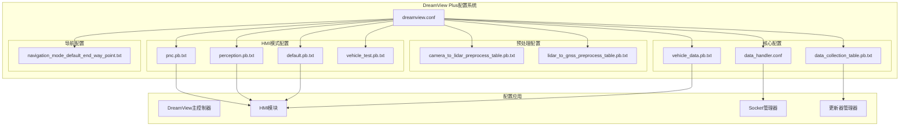
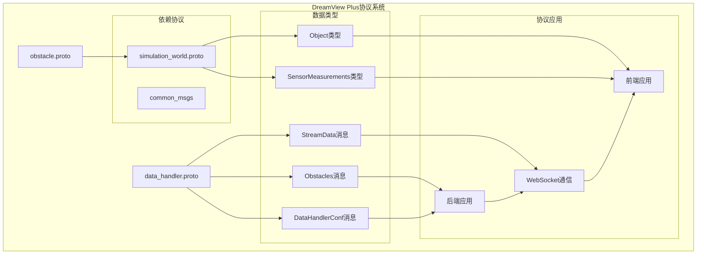

我来解析`conf`目录下的文件，了解DreamView Plus的配置系统。

Ran tool
Ran tool
Read file: conf/dreamview.conf
Read file: conf/data_handler.conf
Read file: conf/vehicle_data.pb.txt
Read file: conf/vehicle_data.pb.txt
Read file: conf/hmi_modes/README.md
Read file: conf/hmi_modes/default.pb.txt
Read file: conf/hmi_modes/default.pb.txt
Read file: conf/hmi_modes/perception.pb.txt
Read file: conf/hmi_modes/pnc.pb.txt
Read file: conf/data_collection_table.pb.txt
Read file: conf/camera_to_lidar_preprocess_table.pb.txt
Read file: conf/lidar_to_gnss_preprocess_table.pb.txt
Read file: conf/navigation_mode_default_end_way_point.txt
基于对`conf`目录下文件的深入分析，我来详细解析DreamView Plus的配置系统。

## DreamView Plus 配置系统解析

### 1. **配置目录结构**

```
conf/
├── dreamview.conf                                    # 主配置文件
├── data_handler.conf                                 # 数据处理器配置
├── vehicle_data.pb.txt                               # 车辆数据配置
├── data_collection_table.pb.txt                      # 数据收集表配置
├── camera_to_lidar_preprocess_table.pb.txt           # 摄像头到激光雷达预处理配置
├── lidar_to_gnss_preprocess_table.pb.txt             # 激光雷达到GNSS预处理配置
├── navigation_mode_default_end_way_point.txt         # 导航模式默认终点配置
└── hmi_modes/                                        # HMI模式配置目录
    ├── README.md                                     # 模式配置说明
    ├── default.pb.txt                                # 默认模式配置
    ├── perception.pb.txt                             # 感知模式配置
    ├── pnc.pb.txt                                    # PnC模式配置
    └── vehicle_test.pb.txt                           # 车辆测试模式配置
```

### 2. **主配置文件 (dreamview.conf)**

```bash
--flagfile=modules/common/data/global_flagfile.txt
--static_file_dir=modules/dreamview_plus/frontend/dist
--default_data_collection_config_path=modules/dreamview_plus/conf/data_collection_table.pb.txt
--default_preprocess_config_path=modules/dreamview_plus/conf/preprocess_table.pb.txt
--data_handler_config_path=modules/dreamview_plus/conf/data_handler.conf
--vehicle_data_config_filename=modules/dreamview_plus/conf/vehicle_data.pb.txt
--default_hmi_mode=Default
--server_ports=8888
```

**配置项说明**：
- **flagfile**: 全局标志文件路径
- **static_file_dir**: 前端静态文件目录
- **default_data_collection_config_path**: 默认数据收集配置路径
- **default_preprocess_config_path**: 默认预处理配置路径
- **data_handler_config_path**: 数据处理器配置路径
- **vehicle_data_config_filename**: 车辆数据配置文件名
- **default_hmi_mode**: 默认HMI模式
- **server_ports**: 服务器端口

### 3. **数据处理器配置 (data_handler.conf)**

```protobuf
data_handler_info {
  key: "apollo.dreamview.SimulationWorld",
  value {
    data_name: "simworld",
    msg_type: "apollo.dreamview.SimulationWorld",
    websocket_info {
      websocket_name: "simworld",
      websocket_pipe: "/simworld"
    }
  }
}
```

**配置的数据类型**：

| 数据类型            | 数据名称   | WebSocket名称 | WebSocket管道 |
| ------------------- | ---------- | ------------- | ------------- |
| **SimulationWorld** | simworld   | simworld      | /simworld     |
| **CameraUpdate**    | camera     | camera        | /camera       |
| **PointCloud**      | pointcloud | pointcloud    | /pointcloud   |
| **HMIStatus**       | hmistatus  | hmistatus     | /hmistatus    |
| **Map**             | map        | map           | /map          |
| **Obstacles**       | obstacle   | obstacle      | /obstacle     |
| **Cyber**           | cyber      | channelsinfo  | /channelsinfo |

**特殊配置**：
- **different_for_channels**: 支持多通道的数据类型（camera、pointcloud、obstacle、cyber）

### 4. **车辆数据配置 (vehicle_data.pb.txt)**

```protobuf
data_files {
  source_path: "vehicle_param.pb.txt"
  dest_path: "modules/common/data/vehicle_param.pb.txt"
}
data_files {
  source_path: "control_conf.pb.txt"
  dest_path: "modules/control/conf/control_conf.pb.txt"
}
```

**配置内容分类**：

#### **4.1 核心模块配置**
- **车辆参数**: `vehicle_param.pb.txt`
- **控制配置**: `control_conf.pb.txt`, `control.conf`
- **CAN总线**: `cancard_params`, `canbus_dag`

#### **4.2 传感器配置**
- **激光雷达**: `velodyne_params`, `lidar_params`
- **摄像头**: `camera_params`, `perception_camera_params`
- **雷达**: `radar_params`, `radar_conf`
- **GNSS**: `gnss_params`, `gnss_conf`

#### **4.3 定位配置**
- **外参**: `novatel_localization_extrinsics.yaml`
- **车辆参数**: `vehicle_params`
- **杠杆臂**: `ant_imu_leverarm.yaml`

#### **4.4 感知配置**
- **感知参数**: `perception_params`
- **感知配置**: `perception_conf`
- **传感器元数据**: `sensor_meta.pb.txt`

#### **4.5 其他模块配置**
- **规划**: `planning_conf`
- **定位**: `localization_conf`, `localization_dag`
- **V2X**: `v2x_conf`
- **遥操作**: `teleop_conf`

### 5. **HMI模式配置**

#### **5.1 默认模式 (default.pb.txt)**

```protobuf
modules {
  key: "Perception"
  value: {
    start_command: "nohup cyber_launch start modules/perception/launch/perception_all.launch &"
    stop_command: "nohup cyber_launch stop modules/perception/launch/perception_all.launch &"
    process_monitor_config {
      command_keywords: "start modules/perception/launch/perception_all.launch"
    }
  }
}
cyber_modules {
  key: "Planning"
  value: {
    dag_files: "modules/planning/planning_component/dag/planning.dag"
    dag_files: "modules/external_command/process_component/dag/external_command_process.dag"
  }
}
```

**包含的模块**：
- **传统模块**: Perception, TrafficLight, Lane, IndoorLocalization
- **Cyber模块**: Prediction, Planning, Control, TaskManager, Localization, Guardian, Canbus, GPS, Transform

**布局配置**：
```protobuf
layout: {
    direction: "row",
    first: { type: "vehicleViz" },
    second: {
        first: { type: "dashBoard" },
        second: {
            first: { type: "moduleDelay" },
            second: { type: "console" },
            direction: "column",
            splitPercentage: 40
        },
        direction: "column",
        splitPercentage: 33
    },
    splitPercentage: 66
}
```

#### **5.2 感知模式 (perception.pb.txt)**

**专门用于感知算法开发和调试**：
- **感知模块**: Perception, TrafficLight, Lane
- **摄像头模块**: CameraMultiStage, CameraSingleStage, CameraDriver
- **激光雷达模块**: LidarPerception, LidarDriver
- **雷达模块**: Radar
- **基础模块**: Prediction, Transform

#### **5.3 PnC模式 (pnc.pb.txt)**

**专门用于规划和控制模块开发**：
- **核心模块**: Planning, Prediction, Control
- **布局**: 包含PnC Monitor面板

### 6. **预处理配置**

#### **6.1 摄像头到激光雷达预处理 (camera_to_lidar_preprocess_table.pb.txt)**

```protobuf
camera_config {
  translation {
    x: 0.0
    y: 0.0
    z: 0.0
  }
  D: 0  # 畸变参数
  K: 0  # 内参矩阵
}
```

#### **6.2 激光雷达到GNSS预处理 (lidar_to_gnss_preprocess_table.pb.txt)**

```protobuf
lidar_config {
  sensor_name: "lidar16_left"
  translation {
    x: 0.0
    y: 0.0
    z: 0.0
  }
}
main_sensor: "lidar16_back"
```

### 7. **导航配置 (navigation_mode_default_end_way_point.txt)**

```protobuf
landmark {
    name: "POI: Cananda West",
    waypoint {
        pose {
          x: 558332.4387239887,
          y: 4151192.0907792537,
        }
    }
}
```

**包含的导航点**：
- **兴趣点**: Cananda West, Cananda East
- **路线**: Caribbean to Crossman, Crossman to Caribbean
- **高速公路**: 101 South, 101 North
- **测试路线**: Highway Offline Test Only

### 8. **配置系统架构图**



### 9. **配置系统特点**

#### **9.1 分层配置**
- **主配置**: 系统级配置参数
- **功能配置**: 各功能模块的专门配置
- **模式配置**: 不同使用场景的配置

#### **9.2 模块化设计**
- **独立配置**: 每个模块有独立的配置文件
- **统一管理**: 通过主配置文件统一管理
- **灵活切换**: 支持不同模式的快速切换

#### **9.3 标准化格式**
- **Protobuf**: 大部分配置使用Protobuf格式
- **文本配置**: 简单的文本配置文件
- **JSON兼容**: 支持JSON格式的配置

#### **9.4 可扩展性**
- **插件支持**: 支持插件配置
- **自定义模式**: 支持自定义HMI模式
- **动态配置**: 支持运行时配置更新

### 10. **配置管理流程**

#### **10.1 配置加载**
1. **主配置加载**: 读取`dreamview.conf`
2. **功能配置加载**: 根据主配置加载各功能配置
3. **模式配置加载**: 根据默认模式加载HMI配置
4. **验证配置**: 验证配置的完整性和正确性

#### **10.2 配置应用**
1. **初始化应用**: 在系统初始化时应用配置
2. **运行时更新**: 支持运行时配置更新
3. **模式切换**: 支持不同模式间的配置切换

#### **10.3 配置验证**
1. **格式验证**: 验证配置文件的格式正确性
2. **内容验证**: 验证配置内容的合理性
3. **依赖验证**: 验证配置间的依赖关系

### 11. **总结**

DreamView Plus的配置系统具有以下特点：

1. **完整性**: 覆盖系统所有功能模块的配置需求
2. **模块化**: 按功能模块组织配置文件
3. **标准化**: 使用统一的配置格式和规范
4. **灵活性**: 支持多种配置模式和动态切换
5. **可扩展性**: 支持插件和自定义配置
6. **易维护性**: 清晰的配置结构和文档说明

这个配置系统为DreamView Plus提供了强大、灵活、易用的配置管理能力，是整个系统稳定运行和功能扩展的重要基础。

我来解析`proto`目录下的文件，了解DreamView Plus的协议定义。

Ran tool
Ran tool
Read file: proto/obstacle.proto
Read file: proto/data_handler.proto
Ran tool
Read file: proto/BUILD
Search files...
基于对`proto`目录下文件的深入分析，我来详细解析DreamView Plus的协议定义系统。

## DreamView Plus 协议定义系统解析

### 1. **协议文件结构**

```
proto/
├── BUILD                                    # 构建配置文件
├── obstacle.proto                           # 障碍物协议定义
└── data_handler.proto                       # 数据处理器协议定义
```

### 2. **构建配置 (BUILD)**

```python
## Auto generated by `proto_build_generator.py`
load("//tools:apollo_package.bzl", "apollo_package")
load("//tools/proto:proto.bzl", "proto_library")

package(default_visibility = ["//visibility:public"])

proto_library(
    name = "dreamview_plus_data_handler_proto",
    srcs = ["data_handler.proto"],
)

proto_library(
    name = "dreamview_plus_obstacle_proto",
    srcs = ["obstacle.proto"],
    deps = [
        "//modules/common_msgs/dreamview_msgs:simulation_world_proto",
    ]
)

apollo_package()
```

**构建配置说明**：
- **自动生成**: 由`proto_build_generator.py`自动生成
- **两个协议库**: `dreamview_plus_data_handler_proto`和`dreamview_plus_obstacle_proto`
- **依赖关系**: `obstacle.proto`依赖`simulation_world.proto`

### 3. **障碍物协议 (obstacle.proto)**

```protobuf
syntax = "proto2";

package apollo.dreamview;

import "modules/common_msgs/dreamview_msgs/simulation_world.proto";

message Obstacles {
    repeated Object obstacle = 1;
    optional Object auto_driving_car = 2;
    map<string, SensorMeasurements> sensor_measurements = 3;
}
```

**协议结构分析**：

#### **3.1 消息定义**
- **Obstacles**: 障碍物集合消息
- **Object**: 从`simulation_world.proto`导入的对象类型
- **SensorMeasurements**: 从`simulation_world.proto`导入的传感器测量类型

#### **3.2 字段说明**
- **obstacle**: 重复字段，包含所有检测到的障碍物
- **auto_driving_car**: 可选字段，自动驾驶车辆信息
- **sensor_measurements**: 映射字段，按传感器ID组织的测量数据

### 4. **数据处理器协议 (data_handler.proto)**

```protobuf
syntax = "proto2";

package apollo.dreamview;

message WebsocketInfo {
  optional string websocket_name = 1;
  optional string websocket_pipe = 2;
}

message ChannelInfo {
  optional string channel_name = 1;
  optional string proto_path = 2;
  optional string msg_type = 3;
}

message DataHandlerInfo {
  optional string data_name = 1;
  optional string proto_path = 2;
  optional string msg_type = 3;
  optional WebsocketInfo websocket_info = 4;
  optional bool different_for_channels = 5 [default = false];
  repeated ChannelInfo channels = 6;
}

message DataHandlerConf {
  map<string, DataHandlerInfo> data_handler_info = 1;
}

message StreamData {
  optional string type = 1;
  optional string action = 2;
  optional string data_name = 3;
  optional string channel_name = 4;
  optional bytes data = 5;
}
```

**协议结构分析**：

#### **4.1 WebsocketInfo**
```protobuf
message WebsocketInfo {
  optional string websocket_name = 1;    // WebSocket名称
  optional string websocket_pipe = 2;    // WebSocket管道
}
```

#### **4.2 ChannelInfo**
```protobuf
message ChannelInfo {
  optional string channel_name = 1;      // 通道名称
  optional string proto_path = 2;        // Proto文件路径
  optional string msg_type = 3;          // 消息类型
}
```

#### **4.3 DataHandlerInfo**
```protobuf
message DataHandlerInfo {
  optional string data_name = 1;                    // 数据名称
  optional string proto_path = 2;                   // Proto文件路径
  optional string msg_type = 3;                     // 消息类型
  optional WebsocketInfo websocket_info = 4;        // WebSocket信息
  optional bool different_for_channels = 5;         // 是否支持多通道
  repeated ChannelInfo channels = 6;                // 通道信息列表
}
```

#### **4.4 DataHandlerConf**
```protobuf
message DataHandlerConf {
  map<string, DataHandlerInfo> data_handler_info = 1;  // 数据处理器信息映射
}
```

#### **4.5 StreamData**
```protobuf
message StreamData {
  optional string type = 1;              // 数据类型
  optional string action = 2;            // 动作类型
  optional string data_name = 3;         // 数据名称
  optional string channel_name = 4;      // 通道名称
  optional bytes data = 5;               // 二进制数据
}
```

### 5. **依赖的SimulationWorld协议**

从代码分析可以看出，DreamView Plus还依赖`simulation_world.proto`，其中包含：

#### **5.1 Object类型**
```protobuf
message Object {
  // 基本属性
  optional string id = 1;
  optional double position_x = 2;
  optional double position_y = 3;
  optional double heading = 4;
  optional double length = 5;
  optional double width = 6;
  optional double height = 7;
  optional double speed = 8;
  optional double speed_heading = 9;
  optional double timestamp_sec = 10;
  optional double confidence = 11;
  
  // 几何信息
  repeated PolygonPoint polygon_point = 12;
  
  // 类型信息
  optional Object_Type type = 13;
  optional Object_SubType sub_type = 14;
  
  // 传感器信息
  optional Object_Source source = 15;
  optional V2XInformation v2x_info = 16;
  
  // 决策信息
  repeated Decision decision = 17;
  
  // 预测轨迹
  repeated PredictionTrajectory prediction_trajectory = 18;
}
```

#### **5.2 SensorMeasurements类型**
```protobuf
message SensorMeasurements {
  repeated Object sensor_measurement = 1;
}
```

### 6. **协议在系统中的应用**

#### **6.1 在ObstacleUpdater中的应用**

```cpp
// 在obstacle_updater.cc中的使用
void ObstacleUpdater::SetObstacleSensorMeasurements(
    const PerceptionObstacle& obstacle, Object* world_object) {
  for (const auto& sensor : obstacle.measurements()) {
    Object* obj = (*(channel_updater->obstacle_objects_
                         .mutable_sensor_measurements()))[sensor.sensor_id()]
                      .add_sensor_measurement();
    obj->set_id(std::to_string(sensor.id()));
    obj->set_position_x(sensor.position().x());
    obj->set_position_y(sensor.position().y());
    obj->set_heading(sensor.theta());
    obj->set_length(sensor.length());
    obj->set_width(sensor.width());
    obj->set_height(sensor.height());
    SetObstacleType(sensor.type(), sensor.sub_type(), obj);
  }
}
```

#### **6.2 在SimulationWorldService中的应用**

```cpp
// 在simulation_world_service.cc中的使用
void SimulationWorldService::SetObstacleInfo(
    const PerceptionObstacle& obstacle, Object* world_object) {
  world_object->set_id(std::to_string(obstacle.id()));
  world_object->set_position_x(obstacle.position().x() + map_service_->GetXOffset());
  world_object->set_position_y(obstacle.position().y() + map_service_->GetYOffset());
  world_object->set_heading(obstacle.theta());
  world_object->set_length(obstacle.length());
  world_object->set_width(obstacle.width());
  world_object->set_height(obstacle.height());
  world_object->set_speed(std::hypot(obstacle.velocity().x(), obstacle.velocity().y()));
  world_object->set_speed_heading(std::atan2(obstacle.velocity().y(), obstacle.velocity().x()));
  world_object->set_timestamp_sec(obstacle.timestamp());
  world_object->set_confidence(obstacle.has_confidence() ? obstacle.confidence() : 1);
}
```

#### **6.3 在前端的应用**

```typescript
// 在前端enumTransformer.ts中的使用
replacer.registerTransformer(
    'apollo.dreamview.SimulationWorld',
    [
        '$.sensorMeasurements..sensorMeasurement[*].subType',
        '$.object[*].subType',
        '$.autoDrivingCar.subType',
        '$.trafficSignal.subType',
        '$.planningTrajectory[*].subType',
        '$.mainStop.subType',
        '$.mainDecision.subType',
        '$.gps.subType',
        '$.shadowLocalization.subType',
        '$.perceivedSignal[*].subType',
    ],
    enumTransformer(SubType),
);
```

### 7. **协议系统架构图**



### 8. **协议设计特点**

#### **8.1 模块化设计**
- **独立协议**: 每个功能模块有独立的协议定义
- **依赖管理**: 清晰的协议依赖关系
- **扩展性**: 支持新协议的添加

#### **8.2 类型安全**
- **强类型**: 使用Protobuf的强类型系统
- **版本兼容**: 支持协议版本演进
- **序列化**: 高效的二进制序列化

#### **8.3 跨语言支持**
- **C++**: 后端使用C++生成的协议代码
- **TypeScript**: 前端使用TypeScript生成的协议代码
- **一致性**: 保证前后端协议一致性

#### **8.4 性能优化**
- **二进制格式**: 高效的二进制传输
- **压缩支持**: 支持数据压缩
- **流式处理**: 支持大数据流处理

### 9. **协议使用流程**

#### **9.1 协议定义**
1. **编写.proto文件**: 定义消息结构和字段
2. **生成代码**: 使用protoc生成对应语言的代码
3. **注册协议**: 在构建系统中注册协议

#### **9.2 协议使用**
1. **序列化**: 将数据对象序列化为二进制格式
2. **传输**: 通过WebSocket传输二进制数据
3. **反序列化**: 在接收端反序列化为数据对象

#### **9.3 协议验证**
1. **格式验证**: 验证协议格式的正确性
2. **内容验证**: 验证协议内容的合理性
3. **版本检查**: 检查协议版本的兼容性

### 10. **总结**

DreamView Plus的协议定义系统具有以下特点：

1. **简洁性**: 协议定义简洁明了，易于理解
2. **扩展性**: 支持协议的扩展和演进
3. **类型安全**: 使用Protobuf提供强类型保证
4. **跨语言**: 支持C++和TypeScript等多种语言
5. **高性能**: 高效的二进制序列化和传输
6. **标准化**: 遵循Protobuf标准规范

这个协议系统为DreamView Plus提供了可靠、高效、类型安全的数据交换机制，是整个系统稳定运行和功能扩展的重要基础。

基于对DreamView Plus系统的深入分析，我来详细解释这个目录下的文件系统是如何使用的。

## DreamView Plus 文件系统使用架构

### 1. **整体文件系统架构**

```
dreamview_plus/
├── backend/           # 后端C++代码
├── frontend/          # 前端TypeScript/React代码
├── conf/              # 配置文件
├── proto/             # 协议定义
├── launch/            # 启动脚本
└── main.cc           # 主入口文件
```

### 2. **各目录的使用方式**

#### **2.1 Backend目录 - C++后端系统**

**使用方式**：
- **编译构建**: 使用Bazel构建系统编译C++代码
- **运行时加载**: 作为可执行文件运行，提供WebSocket服务
- **模块化设计**: 每个子目录代表一个功能模块

**核心模块**：
```cpp
// 主要组件及其作用
backend/
├── dreamview.cc/h          # 主控制器 - 系统入口和协调
├── hmi/                    # 人机交互 - 系统状态管理
├── socket_manager/         # WebSocket管理 - 前后端通信
├── updater/               # 数据更新器基类 - 数据推送框架
├── obstacle_updater/      # 障碍物数据 - 实时障碍物信息
├── point_cloud/           # 点云数据 - 3D环境感知
├── perception_camera/     # 摄像头数据 - 图像处理
├── map/                   # 地图服务 - 高精地图管理
├── simulation_world/      # 仿真世界 - 综合数据聚合
├── record_player/         # 记录播放 - 数据回放
├── channels_updater/      # 通道信息 - Cyber RT状态
└── dv_plugin/            # 插件系统 - 扩展功能
```

#### **2.2 Frontend目录 - 前端Web应用**

**使用方式**：
- **开发环境**: 使用Node.js和npm/yarn管理依赖
- **构建系统**: 使用Webpack打包TypeScript/React代码
- **运行时**: 在浏览器中运行，通过WebSocket与后端通信

**核心包结构**：
```
frontend/packages/
├── dreamview-core/        # 核心应用 - 主界面
├── dreamview-carviz/      # 3D可视化 - 车辆和环境渲染
├── dreamview-ui/          # UI组件库 - 可复用组件
├── dreamview-theme/       # 主题系统 - 样式管理
├── dreamview-lang/        # 国际化 - 多语言支持
├── dreamview-log/         # 日志系统 - 调试工具
├── dreamview-mock/        # 模拟数据 - 开发测试
└── dreamview-analysis/    # 分析工具 - 性能监控
```

#### **2.3 Conf目录 - 配置管理**

**使用方式**：
- **启动时加载**: 系统启动时读取配置文件
- **运行时更新**: 部分配置支持热更新
- **模式切换**: 不同HMI模式使用不同配置

**配置文件类型**：
```cpp
conf/
├── dreamview.conf                    # 主配置 - 系统参数
├── data_handler.conf                 # 数据处理器配置 - 数据流定义
├── vehicle_data.pb.txt              # 车辆配置 - 车型参数
├── hmi_modes/                       # HMI模式配置
│   ├── default.pb.txt              # 默认模式
│   ├── perception.pb.txt           # 感知模式
│   └── pnc.pb.txt                  # 规划控制模式
└── preprocessing_tables/            # 预处理配置
    ├── camera_to_lidar_*.pb.txt    # 传感器标定
    └── lidar_to_gnss_*.pb.txt      # 坐标转换
```

#### **2.4 Proto目录 - 协议定义**

**使用方式**：
- **代码生成**: 使用protoc编译器生成C++/TypeScript代码
- **数据序列化**: 定义前后端通信的数据格式
- **类型安全**: 确保数据结构的一致性

**协议文件**：
```protobuf
proto/
├── obstacle.proto        # 障碍物数据结构
├── data_handler.proto    # 数据处理器配置
└── BUILD                # 构建规则
```

### 3. **文件系统的运行时使用流程**

#### **3.1 启动流程**

```cpp
// 1. 主程序入口
int main() {
  Dreamview dreamview;
  dreamview.Init();      // 加载配置文件
  dreamview.Start();     // 启动所有组件
  return 0;
}

// 2. 初始化过程
Status Dreamview::Init() {
  // 加载配置文件
  LoadConfig();
  
  // 创建组件
  hmi_ = std::make_unique<HMI>();
  socket_manager_ = std::make_unique<SocketManager>();
  
  // 注册数据更新器
  RegisterUpdaters();
}
```

#### **3.2 数据流处理**

```cpp
// 1. 后端数据收集
class ObstacleUpdater {
  void OnTimer() {
    // 从Cyber RT读取数据
    auto obstacles = reader_->GetLatestObserved();
    
    // 数据转换
    ConvertToFrontendFormat(obstacles);
    
    // 推送到前端
    websocket_->BroadcastBinaryData(data);
  }
};

// 2. 前端数据接收
class WebSocketHandler {
  onMessage(data) {
    // 解析二进制数据
    const obstacles = proto.Obstacles.deserialize(data);
    
    // 更新UI组件
    updateObstacleDisplay(obstacles);
  }
};
```

#### **3.3 配置管理**

```cpp
// 1. 配置加载
class ConfigManager {
  void LoadConfig() {
    // 读取主配置文件
    LoadDreamviewConfig("conf/dreamview.conf");
    
    // 读取HMI模式配置
    LoadHMIModes("conf/hmi_modes/");
    
    // 读取车辆配置
    LoadVehicleConfig("conf/vehicle_data.pb.txt");
  }
};

// 2. 运行时配置更新
class HMI {
  void ChangeMode(const std::string& mode) {
    // 加载对应模式配置
    LoadModeConfig("conf/hmi_modes/" + mode + ".pb.txt");
    
    // 更新系统状态
    UpdateSystemStatus();
  }
};
```

### 4. **文件系统的关键特性**

#### **4.1 模块化设计**
- **松耦合**: 各模块独立开发、测试、部署
- **可扩展**: 通过插件系统支持功能扩展
- **可维护**: 清晰的目录结构和职责分离

#### **4.2 配置驱动**
- **灵活性**: 通过配置文件控制系统行为
- **环境适配**: 不同环境使用不同配置
- **热更新**: 部分配置支持运行时更新

#### **4.3 数据流管理**
- **实时性**: WebSocket确保数据实时传输
- **类型安全**: Proto定义确保数据结构一致
- **性能优化**: 二进制序列化减少传输开销

#### **4.4 开发支持**
- **测试数据**: 提供完整的测试数据集
- **模拟环境**: 支持离线开发和测试
- **调试工具**: 集成日志和监控功能

这个文件系统设计体现了现代软件工程的最佳实践，通过清晰的架构分层、模块化设计和配置驱动的方式，实现了高可维护性、高可扩展性的自动驾驶可视化系统。

我来解析`launch`目录下的文件，了解DreamView Plus的启动配置。

Ran tool
Read file: launch/dreamview_plus.launch
Search files...
基于对`launch`目录下文件的深入分析，我来详细解析DreamView Plus的启动配置系统。

## DreamView Plus 启动配置系统解析

### 1. **启动文件概述**

`launch/dreamview_plus.launch`是DreamView Plus的**Cyber RT启动配置文件**，定义了如何在Apollo Cyber RT环境中启动和管理DreamView Plus模块。

### 2. **启动文件详细分析**

#### **2.1 文件结构**

```xml
<cyber>
    <module>
        <name>dreamview_plus</name>
        <dag_conf></dag_conf>
        <type>binary</type>
        <process_name>
            dreamview_plus --flagfile=modules/dreamview_plus/conf/dreamview.conf
        </process_name>
        <exception_handler>respawn</exception_handler>
    </module>
</cyber>
```

#### **2.2 各配置项解析**

**`<name>dreamview_plus</name>`**
- **作用**: 定义模块名称
- **用途**: 在Cyber RT系统中标识此模块
- **重要性**: 用于模块管理和监控

**`<dag_conf></dag_conf>`**
- **作用**: 定义DAG（有向无环图）配置文件路径
- **当前状态**: 空值，表示DreamView Plus不使用DAG配置
- **原因**: DreamView Plus是独立运行的二进制程序，不依赖Cyber RT的DAG调度

**`<type>binary</type>`**
- **作用**: 指定模块类型为二进制可执行文件
- **区别**: 与`component`类型不同，`binary`类型直接运行可执行文件
- **优势**: 更灵活，可以独立控制进程生命周期

**`<process_name>`**
```bash
dreamview_plus --flagfile=modules/dreamview_plus/conf/dreamview.conf
```
- **作用**: 定义启动命令和参数
- **可执行文件**: `dreamview_plus`（由`main.cc`编译生成）
- **配置文件**: 通过`--flagfile`参数指定配置文件路径
- **配置内容**: 包含服务器端口、静态文件目录、数据处理器配置等

**`<exception_handler>respawn</exception_handler>`**
- **作用**: 定义异常处理策略
- **策略**: `respawn`表示进程异常退出时自动重启
- **重要性**: 确保DreamView Plus服务的持续可用性

### 3. **启动流程分析**

#### **3.1 Cyber RT启动流程**

```bash
# 1. 使用cyber_launch启动
cyber_launch start modules/dreamview_plus/launch/dreamview_plus.launch

# 2. Cyber RT解析launch文件
# 3. 创建进程并执行命令
dreamview_plus --flagfile=modules/dreamview_plus/conf/dreamview.conf

# 4. 如果进程异常退出，自动重启
```

#### **3.2 程序启动流程**

```cpp
// main.cc中的启动流程
int main(int argc, char* argv[]) {
  // 1. 设置工作目录
  SetWorkingDirectory();
  
  // 2. 解析命令行参数
  google::ParseCommandLineFlags(&argc, &argv, true);
  
  // 3. 设置信号处理器
  SetupSignalHandlers();
  
  // 4. 初始化性能监控
  InitProfiling();
  
  // 5. 初始化Cyber RT
  apollo::cyber::Init(argv[0]);
  
  // 6. 创建并启动DreamView
  apollo::dreamview::Dreamview dreamview;
  dreamview.Init();
  dreamview.Start();
  
  // 7. 等待关闭信号
  apollo::cyber::WaitForShutdown();
}
```

### 4. **配置文件关联分析**

#### **4.1 主配置文件 (dreamview.conf)**

```bash
--flagfile=modules/common/data/global_flagfile.txt
--static_file_dir=modules/dreamview_plus/frontend/dist
--default_data_collection_config_path=modules/dreamview_plus/conf/data_collection_table.pb.txt
--default_preprocess_config_path=modules/dreamview_plus/conf/preprocess_table.pb.txt
--data_handler_config_path=modules/dreamview_plus/conf/data_handler.conf
--vehicle_data_config_filename=modules/dreamview_plus/conf/vehicle_data.pb.txt
--default_hmi_mode=Default
--server_ports=8888
```

#### **4.2 配置层次结构**

```
启动层次:
1. cyber_launch start dreamview_plus.launch
   ↓
2. dreamview_plus --flagfile=dreamview.conf
   ↓
3. 加载各种配置文件
   ├── data_handler.conf (数据处理器配置)
   ├── vehicle_data.pb.txt (车辆配置)
   ├── hmi_modes/ (HMI模式配置)
   └── 其他配置文件
```

### 5. **启动系统的关键特性**

#### **5.1 进程管理**
- **自动重启**: 异常退出时自动重启，确保服务可用性
- **信号处理**: 优雅处理SIGTERM、SIGINT等信号
- **性能监控**: 支持CPU和内存性能分析

#### **5.2 配置管理**
- **分层配置**: 全局配置 + 模块特定配置
- **环境适配**: 支持不同环境的配置切换
- **热更新**: 部分配置支持运行时更新

#### **5.3 依赖管理**
- **Cyber RT集成**: 与Apollo Cyber RT系统无缝集成
- **模块协调**: 与其他Apollo模块协调工作
- **资源管理**: 合理分配和管理系统资源

### 6. **启动配置的优势**

#### **6.1 标准化**
- **统一接口**: 使用Cyber RT标准的启动接口
- **一致性**: 与其他Apollo模块保持一致的启动方式
- **可维护性**: 标准化的配置格式便于维护

#### **6.2 灵活性**
- **参数化**: 通过配置文件灵活控制启动参数
- **环境适配**: 支持不同部署环境的配置
- **扩展性**: 易于添加新的配置选项

#### **6.3 可靠性**
- **异常恢复**: 自动重启机制确保服务可靠性
- **监控支持**: 集成Cyber RT的监控和日志系统
- **调试友好**: 支持性能分析和调试工具

这个启动配置系统体现了Apollo平台的设计理念，通过标准化的启动接口、灵活的配置管理和可靠的进程管理，确保了DreamView Plus在各种环境下的稳定运行。

我来详细解析`main.cc`文件，了解DreamView Plus的主程序入口和启动逻辑。

Read file: main.cc
Search files...
基于对`main.cc`文件的深入分析，我来详细解析DreamView Plus的主程序入口和启动逻辑。

## DreamView Plus 主程序入口解析

### 1. **文件概述**

`main.cc`是DreamView Plus的**主程序入口点**，负责初始化系统环境、设置信号处理、启动性能监控、初始化Cyber RT框架，并启动DreamView服务。

### 2. **程序结构分析**

#### **2.1 头文件包含**

```cpp
#include <filesystem>                    // 文件系统操作
#include "gperftools/heap-profiler.h"    // 堆内存分析工具
#include "gperftools/malloc_extension.h" // 内存分配扩展
#include "gperftools/profiler.h"         // CPU性能分析工具
#include "cyber/common/global_data.h"    // Cyber RT全局数据
#include "cyber/init.h"                  // Cyber RT初始化
#include "modules/dreamview_plus/backend/dreamview.h" // DreamView主类
```

#### **2.2 主要功能模块**

### 3. **启动流程详细解析**

#### **3.1 工作目录设置**

```cpp
// 设置工作目录到APOLLO_RUNTIME_PATH
const char* apollo_runtime_path = std::getenv("APOLLO_RUNTIME_PATH");
if (apollo_runtime_path != nullptr) {
  if (std::filesystem::is_directory(
          std::filesystem::status(apollo_runtime_path))) {
    std::filesystem::current_path(apollo_runtime_path);
  }
}
```

**作用**：
- **环境适配**: 确保程序在正确的运行时环境中执行
- **路径解析**: 为相对路径的文件访问提供基础
- **部署兼容**: 支持不同部署环境下的路径配置

#### **3.2 命令行参数解析**

```cpp
google::ParseCommandLineFlags(&argc, &argv, true);
```

**作用**：
- **配置加载**: 解析命令行参数和配置文件
- **标志设置**: 设置各种运行时标志（如`FLAGS_dv_cpu_profile`）
- **参数验证**: 验证输入参数的有效性

#### **3.3 信号处理器设置**

```cpp
// SIGTERM信号处理
std::signal(SIGTERM, [](int sig) {
  apollo::cyber::OnShutdown(sig);
  if (FLAGS_dv_cpu_profile) {
    ProfilerStop();
  }
  if (FLAGS_dv_heap_profile) {
    HeapProfilerDump("Before shutdown");
    HeapProfilerStop();
  }
});

// SIGINT信号处理（Ctrl+C）
std::signal(SIGINT, [](int sig) {
  apollo::cyber::OnShutdown(sig);
  if (FLAGS_dv_cpu_profile) {
    ProfilerStop();
  }
  if (FLAGS_dv_heap_profile) {
    HeapProfilerDump("Before shutdown");
    HeapProfilerStop();
  }
});
```

**关键特性**：
- **优雅关闭**: 确保程序在收到终止信号时能够优雅地关闭
- **性能数据保存**: 在关闭前保存性能分析数据
- **资源清理**: 调用Cyber RT的关闭函数进行资源清理

#### **3.4 性能监控初始化**

```cpp
// CPU性能分析
if (FLAGS_dv_cpu_profile) {
  auto base_name_cpu = std::string(argv[0]) + "_cpu" + std::string(".prof");
  ProfilerStart(base_name_cpu.c_str());
}

// 堆内存分析
if (FLAGS_dv_heap_profile) {
  auto base_name_heap = std::string(argv[0]) + "_heap" + std::string(".prof");
  HeapProfilerStart(base_name_heap.c_str());
}
```

**性能监控功能**：
- **CPU分析**: 使用Google PerfTools进行CPU性能分析
- **内存分析**: 监控堆内存使用情况和内存泄漏
- **文件输出**: 生成`.prof`格式的性能报告文件

#### **3.5 Cyber RT初始化**

```cpp
apollo::cyber::GlobalData::Instance()->SetProcessGroup("dreamview_sched");
apollo::cyber::Init(argv[0]);
```

**初始化步骤**：
- **进程组设置**: 将DreamView Plus设置为`dreamview_sched`进程组
- **Cyber RT启动**: 初始化Apollo的实时操作系统框架
- **资源分配**: 分配Cyber RT所需的系统资源

#### **3.6 DreamView服务启动**

```cpp
apollo::dreamview::Dreamview dreamview;
const bool init_success = dreamview.Init().ok() && dreamview.Start().ok();
if (!init_success) {
  AERROR << "Failed to initialize dreamview server";
  return -1;
}
```

**启动流程**：
- **对象创建**: 创建DreamView主控制器实例
- **初始化**: 调用`Init()`方法进行系统初始化
- **启动**: 调用`Start()`方法启动所有服务
- **错误处理**: 检查启动是否成功，失败则退出

#### **3.7 等待关闭**

```cpp
apollo::cyber::WaitForShutdown();
return 0;
```

**运行状态**：
- **事件循环**: 进入Cyber RT的事件循环
- **信号等待**: 等待关闭信号
- **优雅退出**: 程序正常退出

### 4. **性能监控系统**

#### **4.1 性能标志**

```cpp
// 在dreamview_gflags.h中定义
DECLARE_bool(dv_cpu_profile);    // 启用CPU性能分析
DECLARE_bool(dv_heap_profile);   // 启用堆内存分析
```

#### **4.2 性能工具集成**

**Google PerfTools**：
- **CPU Profiler**: 分析函数调用频率和执行时间
- **Heap Profiler**: 监控内存分配和泄漏
- **Malloc Extension**: 提供内存分配统计信息

#### **4.3 性能数据输出**

```cpp
// CPU分析文件命名
auto base_name_cpu = std::string(argv[0]) + "_cpu" + std::string(".prof");
// 例如: dreamview_plus_cpu.prof

// 堆分析文件命名
auto base_name_heap = std::string(argv[0]) + "_heap" + std::string(".prof");
// 例如: dreamview_plus_heap.prof
```

### 5. **错误处理和日志**

#### **5.1 错误处理策略**

```cpp
if (!init_success) {
  AERROR << "Failed to initialize dreamview server";
  return -1;
}
```

**错误处理**：
- **初始化检查**: 验证DreamView服务初始化是否成功
- **错误日志**: 使用Apollo日志系统记录错误信息
- **优雅退出**: 初始化失败时返回错误码

#### **5.2 日志系统**

**Apollo日志级别**：
- `AERROR`: 错误信息
- `AWARN`: 警告信息
- `AINFO`: 信息日志
- `ADEBUG`: 调试信息

### 6. **程序特性总结**

#### **6.1 健壮性**
- **信号处理**: 正确处理SIGTERM和SIGINT信号
- **错误恢复**: 初始化失败时的优雅处理
- **资源管理**: 确保系统资源的正确分配和释放

#### **6.2 性能监控**
- **CPU分析**: 实时监控CPU使用情况
- **内存监控**: 检测内存泄漏和分配模式
- **性能报告**: 生成详细的性能分析报告

#### **6.3 可维护性**
- **模块化设计**: 清晰的初始化流程
- **配置驱动**: 通过标志控制程序行为
- **日志记录**: 完整的运行日志记录

#### **6.4 部署友好**
- **环境适配**: 支持不同部署环境
- **路径管理**: 灵活的工作目录设置
- **进程管理**: 与Cyber RT系统集成

这个主程序入口体现了现代C++应用程序的最佳实践，通过合理的初始化顺序、完善的错误处理、性能监控集成和优雅的关闭机制，确保了DreamView Plus在各种环境下的稳定运行。