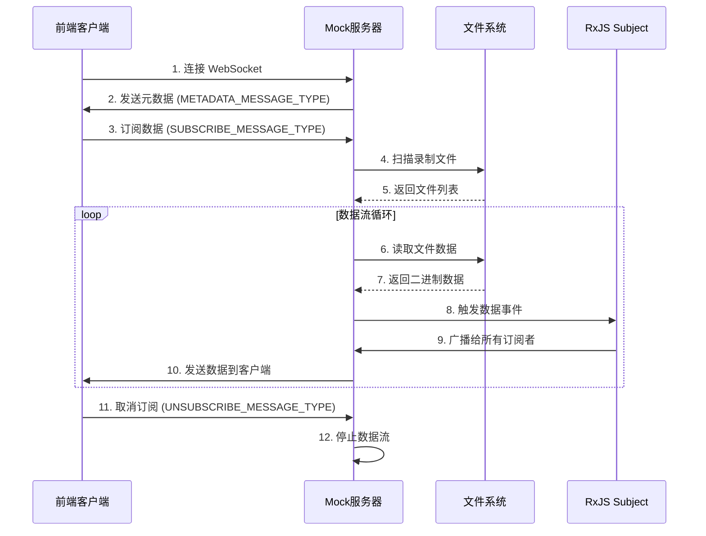
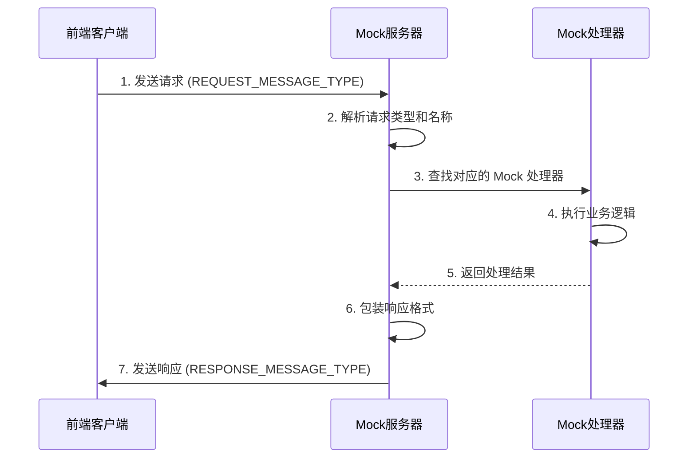

# Dreamview Plus 前端开发完整指南

## 目录
- [1. Dreamview Plus 前端启动指南](#1-dreamview-plus-前端启动指南)
- [2. 开发 Perception Obstacles 显示功能](#2-开发-perception-obstacles-显示功能)
- [3. Dreamview-Mock 功能和原理详解](#3-dreamview-mock-功能和原理详解)
- [4. 数据流模拟和请求响应机制](#4-数据流模拟和请求响应机制)

---

## 1. Dreamview Plus 前端启动指南

### 1.1 项目结构
Dreamview Plus 前端是一个基于 **Lerna** 管理的多包项目，使用 **Yarn** 作为包管理器。主要包含以下包：
- `dreamview-core`: 核心功能包
- `dreamview-web`: Web 平台包
- `dreamview-ui`: UI 组件库
- `dreamview-mock`: 模拟数据服务
- `dreamview-carviz`: 3D 可视化组件
- 其他支持包

### 1.2 启动步骤

#### 安装依赖
```bash
# 进入前端目录
cd modules/dreamview_plus/frontend

# 安装所有依赖（包括所有子包的依赖）
yarn install
```

#### 启动开发服务器
```bash
# 方式一：完整开发环境（推荐）
yarn web:dev
# 同时启动模拟数据服务和 Web 开发服务器

# 方式二：仅启动 Web 服务器
yarn web:serve

# 方式三：仅启动模拟数据服务
yarn dreamview:mock
```

#### 其他有用的命令
```bash
# 构建生产版本
yarn web:build

# 启动 Storybook 文档
yarn dreamview:doc

# 清理和重置
yarn clean
yarn clean:dep
```

### 1.3 访问地址
- **Web 应用**: `http://localhost:8080` (默认端口)
- **Storybook 文档**: `http://localhost:6006`

---

## 2. 开发 Perception Obstacles 显示功能

### 2.1 系统架构理解

#### 数据流向
```
Apollo Perception模块 → Cyber通道 → Dreamview Plus后端 → WebSocket → 前端Services → Store → UI组件
```

#### 核心组件
- **Services**: 负责与后端通信和数据订阅
- **Store**: 管理应用状态和数据
- **Util**: 提供工具函数和数据处理

### 2.2 创建的文件结构

#### 数据服务
**文件**: `modules/dreamview_plus/frontend/packages/dreamview-core/src/services/obstacle.service.ts`

```typescript
import { StreamApi } from './api/stream';
import { StreamDataNames } from './api/types';
import { BehaviorSubject, Observable } from 'rxjs';
import { map, filter } from 'rxjs/operators';
import { apollo } from '@dreamview/dreamview';

export interface ObstacleData {
  obstacles: apollo.perception.IPerceptionObstacle[];
  timestamp: number;
  channelName: string;
}

export class ObstacleService {
  private streamApi: StreamApi;
  private obstacleDataSubject = new BehaviorSubject<ObstacleData | null>(null);

  constructor(streamApi: StreamApi) {
    this.streamApi = streamApi;
  }

  // 订阅障碍物数据
  subscribeToObstacles(channelName: string): Observable<ObstacleData> {
    return this.streamApi
      .subscribeToDataWithChannel<apollo.perception.IPerceptionObstacles>(
        StreamDataNames.Obstacle, 
        channelName
      )
      .pipe(
        map((data: apollo.perception.IPerceptionObstacles) => ({
          obstacles: data.perception_obstacle || [],
          timestamp: data.header?.timestamp_sec || Date.now() / 1000,
          channelName
        })),
        filter(data => data.obstacles.length > 0)
      );
  }

  getCurrentObstacles(): ObstacleData | null {
    return this.obstacleDataSubject.value;
  }

  getObstacleData$(): Observable<ObstacleData | null> {
    return this.obstacleDataSubject.asObservable();
  }
}
```

#### 工具函数
**文件**: `modules/dreamview_plus/frontend/packages/dreamview-core/src/util/obstacle.util.ts`

```typescript
import { apollo } from '@dreamview/dreamview';

// 障碍物类型颜色映射
export const OBSTACLE_TYPE_COLORS = {
  UNKNOWN: '#808080',
  UNKNOWN_MOVABLE: '#FFA500',
  UNKNOWN_UNMOVABLE: '#8B4513',
  PEDESTRIAN: '#FF0000',
  BICYCLE: '#00FF00',
  VEHICLE: '#0000FF',
};

// 获取障碍物颜色
export const getObstacleColor = (obstacle: apollo.perception.IPerceptionObstacle): string => {
  const typeColor = OBSTACLE_TYPE_COLORS[obstacle.type] || '#808080';
  const subTypeColor = OBSTACLE_SUBTYPE_COLORS[obstacle.sub_type] || typeColor;
  return subTypeColor;
};

// 计算障碍物边界框
export const calculateObstacleBounds = (obstacle: apollo.perception.IPerceptionObstacle) => {
  const { position, length, width, height, theta } = obstacle;
  
  if (!position) return null;
  
  const cos = Math.cos(theta || 0);
  const sin = Math.sin(theta || 0);
  
  const halfLength = (length || 0) / 2;
  const halfWidth = (width || 0) / 2;
  
  const corners = [
    { x: -halfLength, y: -halfWidth },
    { x: halfLength, y: -halfWidth },
    { x: halfLength, y: halfWidth },
    { x: -halfLength, y: halfWidth },
  ].map(corner => ({
    x: (position.x || 0) + corner.x * cos - corner.y * sin,
    y: (position.y || 0) + corner.x * sin + corner.y * cos,
    z: position.z || 0
  }));
  
  return {
    corners,
    center: position,
    length: length || 0,
    width: width || 0,
    height: height || 0,
    theta: theta || 0
  };
};

// 过滤障碍物
export const filterObstacles = (
  obstacles: apollo.perception.IPerceptionObstacle[],
  filters: {
    types?: string[];
    minConfidence?: number;
    maxDistance?: number;
    egoPosition?: { x: number; y: number; z: number };
  }
): apollo.perception.IPerceptionObstacle[] => {
  return obstacles.filter(obstacle => {
    if (filters.types && !filters.types.includes(obstacle.type)) {
      return false;
    }
    
    if (filters.minConfidence && (obstacle.confidence || 0) < filters.minConfidence) {
      return false;
    }
    
    if (filters.maxDistance && filters.egoPosition && obstacle.position) {
      const distance = Math.sqrt(
        Math.pow((obstacle.position.x || 0) - filters.egoPosition.x, 2) +
        Math.pow((obstacle.position.y || 0) - filters.egoPosition.y, 2)
      );
      if (distance > filters.maxDistance) {
        return false;
      }
    }
    
    return true;
  });
};
```

#### 状态管理
**文件**: `modules/dreamview_plus/frontend/packages/dreamview-core/src/store/ObstacleStore/index.tsx`

```typescript
import React, { createContext, useContext, useReducer, useEffect, useState } from 'react';
import { apollo } from '@dreamview/dreamview';
import { ObstacleService, ObstacleData } from '../../services/obstacle.service';
import { useWebSocketServices } from '../../services/hooks/useWebSocketServices';

interface ObstacleState {
  obstacles: apollo.perception.IPerceptionObstacle[];
  selectedObstacle: apollo.perception.IPerceptionObstacle | null;
  isVisible: boolean;
  currentChannel: string | null;
  loading: boolean;
  error: string | null;
  filters: {
    types: string[];
    minConfidence: number;
    maxDistance: number;
  };
}

type ObstacleAction =
  | { type: 'SET_OBSTACLES'; payload: apollo.perception.IPerceptionObstacle[] }
  | { type: 'SELECT_OBSTACLE'; payload: apollo.perception.IPerceptionObstacle | null }
  | { type: 'SET_VISIBILITY'; payload: boolean }
  | { type: 'SET_CHANNEL'; payload: string }
  | { type: 'SET_LOADING'; payload: boolean }
  | { type: 'SET_ERROR'; payload: string | null }
  | { type: 'SET_FILTERS'; payload: Partial<ObstacleState['filters']> };

const obstacleReducer = (state: ObstacleState, action: ObstacleAction): ObstacleState => {
  switch (action.type) {
    case 'SET_OBSTACLES':
      return { ...state, obstacles: action.payload, loading: false, error: null };
    case 'SELECT_OBSTACLE':
      return { ...state, selectedObstacle: action.payload };
    case 'SET_VISIBILITY':
      return { ...state, isVisible: action.payload };
    case 'SET_CHANNEL':
      return { ...state, currentChannel: action.payload };
    case 'SET_LOADING':
      return { ...state, loading: action.payload };
    case 'SET_ERROR':
      return { ...state, error: action.payload, loading: false };
    case 'SET_FILTERS':
      return { ...state, filters: { ...state.filters, ...action.payload } };
    default:
      return state;
  }
};

const initialState: ObstacleState = {
  obstacles: [],
  selectedObstacle: null,
  isVisible: true,
  currentChannel: null,
  loading: false,
  error: null,
  filters: {
    types: [],
    minConfidence: 0,
    maxDistance: 100,
  },
};

const ObstacleContext = createContext<{
  state: ObstacleState;
  dispatch: React.Dispatch<ObstacleAction>;
  obstacleService: ObstacleService | null;
}>({
  state: initialState,
  dispatch: () => {},
  obstacleService: null,
});

export const ObstacleProvider: React.FC<{ children: React.ReactNode }> = ({ children }) => {
  const [state, dispatch] = useReducer(obstacleReducer, initialState);
  const { streamApi } = useWebSocketServices();
  const [obstacleService] = useState(() => streamApi ? new ObstacleService(streamApi) : null);

  useEffect(() => {
    if (!obstacleService || !state.currentChannel) return;

    dispatch({ type: 'SET_LOADING', payload: true });

    const subscription = obstacleService
      .subscribeToObstacles(state.currentChannel)
      .subscribe({
        next: (data: ObstacleData) => {
          dispatch({ type: 'SET_OBSTACLES', payload: data.obstacles });
        },
        error: (error) => {
          dispatch({ type: 'SET_ERROR', payload: error.message });
        }
      });

    return () => subscription.unsubscribe();
  }, [obstacleService, state.currentChannel]);

  return (
    <ObstacleContext.Provider value={{ state, dispatch, obstacleService }}>
      {children}
    </ObstacleContext.Provider>
  );
};

export const useObstacleStore = () => {
  const context = useContext(ObstacleContext);
  if (!context) {
    throw new Error('useObstacleStore must be used within ObstacleProvider');
  }
  return context;
};
```

#### UI 组件
**文件**: `modules/dreamview_plus/frontend/packages/dreamview-core/src/components/panels/ObstaclePanel/index.tsx`

```typescript
import React, { useState, useMemo } from 'react';
import { useTranslation } from 'react-i18next';
import { IconPark } from '@dreamview/dreamview-ui';
import { apollo } from '@dreamview/dreamview';
import { useObstacleStore } from '../../../store/ObstacleStore';
import { 
  getObstacleColor, 
  calculateObstacleBounds, 
  formatObstacleInfo,
  getObstacleTypeDisplayName,
  getObstacleSubTypeDisplayName,
  filterObstacles
} from '../../../util/obstacle.util';
import { usePanelContext } from '../base/store/PanelStore';
import Panel from '../base/Panel';
import './style.less';

interface ObstaclePanelProps {
  onObstacleSelect?: (obstacle: apollo.perception.IPerceptionObstacle | null) => void;
  className?: string;
}

const ObstaclePanel: React.FC<ObstaclePanelProps> = ({ onObstacleSelect, className }) => {
  const { t } = useTranslation('panels');
  const { state, dispatch } = useObstacleStore();
  const [hoveredObstacle, setHoveredObstacle] = useState<apollo.perception.IPerceptionObstacle | null>(null);
  const [showFilters, setShowFilters] = useState(false);
  const panelContext = usePanelContext();

  const handleObstacleClick = (obstacle: apollo.perception.IPerceptionObstacle) => {
    dispatch({ type: 'SELECT_OBSTACLE', payload: obstacle });
    onObstacleSelect?.(obstacle);
  };

  const handleObstacleHover = (obstacle: apollo.perception.IPerceptionObstacle | null) => {
    setHoveredObstacle(obstacle);
  };

  const handleChannelChange = (channel: string) => {
    dispatch({ type: 'SET_CHANNEL', payload: channel });
  };

  const handleVisibilityToggle = (visible: boolean) => {
    dispatch({ type: 'SET_VISIBILITY', payload: visible });
  };

  const handleFilterChange = (filterType: string, value: any) => {
    dispatch({ 
      type: 'SET_FILTERS', 
      payload: { [filterType]: value } 
    });
  };

  const filteredObstacles = useMemo(() => {
    return filterObstacles(state.obstacles, state.filters);
  }, [state.obstacles, state.filters]);

  if (state.loading) {
    return (
      <div className={`obstacle-panel ${className || ''}`}>
        <div className="obstacle-panel-loading">
          <IconPark name="Loading" />
          <span>Loading obstacles...</span>
        </div>
      </div>
    );
  }

  if (state.error) {
    return (
      <div className={`obstacle-panel ${className || ''}`}>
        <div className="obstacle-panel-error">
          <IconPark name="Warning" />
          <span>Error: {state.error}</span>
        </div>
      </div>
    );
  }

  return (
    <div className={`obstacle-panel ${className || ''}`}>
      <div className="obstacle-panel-header">
        <h3>Perception Obstacles ({filteredObstacles.length})</h3>
        <div className="obstacle-panel-controls">
          <button
            className="filter-toggle-btn"
            onClick={() => setShowFilters(!showFilters)}
          >
            <IconPark name="Filter" />
          </button>
          <label className="visibility-toggle">
            <input
              type="checkbox"
              checked={state.isVisible}
              onChange={(e) => handleVisibilityToggle(e.target.checked)}
            />
            Show Obstacles
          </label>
        </div>
      </div>

      {showFilters && (
        <div className="obstacle-panel-filters">
          <div className="filter-group">
            <label>Min Confidence:</label>
            <input
              type="range"
              min="0"
              max="1"
              step="0.1"
              value={state.filters.minConfidence}
              onChange={(e) => handleFilterChange('minConfidence', parseFloat(e.target.value))}
            />
            <span>{(state.filters.minConfidence * 100).toFixed(0)}%</span>
          </div>
          <div className="filter-group">
            <label>Max Distance:</label>
            <input
              type="range"
              min="10"
              max="200"
              step="10"
              value={state.filters.maxDistance}
              onChange={(e) => handleFilterChange('maxDistance', parseInt(e.target.value))}
            />
            <span>{state.filters.maxDistance}m</span>
          </div>
        </div>
      )}

      <div className="obstacle-list">
        {filteredObstacles.map((obstacle) => {
          const bounds = calculateObstacleBounds(obstacle);
          const color = getObstacleColor(obstacle);
          const isSelected = state.selectedObstacle?.id === obstacle.id;
          const isHovered = hoveredObstacle?.id === obstacle.id;
          
          if (!bounds) return null;
          
          return (
            <div
              key={obstacle.id}
              className={`obstacle-item ${isSelected ? 'selected' : ''} ${isHovered ? 'hovered' : ''}`}
              onClick={() => handleObstacleClick(obstacle)}
              onMouseEnter={() => handleObstacleHover(obstacle)}
              onMouseLeave={() => handleObstacleHover(null)}
              style={{ borderLeftColor: color }}
            >
              <div className="obstacle-info">
                <div className="obstacle-id">ID: {obstacle.id || 'N/A'}</div>
                <div className="obstacle-type">
                  {getObstacleTypeDisplayName(obstacle.type || 'UNKNOWN')}
                  {obstacle.sub_type && (
                    <span className="obstacle-subtype">
                      ({getObstacleSubTypeDisplayName(obstacle.sub_type)})
                    </span>
                  )}
                </div>
                <div className="obstacle-position">
                  ({bounds.center.x?.toFixed(2)}, {bounds.center.y?.toFixed(2)})
                </div>
                <div className="obstacle-confidence">
                  {((obstacle.confidence || 0) * 100).toFixed(1)}%
                </div>
              </div>
            </div>
          );
        })}
      </div>

      {state.selectedObstacle && (
        <div className="obstacle-details">
          <h4>Selected Obstacle Details</h4>
          <pre>{formatObstacleInfo(state.selectedObstacle)}</pre>
        </div>
      )}
    </div>
  );
};

// 包装成Panel组件
function ObstaclePanelWrapper(props: any) {
  const Component = useMemo(
    () =>
      Panel({
        PanelComponent: ObstaclePanel,
        panelId: props.panelId,
        subscribeInfo: [
          { name: 'obstacle', needChannel: true },
        ],
      }),
    [],
  );

  return <Component {...props} />;
}

ObstaclePanel.displayName = 'ObstaclePanel';

export default React.memo(ObstaclePanelWrapper);
```

### 2.3 系统集成

#### 修改 App.tsx
```typescript
// 在 modules/dreamview_plus/frontend/packages/dreamview-core/src/App.tsx 中
import { ObstacleProvider } from './store/ObstacleStore';

export function App() {
    const Providers = [
        <AppInitProvider key='AppInitProvider' />,
        <EventHandlersProvider key='EventHandlersProvider' />,
        <WebSocketManagerProvider key='WebSocketManagerProvider' />,
        <UserInfoStoreProvider key='UserInfoStoreProvider' />,
        <PanelCatalogProvider key='PanelCatalogProvider' />,
        <PanelLayoutStoreProvider key='PanelLayoutStoreProvider' />,
        <MenuStoreProvider key='MenuStoreProvider' />,
        <HmiStoreProvider key='HmiStoreProvider' />,
        <PickHmiStoreProvider key='PickHmiStoreProvider' />,
        <PanelInfoStoreProvider key='PanelInfoStoreProvider' />,
        <ObstacleProvider key='ObstacleProvider' />, // 新增
    ];

    return (
        <ThemeProvider>
            <DndProvider backend={HTML5Backend}>
                <GlobalStyles />
                <CombineContext providers={Providers}>
                    <InitAppData />
                    <PageLayout />
                </CombineContext>
            </DndProvider>
        </ThemeProvider>
    );
}
```

#### 注册面板组件
```typescript
// 在 modules/dreamview_plus/frontend/packages/dreamview-core/src/components/panels/type/Panel.ts 中
export enum PanelType {
    Console = 'console',
    ModuleDelay = 'moduleDelay',
    VehicleViz = 'vehicleViz',
    CameraView = 'cameraView',
    PointCloud = 'pointCloud',
    DashBoard = 'dashBoard',
    PncMonitor = 'pncMonitor',
    Components = 'components',
    MapCollect = 'MapCollect',
    Charts = 'charts',
    TerminalWin = 'terminalWin',
    ObstaclePanel = 'obstaclePanel', // 新增
}
```

#### 添加国际化支持
```typescript
// 英文翻译 - modules/dreamview_plus/frontend/packages/dreamview-lang/en/panels.ts
export const panels = {
    // ... 其他翻译
    obstaclePanelTitle: 'Obstacle Panel',
    obstaclePanelDescription: 'Panel to display perception obstacles data in real-time',
    obstaclePanelFeature1: 'Real-time obstacle detection and tracking',
    obstaclePanelFeature2: 'Obstacle type and confidence filtering',
    obstaclePanelFeature3: 'Interactive obstacle selection and details',
    obstaclePanelFeature4: 'Distance and speed information display',
};

// 中文翻译 - modules/dreamview_plus/frontend/packages/dreamview-lang/zh/panels.ts
export const panels = {
    // ... 其他翻译
    obstaclePanelTitle: '障碍物面板',
    obstaclePanelDescription: '实时显示感知障碍物数据的面板',
    obstaclePanelFeature1: '实时障碍物检测和跟踪',
    obstaclePanelFeature2: '障碍物类型和置信度过滤',
    obstaclePanelFeature3: '交互式障碍物选择和详情',
    obstaclePanelFeature4: '距离和速度信息显示',
};
```

---

## 3. Dreamview-Mock 功能和原理详解

### 3.1 概述

`dreamview-mock` 是一个用于模拟 Dreamview Plus 后端 WebSocket 服务器的 Node.js 模块。它的主要目的是在开发阶段提供模拟数据，让前端开发者可以在没有真实 Apollo 系统的情况下进行开发和测试。

### 3.2 核心功能

#### 3.2.1 模拟 WebSocket 服务器
- **端口**: 默认运行在 8888 端口
- **协议**: 支持 WebSocket 连接
- **路径**: 支持多个 WebSocket 路径（主连接、插件连接、数据流连接）

#### 3.2.2 两种通信模式

**发布订阅模式 (Pub/Sub)**
```typescript
// 客户端订阅数据
{
  action: "SUBSCRIBE_MESSAGE_TYPE",
  data: {
    info: {
      websocketName: "simworld",
      dataFrequencyMs: 100
    }
  }
}

// 服务器定时推送数据
server.triggerEvent(dataName, data);
```

**请求响应模式 (Request/Response)**
```typescript
// 客户端发送请求
{
  action: "REQUEST_MESSAGE_TYPE",
  data: {
    name: "CheckCertStatus",
    requestId: "req_123"
  }
}

// 服务器返回响应
{
  action: "RESPONSE_MESSAGE_TYPE",
  data: {
    info: {
      code: 0,
      data: responseData
    },
    requestId: "req_123"
  }
}
```

### 3.3 架构原理

#### 3.3.1 核心类 `MockSocketServer`

```typescript
class MockSocketServer {
  private server: http.Server;           // HTTP 服务器
  private wss: WebSocket.Server;         // WebSocket 服务器
  private mocks: Record<string, Mock>;   // 模拟数据配置
  private dataIntervals: Observable[];   // 数据推送间隔
}
```

#### 3.3.2 预配置的模拟数据

```typescript
// 仿真世界数据 (simworld)
server.addMock({
    dataName: 'simworld',
    subscribe: true,  // 支持订阅
    // 从 recordings/sensor_rgb-simworld-*.bin 文件加载数据
});

// 相机数据 (camera)
server.addMock({
    dataName: 'camera',
    channels: [
        '/apollo/sensor/camera/front_12mm/image',
        '/apollo/sensor/camera/front_6mm/image',
    ],
    differentForChannels: true,  // 不同通道有不同数据
    subscribe: true,
});

// 点云数据 (pointcloud)
server.addMock({
    dataName: 'pointcloud',
    channels: ["/apollo/sensor/velodyne64/compensator/PointCloud2"],
    differentForChannels: true,
    subscribe: true,
});

// 地图数据 (map)
server.addMock({
    dataName: 'map',
    subscribe: true,
});
```

### 3.4 录制和回放功能

#### 3.4.1 数据录制
```bash
# 录制 WebSocket 数据
yarn workspace @dreamview/dreamview-mock dreamview-record \
  -s "/simworld,/camera" \
  -d "./recordings" \
  -pre "sensor_rgb"
```

**功能**:
- 连接到真实的 WebSocket 服务器
- 录制二进制数据到文件
- 按时间戳命名文件: `sensor_rgb-simworld-1234567890.bin`

#### 3.4.2 数据回放
```bash
# 回放录制的数据
yarn workspace @dreamview/dreamview-mock dreamview-replay \
  -s "/simworld" \
  -d "./recordings" \
  -f 10  # 10Hz 频率
```

**功能**:
- 读取录制的二进制文件
- 按指定频率循环播放
- 模拟真实的数据流

### 3.5 使用场景

#### 3.5.1 前端开发
```bash
# 启动模拟服务器
yarn web:dev
# 这会同时启动:
# 1. dreamview-mock (端口 8888)
# 2. web 开发服务器 (端口 8080)
```

#### 3.5.2 数据录制
```bash
# 1. 启动真实 Apollo 系统
# 2. 录制数据
yarn workspace @dreamview/dreamview-mock dreamview-record \
  -s "/simworld,/camera,/pointcloud" \
  -h 127.0.0.1 -p 8888
```

#### 3.5.3 离线开发
```bash
# 使用录制的数据进行开发
yarn workspace @dreamview/dreamview-mock dreamview-replay \
  -s "/simworld" -f 5
```

---

## 4. 数据流模拟和请求响应机制

### 4.1 数据流模拟机制

#### 4.1.1 基于 RxJS 的流式数据处理

```typescript
// 核心数据流生成器
private streamFileLoader(dataName: string, dataFrequencyMs = 100) {
    // 1. 扫描录制文件
    const files = fs.readdirSync(dir)
        .filter(filename => filename.startsWith(`sensor_rgb-${dataName}`))
        .map(filename => path.join(dir, filename))
        .sort(); // 按文件名排序，确保时间顺序

    // 2. 文件缓存机制
    const fileCache: Record<string, Buffer> = {};

    // 3. 创建定时器 Observable
    if (!this.dataIntervals[dataName]) {
        this.dataIntervals[dataName] = interval(dataFrequencyMs);
    }

    // 4. 组合流式处理
    return this.dataIntervals[dataName]
        .pipe(
            take(files.length),        // 只取文件数量个时间点
            concatMap((i) => {         // 顺序映射每个文件
                if (fileCache[files[i]]) {
                    return of(fileCache[files[i]]); // 使用缓存
                } else {
                    const data = fs.readFileSync(files[i]);
                    fileCache[files[i]] = data;     // 缓存文件
                    return of(data);
                }
            }),
            repeat() // 无限循环播放
        );
}
```

#### 4.1.2 数据流分发机制

```typescript
// 当客户端订阅数据时
if (action === RequestMessageActionEnum.SUBSCRIBE_MESSAGE_TYPE) {
    const dataName = parsedMessage.data.info.websocketName;
    const dataFrequencyMs = parsedMessage.data.info.dataFrequencyMs;
    const channelName = parsedMessage.data.info.channelName;
    
    // 创建订阅标识
    const mocksTag = `${dataName}${channelName ? `_${channelName}` : ''}`;
    
    // 启动数据流
    this.mocks[mocksTag].subscription = this.streamFileLoader(dataName, dataFrequencyMs)
        .subscribe((data) => {
            this.triggerEvent(dataName, data); // 触发数据分发
        });
}
```

#### 4.1.3 数据广播机制

```typescript
// 数据触发和广播
triggerEvent(dataName: string, data: any) {
    const mock = this.mocks[dataName];
    if (mock) {
        mock.subject.next(data); // 通过 Subject 广播数据
    }
}

// 在 addMock 中设置数据广播
addMock(mock: Mock) {
    const subject = new Subject();
    const socket = new WebSocket.Server({ noServer: true });
    
    if (mock.subscribe && mock.dataName) {
        subject.subscribe((data) => {
            if (mock.subscribe) {
                // 向所有连接的客户端广播数据
                socket.clients.forEach((client) => {
                    if (client.readyState === WebSocket.OPEN) {
                        if (data instanceof Buffer) {
                            client.send(data); // 发送二进制数据
                        }
                    }
                });
            }
        });
    }
}
```

### 4.2 请求响应接口机制

#### 4.2.1 请求处理流程

```typescript
// 消息处理入口
ws.on('message', (data) => {
    if (data instanceof Buffer) {
        const stringMessage = data.toString();
        const parsedMessage = JSON.parse(stringMessage) as RequestMessage<any>;
        const action = parsedMessage?.action;
        
        // 处理请求响应消息
        if (action == RequestMessageActionEnum.REQUEST_MESSAGE_TYPE) {
            this.handleMessage(parsedMessage, parsedMessage, ws);
        }
    }
});
```

#### 4.2.2 请求路由和分发

```typescript
private handleMessage<T>(parsedMessage: RequestMessage<any>, data: RequestMessage<T>, ws: WebSocket) {
    const type = parsedMessage?.type;      // 请求类型 (如 "PluginRequest")
    const name = parsedMessage?.data?.name; // 请求名称 (如 "CheckCertStatus")
    
    // 根据类型和名称查找对应的 Mock 处理器
    const filterMocks = Object.keys(this.mocks).filter((mockName) =>
        this.mocks[mockName].mockType === type && 
        this.mocks[mockName].mockName === name
    );
    
    if (filterMocks.length > 0) {
        const mock = this.mocks[filterMocks[0]];
        const responseData = mock.response && mock.response(data);
        
        if (responseData) {
            // 异步处理响应
            const responseObservable = from(responseData);
            responseObservable.subscribe(
                (responseData) => ws.send(responseData), // 发送响应
                (error) => console.error('Error in response function:', error)
            );
        }
    }
}
```

#### 4.2.3 响应包装和格式化

```typescript
private wrapResponse<T>(func: (data: RequestMessage<T>) => Promise<any>) {
    return async (data: RequestMessage<T>) => {
        try {
            const result = await func(data);
            
            // 成功响应格式
            const response: ResponseMessage<any> = {
                action: ResponseMessageActionEnum.RESPONSE_MESSAGE_TYPE,
                data: {
                    name: data.data.name,
                    source: 'dreamview',
                    info: {
                        code: 0,
                        message: 'success',
                        data: result, // 实际响应数据
                    },
                    target: 'dreamview',
                    sourceType: 'dreamview',
                    targetType: 'dreamview',
                    requestId: data.data.requestId, // 保持请求ID
                },
            };
            return JSON.stringify(response);
        } catch (e) {
            // 错误响应格式
            const errorResponse: ResponseMessage<null> = {
                action: ResponseMessageActionEnum.RESPONSE_MESSAGE_TYPE,
                data: {
                    name: data.data.name,
                    source: 'dreamview',
                    info: {
                        code: -1,
                        message: 'fail',
                        data: null,
                    },
                    target: 'dreamview',
                    sourceType: 'dreamview',
                    targetType: 'dreamview',
                    requestId: data.data.requestId,
                },
            };
            return JSON.stringify(errorResponse);
        }
    };
}
```

### 4.3 数据流时序图



### 4.4 请求响应时序图



### 4.5 关键技术特点

#### 4.5.1 文件缓存优化
```typescript
const fileCache: Record<string, Buffer> = {};
// 避免重复读取文件，提高性能
if (fileCache[files[i]]) {
    return of(fileCache[files[i]]);
} else {
    const data = fs.readFileSync(files[i]);
    fileCache[files[i]] = data;
    return of(data);
}
```

#### 4.5.2 多通道支持
```typescript
if (mock.differentForChannels) {
    mock.channels?.forEach(channel => {
        this.mocks[`${mock.dataName}_${channel}`] = { subject, socket };
    });
}
```

#### 4.5.3 频率控制
```typescript
// 每个数据流可以有不同的推送频率
if (!this.dataIntervals[dataName]) {
    this.dataIntervals[dataName] = interval(dataFrequencyMs);
}
```

### 4.6 总结

`dreamview-mock` 通过以下机制实现了完整的数据模拟：

1. **数据流模拟**: 使用 RxJS 流式处理，从录制文件循环读取数据，按指定频率推送给客户端
2. **请求响应模拟**: 通过类型和名称路由请求到对应的处理器，异步执行并返回格式化响应
3. **多通道支持**: 支持不同数据类型的多个通道，每个通道可以独立配置
4. **性能优化**: 文件缓存、流式处理、背压控制等机制确保高性能
5. **错误处理**: 完善的错误捕获和响应机制

这种设计使得前端开发者可以在没有真实 Apollo 系统的情况下，获得与真实环境完全一致的数据体验。

---

## 5. 快速开始

### 5.1 环境准备
```bash
# 确保已安装 Node.js 和 Yarn
node --version
yarn --version

# 进入项目目录
cd modules/dreamview_plus/frontend
```

### 5.2 安装依赖
```bash
yarn install
```

### 5.3 启动开发环境
```bash
# 启动完整开发环境
yarn web:dev
```

### 5.4 访问应用
- 打开浏览器访问 `http://localhost:8080`
- 在面板列表中找到 "Obstacle Panel" 并添加
- 选择正确的 perception obstacles 通道
- 开始查看实时障碍物数据

### 5.5 故障排除
1. **依赖问题**: 运行 `yarn clean:dep && yarn install`
2. **构建问题**: 检查 TypeScript 编译错误
3. **数据问题**: 确保后端正在运行并发送 perception obstacles 数据
4. **面板不显示**: 检查控制台是否有错误信息

---

## 6. 扩展开发

### 6.1 添加新的数据流
```typescript
// 在 src/api/index.ts 中添加
server.addMock({
    dataName: 'obstacle',  // 数据名称
    channels: ['/apollo/perception/obstacles'],  // 通道列表
    differentForChannels: true,  // 是否按通道区分
    subscribe: true,  // 是否支持订阅
    websocketInfo: {
        websocketName: 'obstacle',
        websocketPipe: 'obstacle',
    },
});
```

### 6.2 添加请求响应接口
```typescript
server.addMock({
    mockType: 'PluginRequest',
    mockName: 'GetVehicleInfo',
    response: async (data) => {
        return JSON.stringify({
            vehicleId: 'test_vehicle',
            status: 'online'
        });
    }
});
```

### 6.3 自定义 UI 组件
参考 `ObstaclePanel` 的实现，创建自己的面板组件：
1. 创建组件文件
2. 添加样式文件
3. 注册到面板目录
4. 添加国际化支持
5. 集成到系统中

---

## 7. 总结

本指南详细介绍了 Dreamview Plus 前端开发的完整流程，包括：

1. **项目启动**: 如何正确启动前端开发环境
2. **功能开发**: 如何开发 perception obstacles 显示功能
3. **模拟服务**: 如何理解和使用 dreamview-mock
4. **数据流**: 如何模拟数据流和请求响应接口

通过这个指南，你可以：
- 快速上手 Dreamview Plus 前端开发
- 理解系统的架构和设计原理
- 开发自己的功能模块
- 使用模拟数据进行开发和测试

希望这个指南能帮助你更好地理解和使用 Dreamview Plus 前端系统！
