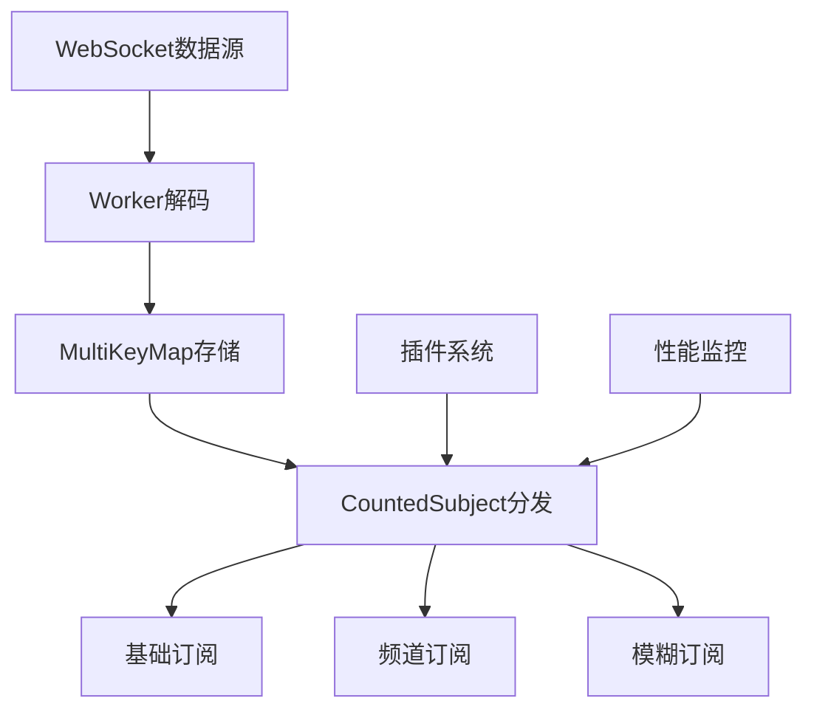
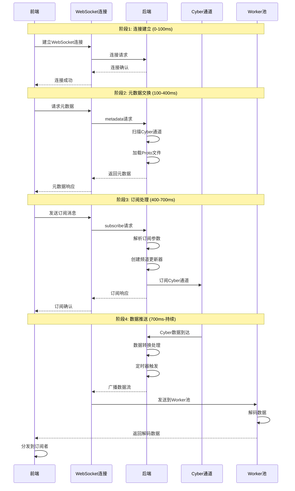

# Dreamview Plus 前端代码结构完整分析

## 目录
1. [整体架构分析](#1-整体架构分析)
2. [服务层详细分析](#2-服务层详细分析)
3. [数据订阅机制分析](#3-数据订阅机制分析)
4. [前后端交互时间线](#4-前后端交互时间线)
5. [Store实现机制](#5-store实现机制)
6. [WebSocketManagerStore实现](#6-websocketmanagerstore实现)

---

## 1. 整体架构分析

### 1.1 架构概览

Dreamview Plus 采用现代化的前端架构，基于 **Monorepo** 模式，使用 **Lerna** 进行包管理：

- **技术栈**: React 18 + TypeScript + Webpack 5
- **包管理**: Lerna + Yarn Workspaces
- **状态管理**: 自定义 Store 系统（基于 RxJS）
- **UI框架**: 自研组件库 + Emotion 样式系统
- **3D渲染**: Three.js + 自研 CarViz 组件

### 1.2 包结构分析

```
packages/
├── dreamview-core/          # 核心业务逻辑包
├── dreamview-web/           # Web平台入口包
├── dreamview-ui/            # UI组件库
├── dreamview-carviz/        # 3D可视化引擎
├── dreamview-theme/         # 主题系统
├── dreamview-lang/          # 国际化支持
├── dreamview-log/           # 日志系统
├── dreamview-mock/          # Mock服务
├── dreamview-analysis/      # 数据分析工具
└── dreamview-debug/         # 调试工具
```

### 1.3 核心组件系统

**面板系统架构**:
- 模块化面板设计
- 支持拖拽布局
- 动态面板注册
- 面板间通信机制

**状态管理架构**:
- 基于RxJS的响应式状态管理
- 多层Store架构
- 中间件系统支持
- 状态持久化机制

---

## 2. 服务层详细分析

### 2.1 服务层整体架构

```
services/
├── WebSocketManager/          # WebSocket 连接管理
│   ├── websocket-manager.service.ts    # 核心 WebSocket 管理器
│   ├── websocket-connect.service.ts    # WebSocket 连接服务
│   ├── connection-manager.ts           # 连接管理器
│   ├── plugins/                        # 插件系统
│   └── type.ts                        # 类型定义
├── api/                        # API 服务层
│   ├── main.ts                 # 主 API 服务
│   ├── plugin.ts               # 插件 API 服务
│   ├── stream.ts               # 流数据 API 服务
│   ├── other.ts                # 其他 API 服务
│   └── types.ts                # API 类型定义
└── hooks/                      # 服务相关 Hooks
    └── useWebSocketServices.ts # WebSocket 服务 Hook
```

### 2.2 WebSocket管理器核心功能

**多连接架构**:
- 主连接：处理核心业务数据
- 插件连接：处理插件相关数据
- 仿真连接：处理仿真数据

**高性能数据流**:
- Worker池解码
- 节流控制
- LRU缓存
- 数据去重

**插件系统**:
- 流入插件：处理数据进入时的逻辑
- 流出插件：处理数据输出时的转换
- 自定义插件支持

---

## 3. 数据订阅机制分析

### 3.1 三种订阅模式

**基础订阅**:
```typescript
subscribeToData<T>(name: string)
```

**频道订阅**:
```typescript
subscribeToDataWithChannel<T>(name: string, channel: string)
```

**模糊订阅**:
```typescript
subscribeToDataWithChannelFuzzy<T>(name: string)
```

### 3.2 数据流架构



### 3.3 订阅消息格式

**前端发送订阅消息**:
```json
{
    "action": "subscribe",
    "type": "subscribe",
    "data": {
        "name": "subscribe",
        "source": "dreamview",
        "info": {
            "websocketName": "obstacle",
            "channelName": "/apollo/perception/obstacles",
            "dataFrequencyMs": 100,
            "param": {
                "filterType": "all",
                "maxDistance": 100.0
            }
        },
        "target": "module",
        "sourceType": "websocktSubscribe",
        "targetType": "module",
        "requestId": "subscribe_obstacle_001"
    }
}
```

**后端返回订阅响应**:
```json
{
    "action": "response",
    "data": {
        "info": {
            "code": 0,
            "message": "Subscription successful",
            "error_msg": "",
            "data": {
                "name": "subscribe",
                "source": "dreamview",
                "info": {
                    "websocketName": "obstacle",
                    "channelName": "/apollo/perception/obstacles",
                    "dataFrequencyMs": 100
                },
                "target": "module",
                "sourceType": "websocktSubscribe",
                "targetType": "module",
                "requestId": "subscribe_obstacle_001"
            }
        }
    }
}
```

---

## 4. 前后端交互时间线

### 4.1 完整交互时序图



### 4.2 详细时间线分析

| 时间范围 | 阶段 | 前端操作 | 后端操作 | 关键特性 |
|---------|------|---------|---------|---------|
| 0-100ms | 连接建立 | WebSocket连接初始化 | 接收连接请求 | 重试机制 |
| 100-400ms | 元数据交换 | 请求元数据，加载Proto | 扫描通道，返回元数据 | 异步加载 |
| 400-700ms | 订阅处理 | 发送订阅消息 | 创建更新器，订阅通道 | 参数验证 |
| 700ms+ | 数据推送 | Worker解码，数据分发 | 定时推送，数据转换 | 持续流式 |

---

## 5. Store实现机制

### 5.1 Store核心实现

```typescript
class Store<S, A> {
    // 1. 响应式状态管理 - 基于RxJS BehaviorSubject
    private state: BehaviorSubject<S>;
    
    // 2. 状态更新函数 - 纯函数式Reducer
    private readonly reducer: (state: S, action: A) => S;
    
    // 3. 中间件链 - 可插拔的功能扩展
    private middleware: ((store: Store<S, A>, next: (action: A) => void, action: A) => void)[] = [];

    constructor(initialState: S, reducer: (state: S, action: A) => S) {
        // 初始化响应式状态
        this.state = new BehaviorSubject(initialState);
        this.reducer = reducer;
    }

    // 4. 状态获取 - 同步获取当前状态
    getState() {
        return this.state.getValue();
    }

    // 5. Action分发 - 中间件链式处理
    dispatch = (action: A) => {
        const dispatchChain = this.middleware
            .reverse() // 反转中间件顺序
            .reduce((next, middleware) => (action) => middleware(this, next, action), this.baseDispatch.bind(this));
        dispatchChain(action);
    };

    // 6. 基础分发 - 执行Reducer更新状态
    private baseDispatch(action: A) {
        const newState = this.reducer(this.getState(), action);
        this.state.next(newState); // 触发响应式更新
    }

    // 7. 状态订阅 - 响应式状态监听
    subscribe(listener: (state: S) => void) {
        return this.state.subscribe(listener);
    }
}
```

### 5.2 Store实例化情况

**全局Store层**:
- WebSocketManagerStore: WebSocket连接管理
- UserInfoStore: 用户信息管理
- HmiStore: HMI状态管理
- MenuStore: 菜单状态管理
- PanelLayoutStore: 面板布局管理
- PanelInfoStore: 面板信息管理

**功能Store层**:
- PickHmiStore: HMI状态选择器
- EventHandlersStore: 事件处理管理
- ThemeProviderStore: 主题管理
- PanelCatalogStore: 面板目录管理

**组件Store层**:
- VizStore: 3D可视化状态管理
- PanelInnerStore: 面板内部状态管理
- PageLayoutStore: 页面布局管理

### 5.3 中间件系统

**内置中间件**:
- asyncActionMiddleware: 异步Action处理
- loggerMiddleware: 日志记录
- crashReporterMiddleware: 错误处理
- reduxDevToolsMiddleware: Redux DevTools支持

**中间件链式处理**:
```typescript
dispatch = (action: A) => {
    const dispatchChain = this.middleware
        .reverse() // 反转顺序，确保执行顺序正确
        .reduce((next, middleware) => (action) => middleware(this, next, action), this.baseDispatch.bind(this));
    dispatchChain(action);
};
```

---

## 6. WebSocketManagerStore实现

### 6.1 状态定义

```typescript
export interface IInitState {
    metadata: MetadataItem[];           // 元数据列表
    mainApi: MainApi;                   // 主API服务实例
    pluginApi: PluginApi;               // 插件API服务实例
    streamApi: StreamApi;               // 流数据API服务实例
    otherApi: OtherApi;                 // 其他API服务实例
    webSocketManager: WebSocketManager; // WebSocket管理器实例
}

export const initState: IInitState = {
    metadata: [],
    mainApi: new MainApi(),
    pluginApi: new PluginApi(),
    streamApi: new StreamApi(),
    otherApi: new OtherApi(),
    webSocketManager,
};
```

### 6.2 API服务集成

**MainApi - 主API服务**:
- 管理主WebSocket连接
- 处理HMI相关请求
- 提供数据记录、地图管理、路径规划等功能

**StreamApi - 流数据API服务**:
- 提供数据订阅接口
- 支持三种订阅模式
- 简化数据订阅操作

**PluginApi - 插件API服务**:
- 管理插件WebSocket连接
- 处理插件相关请求
- 提供账户管理、动态模型、场景集等功能

**OtherApi - 其他API服务**:
- 管理其他WebSocket连接
- 提供Socket实例管理
- 支持仿真连接等特殊连接

### 6.3 连接管理机制

```typescript
useEffect(() => {
    // 主连接管理
    store.mainApi.webSocketManager.connectMain().subscribe((status) => {
        if (status === ConnectionStatusEnum.METADATA) {
            const metadata = store.mainApi.webSocketManager.getMetadata();
            // 检查是否包含仿真模块
            if (metadata.find((item) => item.dataName === StreamDataNames.SIM_HMI_STATUS)) {
                // 触发仿真模块连接
                store.otherApi.getSocketIns(SocketNameEnum.SIMULATION);
            }
            mainConnectionRef.current.publish('main:connection successful');
        }
    });

    // 插件连接管理
    store.pluginApi.webSocketManager.connectPlugin().subscribe((status) => {
        if (status === ConnectionStatusEnum.CONNECTED) {
            pluginConnectionRef.current.publish('plugin:connection successful');
        }
    });

    // 清理函数
    return () => {
        store.mainApi.webSocketManager.disconnect();
        store.pluginApi.webSocketManager.disconnect();
    };
}, [store.mainApi, store.pluginApi]);
```

### 6.4 自定义Hook实现

```typescript
// API服务Hook
export function useMainApi(): MainApi {
    const [store] = useStore();
    return store?.mainApi;
}

export function useStreamApi(): StreamApi {
    const [store] = useStore();
    return store?.streamApi;
}

// 元数据Hook
export function useMetadata(): [MetadataItem[], (metadata: MetadataItem[]) => void] {
    const [store] = useStore();
    return [
        store?.metadata,
        (metadata) => {
            store?.mainApi?.webSocketManager?.setMetadata(metadata);
        },
    ];
}

// WebSocket管理器Hook
export function useWebSocketManager(): WebSocketManager {
    const [store] = useStore();
    return store?.mainApi?.webSocketManager;
}
```

---

## 总结

Dreamview Plus 是一个高度模块化、功能丰富的自动驾驶数据可视化平台，采用了现代前端工程的最佳实践：

### 核心特点

1. **模块化架构**: 基于Monorepo的模块化设计
2. **响应式编程**: 基于RxJS的响应式状态管理
3. **高性能**: Worker池、节流控制、缓存优化
4. **类型安全**: 完整的TypeScript类型支持
5. **可扩展性**: 插件系统、中间件系统支持

### 技术亮点

1. **数据订阅机制**: 三种订阅模式满足不同需求
2. **WebSocket管理**: 多连接架构和智能连接管理
3. **状态管理**: 多层Store架构和响应式更新
4. **性能优化**: 多级优化策略确保高效运行
5. **开发体验**: 完善的开发工具和调试支持

这个架构为自动驾驶数据可视化提供了强大而灵活的基础，能够满足从简单到复杂的各种使用场景，为开发者提供了优秀的开发体验和强大的功能支持。

