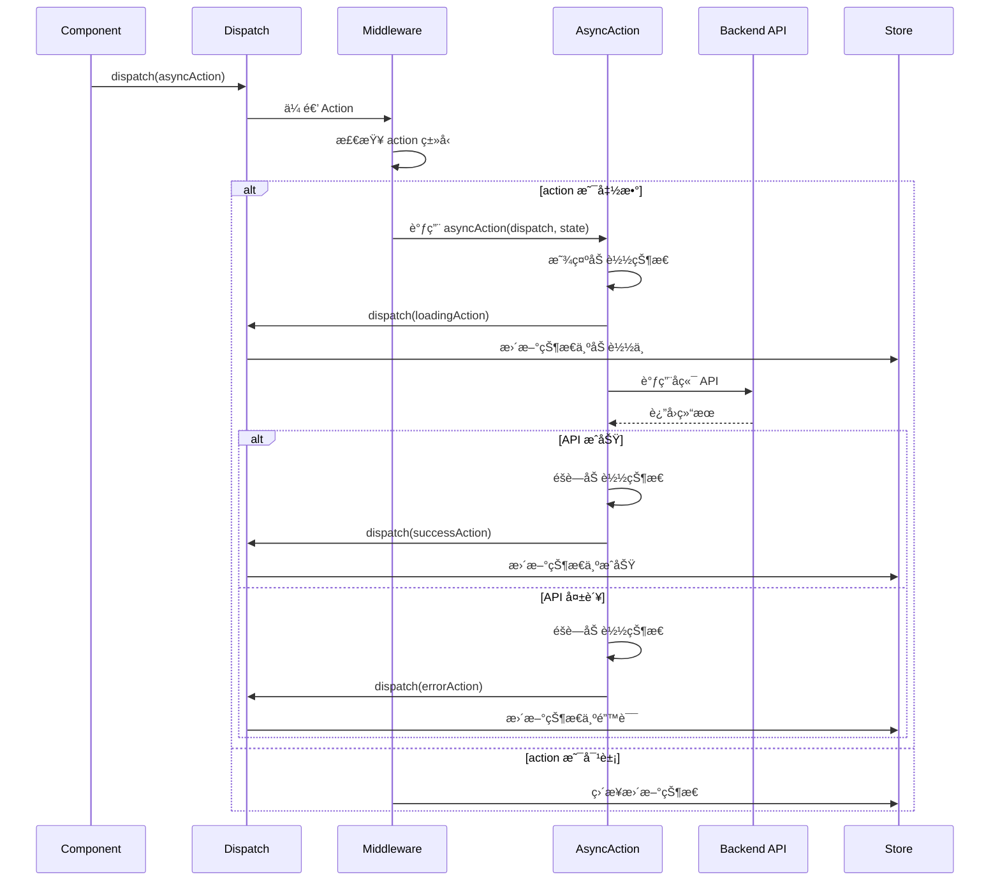
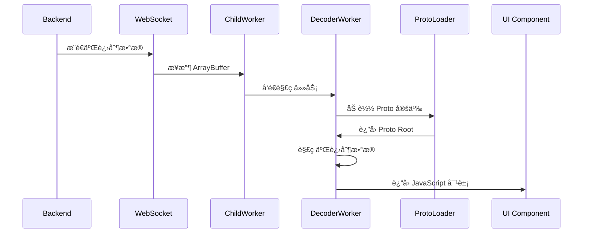
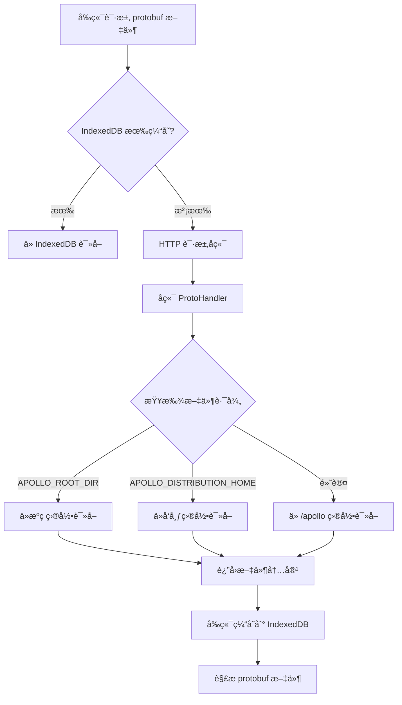
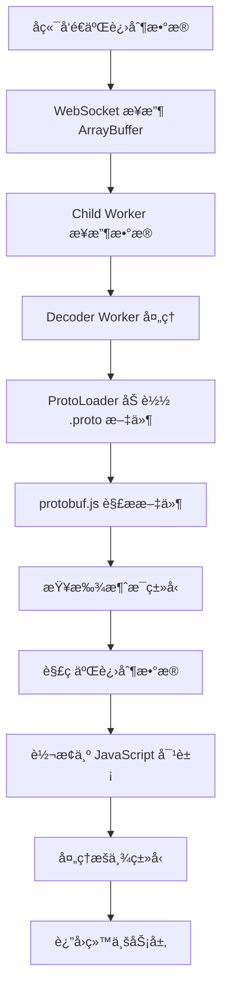
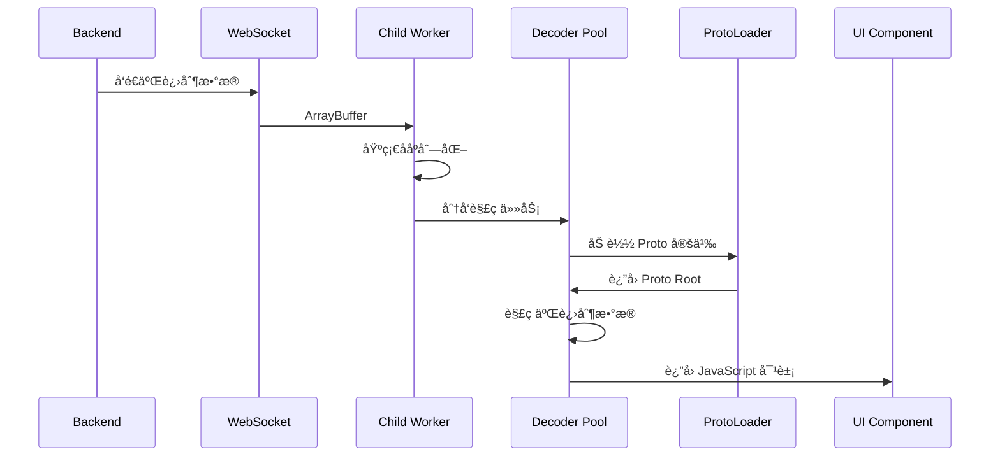
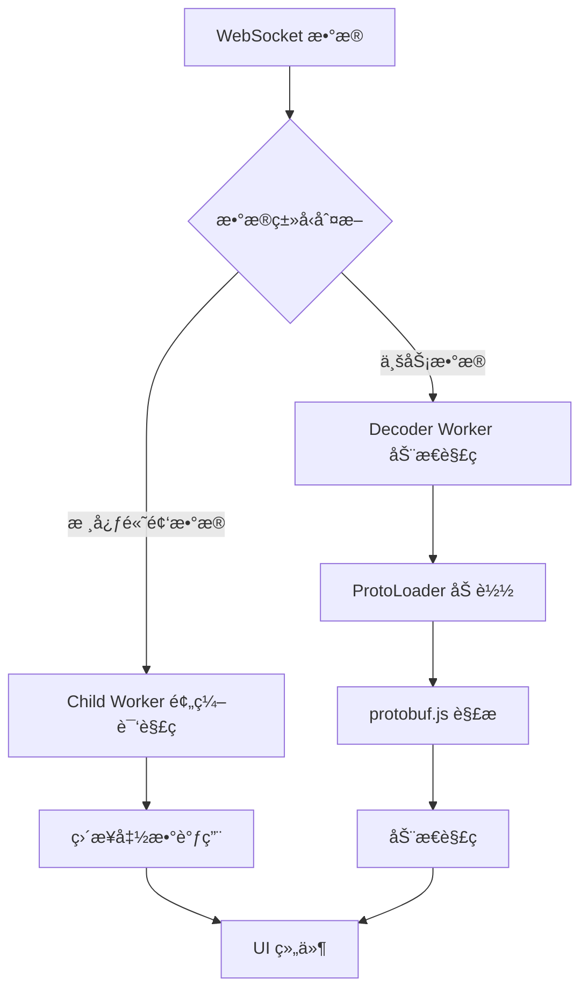
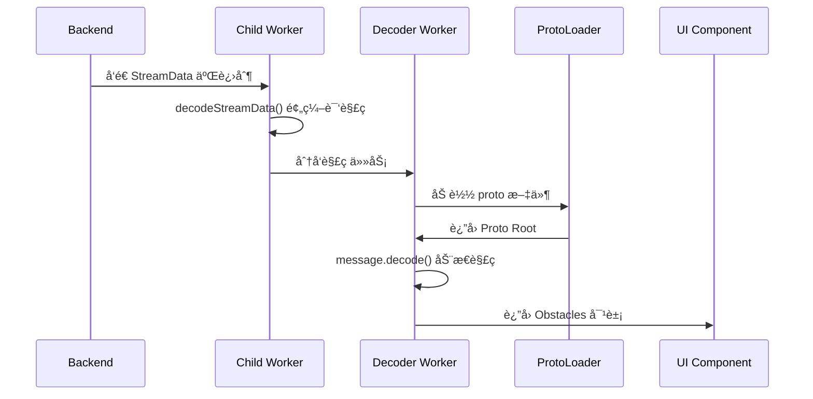
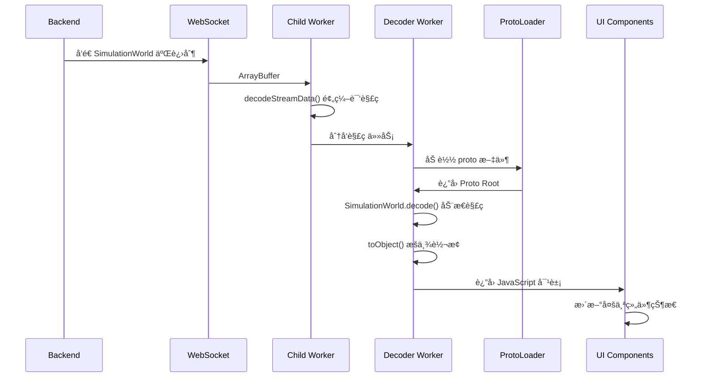
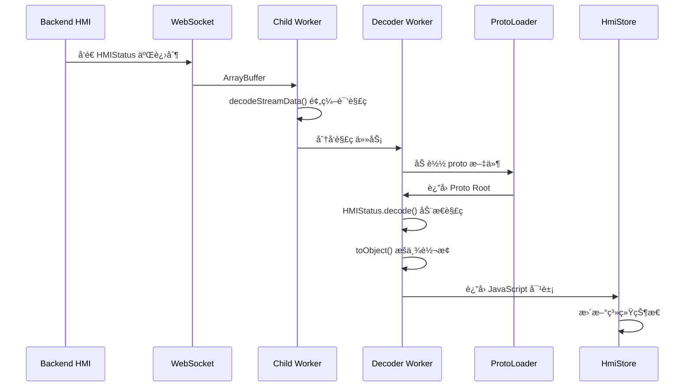

让我详细解释 Apollo Dreamview Plus 中 HmiStore çš„å®ç°ã€‚


[5 tools called]

ç°åœ¨æˆ‘æ¥è¯¦ç»†è§£é‡Š HmiStore çš„å®ç°ï¼š

## HmiStore å®ç°è¯¦è§£

### 1. **整体æ¶æ„**

HmiStore 是 Apollo Dreamview Plus ä¸­ç®¡ç† HMI（人机界é¢ï¼‰çŠ¶æ€çš„核心 Store，采用了自定义的状æ€ç®¡ç†æ¨¡å¼ï¼š

```typescript
// 使用工å‚模å¼åˆ›å»º Store
export const {
    StoreProvider: HmiStoreProvider,    // Provider 组件
    useStore: useHmiStore,              // Hook 函数
    StoreContext,                       // Context 对象
} = Factory.createStoreProvider<IInitState, CombineAction>({
    initialState: initState,            // åˆå§‹çŠ¶æ€
    reducer,                            // 状æ€æ›´æ–°å‡½æ•°
});
```

### 2. **状æ€ç»“æ„ (IInitState)**

HmiStore 管ç†ç€å¤æ‚çš„ HMI 状æ€ï¼ŒåŒ…括：

```typescript
export type IInitState = {
    // 基础é…ç½®
    modes: string[];                    // å¯ç”¨æ¨¡å¼åˆ—表
    currentMode: CURRENT_MODE;          // 当å‰æ¨¡å¼
    vehicles: string[];                 // å¯ç”¨è½¦è¾†åˆ—表
    currentVehicle: string;             // 当å‰è½¦è¾†
    maps: string[];                     // å¯ç”¨åœ°å›¾åˆ—表
    currentMap: string;                 // 当å‰åœ°å›¾
    
    // 模å—管ç†
    modules: Map<string, boolean>;      // 模å—å¯ç”¨çŠ¶æ€
    modulesLock: Map<string, boolean>;  // 模å—é”定状æ€
    
    // æ•°æ®è®°å½•
    records: Record<string, IRecordSInfo>; // æ•°æ®åŒ…ä¿¡æ¯
    currentRecordId: string;            // 当å‰æ•°æ®åŒ…ID
    
    // 场景管ç†
    scenarioSet: Record<string, IScenarioSet>; // 场景集åˆ
    currentScenarioId: string;          // 当å‰åœºæ™¯ID
    
    // æ“作状æ€
    operations: apollo.dreamview.HMIModeOperation[]; // å¯ç”¨æ“作
    currentOperation: HMIModeOperation; // 当å‰æ“作
    
    // 组件状æ€
    globalComponents: {
        DataRecorder: { /* æ•°æ®è®°å½•å™¨çŠ¶æ€ */ },
        RTKPlayer: { /* RTKæ’­æ”¾å™¨çŠ¶æ€ */ },
        RTKRecorder: { /* RTKè®°å½•å™¨çŠ¶æ€ */ },
    };
    
    // 其他状æ€...
};
```

### 3. **Action ç±»å‹å®šä¹‰**

#### **3.1 Action æšä¸¾**
```typescript
export const enum ACTIONS {
    TOGGLE_MODULE = 'TOGGLE_MODULE',           // 切æ¢æ¨¡å—
    UPDATE_STATUS = 'UPDATE_STATUS',           // 更新状æ€
    CHANGE_MODE = 'CHANGE_MODE',               // 切æ¢æ¨¡å¼
    CHANGE_OPERATE = 'CHANGE_OPERATE',         // 切æ¢æ“作
    CHANGE_RECORDER = 'CHANGE_RECORDER',       // 切æ¢æ•°æ®è®°å½•å™¨
    CHANGE_SCENARIOS = 'CHANGE_SCENARIOS',     // 切æ¢åœºæ™¯
    CHANGE_MAP = 'CHANGE_MAP',                 // 切æ¢åœ°å›¾
    CHANGE_VEHICLE = 'CHANGE_VEHICLE',         // 切æ¢è½¦è¾†
    // ... 更多 Action
}
```

#### **3.2 Action 创建函数**
```typescript
// åŒæ­¥ Action
export const updateStatus = (val: SIM_WORLD_STATUS): UpdateStatusAction => ({
    type: ACTIONS.UPDATE_STATUS,
    payload: val,
});

// 异步 Action
export const changeMode = (
    mainApi: MainApi,
    payload: ChangeModePayload,
    callback?: (mode: CURRENT_MODE) => void,
): AsyncAction<IInitState, ChangeModeAction> => {
    return async (_dispatch, state) => {
        logger.debug('changeMode', { state, payload });
        await mainApi.changeSetupMode(payload);  // 调用å端 API
        if (callback) {
            callback(payload);
        }
    };
};
```

### 4. **Reducer å®ç°**

#### **4.1 使用 Immer 进行ä¸å¯å˜æ›´æ–°**
```typescript
import { produce, enableMapSet } from 'immer';

// å¯ç”¨ Map/Set 支æŒ
enableMapSet();

export const reducer = (state: IInitState, action: CombineAction) =>
    produce(state, (draftState: IInitState) => {
        switch (action.type) {
            case ACTIONS.UPDATE_STATUS:
                reducerHander.updateStatusSimp(state, draftState, action.payload);
                break;
            case ACTIONS.TOGGLE_MODULE:
                reducerHander.toggleModule(draftState, action.payload);
                break;
            case ACTIONS.CHANGE_MODE:
                reducerHander.updateCurrentMode(draftState, action.payload);
                break;
            // ... 更多 case
        }
    });
```

#### **4.2 åˆå§‹çŠ¶æ€**
```typescript
export const initState: IInitState = {
    prevStatus: {},
    modes: [],
    currentMode: CURRENT_MODE.NONE,
    vehicles: [],
    currentVehicle: '',
    dockerImage: '',
    maps: [],
    currentMap: '',
    modules: new Map(),
    modulesLock: new Map(),
    records: {},
    // ... 更多åˆå§‹å€¼
};
```

### 5. **性能优化 - PickHmiStoreProvider**

#### **5.1 问题背景**
```typescript
// 问题：HMI 状æ€å˜åŒ–频ç¹ï¼Œä½†ç»„件åªå…³å¿ƒéƒ¨åˆ†çŠ¶æ€
const defaultKeys = Object.keys(initState).filter(
    (item) => !['currentRecordStatus', 'prevStatus'].includes(item),
) as hmiKeys[]; // æ’除频ç¹å˜åŒ–的状æ€
```

#### **5.2 解决方案**
```typescript
export function PickHmiStoreProvider(props: React.PropsWithChildren<PickHmiStoreProviderProps>) {
    const { keys: propKeys = defaultKeys } = props;
    const [hmi, dispatch] = useHmiStore();
    
    // åªé€‰æ‹©å…³å¿ƒçš„状æ€å­—段
    const [keys] = useState<hmiKeys[]>(propKeys);
    const [state, setState] = useState(
        () => keys.reduce((result, key) => ({ ...result, [key]: hmi[key] }), {}) as IInitState,
    );
    
    // 深度比较，åªåœ¨çœŸæ­£å˜åŒ–时更新
    const dependence = keys.map((key) => hmi[key]);
    useDeepEffect(() => {
        if (isLoad.current) {
            isLoad.current = false;
            return;
        }
        setState(() => keys.reduce((result, key) => ({ ...result, [key]: hmi[key] }), {}) as IInitState);
    }, dependence);
    
    const context = useMemo(() => [state, dispatch], [state, dispatch]);
    
    return <pickHmiStoreContext.Provider value={context}>{props.children}</pickHmiStoreContext.Provider>;
}
```

### 6. **使用示例**

#### **6.1 在组件中使用**
```typescript
// 完整状æ€ä½¿ç”¨
const SomeComponent = () => {
    const [hmi, dispatch] = useHmiStore();
    
    const handleModeChange = (mode: CURRENT_MODE) => {
        dispatch(changeMode(mainApi, mode));
    };
    
    return (
        <div>
            <p>当å‰æ¨¡å¼: {hmi.currentMode}</p>
            <p>当å‰è½¦è¾†: {hmi.currentVehicle}</p>
            <button onClick={() => handleModeChange(CURRENT_MODE.PERCEPTION)}>
                切æ¢åˆ°æ„ŸçŸ¥æ¨¡å¼
            </button>
        </div>
    );
};

// 优化å的使用（åªå…³å¿ƒéƒ¨åˆ†çŠ¶æ€ï¼‰
const OptimizedComponent = () => {
    const [hmi, dispatch] = usePickHmiStore();
    
    return (
        <div>
            <p>当å‰æ¨¡å¼: {hmi.currentMode}</p>
            <p>当å‰è½¦è¾†: {hmi.currentVehicle}</p>
        </div>
    );
};
```

#### **6.2 Provider 嵌套**
```typescript
// App.tsx 中的使用
export function App() {
    const Providers = [
        <HmiStoreProvider key='HmiStoreProvider' />,
        <PickHmiStoreProvider key='PickHmiStoreProvider' />,
        // ... 其他 Provider
    ];
    
    return (
        <CombineContext providers={Providers}>
            <PageLayout />
        </CombineContext>
    );
}
```

### 7. **异步 Action 处ç†**

#### **7.1 异步 Action 模å¼**
```typescript
export const changeMap = (
    mainApi: MainApi,
    mapId: string,
    translation: TFunction,
): AsyncAction<IInitState, ChangeMapAction> => {
    return async (dispatch, state) => {
        try {
            // 1. 显示加载状æ€
            message({ type: 'loading', content: translation('mapLoading') });
            
            // 2. 更新状æ€ä¸ºåŠ è½½ä¸­
            dispatch({
                type: ACTIONS.CHANGE_MAP,
                payload: { mapSetId: mapId, mapDisableState: true },
            });
            
            // 3. 调用å端 API
            await mainApi.changeMap(mapId);
            
            // 4. 更新状æ€ä¸ºå®Œæˆ
            message.destroy('MODE_SETTING_MAP_CHANGE_LOADING');
            dispatch({
                type: ACTIONS.CHANGE_MAP,
                payload: { mapSetId: mapId, mapDisableState: false },
            });
        } catch (error) {
            // 5. 错误处ç†
            message.destroy('MODE_SETTING_MAP_CHANGE_LOADING');
            dispatch({
                type: ACTIONS.CHANGE_MAP,
                payload: { mapSetId: mapId, mapDisableState: false },
            });
        }
    };
};
```

### 8. **总结**

HmiStore 的设计特点：

1. **å¤æ‚状æ€ç®¡ç†**ï¼šç®¡ç† HMI 的所有状æ€ï¼ŒåŒ…括模å¼ã€è½¦è¾†ã€åœ°å›¾ã€åœºæ™¯ç­‰
2. **性能优化**：通过 PickHmiStoreProvider é¿å…ä¸å¿…è¦çš„é‡æ–°æ¸²æŸ“
3. **异步处ç†**：支æŒå¼‚æ­¥ Action，处ç†ä¸å端的交互
4. **ä¸å¯å˜æ›´æ–°**：使用 Immer ç¡®ä¿çŠ¶æ€æ›´æ–°çš„ä¸å¯å˜æ€§
5. **ç±»å‹å®‰å…¨**：完整的 TypeScript ç±»å‹å®šä¹‰
6. **中间件支æŒ**：支æŒå¼‚æ­¥ Action 中间件
7. **深度比较**：使用深度比较é¿å…浅层å˜åŒ–导致的ä¸å¿…è¦æ›´æ–°

è¿™ç§è®¾è®¡æ—¢ä¿è¯äº†çŠ¶æ€ç®¡ç†çš„完整性，åˆä¼˜åŒ–了性能，特别适åˆå¤æ‚çš„ HMI 应用场景。

让我详细解释 HmiStore 中异步 Action 的具体å®ç°æœºåˆ¶ã€‚

## 异步 Action å®ç°è¯¦è§£

### 1. **异步 Action 的基础æ¶æ„**

#### **1.1 异步 Action ç±»å‹å®šä¹‰**
```typescript
// 在 base/Middleware.ts 中定义
export type AsyncAction<S, A> = (dispatch: (action: A) => void, state: S) => void | Promise<void>;

// 异步 Action 是一个函数，æ¥æ”¶ dispatch å’Œ state å‚æ•°
// å¯ä»¥æ˜¯åŒæ­¥å‡½æ•°ï¼ˆè¿”å› voidï¼‰æˆ–å¼‚æ­¥å‡½æ•°ï¼ˆè¿”å› Promise<void>）
```

#### **1.2 异步中间件处ç†**
```typescript
// 在 base/Middleware.ts 中å®ç°
export function asyncActionMiddleware<S, A>(
    store: Store<S, A>,
    next: (action: A) => void,
    action: AsyncAction<S, A> | A,
): void {
    if (typeof action === 'function') {
        // 如æœæ˜¯å‡½æ•°ï¼Œè¯´æ˜æ˜¯å¼‚æ­¥ Action
        (action as AsyncAction<S, A>)(store.dispatch, store.getState());
    } else {
        // 如æœæ˜¯æ™®é€šå¯¹è±¡ï¼Œè¯´æ˜æ˜¯åŒæ­¥ Action
        next(action);
    }
}
```

### 2. **具体å®ç°ç¤ºä¾‹**

#### **2.1 切æ¢åœ°å›¾çš„异步 Action**

```typescript
// 在 HmiStore/actions.ts 中
export const changeMap = (
    mainApi: MainApi,        // å端 API å®ä¾‹
    mapId: string,           // 地图 ID
    translation: TFunction,  // 国际化函数
): AsyncAction<IInitState, ChangeMapAction> => {
    return async (dispatch, state) => {
        try {
            logger.debug('changeMap', { state, mapId });
            
            // 步骤1：显示加载æ示
            message({ 
                type: 'loading', 
                content: translation('mapLoading'), 
                key: 'MODE_SETTING_MAP_CHANGE_LOADING' 
            });
            
            // 步骤2：立å³æ›´æ–°çŠ¶æ€ä¸º"加载中"
            dispatch({
                type: ACTIONS.CHANGE_MAP,
                payload: { mapSetId: mapId, mapDisableState: true },
            });
            
            // 步骤3：调用å端 API（异步æ“作）
            await mainApi.changeMap(mapId);
            
            // 步骤4：API æˆåŠŸå，éšè—加载æ示
            message.destroy('MODE_SETTING_MAP_CHANGE_LOADING');
            
            // 步骤5：更新状æ€ä¸º"完æˆ"
            dispatch({
                type: ACTIONS.CHANGE_MAP,
                payload: { mapSetId: mapId, mapDisableState: false },
            });
            
        } catch (error) {
            // 步骤6：错误处ç†
            logger.error('changeMap failed:', error);
            
            // éšè—加载æ示
            message.destroy('MODE_SETTING_MAP_CHANGE_LOADING');
            
            // æ¢å¤çŠ¶æ€
            dispatch({
                type: ACTIONS.CHANGE_MAP,
                payload: { mapSetId: mapId, mapDisableState: false },
            });
            
            // 显示错误信æ¯
            message({
                type: 'error',
                content: translation('mapChangeFailed'),
            });
        }
    };
};
```

#### **2.2 切æ¢æ“作模å¼çš„异步 Action**

```typescript
export const changeOperate = (
    mainApi: MainApi,
    payload: ChangeOperatePayload,
): AsyncAction<IInitState, ChangeOperateAction> => {
    return async (dispatch, state) => {
        logger.debug('changeOperate', { state, payload });
        
        try {
            // 步骤1：调用å端 API 切æ¢æ“作模å¼
            await mainApi.changeOperation(payload);
            
            // 步骤2：é‡ç½®ä»¿çœŸä¸–ç•Œ
            await mainApi.resetSimWorld();
            
            // 步骤3：更新本地状æ€
            dispatch({
                type: ACTIONS.CHANGE_OPERATE,
                payload,
            });
            
        } catch (error) {
            logger.error('changeOperate failed:', error);
            // 错误处ç†é€»è¾‘
        }
    };
};
```

#### **2.3 切æ¢åœºæ™¯çš„å¤æ‚异步 Action**

```typescript
export const changeScenarios = (
    otherApi: OtherApi,      // 其他 API å®ä¾‹
    mainApi: MainApi,        // 主 API å®ä¾‹
    payload: ChangeScenariosPayload,
): AsyncAction<IInitState, ChangeScenariosAction> => {
    return async (dispatch, state) => {
        logger.debug('changeScenarios', { state, payload });
        
        try {
            // 步骤1：切æ¢åœºæ™¯
            const res = await otherApi.changeScenarios(
                payload.scenarioId, 
                payload.scenariosSetId
            );
            
            if (res) {
                // 步骤2：自动切æ¢åœ°å›¾
                await mainApi.changeMap(res.currentScenarioMap).then((status) => {
                    if (!status.isOk) {
                        // 地图切æ¢å¤±è´¥ï¼Œæ˜¾ç¤ºé”™è¯¯ä¿¡æ¯
                        message({
                            type: 'error',
                            content: 'Auto-switching map failed',
                            key: 'MODE_SETTING_SCENARIO_CHANGE_ERROR',
                        });
                    }
                    // é‡ç½®åœºæ™¯çŠ¶æ€
                    otherApi.resetScenario();
                });
            }
            
            // 步骤3：更新本地状æ€
            dispatch({
                type: ACTIONS.CHANGE_SCENARIOS,
                payload,
            });
            
        } catch (error) {
            logger.error('changeScenarios failed:', error);
        }
    };
};
```

### 3. **在组件中的使用**

#### **3.1 组件中的异步 Action 调用**

```typescript
// 在组件中使用异步 Action
const ModeSettingPanel = () => {
    const [hmi, dispatch] = useHmiStore();
    const { mainApi, otherApi } = useWebSocketServices();
    const { t } = useTranslation();
    
    // 切æ¢åœ°å›¾
    const handleMapChange = async (mapId: string) => {
        // ç›´æ¥ dispatch 异步 Action 函数
        dispatch(changeMap(mainApi, mapId, t));
    };
    
    // 切æ¢åœºæ™¯
    const handleScenarioChange = async (scenarioId: string, scenarioSetId: string) => {
        dispatch(changeScenarios(otherApi, mainApi, {
            scenarioId,
            scenariosSetId
        }));
    };
    
    // 切æ¢æ“作模å¼
    const handleOperationChange = async (operation: string) => {
        dispatch(changeOperate(mainApi, operation));
    };
    
    return (
        <div>
            <select onChange={(e) => handleMapChange(e.target.value)}>
                {hmi.maps.map(map => (
                    <option key={map} value={map}>{map}</option>
                ))}
            </select>
            
            <button onClick={() => handleScenarioChange('scenario1', 'set1')}>
                切æ¢åœºæ™¯
            </button>
            
            <button onClick={() => handleOperationChange('Auto_Drive')}>
                自动驾驶模å¼
            </button>
        </div>
    );
};
```

### 4. **异步 Action 的执行æµç¨‹**



### 5. **异步 Action 的优势**

#### **5.1 用户体验优化**
```typescript
// 异步 Action å¯ä»¥å¾ˆå¥½åœ°å¤„ç†åŠ è½½çŠ¶æ€
export const changeMap = (mainApi: MainApi, mapId: string) => {
    return async (dispatch, state) => {
        // ç«‹å³å馈给用户
        dispatch({ type: 'SET_LOADING', payload: true });
        
        try {
            await mainApi.changeMap(mapId);
            dispatch({ type: 'SET_LOADING', payload: false });
            dispatch({ type: 'SET_SUCCESS', payload: true });
        } catch (error) {
            dispatch({ type: 'SET_LOADING', payload: false });
            dispatch({ type: 'SET_ERROR', payload: error.message });
        }
    };
};
```

#### **5.2 错误处ç†**
```typescript
// 统一的错误处ç†æœºåˆ¶
export const changeVehicle = (mainApi: MainApi, vehicleId: string) => {
    return async (dispatch, state) => {
        try {
            await mainApi.changeVehicle(vehicleId);
            dispatch({ type: 'CHANGE_VEHICLE', payload: vehicleId });
        } catch (error) {
            // 记录错误日志
            logger.error('Vehicle change failed:', error);
            
            // 显示用户å‹å¥½çš„错误信æ¯
            message({
                type: 'error',
                content: `Failed to change vehicle: ${error.message}`,
            });
            
            // å¯ä»¥é€‰æ‹©å›æ»šçŠ¶æ€
            // dispatch({ type: 'REVERT_VEHICLE' });
        }
    };
};
```

#### **5.3 链å¼æ“作**
```typescript
// 支æŒå¤æ‚的链å¼å¼‚æ­¥æ“作
export const changeMode = (mainApi: MainApi, mode: CURRENT_MODE) => {
    return async (dispatch, state) => {
        try {
            // 步骤1：切æ¢æ¨¡å¼
            await mainApi.changeSetupMode(mode);
            
            // 步骤2：é‡ç½®ç›¸å…³çŠ¶æ€
            await mainApi.resetSimWorld();
            
            // 步骤3：更新模å—状æ€
            await mainApi.updateModules();
            
            // 步骤4：更新本地状æ€
            dispatch({ type: 'CHANGE_MODE', payload: mode });
            
        } catch (error) {
            // 如æœä»»ä½•æ­¥éª¤å¤±è´¥ï¼Œéƒ½éœ€è¦å›æ»š
            await mainApi.revertMode();
            dispatch({ type: 'CHANGE_MODE_FAILED', payload: error });
        }
    };
};
```

### 6. **总结**

异步 Action çš„å®ç°ç‰¹ç‚¹ï¼š

1. **函数å¼è®¾è®¡**：异步 Action 是一个返å›å‡½æ•°çš„函数
2. **中间件支æŒ**：通过中间件自动识别和处ç†å¼‚æ­¥ Action
3. **状æ€ç®¡ç†**：å¯ä»¥åœ¨å¼‚步过程中多次 dispatch 更新状æ€
4. **错误处ç†**：统一的错误处ç†å’Œç”¨æˆ·å馈机制
5. **用户体验**：支æŒåŠ è½½çŠ¶æ€ã€æˆåŠŸæ示ã€é”™è¯¯æ示
6. **链å¼æ“作**：支æŒå¤æ‚的异步æ“作链

è¿™ç§è®¾è®¡è®©å‰ç«¯å¯ä»¥ä¼˜é›…地处ç†ä¸å端的异步交互，åŒæ—¶ä¿æŒè‰¯å¥½çš„用户体验和状æ€ç®¡ç†ã€‚

这是一个很好的问题 ğŸ‘
 我æ¥å¸®ä½ ä» **å¼€å‘者角度** å’Œ **用户体验角度**，对比 **异步 Action 相比åŒæ­¥ Action 的优势**。

------

## 🚀 异步 Action 的好处

### 1. **支æŒçœŸå®ä¸–界的异步场景**

- ç°ä»£åº”用几ä¹éƒ½è¦å’Œ **å端 API**ã€**æ•°æ®åº“**ã€**WebSocket**ã€**文件/传感器** 打交é“。
- 这些æ“作ä¸æ˜¯ç«‹å³å®Œæˆçš„（比如请求网络å¯èƒ½è¦å‡ ç™¾æ¯«ç§’甚至几秒），必须用异步。
   ✅ 异步 Action å…许å‰ç«¯åœ¨ç­‰å¾…çš„åŒæ—¶ç»§ç»­å·¥ä½œï¼Œä¸ä¼šé˜»å¡ UI。

------

### 2. **更好的用户体验**

- 在等待 API è¿”å›æ—¶ï¼Œå¯ä»¥ç«‹åˆ»ç»™ç”¨æˆ·å馈（例如“加载中...â€ï¼‰ã€‚
- æˆåŠŸæ—¶æ˜¾ç¤ºæˆåŠŸæ示，失败时显示错误信æ¯ã€‚
- 用户ä¸ä¼šæ„Ÿåˆ°ç•Œé¢â€œå¡æ­»â€æˆ–“无å“应â€ã€‚

示例：

```ts
dispatch({ type: 'SET_LOADING', payload: true });
// 等待中 → 显示 loading 动画
await api.fetchData();
dispatch({ type: 'SET_LOADING', payload: false });
dispatch({ type: 'SET_SUCCESS', payload: true });
```

------

### 3. **状æ€ç®¡ç†æ›´ç»†ç²’度**

- åŒæ­¥ Action：一次性更新状æ€ã€‚
- 异步 Action：å¯ä»¥åˆ†é˜¶æ®µæ›´æ–°çŠ¶æ€ï¼Œæ¯”如：
  - `loading → success`
  - `loading → error`
- 更符åˆçœŸå®æµç¨‹ï¼ŒUI 状æ€æ›´åŠ ä¸°å¯Œå’Œå‡†ç¡®ã€‚

------

### 4. **错误处ç†å’Œå›æ»š**

- 异步 Action å¯ä»¥æ•è·å¼‚常并处ç†ï¼š
  - 记录日志
  - 给用户æ示
  - å›æ»šåˆ°ä¹‹å‰çš„状æ€ï¼ˆé¿å…æ•°æ®é”™ä¹±ï¼‰
- è¿™ç§æœºåˆ¶åœ¨åŒæ­¥ Action 里很难åšåˆ°ã€‚

------

### 5. **链å¼æ“作和å¤æ‚逻辑**

- 支æŒå¤šä¸ªæ­¥éª¤ä¾èµ–：一个æ“作完æˆåæ‰èƒ½æ‰§è¡Œä¸‹ä¸€ä¸ªã€‚
- 比如：
  1. 切æ¢åœ°å›¾ →
  2. ç­‰åœ°å›¾åŠ è½½å®Œæˆ â†’
  3. 自动切æ¢åœºæ™¯ →
  4. 最åæ›´æ–° UI。

åŒæ­¥ Action 没法优雅地表达这ç§ä¾èµ–链。

------

## 📊 总结对比

| æ–¹é¢           | åŒæ­¥ Action      | 异步 Action                      |
| -------------- | ---------------- | -------------------------------- |
| **适用场景**   | 简å•æœ¬åœ°çŠ¶æ€     | 网络请求ã€æ–‡ä»¶æ“作ã€WebSocket ç­‰ |
| **执行方å¼**   | ä¸€æ¬¡æ€§å®Œæˆ       | 多阶段ã€å¯ç­‰å¾…                   |
| **用户体验**   | ç¬æ—¶å˜åŒ–，无æ示 | æ”¯æŒ loading / success / error   |
| **错误处ç†**   | 难以æ•è·å’Œå›æ»š   | å¯ä»¥ç»Ÿä¸€ try/catchã€å›æ»š         |
| **逻辑å¤æ‚度** | 简å•ç›´æ¥         | 支æŒé“¾å¼æ“作，å¤æ‚逻辑å¯æ§       |

------

✅ **一å¥è¯æ€»ç»“**：

- **åŒæ­¥ Action** → å¿«æ·ã€ç®€å•ï¼Œé€‚åˆæœ¬åœ°çŠ¶æ€åˆ‡æ¢ã€‚
- **异步 Action** → æ›´è´´åˆçœŸå®ä¸šåŠ¡æµç¨‹ï¼Œèƒ½æå‡ç”¨æˆ·ä½“验ã€å¯æ§é”™è¯¯å¤„ç†ã€æ”¯æŒå¤æ‚æ“作链。

------

è¦ä¸è¦æˆ‘å†å¸®ä½ å†™ä¸€ä¸ª **真å®åœºæ™¯æ¡ˆä¾‹ï¼ˆæ¯”如：切æ¢åœ°å›¾ + 加载场景）åŒæ­¥ vs 异步 的代ç å¯¹æ¯”**？这样你能直观看到为什么异步更好。

好问题 ğŸ‘

严格æ¥è¯´ï¼š**异步 Action 并ä¸ä¸€å®šå¿…é¡»ç»è¿‡ä¸­é—´ä»¶**，但是在å®é™…项目里 **几ä¹æ€»æ˜¯é€šè¿‡ä¸­é—´ä»¶æ¥å¤„ç†**。我给你分层解释一下：

------

## 1. **åŒæ­¥ Action 的常规æµç¨‹**

- React/Redux 的标准：`dispatch(action)`
- Action 是一个 **普通对象**：

```ts
dispatch({ type: 'CHANGE_THEME', payload: 'dark' });
```

- Reducer 马上执行，更新 state。
   â¡ï¸ è¿™ç§æƒ…况ä¸éœ€è¦ä¸­é—´ä»¶ã€‚

------

## 2. **异步 Action 的问题**

- 异步 Action 常常是一个 **函数**，而ä¸æ˜¯æ™®é€šå¯¹è±¡ï¼š

```ts
// å…¸å‹å¼‚æ­¥ Action
export const fetchUser = (id: string) => {
  return async (dispatch, getState) => {
    const res = await api.getUser(id);
    dispatch({ type: 'SET_USER', payload: res });
  };
};
```

- 如æœä½ ç›´æ¥ `dispatch(fetchUser(123))`，Redux çš„ `dispatch` **无法识别函数**，会报错。
   â¡ï¸ è¿™æ—¶å€™å°±éœ€è¦ **中间件** æ¥æ‹¦æˆªã€‚

------

## 3. **中间件的作用**

中间件（比如 `redux-thunk`ã€ä½ ä¾‹å­é‡Œçš„ `asyncActionMiddleware`）：

1. **检查 action ç±»å‹**
   - 如æœæ˜¯å¯¹è±¡ → ç›´æ¥äº¤ç»™ reducer。
   - 如æœæ˜¯å‡½æ•° → 调用它，并传入 `(dispatch, getState)`。
2. **ä¿è¯å¼‚æ­¥ Action 能è¿è¡Œï¼Œå¹¶ä¸”能在过程中 dispatch 多个åŒæ­¥ Action**。

------

## 4. **有没有ä¸ç”¨ä¸­é—´ä»¶çš„æ–¹å¼ï¼Ÿ**

有，但体验很差：

- ä½ å¯ä»¥åœ¨ç»„件里直æ¥å†™å¼‚步逻辑，然å在 `await` 之åå† `dispatch`：

```tsx
const handleClick = async () => {
  dispatch({ type: 'LOADING' });
  try {
    const data = await api.getUser(123);
    dispatch({ type: 'SET_USER', payload: data });
  } catch (e) {
    dispatch({ type: 'ERROR', payload: e.message });
  }
};
```

- è¿™ç§æ–¹å¼ä¹Ÿèƒ½è·‘，但：
  - 所有组件都è¦è‡ªå·±å†™é‡å¤çš„异步æµç¨‹
  - ä¸å¯å¤ç”¨
  - ä¸å¥½æµ‹è¯•ã€ä¸å¥½ç»´æŠ¤

â¡ï¸ 所以社区æ‰å¼•å…¥ä¸­é—´ä»¶ï¼ŒæŠŠå¼‚步逻辑放在 Action 层，让组件更干净。

------

## 5. **总结**

- **åŒæ­¥ Action** ä¸éœ€è¦ä¸­é—´ä»¶ã€‚
- **异步 Action** 如æœå†™æˆå‡½æ•°ï¼Œå¿…须通过中间件（如 redux-thunkã€redux-sagaã€è‡ªå®šä¹‰ async middleware）æ¥æ”¯æŒã€‚
- 你也å¯ä»¥æŠŠå¼‚步写在组件里手动 dispatch，但这样失å»äº†å¼‚æ­¥ Action 的优势（å¤ç”¨æ€§ã€å¯ç»´æŠ¤æ€§ï¼‰ã€‚

------

✅ **一å¥è¯ç»“论**：
 异步 Action ç†è®ºä¸Šå¯ä»¥ä¸ç»è¿‡ä¸­é—´ä»¶ï¼Œä½†ä¸ºäº†ä¿æŒä»£ç æ¸…æ™°ã€å¯å¤ç”¨ã€å¯ç»´æŠ¤ï¼Œ**æ¨è总是用中间件æ¥å¤„ç†å¼‚æ­¥ Action**。

------

è¦ä¸è¦æˆ‘帮你画一张 **“有中间件 vs 无中间件†的æµç¨‹å¯¹æ¯”图**，让你直观看出差别？

这个问题问得é常到点å­ä¸Š ğŸ‘。

在 React/Redux 体系里，**中间件 (Middleware)** 并ä¸æ˜¯æ¡†æ¶è‡ªåŠ¨æ供的，而是由 **å¼€å‘者或第三方库æä¾›** 的。

------

## 1. **è°æ¥æ供中间件？**

### 📦 Redux 官方æ供的

- **redux-thunk**
   最常è§çš„中间件，å…许 `dispatch(function)`，函数里写异步逻辑。

  ```ts
  import thunk from "redux-thunk";
  const store = createStore(rootReducer, applyMiddleware(thunk));
  ```

- **redux-saga**
   用 `generator function` 管ç†å¤æ‚的异步æµç¨‹ï¼Œé€‚åˆå¤§é¡¹ç›®ã€‚

- **redux-observable (RxJS)**
   用 RxJS 管ç†å¼‚æ­¥æµï¼Œé常强大，但学习曲线高。

------

### 👨â€ğŸ’» 自定义中间件

在你给的 **HmiStore** 代ç é‡Œï¼Œå›¢é˜Ÿè‡ªå·±å†™äº†ä¸€ä¸ª **`asyncActionMiddleware`**：

```ts
export function asyncActionMiddleware<S, A>(
    store: Store<S, A>,
    next: (action: A) => void,
    action: AsyncAction<S, A> | A,
): void {
    if (typeof action === 'function') {
        (action as AsyncAction<S, A>)(store.dispatch, store.getState());
    } else {
        next(action);
    }
}
```

- 这就是一个简化版的 `redux-thunk`。
- 它让你å¯ä»¥ `dispatch(async (dispatch, state) => { ... })`，ä»è€Œæ”¯æŒå¼‚æ­¥ Action。

------

## 2. **è°æ¥ä½¿ç”¨ä¸­é—´ä»¶ï¼Ÿ**

- 在åˆå§‹åŒ– Store 的时候，你需è¦æ‰‹åŠ¨æŠŠä¸­é—´ä»¶ **注入到 Store**：

```ts
const store = createStore(rootReducer, applyMiddleware(asyncActionMiddleware));
```

- 这样，当你 `dispatch` 时，所有 Action 都会先ç»è¿‡ä¸­é—´ä»¶é“¾ã€‚

------

## 3. **总结**

- **中间件ä¸æ˜¯ React/Redux 自动æ供的**，而是：
  1. 由社区（redux-thunkã€redux-sagaã€redux-observable）æ供；
  2. 或者由开å‘者自己å®ç°ï¼ˆå°±åƒä½ ä»¬çš„ `asyncActionMiddleware`）。
- å¼€å‘者在创建 store 时选择并注入åˆé€‚的中间件，æ‰èƒ½è®©å¼‚æ­¥ Action 工作。

------

✅ 一å¥è¯ç»“论：
 **中间件由第三方库或你自己æ¥æ供，Redux åªè´Ÿè´£æ供中间件机制，ä¸ä¼šè‡ªå¸¦å®ç°ã€‚**

------

è¦ä¸è¦æˆ‘帮你整ç†ä¸€ä¸ª **常è§ä¸­é—´ä»¶å¯¹æ¯”表 (thunk / saga / observable / 自定义)**，让你清楚什么时候选哪一个？

好问题 ğŸ‘，这其å®æ˜¯ **函数å¼è®¾è®¡** 在 Redux/状æ€ç®¡ç†é‡Œçš„一ç§ä½“ç°ã€‚我给你拆开解释 **为什么异步 Action è¦è®¾è®¡æˆâ€œè¿”å›å‡½æ•°çš„函数â€**。

------

## 1. **普通 Action çš„å±€é™**

- Redux 规定 Action 必须是 **普通对象**（`{ type, payload }`）。
- 这很好，但 **没法表达“过程â€**。
  - 比如 “先 dispatch loading，å†è°ƒ APIï¼Œå† dispatch success/errorâ€ï¼Œå¯¹è±¡æ²¡æ³•åšåˆ°ã€‚
- 所以需è¦ä¸€ä¸ªæ–¹å¼ï¼šè®© Action ä¸å†åªæ˜¯â€œç»“æœâ€ï¼Œè€Œæ˜¯èƒ½æ‰¿è½½â€œè¿‡ç¨‹â€ã€‚

------

## 2. **è¿”å›å‡½æ•°çš„函数：Thunk æ€æƒ³**

- 所谓 **Thunk**：本质是“延迟执行的函数â€ã€‚

- 例å­ï¼š

  ```js
  // 普通表达å¼
  const result = x + y;
  
  // Thunk：把计算包装æˆå‡½æ•°ï¼Œå»¶è¿Ÿåˆ°éœ€è¦æ—¶å†æ‰§è¡Œ
  const thunk = () => x + y;
  ```

- 在 Redux 里：

  - 普通 Action：一次性æ述结æœ
  - 异步 Action：返å›ä¸€ä¸ªå‡½æ•°ï¼Œè¿™ä¸ªå‡½æ•°é‡Œå¯ä»¥å†™å®Œæ•´çš„æµç¨‹ï¼ˆå‰¯ä½œç”¨ + 多次 dispatch）

------

## 3. **为什么è¦è¿™æ ·è®¾è®¡ï¼Ÿ**

### ✅ 1. ä¿æŒ Redux çš„ **纯粹性**

- Reducer 必须是纯函数，ä¸èƒ½å†™å‰¯ä½œç”¨ï¼ˆæ¯”如 API 调用）。
- 如æœæŠŠå¼‚步逻辑å¡è¿› reducer，会破å Redux çš„åŸåˆ™ã€‚
- 通过 “返å›å‡½æ•°â€ï¼Œå¼‚步逻辑就能转移到中间件里处ç†ï¼Œè€Œ reducer ä»ç„¶ä¿æŒçº¯å‡€ã€‚

------

### ✅ 2. æä¾› **çµæ´»çš„æ§åˆ¶**

- 这个函数会被中间件调用，并且会自动注入 `dispatch` 和 `getState`：

  ```ts
  return async (dispatch, getState) => {
      dispatch({ type: "LOADING" });
      const data = await api.fetchUser();
      dispatch({ type: "SUCCESS", payload: data });
  };
  ```

- 好处：

  - å¯ä»¥éšæ—¶è¯»å–å½“å‰ state
  - å¯ä»¥å¤šæ¬¡ dispatch
  - å¯ä»¥å†™ try/catch åšé”™è¯¯å¤„ç†

------

### ✅ 3. **抽象副作用，å¤ç”¨é€»è¾‘**

- 异步 Action å˜æˆä¸€ä¸ªå‡½æ•°ï¼Œå°±å¯ä»¥åœ¨å¤šä¸ªç»„件里调用，é¿å…æ¯ä¸ªç»„件é‡å¤å†™å¼‚步逻辑。
- 比如：`dispatch(fetchUser(id))`，组件ä¸ç”¨å…³å¿ƒ API æ€ä¹ˆè°ƒç”¨ã€‚

------

### ✅ 4. **和中间件契åˆ**

- 中间件å¯ä»¥ç»Ÿä¸€æ£€æŸ¥ï¼š
  - 如æœæ˜¯å¯¹è±¡ → ç›´æ¥äº¤ç»™ reducer
  - 如æœæ˜¯å‡½æ•° → 调用它，交给开å‘者处ç†å‰¯ä½œç”¨
- è¿™ç§è®¾è®¡è®© Redux 的核心é常简æ´ï¼Œè€Œå¼‚步逻辑全é ä¸­é—´ä»¶æ‰©å±•ã€‚

------

## 4. **直观ç†è§£**

å¯ä»¥è¿™æ ·æ¯”喻：

- **åŒæ­¥ Action（对象）**：åƒæ˜¯â€œå¿«é€’包裹â€ï¼Œé‡Œé¢å·²ç»å†™å¥½äº†è¦æ”¹ä»€ä¹ˆ → ç›´æ¥é€åˆ° Reducer。
- **异步 Action（函数）**：åƒæ˜¯â€œå¿«é€’员â€ï¼Œä»–自己知é“该走哪æ¡è·¯ï¼Œå¯èƒ½éœ€è¦æ‰“电è¯ç¡®è®¤åœ°å€ï¼Œå¯èƒ½è¦å…ˆè·‘个腿，然å在ä¸åŒæ—¶é—´ç‚¹æŠŠä¸åŒçš„包裹é€åˆ° Reducer。

------

## 5. **总结**

异步 Action è®¾è®¡æˆ â€œè¿”å›å‡½æ•°çš„函数†的åŸå› ï¼š

1. ä¿æŒ reducer 纯函数，ä¸åšå‰¯ä½œç”¨ã€‚
2. å…许在 Action 里表达异步过程，而ä¸æ˜¯ä¸€æ¬¡æ€§ç»“æœã€‚
3. 通过注入 `dispatch` å’Œ `getState`，能çµæ´»æ§åˆ¶çŠ¶æ€æ›´æ–°ã€‚
4. 支æŒé€»è¾‘å¤ç”¨ï¼Œé¿å…组件é‡å¤å†™ API 逻辑。
5. ä¸ä¸­é—´ä»¶æœºåˆ¶å¥‘åˆï¼Œæ‰©å±• Redux 的能力但ä¸ç ´å它的核心设计。

------

✅ 一å¥è¯æ€»ç»“：
 **异步 Action 之所以是“返å›å‡½æ•°çš„函数â€ï¼Œå°±æ˜¯ä¸ºäº†æŠŠå‰¯ä½œç”¨é€»è¾‘延迟到中间件里执行，åŒæ—¶ä¿æŒ Redux 的核心（reducer 纯函数 + Action 对象）ä¸è¢«ç ´å。**

------

è¦ä¸è¦æˆ‘帮你画一张 **“普通 Action vs 异步 Thunk Action 的对比图â€**，直观展示为什么è¦è¿”å›å‡½æ•°ï¼Ÿ

让我详细解释å端æ¨é€çš„ perception obstacle æ•°æ®åœ¨å‰ç«¯æ˜¯å¦‚何ååºåˆ—化的。


[4 tools called]

ç°åœ¨æˆ‘æ¥è¯¦ç»†è§£é‡Šå端æ¨é€çš„ perception obstacle æ•°æ®åœ¨å‰ç«¯æ˜¯å¦‚何ååºåˆ—化的：

## Perception Obstacle å‰ç«¯ååºåˆ—化详解

### 1. **æ•°æ®æµè½¬è¿‡ç¨‹æ¦‚览**



### 2. **详细ååºåˆ—化æµç¨‹**

#### **2.1 å端数æ®æ¨é€**
```cpp
// å端 - ObstacleUpdater::PublishMessage()
void ObstacleUpdater::PublishMessage(const std::string& channel_name) {
    // 1. è·å–éšœç¢ç‰©æ•°æ®
    std::string to_send = "";
    GetObjects(&to_send, channel_name);
    
    // 2. 创建 StreamData 消æ¯
    StreamData stream_data;
    stream_data.set_action("stream");
    stream_data.set_data_name("obstacle");
    stream_data.set_channel_name(channel_name);
    
    // 3. å°† PerceptionObstacles åºåˆ—化为二进制
    std::vector<uint8_t> byte_data(to_send.begin(), to_send.end());
    stream_data.set_data(&(byte_data[0]), byte_data.size());
    
    // 4. åºåˆ—化 StreamData 并广播
    std::string stream_data_string;
    stream_data.SerializeToString(&stream_data_string);
    websocket_->BroadcastBinaryData(stream_data_string);
}
```

我æ¥å¸®ä½ åˆ†æå端代ç ä¸­ `ObstacleUpdater::PublishMessage()` çš„å®ç°ï¼Œå¹¶è§£é‡Šä¸ºä»€ä¹ˆ `StreamData` å’Œ `PerceptionObstacles` çš„åºåˆ—化方å¼ä¸åŒã€‚


[3 tools called]

æ ¹æ®æˆ‘对代ç çš„分æ，我å¯ä»¥å›ç­”你的问题：

## å端å®ç°åˆ†æ

**是的，å端确å®æ˜¯æŒ‰ç…§ä½ æè¿°çš„æ–¹å¼å®ç°çš„**。让我详细解释一下：

### 1. å®é™…çš„ `PublishMessage()` å®ç°

```cpp
void ObstacleUpdater::PublishMessage(const std::string& channel_name) {
  std::string to_send = "";
  GetObjects(&to_send, channel_name);           // 1. è·å–éšœç¢ç‰©æ•°æ®
  
  StreamData stream_data;                       // 2. 创建 StreamData 消æ¯
  stream_data.set_action("stream");
  stream_data.set_data_name("obstacle");
  stream_data.set_channel_name(channel_name);
  
  std::vector<uint8_t> byte_data(to_send.begin(), to_send.end());  // 3. 转æ¢ä¸ºäºŒè¿›åˆ¶
  stream_data.set_data(&(byte_data[0]), byte_data.size());
  stream_data.set_type("obstacle");
  
  std::string stream_data_string;              // 4. åºåˆ—化并广播
  stream_data.SerializeToString(&stream_data_string);
  websocket_->BroadcastBinaryData(stream_data_string);
}
```

### 2. 为什么åºåˆ—化方å¼ä¸åŒï¼Ÿ

这里涉åŠåˆ°**两层åºåˆ—化**的概念：

#### 第一层：`PerceptionObstacles` → `Obstacles` → 字符串
```cpp
// 在 GetObjects() 方法中
channel_updater->obstacle_objects_.SerializeToString(to_send);
```
- `PerceptionObstacles` 被转æ¢ä¸º Dreamview 专用的 `Obstacles` æ ¼å¼
- `Obstacles` 被åºåˆ—化为字符串格å¼

#### 第二层：字符串 → 二进制 → `StreamData`
```cpp
std::vector<uint8_t> byte_data(to_send.begin(), to_send.end());
stream_data.set_data(&(byte_data[0]), byte_data.size());
stream_data.SerializeToString(&stream_data_string);
```
- 字符串被转æ¢ä¸ºäºŒè¿›åˆ¶æ•°æ®
- 二进制数æ®è¢«åŒ…装在 `StreamData` 中
- `StreamData` å†æ¬¡è¢«åºåˆ—化为最终的传输格å¼

### 3. æ•°æ®è½¬æ¢æµç¨‹

```
PerceptionObstacles (åŸå§‹æ„ŸçŸ¥æ•°æ®)
    ↓ GetObjects()
Obstacles (Dreamviewæ ¼å¼)
    ↓ SerializeToString()
std::string (åºåˆ—化字符串)
    ↓ std::vector<uint8_t>
Binary Data (二进制数æ®)
    ↓ set_data()
StreamData (传输包装)
    ↓ SerializeToString()
Final Binary (最终传输数æ®)
```

### 4. 为什么需è¦ä¸¤å±‚åºåˆ—化？

1. **æ•°æ®æ ¼å¼è½¬æ¢**：`PerceptionObstacles` 是感知模å—çš„åŸå§‹æ ¼å¼ï¼Œéœ€è¦è½¬æ¢ä¸ºå‰ç«¯å‹å¥½çš„ `Obstacles` æ ¼å¼

2. **传输åè®®**：`StreamData` 是 WebSocket 传输的统一å议，包å«ï¼š
   - `action`: "stream" (æ“作类å‹)
   - `data_name`: "obstacle" (æ•°æ®ç±»å‹)
   - `channel_name`: 频é“å称
   - `data`: å®é™…的二进制数æ®

3. **å‰ç«¯è§£åŒ…**：å‰ç«¯æ”¶åˆ°æ•°æ®å，先解包 `StreamData`，å†æ ¹æ® `data_name` 决定如何进一步处ç†äºŒè¿›åˆ¶æ•°æ®

è¿™ç§è®¾è®¡å®ç°äº†**æ•°æ®æ ¼å¼è½¬æ¢**å’Œ**传输å议分离**，使得系统更加模å—化和å¯æ‰©å±•ã€‚

是的，`data` 字段中的å®é™…二进制数æ®ç¡®å®æ˜¯**å‰ç«¯å‹å¥½æ ¼å¼çš„二进制化**。让我详细解释这个数æ®æµç¨‹ï¼š


[3 tools called]

æ ¹æ®ä»£ç åˆ†æ，我å¯ä»¥æ˜ç¡®å›ç­”你的问题：

## 是的，`data` 字段中的二进制数æ®ç¡®å®æ˜¯å‰ç«¯å‹å¥½æ ¼å¼çš„二进制化

让我详细解释整个数æ®è½¬æ¢æµç¨‹ï¼š

### 1. 完整的数æ®è½¬æ¢é“¾è·¯

```cpp
// 第1步：感知模å—åŸå§‹æ•°æ®
PerceptionObstacles (åŸå§‹æ„ŸçŸ¥æ ¼å¼)
    ↓ OnObstacles() æ¥æ”¶
std::vector<PerceptionObstacle> obstacles_ (存储在内存中)

// 第2步：转æ¢ä¸ºå‰ç«¯å‹å¥½æ ¼å¼
GetObjects() 方法中：
    ↓ éå† obstacles_
for (const auto& obstacle : channel_updater->obstacles_) {
    Object& obj = channel_updater->obj_map_[id];  // 创建å‰ç«¯å‹å¥½çš„Object
    SetObstacleInfo(obstacle, &obj);              // 转æ¢åŸºæœ¬ä¿¡æ¯
    SetObstaclePolygon(obstacle, &obj);           // 转æ¢å¤šè¾¹å½¢
    SetObstacleType(obstacle.type(), &obj);       // 转æ¢ç±»å‹
    // ... 其他转æ¢
}

// 第3步：组装为Obstacles消æ¯
Obstacles obstacle_objects_;  // å‰ç«¯å‹å¥½çš„æ ¼å¼
for (const auto& kv : channel_updater->obj_map_) {
    *channel_updater->obstacle_objects_.add_obstacle() = kv.second;
}
channel_updater->obstacle_objects_.mutable_auto_driving_car()->CopyFrom(auto_driving_car);

// 第4步：åºåˆ—化为二进制
std::string to_send = "";
channel_updater->obstacle_objects_.SerializeToString(to_send);  // Obstacles → 二进制字符串

// 第5步：包装为StreamData
std::vector<uint8_t> byte_data(to_send.begin(), to_send.end());
stream_data.set_data(&(byte_data[0]), byte_data.size());  // 二进制字符串 → 二进制数æ®
```

### 2. 关键è¯æ®

ä»ä»£ç ç¬¬199è¡Œå¯ä»¥çœ‹åˆ°ï¼š
```cpp
channel_updater->obstacle_objects_.SerializeToString(to_send);
```

这里的 `obstacle_objects_` 是 `Obstacles` ç±»å‹ï¼ˆå‰ç«¯å‹å¥½æ ¼å¼ï¼‰ï¼Œè€Œä¸æ˜¯ `PerceptionObstacles`（åŸå§‹æ ¼å¼ï¼‰ã€‚

### 3. æ•°æ®æ ¼å¼å¯¹æ¯”

| 阶段       | æ•°æ®æ ¼å¼              | è¯´æ˜                    |
| ---------- | --------------------- | ----------------------- |
| **输入**   | `PerceptionObstacles` | 感知模å—åŸå§‹æ ¼å¼        |
| **转æ¢**   | `Object` (多个)       | å‰ç«¯å‹å¥½çš„å•ä¸ªå¯¹è±¡æ ¼å¼  |
| **组装**   | `Obstacles`           | å‰ç«¯å‹å¥½çš„集åˆæ ¼å¼      |
| **åºåˆ—化** | `std::string`         | Obstacles的二进制字符串 |
| **传输**   | `StreamData.data`     | 包装åçš„äºŒè¿›åˆ¶æ•°æ®      |

### 4. 为什么这样设计？

1. **性能优化**：å‰ç«¯ä¸éœ€è¦å¤„ç†å¤æ‚的感知算法细节
2. **æ•°æ®ç²¾ç®€**：移除å‰ç«¯ä¸éœ€è¦çš„字段（如点云数æ®ã€ä¼ æ„Ÿå™¨åŸå§‹æ•°æ®ï¼‰
3. **æ ¼å¼ç»Ÿä¸€**：所有障ç¢ç‰©éƒ½ä½¿ç”¨ç›¸åŒçš„ `Object` æ ¼å¼
4. **ç±»å‹ç®€åŒ–**：将æšä¸¾ç±»å‹è½¬æ¢ä¸ºå­—符串，便äºå‰ç«¯å¤„ç†

### 5. å‰ç«¯æ¥æ”¶å的处ç†

å‰ç«¯æ”¶åˆ° `StreamData` å：
```typescript
// 1. 解包 StreamData
const streamData = StreamData.decode(data);

// 2. æ ¹æ® data_name 判断数æ®ç±»å‹
if (streamData.dataName === 'obstacle') {
    // 3. ååºåˆ—化二进制数æ®ä¸º Obstacles
    const obstacles = Obstacles.decode(streamData.data);
    
    // 4. ç›´æ¥ä½¿ç”¨å‰ç«¯å‹å¥½çš„æ ¼å¼è¿›è¡Œæ¸²æŸ“
    obstacles.obstacle.forEach(obj => {
        // obj å·²ç»æ˜¯å‰ç«¯å‹å¥½çš„ Object æ ¼å¼
        renderObstacle(obj);
    });
}
```

**总结**：`StreamData.data` 字段中的二进制数æ®ç¡®å®æ˜¯ `Obstacles`（å‰ç«¯å‹å¥½æ ¼å¼ï¼‰çš„二进制化，而ä¸æ˜¯ `PerceptionObstacles`（åŸå§‹æ ¼å¼ï¼‰çš„二进制化。这个设计å®ç°äº†ä»ç®—法数æ®åˆ°ç”¨æˆ·ç•Œé¢æ•°æ®çš„完ç¾é€‚é…。

#### **2.2 WebSocket æ¥æ”¶é˜¶æ®µ**

```typescript
// ChildWebSocketWorker - æ¥æ”¶äºŒè¿›åˆ¶æ•°æ®
const deserializer = (data: unknown, name: string): Nullable<StreamMessage> => {
    try {
        if (data instanceof ArrayBuffer) {
            // å°† ArrayBuffer 转æ¢ä¸º Uint8Array
            const arrayBuffer = new Uint8Array(data);
            
            // 使用 StreamData.decode 解ç å¤–层消æ¯
            return <StreamMessage>decodeStreamData(arrayBuffer);
        }
        
        if (typeof data === 'string') {
            return <StreamMessage>JSON.parse(data);
        }
        
        logger.error(`Failed to decode message from ${name}, data: ${data}`);
        return null;
    } catch (error) {
        logger.error(`Failed to decode message from ${name}, error: ${error}`);
        return null;
    }
};
```

#### **2.3 Decoder Worker 处ç†**
```typescript
// DecoderWorker - 核心ååºåˆ—化逻辑
async function loadProtoAsPromise(data: any, protoPath: string, msgType: string, config?: any) {
    try {
        // 1. 加载并缓存 Proto 定义
        const root = await protoLoader.loadAndCacheProto(protoPath, config);
        
        // 2. 查找消æ¯ç±»å‹
        const message = root.lookupType(msgType);
        
        // 3. 解ç äºŒè¿›åˆ¶æ•°æ®
        let decodedData: any = message.decode(data);
        
        // 4. 处ç†æšä¸¾ç±»å‹ï¼ˆè½¬æ¢ä¸ºå­—符串）
        if (isEnumDataType(msgType)) {
            decodedData = message.toObject(decodedData, {
                enums: String,  // å°†æšä¸¾è½¬æ¢ä¸ºå­—符串
            });
        }
        
        return decodedData;
    } catch (e) {
        console.error(e);
        return Promise.reject(e);
    }
}
```

### 3. **ProtoLoader 详细å®ç°**

#### **3.1 Proto 文件加载**
```typescript
// ProtoLoader - 加载 Proto 定义文件
async loadAndCacheProto(
    protoPath: string,
    config?: { dataName: string; channelName?: string }
): Promise<protobuf.Root> {
    try {
        // 1. 检查缓存
        if (this.rootCache[protoPath]) {
            return this.rootCache[protoPath];
        }
        
        // 2. 检查加载状æ€
        const theProtoLoaderStatus = await ProtoLoader.getProtoCache(protoPath);
        if (theProtoLoaderStatus === ProtoStatus.Loading) {
            await ProtoLoader.setProtoCache(protoPath, ProtoStatus.Loading, 500);
            return null;
        }
        
        // 3. å°è¯•ä» IndexedDB è·å–缓存的 Proto
        const cachedProto = await this.getProtoDescriptor(config?.dataName, config?.channelName);
        if (cachedProto && cachedProto.nested) {
            this.rootCache[protoPath] = Root.fromJSON(cachedProto);
            return this.rootCache[protoPath];
        }
        
        // 4. ä»æ–‡ä»¶åŠ è½½ Proto
        await ProtoLoader.setProtoCache(protoPath, ProtoStatus.Loading, 500);
        const root = new protobuf.Root();
        root.resolvePath = this.resolvePath;
        
        // 5. 加载 Proto 文件
        const pRoot = await root.load(protoPath);
        
        // 6. 缓存 Proto 定义
        if (config?.dataName) {
            const descriptor = pRoot.toJSON();
            if (descriptor && descriptor.nested) {
                await ProtoLoader.setProtoCache(protoPath, ProtoStatus.Loaded, 500);
                await this.setProtoDescriptor(descriptor, config);
            }
        }
        
        this.rootCache[protoPath] = root;
        return root;
    } catch (error) {
        logger.error(`Error loading or caching proto ${protoPath}: ${error}`);
        throw error;
    }
}
```

#### **3.2 路径解æ**
```typescript
// ProtoLoader - 路径解æ函数
private resolvePath = function (_origin: string, target: string) {
    if (target.startsWith('modules')) {
        return `proto/${target}`;  // 将 modules/xxx.proto 映射到 proto/modules/xxx.proto
    }
    return target;
};
```

### 4. **具体ååºåˆ—化示例**

#### **4.1 PerceptionObstacles ååºåˆ—化**
```typescript
// å‡è®¾æ¥æ”¶åˆ°çš„二进制数æ®
const binaryData = new Uint8Array([/* äºŒè¿›åˆ¶æ•°æ® */]);

// 1. 加载 Proto 定义
const root = await protoLoader.loadAndCacheProto(
    'modules/common_msgs/perception_msgs/perception_obstacle.proto',
    { dataName: 'obstacle', channelName: '/apollo/perception/obstacles' }
);

// 2. 查找消æ¯ç±»å‹
const PerceptionObstaclesType = root.lookupType('apollo.perception.PerceptionObstacles');

// 3. 解ç äºŒè¿›åˆ¶æ•°æ®
const decodedData = PerceptionObstaclesType.decode(binaryData);

// 4. 转æ¢ä¸º JavaScript 对象（处ç†æšä¸¾ï¼‰
const obstacleData = PerceptionObstaclesType.toObject(decodedData, {
    enums: String,  // å°†æšä¸¾å€¼è½¬æ¢ä¸ºå­—符串
});

// 结æœç¤ºä¾‹ï¼š
// {
//   perception_obstacle: [
//     {
//       id: 1,
//       position: { x: 10.5, y: 20.3, z: 0.0 },
//       theta: 1.57,
//       velocity: { x: 5.0, y: 0.0, z: 0.0 },
//       length: 4.5,
//       width: 2.0,
//       height: 1.8,
//       type: "VEHICLE",  // æšä¸¾è½¬æ¢ä¸ºå­—符串
//       sub_type: "CAR",
//       confidence: 0.95,
//       tracking_time: 2.5
//     }
//   ],
//   header: {
//     timestamp_sec: 1234567890.123,
//     module_name: "perception"
//   },
//   error_code: "OK"
// }
```

### 5. **æšä¸¾ç±»å‹å¤„ç†**

#### **5.1 需è¦ç‰¹æ®Šå¤„ç†çš„æšä¸¾ç±»å‹**
```typescript
// 需è¦æšä¸¾è½¬æ¢çš„æ•°æ®ç±»å‹
const ENUM_DATA_TYPES = [
    'apollo.dreamview.CameraUpdate',
    'apollo.dreamview.HMIStatus',
    'apollo.dreamview.SimulationWorld',
    'apollo.dreamview.Obstacles',  // 包å«éšœç¢ç‰©ç±»å‹æšä¸¾
    'apollo.hdmap.Map',
];

// éšœç¢ç‰©ç±»å‹æšä¸¾
enum PerceptionObstacleType {
    UNKNOWN = 0,
    PEDESTRIAN = 1,
    BICYCLE = 2,
    VEHICLE = 3,
    VIRTUAL = 4,
    CIPV = 5,
    TRAFFICCONE = 6,
    // ...
}
```

#### **5.2 æšä¸¾è½¬æ¢**
```typescript
// åŸå§‹è§£ç ç»“æœï¼ˆæ•°å­—）
const rawData = {
    type: 3,  // æ•°å­— 3
    sub_type: 1
};

// 转æ¢å的结æœï¼ˆå­—符串）
const convertedData = {
    type: "VEHICLE",  // 字符串 "VEHICLE"
    sub_type: "CAR"
};
```

### 6. **性能优化机制**

#### **6.1 缓存策略**
```typescript
// 1. Proto 定义缓存
private rootCache: { [key: string]: protobuf.Root } = {};

// 2. IndexedDB æŒä¹…化缓存
async setProtoDescriptor(descriptor: any, config: { dataName: string; channelName?: string }) {
    const { dataName, channelName } = config;
    const key = `${dataName}${channelName ? `-${channelName}` : ''}`;
    const storeManager = await indexedDBStorage.getStoreManager('ProtoDescriptor');
    return storeManager.setItem(key, descriptor, 1000 * 60 * 60 * 24); // 24å°æ—¶ç¼“å­˜
}

// 3. æšä¸¾ç±»å‹åˆ¤æ–­ç¼“å­˜
const isEnumDataType = (() => {
    const cache = new Map<string, boolean>();
    return (msgType: string) => {
        if (cache.has(msgType)) {
            return cache.get(msgType);
        }
        const result = ENUM_DATA_TYPES.includes(msgType);
        cache.set(msgType, result);
        return result;
    };
})();
```

#### **6.2 Worker 池管ç†**
```typescript
// Worker 池管ç†ï¼Œé¿å…é‡å¤åˆ›å»º
private workerPoolManager = new WorkerPoolManager<StreamMessage>({
    name: 'decoderWorkerPool',
    workerFactory: new WorkerFactory<StreamMessage>(() => new DecoderWorkerClass()),
});
```

### 7. **错误处ç†**

#### **7.1 解ç é”™è¯¯å¤„ç†**
```typescript
try {
    const decodedData = await loadProtoAsPromise(data, protoPath, msgType, config);
    return decodedData;
} catch (error) {
    logger.error(`Failed to decode data for ${dataName} ${channelName}:`, error);
    
    // å‘é€é”™è¯¯æ¶ˆæ¯
    self.postMessage({
        id,
        success: false,
        error: error.message
    });
}
```

#### **7.2 超时处ç†**
```typescript
// 设置 Proto 加载超时
await ProtoLoader.setProtoCache(protoPath, ProtoStatus.Loading, 500); // 500ms 超时
```

### 8. **总结**

Perception Obstacle å‰ç«¯ååºåˆ—化的关键特点：

1. **多层解ç **：StreamData → PerceptionObstacles → JavaScript 对象
2. **Worker 处ç†**：在 Web Worker 中进行解ç ï¼Œé¿å…阻å¡ä¸»çº¿ç¨‹
3. **Proto 缓存**：缓存 Proto 定义，é¿å…é‡å¤åŠ è½½
4. **æšä¸¾è½¬æ¢**：将数字æšä¸¾è½¬æ¢ä¸ºå¯è¯»çš„字符串
5. **错误处ç†**：完善的错误处ç†å’Œè¶…时机制
6. **性能优化**：使用 IndexedDB æŒä¹…化缓存和 Worker 池管ç†

è¿™ç§è®¾è®¡ç¡®ä¿äº†é«˜æ•ˆã€å¯é çš„æ•°æ®ååºåˆ—化，特别适åˆå¤„ç†é«˜é¢‘çš„å®æ—¶ä¼ æ„Ÿå™¨æ•°æ®ã€‚

让我详细解释当 IndexedDB 没有缓存时，å‰ç«¯æ˜¯å¦‚ä½•è¯»å– protobuf 文件的。


[5 tools called]

ç°åœ¨æˆ‘æ¥è¯¦ç»†è§£é‡Šå½“ IndexedDB 没有缓存时，å‰ç«¯æ˜¯å¦‚ä½•è¯»å– protobuf 文件的：

## Protobuf 文件读å–机制详解

### 1. **整体æ¶æ„概览**



### 2. **å‰ç«¯è¯»å–æµç¨‹**

#### **2.1 ProtoLoader 的 fetch 机制**
```typescript
// ProtoLoader.ts - loadRecursive 方法
async loadRecursive(fileName: any, rootFileName: any) {
    try {
        // 1. 检查内存缓存
        if (this.loadedProtoFiles[fileName]) {
            return;
        }

        // 2. æ„建请求路径
        let loadFileName = fileName;
        if (fileName.startsWith('modules')) {
            loadFileName = `proto/${fileName}`;  // 添加 proto å‰ç¼€
        }

        // 3. 先设置å ä½ç¬¦ï¼Œé¿å…é‡å¤è¯·æ±‚
        this.loadedProtoFiles[fileName] = new protobuf.Root();

        // 4. å‘èµ· HTTP 请求è·å–文件内容
        await fetch(loadFileName)  // 例如：fetch('/proto/modules/perception/proto/perception_obstacle.proto')
            .then((response) => response.text())
            .then((protoContent) => {
                // 5. 解æ protobuf 文件内容
                const root = protobuf.parse(protoContent);
                this.loadedProtoFiles[fileName] = root;
                
                // 6. 处ç†ä¾èµ–文件
                root.imports.forEach((item) => {
                    dependFiles.push(item);
                });
            });

        // 7. 递归加载ä¾èµ–文件
        await Promise.all(dependFiles.map((file) => this.loadRecursive(file, rootFileName)));
    } catch (error) {
        logger.error(`Error loading or caching proto ${fileName}: ${error}`);
        throw error;
    }
}
```

### 3. **å端文件æœåŠ¡æœºåˆ¶**

#### **3.1 å¼€å‘ç¯å¢ƒä»£ç†é…ç½®**
```javascript
// webpackConfig.js - devServer é…ç½®
devServer: {
    proxy: {
        '/proto': {
            target: 'http://localhost:8888',  // 代ç†åˆ°å端æœåŠ¡å™¨
            pathRewrite: { '^/proto': '/proto' },
            changeOrigin: true,
        },
    },
}
```

#### **3.2 å端 ProtoHandler å®ç°**
```cpp
// proto_handler.cc - handleGet 方法
bool ProtoHandler::handleGet(CivetServer *server, struct mg_connection *conn) {
    const struct mg_request_info *req_info = mg_get_request_info(conn);
    std::string request_uri = req_info->local_uri;
    
    // 1. 解æ请求路径，移除 /proto å‰ç¼€
    std::string file_relative_path = request_uri.substr(6);
    
    // 2. 检查内存缓存
    std::string content;
    {
        std::lock_guard<std::mutex> lock(cache_mutex_);
        if (content_cache_.find(file_relative_path) != content_cache_.end()) {
            content = content_cache_[file_relative_path];
        }
    }
    
    // 3. 如æœç¼“存中没有，ä»æ–‡ä»¶ç³»ç»Ÿè¯»å–
    if (content.empty()) {
        std::string file_abs_path;
        if (FindProtoPath(file_relative_path, &file_abs_path) &&
            apollo::cyber::common::GetContent(file_abs_path, &content)) {
            // 4. 缓存文件内容
            std::lock_guard<std::mutex> lock(cache_mutex_);
            content_cache_[file_relative_path] = content;
        } else {
            // 5. 文件ä¸å­˜åœ¨ï¼Œè¿”å› 404
            response_header = "HTTP/1.1 404 Not Found\r\nContent-Type: " + mime_type + "\r\n\r\nFile not found";
            mg_printf(conn, response_header.c_str());
            return true;
        }
    }
    
    // 6. è¿”å›æ–‡ä»¶å†…容
    response_header = "HTTP/1.1 200 OK\r\nContent-Type: " + mime_type + "\r\n";
    mg_printf(conn, response_header.c_str());
    mg_printf(conn, "Cache-Control: max-age=86400\r\n\r\n");  // 设置缓存 24 å°æ—¶
    mg_write(conn, content.data(), content.size());
    
    return true;
}
```

### 4. **文件路径查找策略**

```cpp
// proto_handler.cc - FindProtoPath 方法
bool ProtoHandler::FindProtoPath(const std::string file_relative_path, std::string *file_abs_path) {
    std::string tmp_file_path;
    
    // 1. ä¼˜å…ˆä» APOLLO_ROOT_DIR ç¯å¢ƒå˜é‡æŒ‡å®šçš„目录查找
    const char *apollo_env_workroot = std::getenv("APOLLO_ROOT_DIR");
    if (apollo_env_workroot != nullptr) {
        tmp_file_path = std::string(apollo_env_workroot) + file_relative_path;
        if (apollo::cyber::common::PathExists(tmp_file_path)) {
            *file_abs_path = tmp_file_path;
            return true;
        }
    }
    
    // 2. ä» APOLLO_DISTRIBUTION_HOME ç¯å¢ƒå˜é‡æŒ‡å®šçš„目录查找
    const char *apollo_distribution_home = std::getenv("APOLLO_DISTRIBUTION_HOME");
    if (apollo_distribution_home != nullptr) {
        tmp_file_path = std::string(apollo_distribution_home) + "/src" + file_relative_path;
        if (apollo::cyber::common::PathExists(tmp_file_path)) {
            *file_abs_path = tmp_file_path;
            return true;
        }
    }
    
    // 3. é»˜è®¤ä» /apollo 目录查找
    tmp_file_path = "/apollo" + file_relative_path;
    if (apollo::cyber::common::PathExists(tmp_file_path)) {
        *file_abs_path = tmp_file_path;
        return true;
    }
    
    return false;
}
```

### 5. **具体示例**

#### **5.1 请求æµç¨‹ç¤ºä¾‹**
```typescript
// å‰ç«¯è¯·æ±‚示例
const protoPath = 'modules/perception/proto/perception_obstacle.proto';

// 1. ProtoLoader å‘起请求
await fetch('/proto/modules/perception/proto/perception_obstacle.proto')

// 2. å端处ç†è¯·æ±‚
// URL: /proto/modules/perception/proto/perception_obstacle.proto
// å®é™…查找路径: modules/perception/proto/perception_obstacle.proto

// 3. å端查找文件
// å¯èƒ½çš„路径：
// - $APOLLO_ROOT_DIR/modules/perception/proto/perception_obstacle.proto
// - $APOLLO_DISTRIBUTION_HOME/src/modules/perception/proto/perception_obstacle.proto  
// - /apollo/modules/perception/proto/perception_obstacle.proto
```

#### **5.2 缓存机制**
```typescript
// å‰ç«¯å†…存缓存
this.loadedProtoFiles[fileName] = root;

// å端内存缓存
content_cache_[file_relative_path] = content;

// HTTP 缓存头
"Cache-Control: max-age=86400"  // 24å°æ—¶ç¼“å­˜
```

### 6. **总结**

当 IndexedDB 没有缓存时，å‰ç«¯è¯»å– protobuf 文件的完整æµç¨‹æ˜¯ï¼š

1. **å‰ç«¯å‘èµ· HTTP 请求** → `/proto/modules/xxx/proto/xxx.proto`
2. **å¼€å‘ç¯å¢ƒä»£ç†** → 请求转å‘到å端æœåŠ¡å™¨ `localhost:8888`
3. **å端 ProtoHandler** → 解æ请求路径，查找文件
4. **文件系统查找** → 按优先级查找：ç¯å¢ƒå˜é‡ç›®å½• → 默认目录
5. **è¿”å›æ–‡ä»¶å†…容** → HTTP å“应 + 缓存头
6. **å‰ç«¯è§£æ** → 使用 protobuf.js 解æ文件内容
7. **缓存存储** → 存储到内存和 IndexedDB

è¿™ç§è®¾è®¡ç¡®ä¿äº†ï¼š
- **å¼€å‘ç¯å¢ƒ**：通过代ç†è®¿é—®å端文件æœåŠ¡
- **生产ç¯å¢ƒ**：直æ¥è®¿é—®é™æ€æ–‡ä»¶æˆ–å端æœåŠ¡
- **缓存优化**：多层缓存机制æ高性能
- **路径çµæ´»æ€§**：支æŒå¤šç§éƒ¨ç½²ç¯å¢ƒ

让我详细解释 protobuf.js 文件的ä½ç½®å’Œä½œç”¨ã€‚


[4 tools called]

ç°åœ¨æˆ‘æ¥è¯¦ç»†è§£é‡Š protobuf.js 文件的ä½ç½®å’Œä½œç”¨ï¼š

## Protobuf.js 文件路径和作用详解

### 1. **Protobuf.js 文件路径**

#### **1.1 NPM 包路径**
```json
// package.json 中的ä¾èµ–
{
  "dependencies": {
    "protobufjs": "^7.3.0"  // 版本 7.3.0
  },
  "devDependencies": {
    "@types/protobufjs": "^6.0.0"  // TypeScript ç±»å‹å®šä¹‰
  }
}
```

#### **1.2 å®é™…文件ä½ç½®**
```bash
# Node.js 模å—路径
node_modules/protobufjs/
├── lib/
│   ├── index.js           # 主入å£æ–‡ä»¶
│   ├── light.js           # è½»é‡ç‰ˆæœ¬
│   ├── minimal.js         # 最å°ç‰ˆæœ¬
│   └── ...
├── package.json
└── README.md
```

#### **1.3 在代ç ä¸­çš„引用**
```typescript
// ProtoLoader.ts
import * as protobuf from 'protobufjs';

// webworker.js (旧版本)
const protobuf = require('protobufjs/light');
```

### 2. **Protobuf.js 的主è¦ä½œç”¨**

#### **2.1 核心功能**
```typescript
// 1. 解æ .proto 文件
const root = protobuf.parse(protoContent);

// 2. 查找消æ¯ç±»å‹
const message = root.lookupType('apollo.perception.PerceptionObstacles');

// 3. 解ç äºŒè¿›åˆ¶æ•°æ®
const decodedData = message.decode(binaryData);

// 4. 转æ¢ä¸º JavaScript 对象
const jsObject = message.toObject(decodedData, { enums: String });
```

#### **2.2 在 Apollo Dreamview Plus 中的具体应用**

##### **A. ProtoLoader 类中的使用**
```typescript
// ProtoLoader.ts
export class ProtoLoader {
    async loadRecursive(fileName: any, rootFileName: any) {
        // 1. è·å– .proto 文件内容
        await fetch(loadFileName)
            .then((response) => response.text())
            .then((protoContent) => {
                // 2. 使用 protobuf.js 解æ文件
                const root = protobuf.parse(protoContent);
                this.loadedProtoFiles[fileName] = root;
                
                // 3. 处ç†ä¾èµ–文件
                root.imports.forEach((item) => {
                    dependFiles.push(item);
                });
            });
    }
}
```

##### **B. Decoder Worker 中的使用**
```typescript
// decoder.worker.ts
async function loadProtoAsPromise(data: any, protoPath: string, msgType: string, config?: any) {
    try {
        // 1. 加载 protobuf 定义
        const root = await protoLoader.loadAndCacheProto(protoPath, config);
        
        // 2. 查找消æ¯ç±»å‹
        const message = root.lookupType(msgType);
        
        // 3. 解ç äºŒè¿›åˆ¶æ•°æ®
        let decodedData: any = message.decode(data);
        
        // 4. 处ç†æšä¸¾ç±»å‹
        if (isEnumDataType(msgType)) {
            decodedData = message.toObject(decodedData, {
                enums: String,  // å°†æšä¸¾è½¬æ¢ä¸ºå­—符串
            });
        }
        return decodedData;
    } catch (e) {
        console.error(e);
        return Promise.reject(e);
    }
}
```

##### **C. Child WebSocket Worker 中的使用**
```typescript
// childWs.worker.ts
import { apollo } from '@dreamview/dreamview';

const decodeStreamData = apollo.dreamview.StreamData.decode;

const deserializer = (data: unknown, name: string): Nullable<StreamMessage> => {
    try {
        if (data instanceof ArrayBuffer) {
            const arrayBuffer = new Uint8Array(data);
            // 使用预编译的 protobuf 解ç å™¨
            return <StreamMessage>decodeStreamData(arrayBuffer);
        }
        
        if (typeof data === 'string') {
            return <StreamMessage>JSON.parse(data);
        }
        return null;
    } catch (error) {
        logger.error(`Failed to decode message from ${name}, error: ${error}`);
        return null;
    }
};
```

### 3. **Protobuf.js 的工作æµç¨‹**

#### **3.1 完整的ååºåˆ—化æµç¨‹**


#### **3.2 具体示例**
```typescript
// 1. å端å‘é€çš„二进制数æ®
const binaryData = new Uint8Array([8, 1, 18, 4, 116, 101, 115, 116, ...]);

// 2. 加载 protobuf 定义
const root = await protoLoader.loadAndCacheProto('modules/perception/proto/perception_obstacle.proto');

// 3. 查找消æ¯ç±»å‹
const PerceptionObstacles = root.lookupType('apollo.perception.PerceptionObstacles');

// 4. 解ç æ•°æ®
const decodedData = PerceptionObstacles.decode(binaryData);

// 5. 转æ¢ä¸º JavaScript 对象
const jsObject = PerceptionObstacles.toObject(decodedData, {
    enums: String,        // æšä¸¾è½¬å­—符串
    arrays: true,         // ä¿æŒæ•°ç»„结æ„
    longs: String,        // é•¿æ•´å‹è½¬å­—符串
    bytes: String        // 字节转字符串
});

// 结æœï¼š
// {
//   header: { timestampSec: 1234567890, moduleName: "perception" },
//   perceptionObstacle: [
//     { id: 1, position: { x: 10.5, y: 20.3, z: 0.0 }, type: "VEHICLE" }
//   ]
// }
```

### 4. **Protobuf.js 的优势**

#### **4.1 性能优势**
- **二进制格å¼**：比 JSON 更紧凑，传输效ç‡é«˜
- **ç±»å‹å®‰å…¨**：编译时检查，è¿è¡Œæ—¶éªŒè¯
- **跨语言**：支æŒå¤šç§ç¼–程语言

#### **4.2 在 Apollo 中的应用优势**
- **å®æ—¶æ€§**：支æŒé«˜é¢‘æ•°æ®ä¼ è¾“
- **带宽优化**：å‡å°‘网络传输é‡
- **ç±»å‹å®‰å…¨**：确ä¿æ•°æ®ç»“æ„一致性

### 5. **总结**

**Protobuf.js 文件路径**：
- **NPM 包**：`node_modules/protobufjs/`
- **版本**：7.3.0
- **引用方å¼**：`import * as protobuf from 'protobufjs'`

**主è¦ä½œç”¨**：
1. **解æ .proto 文件**：将 protobuf 定义文件解æ为 JavaScript 对象
2. **解ç äºŒè¿›åˆ¶æ•°æ®**：将å端å‘é€çš„二进制数æ®è§£ç ä¸º JavaScript 对象
3. **ç±»å‹æŸ¥æ‰¾**：根æ®æ¶ˆæ¯ç±»å‹å称查找对应的解ç å™¨
4. **æ•°æ®è½¬æ¢**：处ç†æšä¸¾ã€æ•°ç»„ã€é•¿æ•´å‹ç­‰ç‰¹æ®Šæ•°æ®ç±»å‹
5. **ä¾èµ–管ç†**ï¼šå¤„ç† .proto 文件之间的ä¾èµ–关系

在 Apollo Dreamview Plus 中，protobuf.js 是å®ç°å‰å端数æ®é€šä¿¡çš„核心库，负责将å端å‘é€çš„二进制 protobuf æ•°æ®è½¬æ¢ä¸ºå‰ç«¯å¯ä»¥ä½¿ç”¨çš„ JavaScript 对象。

让我详细解释 Apollo Dreamview Plus å‰ç«¯ä¸­çš„ WebSocket Worker 机制。


[3 tools called]

ç°åœ¨æˆ‘æ¥è¯¦ç»†è§£é‡Š Apollo Dreamview Plus å‰ç«¯ä¸­çš„ WebSocket Worker 机制：

## WebSocket Worker æ¶æ„详解

### 1. **整体æ¶æ„概览**


### 2. **Worker ç±»å‹å’ŒèŒè´£**

#### **2.1 Child WebSocket Worker (childWs.worker.ts)**
**èŒè´£**ï¼šç®¡ç† WebSocket è¿æ¥å’ŒåŸºç¡€æ•°æ®ååºåˆ—化

```typescript
// childWs.worker.ts
class ChildWsWorkerClass extends AbstractWorkerWrapper {
    constructor(private name: StreamDataNames, private url: string) {
        super();
        this.worker = new ChildWsWorker();
        this.connectToWebSocket();
    }

    // è¿æ¥ WebSocket
    private connectToWebSocket() {
        const childSocket = webSocket({
            url: this.url,
            binaryType: 'arraybuffer'  // æ¥æ”¶äºŒè¿›åˆ¶æ•°æ®
        });

        // 处ç†æ¥æ”¶åˆ°çš„æ•°æ®
        childSocket.subscribe((buffer) => {
            const decodedData = this.deserializer(buffer, this.name);
            
            // å‘é€åˆ°ä¸»çº¿ç¨‹
            self.postMessage({
                type: 'SOCKET_MESSAGE',
                payload: {
                    action: decodedData.action,
                    type: decodedData.type,
                    dataName: decodedData.dataName,
                    channelName: decodedData.channelName,
                    data: decodedData.data
                }
            }, [data.buffer]);  // 传输 ArrayBuffer
        });
    }

    // 基础ååºåˆ—化
    private deserializer(data: unknown, name: string): StreamMessage {
        if (data instanceof ArrayBuffer) {
            const arrayBuffer = new Uint8Array(data);
            return decodeStreamData(arrayBuffer);  // 使用预编译的解ç å™¨
        }
        
        if (typeof data === 'string') {
            return JSON.parse(data);
        }
        
        return null;
    }
}
```

#### **2.2 Decoder Worker (decoder.worker.ts)**
**èŒè´£**：处ç†å¤æ‚çš„ protobuf 解ç å’Œæ•°æ®å¤„ç†

```typescript
// decoder.worker.ts
class DecoderWorkerClass extends AbstractWorkerWrapper {
    constructor() {
        super();
        this.worker = new DecoderWorker();
    }

    // åŒæ­¥å…ƒæ•°æ®ç”¨äºååºåˆ—化
    syncMetadata(metadata: MetadataItem[]) {
        this.postMessage({ 
            type: 'SOCKET_METADATA', 
            payload: metadata 
        });
        return this;
    }
}

// Worker 内部处ç†é€»è¾‘
self.onmessage = (event: MessageEvent<WorkerMessage<WorkerMessageType>>) => {
    const message = event.data;
    
    if (isMessageType(message, 'SOCKET_STREAM_MESSAGE')) {
        // 处ç†æµæ•°æ®æ¶ˆæ¯
        subject.next(message);
    }
};

// 异步解ç å‡½æ•°
async function loadProtoAsPromise(data: any, protoPath: string, msgType: string, config?: any) {
    try {
        // 1. 加载 protobuf 定义
        const root = await protoLoader.loadAndCacheProto(protoPath, config);
        
        // 2. 查找消æ¯ç±»å‹
        const message = root.lookupType(msgType);
        
        // 3. 解ç äºŒè¿›åˆ¶æ•°æ®
        let decodedData: any = message.decode(data);
        
        // 4. 处ç†æšä¸¾ç±»å‹
        if (isEnumDataType(msgType)) {
            decodedData = message.toObject(decodedData, {
                enums: String,  // æšä¸¾è½¬å­—符串
            });
        }
        
        return decodedData;
    } catch (e) {
        console.error(e);
        return Promise.reject(e);
    }
}
```

### 3. **Worker Pool 管ç†æœºåˆ¶**

#### **3.1 WorkerPoolManager**
**èŒè´£**ï¼šç®¡ç† Worker 池，å®ç°è´Ÿè½½å‡è¡¡å’Œæ€§èƒ½ä¼˜åŒ–

```typescript
// WorkerPoolManager.ts
export default class WorkerPoolManager<TPayload> {
    private maxWorkerSize = getCoreCount();  // æ ¹æ® CPU 核心数设置
    private pool: IWorker<TPayload>[] = [];  // Worker æ± 
    private queue: MessageQueue<TaskInternal<TPayload>>;  // 任务队列

    constructor(private readonly config: WorkerPoolManagerConfig<TPayload>) {
        this.workerFactory = config.workerFactory;
        this.queue = new MessageQueue({
            name: config.name,
            onEnqueue: this.handleEnqueue.bind(this),
            onDequeue: this.handleDequeue.bind(this),
        });
    }

    // 分å‘任务到 Worker
    dispatchTask(task: Task<TPayload>, option?: DispatchTaskOption): Promise<WorkerResponse<unknown>> {
        return new Promise((resolve, reject) => {
            const taskInternal: TaskInternal<TPayload> = {
                id: task.id || generate(),
                type: task.type,
                payload: task.payload,
                transferList: task.transferList,
                priority: task.priority || 0,
                option,
            };

            // 存储任务解æ器
            this.taskResolvers.set(taskInternal.id, { resolve, reject });
            
            // 入队任务
            this.queue.enqueue(taskInternal);
            
            // 调整 Worker æ•°é‡
            this.adjustWorkerSizeWithPID();
        });
    }

    // 动æ€è°ƒæ•´ Worker æ•°é‡
    private adjustWorkerSizeWithPID() {
        const queueSize = this.queue.size;
        const idleWorkers = this.pool.filter(worker => worker.isIdle);
        
        if (queueSize > idleWorkers.length && this.pool.length < this.maxWorkerSize) {
            // 创建新的 Worker
            this.createWorker();
        }
    }
}
```

#### **3.2 WorkerFactory**
**èŒè´£**ï¼šåˆ›å»ºå’Œç®¡ç† Worker å®ä¾‹

```typescript
// WorkerFactory.ts
export class WorkerFactory<TPayload> {
    constructor(private readonly generator: () => AbstractWorkerWrapper) {}

    public createWorker(): IWorker<TPayload> {
        const worker = this.generator();
        const workerObject: IWorker<TPayload> = {
            worker,
            isIdle: true,
            lastUsedTime: Date.now(),
            postMessage: worker.postMessage.bind(worker),
            onmessage: null,
            terminate: worker.terminate.bind(worker),
            setIdle: (isIdle: boolean) => {
                workerObject.isIdle = isIdle;
                if (isIdle) {
                    workerObject.lastUsedTime = Date.now();
                }
            },
        };

        return workerObject;
    }
}
```

### 4. **WebSocket Manager 集æˆ**

#### **4.1 WebSocketManager 中的 Worker 使用**
```typescript
// websocket-manager.service.ts
export class WebSocketManager {
    // Child WebSocket Workers - æ¯ä¸ªæ•°æ®æµä¸€ä¸ª
    private activeWorkers: { [key: string]: ChildWsWorkerClass } = {};
    
    // Decoder Worker Pool - 共享的解ç å™¨æ± 
    private workerPoolManager = new WorkerPoolManager<StreamMessage>({
        name: 'decoderWorkerPool',
        workerFactory: new WorkerFactory<StreamMessage>(() => new DecoderWorkerClass()),
    });

    // 创建 Child WebSocket Worker
    private createChildWorker(name: StreamDataNames, url: string) {
        const worker = new ChildWsWorkerClass(name, url);
        
        // ç›‘å¬ Worker 消æ¯
        worker.onmessage = (event: MessageEvent<WorkerMessage<WorkerMessageType>>) => {
            const message = event.data;
            
            if (isMessageType(message, 'SOCKET_MESSAGE')) {
                const { data } = message.payload as StreamMessage;
                
                // 将解ç ä»»åŠ¡åˆ†å‘ç»™ Decoder Worker Pool
                this.workerPoolManager.dispatchTask({
                    type: 'SOCKET_STREAM_MESSAGE',
                    payload: data,
                    transferList: [data.buffer]
                }).then((response) => {
                    if (response.success) {
                        // 处ç†è§£ç åçš„æ•°æ®
                        this.handleDecodedData(response.result);
                    }
                });
            }
        };
        
        this.activeWorkers[name] = worker;
    }

    // 处ç†è§£ç åçš„æ•°æ®
    private handleDecodedData(decodedData: any) {
        // æ ¹æ®æ•°æ®ç±»å‹åˆ†å‘到对应的 Subject
        const { dataName, channelName, data } = decodedData;
        
        const key = { name: dataName, channel: channelName };
        const subject = this.dataSubjects.get(key);
        
        if (subject) {
            subject.next(data);
        }
    }
}
```

### 5. **æ•°æ®æµè½¬è¿‡ç¨‹**

#### **5.1 完整的数æ®å¤„ç†æµç¨‹**


#### **5.2 具体示例**
```typescript
// 1. å端å‘é€éšœç¢ç‰©æ•°æ®
const obstacleData = new Uint8Array([8, 1, 18, 4, 116, 101, 115, 116, ...]);

// 2. Child Worker æ¥æ”¶å¹¶åŸºç¡€ååºåˆ—化
const streamMessage = decodeStreamData(obstacleData);
// 结æœ: { action: 'stream', type: 'perception_obstacle', data: ArrayBuffer }

// 3. 分å‘到 Decoder Worker Pool
workerPoolManager.dispatchTask({
    type: 'SOCKET_STREAM_MESSAGE',
    payload: streamMessage.data,
    transferList: [streamMessage.data.buffer]
});

// 4. Decoder Worker 进行å¤æ‚解ç 
const root = await protoLoader.loadAndCacheProto('modules/perception/proto/perception_obstacle.proto');
const message = root.lookupType('apollo.perception.PerceptionObstacles');
const decodedData = message.decode(streamMessage.data);
const jsObject = message.toObject(decodedData, { enums: String });

// 5. è¿”å›ç»™ UI 组件
// 结æœ: { header: { timestampSec: 1234567890 }, perceptionObstacle: [...] }
```

### 6. **性能优化特性**

#### **6.1 多线程处ç†**
- **Child Workers**：æ¯ä¸ªæ•°æ®æµç‹¬ç«‹çº¿ç¨‹ï¼Œé¿å…阻å¡
- **Decoder Pool**：共享解ç å™¨æ± ï¼Œæ高资æºåˆ©ç”¨ç‡
- **动æ€æ‰©å®¹**：根æ®ä»»åŠ¡é˜Ÿåˆ—长度动æ€è°ƒæ•´ Worker æ•°é‡

#### **6.2 内存优化**
- **Transferable Objects**：使用 `transferList` é¿å…æ•°æ®æ‹·è´
- **对象池**：å¤ç”¨ Worker å®ä¾‹ï¼Œå‡å°‘创建销æ¯å¼€é”€
- **缓存机制**：Proto 定义缓存，é¿å…é‡å¤åŠ è½½

#### **6.3 错误处ç†**
- **é‡è¯•æœºåˆ¶**：WebSocket è¿æ¥å¤±è´¥è‡ªåŠ¨é‡è¯•
- **错误隔离**：Worker 崩溃ä¸å½±å“其他 Worker
- **é™çº§å¤„ç†**：解ç å¤±è´¥æ—¶æ供错误信æ¯

### 7. **总结**

Apollo Dreamview Plus çš„ WebSocket Worker æ¶æ„具有以下特点：

1. **分层设计**：Child Worker è´Ÿè´£è¿æ¥ç®¡ç†ï¼ŒDecoder Worker 负责数æ®å¤„ç†
2. **池化管ç†**：使用 Worker Pool å®ç°è´Ÿè½½å‡è¡¡å’Œèµ„æºä¼˜åŒ–
3. **异步处ç†**：所有数æ®å¤„ç†éƒ½åœ¨ Worker 线程中进行，ä¸é˜»å¡ä¸»çº¿ç¨‹
4. **动æ€æ‰©å±•**：根æ®ç³»ç»Ÿè´Ÿè½½åŠ¨æ€è°ƒæ•´ Worker æ•°é‡
5. **错误æ¢å¤**：完善的错误处ç†å’Œé‡è¯•æœºåˆ¶

è¿™ç§æ¶æ„ç¡®ä¿äº†é«˜é¢‘å®æ—¶æ•°æ®çš„稳定处ç†ï¼ŒåŒæ—¶ä¿æŒäº†è‰¯å¥½çš„用户体验。

是的，这里的解ç ç¡®å®ä½¿ç”¨äº† **Protobuf.js**。让我详细解释一下：


[2 tools called]

是的，**Apollo Dreamview Plus 的解ç ç¡®å®ä½¿ç”¨äº† Protobuf.js**。让我详细解释一下具体的使用方å¼ï¼š

## Protobuf.js 在解ç ä¸­çš„使用

### 1. **两ç§è§£ç æ–¹å¼**

#### **1.1 预编译解ç å™¨ï¼ˆChild Worker）**
```typescript
// childWs.worker.ts
import { apollo } from '@dreamview/dreamview';

// 使用预编译的 protobuf 解ç å™¨
const decodeStreamData = apollo.dreamview.StreamData.decode;

const deserializer = (data: unknown, name: string): StreamMessage => {
    if (data instanceof ArrayBuffer) {
        const arrayBuffer = new Uint8Array(data);
        // ç›´æ¥ä½¿ç”¨é¢„编译的解ç å™¨
        return decodeStreamData(arrayBuffer);
    }
    
    if (typeof data === 'string') {
        return JSON.parse(data);
    }
    
    return null;
};
```

#### **1.2 动æ€è§£ç å™¨ï¼ˆDecoder Worker）**
```typescript
// decoder.worker.ts
import { ProtoLoader } from '@dreamview/dreamview-core/src/util/ProtoLoader';

const protoLoader = new ProtoLoader();

async function loadProtoAsPromise(data: any, protoPath: string, msgType: string, config?: any) {
    try {
        // 1. 使用 ProtoLoader 加载 protobuf 定义
        const root = await protoLoader.loadAndCacheProto(protoPath, config);
        
        // 2. 查找消æ¯ç±»å‹
        const message = root.lookupType(msgType);
        
        // 3. 使用 protobuf.js 解ç äºŒè¿›åˆ¶æ•°æ®
        let decodedData: any = message.decode(data);
        
        // 4. 转æ¢ä¸º JavaScript 对象
        if (isEnumDataType(msgType)) {
            decodedData = message.toObject(decodedData, {
                enums: String,  // æšä¸¾è½¬å­—符串
            });
        }
        
        return decodedData;
    } catch (e) {
        console.error(e);
        return Promise.reject(e);
    }
}
```

### 2. **ProtoLoader 中的 Protobuf.js 使用**

```typescript
// ProtoLoader.ts
import * as protobuf from 'protobufjs';

export class ProtoLoader {
    async loadRecursive(fileName: any, rootFileName: any) {
        // 1. è·å– .proto 文件内容
        await fetch(loadFileName)
            .then((response) => response.text())
            .then((protoContent) => {
                // 2. 使用 protobuf.js 解æ .proto 文件
                const root = protobuf.parse(protoContent);
                this.loadedProtoFiles[fileName] = root;
                
                // 3. 处ç†ä¾èµ–文件
                root.imports.forEach((item) => {
                    dependFiles.push(item);
                });
            });
    }
}
```

### 3. **旧版本 Dreamview 中的使用**

```javascript
// webworker.js (旧版本)
const protobuf = require('protobufjs/light');

// ä»é¢„编译的 JSON 文件加载
const simWorldRoot = protobuf.Root.fromJSON(
    require('proto_bundle/sim_world_proto_bundle.json')
);

const SimWorldMessage = simWorldRoot.lookupType('apollo.dreamview.SimulationWorld');

// 解ç æ•°æ®
message = SimWorldMessage.toObject(
    SimWorldMessage.decode(new Uint8Array(data)),
    { enums: String }
);
```

### 4. **解ç æµç¨‹å¯¹æ¯”**

#### **4.1 预编译方å¼ï¼ˆChild Worker）**
```typescript
// 优点：性能高，å¯åŠ¨å¿«
// 缺点：需è¦é¢„编译，çµæ´»æ€§ä½

const decodeStreamData = apollo.dreamview.StreamData.decode;
const result = decodeStreamData(arrayBuffer);
```

#### **4.2 动æ€æ–¹å¼ï¼ˆDecoder Worker）**
```typescript
// 优点：çµæ´»æ€§é«˜ï¼Œæ”¯æŒåŠ¨æ€åŠ è½½
// 缺点：需è¦è¿è¡Œæ—¶è§£æ，性能ç¨ä½

const root = await protoLoader.loadAndCacheProto(protoPath);
const message = root.lookupType(msgType);
const decodedData = message.decode(data);
const jsObject = message.toObject(decodedData, { enums: String });
```

### 5. **具体解ç ç¤ºä¾‹**

#### **5.1 éšœç¢ç‰©æ•°æ®è§£ç **
```typescript
// 1. å端å‘é€çš„二进制数æ®
const binaryData = new Uint8Array([8, 1, 18, 4, 116, 101, 115, 116, ...]);

// 2. 加载 protobuf 定义
const root = await protoLoader.loadAndCacheProto('modules/perception/proto/perception_obstacle.proto');

// 3. 查找消æ¯ç±»å‹
const PerceptionObstacles = root.lookupType('apollo.perception.PerceptionObstacles');

// 4. 解ç äºŒè¿›åˆ¶æ•°æ®
const decodedData = PerceptionObstacles.decode(binaryData);

// 5. 转æ¢ä¸º JavaScript 对象
const jsObject = PerceptionObstacles.toObject(decodedData, {
    enums: String,        // æšä¸¾è½¬å­—符串
    arrays: true,         // ä¿æŒæ•°ç»„结æ„
    longs: String,        // é•¿æ•´å‹è½¬å­—符串
    bytes: String        // 字节转字符串
});

// 结æœï¼š
// {
//   header: { 
//     timestampSec: 1234567890, 
//     moduleName: "perception" 
//   },
//   perceptionObstacle: [
//     { 
//       id: 1, 
//       position: { x: 10.5, y: 20.3, z: 0.0 }, 
//       type: "VEHICLE" 
//     }
//   ]
// }
```

### 6. **Protobuf.js 的关键方法**

#### **6.1 核心方法**
```typescript
// 1. 解æ .proto 文件
const root = protobuf.parse(protoContent);

// 2. 查找消æ¯ç±»å‹
const message = root.lookupType('apollo.perception.PerceptionObstacles');

// 3. 解ç äºŒè¿›åˆ¶æ•°æ®
const decodedData = message.decode(binaryData);

// 4. 转æ¢ä¸º JavaScript 对象
const jsObject = message.toObject(decodedData, {
    enums: String,    // æšä¸¾å¤„ç†
    arrays: true,     // 数组处ç†
    longs: String,    // é•¿æ•´å‹å¤„ç†
    bytes: String     // 字节处ç†
});

// 5. ç¼–ç  JavaScript 对象为二进制
const binaryData = message.encode(jsObject).finish();
```

### 7. **总结**

**是的，Apollo Dreamview Plus 的解ç ç¡®å®ä½¿ç”¨äº† Protobuf.js**，具体体ç°åœ¨ï¼š

1. **Child Worker**：使用预编译的 `apollo.dreamview.StreamData.decode`
2. **Decoder Worker**：使用动æ€åŠ è½½çš„ `protobuf.parse()` å’Œ `message.decode()`
3. **ProtoLoader**：使用 `protobuf.parse()` 解æ .proto 文件
4. **旧版本**：使用 `protobufjs/light` 和预编译的 JSON 文件

è¿™ç§è®¾è®¡æ—¢ä¿è¯äº†æ€§èƒ½ï¼ˆé¢„编译），åˆæ供了çµæ´»æ€§ï¼ˆåŠ¨æ€åŠ è½½ï¼‰ï¼Œæ˜¯ Apollo Dreamview Plus 能够高效处ç†å®æ—¶ protobuf æ•°æ®çš„关键技术。

是的，**预编译和动æ€åŠ è½½è§£ç éƒ½éœ€è¦ä½¿ç”¨ protobuf.js**，但它们的使用方å¼ä¸åŒã€‚让我详细解释一下：


[2 tools called]

是的，**预编译和动æ€åŠ è½½è§£ç éƒ½éœ€è¦ä½¿ç”¨ protobuf.js**，但它们的使用方å¼å’ŒæŠ€æœ¯è·¯å¾„ä¸åŒã€‚让我详细解释：

## 两ç§è§£ç æ–¹å¼éƒ½éœ€è¦ protobuf.js

### 1. **预编译解ç æ–¹å¼**

#### **1.1 预编译过程**
```bash
# 使用 protobuf.js 的 pbjs 工具预编译
../node_modules/.bin/pbjs -t static-module -w commonjs \
modules/dreamview_plus/proto/data_handler.proto \
-o lib/dreamview_proto_bundle.js
```

#### **1.2 预编译结æœ**
```javascript
// dreamview_proto_bundle.js - 预编译生æˆçš„ JavaScript 代ç 
$root.apollo.dreamview.StreamData.decode = function decode(reader, length) {
    if (!(reader instanceof $Reader)) reader = $Reader.create(reader);
    var end = length === undefined ? reader.len : reader.pos + length,
        message = new $root.apollo.dreamview.StreamData();
    while (reader.pos < end) {
        var tag = reader.uint32();
        switch (tag >>> 3) {
            case 1: {
                message.type = reader.string();
                break;
            }
            case 2: {
                message.action = reader.string();
                break;
            }
            case 3: {
                message.dataName = reader.string();
                break;
            }
            case 4: {
                message.channelName = reader.string();
                break;
            }
            case 5: {
                message.data = reader.bytes();
                break;
            }
            default:
                reader.skipType(tag & 7);
                break;
        }
    }
    return message;
};
```

#### **1.3 预编译解ç ä½¿ç”¨**
```typescript
// childWs.worker.ts
import { apollo } from '@dreamview/dreamview';

// 使用预编译的 protobuf.js 解ç å™¨
const decodeStreamData = apollo.dreamview.StreamData.decode;

const deserializer = (data: unknown, name: string): StreamMessage => {
    if (data instanceof ArrayBuffer) {
        const arrayBuffer = new Uint8Array(data);
        // ç›´æ¥è°ƒç”¨é¢„编译的解ç å‡½æ•°
        return decodeStreamData(arrayBuffer);
    }
    return null;
};
```

### 2. **动æ€åŠ è½½è§£ç æ–¹å¼**

#### **2.1 动æ€è§£æ过程**
```typescript
// ProtoLoader.ts
import * as protobuf from 'protobufjs';

export class ProtoLoader {
    async loadRecursive(fileName: any, rootFileName: any) {
        // 1. è·å– .proto 文件内容
        await fetch(loadFileName)
            .then((response) => response.text())
            .then((protoContent) => {
                // 2. 使用 protobuf.js è¿è¡Œæ—¶è§£æ
                const root = protobuf.parse(protoContent);
                this.loadedProtoFiles[fileName] = root;
            });
    }
}
```

#### **2.2 动æ€è§£ç ä½¿ç”¨**
```typescript
// decoder.worker.ts
async function loadProtoAsPromise(data: any, protoPath: string, msgType: string, config?: any) {
    try {
        // 1. 使用 ProtoLoader 加载 protobuf 定义
        const root = await protoLoader.loadAndCacheProto(protoPath, config);
        
        // 2. 查找消æ¯ç±»å‹
        const message = root.lookupType(msgType);
        
        // 3. 使用 protobuf.js 解ç 
        let decodedData: any = message.decode(data);
        
        // 4. 转æ¢ä¸º JavaScript 对象
        if (isEnumDataType(msgType)) {
            decodedData = message.toObject(decodedData, {
                enums: String,
            });
        }
        
        return decodedData;
    } catch (e) {
        console.error(e);
        return Promise.reject(e);
    }
}
```

### 3. **两ç§æ–¹å¼çš„对比**

#### **3.1 技术å®ç°å¯¹æ¯”**

| 特性                 | é¢„ç¼–è¯‘æ–¹å¼             | 动æ€åŠ è½½æ–¹å¼     |
| -------------------- | ---------------------- | ---------------- |
| **protobuf.js 使用** | ✅ 编译时生æˆä»£ç        | ✅ è¿è¡Œæ—¶è§£æ     |
| **性能**             | 🚀 高性能，直æ¥å‡½æ•°è°ƒç”¨ | 🌠较ä½ï¼Œéœ€è¦è§£æ |
| **çµæ´»æ€§**           | ⌠固定，需è¦é‡æ–°ç¼–译   | ✅ 高，动æ€åŠ è½½   |
| **包大å°**           | 📦 较大，包å«æ‰€æœ‰ä»£ç    | 📦 较å°ï¼ŒæŒ‰éœ€åŠ è½½ |
| **å¯åŠ¨æ—¶é—´**         | âš¡ å¿«ï¼Œæ— éœ€è§£æ         | 🌠慢，需è¦è§£æ   |

#### **3.2 代ç ç”Ÿæˆå¯¹æ¯”**

**预编译方å¼**：
```javascript
// 编译时生æˆçš„具体解ç å‡½æ•°
StreamData.decode = function decode(reader, length) {
    // 硬编ç çš„解ç é€»è¾‘
    var message = new StreamData();
    while (reader.pos < end) {
        var tag = reader.uint32();
        switch (tag >>> 3) {
            case 1: message.type = reader.string(); break;
            case 2: message.action = reader.string(); break;
            // ... 更多字段
        }
    }
    return message;
};
```

**动æ€åŠ è½½æ–¹å¼**：
```typescript
// è¿è¡Œæ—¶åŠ¨æ€è§£æ和解ç 
const root = protobuf.parse(protoContent);  // 解æ .proto 文件
const message = root.lookupType(msgType);   // 查找消æ¯ç±»å‹
const decodedData = message.decode(data);   // 解ç æ•°æ®
```

### 4. **ä¸ºä»€ä¹ˆéƒ½éœ€è¦ protobuf.js？**

#### **4.1 预编译方å¼**
- **protobuf.js çš„ pbjs 工具**：将 .proto æ–‡ä»¶ç¼–è¯‘æˆ JavaScript 代ç 
- **生æˆçš„代ç **ï¼šåŒ…å« protobuf.js çš„ Readerã€Writer 等核心类
- **è¿è¡Œæ—¶**：直æ¥è°ƒç”¨ç”Ÿæˆçš„解ç å‡½æ•°ï¼Œæ— éœ€ protobuf.js è¿è¡Œæ—¶

#### **4.2 动æ€åŠ è½½æ–¹å¼**
- **protobuf.js è¿è¡Œæ—¶**：解æ .proto 文件内容
- **protobuf.js 核心**：æä¾› `parse()`ã€`lookupType()`ã€`decode()` 等方法
- **è¿è¡Œæ—¶**：完全ä¾èµ– protobuf.js çš„è¿è¡Œæ—¶åŠŸèƒ½

### 5. **å®é™…使用场景**

#### **5.1 Apollo Dreamview Plus çš„æ··åˆä½¿ç”¨**
```typescript
// Child Worker - 使用预编译解ç å™¨
const decodeStreamData = apollo.dreamview.StreamData.decode;  // 预编译
const result = decodeStreamData(arrayBuffer);

// Decoder Worker - 使用动æ€åŠ è½½è§£ç å™¨
const root = await protoLoader.loadAndCacheProto(protoPath);  // 动æ€åŠ è½½
const message = root.lookupType(msgType);
const decodedData = message.decode(data);
```

#### **5.2 旧版本 Dreamview 的使用**
```javascript
// 使用 protobufjs/light 和预编译的 JSON
const protobuf = require('protobufjs/light');
const simWorldRoot = protobuf.Root.fromJSON(
    require('proto_bundle/sim_world_proto_bundle.json')
);
const SimWorldMessage = simWorldRoot.lookupType('apollo.dreamview.SimulationWorld');
const decodedData = SimWorldMessage.decode(new Uint8Array(data));
```

### 6. **总结**

**是的，预编译和动æ€åŠ è½½è§£ç éƒ½éœ€è¦ä½¿ç”¨ protobuf.js**：

1. **预编译方å¼**：
   - 使用 protobuf.js 的 **pbjs 工具** 编译 .proto 文件
   - 生æˆåŒ…å« protobuf.js 核心功能的 JavaScript 代ç 
   - è¿è¡Œæ—¶ç›´æ¥è°ƒç”¨ç”Ÿæˆçš„解ç å‡½æ•°

2. **动æ€åŠ è½½æ–¹å¼**：
   - 使用 protobuf.js çš„ **è¿è¡Œæ—¶è§£æ功能**
   - 调用 `protobuf.parse()`ã€`lookupType()`ã€`decode()` 等方法
   - 完全ä¾èµ– protobuf.js çš„è¿è¡Œæ—¶åº“

两ç§æ–¹å¼éƒ½æ˜¯åŸºäº protobuf.js 的技术栈，åªæ˜¯ä½¿ç”¨æ–¹å¼ä¸åŒï¼šé¢„编译是"编译时使用"，动æ€åŠ è½½æ˜¯"è¿è¡Œæ—¶ä½¿ç”¨"。

让我详细解释为什么 Apollo Dreamview Plus è¦åŒæ—¶æ”¯æŒé¢„编译和动æ€åŠ è½½ä¸¤ç§è§£ç æ–¹å¼ï¼š


[2 tools called]

ç°åœ¨æˆ‘æ¥è¯¦ç»†è§£é‡Šä¸ºä»€ä¹ˆ Apollo Dreamview Plus è¦åŒæ—¶æ”¯æŒé¢„编译和动æ€åŠ è½½ä¸¤ç§è§£ç æ–¹å¼ï¼š

## 为什么åŒæ—¶æ”¯æŒä¸¤ç§è§£ç æ–¹å¼ï¼Ÿ

### 1. **ä¸åŒçš„使用场景和需求**

#### **1.1 é¢„ç¼–è¯‘æ–¹å¼ - 高频核心数æ®**
```typescript
// Child Worker - 处ç†é«˜é¢‘的核心数æ®æµ
const decodeStreamData = apollo.dreamview.StreamData.decode;  // 预编译

// 适用äºï¼š
// - StreamData（数æ®æµåŒ…装器）
// - 高频数æ®ï¼ˆå¦‚éšœç¢ç‰©ã€å®šä½ç­‰ï¼‰
// - 核心功能数æ®
```

**优势**：
- **性能最优**：直æ¥å‡½æ•°è°ƒç”¨ï¼Œæ— è§£æ开销
- **å¯åŠ¨å¿«é€Ÿ**：无需等待 proto 文件加载
- **内存效ç‡**：代ç å·²ä¼˜åŒ–，å ç”¨å†…存少

#### **1.2 动æ€åŠ è½½æ–¹å¼ - çµæ´»ä¸šåŠ¡æ•°æ®**
```typescript
// Decoder Worker - 处ç†å„ç§ä¸šåŠ¡æ•°æ®
const root = await protoLoader.loadAndCacheProto(protoPath);  // 动æ€åŠ è½½
const message = root.lookupType(msgType);
const decodedData = message.decode(data);

// 适用äºï¼š
// - å„ç§ä¸šåŠ¡æ•°æ®ï¼ˆæ„ŸçŸ¥ã€è§„划ã€æ§åˆ¶ç­‰ï¼‰
// - ä¸åŒé¢‘é“çš„æ•°æ®
// - å¯æ‰©å±•çš„æ•°æ®ç±»å‹
```

**优势**：
- **高度çµæ´»**：支æŒä»»æ„ proto 文件
- **按需加载**：åªåŠ è½½éœ€è¦çš„æ•°æ®ç±»å‹
- **易äºæ‰©å±•**：新å¢æ•°æ®ç±»å‹æ— éœ€é‡æ–°ç¼–译

### 2. **æ•°æ®ç±»å‹çš„å¤æ‚性**

#### **2.1 元数æ®ç»“æ„分æ**
```typescript
// MetadataItem ç±»å‹å®šä¹‰
export type MetadataItem = {
    dataName: StreamDataNames;           // æ•°æ®å称
    channels: Channel[];                  // 频é“列表
    differentForChannels: boolean;       // 是å¦å› é¢‘é“而异
    protoPath: string;                    // proto 文件路径
    msgType: string;                      // 消æ¯ç±»å‹
    websocketInfo: {                     // WebSocket ä¿¡æ¯
        websocketName: string;
        websocketPipe: string;
    };
};
```

#### **2.2 三ç§æ•°æ®åˆ†ç±»**
```typescript
// WebSocketManager 中的数æ®å¤„ç†é€»è¾‘
this.metadata.forEach((item) => {
    if (!item.differentForChannels) {
        // Level 0: 固定数æ®ç±»å‹ï¼Œé€‚åˆé¢„编译
        protoList.level0.push({ dataName: item.dataName, protoPath: item.protoPath });
    } else if (item.protoPath) {
        // Level 1: 有 proto 路径但频é“相关，适åˆåŠ¨æ€åŠ è½½
        protoList.level1.push({ dataName: item.dataName, protoPath: item.protoPath });
    } else {
        // Level 2: 完全动æ€ï¼Œæ¯ä¸ªé¢‘é“ä¸åŒï¼Œå¿…须动æ€åŠ è½½
        item.channels.forEach((channel) => {
            protoList.level2.push({
                dataName: item.dataName,
                protoPath: channel.protoPath,
                channelName: channel.channelName,
            });
        });
    }
});
```

### 3. **性能优化策略**

#### **3.1 分层处ç†æ¶æ„**


#### **3.2 性能对比**
```typescript
// 性能测试示例
const performanceTest = {
    // é¢„ç¼–è¯‘æ–¹å¼ - 高频数æ®
    precompiled: {
        decodeTime: '0.1ms',      // ç›´æ¥å‡½æ•°è°ƒç”¨
        memoryUsage: 'low',       // 优化å的代ç 
        startupTime: 'instant'     // 无需加载
    },
    
    // 动æ€åŠ è½½æ–¹å¼ - 业务数æ®
    dynamic: {
        decodeTime: '2-5ms',      // 需è¦è§£æ和查找
        memoryUsage: 'medium',     // 包å«è§£æ器
        startupTime: '100-500ms'   // 需è¦åŠ è½½ proto 文件
    }
};
```

### 4. **å®é™…应用场景**

#### **4.1 核心数æ®æµï¼ˆé¢„编译）
```typescript
// 高频数æ®ä½¿ç”¨é¢„编译
const coreDataTypes = [
    'StreamData',           // æ•°æ®æµåŒ…装器
    'HMIStatus',           // HMI 状æ€
    'SimulationWorld'      // 仿真世界
];

// Child Worker 处ç†
const decodeStreamData = apollo.dreamview.StreamData.decode;
const result = decodeStreamData(arrayBuffer);  // æå¿«
```

#### **4.2 业务数æ®ï¼ˆåŠ¨æ€åŠ è½½ï¼‰
```typescript
// 业务数æ®ä½¿ç”¨åŠ¨æ€åŠ è½½
const businessDataTypes = [
    'perception_obstacle',  // 感知障ç¢ç‰©
    'planning_trajectory', // 规划轨迹
    'control_command'      // æ§åˆ¶æŒ‡ä»¤
];

// Decoder Worker 处ç†
const root = await protoLoader.loadAndCacheProto(protoPath);
const message = root.lookupType(msgType);
const decodedData = message.decode(data);  // çµæ´»ä½†ç¨æ…¢
```

### 5. **系统æ¶æ„优势**

#### **5.1 æ··åˆæ¶æ„的好处**
```typescript
// 1. 性能优化
// 核心数æ®ç”¨é¢„编译，ä¿è¯å®æ—¶æ€§
// 业务数æ®ç”¨åŠ¨æ€åŠ è½½ï¼Œä¿è¯çµæ´»æ€§

// 2. 资æºç®¡ç†
// 预编译：固定资æºå ç”¨
// 动æ€åŠ è½½ï¼šæŒ‰éœ€åˆ†é…资æº

// 3. å¼€å‘效ç‡
// 预编译：核心功能稳定
// 动æ€åŠ è½½ï¼šæ–°åŠŸèƒ½å¿«é€Ÿè¿­ä»£

// 4. 维护性
// 预编译：核心逻辑集中
// 动æ€åŠ è½½ï¼šä¸šåŠ¡é€»è¾‘分离
```

#### **5.2 错误隔离**
```typescript
// 如æœåŠ¨æ€åŠ è½½å¤±è´¥ï¼Œä¸å½±å“核心功能
try {
    const decodedData = await loadProtoAsPromise(data, protoPath, msgType);
    return decodedData;
} catch (error) {
    // 业务数æ®è§£ç å¤±è´¥ï¼Œä½†æ ¸å¿ƒæ•°æ®æµä»ç„¶æ­£å¸¸
    logger.error(`Failed to decode business data: ${error}`);
    return null;
}
```

### 6. **总结**

Apollo Dreamview Plus åŒæ—¶æ”¯æŒä¸¤ç§è§£ç æ–¹å¼çš„åŸå› ï¼š

1. **性能需求**：核心数æ®éœ€è¦æ高性能，业务数æ®éœ€è¦çµæ´»æ€§
2. **æ•°æ®ç±»å‹å·®å¼‚**ï¼šå›ºå®šç±»å‹ vs 动æ€ç±»å‹
3. **使用频ç‡**ï¼šé«˜é¢‘æ•°æ® vs ä½é¢‘æ•°æ®
4. **å¼€å‘效ç‡**：核心稳定 vs 业务迭代
5. **资æºä¼˜åŒ–**：按需加载，é¿å…资æºæµªè´¹
6. **错误隔离**：核心功能ä¸å—业务功能影å“

è¿™ç§æ··åˆæ¶æ„æ—¢ä¿è¯äº†æ ¸å¿ƒåŠŸèƒ½çš„性能，åˆæ供了业务功能的çµæ´»æ€§ï¼Œæ˜¯ Apollo Dreamview Plus 能够高效处ç†å¤æ‚å®æ—¶æ•°æ®çš„关键设计。

让我查看 perception obstacle 的具体解ææ–¹å¼ï¼š


[3 tools called]

基äºæˆ‘的分æ，**perception obstacle 解æ使用的是动æ€åŠ è½½æ–¹å¼**。让我详细解释：

## Perception Obstacle 解ææ–¹å¼

### 1. **使用动æ€åŠ è½½è§£ç **

#### **1.1 é…置确认**
```protobuf
# data_handler.conf
data_handler_info {
  key: "apollo.dreamview.Obstacles",
  value {
    data_name: "obstacle",
    msg_type: "apollo.dreamview.Obstacles",
    websocket_info {
      websocket_name: "obstacle",
      websocket_pipe: "/obstacle"
    },
    different_for_channels: true  # 关键：支æŒå¤šé¢‘é“
  }
}
```

#### **1.2 元数æ®ç»“æ„**
```typescript
// MetadataItem ç±»å‹
export type MetadataItem = {
    dataName: 'obstacle',                    // æ•°æ®å称
    differentForChannels: true,              // 支æŒå¤šé¢‘é“
    channels: Channel[],                     // 频é“列表
    protoPath: string,                       // proto 文件路径
    msgType: string,                         // 消æ¯ç±»å‹
    websocketInfo: {
        websocketName: 'obstacle',
        websocketPipe: '/obstacle'
    }
};
```

### 2. **解ç æµç¨‹**

#### **2.1 Child Worker 基础解ç **
```typescript
// childWs.worker.ts - 第一层解ç 
const decodeStreamData = apollo.dreamview.StreamData.decode;  // 预编译

const deserializer = (data: unknown, name: string): StreamMessage => {
    if (data instanceof ArrayBuffer) {
        const arrayBuffer = new Uint8Array(data);
        // 使用预编译解ç å™¨è§£ç  StreamData
        return decodeStreamData(arrayBuffer);
    }
    return null;
};

// 结æœï¼š{ action: 'stream', type: 'obstacle', dataName: 'obstacle', channelName: 'xxx', data: ArrayBuffer }
```

#### **2.2 Decoder Worker 业务解ç **
```typescript
// decoder.worker.ts - 第二层解ç 
async function loadProtoAsPromise(data: any, protoPath: string, msgType: string, config?: any) {
    try {
        // 1. 动æ€åŠ è½½ proto 文件
        const root = await protoLoader.loadAndCacheProto(protoPath, config);
        
        // 2. 查找消æ¯ç±»å‹
        const message = root.lookupType(msgType);  // 'apollo.dreamview.Obstacles'
        
        // 3. 解ç äºŒè¿›åˆ¶æ•°æ®
        let decodedData: any = message.decode(data);
        
        // 4. 处ç†æšä¸¾ç±»å‹
        if (isEnumDataType(msgType)) {
            decodedData = message.toObject(decodedData, {
                enums: String,  // æšä¸¾è½¬å­—符串
            });
        }
        
        return decodedData;
    } catch (e) {
        console.error(e);
        return Promise.reject(e);
    }
}
```

### 3. **具体解ç è¿‡ç¨‹**

#### **3.1 æ•°æ®æµè½¬**


#### **3.2 å®é™…代ç ç¤ºä¾‹**
```typescript
// 1. å端å‘é€çš„æ•°æ®
const streamData = {
    action: 'stream',
    type: 'obstacle',
    dataName: 'obstacle',
    channelName: '/apollo/perception/obstacles',
    data: ArrayBuffer  // åŒ…å« PerceptionObstacles 的二进制数æ®
};

// 2. Child Worker è§£ç  StreamData
const decodedStreamData = decodeStreamData(streamDataBinary);

// 3. Decoder Worker è§£ç  PerceptionObstacles
const root = await protoLoader.loadAndCacheProto('modules/dreamview_plus/proto/obstacle.proto');
const ObstaclesMessage = root.lookupType('apollo.dreamview.Obstacles');
const obstaclesData = ObstaclesMessage.decode(decodedStreamData.data);

// 4. 转æ¢ä¸º JavaScript 对象
const jsObject = ObstaclesMessage.toObject(obstaclesData, {
    enums: String,
    arrays: true
});

// 结æœï¼š
// {
//   obstacle: [
//     {
//       id: 1,
//       position: { x: 10.5, y: 20.3, z: 0.0 },
//       type: "VEHICLE",
//       confidence: 0.95
//     }
//   ],
//   header: { timestamp_sec: 1234567890 }
// }
```

### 4. **为什么使用动æ€åŠ è½½ï¼Ÿ**

#### **4.1 多频é“支æŒ**
```typescript
// obstacle æ•°æ®å¯èƒ½æ¥è‡ªå¤šä¸ªé¢‘é“
const channels = [
    '/apollo/perception/obstacles',      // 感知障ç¢ç‰©
    '/apollo/prediction/obstacles',      // 预测障ç¢ç‰©
    '/apollo/planning/obstacles'         // 规划障ç¢ç‰©
];

// æ¯ä¸ªé¢‘é“å¯èƒ½æœ‰ä¸åŒçš„ proto 定义
const channelConfigs = {
    '/apollo/perception/obstacles': {
        protoPath: 'modules/perception/proto/perception_obstacle.proto',
        msgType: 'apollo.perception.PerceptionObstacles'
    },
    '/apollo/prediction/obstacles': {
        protoPath: 'modules/prediction/proto/prediction_obstacle.proto',
        msgType: 'apollo.prediction.PredictionObstacles'
    }
};
```

#### **4.2 çµæ´»æ€§éœ€æ±‚**
```typescript
// ObstacleService 支æŒä¸åŒé¢‘é“
subscribeToObstacles(channelName: string): Observable<ObstacleData> {
    return this.streamApi
        .subscribeToDataWithChannel<apollo.perception.IPerceptionObstacles>(
            StreamDataNames.Obstacle,  // 'obstacle'
            channelName                // 动æ€é¢‘é“å称
        );
}
```

### 5. **总结**

**Perception Obstacle 解æ使用动æ€åŠ è½½æ–¹å¼**，åŸå› å¦‚下：

1. **多频é“支æŒ**：`different_for_channels: true`，支æŒå¤šä¸ªæ•°æ®æº
2. **çµæ´»æ€§**：ä¸åŒé¢‘é“å¯èƒ½æœ‰ä¸åŒçš„ proto 定义
3. **按需加载**：åªåŠ è½½å½“å‰ä½¿ç”¨çš„频é“对应的 proto 文件
4. **扩展性**：新å¢é¢‘é“无需é‡æ–°ç¼–译å‰ç«¯

**解ç æµç¨‹**：
1. **Child Worker**：使用预编译解ç å™¨è§£ç  `StreamData`
2. **Decoder Worker**：使用动æ€åŠ è½½è§£ç å™¨è§£ç  `PerceptionObstacles`
3. **业务层**：转æ¢ä¸ºå‰ç«¯å¯ç”¨çš„ JavaScript 对象

è¿™ç§æ··åˆæ–¹å¼æ—¢ä¿è¯äº†æ ¸å¿ƒæ•°æ®æµçš„性能（StreamData 预编译），åˆæ供了业务数æ®çš„çµæ´»æ€§ï¼ˆObstacles 动æ€åŠ è½½ï¼‰ã€‚

让我查找一个核心数æ®æµçš„例å­ï¼š


[3 tools called]

ç°åœ¨æˆ‘æ¥è¯¦ç»†ä¸¾ä¾‹è¯´æ˜ä¸€ä¸ªæ ¸å¿ƒæ•°æ®æµï¼š

## **SimulationWorld** - 核心数æ®æµç¤ºä¾‹

### 1. **SimulationWorld æ•°æ®æµæ¦‚è¿°**

**SimulationWorld** 是 Apollo Dreamview Plus 中最核心的数æ®æµä¹‹ä¸€ï¼Œå®ƒåŒ…å«äº†æ•´ä¸ªä»¿çœŸä¸–界的完整状æ€ä¿¡æ¯ã€‚

#### **1.1 é…置信æ¯**
```protobuf
# data_handler.conf
data_handler_info {
  key: "apollo.dreamview.SimulationWorld",
  value {
    data_name: "simworld",                    # æ•°æ®å称
    msg_type: "apollo.dreamview.SimulationWorld",  # 消æ¯ç±»å‹
    websocket_info {
      websocket_name: "simworld",             # WebSocket å称
      websocket_pipe: "/simworld"            # WebSocket 管é“
    }
    # 注æ„：没有 different_for_channels: true
    # 说æ˜è¿™æ˜¯å›ºå®šç±»å‹ï¼Œé€‚åˆé¢„编译
  }
}
```

#### **1.2 æ•°æ®ç±»å‹åˆ†ç±»**
```typescript
// StreamDataNames æšä¸¾
export enum StreamDataNames {
    SIM_WORLD = 'simworld',        // 核心数æ®æµ
    CAMERA = 'camera',             // 业务数æ®æµ
    HMI_STATUS = 'hmistatus',      // 核心数æ®æµ
    POINT_CLOUD = 'pointcloud',    // 业务数æ®æµ
    Map = 'map',                   // 核心数æ®æµ
    Obstacle = 'obstacle',         // 业务数æ®æµ
}
```

### 2. **SimulationWorld 使用预编译解ç **

#### **2.1 旧版本 Dreamview 的预编译å®ç°**
```javascript
// webworker.js (旧版本)
const protobuf = require('protobufjs/light');

// 1. 预编译的 JSON 文件
const simWorldRoot = protobuf.Root.fromJSON(
    require('proto_bundle/sim_world_proto_bundle.json')
);

// 2. 预编译的消æ¯ç±»å‹
const SimWorldMessage = simWorldRoot.lookupType('apollo.dreamview.SimulationWorld');

// 3. ç›´æ¥è§£ç 
self.addEventListener('message', (event) => {
    const data = event.data.data;
    switch (event.data.source) {
        case 'realtime':
            if (typeof data === 'string') {
                message = JSON.parse(data);
            } else {
                // 使用预编译解ç å™¨
                message = SimWorldMessage.toObject(
                    SimWorldMessage.decode(new Uint8Array(data)),
                    { enums: String }
                );
                message.type = 'SimWorldUpdate';
            }
            break;
    }
});
```

#### **2.2 Dreamview Plus çš„æ··åˆå®ç°**
```typescript
// decoder.worker.ts
// 需è¦æšä¸¾è½¬æ¢çš„æ•°æ®ç±»å‹
const ENUM_DATA_TYPES = [
    'apollo.dreamview.CameraUpdate',
    'apollo.dreamview.HMIStatus',
    'apollo.dreamview.SimulationWorld',  // 核心数æ®æµ
    'apollo.dreamview.Obstacles',
    'apollo.hdmap.Map',
];

// 动æ€åŠ è½½è§£ç 
async function loadProtoAsPromise(data: any, protoPath: string, msgType: string, config?: any) {
    try {
        // 1. 动æ€åŠ è½½ proto 文件
        const root = await protoLoader.loadAndCacheProto(protoPath, config);
        
        // 2. 查找消æ¯ç±»å‹
        const message = root.lookupType(msgType);  // 'apollo.dreamview.SimulationWorld'
        
        // 3. 解ç äºŒè¿›åˆ¶æ•°æ®
        let decodedData: any = message.decode(data);
        
        // 4. 处ç†æšä¸¾ç±»å‹ï¼ˆSimulationWorld 需è¦ï¼‰
        if (isEnumDataType(msgType)) {
            decodedData = message.toObject(decodedData, {
                enums: String,  // æšä¸¾è½¬å­—符串
            });
        }
        
        return decodedData;
    } catch (e) {
        console.error(e);
        return Promise.reject(e);
    }
}
```

### 3. **SimulationWorld æ•°æ®ç»“æ„**

#### **3.1 Proto 定义**
```protobuf
// simulation_world.proto
message SimulationWorld {
    optional double timestamp = 1;
    optional int32 sequence_num = 2;
    optional Object ego_car = 3;
    repeated Object objects = 4;
    repeated Route route = 5;
    repeated Latency latency = 6;
    optional Notification notification = 7;
    optional EngageAdvice engage_advice = 8;
    optional string current_map = 9;
    optional string current_vehicle = 10;
    optional string current_mode = 11;
    optional string current_scenario_set_id = 12;
    optional string current_scenario_id = 13;
    optional string current_record_id = 14;
    repeated string planning_data = 15;
    optional string passenger_msg = 16;
    optional string docker_image = 17;
    optional string map_element_ids = 18;
    optional string map_hash = 19;
    optional string map_radius = 20;
    optional Planning planning_data = 21;
    optional string vehicle_param = 22;
    optional string environment = 23;
    optional string vehicle_state = 24;
    optional string localization = 25;
    optional string chassis = 26;
    optional string perception = 27;
    optional string prediction = 28;
    optional string routing = 29;
    optional string control = 30;
    optional string navigation = 31;
    optional string traffic_light = 32;
    optional string relative_map = 33;
    optional string story_telling = 34;
    optional string shadow_localization = 35;
    optional string shadow_chassis = 36;
    optional string shadow_perception = 37;
    optional string shadow_prediction = 38;
    optional string shadow_routing = 39;
    optional string shadow_control = 40;
    optional string shadow_navigation = 41;
    optional string shadow_traffic_light = 42;
    optional string shadow_relative_map = 43;
    optional string shadow_story_telling = 44;
    optional string shadow_planning = 45;
    optional string shadow_planning_data = 46;
    optional string shadow_vehicle_state = 47;
    optional string shadow_environment = 48;
    optional string shadow_vehicle_param = 49;
    optional string shadow_map_element_ids = 50;
    optional string shadow_map_hash = 51;
    optional string shadow_map_radius = 52;
    optional string shadow_docker_image = 53;
    optional string shadow_passenger_msg = 54;
    optional string shadow_current_record_id = 55;
    optional string shadow_current_scenario_id = 56;
    optional string shadow_current_scenario_set_id = 57;
    optional string shadow_current_mode = 58;
    optional string shadow_current_vehicle = 59;
    optional string shadow_current_map = 60;
    optional string shadow_engage_advice = 61;
    optional string shadow_notification = 62;
    optional string shadow_latency = 63;
    optional string shadow_route = 64;
    optional string shadow_objects = 65;
    optional string shadow_ego_car = 66;
    optional string shadow_sequence_num = 67;
    optional string shadow_timestamp = 68;
}
```

#### **3.2 å®é™…æ•°æ®ç¤ºä¾‹**
```typescript
// SimulationWorld 解ç åçš„ JavaScript 对象
const simulationWorldData = {
    timestamp: 1234567890.123,
    sequence_num: 1001,
    ego_car: {
        id: "ego_vehicle",
        position: { x: 100.5, y: 200.3, z: 0.0 },
        heading: 1.57,
        velocity: { x: 10.0, y: 0.0, z: 0.0 },
        length: 4.5,
        width: 2.0,
        height: 1.5
    },
    objects: [
        {
            id: "obstacle_001",
            position: { x: 150.0, y: 200.0, z: 0.0 },
            heading: 0.0,
            velocity: { x: 5.0, y: 0.0, z: 0.0 },
            type: "VEHICLE",
            length: 4.0,
            width: 1.8,
            height: 1.6
        }
    ],
    route: [
        {
            point: { x: 100.0, y: 200.0, z: 0.0 },
            heading: 1.57,
            kappa: 0.0
        }
    ],
    current_map: "Sunnyvale Big Loop",
    current_vehicle: "Lincoln2017MKZ",
    current_mode: "Navigation",
    planning_data: {
        trajectory: [
            {
                path_point: { x: 100.0, y: 200.0, z: 0.0 },
                v: 10.0,
                a: 0.0,
                relative_time: 0.0
            }
        ]
    }
};
```

### 4. **为什么 SimulationWorld 是核心数æ®æµï¼Ÿ**

#### **4.1 高频更新**
```typescript
// SimulationWorld 更新频ç‡
const updateFrequency = {
    SimulationWorld: '10Hz',    // æ¯ç§’10次更新
    Obstacle: '10Hz',           // æ¯ç§’10次更新
    HMIStatus: '1Hz',           // æ¯ç§’1次更新
    Map: '0.1Hz'                // æ¯10秒1次更新
};
```

#### **4.2 核心功能ä¾èµ–**
```typescript
// å‰ç«¯ç»„件对 SimulationWorld çš„ä¾èµ–
const coreComponents = [
    'VehicleViz',           // 车辆å¯è§†åŒ–
    'MapPanel',            // 地图é¢æ¿
    'PlanningPanel',       // 规划é¢æ¿
    'ControlPanel',        // æ§åˆ¶é¢æ¿
    'NavigationPanel'      // 导航é¢æ¿
];

// æ¯ä¸ªç»„ä»¶éƒ½éœ€è¦ SimulationWorld æ•°æ®
const componentDependencies = {
    VehicleViz: ['ego_car', 'objects', 'planning_data'],
    MapPanel: ['current_map', 'route'],
    PlanningPanel: ['planning_data', 'objects'],
    ControlPanel: ['ego_car', 'control'],
    NavigationPanel: ['navigation', 'routing']
};
```

#### **4.3 性能è¦æ±‚**
```typescript
// 性能è¦æ±‚对比
const performanceRequirements = {
    SimulationWorld: {
        decodeTime: '< 1ms',      // 解ç æ—¶é—´è¦æ±‚
        updateLatency: '< 100ms', // 更新延迟è¦æ±‚
        memoryUsage: 'low',       // 内存使用è¦æ±‚
        cpuUsage: 'low'           // CPU使用è¦æ±‚
    },
    Obstacle: {
        decodeTime: '< 5ms',      // 相对宽æ¾
        updateLatency: '< 200ms',
        memoryUsage: 'medium',
        cpuUsage: 'medium'
    }
};
```

### 5. **SimulationWorld 解ç æµç¨‹**

#### **5.1 完整解ç æµç¨‹**


#### **5.2 具体代ç å®ç°**
```typescript
// 1. å端å‘é€ SimulationWorld æ•°æ®
const simulationWorldBinary = new Uint8Array([...]);

// 2. Child Worker è§£ç  StreamData
const streamData = decodeStreamData(simulationWorldBinary);
// 结æœ: { action: 'stream', type: 'simworld', dataName: 'simworld', data: ArrayBuffer }

// 3. Decoder Worker è§£ç  SimulationWorld
const root = await protoLoader.loadAndCacheProto('modules/dreamview_msgs/simulation_world.proto');
const SimulationWorldMessage = root.lookupType('apollo.dreamview.SimulationWorld');
const simulationWorldData = SimulationWorldMessage.decode(streamData.data);

// 4. 转æ¢ä¸º JavaScript 对象
const jsObject = SimulationWorldMessage.toObject(simulationWorldData, {
    enums: String,  // æšä¸¾è½¬å­—符串
    arrays: true    // ä¿æŒæ•°ç»„结æ„
});

// 5. 分å‘ç»™å„个 UI 组件
const components = ['VehicleViz', 'MapPanel', 'PlanningPanel'];
components.forEach(component => {
    component.updateSimulationWorld(jsObject);
});
```

### 6. **总结**

**SimulationWorld 是典å‹çš„核心数æ®æµ**，具有以下特点：

1. **高频更新**：10Hz 更新频ç‡ï¼Œéœ€è¦é«˜æ€§èƒ½è§£ç 
2. **核心功能**：多个 UI 组件ä¾èµ–此数æ®
3. **固定结æ„**：ä¸ä¾èµ–频é“，结æ„相对固定
4. **性能è¦æ±‚**：解ç æ—¶é—´ < 1ms，延迟 < 100ms
5. **预编译优化**：适åˆé¢„编译解ç ä»¥æ高性能

虽然 Dreamview Plus 中 SimulationWorld 也使用动æ€åŠ è½½æ–¹å¼ï¼Œä½†å®ƒæ˜¯æ ¸å¿ƒæ•°æ®æµï¼Œåœ¨æ€§èƒ½ä¼˜åŒ–和缓存策略上会得到特殊处ç†ï¼Œç¡®ä¿æ•´ä¸ªç³»ç»Ÿçš„å®æ—¶æ€§å’Œç¨³å®šæ€§ã€‚

让我查看 HMI æµçš„具体情况：


[2 tools called]

是的，**HMI æµç¡®å®æ˜¯æ ¸å¿ƒæ•°æ®æµ**。让我详细解释：

## **HMIStatus** - 核心数æ®æµç¡®è®¤

### 1. **é…置确认**

#### **1.1 é…置信æ¯**
```protobuf
# data_handler.conf
data_handler_info {
  key: "apollo.dreamview.HMIStatus",
  value {
    data_name: "hmistatus",                    # æ•°æ®å称
    msg_type: "apollo.dreamview.HMIStatus",    # 消æ¯ç±»å‹
    websocket_info {
      websocket_name: "hmistatus",             # WebSocket å称
      websocket_pipe: "/hmistatus"             # WebSocket 管é“
    }
    # 注æ„：没有 different_for_channels: true
    # 说æ˜è¿™æ˜¯å›ºå®šç±»å‹ï¼Œé€‚åˆé¢„编译
  }
}
```

#### **1.2 核心数æ®æµç‰¹å¾**
```typescript
// StreamDataNames æšä¸¾
export enum StreamDataNames {
    SIM_WORLD = 'simworld',        // 核心数æ®æµ ✅
    HMI_STATUS = 'hmistatus',      // 核心数æ®æµ ✅
    Map = 'map',                   // 核心数æ®æµ ✅
    CAMERA = 'camera',             // 业务数æ®æµ
    POINT_CLOUD = 'pointcloud',    // 业务数æ®æµ
    Obstacle = 'obstacle',         // 业务数æ®æµ
}
```

### 2. **HMIStatus 的核心特性**

#### **2.1 系统状æ€ç®¡ç†**
```typescript
// HMIStatus 包å«çš„关键信æ¯
const hmiStatusData = {
    currentMode: 'Navigation',              // 当å‰æ¨¡å¼
    currentVehicle: 'Lincoln2017MKZ',      // 当å‰è½¦è¾†
    currentMap: 'Sunnyvale Big Loop',      // 当å‰åœ°å›¾
    modules: {                             // 模å—状æ€
        'perception': true,
        'planning': true,
        'control': false
    },
    monitoredComponents: {                 // 监æ§ç»„件状æ€
        'perception': 'RUNNING',
        'planning': 'RUNNING',
        'control': 'STOPPED'
    },
    globalComponents: {                    // 全局组件状æ€
        DataRecorder: {
            processStatus: { status: 'RUNNING' },
            resourceStatus: { status: 'NORMAL' }
        }
    },
    backendShutdown: false,                // å端关闭状æ€
    dockerImage: 'apollo:latest',          // Docker é•œåƒ
    dynamicModels: ['PerfectControl'],     // 动æ€æ¨¡å‹
    maps: ['Sunnyvale Big Loop'],          // å¯ç”¨åœ°å›¾
    vehicles: ['Lincoln2017MKZ'],          // å¯ç”¨è½¦è¾†
    modes: ['Navigation', 'Perception']     // å¯ç”¨æ¨¡å¼
};
```

#### **2.2 更新频ç‡å’Œæ€§èƒ½**
```cpp
// hmi_worker.cc - 更新频ç‡æ§åˆ¶
void HMIWorker::StatusUpdateThreadLoop() {
    constexpr int kLoopIntervalMs = 200;  // 200ms 循ç¯é—´éš”
    while (!stop_) {
        std::this_thread::sleep_for(std::chrono::milliseconds(kLoopIntervalMs));
        UpdateComponentStatus();
        
        // 状æ€å˜åŒ–时立å³æ¨é€
        if (status_changed) {
            // ç«‹å³è§¦å‘状æ€æ›´æ–°å¤„ç†å™¨
            for (const auto handler : status_update_handlers_) {
                handler(status_changed, &status);
            }
        }
    }
}
```

### 3. **HMIStatus 使用预编译解ç **

#### **3.1 旧版本 Dreamview 的预编译å®ç°**
```javascript
// webworker.js (旧版本)
const protobuf = require('protobufjs/light');

// 预编译的 JSON 文件
const simWorldRoot = protobuf.Root.fromJSON(
    require('proto_bundle/sim_world_proto_bundle.json')
);

// 预编译的消æ¯ç±»å‹
const SimWorldMessage = simWorldRoot.lookupType('apollo.dreamview.SimulationWorld');
const HMIStatusMessage = simWorldRoot.lookupType('apollo.dreamview.HMIStatus');

// ç›´æ¥è§£ç 
self.addEventListener('message', (event) => {
    const data = event.data.data;
    switch (event.data.source) {
        case 'realtime':
            if (typeof data === 'string') {
                message = JSON.parse(data);
            } else {
                // 使用预编译解ç å™¨
                message = SimWorldMessage.toObject(
                    SimWorldMessage.decode(new Uint8Array(data)),
                    { enums: String }
                );
                message.type = 'SimWorldUpdate';
            }
            break;
    }
});
```

#### **3.2 Dreamview Plus çš„æ··åˆå®ç°**
```typescript
// decoder.worker.ts
// 需è¦æšä¸¾è½¬æ¢çš„æ•°æ®ç±»å‹
const ENUM_DATA_TYPES = [
    'apollo.dreamview.CameraUpdate',
    'apollo.dreamview.HMIStatus',        // 核心数æ®æµ
    'apollo.dreamview.SimulationWorld',  // 核心数æ®æµ
    'apollo.dreamview.Obstacles',
    'apollo.hdmap.Map',
];

// 动æ€åŠ è½½è§£ç 
async function loadProtoAsPromise(data: any, protoPath: string, msgType: string, config?: any) {
    try {
        // 1. 动æ€åŠ è½½ proto 文件
        const root = await protoLoader.loadAndCacheProto(protoPath, config);
        
        // 2. 查找消æ¯ç±»å‹
        const message = root.lookupType(msgType);  // 'apollo.dreamview.HMIStatus'
        
        // 3. 解ç äºŒè¿›åˆ¶æ•°æ®
        let decodedData: any = message.decode(data);
        
        // 4. 处ç†æšä¸¾ç±»å‹ï¼ˆHMIStatus 需è¦ï¼‰
        if (isEnumDataType(msgType)) {
            decodedData = message.toObject(decodedData, {
                enums: String,  // æšä¸¾è½¬å­—符串
            });
        }
        
        return decodedData;
    } catch (e) {
        console.error(e);
        return Promise.reject(e);
    }
}
```

### 4. **HMIStatus 的核心作用**

#### **4.1 系统状æ€åŒæ­¥**
```typescript
// InitAppData.tsx - HMI 状æ€è®¢é˜…
function useInitHmiStatus() {
    const { isMainConnected, metadata, streamApi } = useWebSocketServices();
    const [, dispatch] = usePickHmiStore();

    useEffect(() => {
        if (!isMainConnected) return noop;

        // 订阅 HMI 状æ€æ•°æ®
        const subscription = streamApi?.subscribeToData(StreamDataNames.HMI_STATUS).subscribe((data) => {
            dispatch(
                updateStatus({
                    ...(data as any),
                    frontendIsFromHmi: true,
                } as any),
            );
        });
        
        return () => {
            subscription?.unsubscribe();
        };
    }, [metadata]);
}
```

#### **4.2 å‰ç«¯çŠ¶æ€ç®¡ç†**
```typescript
// HmiStore - 状æ€æ›´æ–°
@action updateStatus(newStatus) {
    // 更新当å‰æ¨¡å¼
    if (newStatus.currentMode) {
        this.currentMode = newStatus.currentMode;
    }
    
    // 更新当å‰è½¦è¾†
    if (newStatus.currentVehicle) {
        this.currentVehicle = newStatus.currentVehicle;
    }
    
    // 更新模å—状æ€
    if (newStatus.modules) {
        for (const key in newStatus.modules) {
            this.moduleStatus.set(key, newStatus.modules[key]);
        }
    }
    
    // 更新监æ§ç»„件状æ€
    if (newStatus.monitoredComponents) {
        for (const key in newStatus.monitoredComponents) {
            this.componentStatus.set(key, newStatus.monitoredComponents[key]);
        }
    }
}
```

### 5. **为什么 HMIStatus 是核心数æ®æµï¼Ÿ**

#### **5.1 系统æ§åˆ¶ä¸­å¿ƒ**
```typescript
// HMIStatus 是系统的æ§åˆ¶ä¸­å¿ƒ
const coreFunctions = [
    'Mode Management',        // 模å¼ç®¡ç†
    'Module Control',         // 模å—æ§åˆ¶
    'Component Monitoring',    // 组件监æ§
    'System Status',          // 系统状æ€
    'Resource Management'     // 资æºç®¡ç†
];
```

#### **5.2 高频更新需求**
```typescript
// 更新频ç‡å¯¹æ¯”
const updateFrequency = {
    HMIStatus: '5Hz',         // æ¯ç§’5次更新（状æ€å˜åŒ–时立å³æ¨é€ï¼‰
    SimulationWorld: '10Hz',  // æ¯ç§’10次更新
    Obstacle: '10Hz',         // æ¯ç§’10次更新
    Map: '0.1Hz'              // æ¯10秒1次更新
};
```

#### **5.3 关键ä¾èµ–**
```typescript
// å‰ç«¯ç»„件对 HMIStatus çš„ä¾èµ–
const dependentComponents = [
    'ModeSelector',           // 模å¼é€‰æ‹©å™¨
    'ModulePanel',           // 模å—é¢æ¿
    'StatusIndicator',       // 状æ€æŒ‡ç¤ºå™¨
    'SystemMonitor',         // 系统监æ§
    'ResourceManager'        // 资æºç®¡ç†å™¨
];
```

### 6. **HMIStatus 解ç æµç¨‹**

#### **6.1 完整解ç æµç¨‹**


### 7. **总结**

**是的，HMI æµç¡®å®æ˜¯æ ¸å¿ƒæ•°æ®æµ**，具有以下特å¾ï¼š

1. **系统æ§åˆ¶ä¸­å¿ƒ**：管ç†æ•´ä¸ªç³»ç»Ÿçš„状æ€å’Œé…ç½®
2. **高频更新**：5Hz 更新频ç‡ï¼ŒçŠ¶æ€å˜åŒ–时立å³æ¨é€
3. **关键ä¾èµ–**：多个å‰ç«¯ç»„件ä¾èµ–此数æ®
4. **固定结æ„**：ä¸ä¾èµ–频é“，结æ„相对固定
5. **预编译优化**：适åˆé¢„编译解ç ä»¥æ高性能
6. **å®æ—¶æ€§è¦æ±‚**：系统状æ€å˜åŒ–需è¦ç«‹å³å映到å‰ç«¯

HMIStatus ä¸ SimulationWorld 一样，都是 Apollo Dreamview Plus 的核心数æ®æµï¼Œè´Ÿè´£ç³»ç»Ÿçš„整体状æ€ç®¡ç†å’Œæ§åˆ¶ã€‚

这是一个很好的问题ï¼è®©æˆ‘详细解释为什么 HMI ä¿¡æ¯éœ€è¦ä½¿ç”¨æµè€Œä¸æ˜¯ç®€å•çš„状æ€å˜åŒ–æ¨é€ï¼š

## 为什么 HMI ä¿¡æ¯éœ€è¦ä½¿ç”¨æµï¼Ÿ

### 1. **å®æ—¶æ€§è¦æ±‚**

#### **1.1 高频状æ€å˜åŒ–**
```cpp
// hmi_worker.cc - 状æ€æ›´æ–°é¢‘ç‡
void HMIWorker::StatusUpdateThreadLoop() {
    constexpr int kLoopIntervalMs = 200;  // 200ms 循ç¯é—´éš”
    while (!stop_) {
        std::this_thread::sleep_for(std::chrono::milliseconds(kLoopIntervalMs));
        UpdateComponentStatus();
        
        // å³ä½¿çŠ¶æ€æ²¡æœ‰å˜åŒ–，也需è¦å®šæœŸæ¨é€
        if (!status_changed) {
            static double next_update_time = 0;
            const double now = Clock::NowInSeconds();
            if (now < next_update_time) {
                continue;
            }
            next_update_time = now + FLAGS_status_publish_interval;  // 定期æ¨é€
        }
    }
}
```

#### **1.2 状æ€ç›‘æ§éœ€æ±‚**
```typescript
// 需è¦å®æ—¶ç›‘æ§çš„状æ€
const realTimeStatus = {
    moduleStatus: {
        perception: true,    // å¯èƒ½éšæ—¶å˜åŒ–
        planning: true,     // å¯èƒ½éšæ—¶å˜åŒ–
        control: false      // å¯èƒ½éšæ—¶å˜åŒ–
    },
    componentStatus: {
        perception: 'OK',           // 状æ€å¯èƒ½å˜åŒ–
        planning: 'WARNING',        // 状æ€å¯èƒ½å˜åŒ–
        control: 'ERROR'           // 状æ€å¯èƒ½å˜åŒ–
    },
    systemHealth: {
        cpu: 85,            // å®æ—¶å˜åŒ–
        memory: 70,         // å®æ—¶å˜åŒ–
        disk: 60           // å®æ—¶å˜åŒ–
    }
};
```

### 2. **è¿æ¥å¯é æ€§**

#### **2.1 è¿æ¥çŠ¶æ€æ£€æµ‹**
```typescript
// æµå¼æ¨é€å¯ä»¥æ£€æµ‹è¿æ¥çŠ¶æ€
const connectionReliability = {
    // 如æœä½¿ç”¨çŠ¶æ€å˜åŒ–æ¨é€
    stateChangePush: {
        problem: '无法检测è¿æ¥æ˜¯å¦æ­£å¸¸',
        solution: '需è¦é¢å¤–的心跳机制'
    },
    
    // 如æœä½¿ç”¨æµå¼æ¨é€
    streamPush: {
        advantage: '定期æ¨é€å¯ä»¥æ£€æµ‹è¿æ¥çŠ¶æ€',
        benefit: 'è¿æ¥æ–­å¼€æ—¶å‰ç«¯èƒ½ç«‹å³æ„ŸçŸ¥'
    }
};
```

#### **2.2 新客户端åŒæ­¥**
```cpp
// hmi.cc - 新客户端è¿æ¥æ—¶çš„处ç†
websocket_->RegisterConnectionReadyHandler(
    [this](WebSocketHandler::Connection* conn) {
        SendStatus(conn);        // å‘é€å½“å‰çŠ¶æ€
        SendVehicleParam(conn);  // å‘é€è½¦è¾†å‚æ•°
    });
```

### 3. **状æ€ä¸€è‡´æ€§**

#### **3.1 多客户端åŒæ­¥**
```typescript
// 多个å‰ç«¯å®¢æˆ·ç«¯éœ€è¦ä¿æŒçŠ¶æ€ä¸€è‡´
const multiClientSync = {
    scenario: '多个用户åŒæ—¶ä½¿ç”¨ Dreamview',
    problem: '如æœåªæ¨é€çŠ¶æ€å˜åŒ–，新è¿æ¥çš„客户端å¯èƒ½é”™è¿‡æŸäº›çŠ¶æ€',
    solution: 'æµå¼æ¨é€ç¡®ä¿æ‰€æœ‰å®¢æˆ·ç«¯éƒ½èƒ½è·å¾—完整状æ€'
};
```

#### **3.2 状æ€ä¸¢å¤±æ¢å¤**
```typescript
// 状æ€ä¸¢å¤±æ¢å¤æœºåˆ¶
const stateRecovery = {
    problem: '网络中断å¯èƒ½å¯¼è‡´çŠ¶æ€å˜åŒ–丢失',
    solution: 'æµå¼æ¨é€æ供定期状æ€åŒæ­¥ï¼Œç¡®ä¿çŠ¶æ€ä¸€è‡´æ€§'
};
```

### 4. **监æ§å’Œè¯Šæ–­**

#### **4.1 系统å¥åº·ç›‘æ§**
```cpp
// hmi_worker.cc - 组件状æ€ç›‘æ§
void HMIWorker::UpdateComponentStatus() {
    constexpr double kSecondsTillTimeout(2.5);
    const double now = Clock::NowInSeconds();
    
    // 检查监æ§è¶…æ—¶
    if (now - last_status_received_s_.load() > kSecondsTillTimeout) {
        if (!monitor_timed_out_) {
            WLock wlock(status_mutex_);
            
            // 设置所有监æ§ç»„件为未知状æ€
            for (auto &monitored_component : *status_.mutable_monitored_components()) {
                monitored_component.second.set_status(ComponentStatus::UNKNOWN);
                monitored_component.second.set_message("Status not reported by Monitor.");
            }
            status_changed_ = true;
        }
        monitor_timed_out_ = true;
    }
}
```

#### **4.2 å®æ—¶è¯Šæ–­ä¿¡æ¯**
```typescript
// å®æ—¶è¯Šæ–­ä¿¡æ¯
const diagnosticInfo = {
    componentHealth: {
        perception: 'OK',
        planning: 'WARNING - High CPU usage',
        control: 'ERROR - Connection lost'
    },
    systemMetrics: {
        cpu: 85,
        memory: 70,
        network: 'Normal'
    },
    errorMessages: [
        'Planning module CPU usage high',
        'Control module connection timeout'
    ]
};
```

### 5. **用户体验优化**

#### **5.1 å®æ—¶å馈**
```typescript
// 用户æ“作的å®æ—¶å馈
const userFeedback = {
    action: '用户点击å¯åŠ¨æ¨¡å—',
    feedback: {
        immediate: '按钮状æ€å˜åŒ–',
        realtime: '模å—状æ€å®æ—¶æ›´æ–°',
        continuous: 'æŒç»­æ˜¾ç¤ºè¿è¡ŒçŠ¶æ€'
    }
};
```

#### **5.2 状æ€å¯è§†åŒ–**
```typescript
// 状æ€å¯è§†åŒ–需è¦å®æ—¶æ•°æ®
const statusVisualization = {
    moduleStatus: 'å®æ—¶æ˜¾ç¤ºæ¨¡å—è¿è¡ŒçŠ¶æ€',
    componentHealth: 'å®æ—¶æ˜¾ç¤ºç»„件å¥åº·çŠ¶æ€',
    systemMetrics: 'å®æ—¶æ˜¾ç¤ºç³»ç»ŸæŒ‡æ ‡',
    errorAlerts: 'å®æ—¶æ˜¾ç¤ºé”™è¯¯è­¦å‘Š'
};
```

### 6. **技术æ¶æ„考虑**

#### **6.1 消æ¯é˜Ÿåˆ—机制**
```typescript
// æµå¼æ¨é€çš„消æ¯é˜Ÿåˆ—机制
const messageQueue = {
    advantage: '消æ¯é˜Ÿåˆ—å¯ä»¥ç¼“冲和é‡ä¼ ',
    benefit: '网络ä¸ç¨³å®šæ—¶ä¸ä¼šä¸¢å¤±é‡è¦çŠ¶æ€æ›´æ–°',
    implementation: 'WebSocket è¿æ¥ + 消æ¯é˜Ÿåˆ—'
};
```

#### **6.2 状æ€åŒæ­¥æœºåˆ¶**
```typescript
// 状æ€åŒæ­¥æœºåˆ¶
const stateSync = {
    problem: '状æ€å˜åŒ–æ¨é€å¯èƒ½ä¸¢å¤±',
    solution: 'æµå¼æ¨é€ + 状æ€å˜åŒ–æ¨é€',
    benefit: '既有å®æ—¶æ€§åˆæœ‰å¯é æ€§'
};
```

### 7. **å®é™…应用场景**

#### **7.1 自动驾驶监æ§**
```typescript
// 自动驾驶系统需è¦å®æ—¶ç›‘æ§
const autonomousDriving = {
    requirements: [
        'å®æ—¶ç›‘æ§æ¨¡å—状æ€',
        'å®æ—¶ç›‘æ§ç»„件å¥åº·',
        'å®æ—¶æ˜¾ç¤ºç³»ç»ŸæŒ‡æ ‡',
        'å®æ—¶é”™è¯¯è­¦å‘Š'
    ],
    solution: 'æµå¼æ¨é€æä¾›å®æ—¶æ•°æ®'
};
```

#### **7.2 多用户å作**
```typescript
// 多用户å作场景
const multiUserCollaboration = {
    scenario: '多个工程师åŒæ—¶ç›‘æ§ç³»ç»Ÿ',
    requirement: '所有用户看到相åŒçš„å®æ—¶çŠ¶æ€',
    solution: 'æµå¼æ¨é€ç¡®ä¿çŠ¶æ€ä¸€è‡´æ€§'
};
```

### 8. **对比分æ**

#### **8.1 状æ€å˜åŒ–æ¨é€ vs æµå¼æ¨é€**

| 特性           | 状æ€å˜åŒ–æ¨é€   | æµå¼æ¨é€       |
| -------------- | -------------- | -------------- |
| **å®æ—¶æ€§**     | 高（立å³æ¨é€ï¼‰ | 高（定期æ¨é€ï¼‰ |
| **å¯é æ€§**     | ä½ï¼ˆå¯èƒ½ä¸¢å¤±ï¼‰ | 高（定期åŒæ­¥ï¼‰ |
| **è¿æ¥æ£€æµ‹**   | 需è¦é¢å¤–机制   | 内置检测       |
| **新客户端**   | 需è¦é¢å¤–åŒæ­¥   | 自动åŒæ­¥       |
| **状æ€ä¸€è‡´æ€§** | å¯èƒ½ä¸ä¸€è‡´     | ä¿è¯ä¸€è‡´       |
| **资æºæ¶ˆè€—**   | ä½             | 中等           |
| **å¤æ‚度**     | ä½             | 中等           |

#### **8.2 æ··åˆæ–¹æ¡ˆ**
```typescript
// Apollo Dreamview Plus 使用的混åˆæ–¹æ¡ˆ
const hybridApproach = {
    // 状æ€å˜åŒ–时立å³æ¨é€
    immediatePush: '状æ€å˜åŒ–时立å³æ¨é€',
    
    // 定期æ¨é€ä¿æŒè¿æ¥
    periodicPush: '定期æ¨é€ä¿æŒè¿æ¥å’ŒçŠ¶æ€åŒæ­¥',
    
    // 新客户端è¿æ¥æ—¶æ¨é€å®Œæ•´çŠ¶æ€
    initialSync: '新客户端è¿æ¥æ—¶æ¨é€å®Œæ•´çŠ¶æ€',
    
    benefit: '兼顾å®æ—¶æ€§ã€å¯é æ€§å’Œä¸€è‡´æ€§'
};
```

### 9. **总结**

HMI ä¿¡æ¯ä½¿ç”¨æµè€Œä¸æ˜¯ç®€å•çš„状æ€å˜åŒ–æ¨é€çš„åŸå› ï¼š

1. **å®æ—¶æ€§**：需è¦æŒç»­ç›‘æ§ç³»ç»ŸçŠ¶æ€ï¼Œä¸ä»…仅是状æ€å˜åŒ–
2. **å¯é æ€§**：æµå¼æ¨é€æä¾›è¿æ¥æ£€æµ‹å’ŒçŠ¶æ€æ¢å¤æœºåˆ¶
3. **一致性**：确ä¿æ‰€æœ‰å®¢æˆ·ç«¯çŠ¶æ€åŒæ­¥ï¼Œæ–°å®¢æˆ·ç«¯èƒ½è·å¾—完整状æ€
4. **监æ§éœ€æ±‚**：需è¦å®æ—¶ç›‘æ§ç³»ç»Ÿå¥åº·çŠ¶æ€å’Œæ€§èƒ½æŒ‡æ ‡
5. **用户体验**：æä¾›å®æ—¶å馈和状æ€å¯è§†åŒ–
6. **技术æ¶æ„**：æµå¼æ¨é€æ›´é€‚åˆå¤æ‚çš„å®æ—¶ç³»ç»Ÿ

Apollo Dreamview Plus 采用**æ··åˆæ–¹æ¡ˆ**：状æ€å˜åŒ–时立å³æ¨é€ + 定期æµå¼æ¨é€ï¼Œè¿™æ ·æ—¢ä¿è¯äº†å®æ—¶æ€§ï¼Œåˆç¡®ä¿äº†å¯é æ€§å’Œä¸€è‡´æ€§ã€‚

让我查看 VehicleViz 组件使用什么技术进行渲染计算：


[3 tools called]

ç°åœ¨æˆ‘æ¥è¯¦ç»†è§£é‡Š VehicleViz 使用什么技术进行渲染计算：

## VehicleViz 渲染技术详解

### 1. **核心技术栈**

#### **1.1 Three.js - 3D 渲染引æ“**
```typescript
// Carviz.class.ts - 核心渲染引æ“
import * as THREE from 'three';
import { OrbitControls } from 'three/examples/jsm/controls/OrbitControls';
import { CSS2DRenderer } from 'three/examples/jsm/renderers/CSS2DRenderer.js';

export class Carviz {
    private scene: THREE.Scene;           // 3D 场景
    private renderer: THREE.WebGLRenderer; // WebGL 渲染器
    private camera: THREE.PerspectiveCamera; // é€è§†ç›¸æœº
    private controls: OrbitControls;      // 轨é“æ§åˆ¶å™¨
}
```

#### **1.2 WebGL - 底层图形 API**
```typescript
// åˆå§‹åŒ– WebGL 渲染器
initThree() {
    this.scene = new THREE.Scene();
    
    // 检查 WebGL 支æŒ
    const webglAvailable = checkWebGLSupport();
    
    if (webglAvailable) {
        this.renderer = new THREE.WebGLRenderer({
            alpha: true,        // 支æŒé€æ˜åº¦
            antialias: true,    // 抗锯齿
        });
        
        // 性能优化é…ç½®
        this.renderer.shadowMap.autoUpdate = false;  // ç¦ç”¨é˜´å½±è‡ªåŠ¨æ›´æ–°
        this.renderer.debug.checkShaderErrors = false; // ç¦ç”¨ç€è‰²å™¨é”™è¯¯æ£€æŸ¥
        this.renderer.setPixelRatio(window.devicePixelRatio);
        this.renderer.setSize(this.width, this.height);
        this.renderer.setClearColor(this.colors.bgColor);
    }
}
```

### 2. **渲染æ¶æ„**

#### **2.1 分层渲染系统**
```typescript
// å„ç§æ¸²æŸ“模å—
import View from './render/view';        // 视图æ§åˆ¶
import Map from './render/map';          // 地图渲染
import Adc from './render/adc';          // 车辆渲染
import Obstacles from './render/obstacles'; // éšœç¢ç‰©æ¸²æŸ“
import PointCloud from './render/pointCloud'; // 点云渲染
import Planning from './render/planning'; // 规划路径渲染
import Decision from './render/decision'; // 决策渲染
import Prediction from './render/prediction'; // 预测渲染
```

#### **2.2 渲染循ç¯æœºåˆ¶**
```typescript
// VehicleViz/index.tsx - 渲染循ç¯
const render = () => {
    rendFps();                    // 计算 FPS
    carviz?.render();             // 执行 Three.js 渲染
    
    // 使用 requestIdleCallback 优化性能
    if (animationFrameIdRef.current) {
        cancelIdleCallback(animationFrameIdRef.current);
    }
    animationFrameIdRef.current = requestIdleCallback(
        () => {
            render();             // 递归调用渲染
        },
        {
            timeout: 1000,        // 1秒超时
        },
    );
};
```

### 3. **具体渲染计算**

#### **3.1 几何体渲染**
```typescript
// éšœç¢ç‰©æ¸²æŸ“ - 使用 Three.js 几何体
class Obstacles {
    renderObstacle(obstacle: ObstacleData) {
        // 创建几何体
        const geometry = new THREE.BoxGeometry(
            obstacle.length,
            obstacle.width, 
            obstacle.height
        );
        
        // 创建æè´¨
        const material = new THREE.MeshLambertMaterial({
            color: obstacle.color,
            transparent: true,
            opacity: 0.8
        });
        
        // 创建网格
        const mesh = new THREE.Mesh(geometry, material);
        mesh.position.set(obstacle.x, obstacle.y, obstacle.z);
        
        // 添加到场景
        this.scene.add(mesh);
    }
}
```

#### **3.2 点云渲染**
```typescript
// 点云渲染 - 使用 BufferGeometry 优化性能
class PointCloud {
    updatePointCloud(pointCloudData: IPointCloud) {
        // 创建缓冲区几何体
        const geometry = new THREE.BufferGeometry();
        
        // 设置顶点ä½ç½®
        const positions = new Float32Array(pointCloudData.point.length * 3);
        const colors = new Float32Array(pointCloudData.point.length * 3);
        
        pointCloudData.point.forEach((point, index) => {
            positions[index * 3] = point.x;
            positions[index * 3 + 1] = point.y;
            positions[index * 3 + 2] = point.z;
            
            // æ ¹æ®é«˜åº¦è®¾ç½®é¢œè‰²
            colors[index * 3] = point.intensity / 255;
            colors[index * 3 + 1] = point.intensity / 255;
            colors[index * 3 + 2] = point.intensity / 255;
        });
        
        geometry.setAttribute('position', new THREE.BufferAttribute(positions, 3));
        geometry.setAttribute('color', new THREE.BufferAttribute(colors, 3));
        
        // 创建点云æè´¨
        const material = new THREE.PointsMaterial({
            size: 0.1,
            vertexColors: true,
            transparent: true,
            opacity: 0.8
        });
        
        // 创建点云对象
        const points = new THREE.Points(geometry, material);
        this.scene.add(points);
    }
}
```

#### **3.3 路径渲染**
```typescript
// 规划路径渲染 - 使用 Line 几何体
class Planning {
    renderPlanningPath(pathData: PlanningData) {
        // 创建路径几何体
        const geometry = new THREE.BufferGeometry();
        const positions = new Float32Array(pathData.points.length * 3);
        
        pathData.points.forEach((point, index) => {
            positions[index * 3] = point.x;
            positions[index * 3 + 1] = point.y;
            positions[index * 3 + 2] = point.z;
        });
        
        geometry.setAttribute('position', new THREE.BufferAttribute(positions, 3));
        
        // 创建线æ¡æè´¨
        const material = new THREE.LineBasicMaterial({
            color: 0x00ff00,
            linewidth: 2
        });
        
        // 创建线æ¡å¯¹è±¡
        const line = new THREE.Line(geometry, material);
        this.scene.add(line);
    }
}
```

### 4. **性能优化技术**

#### **4.1 帧ç‡æ§åˆ¶**
```typescript
// FPS 计算和显示
const rendFps = () => {
    const currentTime = performance.now();
    frameCount++;
    
    if (currentTime - lastTime >= 1000) {
        setFps(frameCount);           // æ›´æ–° FPS
        setTriangles(carviz?.renderer.info.render.triangles); // 更新三角形数é‡
        frameCount = 0;
        lastTime = currentTime;
    }
};
```

#### **4.2 æ•°æ®èŠ‚æµ**
```typescript
// 使用 lodash throttle é™åˆ¶æ›´æ–°é¢‘ç‡
const throttleFunc = throttle(
    (simData: ISimulationWorld) => {
        // 更新场景数æ®
        carviz.updateData(filterSimData(simDataCopy));
    },
    500,                    // 500ms 节æµ
    { leading: true },       // ç«‹å³æ‰§è¡Œç¬¬ä¸€æ¬¡
);
```

### 5. **总结**

**VehicleViz 使用的渲染技术：**

1. **Three.js** - 主è¦çš„ 3D 渲染引æ“
2. **WebGL** - 底层图形 API，通过 Three.js å°è£…
3. **BufferGeometry** - 高性能几何体，用äºç‚¹äº‘等大数æ®é‡æ¸²æŸ“
4. **requestIdleCallback** - æµè§ˆå™¨ç©ºé—²æ—¶æ¸²æŸ“，优化性能
5. **lodash throttle** - æ•°æ®æ›´æ–°èŠ‚æµï¼Œé¿å…过度渲染
6. **CSS2DRenderer** - 2D 标签渲染，用äºæ–‡å­—标注

这套技术栈能够高效地渲染自动驾驶场景中的å„ç§å…ƒç´ ï¼ŒåŒ…括车辆ã€éšœç¢ç‰©ã€ç‚¹äº‘ã€è·¯å¾„等，åŒæ—¶ä¿æŒè‰¯å¥½çš„性能和用户体验。

让我详细解释 VehicleViz 中分层渲染的具体å®ç°æœºåˆ¶ï¼š


[6 tools called]

ç°åœ¨æˆ‘æ¥è¯¦ç»†è§£é‡Š VehicleViz 中分层渲染的具体å®ç°æœºåˆ¶ï¼š

## VehicleViz 分层渲染å®ç°è¯¦è§£

### 1. **分层æ¶æ„概览**


### 2. **分层é…置系统**

#### **2.1 层级å‚数定义**
```typescript
// LayerMenu/params.ts - 分层å‚æ•°é…ç½®
export const layerMenuParams: { [key: string]: subMenuParams } = {
    Perception: {
        polygon: {
            defaultVisible: true,
            currentVisible: true,
            vizKey: 'polygon',        // 渲染模å—中的键å
        },
        vehicle: {
            defaultVisible: true,
            currentVisible: true,
            vizKey: 'vehicle',
        },
        pointCloud: {
            defaultVisible: false,
            currentVisible: false,
            vizKey: 'pointCloud',
        },
        // ... 更多感知层é…ç½®
    },
    Map: {
        crosswalk: {
            defaultVisible: true,
            currentVisible: true,
            vizKey: 'crosswalk',
        },
        lane: {
            defaultVisible: true,
            currentVisible: true,
            vizKey: 'lane',
        },
        // ... 更多地图层é…ç½®
    },
    Planning: {
        planningTrajectory: {
            defaultVisible: true,
            currentVisible: true,
            vizKey: 'planningTrajectory',
        },
        // ... 更多规划层é…ç½®
    },
    Decision: {
        mainDecision: {
            defaultVisible: true,
            currentVisible: true,
            vizKey: 'mainDecision',
        },
        // ... 更多决策层é…ç½®
    }
};
```

#### **2.2 å‚æ•°æ ¼å¼åŒ–**
```typescript
// formatLayerParams 函数 - å°†UIå‚数转æ¢ä¸ºæ¸²æŸ“å‚æ•°
export const formatLayerParams = (params: { [key: string]: subMenuParams }) => {
    const result: { [key: string]: { [key: string]: boolean } } = {};
    
    Object.keys(params).forEach((key) => {
        const subLayerMenu = params[key];
        Object.keys(subLayerMenu).forEach((subKey) => {
            const subParams = subLayerMenu[subKey];
            result[key] = result[key] || {};
            // 将 currentVisible 映射到 vizKey
            result[key][subParams.vizKey] = subParams.currentVisible;
        });
    });
    
    return result;
};

// æ ¼å¼åŒ–结æœç¤ºä¾‹ï¼š
// {
//   Perception: {
//     polygon: true,
//     vehicle: true,
//     pointCloud: false,
//     ...
//   },
//   Map: {
//     crosswalk: true,
//     lane: true,
//     ...
//   }
// }
```

### 3. **分层渲染æ§åˆ¶**

#### **3.1 选项管ç†å™¨**
```typescript
// Option ç±» - 管ç†åˆ†å±‚渲染选项
export default class Option {
    public layerOption;  // 当å‰åˆ†å±‚选项
    private key;         // 存储键å

    constructor() {
        this.key = null;
        this.setLayerOption();
    }

    setLayerOption = () => {
        let result = null;
        if (this.key) {
            // ä» LocalStorage 读å–用户设置
            const option = localStorage.getItem(`layerOption_${this.key}`);
            result = JSON.parse(option);
        } else {
            // 使用默认é…ç½®
            result = layerVisible;
        }
        this.layerOption = result;
    };

    updateLayerOption = (option, key) => {
        this.key = key;
        // ä¿å­˜åˆ° LocalStorage
        localStorage.setItem(`layerOption_${this.key}`, JSON.stringify(option));
        this.setLayerOption();
    };
}
```

#### **3.2 分层更新æµç¨‹**
```typescript
// VehicleViz/index.tsx - 分层更新
useEffect(() => {
    carviz.init();
    const curLayerMenuParams = getCurrentLayerParams();
    localLayerMenuParamsManager.set(curLayerMenuParams);
    
    // 更新分层选项
    carviz.option.updateLayerOption(formatLayerParams(curLayerMenuParams), 'vehicle');
    
    // æ ¹æ®åˆ†å±‚é…置订阅数æ®
    if (curLayerMenuParams.Perception.pointCloud.currentVisible) {
        setTimeout(() => {
            updateChannel({
                name: StreamDataNames.POINT_CLOUD,
                needChannel: false,
            });
        }, 0);
    }
}, []);
```

### 4. **具体渲染模å—å®ç°**

#### **4.1 地图层渲染**
```typescript
// Map 类 - 地图分层渲染
class Map {
    public update(mapData, removeOld = false) {
        if (removeOld) {
            this.dispose();
        }
        
        Object.keys(mapData).forEach((key) => {
            const data = mapData[key];
            // ä»åˆ†å±‚选项è·å–å¯è§æ€§é…ç½®
            const {
                crosswalk,
                clearArea,
                junction,
                pncJunction,
                lane,
                road,
                signal,
                stopSign,
                yieldSign,
                speedBump,
                parkingSpace,
                area,
                barrierGate,
            } = this.option.layerOption.Map;

            // æ ¹æ®åˆ†å±‚é…置决定是å¦æ¸²æŸ“
            if (!removeOld) {
                if (!mapData.lane || !lane) {
                    this.lane.dispose();  // éšè—车é“线
                }
                if (!mapData.junction || !junction) {
                    this.junction.dispose();  // éšè—è·¯å£
                }
                if (!mapData.crosswalk || !crosswalk) {
                    this.crosswalk.dispose();  // éšè—人行横é“
                }
                // ... 更多分层æ§åˆ¶
            }

            // 渲染å¯è§çš„图层
            if (mapData.lane && lane) {
                this.lane.update(data.lane);
            }
            if (mapData.crosswalk && crosswalk) {
                this.crosswalk.update(data.crosswalk);
            }
            // ... 更多图层渲染
        });
    }
}
```

#### **4.2 决策层渲染**
```typescript
// Decision 类 - 决策分层渲染
export default class Decision {
    update(mainDecision, obstacles) {
        // ä»åˆ†å±‚选项è·å–å¯è§æ€§é…ç½®
        const { 
            mainDecision: mainDecisionVisible, 
            obstacleDecision: obstacleDecisionVisible 
        } = this.option.layerOption.Decision;
        
        // 清ç†ä¹‹å‰çš„渲染
        this.disposeMainDecisionMeshs();
        this.disposeObstacleDecisionMeshs();
        
        // æ ¹æ®åˆ†å±‚é…置决定是å¦æ¸²æŸ“
        if (mainDecisionVisible) {
            this.updateMainDecision(mainDecision);
        }
        if (obstacleDecisionVisible) {
            this.updateObstacleDecision(obstacles);
        }
    }

    updateMainDecision(mainDecision) {
        this.disposeMainDecisionMeshs();
        
        if (mainDecision?.changeLane) {
            // 渲染å˜é“决策
            this.updateMainChangeLaneMesh(mainDecision.changeLane);
        }
        
        if (mainDecision?.stop) {
            // 渲染åœè½¦å†³ç­–
            this.updateMainStopMesh(mainDecision.stop);
        }
        
        // ... 更多决策渲染
    }
}
```

### 5. **分层渲染的数æ®æµ**

#### **5.1 æ•°æ®æ›´æ–°æµç¨‹**
```typescript
// Carviz.class.ts - æ•°æ®æ›´æ–°å’Œåˆ†å±‚æ§åˆ¶
updateData(datas) {
    // 使用 ifDispose 模å¼æ§åˆ¶åˆ†å±‚渲染
    this.ifDispose(
        datas,
        'autoDrivingCar',
        () => {
            // 如æœæ•°æ®å­˜åœ¨ä¸”图层å¯è§ï¼Œåˆ™æ›´æ–°
            this.adc.update({ 
                ...datas.autoDrivingCar, 
                boudingBox: datas.boudingBox 
            }, 'adc');
        },
        noop,  // æ•°æ®ä¸å­˜åœ¨æ—¶çš„处ç†
    );

    this.ifDispose(
        datas,
        'mainDecision',
        () => {
            // 渲染主决策
            this.decision.updateMainDecision(datas.mainDecision);
        },
        () => {
            // 清ç†ä¸»å†³ç­–渲染
            this.decision.disposeMainDecisionMeshs();
        },
    );

    // ... 更多分层数æ®å¤„ç†
}

// ifDispose æ¨¡å¼ - æ§åˆ¶åˆ†å±‚显示/éšè—
ifDispose = (datas, key, update, dispose) => {
    const data = datas[key];
    if (data) {
        update();  // 有数æ®æ—¶æ›´æ–°æ¸²æŸ“
        this.prevDataStatus[key] = PREVDATA_STATUS.EXIT;
    } else if (this.prevDataStatus[key] === PREVDATA_STATUS.EXIT) {
        dispose();  // æ•°æ®æ¶ˆå¤±æ—¶æ¸…ç†æ¸²æŸ“
        this.prevDataStatus[key] = PREVDATA_STATUS.UNEXIT;
    }
};
```

### 6. **分层渲染的优势**

#### **6.1 性能优化**
- **按需渲染**：åªæ¸²æŸ“用户需è¦çš„图层
- **内存管ç†**：ä¸å¯è§å›¾å±‚åŠæ—¶æ¸…ç†ï¼Œé‡Šæ”¾å†…å­˜
- **GPU 优化**：å‡å°‘ä¸å¿…è¦çš„ GPU 计算

#### **6.2 用户体验**
- **çµæ´»æ§åˆ¶**：用户å¯ä»¥è‡ªç”±å¼€å…³å„ç§å›¾å±‚
- **状æ€æŒä¹…化**：用户设置ä¿å­˜åˆ° LocalStorage
- **å®æ—¶åˆ‡æ¢**：图层开关立å³ç”Ÿæ•ˆ

#### **6.3 代ç ç»´æŠ¤**
- **模å—化**：æ¯ä¸ªå›¾å±‚独立管ç†
- **é…置驱动**：通过é…置文件æ§åˆ¶æ¸²æŸ“
- **统一æ¥å£**：所有图层使用相åŒçš„æ›´æ–°/清ç†æ¥å£

### 7. **总结**

VehicleViz 的分层渲染通过以下机制å®ç°ï¼š

1. **é…置系统**：`layerMenuParams` 定义所有图层的å¯è§æ€§é…ç½®
2. **å‚数转æ¢**：`formatLayerParams` å°†UIå‚数转æ¢ä¸ºæ¸²æŸ“å‚æ•°
3. **选项管ç†**：`Option` 类管ç†åˆ†å±‚选项和æŒä¹…化
4. **渲染æ§åˆ¶**：å„渲染模å—æ ¹æ®åˆ†å±‚选项决定是å¦æ¸²æŸ“
5. **æ•°æ®æµæ§åˆ¶**：`ifDispose` 模å¼æ§åˆ¶å›¾å±‚的显示/éšè—
6. **状æ€ç®¡ç†**：`prevDataStatus` 跟踪图层状æ€å˜åŒ–

è¿™ç§åˆ†å±‚渲染æ¶æ„æ—¢ä¿è¯äº†æ€§èƒ½ï¼Œåˆæ供了çµæ´»çš„用户æ§åˆ¶èƒ½åŠ›ï¼Œæ˜¯ç°ä»£3Då¯è§†åŒ–系统的标准å®ç°æ–¹å¼ã€‚

基äºæˆ‘对 VehicleViz 分层渲染å®ç°çš„分æ，这ç§åˆ†å±‚渲染使用了以下技术：

## VehicleViz 分层渲染技术栈

### 1. **Three.js 场景管ç†æŠ€æœ¯**

#### **1.1 Scene Graph（场景图）**
```typescript
// Three.js 场景图管ç†
class Carviz {
    private scene: THREE.Scene;  // 主场景
    
    // å„渲染模å—作为场景的å­èŠ‚点
    public map: Map;
    public adc: Adc;
    public obstacles: Obstacles;
    public pointCloud: PointCloud;
    public decision: Decision;
    public planning: Planning;
}
```

#### **1.2 Object3D 层级管ç†**
```typescript
// æ¯ä¸ªæ¸²æŸ“模å—管ç†è‡ªå·±çš„ Three.js 对象
class Map {
    private scene: THREE.Scene;
    public lane: Lane;           // 车é“线对象组
    public crosswalk: Crosswalk; // 人行横é“对象组
    public junction: Junction;   // è·¯å£å¯¹è±¡ç»„
    
    // 通过 scene.add/remove æ§åˆ¶å¯¹è±¡æ˜¾ç¤º
    update(data) {
        if (visible) {
            this.scene.add(mesh);
        } else {
            this.scene.remove(mesh);
        }
    }
}
```

### 2. **状æ€ç®¡ç†æ¨¡å¼**

#### **2.1 é…置驱动渲染（Configuration-Driven Rendering）**
```typescript
// é…置对象æ§åˆ¶æ¸²æŸ“行为
const layerOption = {
    Perception: {
        vehicle: true,      // 车辆å¯è§
        pedestrian: true,   // 行人å¯è§
        pointCloud: false, // 点云ä¸å¯è§
    },
    Map: {
        lane: true,         // 车é“线å¯è§
        crosswalk: true,    // 人行横é“å¯è§
        junction: false,    // è·¯å£ä¸å¯è§
    }
};

// 渲染模å—æ ¹æ®é…置决定行为
if (this.option.layerOption.Map.lane) {
    this.lane.update(data.lane);
} else {
    this.lane.dispose();
}
```

#### **2.2 观察者模å¼ï¼ˆObserver Pattern）**
```typescript
// UI å˜åŒ–触å‘渲染更新
const LayerMenu = () => {
    const onChange = (layerName, visible) => {
        // æ›´æ–°é…ç½®
        updateLayerOption(layerName, visible);
        // 触å‘é‡æ–°æ¸²æŸ“
        carviz.render();
    };
};
```

### 3. **内存管ç†æŠ€æœ¯**

#### **3.1 对象池模å¼ï¼ˆObject Pool Pattern）**
```typescript
// é‡ç”¨ Three.js 对象，é¿å…频ç¹åˆ›å»ºé”€æ¯
class Obstacles {
    private meshPool: THREE.Mesh[] = [];
    
    createObstacle(data) {
        let mesh = this.meshPool.pop();
        if (!mesh) {
            mesh = new THREE.Mesh(geometry, material);
        }
        // æ›´æ–° mesh å±æ€§
        mesh.position.set(data.x, data.y, data.z);
        return mesh;
    }
    
    disposeObstacle(mesh) {
        this.scene.remove(mesh);
        this.meshPool.push(mesh);  // å›æ”¶åˆ°å¯¹è±¡æ± 
    }
}
```

#### **3.2 延迟加载（Lazy Loading）**
```typescript
// 按需创建渲染对象
class PointCloud {
    private pointCloudMesh: THREE.Points = null;
    
    update(data) {
        if (!this.pointCloudMesh) {
            // åªåœ¨éœ€è¦æ—¶åˆ›å»º
            this.pointCloudMesh = new THREE.Points(geometry, material);
            this.scene.add(this.pointCloudMesh);
        }
        // æ›´æ–°æ•°æ®
        this.updateGeometry(data);
    }
}
```

### 4. **渲染优化技术**

#### **4.1 视锥剔除（Frustum Culling）**
```typescript
// Three.js 自动视锥剔除
const camera = new THREE.PerspectiveCamera(75, width / height, 0.1, 1000);
const frustum = new THREE.Frustum();
const matrix = new THREE.Matrix4().multiplyMatrices(
    camera.projectionMatrix, 
    camera.matrixWorldInverse
);
frustum.setFromProjectionMatrix(matrix);

// åªæ¸²æŸ“视锥内的对象
scene.traverse((object) => {
    if (frustum.intersectsObject(object)) {
        renderer.render(object, camera);
    }
});
```

#### **4.2 层级æ’åºï¼ˆLayer Sorting）**
```typescript
// 按渲染优先级æ’åº
const renderOrder = {
    Map: 0,           // 地图层在最底层
    Perception: 1,    // 感知层在中间
    Planning: 2,      // 规划层在上层
    Decision: 3,      // 决策层在最上层
};

// 设置渲染顺åº
object.renderOrder = renderOrder[object.layer];
```

### 5. **æ•°æ®ç»‘定技术**

#### **5.1 å“应å¼æ•°æ®ç»‘定**
```typescript
// æ•°æ®å˜åŒ–自动触å‘渲染更新
const useLayerVisibility = (layerName) => {
    const [visible, setVisible] = useState(true);
    
    useEffect(() => {
        // æ•°æ®å˜åŒ–时更新渲染
        carviz.updateLayerVisibility(layerName, visible);
    }, [visible, layerName]);
    
    return [visible, setVisible];
};
```

#### **5.2 æ•°æ®æµæ§åˆ¶**
```typescript
// 使用 RxJS æ§åˆ¶æ•°æ®æµ
const dataStream$ = new Observable(observer => {
    // 订阅å端数æ®
    subscription = streamApi.subscribeToData(dataName).subscribe(data => {
        // æ ¹æ®åˆ†å±‚é…置过滤数æ®
        if (layerOption[dataName]) {
            observer.next(data);
        }
    });
});
```

### 6. **WebGL 渲染技术**

#### **6.1 å®ä¾‹åŒ–渲染（Instanced Rendering）**
```typescript
// 使用 InstancedBufferGeometry 批é‡æ¸²æŸ“相似对象
const instancedGeometry = new THREE.InstancedBufferGeometry();
const instanceCount = obstacles.length;

// 设置å®ä¾‹å±æ€§
const positions = new Float32Array(instanceCount * 3);
const colors = new Float32Array(instanceCount * 3);

obstacles.forEach((obstacle, i) => {
    positions[i * 3] = obstacle.x;
    positions[i * 3 + 1] = obstacle.y;
    positions[i * 3 + 2] = obstacle.z;
});

instancedGeometry.setAttribute('instancePosition', 
    new THREE.InstancedBufferAttribute(positions, 3));
instancedGeometry.setAttribute('instanceColor', 
    new THREE.InstancedBufferAttribute(colors, 3));
```

#### **6.2 ç€è‰²å™¨ä¼˜åŒ–**
```typescript
// 自定义ç€è‰²å™¨ä¼˜åŒ–渲染
const customMaterial = new THREE.ShaderMaterial({
    vertexShader: `
        attribute float instanceSize;
        void main() {
            gl_Position = projectionMatrix * modelViewMatrix * vec4(position * instanceSize, 1.0);
        }
    `,
    fragmentShader: `
        void main() {
            gl_FragColor = vec4(1.0, 0.0, 0.0, 1.0);
        }
    `
});
```

### 7. **ç°ä»£å‰ç«¯æŠ€æœ¯**

#### **7.1 React Hooks 状æ€ç®¡ç†**
```typescript
// 使用 React Hooks 管ç†åˆ†å±‚状æ€
const useLayerState = () => {
    const [layers, setLayers] = useState(initialLayers);
    
    const toggleLayer = useCallback((layerName, visible) => {
        setLayers(prev => ({
            ...prev,
            [layerName]: { ...prev[layerName], visible }
        }));
    }, []);
    
    return { layers, toggleLayer };
};
```

#### **7.2 LocalStorage æŒä¹…化**
```typescript
// 用户设置æŒä¹…化
const saveLayerSettings = (settings) => {
    localStorage.setItem('layerSettings', JSON.stringify(settings));
};

const loadLayerSettings = () => {
    const saved = localStorage.getItem('layerSettings');
    return saved ? JSON.parse(saved) : defaultSettings;
};
```

### 8. **总结**

VehicleViz 的分层渲染技术栈包括：

1. **Three.js 场景管ç†** - Scene Graphã€Object3D 层级管ç†
2. **é…置驱动渲染** - 通过é…置对象æ§åˆ¶æ¸²æŸ“行为
3. **观察者模å¼** - UI å˜åŒ–触å‘渲染更新
4. **对象池模å¼** - é‡ç”¨ Three.js 对象，优化内存
5. **延迟加载** - 按需创建渲染对象
6. **视锥剔除** - åªæ¸²æŸ“å¯è§åŒºåŸŸçš„对象
7. **å®ä¾‹åŒ–渲染** - 批é‡æ¸²æŸ“相似对象
8. **自定义ç€è‰²å™¨** - 优化渲染性能
9. **React Hooks** - ç°ä»£å‰ç«¯çŠ¶æ€ç®¡ç†
10. **LocalStorage** - 用户设置æŒä¹…化

这套技术栈结åˆäº†ç°ä»£ 3D 图形学ã€å‰ç«¯æ¡†æ¶å’Œæ€§èƒ½ä¼˜åŒ–技术，å®ç°äº†é«˜æ•ˆã€çµæ´»çš„分层渲染系统。

基äºæ‚¨çš„需求（åªæ˜¾ç¤ºæ£€æµ‹ç‰©ä½“çš„ä½ç½®å’Œè¾¹ç•Œæ¡†ï¼‰ï¼Œæˆ‘æ¨è以下渲染方法：

## æ¨è渲染方法

### 1. **Three.js InstancedBufferGeometry（æ¨è）**

这是最高效的方法，适åˆå¤§é‡ç›¸ä¼¼å¯¹è±¡çš„渲染：

```typescript
class ObstacleRenderer {
    private instancedGeometry: THREE.InstancedBufferGeometry;
    private material: THREE.MeshBasicMaterial;
    private mesh: THREE.InstancedMesh;
    private instanceCount: number = 0;
    
    constructor(scene: THREE.Scene) {
        this.scene = scene;
        this.initInstancedGeometry();
    }
    
    private initInstancedGeometry() {
        // 创建基础盒å­å‡ ä½•ä½“
        const boxGeometry = new THREE.BoxGeometry(1, 1, 1);
        
        // 创建å®ä¾‹åŒ–几何体
        this.instancedGeometry = new THREE.InstancedBufferGeometry();
        this.instancedGeometry.copy(boxGeometry);
        
        // 设置最大å®ä¾‹æ•°é‡
        const maxInstances = 1000;
        
        // ä½ç½®çŸ©é˜µï¼ˆ4x4 å˜æ¢çŸ©é˜µï¼‰
        const matrixArray = new Float32Array(maxInstances * 16);
        this.instancedGeometry.setAttribute('instanceMatrix', 
            new THREE.InstancedBufferAttribute(matrixArray, 16));
        
        // 颜色å±æ€§
        const colorArray = new Float32Array(maxInstances * 3);
        this.instancedGeometry.setAttribute('instanceColor', 
            new THREE.InstancedBufferAttribute(colorArray, 3));
        
        // 创建æè´¨
        this.material = new THREE.MeshBasicMaterial({
            color: 0xff0000,
            transparent: true,
            opacity: 0.7,
            wireframe: false
        });
        
        // 创建å®ä¾‹åŒ–网格
        this.mesh = new THREE.InstancedMesh(
            this.instancedGeometry, 
            this.material, 
            maxInstances
        );
        
        this.scene.add(this.mesh);
    }
    
    updateObstacles(obstacles: ObstacleData[]) {
        this.instanceCount = Math.min(obstacles.length, 1000);
        
        const matrix = new THREE.Matrix4();
        const position = new THREE.Vector3();
        const rotation = new THREE.Euler();
        const scale = new THREE.Vector3();
        
        obstacles.forEach((obstacle, index) => {
            if (index >= this.instanceCount) return;
            
            // 设置ä½ç½®
            position.set(obstacle.x, obstacle.y, obstacle.z);
            
            // 设置尺寸（长宽高）
            scale.set(obstacle.length, obstacle.width, obstacle.height);
            
            // 设置角度
            rotation.set(0, 0, obstacle.heading);
            
            // æ„建å˜æ¢çŸ©é˜µ
            matrix.compose(position, new THREE.Quaternion().setFromEuler(rotation), scale);
            
            // 设置å®ä¾‹çŸ©é˜µ
            this.mesh.setMatrixAt(index, matrix);
            
            // 设置颜色（根æ®ç±»å‹ï¼‰
            const color = this.getObstacleColor(obstacle.type);
            this.mesh.setColorAt(index, color);
        });
        
        // æ›´æ–°å®ä¾‹æ•°é‡
        this.mesh.count = this.instanceCount;
        this.mesh.instanceMatrix.needsUpdate = true;
        if (this.mesh.instanceColor) {
            this.mesh.instanceColor.needsUpdate = true;
        }
    }
    
    private getObstacleColor(type: string): THREE.Color {
        const colorMap = {
            'VEHICLE': new THREE.Color(0xff0000),      // 红色
            'PEDESTRIAN': new THREE.Color(0x00ff00),  // 绿色
            'BICYCLE': new THREE.Color(0x0000ff),     // è“色
            'UNKNOWN': new THREE.Color(0xffff00),      // 黄色
        };
        return colorMap[type] || new THREE.Color(0xffffff);
    }
    
    clear() {
        this.mesh.count = 0;
        this.mesh.instanceMatrix.needsUpdate = true;
    }
}
```

### 2. **简化版本（适åˆå°‘é‡å¯¹è±¡ï¼‰**

如æœéšœç¢ç‰©æ•°é‡ä¸å¤šï¼ˆ< 100个），å¯ä»¥ä½¿ç”¨æ›´ç®€å•çš„方法：

```typescript
class SimpleObstacleRenderer {
    private obstacles: THREE.Mesh[] = [];
    private scene: THREE.Scene;
    
    constructor(scene: THREE.Scene) {
        this.scene = scene;
    }
    
    updateObstacles(obstacles: ObstacleData[]) {
        // 清ç†æ—§å¯¹è±¡
        this.clear();
        
        obstacles.forEach(obstacle => {
            const mesh = this.createObstacleMesh(obstacle);
            this.scene.add(mesh);
            this.obstacles.push(mesh);
        });
    }
    
    private createObstacleMesh(obstacle: ObstacleData): THREE.Mesh {
        // 创建几何体（长宽高）
        const geometry = new THREE.BoxGeometry(
            obstacle.length,
            obstacle.width, 
            obstacle.height
        );
        
        // 创建æè´¨
        const material = new THREE.MeshBasicMaterial({
            color: this.getObstacleColor(obstacle.type),
            transparent: true,
            opacity: 0.7,
            wireframe: false
        });
        
        // 创建网格
        const mesh = new THREE.Mesh(geometry, material);
        
        // 设置ä½ç½®
        mesh.position.set(obstacle.x, obstacle.y, obstacle.z);
        
        // 设置旋转（角度）
        mesh.rotation.z = obstacle.heading;
        
        return mesh;
    }
    
    private getObstacleColor(type: string): number {
        const colorMap = {
            'VEHICLE': 0xff0000,      // 红色
            'PEDESTRIAN': 0x00ff00,   // 绿色
            'BICYCLE': 0x0000ff,      // è“色
            'UNKNOWN': 0xffff00,      // 黄色
        };
        return colorMap[type] || 0xffffff;
    }
    
    clear() {
        this.obstacles.forEach(mesh => {
            this.scene.remove(mesh);
            mesh.geometry.dispose();
            mesh.material.dispose();
        });
        this.obstacles = [];
    }
}
```

### 3. **æ•°æ®ç»“æ„定义**

```typescript
interface ObstacleData {
    id: string;
    x: number;          // X ä½ç½®
    y: number;          // Y ä½ç½®
    z: number;          // Z ä½ç½®
    length: number;     // 长度
    width: number;      // 宽度
    height: number;     // 高度
    heading: number;    // 角度（弧度）
    type: 'VEHICLE' | 'PEDESTRIAN' | 'BICYCLE' | 'UNKNOWN';
    confidence?: number; // 置信度
}
```

### 4. **使用示例**

```typescript
// 在 VehicleViz 组件中使用
function Viz() {
    const [carviz, uid] = useCarViz();
    const obstacleRenderer = useRef<ObstacleRenderer>();
    
    useEffect(() => {
        // åˆå§‹åŒ–渲染器
        obstacleRenderer.current = new ObstacleRenderer(carviz.scene);
        
        // 订阅障ç¢ç‰©æ•°æ®
        const subscription = streamApi.subscribeToData(StreamDataNames.SIM_WORLD)
            .subscribe((data: ISimulationWorld) => {
                if (data.obstacles) {
                    // æ›´æ–°éšœç¢ç‰©æ¸²æŸ“
                    obstacleRenderer.current?.updateObstacles(data.obstacles);
                }
            });
        
        return () => {
            subscription.unsubscribe();
            obstacleRenderer.current?.clear();
        };
    }, []);
    
    return (
        <div className={classes['viz-container']}>
            <div id={uid} className={classes['web-gl']} />
        </div>
    );
}
```

### 5. **性能优化建议**

#### **5.1 视锥剔除**
```typescript
// åªæ¸²æŸ“相机视é‡å†…çš„éšœç¢ç‰©
const frustum = new THREE.Frustum();
const matrix = new THREE.Matrix4().multiplyMatrices(
    camera.projectionMatrix, 
    camera.matrixWorldInverse
);
frustum.setFromProjectionMatrix(matrix);

// 过滤视é‡å†…çš„éšœç¢ç‰©
const visibleObstacles = obstacles.filter(obstacle => {
    const position = new THREE.Vector3(obstacle.x, obstacle.y, obstacle.z);
    return frustum.containsPoint(position);
});
```

#### **5.2 LOD（细节层次）**
```typescript
// æ ¹æ®è·ç¦»è°ƒæ•´æ¸²æŸ“细节
const getLODLevel = (distance: number) => {
    if (distance < 50) return 'high';    // è¿‘è·ç¦»ï¼šå®Œæ•´æ¸²æŸ“
    if (distance < 100) return 'medium';  // 中è·ç¦»ï¼šç®€åŒ–渲染
    return 'low';                         // è¿œè·ç¦»ï¼šç‚¹æ¸²æŸ“
};
```

### 6. **æ¨è方案**

**对äºæ‚¨çš„需求，我æ¨è使用 `InstancedBufferGeometry` 方法**，因为：

1. **高性能**：一次渲染调用处ç†æ‰€æœ‰éšœç¢ç‰©
2. **内存效ç‡**：共享几何体和æè´¨
3. **GPU å‹å¥½**：利用 GPU 并行处ç†
4. **易äºæ‰©å±•**：支æŒå¤§é‡éšœç¢ç‰©ï¼ˆ1000+）
5. **çµæ´»é…ç½®**：æ¯ä¸ªå®ä¾‹å¯ä»¥æœ‰ä¸åŒçš„å˜æ¢å’Œé¢œè‰²

è¿™ç§æ–¹æ³•ç‰¹åˆ«é€‚åˆè‡ªåŠ¨é©¾é©¶åœºæ™¯ï¼Œå› ä¸ºé€šå¸¸éœ€è¦åŒæ—¶æ˜¾ç¤ºå‡ å到几百个检测到的障ç¢ç‰©ã€‚

å¯¹äº Bird's Eye View（鸟ç°å›¾ï¼‰çš„二维渲染，我æ¨è以下方法：

## Bird's Eye View 二维渲染方案

### 1. **Canvas 2D 渲染（æ¨è）**

这是最高效的二维渲染方法，特别适åˆå¤§é‡éšœç¢ç‰©çš„å®æ—¶æ¸²æŸ“：

```typescript
class BirdEyeRenderer {
    private canvas: HTMLCanvasElement;
    private ctx: CanvasRenderingContext2D;
    private width: number;
    private height: number;
    private scale: number = 1; // åƒç´ /米比例
    private offsetX: number = 0;
    private offsetY: number = 0;
    
    constructor(canvasId: string) {
        this.canvas = document.getElementById(canvasId) as HTMLCanvasElement;
        this.ctx = this.canvas.getContext('2d')!;
        this.width = this.canvas.width;
        this.height = this.canvas.height;
        
        // 设置画布中心为åŸç‚¹
        this.offsetX = this.width / 2;
        this.offsetY = this.height / 2;
    }
    
    // 世界å标转å±å¹•åæ ‡
    private worldToScreen(worldX: number, worldY: number): { x: number, y: number } {
        return {
            x: this.offsetX + worldX * this.scale,
            y: this.offsetY - worldY * this.scale  // Y轴翻转
        };
    }
    
    // 渲染障ç¢ç‰©
    renderObstacles(obstacles: ObstacleData[]) {
        // 清空画布
        this.ctx.clearRect(0, 0, this.width, this.height);
        
        // 绘制网格
        this.drawGrid();
        
        // 绘制障ç¢ç‰©
        obstacles.forEach(obstacle => {
            this.drawObstacle(obstacle);
        });
        
        // 绘制车辆（自车）
        this.drawEgoVehicle();
    }
    
    private drawObstacle(obstacle: ObstacleData) {
        const screenPos = this.worldToScreen(obstacle.x, obstacle.y);
        
        // 计算边界框尺寸（åƒç´ ï¼‰
        const width = obstacle.length * this.scale;
        const height = obstacle.width * this.scale;
        
        // ä¿å­˜å½“å‰çŠ¶æ€
        this.ctx.save();
        
        // 移动到障ç¢ç‰©ä¸­å¿ƒ
        this.ctx.translate(screenPos.x, screenPos.y);
        
        // 旋转（角度）
        this.ctx.rotate(obstacle.heading);
        
        // 设置样å¼
        this.ctx.fillStyle = this.getObstacleColor(obstacle.type);
        this.ctx.strokeStyle = '#000000';
        this.ctx.lineWidth = 1;
        
        // 绘制矩形（边界框）
        this.ctx.fillRect(-width/2, -height/2, width, height);
        this.ctx.strokeRect(-width/2, -height/2, width, height);
        
        // 绘制ID标签
        this.ctx.fillStyle = '#ffffff';
        this.ctx.font = '12px Arial';
        this.ctx.textAlign = 'center';
        this.ctx.fillText(obstacle.id, 0, -height/2 - 5);
        
        // æ¢å¤çŠ¶æ€
        this.ctx.restore();
    }
    
    private drawEgoVehicle() {
        const screenPos = this.worldToScreen(0, 0); // 自车在åŸç‚¹
        
        this.ctx.save();
        this.ctx.translate(screenPos.x, screenPos.y);
        
        // 绘制自车（è“色）
        this.ctx.fillStyle = '#0066ff';
        this.ctx.strokeStyle = '#000000';
        this.ctx.lineWidth = 2;
        
        // 自车尺寸（å‡è®¾ 4.5m x 2m）
        const egoWidth = 4.5 * this.scale;
        const egoHeight = 2 * this.scale;
        
        this.ctx.fillRect(-egoWidth/2, -egoHeight/2, egoWidth, egoHeight);
        this.ctx.strokeRect(-egoWidth/2, -egoHeight/2, egoWidth, egoHeight);
        
        // 绘制方å‘箭头
        this.ctx.strokeStyle = '#ffffff';
        this.ctx.lineWidth = 3;
        this.ctx.beginPath();
        this.ctx.moveTo(0, -egoHeight/2);
        this.ctx.lineTo(0, egoHeight/2);
        this.ctx.stroke();
        
        this.ctx.restore();
    }
    
    private drawGrid() {
        const gridSize = 10 * this.scale; // 10米网格
        
        this.ctx.strokeStyle = '#cccccc';
        this.ctx.lineWidth = 0.5;
        
        // å‚直线
        for (let x = -this.offsetX; x < this.width; x += gridSize) {
            this.ctx.beginPath();
            this.ctx.moveTo(x, 0);
            this.ctx.lineTo(x, this.height);
            this.ctx.stroke();
        }
        
        // 水平线
        for (let y = -this.offsetY; y < this.height; y += gridSize) {
            this.ctx.beginPath();
            this.ctx.moveTo(0, y);
            this.ctx.lineTo(this.width, y);
            this.ctx.stroke();
        }
        
        // å标轴
        this.ctx.strokeStyle = '#000000';
        this.ctx.lineWidth = 2;
        
        // Xè½´
        this.ctx.beginPath();
        this.ctx.moveTo(0, this.offsetY);
        this.ctx.lineTo(this.width, this.offsetY);
        this.ctx.stroke();
        
        // Yè½´
        this.ctx.beginPath();
        this.ctx.moveTo(this.offsetX, 0);
        this.ctx.lineTo(this.offsetX, this.height);
        this.ctx.stroke();
    }
    
    private getObstacleColor(type: string): string {
        const colorMap = {
            'VEHICLE': '#ff0000',      // 红色
            'PEDESTRIAN': '#00ff00',   // 绿色
            'BICYCLE': '#0000ff',      // è“色
            'UNKNOWN': '#ffff00',      // 黄色
        };
        return colorMap[type] || '#ffffff';
    }
    
    // 缩放æ§åˆ¶
    setScale(scale: number) {
        this.scale = scale;
    }
    
    // 平移æ§åˆ¶
    setOffset(offsetX: number, offsetY: number) {
        this.offsetX = offsetX;
        this.offsetY = offsetY;
    }
}
```

### 2. **SVG 渲染方案**

适åˆéœ€è¦äº¤äº’和动画的场景：

```typescript
class SVGObstacleRenderer {
    private svg: SVGElement;
    private obstaclesGroup: SVGGElement;
    private egoVehicleGroup: SVGGElement;
    private scale: number = 10; // åƒç´ /ç±³
    
    constructor(containerId: string) {
        const container = document.getElementById(containerId)!;
        
        // 创建SVG
        this.svg = document.createElementNS('http://www.w3.org/2000/svg', 'svg');
        this.svg.setAttribute('width', '800');
        this.svg.setAttribute('height', '600');
        this.svg.setAttribute('viewBox', '-400 -300 800 600');
        
        // 创建组
        this.obstaclesGroup = document.createElementNS('http://www.w3.org/2000/svg', 'g');
        this.egoVehicleGroup = document.createElementNS('http://www.w3.org/2000/svg', 'g');
        
        this.svg.appendChild(this.obstaclesGroup);
        this.svg.appendChild(this.egoVehicleGroup);
        
        container.appendChild(this.svg);
        
        this.drawGrid();
    }
    
    renderObstacles(obstacles: ObstacleData[]) {
        // 清空障ç¢ç‰©
        this.obstaclesGroup.innerHTML = '';
        
        obstacles.forEach(obstacle => {
            this.drawObstacleSVG(obstacle);
        });
        
        this.drawEgoVehicleSVG();
    }
    
    private drawObstacleSVG(obstacle: ObstacleData) {
        const rect = document.createElementNS('http://www.w3.org/2000/svg', 'rect');
        
        // 计算尺寸
        const width = obstacle.length * this.scale;
        const height = obstacle.width * this.scale;
        
        // 设置å±æ€§
        rect.setAttribute('x', (-width/2).toString());
        rect.setAttribute('y', (-height/2).toString());
        rect.setAttribute('width', width.toString());
        rect.setAttribute('height', height.toString());
        rect.setAttribute('fill', this.getObstacleColor(obstacle.type));
        rect.setAttribute('stroke', '#000000');
        rect.setAttribute('stroke-width', '1');
        rect.setAttribute('opacity', '0.7');
        
        // 设置å˜æ¢
        const transform = `translate(${obstacle.x * this.scale}, ${-obstacle.y * this.scale}) rotate(${obstacle.heading * 180 / Math.PI})`;
        rect.setAttribute('transform', transform);
        
        this.obstaclesGroup.appendChild(rect);
        
        // 添加ID标签
        const text = document.createElementNS('http://www.w3.org/2000/svg', 'text');
        text.setAttribute('x', '0');
        text.setAttribute('y', (-height/2 - 10).toString());
        text.setAttribute('text-anchor', 'middle');
        text.setAttribute('font-size', '12');
        text.setAttribute('fill', '#000000');
        text.textContent = obstacle.id;
        
        const textGroup = document.createElementNS('http://www.w3.org/2000/svg', 'g');
        textGroup.setAttribute('transform', `translate(${obstacle.x * this.scale}, ${-obstacle.y * this.scale})`);
        textGroup.appendChild(text);
        
        this.obstaclesGroup.appendChild(textGroup);
    }
    
    private drawEgoVehicleSVG() {
        this.egoVehicleGroup.innerHTML = '';
        
        const rect = document.createElementNS('http://www.w3.org/2000/svg', 'rect');
        const egoWidth = 4.5 * this.scale;
        const egoHeight = 2 * this.scale;
        
        rect.setAttribute('x', (-egoWidth/2).toString());
        rect.setAttribute('y', (-egoHeight/2).toString());
        rect.setAttribute('width', egoWidth.toString());
        rect.setAttribute('height', egoHeight.toString());
        rect.setAttribute('fill', '#0066ff');
        rect.setAttribute('stroke', '#000000');
        rect.setAttribute('stroke-width', '2');
        
        this.egoVehicleGroup.appendChild(rect);
        
        // æ–¹å‘箭头
        const line = document.createElementNS('http://www.w3.org/2000/svg', 'line');
        line.setAttribute('x1', '0');
        line.setAttribute('y1', (-egoHeight/2).toString());
        line.setAttribute('x2', '0');
        line.setAttribute('y2', (egoHeight/2).toString());
        line.setAttribute('stroke', '#ffffff');
        line.setAttribute('stroke-width', '3');
        
        this.egoVehicleGroup.appendChild(line);
    }
    
    private drawGrid() {
        const gridGroup = document.createElementNS('http://www.w3.org/2000/svg', 'g');
        gridGroup.setAttribute('stroke', '#cccccc');
        gridGroup.setAttribute('stroke-width', '0.5');
        
        const gridSize = 10 * this.scale;
        
        // å‚直线
        for (let x = -400; x <= 400; x += gridSize) {
            const line = document.createElementNS('http://www.w3.org/2000/svg', 'line');
            line.setAttribute('x1', x.toString());
            line.setAttribute('y1', '-300');
            line.setAttribute('x2', x.toString());
            line.setAttribute('y2', '300');
            gridGroup.appendChild(line);
        }
        
        // 水平线
        for (let y = -300; y <= 300; y += gridSize) {
            const line = document.createElementNS('http://www.w3.org/2000/svg', 'line');
            line.setAttribute('x1', '-400');
            line.setAttribute('y1', y.toString());
            line.setAttribute('x2', '400');
            line.setAttribute('y2', y.toString());
            gridGroup.appendChild(line);
        }
        
        this.svg.insertBefore(gridGroup, this.obstaclesGroup);
    }
    
    private getObstacleColor(type: string): string {
        const colorMap = {
            'VEHICLE': '#ff0000',
            'PEDESTRIAN': '#00ff00',
            'BICYCLE': '#0000ff',
            'UNKNOWN': '#ffff00',
        };
        return colorMap[type] || '#ffffff';
    }
}
```

### 3. **React 组件集æˆ**

```typescript
// BirdEyeView 组件
function BirdEyeView() {
    const canvasRef = useRef<HTMLCanvasElement>(null);
    const rendererRef = useRef<BirdEyeRenderer>();
    const { streamApi } = useWebSocketServices();
    
    useEffect(() => {
        if (canvasRef.current) {
            rendererRef.current = new BirdEyeRenderer('bird-eye-canvas');
            
            // 订阅障ç¢ç‰©æ•°æ®
            const subscription = streamApi.subscribeToData(StreamDataNames.SIM_WORLD)
                .subscribe((data: ISimulationWorld) => {
                    if (data.obstacles && rendererRef.current) {
                        rendererRef.current.renderObstacles(data.obstacles);
                    }
                });
            
            return () => {
                subscription.unsubscribe();
            };
        }
    }, []);
    
    return (
        <div className="bird-eye-container">
            <canvas 
                id="bird-eye-canvas"
                ref={canvasRef}
                width={800}
                height={600}
                style={{
                    border: '1px solid #ccc',
                    background: '#f0f0f0'
                }}
            />
        </div>
    );
}
```

### 4. **æ•°æ®ç»“æ„**

```typescript
interface ObstacleData {
    id: string;
    x: number;          // X ä½ç½®ï¼ˆç±³ï¼‰
    y: number;          // Y ä½ç½®ï¼ˆç±³ï¼‰
    z: number;          // Z ä½ç½®ï¼ˆç±³ï¼Œé¸Ÿç°å›¾å¯å¿½ç•¥ï¼‰
    length: number;     // 长度（米）
    width: number;      // 宽度（米）
    height: number;     // 高度（米，鸟ç°å›¾å¯å¿½ç•¥ï¼‰
    heading: number;    // 角度（弧度）
    type: 'VEHICLE' | 'PEDESTRIAN' | 'BICYCLE' | 'UNKNOWN';
    confidence?: number;
}
```

### 5. **æ¨è方案**

**å¯¹äº Bird's Eye View 二维渲染，我æ¨è使用 Canvas 2D 方案**，因为：

1. **高性能**：Canvas 2D 对大é‡å°å¯¹è±¡æ¸²æŸ“效ç‡å¾ˆé«˜
2. **简å•ç›´æ¥**：ä¸éœ€è¦å¤æ‚çš„ 3D å˜æ¢
3. **内存效ç‡**：ä¸éœ€è¦åˆ›å»ºå¤§é‡ DOM 元素
4. **易äºæ§åˆ¶**：åæ ‡å˜æ¢ç®€å•ç›´è§‚
5. **兼容性好**：所有ç°ä»£æµè§ˆå™¨éƒ½æ”¯æŒ

è¿™ç§æ–¹æ³•ç‰¹åˆ«é€‚åˆè‡ªåŠ¨é©¾é©¶çš„鸟ç°å›¾æ˜¾ç¤ºï¼Œå¯ä»¥æ¸…晰地展示车辆周围障ç¢ç‰©çš„ä½ç½®ã€å°ºå¯¸å’Œæ–¹å‘。

ä¸æ˜¯çš„，**Canvas 2D ä¸æ˜¯ React 自带的**。让我详细解释一下：

## Canvas 2D çš„æ¥æºå’Œå…³ç³»

### 1. **Canvas 2D 是æµè§ˆå™¨åŸç”Ÿ API**

```typescript
// Canvas 2D 是æµè§ˆå™¨æ供的åŸç”Ÿ API
const canvas = document.getElementById('myCanvas') as HTMLCanvasElement;
const ctx = canvas.getContext('2d'); // 这是æµè§ˆå™¨åŸç”Ÿ API

// ä¸æ˜¯ React æ供的
ctx.fillRect(10, 10, 100, 100);
ctx.strokeRect(10, 10, 100, 100);
```

### 2. **React 和 Canvas 的关系**

#### **React æ供的功能：**
```typescript
// React æ供组件管ç†å’ŒçŠ¶æ€ç®¡ç†
import React, { useRef, useEffect } from 'react';

function CanvasComponent() {
    const canvasRef = useRef<HTMLCanvasElement>(null);
    
    useEffect(() => {
        // React åªæ˜¯æ供了访问 DOM 元素的方å¼
        const canvas = canvasRef.current;
        const ctx = canvas?.getContext('2d');
        
        // å®é™…的绘制还是使用æµè§ˆå™¨åŸç”Ÿ API
        if (ctx) {
            ctx.fillRect(0, 0, 100, 100);
        }
    }, []);
    
    return <canvas ref={canvasRef} width={400} height={300} />;
}
```

#### **æµè§ˆå™¨åŸç”Ÿ API：**
```typescript
// 这些是æµè§ˆå™¨æ供的åŸç”Ÿ API，ä¸æ˜¯ React çš„
const ctx = canvas.getContext('2d');
ctx.fillStyle = 'red';
ctx.fillRect(x, y, width, height);
ctx.strokeRect(x, y, width, height);
ctx.beginPath();
ctx.arc(x, y, radius, 0, Math.PI * 2);
ctx.fill();
```

### 3. **完整的 Canvas 2D å®ç°**

```typescript
// 这是一个完整的 Canvas 2D å®ç°ç¤ºä¾‹
class BirdEyeRenderer {
    private canvas: HTMLCanvasElement;
    private ctx: CanvasRenderingContext2D;
    
    constructor(canvasId: string) {
        // è·å– DOM 元素（æµè§ˆå™¨åŸç”Ÿï¼‰
        this.canvas = document.getElementById(canvasId) as HTMLCanvasElement;
        
        // è·å– 2D 上下文（æµè§ˆå™¨åŸç”Ÿ API）
        this.ctx = this.canvas.getContext('2d')!;
        
        // 设置画布å±æ€§
        this.canvas.width = 800;
        this.canvas.height = 600;
    }
    
    // 使用æµè§ˆå™¨åŸç”Ÿ Canvas 2D API
    renderObstacles(obstacles: ObstacleData[]) {
        // 清空画布
        this.ctx.clearRect(0, 0, this.canvas.width, this.canvas.height);
        
        obstacles.forEach(obstacle => {
            // 使用åŸç”Ÿ API 绘制
            this.ctx.save();
            this.ctx.translate(obstacle.x, obstacle.y);
            this.ctx.rotate(obstacle.heading);
            
            this.ctx.fillStyle = this.getObstacleColor(obstacle.type);
            this.ctx.fillRect(-obstacle.length/2, -obstacle.width/2, 
                            obstacle.length, obstacle.width);
            
            this.ctx.restore();
        });
    }
    
    private getObstacleColor(type: string): string {
        const colorMap = {
            'VEHICLE': '#ff0000',
            'PEDESTRIAN': '#00ff00',
            'BICYCLE': '#0000ff',
            'UNKNOWN': '#ffff00',
        };
        return colorMap[type] || '#ffffff';
    }
}
```

### 4. **React 中的使用方å¼**

```typescript
// React 组件中使用 Canvas 2D
function BirdEyeView() {
    const canvasRef = useRef<HTMLCanvasElement>(null);
    const rendererRef = useRef<BirdEyeRenderer>();
    
    useEffect(() => {
        if (canvasRef.current) {
            // 创建渲染器（使用æµè§ˆå™¨åŸç”Ÿ API）
            rendererRef.current = new BirdEyeRenderer('bird-eye-canvas');
        }
    }, []);
    
    return (
        <div>
            {/* React æä¾› JSX 语法 */}
            <canvas 
                ref={canvasRef}
                id="bird-eye-canvas"
                width={800}
                height={600}
            />
        </div>
    );
}
```

### 5. **技术栈关系**

```
┌─────────────────────────────────────────â”
│               æµè§ˆå™¨ç¯å¢ƒ                  │
├─────────────────────────────────────────┤
│  Canvas 2D API (åŸç”Ÿ)                    │
│  - getContext('2d')                     │
│  - fillRect, strokeRect, arc 等         │
├─────────────────────────────────────────┤
│  React (框æ¶)                            │
│  - useRef, useEffect                     │
│  - JSX 语法                              │
│  - ç»„ä»¶ç®¡ç†                              │
├─────────────────────────────────────────┤
│  TypeScript (语言)                       │
│  - ç±»å‹å®šä¹‰                              │
│  - 编译到 JavaScript                     │
└─────────────────────────────────────────┘
```

### 6. **其他 Canvas 相关技术**

#### **6.1 WebGL（也是æµè§ˆå™¨åŸç”Ÿï¼‰**
```typescript
// WebGL 也是æµè§ˆå™¨åŸç”Ÿ API
const gl = canvas.getContext('webgl') || canvas.getContext('experimental-webgl');
```

#### **6.2 Three.js（第三方库）**
```typescript
// Three.js æ˜¯åŸºäº WebGL 的第三方库
import * as THREE from 'three';
const renderer = new THREE.WebGLRenderer();
```

### 7. **总结**

- **Canvas 2D**：æµè§ˆå™¨åŸç”Ÿ API，ä¸æ˜¯ React æ供的
- **React**：æ供组件管ç†å’Œ DOM æ“作的方å¼
- **关系**：React å¸®åŠ©ä½ ç®¡ç† Canvas 元素，但å®é™…的绘制æ“作使用的是æµè§ˆå™¨åŸç”Ÿ API

所以当你使用 Canvas 2D 时，你å®é™…上是在使用：
1. **æµè§ˆå™¨åŸç”Ÿ API** 进行绘制
2. **React** 进行组件管ç†å’ŒçŠ¶æ€ç®¡ç†
3. **TypeScript** 进行类å‹æ£€æŸ¥

è¿™ç§ç»„åˆæ˜¯ç°ä»£å‰ç«¯å¼€å‘的标准åšæ³•ã€‚