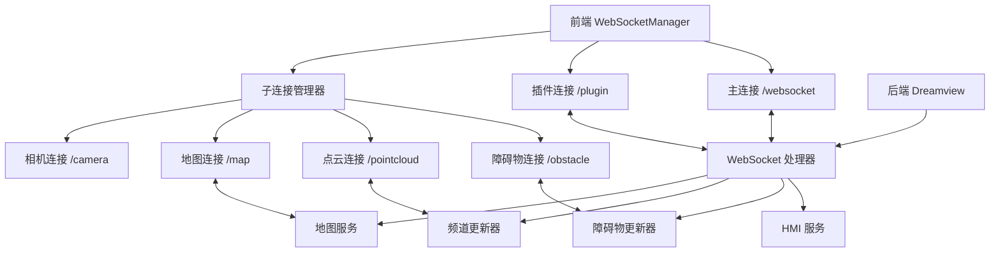

让我详细分析这个 Apollo Dreamview Plus 项目中使用的 React Hooks 和自定义 Hooks：


[7 tools called]

现在我来详细分析 Apollo Dreamview Plus 项目中使用的 React Hooks 和自定义 Hooks：

## Apollo Dreamview Plus 中的 React Hooks 和自定义 Hooks

### 1. **基础 React Hooks**

#### **1.1 状态管理 Hooks**
```typescript
// VehicleViz/index.tsx
import React, { useEffect, useState, useMemo, useRef, useCallback, useContext } from 'react';

// useState - 组件状态管理
const [currentView, setCurrentView] = useLocalStorageState(KEY_MANAGER.CurrentSwitchView, 'Default');
const [pointCloudVisible, setPointCloudVisible] = useState(
    getCurrentLayerParams().Perception.pointCloud.currentVisible
);

// useRef - DOM 引用和可变值
const routingTimeRef = useRef(-1);
const adcPositionRef = useRef([0, 0]);

// useMemo - 计算属性缓存
const layerParams = useMemo(() => {
    return getCurrentLayerParams();
}, [hmi.currentMode]);

// useCallback - 函数缓存
const handleLayerChange = useCallback((layerName: string, visible: boolean) => {
    // 处理层级变化
}, []);
```

#### **1.2 副作用 Hooks**
```typescript
// useEffect - 副作用处理
useEffect(() => {
    // 订阅数据流
    const subscription = streamApi?.subscribeToDataWithChannel(
        StreamDataNames.SIM_WORLD,
        hmi.currentChannel
    ).subscribe({
        next: (data: ISimulationWorld) => {
            // 处理数据
        }
    });
    
    return () => subscription?.unsubscribe();
}, [streamApi, hmi.currentChannel]);
```

#### **1.3 Context Hooks**
```typescript
// useContext - 上下文访问
const panelContext = usePanelContext();
const routerContext = useContext(RouterContext);
```

### 2. **自定义 Hooks**

#### **2.1 业务逻辑自定义 Hooks**

##### **useCarViz - 3D 渲染引擎管理**
```typescript
// hooks/useCarviz.ts
export default function useCarViz(): [Carviz, string] {
    const { tokens } = useThemeContext();
    const [uid] = useState(shortUUID.generate);
    const [carviz] = useState(() => new Carviz(uid));

    useEffect(() => {
        try {
            carviz?.updateColors(tokens.components.carViz);
            carviz.resetScence();
        } catch (err) {
            // 错误处理
        }
    }, [tokens]);

    return [carviz, uid];
}
```

**使用场景**：
- 管理 Three.js 3D 渲染引擎实例
- 处理主题颜色更新
- 提供唯一 ID 用于 DOM 元素标识

##### **useWebSocketServices - WebSocket 服务管理**
```typescript
// services/hooks/useWebSocketServices.ts
export default function useWebSocketServices(): useWebSocketServicesReturnType {
    const mainApiIns = useMainApi();
    const streamApiIns = useStreamApi();
    const pluginApiIns = usePluginApi();
    const otherApiIns = useOtherApi();
    const [metadata, setMetaData] = useMetadata();
    const webSocketManager = useWebSocketManager();
    const eventHandlers = useEventHandlersContext();

    const [isMainConnected, setMainConnected] = useState(false);
    const [isPluginConnected, setPluginConnected] = useState(false);

    useEffect(() => {
        // 监听连接状态变化
        customizeSubs.getCustomizeEvent(CustomEventTypes.MainConnectedEvent).subscribe(() => {
            setMainConnected(webSocketManager.isMainConnected());
            setMetaData(webSocketManager.getMetadata());
        });
    }, []);

    return {
        isMainConnected,
        isPluginConnected,
        metadata,
        mainApi: mainApiIns,
        streamApi: streamApiIns,
        pluginApi: pluginApiIns,
        otherApi: otherApiIns,
        setMetaData,
    };
}
```

**使用场景**：
- 统一管理所有 WebSocket API 实例
- 监听连接状态变化
- 提供元数据管理

#### **2.2 状态管理自定义 Hooks**

##### **useRefState - 引用状态管理**
```typescript
// hooks/useRefState.ts
export default function useRefState<T>(propValue?: T): [MutableRefObject<T>, (state: T) => void] {
    const value = React.useRef<T>(propValue);
    const [, triggerStateChange] = useState<number>(0);

    const changeState = useCallback((state: T) => {
        value.current = state;
        triggerStateChange((prev) => prev + 1);  // 触发重新渲染
    }, []);

    return [value, changeState];
}
```

**使用场景**：
- 需要保持引用但又要触发重新渲染的场景
- 避免闭包陷阱
- 性能优化

##### **useLocalStorageState - 本地存储状态**
```typescript
// util/storageManager/useLocalStorage.tsx
export function useLocalStorageState<T>(propKey: string, defaultVal?: T, version?: string) {
    const storageManager = useLocalStorage(propKey, version);
    const [state, setState] = useState(() => storageManager.get() || defaultVal);

    const mySetState = useCallback((val: T | ((prop: T) => T), timeout?: number) => {
        if (typeof val === 'function') {
            setState((prev: T) => {
                const next = (val as (propVal: T) => T)(prev);
                storageManager.set(next, { timeout });
                return next;
            });
        } else {
            storageManager.set(val, { timeout });
            setState(val);
        }
    }, []);

    return useMemo(() => [state, mySetState], [state, mySetState]);
}
```

**使用场景**：
- 持久化组件状态到本地存储
- 支持版本控制和过期时间
- 自动同步状态和存储

#### **2.3 事件处理自定义 Hooks**

##### **useCustomSubcribe - 自定义事件订阅**
```typescript
// hooks/useCustomSubcribe.ts
export default function useCustomSubcribe(eventName: string, subscribeCallback: (data: any) => void) {
    const eventHandlers = useEventHandlersContext();
    const { customizeSubs } = eventHandlers;
    const eventRef = useRef<CustomizeEvent>();

    useEffect(() => {
        eventRef.current = customizeSubs.getCustomizeEvent(eventName);
        if (eventRef.current) {
            eventRef.current.subscribe(subscribeCallback);
        }

        return () => {
            if (eventRef.current) {
                eventRef.current.removeSubscribe();
            }
        };
    }, []);

    return eventRef.current;
}
```

**使用场景**：
- 订阅自定义事件
- 自动清理订阅
- 避免内存泄漏

#### **2.4 Store 相关自定义 Hooks**

##### **useObstacleStore - 障碍物状态管理**
```typescript
// store/ObstacleStore/index.tsx
export const useObstacleStore = () => {
    const context = useContext(ObstacleContext);
    if (!context) {
        throw new Error('useObstacleStore must be used within a ObstacleProvider');
    }
    return context;
};
```

**使用场景**：
- 访问障碍物状态
- 获取障碍物服务实例
- 触发障碍物相关操作

##### **usePickHmiStore - HMI 状态选择**
```typescript
// store/HmiStore/index.tsx
export function usePickHmiStore(): [IInitState, (action: CombineAction) => void] {
    const [state, dispatch] = useHmiStore();
    
    return [state, dispatch];
}
```

**使用场景**：
- 访问 HMI 全局状态
- 触发 HMI 相关操作
- 状态订阅和更新

### 3. **Hooks 使用模式总结**

#### **3.1 分层架构中的 Hooks 使用**
```typescript
// UI Layer - 组件中使用 Hooks
function VehicleViz() {
    // 1. 状态管理 Hooks
    const [state, dispatch] = usePickHmiStore();
    
    // 2. 服务 Hooks
    const { streamApi, isMainConnected } = useWebSocketServices();
    
    // 3. 业务逻辑 Hooks
    const [carviz, uid] = useCarViz();
    
    // 4. 存储 Hooks
    const [currentView, setCurrentView] = useLocalStorageState(KEY_MANAGER.CurrentSwitchView, 'Default');
    
    // 5. 事件 Hooks
    const customEvent = useCustomSubcribe('customEvent', handleEvent);
}
```

#### **3.2 性能优化模式**
```typescript
// 使用 useMemo 缓存计算结果
const layerParams = useMemo(() => {
    return getCurrentLayerParams();
}, [hmi.currentMode]);

// 使用 useCallback 缓存函数
const handleLayerChange = useCallback((layerName: string, visible: boolean) => {
    // 处理逻辑
}, [dependencies]);

// 使用 useRef 避免不必要的重新渲染
const routingTimeRef = useRef(-1);
```

这个项目充分利用了 React Hooks 的优势，通过自定义 Hooks 实现了：
- **关注点分离**：每个 Hook 负责特定功能
- **代码复用**：自定义 Hooks 可在多个组件中复用
- **状态管理**：统一的状态管理模式
- **性能优化**：合理的缓存和优化策略

这是一个很好的问题！让我详细解释为什么 Apollo Dreamview Plus 项目要使用自定义 Hooks 而不是直接使用 React Hooks：

## 为什么使用自定义 Hooks 而不是直接使用 React Hooks？

### 1. **业务逻辑封装和复用**

#### **1.1 直接使用 React Hooks 的问题**
```typescript
// 如果直接使用 React Hooks，每个组件都要重复写相同的逻辑
function VehicleViz() {
    // 每个组件都要重复这些逻辑
    const [carviz] = useState(() => new Carviz());
    const { tokens } = useThemeContext();
    
    useEffect(() => {
        carviz?.updateColors(tokens.components.carViz);
        carviz.resetScence();
    }, [tokens]);
    
    // 更多重复逻辑...
}

function MapPanel() {
    // 又要重复写相同的逻辑
    const [carviz] = useState(() => new Carviz());
    const { tokens } = useThemeContext();
    
    useEffect(() => {
        carviz?.updateColors(tokens.components.carViz);
        carviz.resetScence();
    }, [tokens]);
    
    // 重复代码...
}
```

#### **1.2 使用自定义 Hooks 的优势**
```typescript
// 自定义 Hook 封装业务逻辑
function useCarViz(): [Carviz, string] {
    const { tokens } = useThemeContext();
    const [uid] = useState(shortUUID.generate);
    const [carviz] = useState(() => new Carviz(uid));

    useEffect(() => {
        try {
            carviz?.updateColors(tokens.components.carViz);
            carviz.resetScence();
        } catch (err) {
            // 统一错误处理
        }
    }, [tokens]);

    return [carviz, uid];
}

// 组件中直接使用，代码简洁
function VehicleViz() {
    const [carviz, uid] = useCarViz(); // 一行代码搞定
    // 其他业务逻辑...
}

function MapPanel() {
    const [carviz, uid] = useCarViz(); // 复用相同的逻辑
    // 其他业务逻辑...
}
```

### 2. **复杂状态管理的简化**

#### **2.1 WebSocket 服务管理的复杂性**
```typescript
// 如果直接使用 React Hooks，代码会非常复杂
function SomeComponent() {
    const mainApiIns = useMainApi();
    const streamApiIns = useStreamApi();
    const pluginApiIns = usePluginApi();
    const otherApiIns = useOtherApi();
    const [metadata, setMetaData] = useMetadata();
    const webSocketManager = useWebSocketManager();
    const eventHandlers = useEventHandlersContext();
    const { customizeSubs } = eventHandlers;
    
    const [isMainConnected, setMainConnected] = useState(false);
    const [isPluginConnected, setPluginConnected] = useState(false);
    
    useEffect(() => {
        // 复杂的订阅逻辑
        customizeSubs.getCustomizeEvent(CustomEventTypes.MainConnectedEvent).subscribe(() => {
            setMainConnected(webSocketManager.isMainConnected());
            setMetaData(webSocketManager.getMetadata());
        });
        
        customizeSubs.getCustomizeEvent(CustomEventTypes.PluginConnectedEvent).subscribe(() => {
            setPluginConnected(webSocketManager.isPluginConnected());
        });
        
        return () => {
            setMainConnected(false);
            setPluginConnected(false);
        };
    }, [customizeSubs, webSocketManager]);
    
    // 每个组件都要写这么多代码...
}
```

#### **2.2 自定义 Hook 的简化**
```typescript
// 自定义 Hook 封装复杂逻辑
export default function useWebSocketServices() {
    // 内部处理所有复杂逻辑
    const mainApiIns = useMainApi();
    const streamApiIns = useStreamApi();
    // ... 其他复杂逻辑
    
    return {
        isMainConnected,
        isPluginConnected,
        metadata,
        mainApi: mainApiIns,
        streamApi: streamApiIns,
        // ... 其他返回值
    };
}

// 组件使用变得非常简单
function SomeComponent() {
    const { streamApi, isMainConnected, metadata } = useWebSocketServices();
    // 只需要关注业务逻辑，不需要关心 WebSocket 的复杂实现
}
```

### 3. **错误处理和边界情况的统一管理**

#### **3.1 直接使用 React Hooks 的问题**
```typescript
function Component1() {
    const [carviz] = useState(() => new Carviz());
    const { tokens } = useThemeContext();
    
    useEffect(() => {
        try {
            carviz?.updateColors(tokens.components.carViz);
            carviz.resetScence();
        } catch (err) {
            console.error('Component1 error:', err); // 每个组件都要处理错误
        }
    }, [tokens]);
}

function Component2() {
    const [carviz] = useState(() => new Carviz());
    const { tokens } = useThemeContext();
    
    useEffect(() => {
        try {
            carviz?.updateColors(tokens.components.carViz);
            carviz.resetScence();
        } catch (err) {
            console.error('Component2 error:', err); // 重复的错误处理
        }
    }, [tokens]);
}
```

#### **3.2 自定义 Hook 的统一错误处理**
```typescript
function useCarViz(): [Carviz, string] {
    const { tokens } = useThemeContext();
    const [uid] = useState(shortUUID.generate);
    const [carviz] = useState(() => new Carviz(uid));

    useEffect(() => {
        try {
            carviz?.updateColors(tokens.components.carViz);
            carviz.resetScence();
        } catch (err) {
            // 统一的错误处理逻辑
            logger.error('CarViz initialization failed:', err);
            // 可以添加重试逻辑、降级处理等
        }
    }, [tokens]);

    return [carviz, uid];
}
```

### 4. **API 抽象和接口统一**

#### **4.1 直接使用 React Hooks 的接口混乱**
```typescript
// 不同组件可能返回不同的接口
function Component1() {
    const mainApi = useMainApi();
    const streamApi = useStreamApi();
    return { mainApi, streamApi }; // 接口不统一
}

function Component2() {
    const mainApi = useMainApi();
    const pluginApi = usePluginApi();
    return { mainApi, pluginApi }; // 接口不一致
}
```

#### **4.2 自定义 Hook 的统一接口**
```typescript
// 统一的接口定义
type useWebSocketServicesReturnType = {
    isMainConnected: boolean;
    isPluginConnected: boolean;
    metadata: MetadataItem[];
    mainApi: Nullable<MainApi>;
    pluginApi: Nullable<PluginApi>;
    streamApi: Nullable<StreamApi>;
    otherApi: Nullable<OtherApi>;
    setMetaData: (metadata: MetadataItem[]) => void;
};

// 所有组件都使用相同的接口
function Component1() {
    const services = useWebSocketServices(); // 统一接口
}

function Component2() {
    const services = useWebSocketServices(); // 相同接口
}
```

### 5. **测试和维护的便利性**

#### **5.1 直接使用 React Hooks 的测试困难**
```typescript
// 测试组件时，需要模拟所有依赖
function testComponent() {
    // 需要模拟 useMainApi, useStreamApi, usePluginApi 等
    // 测试逻辑复杂，难以隔离
}
```

#### **5.2 自定义 Hook 的测试便利**
```typescript
// 可以单独测试自定义 Hook
function testUseWebSocketServices() {
    // 只需要测试 useWebSocketServices 的逻辑
    // 更容易模拟和隔离
}

// 组件测试变得简单
function testComponent() {
    // 只需要模拟 useWebSocketServices 的返回值
    // 测试更专注，更容易维护
}
```

### 6. **性能优化和缓存策略**

#### **6.1 自定义 Hook 可以内置优化**
```typescript
function useLocalStorageState<T>(propKey: string, defaultVal?: T, version?: string) {
    const storageManager = useLocalStorage(propKey, version);
    const [state, setState] = useState(() => storageManager.get() || defaultVal);

    // 内置的优化策略
    const mySetState = useCallback((val: T | ((prop: T) => T), timeout?: number) => {
        // 批量更新、防抖等优化逻辑
        if (typeof val === 'function') {
            setState((prev: T) => {
                const next = (val as (propVal: T) => T)(prev);
                storageManager.set(next, { timeout });
                return next;
            });
        } else {
            storageManager.set(val, { timeout });
            setState(val);
        }
    }, []);

    // 使用 useMemo 优化返回值
    return useMemo(() => [state, mySetState], [state, mySetState]);
}
```

## 总结

自定义 Hooks 相比直接使用 React Hooks 的优势：

1. **代码复用**：避免重复代码，提高开发效率
2. **逻辑封装**：将复杂业务逻辑封装在自定义 Hook 中
3. **接口统一**：提供一致的 API 接口
4. **错误处理**：统一的错误处理和边界情况管理
5. **易于测试**：可以单独测试业务逻辑
6. **性能优化**：内置优化策略，如缓存、防抖等
7. **维护性**：修改业务逻辑时只需要修改自定义 Hook
8. **可读性**：组件代码更简洁，专注于 UI 逻辑

这就是为什么 Apollo Dreamview Plus 项目大量使用自定义 Hooks 的原因 - 它们提供了更好的代码组织、复用性和维护性。

## Apollo Dreamview Plus 中的 React Hooks 和自定义 Hooks

### 1. **基础 React Hooks**

#### **1.1 状态管理 Hooks**

```typescript
// VehicleViz/index.tsx
import React, { useEffect, useState, useMemo, useRef, useCallback, useContext } from 'react';

// useState - 组件状态管理
const [currentView, setCurrentView] = useLocalStorageState(KEY_MANAGER.CurrentSwitchView, 'Default');
const [pointCloudVisible, setPointCloudVisible] = useState(
    getCurrentLayerParams().Perception.pointCloud.currentVisible
);

// useRef - DOM 引用和可变值
const routingTimeRef = useRef(-1);
const adcPositionRef = useRef([0, 0]);

// useMemo - 计算属性缓存
const layerParams = useMemo(() => {
    return getCurrentLayerParams();
}, [hmi.currentMode]);

// useCallback - 函数缓存
const handleLayerChange = useCallback((layerName: string, visible: boolean) => {
    // 处理层级变化
}, []);
```

#### **1.2 副作用 Hooks**

```typescript
// useEffect - 副作用处理
useEffect(() => {
    // 订阅数据流
    const subscription = streamApi?.subscribeToDataWithChannel(
        StreamDataNames.SIM_WORLD,
        hmi.currentChannel
    ).subscribe({
        next: (data: ISimulationWorld) => {
            // 处理数据
        }
    });
    
    return () => subscription?.unsubscribe();
}, [streamApi, hmi.currentChannel]);
```

#### **1.3 Context Hooks**

```typescript
// useContext - 上下文访问
const panelContext = usePanelContext();
const routerContext = useContext(RouterContext);
```

### 2. **自定义 Hooks**

#### **2.1 业务逻辑自定义 Hooks**

##### **useCarViz - 3D 渲染引擎管理**

```typescript
// hooks/useCarviz.ts
export default function useCarViz(): [Carviz, string] {
    const { tokens } = useThemeContext();
    const [uid] = useState(shortUUID.generate);
    const [carviz] = useState(() => new Carviz(uid));

    useEffect(() => {
        try {
            carviz?.updateColors(tokens.components.carViz);
            carviz.resetScence();
        } catch (err) {
            // 错误处理
        }
    }, [tokens]);

    return [carviz, uid];
}
```

**使用场景**：

- 管理 Three.js 3D 渲染引擎实例
- 处理主题颜色更新
- 提供唯一 ID 用于 DOM 元素标识

##### **useWebSocketServices - WebSocket 服务管理**

```typescript
// services/hooks/useWebSocketServices.ts
export default function useWebSocketServices(): useWebSocketServicesReturnType {
    const mainApiIns = useMainApi();
    const streamApiIns = useStreamApi();
    const pluginApiIns = usePluginApi();
    const otherApiIns = useOtherApi();
    const [metadata, setMetaData] = useMetadata();
    const webSocketManager = useWebSocketManager();
    const eventHandlers = useEventHandlersContext();

    const [isMainConnected, setMainConnected] = useState(false);
    const [isPluginConnected, setPluginConnected] = useState(false);

    useEffect(() => {
        // 监听连接状态变化
        customizeSubs.getCustomizeEvent(CustomEventTypes.MainConnectedEvent).subscribe(() => {
            setMainConnected(webSocketManager.isMainConnected());
            setMetaData(webSocketManager.getMetadata());
        });
    }, []);

    return {
        isMainConnected,
        isPluginConnected,
        metadata,
        mainApi: mainApiIns,
        streamApi: streamApiIns,
        pluginApi: pluginApiIns,
        otherApi: otherApiIns,
        setMetaData,
    };
}
```

**使用场景**：

- 统一管理所有 WebSocket API 实例
- 监听连接状态变化
- 提供元数据管理

#### **2.2 状态管理自定义 Hooks**

##### **useRefState - 引用状态管理**

```typescript
// hooks/useRefState.ts
export default function useRefState<T>(propValue?: T): [MutableRefObject<T>, (state: T) => void] {
    const value = React.useRef<T>(propValue);
    const [, triggerStateChange] = useState<number>(0);

    const changeState = useCallback((state: T) => {
        value.current = state;
        triggerStateChange((prev) => prev + 1);  // 触发重新渲染
    }, []);

    return [value, changeState];
}
```

**使用场景**：

- 需要保持引用但又要触发重新渲染的场景
- 避免闭包陷阱
- 性能优化

##### **useLocalStorageState - 本地存储状态**

```typescript
// util/storageManager/useLocalStorage.tsx
export function useLocalStorageState<T>(propKey: string, defaultVal?: T, version?: string) {
    const storageManager = useLocalStorage(propKey, version);
    const [state, setState] = useState(() => storageManager.get() || defaultVal);

    const mySetState = useCallback((val: T | ((prop: T) => T), timeout?: number) => {
        if (typeof val === 'function') {
            setState((prev: T) => {
                const next = (val as (propVal: T) => T)(prev);
                storageManager.set(next, { timeout });
                return next;
            });
        } else {
            storageManager.set(val, { timeout });
            setState(val);
        }
    }, []);

    return useMemo(() => [state, mySetState], [state, mySetState]);
}
```

**使用场景**：

- 持久化组件状态到本地存储
- 支持版本控制和过期时间
- 自动同步状态和存储

#### **2.3 事件处理自定义 Hooks**

##### **useCustomSubcribe - 自定义事件订阅**

```typescript
// hooks/useCustomSubcribe.ts
export default function useCustomSubcribe(eventName: string, subscribeCallback: (data: any) => void) {
    const eventHandlers = useEventHandlersContext();
    const { customizeSubs } = eventHandlers;
    const eventRef = useRef<CustomizeEvent>();

    useEffect(() => {
        eventRef.current = customizeSubs.getCustomizeEvent(eventName);
        if (eventRef.current) {
            eventRef.current.subscribe(subscribeCallback);
        }

        return () => {
            if (eventRef.current) {
                eventRef.current.removeSubscribe();
            }
        };
    }, []);

    return eventRef.current;
}
```

**使用场景**：

- 订阅自定义事件
- 自动清理订阅
- 避免内存泄漏

#### **2.4 Store 相关自定义 Hooks**

##### **useObstacleStore - 障碍物状态管理**

```typescript
// store/ObstacleStore/index.tsx
export const useObstacleStore = () => {
    const context = useContext(ObstacleContext);
    if (!context) {
        throw new Error('useObstacleStore must be used within a ObstacleProvider');
    }
    return context;
};
```

**使用场景**：

- 访问障碍物状态
- 获取障碍物服务实例
- 触发障碍物相关操作

##### **usePickHmiStore - HMI 状态选择**

```typescript
// store/HmiStore/index.tsx
export function usePickHmiStore(): [IInitState, (action: CombineAction) => void] {
    const [state, dispatch] = useHmiStore();
    
    return [state, dispatch];
}
```

**使用场景**：

- 访问 HMI 全局状态
- 触发 HMI 相关操作
- 状态订阅和更新

### 3. **Hooks 使用模式总结**

#### **3.1 分层架构中的 Hooks 使用**

```typescript
// UI Layer - 组件中使用 Hooks
function VehicleViz() {
    // 1. 状态管理 Hooks
    const [state, dispatch] = usePickHmiStore();
    
    // 2. 服务 Hooks
    const { streamApi, isMainConnected } = useWebSocketServices();
    
    // 3. 业务逻辑 Hooks
    const [carviz, uid] = useCarViz();
    
    // 4. 存储 Hooks
    const [currentView, setCurrentView] = useLocalStorageState(KEY_MANAGER.CurrentSwitchView, 'Default');
    
    // 5. 事件 Hooks
    const customEvent = useCustomSubcribe('customEvent', handleEvent);
}
```

#### **3.2 性能优化模式**

```typescript
// 使用 useMemo 缓存计算结果
const layerParams = useMemo(() => {
    return getCurrentLayerParams();
}, [hmi.currentMode]);

// 使用 useCallback 缓存函数
const handleLayerChange = useCallback((layerName: string, visible: boolean) => {
    // 处理逻辑
}, [dependencies]);

// 使用 useRef 避免不必要的重新渲染
const routingTimeRef = useRef(-1);
```

这个项目充分利用了 React Hooks 的优势，通过自定义 Hooks 实现了：

- **关注点分离**：每个 Hook 负责特定功能
- **代码复用**：自定义 Hooks 可在多个组件中复用
- **状态管理**：统一的状态管理模式
- **性能优化**：合理的缓存和优化策略

这是一个很好的问题！让我详细解释为什么 Apollo Dreamview Plus 项目要使用自定义 Hooks 而不是直接使用 React Hooks：

## 为什么使用自定义 Hooks 而不是直接使用 React Hooks？

### 1. **业务逻辑封装和复用**

#### **1.1 直接使用 React Hooks 的问题**

```typescript
// 如果直接使用 React Hooks，每个组件都要重复写相同的逻辑
function VehicleViz() {
    // 每个组件都要重复这些逻辑
    const [carviz] = useState(() => new Carviz());
    const { tokens } = useThemeContext();
    
    useEffect(() => {
        carviz?.updateColors(tokens.components.carViz);
        carviz.resetScence();
    }, [tokens]);
    
    // 更多重复逻辑...
}

function MapPanel() {
    // 又要重复写相同的逻辑
    const [carviz] = useState(() => new Carviz());
    const { tokens } = useThemeContext();
    
    useEffect(() => {
        carviz?.updateColors(tokens.components.carViz);
        carviz.resetScence();
    }, [tokens]);
    
    // 重复代码...
}
```

#### **1.2 使用自定义 Hooks 的优势**

```typescript
// 自定义 Hook 封装业务逻辑
function useCarViz(): [Carviz, string] {
    const { tokens } = useThemeContext();
    const [uid] = useState(shortUUID.generate);
    const [carviz] = useState(() => new Carviz(uid));

    useEffect(() => {
        try {
            carviz?.updateColors(tokens.components.carViz);
            carviz.resetScence();
        } catch (err) {
            // 统一错误处理
        }
    }, [tokens]);

    return [carviz, uid];
}

// 组件中直接使用，代码简洁
function VehicleViz() {
    const [carviz, uid] = useCarViz(); // 一行代码搞定
    // 其他业务逻辑...
}

function MapPanel() {
    const [carviz, uid] = useCarViz(); // 复用相同的逻辑
    // 其他业务逻辑...
}
```

### 2. **复杂状态管理的简化**

#### **2.1 WebSocket 服务管理的复杂性**

```typescript
// 如果直接使用 React Hooks，代码会非常复杂
function SomeComponent() {
    const mainApiIns = useMainApi();
    const streamApiIns = useStreamApi();
    const pluginApiIns = usePluginApi();
    const otherApiIns = useOtherApi();
    const [metadata, setMetaData] = useMetadata();
    const webSocketManager = useWebSocketManager();
    const eventHandlers = useEventHandlersContext();
    const { customizeSubs } = eventHandlers;
    
    const [isMainConnected, setMainConnected] = useState(false);
    const [isPluginConnected, setPluginConnected] = useState(false);
    
    useEffect(() => {
        // 复杂的订阅逻辑
        customizeSubs.getCustomizeEvent(CustomEventTypes.MainConnectedEvent).subscribe(() => {
            setMainConnected(webSocketManager.isMainConnected());
            setMetaData(webSocketManager.getMetadata());
        });
        
        customizeSubs.getCustomizeEvent(CustomEventTypes.PluginConnectedEvent).subscribe(() => {
            setPluginConnected(webSocketManager.isPluginConnected());
        });
        
        return () => {
            setMainConnected(false);
            setPluginConnected(false);
        };
    }, [customizeSubs, webSocketManager]);
    
    // 每个组件都要写这么多代码...
}
```

#### **2.2 自定义 Hook 的简化**

```typescript
// 自定义 Hook 封装复杂逻辑
export default function useWebSocketServices() {
    // 内部处理所有复杂逻辑
    const mainApiIns = useMainApi();
    const streamApiIns = useStreamApi();
    // ... 其他复杂逻辑
    
    return {
        isMainConnected,
        isPluginConnected,
        metadata,
        mainApi: mainApiIns,
        streamApi: streamApiIns,
        // ... 其他返回值
    };
}

// 组件使用变得非常简单
function SomeComponent() {
    const { streamApi, isMainConnected, metadata } = useWebSocketServices();
    // 只需要关注业务逻辑，不需要关心 WebSocket 的复杂实现
}
```

### 3. **错误处理和边界情况的统一管理**

#### **3.1 直接使用 React Hooks 的问题**

```typescript
function Component1() {
    const [carviz] = useState(() => new Carviz());
    const { tokens } = useThemeContext();
    
    useEffect(() => {
        try {
            carviz?.updateColors(tokens.components.carViz);
            carviz.resetScence();
        } catch (err) {
            console.error('Component1 error:', err); // 每个组件都要处理错误
        }
    }, [tokens]);
}

function Component2() {
    const [carviz] = useState(() => new Carviz());
    const { tokens } = useThemeContext();
    
    useEffect(() => {
        try {
            carviz?.updateColors(tokens.components.carViz);
            carviz.resetScence();
        } catch (err) {
            console.error('Component2 error:', err); // 重复的错误处理
        }
    }, [tokens]);
}
```

#### **3.2 自定义 Hook 的统一错误处理**

```typescript
function useCarViz(): [Carviz, string] {
    const { tokens } = useThemeContext();
    const [uid] = useState(shortUUID.generate);
    const [carviz] = useState(() => new Carviz(uid));

    useEffect(() => {
        try {
            carviz?.updateColors(tokens.components.carViz);
            carviz.resetScence();
        } catch (err) {
            // 统一的错误处理逻辑
            logger.error('CarViz initialization failed:', err);
            // 可以添加重试逻辑、降级处理等
        }
    }, [tokens]);

    return [carviz, uid];
}
```

### 4. **API 抽象和接口统一**

#### **4.1 直接使用 React Hooks 的接口混乱**

```typescript
// 不同组件可能返回不同的接口
function Component1() {
    const mainApi = useMainApi();
    const streamApi = useStreamApi();
    return { mainApi, streamApi }; // 接口不统一
}

function Component2() {
    const mainApi = useMainApi();
    const pluginApi = usePluginApi();
    return { mainApi, pluginApi }; // 接口不一致
}
```

#### **4.2 自定义 Hook 的统一接口**

```typescript
// 统一的接口定义
type useWebSocketServicesReturnType = {
    isMainConnected: boolean;
    isPluginConnected: boolean;
    metadata: MetadataItem[];
    mainApi: Nullable<MainApi>;
    pluginApi: Nullable<PluginApi>;
    streamApi: Nullable<StreamApi>;
    otherApi: Nullable<OtherApi>;
    setMetaData: (metadata: MetadataItem[]) => void;
};

// 所有组件都使用相同的接口
function Component1() {
    const services = useWebSocketServices(); // 统一接口
}

function Component2() {
    const services = useWebSocketServices(); // 相同接口
}
```

### 5. **测试和维护的便利性**

#### **5.1 直接使用 React Hooks 的测试困难**

```typescript
// 测试组件时，需要模拟所有依赖
function testComponent() {
    // 需要模拟 useMainApi, useStreamApi, usePluginApi 等
    // 测试逻辑复杂，难以隔离
}
```

#### **5.2 自定义 Hook 的测试便利**

```typescript
// 可以单独测试自定义 Hook
function testUseWebSocketServices() {
    // 只需要测试 useWebSocketServices 的逻辑
    // 更容易模拟和隔离
}

// 组件测试变得简单
function testComponent() {
    // 只需要模拟 useWebSocketServices 的返回值
    // 测试更专注，更容易维护
}
```

### 6. **性能优化和缓存策略**

#### **6.1 自定义 Hook 可以内置优化**

```typescript
function useLocalStorageState<T>(propKey: string, defaultVal?: T, version?: string) {
    const storageManager = useLocalStorage(propKey, version);
    const [state, setState] = useState(() => storageManager.get() || defaultVal);

    // 内置的优化策略
    const mySetState = useCallback((val: T | ((prop: T) => T), timeout?: number) => {
        // 批量更新、防抖等优化逻辑
        if (typeof val === 'function') {
            setState((prev: T) => {
                const next = (val as (propVal: T) => T)(prev);
                storageManager.set(next, { timeout });
                return next;
            });
        } else {
            storageManager.set(val, { timeout });
            setState(val);
        }
    }, []);

    // 使用 useMemo 优化返回值
    return useMemo(() => [state, mySetState], [state, mySetState]);
}
```

## 总结

自定义 Hooks 相比直接使用 React Hooks 的优势：

1. **代码复用**：避免重复代码，提高开发效率
2. **逻辑封装**：将复杂业务逻辑封装在自定义 Hook 中
3. **接口统一**：提供一致的 API 接口
4. **错误处理**：统一的错误处理和边界情况管理
5. **易于测试**：可以单独测试业务逻辑
6. **性能优化**：内置优化策略，如缓存、防抖等
7. **维护性**：修改业务逻辑时只需要修改自定义 Hook
8. **可读性**：组件代码更简洁，专注于 UI 逻辑

这就是为什么 Apollo Dreamview Plus 项目大量使用自定义 Hooks 的原因 - 它们提供了更好的代码组织、复用性和维护性。

让我详细总结 Apollo Dreamview Plus 前端和后端的主要功能以及交互流程，特别是流推送机制：


[3 tools called]

现在我来详细总结 Apollo Dreamview Plus 前端和后端的主要功能以及交互流程，特别是流推送机制：

## Apollo Dreamview Plus 前后端功能与交互流程总结

### 1. **后端主要功能**

#### **1.1 核心服务架构**
```cpp
// backend/dreamview.cc - 后端初始化
class Dreamview {
    // WebSocket 处理器
    std::unique_ptr<WebSocketHandler> websocket_;      // 主连接 /websocket
    std::unique_ptr<WebSocketHandler> map_ws_;          // 地图数据 /map
    std::unique_ptr<WebSocketHandler> point_cloud_ws_; // 点云数据 /pointcloud
    std::unique_ptr<WebSocketHandler> camera_ws_;      // 相机数据 /camera
    std::unique_ptr<WebSocketHandler> plugin_ws_;      // 插件通信 /plugin
    std::unique_ptr<WebSocketHandler> hmi_ws_;         // HMI 状态 /hmi
    std::unique_ptr<WebSocketHandler> sim_world_ws_;   // 仿真世界 /simworld
    std::unique_ptr<WebSocketHandler> obstacle_ws_;    // 障碍物数据 /obstacle
    
    // 业务服务
    std::unique_ptr<HMI> hmi_;                         // HMI 管理
    std::unique_ptr<MapService> map_service_;          // 地图服务
    std::unique_ptr<ObstacleUpdater> obstacle_updater_; // 障碍物更新器
    std::unique_ptr<ChannelsUpdater> channels_updater_; // 频道更新器
};
```

#### **1.2 主要功能模块**

##### **A. HMI 管理服务**
```cpp
// HMI 服务功能
class HMI {
    // 模式管理
    void ChangeMode(const std::string& mode);
    void ChangeVehicle(const std::string& vehicle);
    void ChangeMap(const std::string& map);
    
    // 状态推送
    void PublishMessage(const std::string& channel_name);
    void RegisterStatusUpdateHandler(StatusUpdateHandler handler);
    
    // 动作处理
    bool HandleHMIAction(const HMIAction& action);
};
```

##### **B. 数据流推送服务**
```cpp
// 障碍物数据推送
class ObstacleUpdater {
    void PublishMessage(const std::string& channel_name) {
        // 1. 获取障碍物数据
        std::string obstacle_data;
        GetObjects(&obstacle_data, channel_name);
        
        // 2. 封装为 StreamData
        StreamData stream_data;
        stream_data.set_action("stream");
        stream_data.set_data_name("obstacle");
        stream_data.set_data(obstacle_data);
        stream_data.set_channel_name(channel_name);
        
        // 3. 序列化并推送
        std::string serialized_data;
        stream_data.SerializeToString(&serialized_data);
        websocket_->BroadcastBinaryData(serialized_data);
    }
};
```

##### **C. WebSocket 处理器**
```cpp
// WebSocket 消息处理
class WebSocketHandler {
    // 处理 JSON 数据
    bool handleJsonData(Connection* conn, const std::string& data) {
        Json json = Json::parse(data);
        std::string action = json["action"];
        
        if (action == "subscribe") {
            // 处理订阅请求
            HandleSubscribeRequest(json);
        } else if (action == "unsubscribe") {
            // 处理取消订阅
            HandleUnsubscribeRequest(json);
        }
        return true;
    }
    
    // 处理二进制数据
    bool handleBinaryData(Connection* conn, const std::string& data) {
        // 处理 protobuf 二进制数据
        return true;
    }
    
    // 广播数据
    bool BroadcastData(const std::string& data, bool skippable = false);
    bool BroadcastBinaryData(const std::string& data, bool skippable = false);
};
```

### 2. **前端主要功能**

#### **2.1 核心架构**
```typescript
// WebSocketManager - 前端连接管理
export class WebSocketManager {
    readonly mainConnection: WebSocketConnection;      // 主连接 /websocket
    private readonly pluginConnection: WebSocketConnection;  // 插件连接 /plugin
    private readonly childWsManager: ChildWsManager;   // 子连接管理器
    
    // 数据订阅管理
    private dataSubjects: Map<string, CountedSubject<any>>;
    private pluginManager: PluginManager;
    
    // 连接管理
    private connectionManager: ConnectionManager;
}
```

#### **2.2 主要功能模块**

##### **A. 数据订阅服务**
```typescript
// 数据订阅功能
export class StreamApi {
    subscribeToData<T>(name: string, option?: any): CountedSubject<T> {
        // 1. 初始化子 WebSocket 连接
        this.initChildSocket(name);
        
        // 2. 创建数据主题
        if (!this.dataSubjects.getByExactKey({ name })) {
            this.dataSubjects.set({ name }, new CountedSubject(name));
            this.sendSubscriptionMessage(RequestMessageActionEnum.SUBSCRIBE_MESSAGE_TYPE, name, null, option);
        }
        
        // 3. 返回可观察对象
        return this.dataSubjects.getByExactKey({ name });
    }
    
    subscribeToDataWithChannel<T>(name: string, channelName: string): CountedSubject<T> {
        // 支持多频道订阅
        return this.subscribeToData<T>(name, { channelName });
    }
}
```

##### **B. 状态管理服务**
```typescript
// HMI 状态管理
export const useHmiStore = () => {
    const [state, dispatch] = useStore();
    
    // 状态更新
    const updateStatus = (status: HMIStatus) => {
        dispatch({ type: 'UPDATE_STATUS', payload: status });
    };
    
    // 模式切换
    const changeMode = (mode: string) => {
        dispatch({ type: 'CHANGE_MODE', payload: mode });
    };
    
    return { state, updateStatus, changeMode };
};
```

##### **C. 3D 渲染服务**
```typescript
// 3D 渲染引擎
export class Carviz {
    private scene: THREE.Scene;
    private renderer: THREE.WebGLRenderer;
    private camera: THREE.PerspectiveCamera;
    
    // 渲染模块
    public map: Map;
    public obstacles: Obstacles;
    public pointCloud: PointCloud;
    public decision: Decision;
    public planning: Planning;
    
    // 数据更新
    updateData(dataName: string, data: any) {
        switch (dataName) {
            case 'obstacle':
                this.obstacles.update(data);
                break;
            case 'map':
                this.map.update(data);
                break;
            // ... 其他数据类型
        }
    }
}
```

### 3. **流推送交互流程**

#### **3.1 整体架构图**



#### **3.2 详细交互流程**

##### **A. 连接建立流程**
```typescript
// 1. 前端初始化连接
const webSocketManager = new WebSocketManager();

// 2. 建立主连接
webSocketManager.mainConnection.connect('/websocket');

// 3. 建立插件连接
webSocketManager.pluginConnection.connect('/plugin');

// 4. 后端注册处理器
server_->addWebSocketHandler("/websocket", *websocket_);
server_->addWebSocketHandler("/plugin", *plugin_ws_);
server_->addWebSocketHandler("/obstacle", *obstacle_ws_);
```

##### **B. 数据订阅流程**
```typescript
// 1. 前端发起订阅
const subscription = streamApi.subscribeToData('obstacle', { channelName: 'perception' });

// 2. 发送订阅消息
webSocketManager.sendSubscriptionMessage('subscribe', 'obstacle', { channelName: 'perception' });

// 3. 后端处理订阅
bool WebSocketHandler::handleJsonData(Connection* conn, const std::string& data) {
    Json json = Json::parse(data);
    if (json["action"] == "subscribe") {
        std::string dataName = json["dataName"];
        std::string channelName = json["channelName"];
        
        // 启动数据推送
        if (dataName == "obstacle") {
            obstacle_updater_->StartStream(100, channelName); // 100ms 间隔
        }
    }
}

// 4. 后端开始推送数据
void ObstacleUpdater::PublishMessage(const std::string& channel_name) {
    // 获取数据 -> 序列化 -> 推送
    StreamData stream_data;
    stream_data.set_action("stream");
    stream_data.set_data_name("obstacle");
    stream_data.set_data(obstacle_data);
    stream_data.set_channel_name(channel_name);
    
    std::string serialized_data;
    stream_data.SerializeToString(&serialized_data);
    websocket_->BroadcastBinaryData(serialized_data);
}
```

##### **C. 数据接收和处理流程**
```typescript
// 1. 前端接收数据
webSocketManager.mainConnection.onMessage = (data) => {
    // 2. 分发到子 Worker
    childWsManager.postMessage({
        type: 'deserialize',
        data: data,
        dataName: 'obstacle'
    });
};

// 3. 子 Worker 反序列化
class ChildWsWorkerClass {
    deserializer = (data: ArrayBuffer, name: string) => {
        if (data instanceof ArrayBuffer) {
            const arrayBuffer = new Uint8Array(data);
            return decodeStreamData(arrayBuffer); // protobuf 解码
        }
        return JSON.parse(data);
    };
}

// 4. 数据分发到组件
const subscription = streamApi.subscribeToData('obstacle').subscribe({
    next: (data: ObstacleData) => {
        // 更新 UI 状态
        dispatch({ type: 'SET_OBSTACLES', payload: data.obstacles });
        
        // 更新 3D 渲染
        carviz.obstacles.update(data.obstacles);
    },
    error: (error) => {
        console.error('Obstacle data error:', error);
    }
});
```

### 4. **关键特性总结**

#### **4.1 多连接架构**
- **主连接** (`/websocket`)：HMI 状态、核心数据流
- **插件连接** (`/plugin`)：API 请求、插件通信
- **子连接**：各种数据流（障碍物、点云、地图等）

#### **4.2 数据流特性**
- **实时推送**：后端主动推送数据到前端
- **多频道支持**：同一数据类型支持多个频道
- **二进制传输**：使用 protobuf 进行高效数据传输
- **Worker 处理**：前端使用 Worker 进行数据反序列化

#### **4.3 状态管理**
- **分层状态**：UI 状态、业务状态、连接状态分离
- **响应式更新**：基于 RxJS 的响应式数据流
- **本地缓存**：使用 IndexedDB 缓存 protobuf 文件

#### **4.4 性能优化**
- **连接复用**：多个数据流共享连接
- **数据压缩**：protobuf 二进制格式
- **异步处理**：Worker 线程处理数据反序列化
- **缓存策略**：本地缓存减少网络请求

这个架构设计实现了高效、实时的前后端数据交互，特别适合自动驾驶这种需要大量实时数据可视化的场景。


短结论：**可以用 Next.js 做 Dreamview Plus 的前端与“薄后端（BFF）”层**，但**不适合把重度实时流/高吞吐推送服务直接塞进 Next.js 的 Route Handler**。最佳做法是：**Next.js 负责 UI、鉴权、资产与配置下发、少量控制面 API；实时数据面（WS/QUIC/WebRTC）由独立的长连接服务承担**。这样既保留 Next.js 的生产力与生态，又避免其在长连接、低时延与资源隔离上的限制。

------

# 一、推荐架构蓝图

## 1) 前端（Next.js App Router）

- **UI/渲染**：React 客户端组件 + Three.js（Carviz）+ Web Workers（proto 解码 & 轻量计算）。
- **数据订阅层**：`WebSocketManager/StreamApi`（保留你现有的多路/子路由/计数订阅设计），在浏览器侧运行。
- **状态**：轻量全局 store（Zustand/Redux）+ RxJS（流式合并/背压）。
- **SSR 使用边界**：3D 画布页、重交互页**禁用 SSR**（`"use client"`），数据/配置页可用 RSC/SSR。
- **静态资产**：proto 描述文件、着色器、地图切片通过 Next 静态目录或 CDN 分发。
- **鉴权与凭证下发**：Next Server Actions / Route Handlers 仅做 **短生命周期签名/票据** 下发（例如 WS 连接 token、频道 ACL），**不承载实时流本身**。

## 2) 控制面（Next.js BFF）

- **Route Handlers（REST）**：模式切换、车辆/地图选择、会话创建、插件管理、任务触发等“控制类”动作。
- **中间件**：鉴权（JWT/Session）、A/B 开关、租户隔离。
- **缓存**：KV/Redis（会话、订阅计数、用户偏好）。
- **边缘/节点**：可用 Edge Runtime 做低延迟鉴权与重定向；**勿在 Edge 上跑高频二进制流**。

## 3) 数据面（独立实时服务）

- **协议**：优先 WebSocket；也可评估 **WebTransport (QUIC)** 或 **WebRTC DataChannel**（点云/相机流大、对抖动更鲁棒）。
- **实现**：独立进程/容器（Go、Rust、C++ 或 Node+uWebSockets.js），负责：
  - 多路主题/频道（obstacle、pointcloud、map、camera…）的**发布-订阅**；
  - **二进制 protobuf** 编解码、分片/打包、节流/背压；
  - 连接级/频道级 **ACL**；
  - **快照 + 增量**（避免全量反复推送）。
- **与感知/规划/仿真进程**接口：通过 Apollo Cyber or ROS2、或零拷贝共享内存/本地 PUB/SUB（如 NNG/ZeroMQ）。
- **部署**：与 Next.js 分开扩缩容；Nginx/Envoy 统一做 WS/QUIC 反向代理与 TLS。

------

# 二、流推送机制在 Next.js 方案中的落地

## A. 多连接还是一连接复用？

- **推荐单连接复用 + 应用层多路复用**（你的 `StreamData{action,data_name,channel_name,...}` 设计正合适）：
  - 1 条 WS 连接上按 `data_name/channel` 分发，减少 TCP 握手与心跳开销；
  - **关键通道（pointcloud/camera）**可单独升维为 **独立连接**（不同 QoS/带宽/优先级），或升级为 WebTransport/WebRTC。

## B. 前端管线（保持你现有思路）

1. **WS 收到 ArrayBuffer** → `postMessage(transfer)` 到 Worker（**Transferable**，零拷贝）。
2. Worker 用 **protobuf.js/wasm** 解码，做最小聚合/节流（例如 60→20 FPS）。
3. 主线程经 RxJS Subject 推给 Carviz：
   - 大对象使用 **struct-of-arrays**，减少 GC；
   - Three.js BufferAttributes 用 **`set()` + `needsUpdate=false` + partial update**。

## C. 背压与节流

- 服务器侧：**每连接发包速率上限**、**每频道队列深度**、**跳帧策略（skippable=true）**；
- 浏览器侧：基于 `requestAnimationFrame` 的**取样**（渲染帧率即订阅速率），过量帧丢弃；
- 点云/相机：支持 **LOD** 与 **按视域裁剪**；必要时传 **关键帧 + 增量**。

------

# 三、能否“全都放进 Next.js 后端”？

**不建议**。主要痛点：

1. **长连接与资源隔离**：Next.js Route Handlers（尤其在无状态/边缘环境）并不擅长管理**成千上万条**持久 WS 连接、细粒度节流与二进制高频推送。
2. **部署/扩缩容**：渲染页面与实时流的负载模式完全不同，绑在一起会互相拖累、调度不经济。
3. **Edge Runtime 限制**：运行时 API、原生模块、套接字能力受限；二进制/高频推送在边缘成本高、可调优空间小。
4. **性能抖动**：同一实例既跑 SSR/RSC 又跑大流量 WS，更容易引入 GC 抖动与尾延迟。

> 结论：**Next.js 做控制面 + UI**，实时流 **独立服务** 最稳。

------

# 四、关键挑战与对策

| 挑战              | 具体问题                           | 应对策略                                                     |
| ----------------- | ---------------------------------- | ------------------------------------------------------------ |
| 高吞吐二进制推送  | 点云/相机数据量巨大，JS 主线程阻塞 | **独立实时服务**；浏览器侧 **Worker + Transferable**；**protobuf wasm**；**快照+增量** |
| 背压与丢包        | 网络波动时延迟积累                 | 服务器**丢弃过期帧**（`skippable`）、**水位线**；客户端按帧率取样 |
| 多频道/多租户 ACL | 不同车、地图、模式的访问隔离       | 鉴权在 Next（JWT/OIDC）；实时服务 **连接时校验 token** + **频道级 ACL** |
| 3D 渲染性能       | Three.js 大量动态顶点/实例体       | **实例化渲染**、**SoA**、**partial buffer updates**、**GPU 粒子/点云** |
| SSR 与 RSC 限制   | WebGL/WS 只能在客户端              | 3D 页**禁用 SSR**；RSC 仅做静态/低频数据获取                 |
| 版本/协议演进     | proto 变更导致前后端不兼容         | **version 字段 + feature flags**；灰度发布；多版本解码       |
| 观测与调试        | 难定位抖动/卡顿                    | **指标**：每通道 FPS、落后帧数、解码耗时、GC；**火焰图**、**性能标记** |
| 部署              | 同域跨服务、TLS、反代              | Nginx/Envoy：`/api/*` → Next，`/stream/*` → Realtime；开启 **HTTP/2/3 + WS/QUIC** |

------

# 五、最小落地示意（方向性片段）

## 1) Next.js（控制面 Route Handler）

```ts
// app/api/session/route.ts
import { cookies } from 'next/headers';
import { sign } from './jwt';

export async function POST() {
  const user = /* auth check */;
  const token = await sign({ uid: user.id, scopes: ['obstacle:read','pointcloud:read'] }, { expiresIn: '10m' });
  // 返回实时服务的接入点与短期票据
  return Response.json({ wsBase: process.env.RT_WS_BASE, token });
}
```

## 2) 前端连接（浏览器侧）

```ts
// stream/StreamApi.ts
export class StreamApi {
  constructor(private wsBase: string, private token: string) {}

  connect(name: string, channel?: string) {
    const url = `${this.wsBase}/stream?name=${name}&channel=${channel ?? ''}&token=${this.token}`;
    const ws = new WebSocket(url);
    ws.binaryType = 'arraybuffer';
    ws.onmessage = (e) => worker.postMessage(e.data, [e.data as ArrayBuffer]); // transferable
    return ws;
  }
}
```

## 3) 实时服务（独立进程，伪码）

```ts
// ws_server.ts (独立服务)
wss.on('connection', (socket, req) => {
  const { name, channel, token } = parse(req.url);
  const claims = verify(token); // 来自 Next 下发
  enforceAcl(claims, name, channel);

  // 订阅底层总线并推送
  const sub = bus.subscribe({ name, channel }, (frame) => {
    const payload = encodeStreamData(frame, { skippable: true });
    if (socket.bufferedAmount < HIGH_WATERMARK) socket.send(payload, { binary: true });
    else /* drop or coalesce */;
  });

  socket.on('close', () => sub.close());
});
```

------

# 六、何时可以把 WS 放在 Next.js 里？

- **自托管 + Node 运行时 + 连接规模较小（例如 ≤ 数百）**：可以在 Next 自带 Node 运行时下用 `ws` 做 **小规模原型或内网工具**。
- **上生产/大规模**：仍建议拆分为独立实时服务（语言不限），由反向代理做统一入口。

------

# 七、总结

- **可行**：Next.js 很适合承载 **Dreamview 的 UI、控制面 API、鉴权与配置分发**。
- **不建议**：把**大规模、低时延、二进制实时流**直接放进 Next.js Route Handlers。
- **推荐**：**前端（Next） + 实时服务（独立 WS/QUIC）** 的解耦方案；沿用你现有的**多路复用、protobuf、Worker、RxJS、Carviz** 设计，并在服务器侧补齐背压、节流与 ACL。

如果你愿意，我可以把上面的方案整理成一张**体系架构图（PNG）** 和**部署拓扑（Nginx/Envoy 反代示例）**，再给一个**最小可运行模板（Next 项目 + WS 服务 docker-compose）**方便你直接起步。